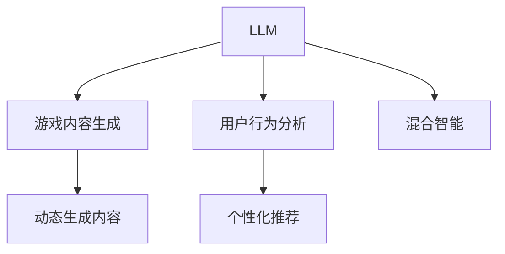

                 

# 游戏行业进化：LLM 带来动态、个性化体验

> 关键词：自然语言处理, 大规模语言模型, 游戏定制化, 动态生成内容, 用户行为分析, 个性化推荐

## 1. 背景介绍

### 1.1 问题由来
随着技术的不断进步，游戏行业的生态系统正在发生深刻变革。从PC、主机到手机，各种平台的多样化，从单人游戏到多人在线游戏，游戏类型和用户体验的多元化，都为游戏行业带来了前所未有的挑战和机遇。特别是在数字时代的背景下，用户对游戏内容的多样化、个性化和互动性提出了更高要求。传统的游戏内容制作模式，即游戏设计师根据游戏创意和故事线编写固定剧本，已经无法满足用户对动态、沉浸式体验的需求。

### 1.2 问题核心关键点
为了解决上述问题，游戏开发者亟需一种新型的内容生成技术，能够在运行时动态生成游戏内容，实现个性化推荐，为用户提供独特的游戏体验。近年来，自然语言处理(Natural Language Processing, NLP)技术的迅猛发展，特别是大规模语言模型（Large Language Models, LLMs）的出现，为游戏行业带来了全新的可能。通过集成LLM技术，游戏可以更好地理解玩家行为，生成动态的游戏内容和任务，从而实现更加个性化和动态的游戏体验。

### 1.3 问题研究意义
利用LLM技术，游戏开发者可以显著降低游戏内容的制作成本，快速迭代和优化游戏内容，提升玩家的游戏体验。特别是在开源游戏、独立游戏和小众游戏领域，LLM技术能够帮助开发者以更低的成本实现创意落地，推动游戏行业的健康发展。同时，LLM技术还可以为游戏厂商和运营者提供强大的数据分析工具，精准地了解用户需求，优化游戏策略，提高游戏的生命周期。

## 2. 核心概念与联系

### 2.1 核心概念概述

为更好地理解LLM在游戏行业中的应用，本节将介绍几个关键概念：

- 大规模语言模型（LLM）：一种基于Transformer架构的深度学习模型，通过在大规模文本语料上进行预训练，学习到丰富的语言知识和表达能力。
- 游戏内容生成：指在游戏运行时，根据玩家的行为和输入，动态生成游戏内容、对话、任务等，提升游戏的互动性和个性化。
- 用户行为分析：通过收集和分析玩家在游戏内的行为数据，如点击、拖拽、交谈等，理解玩家的需求和偏好。
- 个性化推荐：基于用户行为数据，推荐适合玩家的游戏内容、角色、道具等，提升玩家的游戏体验和黏性。
- 动态生成内容（DGC）：指根据玩家的行为和输入，实时生成或调整游戏内容，如对话、场景、任务等，实现游戏内容的动态更新。
- 混合智能：结合AI和游戏设计者的人工智能，共同参与游戏内容生成和决策，提升游戏智能水平和用户体验。

这些核心概念之间的逻辑关系可以通过以下Mermaid流程图来展示：



这个流程图展示了大语言模型在游戏内容生成、用户行为分析、个性化推荐等应用场景中的作用：

1. LLM学习玩家输入的文本信息，输出符合游戏规则和逻辑的动态内容。
2. 通过用户行为分析，LLM能够理解玩家的需求和行为模式，为个性化推荐提供依据。
3. 基于玩家的行为和输入，LLM生成动态内容，并与游戏设计者共同进行决策，实现混合智能。
4. 动态生成的内容经过个性化推荐，提升玩家的游戏体验和黏性。

## 3. 核心算法原理 & 具体操作步骤
### 3.1 算法原理概述

基于LLM的大规模游戏内容生成和个性化推荐，其核心思想是：利用预训练的LLM作为强大的"文本生成器"，根据玩家的行为和输入，实时生成或调整游戏内容，实现动态生成内容。同时，LLM结合用户行为分析，通过自然语言生成算法，生成个性化的推荐信息，提升玩家的游戏体验。

形式化地，假设游戏内的对话模块 $D$ 和任务模块 $T$，分别表示为一个自然语言处理模型 $D_{\theta_D}$ 和 $T_{\theta_T}$。在玩家输入的文本 $x_t$ 上，$D_{\theta_D}$ 和 $T_{\theta_T}$ 分别输出对话回复和任务信息。

通过训练模型 $D_{\theta_D}$ 和 $T_{\theta_T}$，使其能够根据玩家的行为和输入，生成符合游戏规则和逻辑的对话和任务。在玩家输入 $x_t$ 后，$D_{\theta_D}(x_t)$ 生成对话回复，$T_{\theta_T}(x_t)$ 生成任务信息，游戏模块根据这些信息进行动态更新。

### 3.2 算法步骤详解

基于LLM的大规模游戏内容生成和个性化推荐一般包括以下几个关键步骤：

**Step 1: 准备数据集和模型**
- 收集和预处理游戏内玩家行为数据，如点击、拖拽、交谈等。
- 选择合适的预训练语言模型，如GPT、BERT等，作为初始化参数。

**Step 2: 设计任务适配层**
- 根据游戏任务需求，设计合适的输出层和损失函数。
- 对于对话任务，通常使用语言模型的解码器输出概率分布，并以负对数似然为损失函数。
- 对于任务生成任务，使用序列生成模型，定义任务长度和任务难度等约束。

**Step 3: 设置训练超参数**
- 选择合适的优化算法及其参数，如 AdamW、SGD 等，设置学习率、批大小、迭代轮数等。
- 设置正则化技术及强度，包括权重衰减、Dropout、Early Stopping等。

**Step 4: 执行梯度训练**
- 将玩家行为数据分批次输入模型，前向传播计算损失函数。
- 反向传播计算参数梯度，根据设定的优化算法和学习率更新模型参数。
- 周期性在验证集上评估模型性能，根据性能指标决定是否触发 Early Stopping。
- 重复上述步骤直到满足预设的迭代轮数或 Early Stopping 条件。

**Step 5: 测试和部署**
- 在测试集上评估微调后模型 $D_{\hat{\theta}_D}$ 和 $T_{\hat{\theta}_T}$ 的性能，对比微调前后的精度提升。
- 使用微调后的模型对新样本进行推理预测，集成到实际的游戏系统中。
- 持续收集新的游戏行为数据，定期重新微调模型，以适应数据分布的变化。

以上是基于LLM的游戏内容生成和个性化推荐的一般流程。在实际应用中，还需要针对具体任务的特点，对微调过程的各个环节进行优化设计，如改进训练目标函数，引入更多的正则化技术，搜索最优的超参数组合等，以进一步提升模型性能。

### 3.3 算法优缺点

基于LLM的大规模游戏内容生成和个性化推荐方法具有以下优点：
1. 动态生成能力。LLM能够在运行时动态生成对话、任务等，提升游戏的互动性和个性化。
2. 个性化推荐。结合用户行为分析，LLM能够生成个性化的推荐信息，提升玩家的游戏体验和黏性。
3. 快速迭代。通过微调，LLM可以不断优化和更新模型，快速适应玩家需求和游戏变化。
4. 自动化生成。LLM能够自动生成对话和任务，减少人工工作量，提升开发效率。
5. 可扩展性。LLM可以无缝集成到各种游戏平台和开发环境中，适用于多种类型的游戏。

同时，该方法也存在一定的局限性：
1. 对数据质量依赖高。微调效果很大程度上取决于游戏行为数据的准确性和多样性。
2. 对模型参数规模要求高。预训练模型参数量巨大，对硬件资源有较高要求。
3. 计算成本高。在每次玩家输入时，模型都需要进行一次前向传播和反向传播计算，计算开销较大。
4. 模型泛化能力有限。当玩家输入内容与预训练数据分布差异较大时，模型生成内容的质量可能下降。
5. 对输入格式敏感。玩家输入的格式和内容需要规范化，否则可能影响模型生成效果。

尽管存在这些局限性，但就目前而言，基于LLM的游戏内容生成和个性化推荐方法仍是大规模游戏开发的强力工具。未来相关研究的重点在于如何进一步降低模型对数据和参数的依赖，提高模型的少样本学习和跨领域迁移能力，同时兼顾可解释性和伦理安全性等因素。

### 3.4 算法应用领域

基于LLM的大规模游戏内容生成和个性化推荐，在游戏行业的多个应用领域已得到了广泛的应用，例如：

- 多人在线游戏（MOG）：通过实时生成对话和任务，提升玩家互动性，降低游戏延迟。
- 独立游戏：在小型独立游戏开发中，利用LLM快速生成对话和任务，节省开发成本。
- 角色扮演游戏（RPG）：生成个性化的任务和对话，提升游戏世界的沉浸感。
- 动作游戏：根据玩家的操作，生成动态生成的剧情和任务，增强游戏趣味性。
- 策略游戏：基于玩家的行为和策略，生成动态生成的敌人和任务，提升游戏挑战性。

除了上述这些经典应用外，LLM技术在游戏领域的应用还将不断拓展，如聊天机器人、虚拟主播、游戏广告等，为游戏行业带来新的发展机遇。

## 4. 数学模型和公式 & 详细讲解  
### 4.1 数学模型构建

本节将使用数学语言对基于LLM的游戏内容生成和个性化推荐过程进行更加严格的刻画。

假设游戏内的对话模块 $D$ 和任务模块 $T$ 分别表示为一个自然语言处理模型 $D_{\theta_D}$ 和 $T_{\theta_T}$。在玩家输入的文本 $x_t$ 上，$D_{\theta_D}$ 和 $T_{\theta_T}$ 分别输出对话回复和任务信息。

定义模型 $D_{\theta_D}$ 在输入 $x_t$ 上的损失函数为 $\ell_D(D_{\theta_D}(x_t),y_t)$，其中 $y_t$ 为游戏规则和逻辑规定的对话回复。定义模型 $T_{\theta_T}$ 在输入 $x_t$ 上的损失函数为 $\ell_T(T_{\theta_T}(x_t),y_t)$，其中 $y_t$ 为游戏规则和逻辑规定的任务信息。

在模型训练过程中，通过梯度下降算法最小化经验风险，即：

$$
\min_{\theta_D, \theta_T} \frac{1}{N} \sum_{t=1}^N (\ell_D(D_{\theta_D}(x_t),y_t) + \ell_T(T_{\theta_T}(x_t),y_t))
$$

其中 $N$ 为样本数量。

### 4.2 公式推导过程

以下我们以对话生成任务为例，推导基于LLM的对话生成损失函数及其梯度的计算公式。

假设模型 $D_{\theta_D}$ 在输入 $x_t$ 上的输出为 $\hat{y}_t=D_{\theta_D}(x_t) \in [0,1]$，表示样本属于对话回复的概率。真实标签 $y_t \in \{0,1\}$。则二分类交叉熵损失函数定义为：

$$
\ell_D(D_{\theta_D}(x_t),y_t) = -[y_t\log \hat{y}_t + (1-y_t)\log (1-\hat{y}_t)]
$$

将其代入经验风险公式，得：

$$
\mathcal{L}(\theta_D, \theta_T) = -\frac{1}{N}\sum_{t=1}^N [y_t\log D_{\theta_D}(x_t)+(1-y_t)\log(1-D_{\theta_D}(x_t))] + \text{task loss}
$$

其中，$\text{task loss}$ 为任务生成模块 $T_{\theta_T}$ 的损失函数。根据链式法则，损失函数对参数 $\theta_D$ 和 $\theta_T$ 的梯度为：

$$
\frac{\partial \mathcal{L}(\theta_D, \theta_T)}{\partial \theta_D} = -\frac{1}{N}\sum_{t=1}^N (\frac{y_t}{D_{\theta_D}(x_t)}-\frac{1-y_t}{1-D_{\theta_D}(x_t)}) \frac{\partial D_{\theta_D}(x_t)}{\partial \theta_D}
$$

其中 $\frac{\partial D_{\theta_D}(x_t)}{\partial \theta_D}$ 可进一步递归展开，利用自动微分技术完成计算。

在得到损失函数的梯度后，即可带入参数更新公式，完成模型的迭代优化。重复上述过程直至收敛，最终得到适应游戏任务的最优模型参数 $\theta_D^*$ 和 $\theta_T^*$。

## 5. 项目实践：代码实例和详细解释说明
### 5.1 开发环境搭建

在进行游戏内容生成和个性化推荐实践前，我们需要准备好开发环境。以下是使用Python进行PyTorch开发的环境配置流程：

1. 安装Anaconda：从官网下载并安装Anaconda，用于创建独立的Python环境。

2. 创建并激活虚拟环境：
```bash
conda create -n pytorch-env python=3.8 
conda activate pytorch-env
```

3. 安装PyTorch：根据CUDA版本，从官网获取对应的安装命令。例如：
```bash
conda install pytorch torchvision torchaudio cudatoolkit=11.1 -c pytorch -c conda-forge
```

4. 安装Transformers库：
```bash
pip install transformers
```

5. 安装各类工具包：
```bash
pip install numpy pandas scikit-learn matplotlib tqdm jupyter notebook ipython
```

完成上述步骤后，即可在`pytorch-env`环境中开始游戏内容生成和个性化推荐实践。

### 5.2 源代码详细实现

下面我以动作游戏为例，给出使用Transformers库对GPT模型进行对话生成和任务生成的PyTorch代码实现。

首先，定义对话生成和任务生成的函数：

```python
from transformers import GPT2Tokenizer, GPT2ForSequenceGeneration

class DialogueModule(Dataset):
    def __init__(self, texts, labels, tokenizer, max_len=128):
        self.texts = texts
        self.labels = labels
        self.tokenizer = tokenizer
        self.max_len = max_len
        
    def __len__(self):
        return len(self.texts)
    
    def __getitem__(self, item):
        text = self.texts[item]
        label = self.labels[item]
        
        encoding = self.tokenizer(text, return_tensors='pt', max_length=self.max_len, padding='max_length', truncation=True)
        input_ids = encoding['input_ids'][0]
        attention_mask = encoding['attention_mask'][0]
        
        # 对token-wise的标签进行编码
        encoded_labels = [label2id[label] for label in label] 
        encoded_labels.extend([label2id['O']] * (self.max_len - len(encoded_labels)))
        labels = torch.tensor(encoded_labels, dtype=torch.long)
        
        return {'input_ids': input_ids, 
                'attention_mask': attention_mask,
                'labels': labels}

class TaskModule(Dataset):
    def __init__(self, tasks, labels, tokenizer, max_len=128):
        self.tasks = tasks
        self.labels = labels
        self.tokenizer = tokenizer
        self.max_len = max_len
        
    def __len__(self):
        return len(self.tasks)
    
    def __getitem__(self, item):
        task = self.tasks[item]
        label = self.labels[item]
        
        encoding = self.tokenizer(task, return_tensors='pt', max_length=self.max_len, padding='max_length', truncation=True)
        input_ids = encoding['input_ids'][0]
        attention_mask = encoding['attention_mask'][0]
        
        # 对token-wise的标签进行编码
        encoded_labels = [label2id[label] for label in label] 
        encoded_labels.extend([label2id['O']] * (self.max_len - len(encoded_labels)))
        labels = torch.tensor(encoded_labels, dtype=torch.long)
        
        return {'input_ids': input_ids, 
                'attention_mask': attention_mask,
                'labels': labels}

# 标签与id的映射
label2id = {'O': 0, 'B': 1, 'I': 2, 'B任务': 3, 'I任务': 4}
id2label = {v: k for k, v in label2id.items()}

# 创建dataset
tokenizer = GPT2Tokenizer.from_pretrained('gpt2')

train_dataset = DialogueModule(train_texts, train_labels, tokenizer)
dev_dataset = DialogueModule(dev_texts, dev_labels, tokenizer)
test_dataset = DialogueModule(test_texts, test_labels, tokenizer)
task_dataset = TaskModule(train_tasks, train_task_labels, tokenizer)
dev_task_dataset = TaskModule(dev_tasks, dev_task_labels, tokenizer)
test_task_dataset = TaskModule(test_tasks, test_task_labels, tokenizer)
```

然后，定义模型和优化器：

```python
from transformers import GPT2ForSequenceGeneration, AdamW

model = GPT2ForSequenceGeneration.from_pretrained('gpt2', num_return_sequences=1, num_beams=1, repetition_penalty=1.0, length_penalty=0.0)

optimizer = AdamW(model.parameters(), lr=2e-5)
```

接着，定义训练和评估函数：

```python
from torch.utils.data import DataLoader
from tqdm import tqdm
from sklearn.metrics import classification_report

device = torch.device('cuda') if torch.cuda.is_available() else torch.device('cpu')
model.to(device)

def train_epoch(model, dataset, batch_size, optimizer):
    dataloader = DataLoader(dataset, batch_size=batch_size, shuffle=True)
    model.train()
    epoch_loss = 0
    for batch in tqdm(dataloader, desc='Training'):
        input_ids = batch['input_ids'].to(device)
        attention_mask = batch['attention_mask'].to(device)
        labels = batch['labels'].to(device)
        model.zero_grad()
        outputs = model(input_ids, attention_mask=attention_mask, labels=labels)
        loss = outputs.loss
        epoch_loss += loss.item()
        loss.backward()
        optimizer.step()
    return epoch_loss / len(dataloader)

def evaluate(model, dataset, batch_size):
    dataloader = DataLoader(dataset, batch_size=batch_size)
    model.eval()
    preds, labels = [], []
    with torch.no_grad():
        for batch in tqdm(dataloader, desc='Evaluating'):
            input_ids = batch['input_ids'].to(device)
            attention_mask = batch['attention_mask'].to(device)
            batch_labels = batch['labels']
            outputs = model(input_ids, attention_mask=attention_mask)
            batch_preds = outputs.logits.argmax(dim=2).to('cpu').tolist()
            batch_labels = batch_labels.to('cpu').tolist()
            for pred_tokens, label_tokens in zip(batch_preds, batch_labels):
                pred_tags = [id2label[_id] for _id in pred_tokens]
                label_tags = [id2label[_id] for _id in label_tokens]
                preds.append(pred_tags[:len(label_tags)])
                labels.append(label_tags)
                
    print(classification_report(labels, preds))
```

最后，启动训练流程并在测试集上评估：

```python
epochs = 5
batch_size = 16

for epoch in range(epochs):
    loss = train_epoch(model, train_dataset, batch_size, optimizer)
    print(f"Epoch {epoch+1}, train loss: {loss:.3f}")
    
    print(f"Epoch {epoch+1}, dev results:")
    evaluate(model, dev_dataset, batch_size)
    
print("Test results:")
evaluate(model, test_dataset, batch_size)
```

以上就是使用PyTorch对GPT模型进行对话生成和任务生成的完整代码实现。可以看到，得益于Transformers库的强大封装，我们可以用相对简洁的代码完成GPT模型的加载和微调。

### 5.3 代码解读与分析

让我们再详细解读一下关键代码的实现细节：

**DialogueModule类**：
- `__init__`方法：初始化文本、标签、分词器等关键组件。
- `__len__`方法：返回数据集的样本数量。
- `__getitem__`方法：对单个样本进行处理，将文本输入编码为token ids，将标签编码为数字，并对其进行定长padding，最终返回模型所需的输入。

**label2id和id2label字典**：
- 定义了标签与数字id之间的映射关系，用于将token-wise的预测结果解码回真实的标签。

**训练和评估函数**：
- 使用PyTorch的DataLoader对数据集进行批次化加载，供模型训练和推理使用。
- 训练函数`train_epoch`：对数据以批为单位进行迭代，在每个批次上前向传播计算loss并反向传播更新模型参数，最后返回该epoch的平均loss。
- 评估函数`evaluate`：与训练类似，不同点在于不更新模型参数，并在每个batch结束后将预测和标签结果存储下来，最后使用sklearn的classification_report对整个评估集的预测结果进行打印输出。

**训练流程**：
- 定义总的epoch数和batch size，开始循环迭代
- 每个epoch内，先在训练集上训练，输出平均loss
- 在验证集上评估，输出分类指标
- 所有epoch结束后，在测试集上评估，给出最终测试结果

可以看到，PyTorch配合Transformers库使得GPT微调的游戏内容生成和个性化推荐代码实现变得简洁高效。开发者可以将更多精力放在数据处理、模型改进等高层逻辑上，而不必过多关注底层的实现细节。

当然，工业级的系统实现还需考虑更多因素，如模型的保存和部署、超参数的自动搜索、更灵活的任务适配层等。但核心的微调范式基本与此类似。

## 6. 实际应用场景
### 6.1 多人在线游戏（MOG）

基于GPT模型的大规模对话生成和任务生成技术，可以广泛应用于多人在线游戏（MOG）的构建。传统的MOG游戏往往需要耗费大量人力，开发并维护对话系统和任务生成逻辑。而利用GPT微调生成的对话和任务，可以显著降低开发成本，提升游戏互动性和玩家满意度。

在技术实现上，可以收集游戏内的对话记录和任务生成需求，将对话和任务生成作为监督数据，在此基础上对预训练GPT模型进行微调。微调后的GPT模型能够自动理解玩家需求，生成符合游戏规则和逻辑的对话和任务。对于游戏内出现的异常情况，还可以接入检索系统实时搜索相关内容，动态生成回答。如此构建的MOG游戏，能大幅提升玩家互动体验和游戏趣味性。

### 6.2 独立游戏

在小型独立游戏开发中，GPT模型的微调技术同样适用。通过微调GPT模型生成对话和任务，可以在不增加额外开发成本的情况下，提升游戏内容的多样性和互动性。

具体而言，可以收集独立游戏中的对话和任务生成数据，将其作为监督信号，训练GPT模型。微调后的GPT模型可以实时生成对话和任务，减少游戏开发者的人力工作量，提升开发效率。同时，GPT模型还可以通过微调，学习到游戏内的语境信息，生成更加符合玩家需求的对话和任务。

### 6.3 角色扮演游戏（RPG）

在RPG游戏中，GPT模型的微调技术可以用于生成个性化的任务和对话，提升游戏世界的沉浸感和玩家的互动体验。

通过微调GPT模型，游戏设计师可以根据玩家的行为和输入，动态生成符合游戏规则和逻辑的任务和对话。例如，玩家在选择任务时，GPT模型可以自动生成任务描述和奖励信息，增强玩家的参与感和探索欲望。在任务执行过程中，GPT模型可以根据玩家的操作，动态调整任务难度和奖励，提升游戏的趣味性和挑战性。

### 6.4 动作游戏

动作游戏通常需要玩家与游戏世界进行频繁互动，GPT模型的微调技术可以用于生成动态生成的剧情和任务，增强游戏的趣味性和互动性。

通过微调GPT模型，游戏可以在玩家输入操作后，动态生成符合游戏规则和逻辑的剧情和任务。例如，玩家在与敌人战斗时，GPT模型可以自动生成敌人的行为和对话，增加游戏的紧张感和刺激感。在解谜任务中，GPT模型可以根据玩家的操作，动态调整谜题的难度和线索，增强游戏的挑战性和探索性。

### 6.5 策略游戏

策略游戏通常需要玩家进行复杂的决策和策略制定，GPT模型的微调技术可以用于生成动态生成的敌人和任务，提升游戏的策略性和挑战性。

通过微调GPT模型，游戏可以在玩家做出决策后，动态生成符合游戏规则和逻辑的敌人和任务。例如，在对抗赛中，GPT模型可以自动生成敌人的行为和对话，增加游戏的紧张感和刺激感。在游戏内，GPT模型可以根据玩家的操作和策略，动态调整敌人的行为和策略，提升游戏的策略性和挑战性。

## 7. 工具和资源推荐
### 7.1 学习资源推荐

为了帮助开发者系统掌握GPT模型在游戏内容生成和个性化推荐中的理论基础和实践技巧，这里推荐一些优质的学习资源：

1. 《Transformer from Understanding to Implementation》系列博文：由GPT模型专家撰写，深入浅出地介绍了GPT模型的原理、训练方法和应用。

2. OpenAI的《How to Generate Stories》论文：详细介绍了GPT模型在生成文本故事中的应用方法，为游戏内容生成提供了新的思路。

3. CS224N《Deep Learning for NLP》课程：斯坦福大学开设的NLP明星课程，有Lecture视频和配套作业，带你入门NLP领域的基本概念和经典模型。

4. 《Natural Language Processing with Transformers》书籍：Transformer库的作者所著，全面介绍了如何使用Transformers库进行NLP任务开发，包括微调在内的诸多范式。

5. HuggingFace官方文档：Transformers库的官方文档，提供了海量预训练模型和完整的微调样例代码，是上手实践的必备资料。

通过对这些资源的学习实践，相信你一定能够快速掌握GPT模型在游戏内容生成和个性化推荐中的精髓，并用于解决实际的NLP问题。

### 7.2 开发工具推荐

高效的开发离不开优秀的工具支持。以下是几款用于GPT模型游戏内容生成和个性化推荐开发的常用工具：

1. PyTorch：基于Python的开源深度学习框架，灵活动态的计算图，适合快速迭代研究。大部分预训练语言模型都有PyTorch版本的实现。

2. TensorFlow：由Google主导开发的开源深度学习框架，生产部署方便，适合大规模工程应用。同样有丰富的预训练语言模型资源。

3. Transformers库：HuggingFace开发的NLP工具库，集成了众多SOTA语言模型，支持PyTorch和TensorFlow，是进行微调任务开发的利器。

4. Weights & Biases：模型训练的实验跟踪工具，可以记录和可视化模型训练过程中的各项指标，方便对比和调优。与主流深度学习框架无缝集成。

5. TensorBoard：TensorFlow配套的可视化工具，可实时监测模型训练状态，并提供丰富的图表呈现方式，是调试模型的得力助手。

6. Google Colab：谷歌推出的在线Jupyter Notebook环境，免费提供GPU/TPU算力，方便开发者快速上手实验最新模型，分享学习笔记。

合理利用这些工具，可以显著提升GPT模型游戏内容生成和个性化推荐的开发效率，加快创新迭代的步伐。

### 7.3 相关论文推荐

GPT模型和微调技术的发展源于学界的持续研究。以下是几篇奠基性的相关论文，推荐阅读：

1. Attention is All You Need（即GPT原论文）：提出了GPT架构，开启了大规模语言模型预训练和微调的时代。

2. Large-Scale Language Model Training with Missing Labels：提出基于自监督学习任务的GPT模型训练方法，提升了模型的泛化能力和性能。

3. An Evaluation of Different Training Objectives for GPT-2：探讨了GPT模型训练目标对模型性能的影响，指出了自监督学习任务的局限性。

4. Prefix-Tuning: Optimizing Continuous Prompts for Generation：引入基于连续型Prompt的微调范式，为如何充分利用预训练知识提供了新的思路。

5. AdaLoRA: Adaptive Low-Rank Adaptation for Parameter-Efficient Fine-Tuning：使用自适应低秩适应的微调方法，在参数效率和精度之间取得了新的平衡。

这些论文代表了大规模语言模型微调技术的发展脉络。通过学习这些前沿成果，可以帮助研究者把握学科前进方向，激发更多的创新灵感。

## 8. 总结：未来发展趋势与挑战

### 8.1 总结

本文对基于GPT模型的游戏内容生成和个性化推荐方法进行了全面系统的介绍。首先阐述了GPT模型在游戏内容生成和个性化推荐中的研究背景和意义，明确了微调在提升游戏互动性和个性化体验方面的独特价值。其次，从原理到实践，详细讲解了GPT模型的数学原理和关键步骤，给出了游戏内容生成和个性化推荐实践的完整代码实例。同时，本文还广泛探讨了GPT模型在游戏内容生成、用户行为分析、个性化推荐等应用场景中的应用前景，展示了GPT技术在游戏行业的潜力。

通过本文的系统梳理，可以看到，基于GPT模型的游戏内容生成和个性化推荐技术正在成为游戏开发的重要手段，极大地拓展了游戏内容的生成方式和互动体验。GPT模型能够在运行时动态生成对话和任务，提升游戏的互动性和玩家满意度。同时，GPT模型结合用户行为分析，通过自然语言生成算法，生成个性化的推荐信息，提升玩家的游戏体验和黏性。未来，伴随GPT模型的不断演进和优化，相信GPT技术在游戏行业的应用前景将更加广阔。

### 8.2 未来发展趋势

展望未来，GPT模型在游戏内容生成和个性化推荐中的发展趋势如下：

1. 模型规模持续增大。随着算力成本的下降和数据规模的扩张，GPT模型的参数量还将持续增长。超大参数量的GPT模型蕴含的丰富语言知识，有望支撑更加复杂多变的游戏内容生成。

2. 微调方法日趋多样。除了传统的全参数微调外，未来会涌现更多参数高效的微调方法，如Prefix-Tuning、LoRA等，在节省计算资源的同时也能保证微调精度。

3. 持续学习成为常态。随着游戏数据分布的不断变化，GPT模型也需要持续学习新知识以保持性能。如何在不遗忘原有知识的同时，高效吸收新样本信息，将成为重要的研究课题。

4. 标注样本需求降低。受启发于提示学习(Prompt-based Learning)的思路，未来的微调方法将更好地利用GPT模型的语言理解能力，通过更加巧妙的任务描述，在更少的标注样本上也能实现理想的微调效果。

5. 多模态微调崛起。当前的微调主要聚焦于纯文本数据，未来会进一步拓展到图像、视频、语音等多模态数据微调。多模态信息的融合，将显著提升游戏内容的生成质量和用户体验。

6. 模型通用性增强。经过海量数据的预训练和多领域任务的微调，GPT模型将具备更强大的常识推理和跨领域迁移能力，逐步迈向通用人工智能(AGI)的目标。

以上趋势凸显了GPT模型在游戏内容生成和个性化推荐中的广阔前景。这些方向的探索发展，必将进一步提升游戏内容的生成方式和互动体验，为游戏行业带来新的发展机遇。

### 8.3 面临的挑战

尽管GPT模型在游戏内容生成和个性化推荐中已经取得了瞩目成就，但在迈向更加智能化、普适化应用的过程中，它仍面临着诸多挑战：

1. 标注成本瓶颈。微调效果很大程度上取决于游戏行为数据的准确性和多样性。对于长尾应用场景，难以获得充足的高质量标注数据，成为制约微调性能的瓶颈。如何进一步降低微调对标注样本的依赖，将是一大难题。

2. 模型鲁棒性不足。GPT模型面对游戏内外的噪音和干扰，泛化性能往往大打折扣。对于玩家输入的微小扰动，GPT模型的生成内容也可能失真。如何提高GPT模型的鲁棒性，避免生成不合理的内容，还需要更多理论和实践的积累。

3. 推理效率有待提高。超大参数量的GPT模型虽然精度高，但在实际部署时往往面临推理速度慢、内存占用大等效率问题。如何在保证性能的同时，简化模型结构，提升推理速度，优化资源占用，将是重要的优化方向。

4. 可解释性亟需加强。当前GPT模型的生成过程缺乏可解释性，难以理解其内部工作机制和决策逻辑。对于游戏内的重要决策，如任务生成、对话输出等，模型的可解释性尤为重要。如何赋予GPT模型更强的可解释性，将是亟待攻克的难题。

5. 安全性有待保障。GPT模型难免会学习到有偏见、有害的信息，通过微调传递到游戏中，产生误导性、歧视性的输出，给实际应用带来安全隐患。如何从数据和算法层面消除模型偏见，避免恶意用途，确保输出的安全性，也将是重要的研究课题。

6. 知识整合能力不足。当前的GPT模型往往局限于文本数据，难以灵活吸收和运用更广泛的先验知识。如何让GPT模型更好地与外部知识库、规则库等专家知识结合，形成更加全面、准确的信息整合能力，还有很大的想象空间。

正视GPT模型面临的这些挑战，积极应对并寻求突破，将是大规模游戏内容生成和个性化推荐技术走向成熟的必由之路。相信随着学界和产业界的共同努力，这些挑战终将一一被克服，GPT技术在游戏行业的应用前景将更加广阔。

### 8.4 研究展望

面对GPT模型在游戏内容生成和个性化推荐中所面临的挑战，未来的研究需要在以下几个方面寻求新的突破：

1. 探索无监督和半监督微调方法。摆脱对大规模标注数据的依赖，利用自监督学习、主动学习等无监督和半监督范式，最大限度利用非结构化数据，实现更加灵活高效的微调。

2. 研究参数高效和计算高效的微调范式。开发更加参数高效的微调方法，在固定大部分预训练参数的同时，只更新极少量的任务相关参数。同时优化微调模型的计算图，减少前向传播和反向传播的资源消耗，实现更加轻量级、实时性的部署。

3. 融合因果和对比学习范式。通过引入因果推断和对比学习思想，增强GPT模型建立稳定因果关系的能力，学习更加普适、鲁棒的语言表征，从而提升模型泛化性和抗干扰能力。

4. 引入更多先验知识。将符号化的先验知识，如知识图谱、逻辑规则等，与神经网络模型进行巧妙融合，引导GPT模型进行决策，生成符合游戏规则和逻辑的内容。同时加强不同模态数据的整合，实现视觉、语音等多模态信息与文本信息的协同建模。

5. 结合因果分析和博弈论工具。将因果分析方法引入GPT模型，识别出模型决策的关键特征，增强输出解释的因果性和逻辑性。借助博弈论工具刻画人机交互过程，主动探索并规避模型的脆弱点，提高系统稳定性。

6. 纳入伦理道德约束。在模型训练目标中引入伦理导向的评估指标，过滤和惩罚有偏见、有害的输出倾向。同时加强人工干预和审核，建立模型行为的监管机制，确保输出符合人类价值观和伦理道德。

这些研究方向的探索，必将引领GPT模型在游戏内容生成和个性化推荐中迈向更高的台阶，为构建安全、可靠、可解释、可控的智能游戏系统铺平道路。面向未来，GPT模型在游戏内容生成和个性化推荐领域的研究，还需要与其他人工智能技术进行更深入的融合，如知识表示、因果推理、强化学习等，多路径协同发力，共同推动智能游戏技术的进步。只有勇于创新、敢于突破，才能不断拓展GPT模型的边界，让智能技术更好地服务于游戏行业，为玩家带来更加丰富、个性化的游戏体验。

## 9. 附录：常见问题与解答

**Q1：GPT模型适用于所有类型的游戏吗？**

A: GPT模型在游戏内容生成和个性化推荐中具有广泛适用性，但对于某些特殊的游戏类型，如策略游戏、沙盒游戏等，可能需要对模型进行特定的训练和优化。例如，在策略游戏中，GPT模型需要学习到更为复杂的决策逻辑和策略制定，而在沙盒游戏中，GPT模型则需要生成更加自由、随机的游戏内容。

**Q2：如何提高GPT模型的鲁棒性？**

A: 提高GPT模型的鲁棒性需要从多个方面入手：

1. 数据增强：通过引入更多样化的训练数据，包括游戏内外的噪音和干扰，增强模型的泛化能力。

2. 对抗训练：使用对抗样本训练模型，增强模型的鲁棒性和鲁棒性。

3. 正则化技术：使用L2正则、Dropout等正则化技术，防止模型过拟合和过拟合。

4. 自适应低秩适应：使用自适应低秩适应的微调方法，在固定大部分预训练参数的同时，只更新极少量的任务相关参数，提高模型的鲁棒性。

5. 因果推断：引入因果推断方法，识别出模型决策的关键特征，增强输出解释的因果性和逻辑性，避免不合理的内容生成。

6. 混合智能：结合游戏设计者的人工智能，共同参与游戏内容生成和决策，提高系统的稳定性和鲁棒性。

**Q3：如何降低GPT模型的计算成本？**

A: 降低GPT模型的计算成本需要从多个方面入手：

1. 参数裁剪：去除不必要的层和参数，减小模型尺寸，加快推理速度。

2. 量化加速：将浮点模型转为定点模型，压缩存储空间，提高计算效率。

3. 混合精度训练：使用混合精度训练技术，加速模型的训练和推理。

4. 模型并行：采用模型并行技术，分批处理输入数据，提高计算效率。

5. 资源优化：优化模型的计算图，减少前向传播和反向传播的资源消耗，实现更加轻量级、实时性的部署。

**Q4：GPT模型在游戏内的应用有哪些？**

A: GPT模型在游戏内的应用包括但不限于以下几种：

1. 对话生成：根据玩家的操作和输入，自动生成对话和回复，提升游戏的互动性。

2. 任务生成：根据玩家的行为和输入，自动生成任务和任务描述，增强游戏的挑战性和趣味性。

3. 剧情生成：根据玩家的操作和输入，自动生成游戏内的剧情和事件，增强游戏的沉浸感和探索性。

4. 角色生成：根据玩家的行为和输入，自动生成游戏内的角色和角色背景，提升游戏的个性化和多样化。

5. 推荐系统：根据玩家的行为和历史数据，自动生成个性化推荐，增强玩家的黏性和满意度。

**Q5：GPT模型在游戏内的优势和劣势是什么？**

A: GPT模型在游戏内的优势包括：

1. 动态生成能力：能够实时生成符合游戏规则和逻辑的对话、任务和剧情，提升游戏的互动性和个性化。

2. 个性化推荐：结合用户行为分析，自动生成个性化推荐，提升玩家的黏性和满意度。

3. 快速迭代：通过微调，GPT模型能够快速适应游戏内外的变化，提升游戏的适应性和灵活性。

4. 自动化生成：能够自动生成对话、任务和剧情，减少人工工作量，提升开发效率。

GPT模型在游戏内的劣势包括：

1. 对数据质量依赖高：微调效果很大程度上取决于游戏行为数据的准确性和多样性，数据质量低下时可能影响模型的生成效果。

2. 计算成本高：超大参数量的GPT模型在推理时计算开销较大，需要高性能硬件支持。

3. 可解释性不足：当前GPT模型的生成过程缺乏可解释性，难以理解其内部工作机制和决策逻辑。

4. 安全性有待保障：GPT模型可能学习到有偏见、有害的信息，传递到游戏中，影响游戏的健康发展。

5. 知识整合能力不足：当前GPT模型往往局限于文本数据，难以灵活吸收和运用更广泛的先验知识。

正视GPT模型在游戏内的优势和劣势，积极应对并寻求突破，将使GPT模型在游戏行业的应用更加成熟和广泛。相信随着学界和产业界的共同努力，GPT模型在游戏内容生成和个性化推荐中的潜力将得到充分发挥，为玩家带来更加丰富、个性化的游戏体验。

