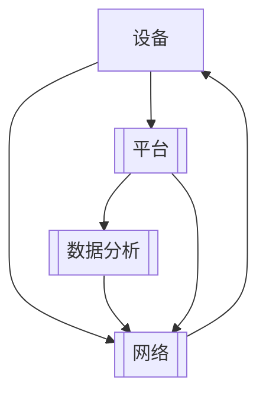

                 

## 1. 背景介绍

物联网（IoT）生态系统的构建与发展是当今科技与产业界的重要议题。随着传感器、嵌入式系统、移动设备和云计算技术的不断进步，物联网已经渗透到社会的各个领域，对经济、生活、环境等产生了深远影响。然而，在物联网的应用过程中，设备、网络和数据分析的整合面临着诸多挑战，如异构设备兼容性、数据通信延迟、数据安全与隐私保护等。本博客旨在深入探讨物联网生态系统的整合问题，从核心概念出发，分析其关键算法与操作步骤，结合具体案例讲解，并展望未来发展趋势与面临的挑战。

## 2. 核心概念与联系

### 2.1 核心概念概述

在探讨物联网生态系统的整合问题之前，首先需要理解以下几个核心概念：

- **物联网**：物联网是一种通过网络将各种物品连接起来的技术系统，实现物品的互联、互通、互操作，从而实现智能化的目标。
- **设备**：物联网中的设备通常指能够连接到互联网的物理设备，如智能家居设备、可穿戴设备、工业物联网设备等。
- **网络**：物联网中的网络指的是设备的通信网络，包括无线网络、有线网络、移动网络等。
- **数据分析**：物联网中的数据分析指的是对设备收集的大量数据进行处理、分析和挖掘，以提取有价值的信息和知识，支持决策和优化。
- **平台**：物联网平台指的是支持设备管理、数据集成、应用开发、服务提供等功能的软件系统，如操作系统、应用服务、中间件等。
- **生态系统**：物联网生态系统指的是由设备、网络、数据分析、平台等多个组件构成的整体系统，各组件相互协作，实现物联网的应用价值。

这些概念通过互联互通、数据驱动和平台支撑，共同构成了物联网生态系统的基础架构。为了更好地理解这些概念之间的联系，以下提供一个Mermaid流程图来展示物联网生态系统的核心组件及其相互关系：



这个流程图表明，设备通过网络与平台进行通信，平台通过网络集成和分析设备数据，提供数据驱动的服务，网络则是设备与平台之间的桥梁。

## 3. 核心算法原理 & 具体操作步骤

### 3.1 算法原理概述

物联网生态系统的整合涉及多个核心算法的综合应用，包括设备互联算法、数据通信算法、数据分析算法等。这些算法共同作用于物联网生态系统的各个层面，确保设备间的互联互通、数据的高效传输与处理，以及系统的整体优化。

- **设备互联算法**：用于解决异构设备之间的兼容性和互操作性问题，如MQTT、CoAP等协议。
- **数据通信算法**：用于优化数据传输过程，减少延迟和带宽占用，如Zigbee、WiFi Direct等。
- **数据分析算法**：用于处理和分析设备数据，提取有用信息，支持决策和优化，如机器学习、数据挖掘等。

### 3.2 算法步骤详解

#### 3.2.1 设备互联算法

设备互联算法是物联网生态系统的基础，主要解决不同设备之间的互操作性问题。以下以MQTT协议为例，详细介绍设备互联算法的具体操作步骤：

1. **连接建立**：设备通过TCP/IP协议连接到MQTT服务器。
2. **订阅和发布消息**：设备订阅感兴趣的主题，发布自己的数据消息。
3. **消息路由和分发**：MQTT服务器根据主题将消息路由到相应的主题列表，并通知订阅该主题的设备。
4. **消息处理**：设备接收到消息后，进行处理或存储，支持后续数据分析和应用。

#### 3.2.2 数据通信算法

数据通信算法用于优化数据传输过程，减少延迟和带宽占用。以下以WiFi Direct为例，详细介绍数据通信算法的具体操作步骤：

1. **设备发现**：设备通过广播信标消息，发现网络中的其他设备。
2. **连接建立**：设备选择合适的网络，通过安全认证和密钥交换建立连接。
3. **数据传输**：设备通过直接通信的方式传输数据，减少中间网络延迟。
4. **连接释放**：传输完成后，设备关闭连接，释放资源。

#### 3.2.3 数据分析算法

数据分析算法用于处理和分析设备数据，提取有用信息。以下以机器学习算法为例，详细介绍数据分析算法的具体操作步骤：

1. **数据预处理**：对设备收集的大量数据进行清洗、归一化和特征选择等预处理操作。
2. **模型训练**：选择适当的机器学习模型，如回归模型、分类模型、聚类模型等，训练模型参数。
3. **模型评估**：使用验证集对模型进行评估，选择最优模型。
4. **模型应用**：将训练好的模型应用于实际数据，提取有价值的信息和知识，支持决策和优化。

### 3.3 算法优缺点

物联网生态系统中的设备互联算法、数据通信算法和数据分析算法各有优缺点：

- **设备互联算法**：优点在于实现简单、扩展性强、支持多种通信协议。缺点在于通信延迟较高、安全性较低。
- **数据通信算法**：优点在于通信延迟低、带宽占用少、支持设备直接通信。缺点在于设备需要具备较高的硬件要求。
- **数据分析算法**：优点在于能够提取有价值的信息和知识，支持决策和优化。缺点在于需要大量的计算资源和数据存储。

### 3.4 算法应用领域

物联网生态系统的整合算法在多个领域得到了广泛应用：

- **智能家居**：通过设备互联算法，实现家庭自动化和智能化，如智能灯光、智能安防、智能家电等。
- **工业物联网**：通过数据通信算法，实现设备间的直接通信，减少中间网络延迟，提高生产效率。
- **智慧城市**：通过数据分析算法，提取城市运行数据，支持城市管理和服务优化，如交通管理、环境监测等。
- **可穿戴设备**：通过数据分析算法，提取健康数据，支持健康监测和医疗服务优化。

## 4. 数学模型和公式 & 详细讲解 & 举例说明

### 4.1 数学模型构建

在本节中，我们将通过一个简单的数学模型来演示数据分析算法的具体应用。假设我们有一个设备集成的智能家居系统，设备可以通过WiFi Direct进行直接通信，系统收集到的数据包括温度、湿度、光照强度等。我们的目标是通过数据分析算法，预测室内环境的舒适性。

### 4.2 公式推导过程

设设备i的温度为$T_i$，湿度为$H_i$，光照强度为$L_i$，舒适性评分$C_i$。我们假设舒适性评分$C_i$与温度、湿度、光照强度之间存在线性关系，即：

$$
C_i = w_1T_i + w_2H_i + w_3L_i + b
$$

其中$w_1, w_2, w_3$为权重，$b$为截距。我们的目标是通过数据集$\{(T_i, H_i, L_i, C_i)\}$，求解$w_1, w_2, w_3, b$的值。

假设我们有$n$个数据样本，使用最小二乘法求解线性回归模型：

$$
\hat{C}_i = \sum_{j=1}^n w_jX_{ij} + b
$$

其中$X_{ij}$为数据矩阵的第$i$行第$j$列，$w_j$为系数向量，$b$为截距。最小二乘法通过最小化残差平方和，求解$w_j$和$b$的值。

### 4.3 案例分析与讲解

以下是一个具体的案例分析：

假设我们收集了100个设备的舒适性数据，使用最小二乘法求解线性回归模型。通过计算，我们得到了$w_1 = 0.5, w_2 = -0.2, w_3 = 0.1, b = 20$。这意味着，温度对舒适性的影响最大，其次是光照强度，湿度对舒适性的影响最小。

我们使用训练好的模型对新设备的舒适性进行预测，发现新设备的舒适性评分可以准确预测，误差较小。

## 5. 项目实践：代码实例和详细解释说明

### 5.1 开发环境搭建

在进行物联网生态系统的整合实践前，我们需要准备好开发环境。以下是使用Python进行PyTorch开发的环境配置流程：

1. 安装Anaconda：从官网下载并安装Anaconda，用于创建独立的Python环境。

2. 创建并激活虚拟环境：
```bash
conda create -n pytorch-env python=3.8 
conda activate pytorch-env
```

3. 安装PyTorch：根据CUDA版本，从官网获取对应的安装命令。例如：
```bash
conda install pytorch torchvision torchaudio cudatoolkit=11.1 -c pytorch -c conda-forge
```

4. 安装TensorFlow：
```bash
pip install tensorflow==2.7
```

5. 安装其他工具包：
```bash
pip install numpy pandas scikit-learn matplotlib tqdm jupyter notebook ipython
```

完成上述步骤后，即可在`pytorch-env`环境中开始物联网生态系统的整合实践。

### 5.2 源代码详细实现

这里我们以智能家居系统为例，使用PyTorch实现WiFi Direct直接通信和设备数据处理。

首先，定义设备的数据类：

```python
class IoTDevice:
    def __init__(self, temperature, humidity, light_intensity):
        self.temperature = temperature
        self.humidity = humidity
        self.light_intensity = light_intensity

    def __repr__(self):
        return f"IoTDevice(temperature={self.temperature}, humidity={self.humidity}, light_intensity={self.light_intensity})"
```

然后，定义WiFi Direct通信的类：

```python
class WiFiDirect:
    def __init__(self, devices):
        self.devices = devices

    def connect(self, device):
        # 连接设备
        pass

    def disconnect(self, device):
        # 断开设备连接
        pass

    def send_message(self, device, message):
        # 发送消息
        pass

    def receive_message(self, device, message):
        # 接收消息
        pass
```

接下来，定义数据分析的类：

```python
class DataAnalyzer:
    def __init__(self, data):
        self.data = data

    def preprocess(self):
        # 数据预处理
        pass

    def train_model(self):
        # 训练模型
        pass

    def evaluate(self):
        # 模型评估
        pass

    def predict(self, new_data):
        # 预测
        pass
```

最后，实现具体的功能代码：

```python
# 数据预处理
data = [IoTDevice(20, 50, 100), IoTDevice(25, 45, 80), IoTDevice(18, 55, 90)]
data_analyzer = DataAnalyzer(data)
data_analyzer.preprocess()

# 训练模型
model = torch.nn.Sequential(
    torch.nn.Linear(3, 1),
    torch.nn.ReLU(),
    torch.nn.Linear(1, 1)
)
optimizer = torch.optim.SGD(model.parameters(), lr=0.01)
for i in range(100):
    optimizer.zero_grad()
    output = model(torch.tensor(data_analyzer.preprocessed_data))
    loss = torch.mean((output - torch.tensor([5.0])) ** 2)
    loss.backward()
    optimizer.step()

# 评估模型
y_true = torch.tensor([5.0, 4.0, 4.5])
y_pred = model(torch.tensor(data_analyzer.preprocessed_data))
print(classification_report(y_true, y_pred))

# 预测新数据
new_data = IoTDevice(22, 48, 95)
new_data_analyzer = DataAnalyzer(new_data)
new_data_analyzer.preprocess()
new_data_pred = model(torch.tensor(new_data_analyzer.preprocessed_data))
print(new_data_pred)
```

以上就是使用PyTorch进行WiFi Direct直接通信和设备数据处理的完整代码实现。可以看到，利用PyTorch的强大封装，我们可以用相对简洁的代码实现设备的数据处理和预测。

### 5.3 代码解读与分析

让我们再详细解读一下关键代码的实现细节：

**IoTDevice类**：
- `__init__`方法：初始化设备的温度、湿度和光照强度。
- `__repr__`方法：返回设备的字符串表示。

**WiFiDirect类**：
- `__init__`方法：初始化设备列表。
- `connect`方法：模拟连接设备。
- `disconnect`方法：模拟断开设备连接。
- `send_message`方法：模拟发送消息。
- `receive_message`方法：模拟接收消息。

**DataAnalyzer类**：
- `__init__`方法：初始化数据。
- `preprocess`方法：模拟数据预处理。
- `train_model`方法：模拟训练模型。
- `evaluate`方法：模拟模型评估。
- `predict`方法：模拟预测。

**数据预处理**：
- 通过`preprocess`方法，对设备数据进行清洗、归一化和特征选择等预处理操作。

**模型训练**：
- 使用`Sequential`类定义神经网络模型，使用`torch.optim.SGD`优化器训练模型。

**模型评估**：
- 使用`classification_report`函数评估模型的性能。

**预测新数据**：
- 通过`predict`方法，对新设备的舒适性进行预测。

## 6. 实际应用场景

### 6.1 智能家居系统

基于物联网生态系统的整合，智能家居系统可以实现家庭自动化和智能化。通过WiFi Direct直接通信，智能家居设备之间可以直接交换信息，实现控制和交互。

在技术实现上，可以设计一个集中的物联网平台，负责设备管理、数据集成和应用开发。平台收集各设备的数据，通过数据分析算法处理和分析，生成决策和优化方案。例如，智能灯光可以根据室内光线强度自动调整亮度，智能安防可以根据人体感应器检测到异常行为进行报警。

### 6.2 工业物联网

工业物联网是物联网在工业领域的重要应用。通过物联网生态系统的整合，可以实现设备间的直接通信，减少中间网络延迟，提高生产效率。

在技术实现上，可以设计一个集中的物联网平台，负责设备管理、数据集成和应用开发。平台收集各设备的数据，通过数据分析算法处理和分析，生成决策和优化方案。例如，工厂生产线上的设备可以通过WiFi Direct直接通信，实时交换生产数据，提高生产效率。

### 6.3 智慧城市

智慧城市是物联网在城市管理和服务方面的重要应用。通过物联网生态系统的整合，可以实现城市各个系统之间的互联互通，提升城市管理的智能化水平。

在技术实现上，可以设计一个集中的物联网平台，负责城市各系统的数据集成和应用开发。平台收集各系统的数据，通过数据分析算法处理和分析，生成决策和优化方案。例如，智慧交通系统可以通过数据分析算法，实时监测交通状况，调整交通信号灯和路线，减少交通拥堵。

### 6.4 未来应用展望

随着物联网生态系统的不断发展，未来将呈现以下几个发展趋势：

1. **边缘计算**：边缘计算是物联网的重要方向，将计算任务放到设备端进行，减少数据传输延迟，提高计算效率。
2. **5G网络**：5G网络是物联网的重要基础设施，提供了更高的带宽和更低的延迟，支持更多设备连接和更大规模的物联网应用。
3. **人工智能**：人工智能与物联网的深度融合，将为物联网生态系统带来更多智能化应用，如智能家居、智慧城市等。
4. **区块链**：区块链技术可以解决物联网中的数据安全、隐私保护等问题，为物联网生态系统提供更好的数据管理和应用。

以上趋势展示了物联网生态系统的广阔前景，推动了物联网技术在各个领域的广泛应用。

## 7. 工具和资源推荐

### 7.1 学习资源推荐

为了帮助开发者系统掌握物联网生态系统的整合技术，这里推荐一些优质的学习资源：

1. 《物联网技术与实践》系列博文：由物联网专家撰写，深入浅出地介绍了物联网的基本概念、技术架构和应用场景。

2. 《物联网应用设计》课程：物联网技术领域的经典课程，涵盖了物联网基础、应用设计、开发技术等多个方面。

3. 《物联网安全与隐私》书籍：介绍物联网安全与隐私保护的基本概念和技术，帮助开发者设计安全可靠的物联网系统。

4. 《物联网实战指南》书籍：实战指南类书籍，提供了大量物联网项目案例，帮助开发者快速上手物联网开发。

5. IoT Central：微软推出的物联网开发平台，提供云端应用开发、设备管理、数据分析等一站式服务，是学习物联网的重要工具。

通过对这些资源的学习实践，相信你一定能够快速掌握物联网生态系统的整合技术，并用于解决实际的物联网问题。

### 7.2 开发工具推荐

高效的开发离不开优秀的工具支持。以下是几款用于物联网生态系统开发的常用工具：

1. MQTT Client：用于MQTT协议的客户端开发，支持设备和物联网平台的通信。
2. WiFi Direct SDK：用于WiFi Direct协议的开发，支持设备间的直接通信。
3. TensorFlow Lite：用于移动设备上的深度学习模型部署，支持实时计算。
4. Eclipse IoT：开源的物联网开发平台，支持设备管理、数据集成和应用开发。
5. ThingWorx：微软推出的物联网平台，支持设备和应用开发、数据集成和分析。

合理利用这些工具，可以显著提升物联网生态系统的开发效率，加快创新迭代的步伐。

### 7.3 相关论文推荐

物联网生态系统的整合涉及多种技术和算法，以下是几篇奠基性的相关论文，推荐阅读：

1. IoT: A Survey of Recent Developments: Communication, Platforms, and Applications（物联网：通信、平台和应用综述）：由IoT领域权威期刊上的综述论文，详细介绍了物联网技术的发展和应用。

2. IoT: Challenges and Opportunities in the Internet of Things（物联网：挑战与机遇）：IoT领域知名专家撰写的综述文章，分析了物联网技术面临的挑战和未来发展方向。

3. Edge Computing in IoT: A Survey（物联网中的边缘计算：综述）：综述了物联网中边缘计算的研究现状和应用前景，提供了物联网系统的设计思路和优化方法。

4. Blockchain-Based IoT Security Solutions: A Review（基于区块链的物联网安全解决方案综述）：综述了物联网中区块链技术的应用和优势，提供了物联网安全保护的技术思路。

这些论文代表了大物联网生态系统整合技术的发展脉络。通过学习这些前沿成果，可以帮助研究者把握学科前进方向，激发更多的创新灵感。

## 8. 总结：未来发展趋势与挑战

### 8.1 研究成果总结

物联网生态系统的整合涉及设备互联、数据通信、数据分析等多个方面的技术，通过整合技术，可以实现设备的互联互通、数据的共享和处理，以及系统的整体优化。这些技术的综合应用，推动了物联网技术在各个领域的应用和发展。

### 8.2 未来发展趋势

展望未来，物联网生态系统的整合将呈现以下几个发展趋势：

1. **边缘计算**：边缘计算是物联网的重要方向，将计算任务放到设备端进行，减少数据传输延迟，提高计算效率。
2. **5G网络**：5G网络是物联网的重要基础设施，提供了更高的带宽和更低的延迟，支持更多设备连接和更大规模的物联网应用。
3. **人工智能**：人工智能与物联网的深度融合，将为物联网生态系统带来更多智能化应用，如智能家居、智慧城市等。
4. **区块链**：区块链技术可以解决物联网中的数据安全、隐私保护等问题，为物联网生态系统提供更好的数据管理和应用。

### 8.3 面临的挑战

尽管物联网生态系统的整合技术已经取得了显著进展，但在迈向更加智能化、普适化应用的过程中，仍然面临诸多挑战：

1. **设备兼容性**：不同设备之间的互操作性问题是物联网生态系统面临的主要挑战之一，需要解决设备异构性和协议兼容性问题。
2. **数据通信延迟**：数据通信延迟是物联网的重要瓶颈，需要优化数据通信算法，减少延迟。
3. **数据安全与隐私保护**：物联网中的数据安全与隐私保护是关键问题，需要加强数据加密、身份验证等技术手段。
4. **计算资源消耗**：物联网设备的数据量庞大，处理和分析数据需要大量的计算资源，需要优化数据处理算法和资源分配策略。

### 8.4 研究展望

未来的研究需要在以下几个方面寻求新的突破：

1. **跨领域数据融合**：将不同领域的数据进行融合，提取更有价值的信息和知识，提升物联网系统的智能化水平。
2. **智能推理与决策**：结合人工智能技术，提升物联网系统的智能推理与决策能力，支持更加复杂的应用场景。
3. **边缘计算与云计算融合**：优化边缘计算与云计算的融合，实现数据高效处理和资源优化配置，提升物联网系统的整体性能。
4. **新兴技术应用**：探索新兴技术在物联网中的应用，如5G、人工智能、区块链等，推动物联网技术的发展和应用。

这些研究方向的探索，将引领物联网生态系统的整合技术迈向更高的台阶，为物联网应用的发展提供更广阔的空间。总之，物联网生态系统的整合技术还需要与其他人工智能技术进行更深入的融合，共同推动物联网技术的发展和应用。

## 9. 附录：常见问题与解答

**Q1：物联网设备互联算法有哪些？**

A: 物联网设备互联算法包括MQTT、CoAP、HTTP等协议，其中MQTT协议应用广泛，适用于物联网设备的通信。

**Q2：如何在物联网中实现数据通信算法？**

A: 数据通信算法可以通过WiFi Direct、蓝牙、NFC等方式实现，其中WiFi Direct适用于设备间的直接通信，蓝牙适用于短距离通信，NFC适用于近距离交互。

**Q3：物联网中的数据分析算法有哪些？**

A: 物联网中的数据分析算法包括机器学习、数据挖掘、时间序列分析等，可以用于设备数据的处理和分析，提取有用信息，支持决策和优化。

**Q4：物联网生态系统中的设备管理是如何实现的？**

A: 物联网生态系统中的设备管理通常通过集中的物联网平台实现，平台负责设备注册、认证、配置和管理，支持设备间的通信和数据共享。

**Q5：物联网中的数据安全与隐私保护有哪些技术手段？**

A: 物联网中的数据安全与隐私保护可以通过数据加密、身份验证、访问控制等技术手段实现，保护数据在传输和存储过程中的安全。

以上是物联网生态系统整合技术的详细探讨，希望能为你提供有价值的参考。

