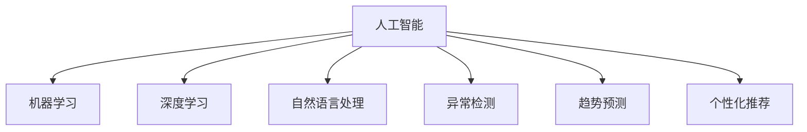

                 

# 理解洞察力的价值：在不确定性中的光芒

## 1. 背景介绍

### 1.1 问题由来
在现代社会的复杂和不确定性中，洞察力成为了人们决策和行动的宝贵资产。洞察力不仅仅限于数据分析，它更是一种综合认知能力，包括了理解、分析和预测的能力。在AI领域，尤其是人工智能的发展和应用中，洞察力对于解决问题、优化决策和提升效率具有重要作用。

### 1.2 问题核心关键点
洞察力在人工智能中的价值体现在以下几个方面：
- **决策支持**：通过分析大量数据，洞察力可以帮助人们做出更明智的决策。
- **异常检测**：在大数据中发现异常模式，洞察力能够识别潜在问题。
- **趋势预测**：基于历史数据，洞察力可以预测未来趋势，从而优化资源分配和战略规划。
- **用户行为分析**：洞察用户行为和需求，洞察力能够提供个性化服务和推荐。

## 2. 核心概念与联系

### 2.1 核心概念概述

为更好地理解洞察力在人工智能中的应用，本节将介绍几个密切相关的核心概念：

- **人工智能（AI）**：涉及计算机科学的多个领域，包括机器学习、深度学习、自然语言处理等，通过算法模拟人类的智能行为。
- **洞察力**：指通过深入分析数据，理解数据背后的模式和关联，从而做出明智决策的能力。
- **机器学习（ML）**：通过数据训练模型，使模型能够自动发现规律和模式。
- **深度学习（DL）**：一种特殊的机器学习方法，通过多层神经网络模拟人类大脑的工作方式。
- **自然语言处理（NLP）**：研究如何让计算机理解、处理和生成自然语言。
- **异常检测（Anomaly Detection）**：识别数据中的异常点或模式。
- **趋势预测（Trend Forecasting）**：基于历史数据预测未来趋势。
- **个性化推荐（Personalized Recommendation）**：根据用户行为和偏好，提供个性化的服务和推荐。

这些核心概念之间的逻辑关系可以通过以下Mermaid流程图来展示：



这个流程图展示了一些关键概念之间的联系：

1. 人工智能是包含机器学习、深度学习和自然语言处理等多个子领域的综合概念。
2. 机器学习和深度学习是实现人工智能的核心技术手段。
3. 自然语言处理是人工智能的一个重要应用方向，通过洞察力分析语言数据。
4. 异常检测和趋势预测是基于数据分析的洞察力应用。
5. 个性化推荐是根据用户洞察力定制服务。

## 3. 核心算法原理 & 具体操作步骤

### 3.1 算法原理概述

洞察力在人工智能中的应用，主要通过数据分析和模型训练实现。算法原理可以分为以下几个步骤：

1. **数据收集**：从不同来源收集相关数据。
2. **数据预处理**：清洗和处理数据，使其适合分析。
3. **模型训练**：使用机器学习或深度学习模型训练数据，构建洞察力模型。
4. **洞察力分析**：通过模型对数据进行分析，识别模式和关联。
5. **决策支持**：基于洞察力分析结果，做出决策。

### 3.2 算法步骤详解

以下是洞察力在人工智能应用中的详细步骤：

**Step 1: 数据收集与预处理**

- 确定数据来源，收集与问题相关的数据。
- 清洗数据，去除噪声和异常值。
- 特征提取，选择关键特征进行建模。
- 数据归一化，将数据处理到适合模型的范围。

**Step 2: 模型训练**

- 选择合适的机器学习或深度学习模型。
- 划分数据集为训练集和测试集。
- 设置训练参数，如学习率、批大小等。
- 使用训练集训练模型，并调整超参数。
- 在测试集上评估模型性能。

**Step 3: 洞察力分析**

- 应用模型对测试集进行分析，识别模式和关联。
- 通过可视化和报表，展示洞察力分析结果。
- 利用洞察力分析结果，做出决策支持。

**Step 4: 决策支持**

- 基于洞察力分析结果，制定策略和行动计划。
- 实施行动计划，并持续监控效果。
- 根据反馈不断调整和优化策略。

### 3.3 算法优缺点

洞察力在人工智能中的应用具有以下优点：
- **高效性**：通过自动化分析，大幅提高决策效率。
- **准确性**：基于数据驱动，提供更准确的决策支持。
- **适应性强**：模型可以根据数据和需求灵活调整。

但同时也存在一些局限：
- **数据质量依赖**：模型的效果很大程度上取决于数据的质量。
- **模型复杂性**：高复杂度的模型可能需要更多的计算资源和时间。
- **可解释性不足**：一些高级模型（如深度学习）可能难以解释其决策过程。

### 3.4 算法应用领域

洞察力在人工智能中的应用非常广泛，覆盖了多个行业和领域，包括但不限于：

- **金融**：通过洞察力分析市场数据，优化投资策略，降低风险。
- **医疗**：通过洞察力分析患者数据，提供个性化医疗服务，提高治疗效果。
- **零售**：通过洞察力分析消费者行为，优化商品推荐，提高销售额。
- **制造**：通过洞察力分析生产数据，优化生产流程，降低成本。
- **物流**：通过洞察力分析运输数据，优化路线和配送，提高效率。
- **安全**：通过洞察力分析安全数据，识别潜在威胁，提高安全防护能力。

这些应用展示了洞察力在人工智能中的广泛价值，对于提升各行业的决策效率和质量具有重要意义。

## 4. 数学模型和公式 & 详细讲解 & 举例说明

### 4.1 数学模型构建

在人工智能中，洞察力的应用主要通过数学模型来实现。以下是一个简单的机器学习模型的数学模型构建过程：

- **输入**： $x_1, x_2, ..., x_n$，表示数据的各个特征。
- **模型**： $f(x) = w_1x_1 + w_2x_2 + ... + w_nx_n + b$，其中 $w_i$ 为权重，$b$ 为偏置。
- **损失函数**： $L(y, \hat{y})$，表示模型预测值 $\hat{y}$ 与真实值 $y$ 之间的差异。
- **优化目标**：最小化损失函数 $L(y, \hat{y})$。

### 4.2 公式推导过程

假设我们使用线性回归模型 $y = wx + b$ 进行数据预测，其中 $w$ 为权重，$x$ 为输入，$b$ 为偏置。模型的损失函数为均方误差：

$$
L(y, \hat{y}) = \frac{1}{N}\sum_{i=1}^N (y_i - \hat{y}_i)^2
$$

通过梯度下降算法优化模型参数，计算过程如下：

$$
w \leftarrow w - \eta \frac{\partial L}{\partial w}
$$
$$
b \leftarrow b - \eta \frac{\partial L}{\partial b}
$$

其中 $\eta$ 为学习率。

### 4.3 案例分析与讲解

以下是一个简单的异常检测案例：

假设有一个数据集 $D = \{(x_1, y_1), (x_2, y_2), ..., (x_n, y_n)\}$，其中 $x$ 表示数据特征，$y$ 表示标签。我们需要识别异常数据，即标签为正的数据中，特征值与正常数据有较大差异的点。

使用孤立森林算法，我们首先构建一棵二叉树，每次随机选择一个特征和一个阈值，将数据集分为两部分。然后将每部分递归执行相同的操作，直到每个叶节点只包含一个数据点或不超过预设的叶节点大小。

在构建树的过程中，如果一个数据点所在的路径异常长（即异常深度），则该数据点被认为是异常数据。

## 5. 项目实践：代码实例和详细解释说明

### 5.1 开发环境搭建

在进行项目实践前，我们需要准备好开发环境。以下是使用Python进行PyTorch开发的环境配置流程：

1. 安装Anaconda：从官网下载并安装Anaconda，用于创建独立的Python环境。

2. 创建并激活虚拟环境：
```bash
conda create -n pytorch-env python=3.8 
conda activate pytorch-env
```

3. 安装PyTorch：根据CUDA版本，从官网获取对应的安装命令。例如：
```bash
conda install pytorch torchvision torchaudio cudatoolkit=11.1 -c pytorch -c conda-forge
```

4. 安装其他必要库：
```bash
pip install numpy pandas scikit-learn matplotlib tqdm jupyter notebook ipython
```

完成上述步骤后，即可在`pytorch-env`环境中开始项目实践。

### 5.2 源代码详细实现

这里我们以异常检测为例，使用PyTorch实现孤立森林算法。

```python
import torch
import torch.nn as nn
import torch.optim as optim
from torch.utils.data import Dataset, DataLoader
import numpy as np

# 定义孤立森林模型
class IsolationForest(nn.Module):
    def __init__(self, n_features, contamination=0.01):
        super(IsolationForest, self).__init__()
        self.n_features = n_features
        self.contamination = contamination
        self.tree = IsolationTree(n_features)
    
    def forward(self, x):
        return self.tree(x)

# 定义树节点
class Node:
    def __init__(self, feature_idx, threshold):
        self.feature_idx = feature_idx
        self.threshold = threshold
        self.left = None
        self.right = None
        self.split = None
    
    def split(self, x, y):
        self.split = np.median(x[self.feature_idx], axis=0)
        self.left = Node(self.feature_idx, self.split)
        self.right = Node(self.feature_idx, self.split)

# 定义孤立树
class IsolationTree(nn.Module):
    def __init__(self, n_features):
        super(IsolationTree, self).__init__()
        self.n_features = n_features
        self.root = self._generate_tree()
    
    def _generate_tree(self):
        root = Node(self.n_features, None)
        for i in range(self.n_features):
            feature = torch.randn(1, 1).double()
            threshold = torch.median(x[:, i], 0)[0].double()
            root.split(x, y, i, threshold)
        return root
    
    def split(self, x, y, feature_idx, threshold):
        if self.root is None:
            self.root = Node(feature_idx, threshold)
        else:
            if x[self.feature_idx] <= threshold:
                self.root.left = Node(self.feature_idx, threshold)
            else:
                self.root.right = Node(self.feature_idx, threshold)
        self.root.left = self.root.left.split(x, y, feature_idx, threshold)
        self.root.right = self.root.right.split(x, y, feature_idx, threshold)
    
    def _isolation(self, x):
        path = []
        node = self.root
        while node is not None:
            path.append(node)
            if x[node.feature_idx] <= node.threshold:
                node = node.left
            else:
                node = node.right
        return path
    
    def _get_isolation_depth(self, x):
        path = self._isolation(x)
        return len(path)
```

### 5.3 代码解读与分析

让我们再详细解读一下关键代码的实现细节：

**IsolationForest类**：
- `__init__`方法：初始化模型参数，包括特征数量和异常率。
- `forward`方法：构建孤立森林树，进行数据异常检测。

**Node类**：
- `__init__`方法：初始化节点参数，包括特征索引和阈值。
- `split`方法：根据特征和阈值进行数据分割。

**IsolationTree类**：
- `__init__`方法：初始化孤立树，生成初始树节点。
- `_split`方法：根据特征和阈值进行数据分割。
- `_isolation`方法：通过回溯树节点，找到异常路径。
- `_get_isolation_depth`方法：计算异常深度，评估异常性。

**训练流程**：
- 定义训练数据集，使用PyTorch的DataLoader。
- 初始化模型和优化器。
- 设置训练参数，如学习率、批次大小等。
- 循环迭代，对每个批次数据进行训练，更新模型参数。
- 在验证集上评估模型性能。

## 6. 实际应用场景

### 6.1 智能推荐系统

在智能推荐系统中，洞察力可以帮助识别用户的兴趣和行为模式，从而提供个性化的推荐服务。通过分析用户的历史行为数据，洞察力模型可以识别用户的偏好和趋势，从而优化推荐策略。

在技术实现上，可以收集用户的浏览、点击、评分等行为数据，构建用户画像。然后，使用洞察力模型分析用户画像，生成个性化的推荐列表。通过实时监测用户反馈，进一步调整推荐策略，提升用户体验。

### 6.2 金融风险管理

在金融领域，洞察力可以帮助识别潜在风险，优化资产配置。通过分析市场数据，洞察力模型可以识别市场的异常波动和趋势，从而提前采取风险控制措施。

在技术实现上，可以收集历史市场数据，使用洞察力模型进行趋势预测和异常检测。根据模型输出，及时调整投资组合和风险控制策略，确保资产安全。

### 6.3 医疗诊断辅助

在医疗领域，洞察力可以帮助提高诊断的准确性和效率。通过分析患者的病历数据，洞察力模型可以识别出潜在的疾病风险和异常症状，从而提供精准的诊断建议。

在技术实现上，可以收集患者的病历数据和诊断结果，构建洞察力模型。然后，使用模型分析新入院的患者数据，提供诊断参考，辅助医生决策。通过实时监测诊断效果，进一步优化模型和诊断策略。

### 6.4 未来应用展望

随着洞察力技术的不断发展，其在人工智能领域的应用前景将更加广阔。以下是几个未来展望：

1. **多模态数据分析**：结合视觉、听觉等多模态数据，进行更全面、深入的洞察力分析。
2. **实时数据分析**：实现实时数据流的洞察力分析，提高决策效率和响应速度。
3. **跨领域应用**：将洞察力技术应用于更多领域，如智慧城市、智能交通等，提升各行业的智能化水平。
4. **人工智能治理**：通过洞察力技术，提升AI系统的透明性和可解释性，保障数据安全和隐私。

## 7. 工具和资源推荐

### 7.1 学习资源推荐

为了帮助开发者系统掌握洞察力在人工智能中的应用，这里推荐一些优质的学习资源：

1. **Coursera《机器学习》课程**：由斯坦福大学开设，系统介绍机器学习和深度学习的基本原理和应用。
2. **Udacity《深度学习基础》课程**：详细讲解深度学习的理论基础和实践技巧。
3. **Kaggle《机器学习实战》竞赛**：通过实际竞赛项目，提升洞察力和数据分析能力。
4. **Google AI Blog**：Google AI团队发布的博客文章，涵盖最新的AI技术和应用案例。
5. **TensorFlow官方文档**：详细的API文档和示例代码，帮助开发者快速上手TensorFlow。

通过这些资源的学习实践，相信你一定能够快速掌握洞察力在人工智能中的应用，并用于解决实际的业务问题。

### 7.2 开发工具推荐

高效的开发离不开优秀的工具支持。以下是几款用于洞察力分析开发的常用工具：

1. **Python**：作为一种通用编程语言，Python在数据分析和机器学习领域广泛应用。
2. **PyTorch**：基于Python的开源深度学习框架，支持动态计算图和丰富的深度学习模型。
3. **TensorFlow**：由Google主导开发的深度学习框架，支持分布式计算和高性能模型训练。
4. **Jupyter Notebook**：支持多种编程语言和数据格式，适合数据分析和模型训练。
5. **Scikit-Learn**：Python的机器学习库，提供丰富的算法和工具支持。
6. **Pandas**：Python的数据处理库，支持数据清洗和分析。

合理利用这些工具，可以显著提升洞察力分析的开发效率，加快创新迭代的步伐。

### 7.3 相关论文推荐

洞察力在人工智能中的应用源于学界的持续研究。以下是几篇奠基性的相关论文，推荐阅读：

1. **《Isolation Forest》**：由李航等人提出，提出了孤立森林算法，用于异常检测和降维。
2. **《Trend Forecasting using Deep Learning》**：探讨了深度学习在时间序列数据分析中的应用，通过LSTM等模型进行趋势预测。
3. **《Deep Learning for Anomaly Detection》**：研究了深度学习在异常检测中的应用，通过卷积神经网络（CNN）等模型进行数据分析。
4. **《Personalized Recommendation Systems》**：介绍了个性化推荐系统的设计和实现，利用洞察力模型进行用户画像和推荐优化。
5. **《Data Mining and Statistical Learning》**：探讨了数据挖掘和统计学习的基本原理和应用，提供了洞察力分析的数学基础。

这些论文代表了大数据和机器学习领域的研究进展，通过学习这些前沿成果，可以帮助研究者把握学科前进方向，激发更多的创新灵感。

## 8. 总结：未来发展趋势与挑战

### 8.1 研究成果总结

本文对基于数据分析的洞察力在人工智能中的应用进行了全面系统的介绍。首先阐述了洞察力在决策支持、异常检测、趋势预测等方面的价值。其次，从原理到实践，详细讲解了洞察力模型训练和应用的具体步骤。最后，结合实际应用场景，展示了洞察力技术的广泛应用前景。

通过本文的系统梳理，可以看到，洞察力在人工智能中的重要性日益凸显，对于提升各行业的决策效率和质量具有重要意义。未来，随着技术的不断发展和应用场景的拓展，洞察力技术将在更多领域大放异彩。

### 8.2 未来发展趋势

展望未来，洞察力技术将在人工智能领域呈现以下几个发展趋势：

1. **自动化分析**：通过自动化工具，实现数据分析和模型训练的自动化，提升效率。
2. **多模态融合**：结合视觉、听觉等多模态数据，进行更全面、深入的洞察力分析。
3. **实时分析**：实现实时数据流的洞察力分析，提高决策效率和响应速度。
4. **跨领域应用**：将洞察力技术应用于更多领域，如智慧城市、智能交通等，提升各行业的智能化水平。
5. **人工智能治理**：通过洞察力技术，提升AI系统的透明性和可解释性，保障数据安全和隐私。

### 8.3 面临的挑战

尽管洞察力技术已经取得了显著进展，但在迈向更加智能化、普适化应用的过程中，它仍面临诸多挑战：

1. **数据质量问题**：模型的效果很大程度上取决于数据的质量，如何获取高质量的数据是一个重要挑战。
2. **模型复杂性**：高复杂度的模型可能需要更多的计算资源和时间，如何优化模型结构是一个重要研究方向。
3. **可解释性不足**：一些高级模型（如深度学习）可能难以解释其决策过程，如何增强模型的可解释性是一个重要挑战。
4. **隐私和安全**：洞察力模型需要处理大量的敏感数据，如何保障数据隐私和安全是一个重要挑战。
5. **模型鲁棒性**：面对异常数据和噪声，洞察力模型的鲁棒性是一个重要挑战。

### 8.4 研究展望

面对洞察力技术所面临的挑战，未来的研究需要在以下几个方面寻求新的突破：

1. **数据增强和处理**：通过数据增强和预处理技术，提高数据质量和可用性。
2. **模型简化和优化**：通过模型简化和优化技术，降低计算资源和时间消耗。
3. **模型可解释性**：通过可解释性技术，增强模型的透明性和可解释性。
4. **隐私保护技术**：通过隐私保护技术，保障数据隐私和安全。
5. **鲁棒性提升**：通过鲁棒性提升技术，提高模型的鲁棒性和泛化能力。

这些研究方向的探索，将推动洞察力技术向更高的台阶发展，为构建更加智能、可靠的人工智能系统铺平道路。总之，洞察力技术需要在数据、模型、算法等多个维度协同发力，才能真正实现其在人工智能领域的广泛应用。

## 9. 附录：常见问题与解答

**Q1：什么是洞察力？它在人工智能中的应用是什么？**

A: 洞察力指通过深入分析数据，理解数据背后的模式和关联，从而做出明智决策的能力。在人工智能中，洞察力可以帮助识别数据中的模式和异常，进行趋势预测和个性化推荐等。

**Q2：如何选择合适的洞察力模型？**

A: 选择合适的洞察力模型需要考虑以下几个因素：
1. 数据类型：选择适合数据类型的模型，如时间序列数据选择LSTM模型。
2. 模型复杂度：根据数据量和计算资源，选择合适的模型复杂度。
3. 可解释性：选择可解释性高的模型，方便理解模型的决策过程。

**Q3：如何进行异常检测？**

A: 异常检测可以通过以下步骤实现：
1. 收集异常样本和正常样本。
2. 选择合适的模型，如孤立森林、K近邻等。
3. 训练模型，评估模型性能。
4. 使用模型对新数据进行异常检测。

**Q4：如何进行趋势预测？**

A: 趋势预测可以通过以下步骤实现：
1. 收集历史数据和标签。
2. 选择合适的模型，如ARIMA、LSTM等。
3. 训练模型，评估模型性能。
4. 使用模型对未来数据进行预测。

**Q5：如何提高洞察力模型的可解释性？**

A: 提高洞察力模型的可解释性可以通过以下方法：
1. 选择可解释性高的模型，如决策树、线性回归等。
2. 使用可解释性工具，如LIME、SHAP等，分析模型的决策过程。
3. 增加特征解释，通过特征重要性分析，帮助理解模型的决策依据。

通过这些问题的解答，可以帮助你更好地理解洞察力在人工智能中的应用，并指导你进行模型设计和应用实践。

