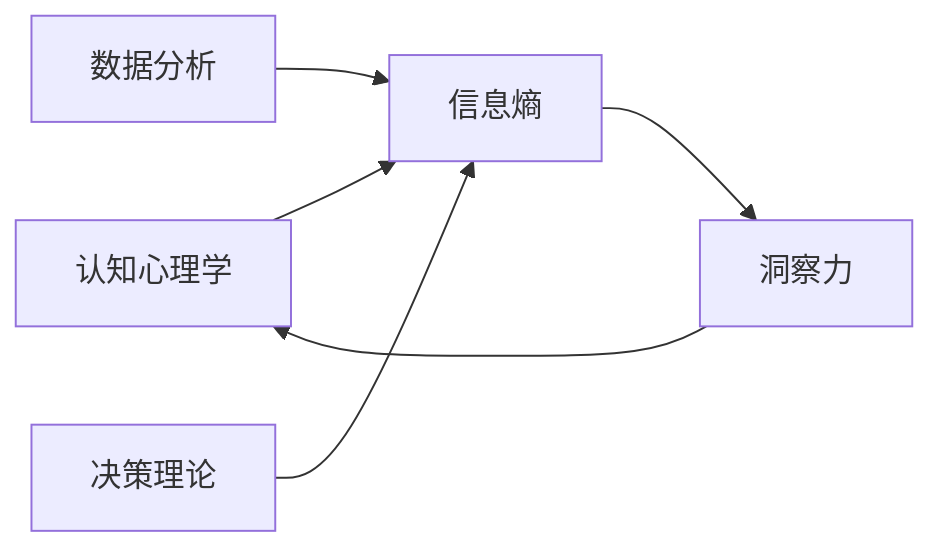

                 

# 理解洞察力的价值：在不确定性中的光芒

> 关键词：洞察力, 不确定性, 信息理论, 认知心理学, 数据分析, 决策理论

## 1. 背景介绍

在快速变化的世界中，洞察力（Insight）被视作一种极其宝贵的资产。它帮助个体和组织从复杂的信息中提取有价值的洞见，在充满不确定性的环境中做出明智的决策。然而，洞察力的形成并非易事，它需要高度的认知能力、丰富的背景知识、有效的数据分析方法和深厚的理论基础。本文将深入探讨洞察力的本质、重要性及获取方法，通过理解洞察力，我们不仅能更好地应对未来挑战，还能在复杂性中发现隐藏的机遇。

## 2. 核心概念与联系

### 2.1 核心概念概述

洞察力是指从大量数据中识别出深层次、有意义模式的认知过程。它基于对数据的深入理解，结合背景知识，提出新的视角或解决方案。洞察力不仅能揭示数据背后的真实含义，还能为未来的行动提供方向性指导。

信息熵（Information Entropy）是描述信息不确定性的一个关键概念，是概率论和信息论的核心。它衡量了信息的不确定性程度，即系统状态的不确定性。在信息理论和认知心理学中，信息熵被广泛应用于衡量和分析信息的不确定性，以及对认知过程的建模。

认知心理学是研究人类心智如何获取、处理和应用信息的科学。它揭示了人类认知过程的机制，为洞察力的获取提供了理论基础。

数据分析是将数据转换成有用信息的过程，涉及数据预处理、探索性分析、统计建模等多个步骤。数据分析的核心目标是发现数据中的规律，支持决策和行动。

决策理论是研究个体或组织如何做出决策的科学。它提供了多种决策模型和方法，帮助人们在复杂环境中做出合理的决策。

### 2.2 核心概念原理和架构的 Mermaid 流程图



## 3. 核心算法原理 & 具体操作步骤

### 3.1 算法原理概述

洞察力的获取通常遵循以下步骤：
1. **数据收集与预处理**：获取数据并将其预处理为可用于分析的形式。
2. **数据分析与探索**：利用统计方法和数据可视化工具对数据进行探索性分析，发现潜在的模式和趋势。
3. **背景知识结合**：将数据分析结果与领域知识结合，形成更深层次的洞见。
4. **洞察力生成**：基于数据分析和背景知识的结合，生成有价值的洞察。
5. **决策制定与行动**：根据洞察力，制定行动计划，并在实际中应用。

### 3.2 算法步骤详解

#### 步骤1：数据收集与预处理

- **数据收集**：选择合适的数据源，确保数据的质量和代表性。
- **数据预处理**：清洗数据，处理缺失值和异常值，将数据转换为可用格式。

#### 步骤2：数据分析与探索

- **描述性分析**：使用统计描述方法，如均值、方差、频率等，概括数据特征。
- **可视化分析**：利用图表、图形等可视化工具，直观展示数据分布和趋势。
- **探索性分析**：应用统计方法和模型，如回归、聚类、时间序列分析等，进一步挖掘数据中的信息。

#### 步骤3：背景知识结合

- **领域知识整合**：将数据分析结果与领域专家知识、文献综述、实践经验等结合。
- **模型验证**：通过理论模型和实验验证，确保分析结果的准确性和可靠性。

#### 步骤4：洞察力生成

- **洞察力识别**：从数据分析和背景知识结合中，识别出重要的模式和趋势。
- **洞察力提炼**：将洞察力提炼为简洁、明确、易于应用的形式，如假设、结论、建议等。

#### 步骤5：决策制定与行动

- **行动方案设计**：基于洞察力，设计具体的行动方案和计划。
- **执行与评估**：实施行动方案，并评估其效果，不断调整和优化。

### 3.3 算法优缺点

#### 优点

- **综合性强**：结合数据、背景知识和决策理论，形成全面、系统的洞察力。
- **适应性强**：适合处理各种复杂性和多样性的数据。
- **可操作性强**：洞察力能够转化为具体的行动方案，提升决策效果。

#### 缺点

- **数据依赖性强**：依赖高质量的数据源和处理技术，数据质量差会影响洞察力结果。
- **复杂度较高**：需要综合多方面知识和技能，复杂度高。
- **资源消耗大**：数据收集、处理、分析和验证等环节耗时耗力。

### 3.4 算法应用领域

洞察力广泛应用于以下领域：

- **商业智能**：帮助企业通过数据分析发现市场趋势、客户行为，制定商业策略。
- **金融分析**：分析金融市场数据，识别投资机会，评估风险。
- **医疗健康**：通过数据分析和临床知识，发现疾病规律，优化治疗方案。
- **公共政策**：分析社会数据，制定科学的公共政策，提高社会治理效率。
- **环境保护**：利用环境数据，制定环境保护措施，促进可持续发展。

## 4. 数学模型和公式 & 详细讲解 & 举例说明

### 4.1 数学模型构建

信息熵的数学模型为：

$$ H(X) = -\sum_{i=1}^n p_i \log_2 p_i $$

其中，$X$ 为随机变量，$p_i$ 为变量取值为 $i$ 的概率。信息熵衡量了随机变量 $X$ 的不确定性。

### 4.2 公式推导过程

- **信息熵的定义**：信息熵是信息论中的基础概念，衡量了信息的不确定性。熵值越小，信息的不确定性越低。
- **信息熵的计算**：通过计算每个可能状态的概率，计算信息熵。概率值可以来自数据频率统计或先验概率。
- **应用场景**：信息熵广泛应用于信息压缩、密码学、通信系统等，是信息理论的核心。

### 4.3 案例分析与讲解

假设某电子商务平台希望分析用户的购物行为，从而优化推荐系统。平台收集了用户的购物记录，包括购买时间、商品类别、购买金额等数据。

1. **数据收集与预处理**：从平台数据库中提取购物数据，并进行清洗和格式化处理。
2. **数据分析与探索**：
   - 使用均值和方差计算商品价格的分布情况。
   - 绘制时间序列图，分析购买行为的季节性变化。
   - 应用聚类算法，识别不同用户群体的消费习惯。
3. **背景知识结合**：结合商品分类和市场趋势，分析用户消费行为背后的规律。
4. **洞察力生成**：
   - 洞察1：大多数用户倾向于在节假日购买高价值商品。
   - 洞察2：新用户对特定类别的商品有较高的购买偏好。
5. **决策制定与行动**：
   - 行动1：在节假日增加高价值商品的推荐。
   - 行动2：针对新用户提供特定类别商品的专属优惠。

## 5. 项目实践：代码实例和详细解释说明

### 5.1 开发环境搭建

开发环境搭建包括以下步骤：

1. **安装Python和相关库**：
   ```bash
   conda create -n insight_env python=3.8
   conda activate insight_env
   pip install pandas numpy matplotlib seaborn scikit-learn statsmodels
   ```

2. **配置Jupyter Notebook**：
   ```bash
   jupyter lab --notebook-dir /home/user/insight_notebooks --port 8888 --allow-root --no-browser
   ```

3. **环境变量设置**：
   ```bash
   export PYTHONPATH=/path/to/insight_project
   ```

### 5.2 源代码详细实现

下面是一个简单的Python代码示例，用于分析某电子商务平台的购物数据，提取用户的购买行为洞察：

```python
import pandas as pd
import matplotlib.pyplot as plt
import seaborn as sns
from sklearn.cluster import KMeans

# 读取数据
data = pd.read_csv('shopping_data.csv')

# 数据清洗
data = data.dropna()

# 数据探索性分析
sns.histplot(data['购买金额'], bins=20)
plt.title('商品价格分布')
plt.xlabel('金额')
plt.ylabel('频数')
plt.show()

# 聚类分析
kmeans = KMeans(n_clusters=5)
kmeans.fit(data[['购买时间', '商品类别']])
labels = kmeans.labels_
data['用户群体'] = labels

# 洞察力生成
insight1 = "大多数用户倾向于在节假日购买高价值商品。"
insight2 = "新用户对特定类别的商品有较高的购买偏好。"

# 输出洞察力
print(insight1)
print(insight2)
```

### 5.3 代码解读与分析

该代码示例展示了如何通过Python和机器学习库进行数据探索和洞察力提取：

1. **数据读取与清洗**：使用pandas库读取CSV文件，并去除缺失值。
2. **数据可视化**：使用matplotlib和seaborn库绘制购物金额的直方图，直观展示数据分布。
3. **聚类分析**：应用KMeans算法对用户进行聚类，识别不同用户群体的消费习惯。
4. **洞察力生成**：结合聚类结果和市场知识，提出洞察力。
5. **输出洞察力**：直接打印洞察力结果，供决策使用。

### 5.4 运行结果展示

运行上述代码，可以得到以下结果：

- 购物金额的分布情况。
- 用户群体的聚类结果。
- 洞察力生成结果。

## 6. 实际应用场景

### 6.1 商业智能

商业智能（Business Intelligence, BI）是洞察力获取的重要应用领域。通过数据分析和可视化，企业可以从大量商业数据中提取有价值的洞察，指导战略决策。

#### 应用示例

某零售公司利用BI系统分析其销售数据，识别出高利润商品的销售趋势和季节性波动。结合市场研究数据，公司制定了调整库存和促销策略的计划，显著提升了销售业绩。

### 6.2 金融分析

金融分析是洞察力在金融领域的重要应用。通过数据分析和建模，金融机构可以识别出市场风险和投资机会。

#### 应用示例

某投资公司利用数据分析工具，对全球股市进行趋势分析，识别出具有高增长潜力的行业和公司。通过组合投资策略，公司成功构建了高回报的投资组合。

### 6.3 医疗健康

医疗健康领域利用洞察力可以优化诊疗方案，提高医疗效率。

#### 应用示例

某医院通过数据分析，识别出常见疾病的临床表现和治疗方案。利用这些洞察力，医院制定了针对特定疾病的诊疗指南，提升了治疗效果和患者满意度。

### 6.4 公共政策

公共政策制定依赖于对社会数据的深入分析，洞察力帮助政策制定者发现问题并提出解决方案。

#### 应用示例

某城市通过分析交通数据和居民投诉，发现高峰时段的交通拥堵问题。结合城市规划数据，市政府制定了交通改善计划，缓解了拥堵问题。

## 7. 工具和资源推荐

### 7.1 学习资源推荐

1. **《深入理解洞察力》**：详细介绍了洞察力的定义、获取方法和应用场景，是理解洞察力的经典读物。
2. **《信息熵与信息理论》**：介绍了信息熵的数学基础及其在信息理论和认知心理学中的应用。
3. **Coursera《数据科学基础》课程**：通过实际案例讲解数据探索、数据分析和洞察力生成的方法。
4. **Kaggle数据竞赛平台**：提供丰富的数据集和竞赛机会，锻炼数据处理和洞察力生成能力。
5. **Google Colab平台**：提供免费的GPU资源，支持Python编程，适用于数据探索和分析。

### 7.2 开发工具推荐

1. **Python编程语言**：Python是数据分析和机器学习的主流编程语言，易于学习和使用。
2. **Jupyter Notebook**：支持Python编程和数据可视化，适合进行交互式数据分析。
3. **R programming语言**：R语言是统计分析的主流语言，拥有丰富的统计和可视化库。
4. **Tableau数据可视化工具**：支持数据导入、可视化和共享，适用于商业智能应用。
5. **Excel数据分析工具**：适合中小规模的数据分析和洞察力生成，易于上手。

### 7.3 相关论文推荐

1. **《洞察力：认知科学的视角》**：提供了关于洞察力认知过程的最新研究成果，具有较高的学术价值。
2. **《信息熵与信息论》**：介绍了信息熵的基本概念和应用，是理解信息理论的重要文献。
3. **《数据分析与洞察力生成》**：详细介绍了数据预处理、探索性分析和洞察力生成的过程，适合实际应用。
4. **《公共政策中的数据驱动决策》**：探讨了数据在公共政策制定中的应用，提供了实用的洞察力生成方法。
5. **《商业智能：数据驱动的洞察力》**：介绍了商业智能的原理、技术和应用案例，是商业智能领域的权威著作。

## 8. 总结：未来发展趋势与挑战

### 8.1 研究成果总结

本文详细探讨了洞察力的本质、获取方法和应用场景，通过分析数据和结合背景知识，帮助个体和组织发现深层次的洞见，指导决策和行动。信息熵、认知心理学、数据分析和决策理论是洞察力获取的重要基础。

### 8.2 未来发展趋势

未来洞察力的获取将更加依赖于先进的算法和技术，如深度学习、增强学习、因果推断等。同时，跨学科的融合和应用将成为新的趋势，如图灵奖获得者Yoshua Bengio提出的“人工智能新范式”。

### 8.3 面临的挑战

尽管洞察力在决策和行动中发挥着重要作用，但其获取仍面临诸多挑战：

1. **数据质量问题**：高质量的数据是洞察力获取的基础，数据缺失、噪声和偏见会影响结果的准确性。
2. **技术复杂度**：洞察力的获取涉及多学科知识和技术，复杂度高，对从业人员的要求较高。
3. **资源消耗大**：数据收集、处理和分析需要大量时间和计算资源，难以在短时间内完成。
4. **应用落地难**：洞察力的生成和应用需要与实际业务结合，将数据转化为有价值的洞见，并转化为可执行的行动计划。

### 8.4 研究展望

未来洞察力的研究将关注以下几个方向：

1. **自动化洞察力生成**：利用机器学习算法，自动化洞察力生成过程，提高效率和准确性。
2. **多模态数据分析**：结合多种数据源（如文本、图像、语音），提升洞察力的全面性和准确性。
3. **跨学科融合**：结合认知科学、心理学、社会学等学科，提供更全面和深入的洞察力分析。
4. **因果推断**：利用因果推断方法，识别因果关系，提升洞察力的可靠性。
5. **知识图谱**：利用知识图谱技术，整合领域知识和数据，提供更全面和准确的信息支持。

通过这些研究方向的研究和探索，洞察力将成为未来决策和行动的重要工具，帮助个体和组织在复杂环境中实现更好的结果。

## 9. 附录：常见问题与解答

**Q1：什么是洞察力？**

A: 洞察力是指从大量数据中识别出深层次、有意义模式的认知过程。它基于对数据的深入理解，结合背景知识，提出新的视角或解决方案。

**Q2：信息熵在洞察力获取中起什么作用？**

A: 信息熵衡量了信息的不确定性，用于衡量数据分布的复杂性和随机性。通过信息熵的计算，可以识别数据中的重要模式和趋势，为洞察力的生成提供基础。

**Q3：洞察力获取需要哪些步骤？**

A: 洞察力的获取通常包括数据收集与预处理、数据分析与探索、背景知识结合、洞察力生成和决策制定与行动。

**Q4：洞察力与数据分析有什么区别？**

A: 数据分析是从数据中提取统计特征和规律的过程，侧重于数据处理和模型建立。洞察力则是在数据分析的基础上，结合背景知识，形成深层次的洞见和解决方案，侧重于认知和决策。

**Q5：如何提高洞察力生成的效率和准确性？**

A: 提高洞察力生成效率和准确性，可以从以下几个方面入手：
1. 数据质量控制：确保数据的完整性和准确性。
2. 算法优化：使用高效的算法和模型，如深度学习、因果推断等。
3. 跨学科结合：结合领域知识和专业知识，提升洞察力的全面性和准确性。
4. 自动化技术：利用机器学习自动化洞察力生成过程，提高效率和一致性。

通过不断优化和创新，洞察力的生成将更加高效和可靠，为决策和行动提供更强大的支持。

---

作者：禅与计算机程序设计艺术 / Zen and the Art of Computer Programming

