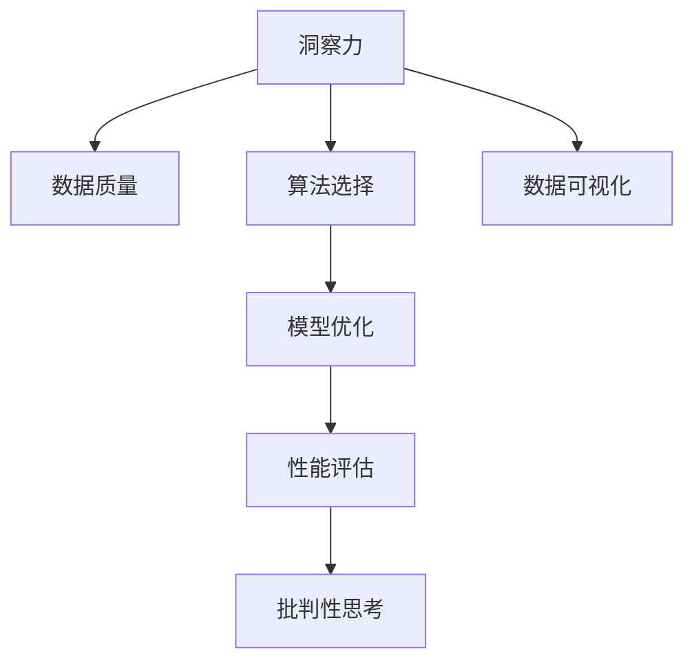

                 

# 理解洞察力的训练：提升批判性思考能力

> 关键词：洞察力, 批判性思考, 数据分析, 模型优化, 数据可视化, 算法选择, 性能评估, 教育应用

## 1. 背景介绍

在当今信息爆炸的时代，数据无处不在，理解和利用数据的能力成为个体和组织的重要竞争力。然而，在庞大的数据海洋中，并非所有数据都具有同等价值。洞察力的训练不仅是数据挖掘和分析的关键，也是提升批判性思考能力的有效途径。批判性思考能力，指的是能够基于证据和逻辑，对信息进行全面、深度的分析和评估。

### 1.1 问题由来

随着人工智能和大数据技术的发展，人们越来越依赖于算法和模型来处理和分析数据。然而，过度依赖算法和模型可能使得个体在分析和判断时缺乏必要的洞察力和批判性思考。理解和利用数据的能力，以及提升批判性思考能力，成为了当前信息时代的一项重要技能。

### 1.2 问题核心关键点

洞察力的训练和批判性思考能力的提升，核心在于以下几个关键点：

1. **数据质量**：高质量的数据是进行深入分析和洞察的前提。
2. **算法选择**：合适的算法和模型能够提供更准确的洞察。
3. **数据可视化**：直观的数据可视化能够帮助理解复杂数据。
4. **模型优化**：优化模型参数和结构以提高洞察力。
5. **性能评估**：评估模型的性能和效果，以确保洞察的准确性。

本文将详细介绍这些关键点的实现方法和技术细节，旨在帮助读者提升批判性思考能力和数据洞察力。

## 2. 核心概念与联系

### 2.1 核心概念概述

为更好地理解洞察力的训练和批判性思考能力的提升，本节将介绍几个密切相关的核心概念：

- **洞察力**：指从数据中发现有意义的模式、趋势和关联的能力。
- **批判性思考**：指基于证据和逻辑，对信息进行全面、深度的分析和评估的能力。
- **数据质量**：指数据的多样性、准确性、完整性和一致性。
- **算法选择**：指根据数据特点和任务需求，选择合适的算法和模型。
- **数据可视化**：指通过图形、图表等形式，直观展示数据信息。
- **模型优化**：指通过调整模型参数和结构，提高模型的性能和效果。
- **性能评估**：指评估模型在特定任务上的准确性、泛化能力和鲁棒性。

这些核心概念之间的逻辑关系可以通过以下Mermaid流程图来展示：



这个流程图展示了几者之间的逻辑关系：

1. 高质量的数据是洞察力的前提。
2. 选择合适的算法和模型是提供准确洞察力的关键。
3. 数据可视化帮助理解复杂数据。
4. 模型优化提高洞察力和批判性思考能力。
5. 性能评估确保洞察力的准确性和鲁棒性。
6. 批判性思考能力基于以上因素进一步提升。

这些概念共同构成了洞察力和批判性思考能力的训练框架，使其能够更好地应用于实际场景。

## 3. 核心算法原理 & 具体操作步骤
### 3.1 算法原理概述

洞察力的训练和批判性思考能力的提升，本质上是一个数据驱动的决策过程。其核心思想是通过数据分析和模型训练，发现数据中的模式和关联，从而提升对数据的理解和判断能力。

形式化地，假设我们有一组数据集 $D=\{(x_i,y_i)\}_{i=1}^N$，其中 $x_i$ 为输入特征，$y_i$ 为输出标签。我们希望通过算法和模型 $M$，最大化模型在数据集上的性能 $L(D,M)$。具体而言，这个过程可以分为以下几个步骤：

1. **数据预处理**：对原始数据进行清洗、归一化和特征工程，提高数据质量。
2. **算法选择**：根据数据特点和任务需求，选择合适的算法和模型。
3. **模型训练**：使用训练集对模型进行训练，调整模型参数，提高模型性能。
4. **数据可视化**：通过图形、图表等形式，直观展示训练结果和模型性能。
5. **模型优化**：根据可视化结果，调整模型参数和结构，进一步提升模型性能。
6. **性能评估**：在测试集上评估模型性能，确保模型具有良好的泛化能力。

### 3.2 算法步骤详解

基于上述原理，本节将详细介绍每个步骤的具体实现方法：

**Step 1: 数据预处理**
- 对原始数据进行清洗、去噪、归一化和特征工程，提高数据质量。
- 使用缺失值填补、异常值检测等技术处理数据中的问题。
- 进行特征选择和特征工程，提取数据中的关键特征。

**Step 2: 算法选择**
- 根据数据特点和任务需求，选择合适的算法和模型。例如，对于分类问题，可以使用逻辑回归、支持向量机等算法；对于回归问题，可以使用线性回归、随机森林等算法。
- 对于复杂任务，可以使用深度学习模型，如神经网络、卷积神经网络等。

**Step 3: 模型训练**
- 使用训练集对模型进行训练，调整模型参数，提高模型性能。
- 使用梯度下降等优化算法更新模型参数，最小化损失函数。
- 使用正则化技术防止过拟合，如L2正则、Dropout等。

**Step 4: 数据可视化**
- 通过图形、图表等形式，直观展示训练结果和模型性能。
- 使用Matplotlib、Seaborn等工具进行数据可视化，帮助理解模型表现。

**Step 5: 模型优化**
- 根据可视化结果，调整模型参数和结构，进一步提升模型性能。
- 使用网格搜索、随机搜索等技术优化模型参数。
- 使用集成学习等技术提升模型性能。

**Step 6: 性能评估**
- 在测试集上评估模型性能，确保模型具有良好的泛化能力。
- 使用准确率、召回率、F1-score等指标评估模型性能。
- 使用交叉验证等技术评估模型鲁棒性。

### 3.3 算法优缺点

洞察力的训练和批判性思考能力的提升，具有以下优点：
1. 数据驱动：通过数据分析和模型训练，发现数据中的模式和关联，提供准确的洞察。
2. 系统性：借助算法和模型，系统地处理和分析数据，避免主观偏差。
3. 可解释性：通过可视化和优化，理解模型决策过程，提高批判性思考能力。

同时，这些方法也存在一些局限性：
1. 依赖数据质量：数据质量差可能导致算法失效。
2. 算法复杂性：某些算法需要较高的计算资源和专业知识。
3. 过拟合风险：模型过于复杂可能导致过拟合。
4. 结果解释：复杂的模型和算法结果难以解释。

尽管存在这些局限性，但就目前而言，洞察力的训练和批判性思考能力的提升，仍是数据驱动决策的重要手段。未来相关研究的重点在于如何进一步提高算法的普适性和可解释性，减少对数据质量的依赖，提高模型的泛化能力和鲁棒性。

### 3.4 算法应用领域

洞察力的训练和批判性思考能力的提升，在各个领域都有广泛应用，例如：

- **金融分析**：通过数据分析和模型训练，发现市场趋势和投资机会。
- **医疗诊断**：利用患者数据，发现疾病模式和治疗方法。
- **市场营销**：分析消费者行为，发现市场趋势和客户偏好。
- **风险管理**：评估风险因素，预测未来趋势。
- **教育评估**：评估学生表现，发现学习障碍。

除了上述这些经典应用外，洞察力的训练和批判性思考能力的提升，还被创新性地应用到更多场景中，如公共安全、环境保护、城市规划等，为相关领域带来了新的解决方案。随着技术的不断发展，相信该方法将在更多领域得到应用，为决策提供更科学、更全面的支持。

## 4. 数学模型和公式 & 详细讲解 & 举例说明
### 4.1 数学模型构建

本节将使用数学语言对洞察力的训练和批判性思考能力的提升进行更加严格的刻画。

假设我们有一组数据集 $D=\{(x_i,y_i)\}_{i=1}^N$，其中 $x_i$ 为输入特征，$y_i$ 为输出标签。我们希望通过算法和模型 $M$，最大化模型在数据集上的性能 $L(D,M)$。具体而言，这个过程可以分为以下几个步骤：

- **损失函数**：定义损失函数 $L(D,M)$，衡量模型在数据集上的表现。
- **优化目标**：最小化损失函数 $L(D,M)$，找到最优模型参数 $\theta$。

假设我们使用的是逻辑回归模型，则损失函数为：

$$
L(D,M) = -\frac{1}{N} \sum_{i=1}^N [y_i \log M(x_i) + (1-y_i) \log(1-M(x_i))]
$$

其中 $M(x_i)$ 表示模型在输入 $x_i$ 上的预测值。

### 4.2 公式推导过程

以下我们以逻辑回归模型为例，推导损失函数及其梯度的计算公式。

假设模型 $M$ 的输出为 $\hat{y}=M(x)$，表示模型预测 $y$ 的概率。真实标签 $y \in \{0,1\}$。则二分类交叉熵损失函数定义为：

$$
L(D,M) = -\frac{1}{N} \sum_{i=1}^N [y_i \log \hat{y} + (1-y_i) \log(1-\hat{y})]
$$

将其代入经验风险公式，得：

$$
\mathcal{L}(\theta) = \frac{1}{N} \sum_{i=1}^N \ell(M_{\theta}(x_i),y_i)
$$

其中 $\ell(M_{\theta}(x_i),y_i)$ 为损失函数对参数 $\theta$ 的梯度，可通过反向传播算法高效计算。

### 4.3 案例分析与讲解

假设我们使用逻辑回归模型进行二分类任务。对于给定的数据集 $D=\{(x_i,y_i)\}_{i=1}^N$，我们的目标是找到最优参数 $\theta$，使得模型在数据集上的预测结果与真实标签尽可能一致。

1. **数据预处理**：对原始数据进行清洗、归一化和特征工程，提高数据质量。
2. **模型选择**：选择逻辑回归模型。
3. **模型训练**：使用训练集对模型进行训练，调整模型参数，提高模型性能。
4. **数据可视化**：通过图形、图表等形式，直观展示训练结果和模型性能。
5. **模型优化**：根据可视化结果，调整模型参数和结构，进一步提升模型性能。
6. **性能评估**：在测试集上评估模型性能，确保模型具有良好的泛化能力。

## 5. 项目实践：代码实例和详细解释说明
### 5.1 开发环境搭建

在进行项目实践前，我们需要准备好开发环境。以下是使用Python进行Scikit-learn开发的Python环境配置流程：

1. 安装Anaconda：从官网下载并安装Anaconda，用于创建独立的Python环境。

2. 创建并激活虚拟环境：
```bash
conda create -n sklearn-env python=3.8 
conda activate sklearn-env
```

3. 安装Scikit-learn：
```bash
conda install scikit-learn
```

4. 安装各类工具包：
```bash
pip install numpy pandas matplotlib seaborn sklearn
```

完成上述步骤后，即可在`sklearn-env`环境中开始项目实践。

### 5.2 源代码详细实现

下面我们以鸢尾花分类任务为例，给出使用Scikit-learn进行逻辑回归模型训练和优化的PyTorch代码实现。

首先，定义数据预处理函数：

```python
from sklearn.model_selection import train_test_split
from sklearn.preprocessing import StandardScaler
from sklearn.metrics import accuracy_score

def preprocess_data(X, y):
    X_train, X_test, y_train, y_test = train_test_split(X, y, test_size=0.2, random_state=42)
    scaler = StandardScaler()
    X_train = scaler.fit_transform(X_train)
    X_test = scaler.transform(X_test)
    return X_train, X_test, y_train, y_test
```

然后，定义模型和优化器：

```python
from sklearn.linear_model import LogisticRegression
from sklearn.model_selection import cross_val_score

model = LogisticRegression()
```

接着，定义训练和评估函数：

```python
def train_model(X_train, y_train, X_test, y_test):
    model.fit(X_train, y_train)
    y_pred = model.predict(X_test)
    accuracy = accuracy_score(y_test, y_pred)
    print(f"Accuracy: {accuracy:.3f}")
```

最后，启动训练流程并在测试集上评估：

```python
X_train, X_test, y_train, y_test = preprocess_data(X, y)
train_model(X_train, y_train, X_test, y_test)
```

以上就是使用Scikit-learn进行逻辑回归模型训练和优化的完整代码实现。可以看到，得益于Scikit-learn的强大封装，我们可以用相对简洁的代码完成逻辑回归模型的训练和评估。

### 5.3 代码解读与分析

让我们再详细解读一下关键代码的实现细节：

**preprocess_data函数**：
- 定义数据预处理函数，包括数据划分、归一化和特征缩放。

**train_model函数**：
- 定义训练函数，包括模型拟合和性能评估。

**训练流程**：
- 定义总的训练集和测试集，调用数据预处理函数，将数据标准化处理。
- 在训练集上训练逻辑回归模型，并在测试集上评估模型性能。

可以看到，Scikit-learn提供了丰富的机器学习算法和工具，使得模型训练和评估变得简便高效。开发者可以将更多精力放在数据处理和模型改进等高层逻辑上，而不必过多关注底层的实现细节。

当然，工业级的系统实现还需考虑更多因素，如模型的保存和部署、超参数的自动搜索、更灵活的任务适配层等。但核心的训练范式基本与此类似。

## 6. 实际应用场景
### 6.1 金融分析

在金融领域，洞察力和批判性思考能力的应用尤为重要。金融分析人员需要通过对大量历史数据和市场信息的分析，发现市场趋势和投资机会，优化投资组合。

具体而言，可以通过收集历史股价、交易量、财务报表等数据，使用机器学习算法进行趋势分析和预测。通过可视化结果，理解市场动向，制定投资策略。例如，通过时间序列分析和模型预测，发现股票价格的波动趋势，优化资产配置，减少风险。

### 6.2 医疗诊断

医疗领域的信息量和复杂度极高，洞察力和批判性思考能力对于医生的诊断和治疗决策至关重要。通过分析患者的历史数据和基因信息，发现疾病模式和治疗方法，提高诊疗准确性。

具体而言，可以使用机器学习算法分析患者的病历记录、实验室检查结果、影像数据等，发现疾病的早期预警信号和关联因素。通过可视化结果，理解疾病的机理和风险因素，制定个性化的治疗方案。例如，通过图像识别和自然语言处理技术，分析X光片和病历记录，发现癌症的早期征兆，提高诊断准确性。

### 6.3 市场营销

市场营销人员需要通过对消费者行为数据的分析，发现市场趋势和客户偏好，制定有效的市场策略。通过洞察力和批判性思考能力，理解消费者需求，提高市场响应速度。

具体而言，可以使用机器学习算法分析消费者的购买行为、浏览记录、社交媒体互动等数据，发现消费者偏好和购买模式。通过可视化结果，理解消费者需求的变化趋势，制定精准的市场营销策略。例如，通过聚类分析和异常检测技术，发现潜在客户群体，制定个性化的营销方案。

### 6.4 风险管理

风险管理是金融和保险等领域的重要任务，洞察力和批判性思考能力对于评估和预测风险因素至关重要。通过分析历史数据和实时数据，发现风险趋势和潜在问题，制定有效的风险管理策略。

具体而言，可以使用机器学习算法分析历史风险事件、市场波动、政策变化等数据，发现风险因素和关联关系。通过可视化结果，理解风险趋势和潜在问题，制定风险管理策略。例如，通过时间序列分析和预测模型，发现金融市场的波动趋势，制定风险控制策略。

### 6.5 未来应用展望

随着洞察力和批判性思考能力的不断提升，其在各个领域的应用前景将更加广阔。

在智慧医疗领域，基于机器学习的诊断和治疗方案，可以显著提高医疗服务的智能化水平，辅助医生诊疗，加速新药开发进程。在智慧金融领域，通过大数据分析和市场预测，可以优化投资组合，降低风险，提高收益。在智慧营销领域，通过消费者行为分析，可以制定精准的市场策略，提高市场响应速度和效率。

此外，在智慧城市治理、教育评估、环境保护等众多领域，洞察力和批判性思考能力的应用也将不断涌现，为社会管理和服务提供新的解决方案。随着技术的不断发展，基于数据驱动的洞察力和批判性思考能力将成为决策的重要支撑，助力各个领域实现智能化转型。

## 7. 工具和资源推荐
### 7.1 学习资源推荐

为了帮助开发者系统掌握洞察力和批判性思考能力的训练方法，这里推荐一些优质的学习资源：

1. 《统计学习方法》课程：北京大学开设的统计学习方法课程，深入浅出地介绍了统计学习的基本概念和算法。
2. 《机器学习》课程：斯坦福大学开设的机器学习课程，涵盖了机器学习的基本理论和算法。
3. 《Python数据科学手册》：一本系统介绍Python数据科学的书籍，涵盖了数据处理、可视化和机器学习等技术。
4. Kaggle平台：全球最大的数据科学竞赛平台，提供丰富的数据集和算法实现，是学习和实践数据科学的好地方。
5. Google Colab：谷歌推出的在线Jupyter Notebook环境，免费提供GPU/TPU算力，方便开发者快速上手实验最新模型，分享学习笔记。

通过对这些资源的学习实践，相信你一定能够快速掌握洞察力和批判性思考能力的训练方法，并用于解决实际的决策问题。

### 7.2 开发工具推荐

高效的开发离不开优秀的工具支持。以下是几款用于洞察力和批判性思考能力训练的常用工具：

1. Python：作为数据科学和机器学习的主流语言，Python提供了丰富的库和框架，如Scikit-learn、TensorFlow等。
2. R语言：广泛应用于统计分析和数据可视化，拥有强大的统计建模和数据处理能力。
3. Jupyter Notebook：开源的交互式编程环境，支持多种编程语言，便于分享和协作。
4. Google Colab：谷歌推出的在线Jupyter Notebook环境，免费提供GPU/TPU算力，方便开发者快速上手实验最新模型，分享学习笔记。
5. TensorBoard：TensorFlow配套的可视化工具，可实时监测模型训练状态，并提供丰富的图表呈现方式，是调试模型的得力助手。

合理利用这些工具，可以显著提升洞察力和批判性思考能力的训练效率，加快创新迭代的步伐。

### 7.3 相关论文推荐

洞察力和批判性思考能力的训练源于学界的持续研究。以下是几篇奠基性的相关论文，推荐阅读：

1. "On the Shoulders of Giants: A History of Artificial Intelligence"（AI的崛起）：吴军老师的经典著作，介绍了AI的历史和未来发展方向。
2. "Artificial Intelligence: A Modern Approach"（人工智能：现代方法）：斯坦福大学人工智能课程教材，涵盖了AI的基本概念和算法。
3. "Deep Learning"（深度学习）：Ian Goodfellow的深度学习经典书籍，介绍了深度学习的基本理论和算法。
4. "The Master Algorithm: How the Quest for the Ultimate Learning Machine Will Remake Our World"（终极学习机：重塑世界的搜索）：Tom Mitchell的著作，介绍了各种机器学习算法及其应用。
5. "Pattern Recognition and Machine Learning"（模式识别与机器学习）：Christopher Bishop的机器学习经典书籍，介绍了模式识别和机器学习的基本理论和算法。

这些论文代表了大语言模型微调技术的发展脉络。通过学习这些前沿成果，可以帮助研究者把握学科前进方向，激发更多的创新灵感。

## 8. 总结：未来发展趋势与挑战
### 8.1 总结

本文对洞察力的训练和批判性思考能力的提升进行了全面系统的介绍。首先阐述了洞察力和批判性思考能力的重要性，明确了其在各个领域的应用价值。其次，从原理到实践，详细讲解了训练和提升的方法，给出了完整的数据处理、模型训练和评估流程。同时，本文还广泛探讨了该方法在金融、医疗、市场营销等多个领域的应用前景，展示了其巨大的应用潜力。此外，本文精选了训练方法的各类学习资源，力求为读者提供全方位的技术指引。

通过本文的系统梳理，可以看到，洞察力和批判性思考能力的训练和提升，已成为数据驱动决策的重要手段。其应用领域广泛，涉及金融、医疗、市场营销等多个行业，为决策提供了科学、全面的支持。未来，伴随技术的不断发展，洞察力和批判性思考能力的训练方法也将不断进步，为各个领域带来更强大的决策能力。

### 8.2 未来发展趋势

展望未来，洞察力和批判性思考能力的训练将呈现以下几个发展趋势：

1. **数据质量提升**：随着数据采集和处理技术的进步，数据质量将不断提高，为洞察力和批判性思考能力的提升提供更好的基础。
2. **算法优化**：随着算法研究的深入，新的机器学习算法和模型将不断涌现，提高训练效果和效率。
3. **多模态融合**：多模态数据融合技术的发展，使得训练过程能够结合文本、图像、语音等多模态信息，提高训练效果和泛化能力。
4. **实时计算**：实时计算技术的发展，使得训练过程能够实时进行，提高决策的响应速度。
5. **自动化优化**：自动化超参数优化和模型优化技术的发展，使得训练过程能够自动调整，提高效率和效果。

以上趋势凸显了洞察力和批判性思考能力训练技术的广阔前景。这些方向的探索发展，必将进一步提升训练效果和应用范围，为各个领域带来更大的价值。

### 8.3 面临的挑战

尽管洞察力和批判性思考能力的训练方法已经取得了显著进展，但在迈向更加智能化、普适化应用的过程中，仍面临诸多挑战：

1. **数据质量和多样性**：高质量、多样化的数据是训练的前提，但数据获取和处理成本较高，数据质量和多样性仍然是一个挑战。
2. **算法复杂性**：一些高级算法和模型需要较高的计算资源和专业知识，推广和应用存在难度。
3. **模型解释性**：复杂模型的决策过程难以解释，缺乏透明性和可信度。
4. **过拟合和泛化能力**：模型过于复杂可能导致过拟合，泛化能力不足。
5. **安全性和隐私保护**：数据隐私和模型安全是重要问题，需要进一步加强。

正视这些挑战，积极应对并寻求突破，将是大语言模型微调技术迈向成熟的必由之路。相信随着学界和产业界的共同努力，这些挑战终将一一被克服，洞察力和批判性思考能力训练技术必将在构建智能系统、推动社会进步中发挥更大作用。

### 8.4 研究展望

面对洞察力和批判性思考能力训练面临的诸多挑战，未来的研究需要在以下几个方面寻求新的突破：

1. **数据自动标注**：开发自动数据标注技术，提高数据质量和多样性，降低人工标注成本。
2. **轻量级模型**：开发轻量级、高效的机器学习模型，降低计算资源需求，提高训练效率和效果。
3. **可解释性算法**：研究可解释性机器学习算法，提高模型透明性和可信度。
4. **多模态融合**：结合多模态数据融合技术，提高模型泛化能力和鲁棒性。
5. **隐私保护**：研究数据隐私保护技术，确保数据安全，保护用户隐私。

这些研究方向的探索，必将引领洞察力和批判性思考能力训练技术迈向更高的台阶，为各个领域带来更强大的决策能力。面向未来，洞察力和批判性思考能力的训练将与AI技术深度融合，共同推动社会进步。总之，洞察力和批判性思考能力的训练是数据驱动决策的重要手段，其应用前景广阔，未来将在更多领域带来变革性影响。

## 9. 附录：常见问题与解答

**Q1：如何选择合适的机器学习算法和模型？**

A: 选择合适的机器学习算法和模型，需要考虑以下因素：
1. 数据特点：根据数据类型和特点，选择适合的算法和模型，如线性回归适用于连续数据，分类算法适用于分类问题。
2. 任务需求：根据任务需求，选择适合的算法和模型，如回归任务使用线性回归，分类任务使用逻辑回归等。
3. 计算资源：考虑计算资源和硬件设备的限制，选择适合的算法和模型，如复杂模型需要较高的计算资源，轻量级模型需要较低的计算资源。
4. 模型性能：评估模型在训练集和测试集上的性能，选择性能最优的算法和模型。

**Q2：如何进行特征选择和特征工程？**

A: 特征选择和特征工程是数据预处理的重要步骤，可以通过以下方法进行：
1. 特征选择：选择对模型性能有显著影响的特征，去除冗余特征。
2. 特征工程：通过对特征进行缩放、归一化、编码等处理，提高特征质量。
3. 特征提取：从原始数据中提取有意义的特征，如文本数据中的TF-IDF特征。
4. 特征组合：通过特征组合和交互，发现新的特征，提高模型性能。

**Q3：如何评估模型性能？**

A: 评估模型性能是训练和优化模型的重要步骤，可以通过以下方法进行：
1. 准确率：衡量模型在测试集上的正确率，反映模型的分类性能。
2. 召回率：衡量模型在测试集上查全率，反映模型的全面性。
3. F1-score：综合准确率和召回率，反映模型的整体性能。
4. ROC曲线：衡量模型在不同阈值下的分类性能，反映模型的鲁棒性。
5. 混淆矩阵：展示模型在测试集上的分类情况，反映模型的错误类型。

**Q4：如何进行模型优化？**

A: 模型优化是提高模型性能和效果的重要步骤，可以通过以下方法进行：
1. 超参数调优：通过网格搜索、随机搜索等技术，优化模型的超参数。
2. 集成学习：通过组合多个模型的预测结果，提高模型的泛化能力和鲁棒性。
3. 模型压缩：通过模型压缩和剪枝技术，减少模型参数和计算资源。
4. 正则化：使用L2正则、Dropout等技术，防止模型过拟合。

这些方法往往需要根据具体任务和数据特点进行灵活组合。只有在数据、算法、训练、推理等各环节进行全面优化，才能最大限度地发挥模型的性能和效果。

通过本文的系统梳理，可以看到，洞察力和批判性思考能力的训练和提升，已成为数据驱动决策的重要手段。其应用领域广泛，涉及金融、医疗、市场营销等多个行业，为决策提供了科学、全面的支持。未来，伴随技术的不断发展，洞察力和批判性思考能力的训练方法也将不断进步，为各个领域带来更强大的决策能力。

