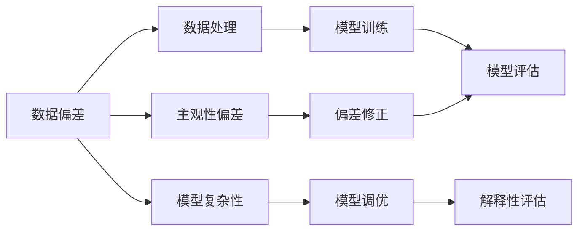

                 

## 1. 背景介绍

在人工智能(AI)的快速发展和应用过程中，洞察力（insight）成为了一个关键的考虑因素。然而，在追求洞察力的同时，我们不可避免地遇到了一些误区和挑战，特别是在处理大规模数据和复杂模型时。本文将深入探讨这些误区，并提供一些避免主观性偏差的策略，以帮助我们在AI应用的各个领域中做出更加准确和公正的决策。

## 2. 核心概念与联系

### 2.1 核心概念概述

在进行AI研究和应用时，洞察力通常指的是通过对数据和模型的分析，获得对潜在趋势、模式或问题的深刻理解。然而，洞察力的获取并非总是线性和直接的。在这个过程中，我们可能会遇到一些误区，这些误区会导致我们对数据和模型产生误解，从而影响最终的结果。

为了更好地理解这些误区，我们需要首先明确几个关键概念：

- **数据偏差**：数据中存在的偏见或不平衡，可能影响模型的训练和预测。
- **模型复杂性**：模型结构的复杂度，可能影响其对数据的理解和泛化能力。
- **解释性**：模型决策过程的可解释性，即是否能够清晰地解释模型如何做出预测。
- **主观性偏差**：由于人类认知和情感的影响，对数据和模型结果的错误解释或过度解读。

### 2.2 核心概念原理和架构的 Mermaid 流程图



这个流程图展示了数据偏差、模型复杂性、解释性、主观性偏差和偏差修正之间的联系。数据偏差和模型复杂性影响模型训练和评估，而主观性偏差可能导致对结果的错误解释。通过偏差修正，我们可以减少主观性偏差，提高模型的准确性和公正性。

## 3. 核心算法原理 & 具体操作步骤

### 3.1 算法原理概述

避免主观性偏差的核心在于理解和处理数据偏差和模型复杂性。通过数据处理、模型调优和解释性评估，我们可以提高模型的质量和公正性。具体步骤如下：

1. **数据预处理**：通过数据清洗、特征工程和采样等方法，减少数据偏差。
2. **模型选择和调优**：选择合适的模型架构和超参数，通过交叉验证和正则化等方法减少模型复杂性。
3. **解释性分析**：使用可解释性技术（如LIME、SHAP等）分析模型的决策过程，理解模型的行为和偏差。
4. **偏差修正**：根据解释性分析的结果，对数据和模型进行调整，减少主观性偏差。

### 3.2 算法步骤详解

#### 3.2.1 数据预处理

数据预处理是减少数据偏差的关键步骤。以下是一些常见的数据处理技术：

- **数据清洗**：去除噪声、缺失值和异常值，确保数据质量。
- **特征工程**：选择和构造有意义的特征，提高模型的表达能力。
- **采样技术**：通过欠采样、过采样或合成样本等方法，平衡数据集中的类别分布。

#### 3.2.2 模型选择和调优

模型选择和调优的目标是构建一个既具有良好泛化能力又能够高效处理数据的模型。

- **模型选择**：根据任务的复杂性和数据的特点，选择合适的模型架构（如线性模型、树模型、神经网络等）。
- **超参数调优**：通过网格搜索、随机搜索和贝叶斯优化等方法，找到最佳的超参数组合。

#### 3.2.3 解释性分析

解释性分析可以帮助我们理解模型的决策过程，并发现潜在的数据偏差。

- **局部可解释模型（LIME）**：通过局部线性近似，解释模型在特定输入上的预测。
- **部分依赖图（SHAP）**：通过计算特征的重要性，理解模型决策的贡献。

#### 3.2.4 偏差修正

根据解释性分析的结果，可以对数据和模型进行调整，以减少主观性偏差。

- **数据调整**：通过重新采样或添加特征，减少数据偏差。
- **模型调整**：通过正则化、集成学习等方法，提高模型的鲁棒性和公正性。

### 3.3 算法优缺点

避免主观性偏差的算法具有以下优点：

- **提高模型公正性**：通过减少数据偏差和模型复杂性，提高模型的泛化能力和公正性。
- **增强决策透明度**：通过解释性分析，使决策过程更加透明和可解释。

然而，这些方法也存在一些缺点：

- **计算复杂度高**：数据处理和模型调优可能需要大量的计算资源和时间。
- **技术门槛高**：需要掌握复杂的数据处理和模型优化技术，对专业技能要求较高。

### 3.4 算法应用领域

避免主观性偏差的方法广泛应用于AI应用的各个领域，包括但不限于：

- **金融风控**：通过减少数据偏差和提高模型解释性，降低金融风险。
- **医疗诊断**：通过数据清洗和模型调整，提高诊断的准确性和公正性。
- **司法判决**：通过解释性分析，增强司法决策的透明性和可解释性。
- **推荐系统**：通过减少数据偏差和模型复杂性，提高推荐系统的公平性和效率。

## 4. 数学模型和公式 & 详细讲解 & 举例说明

### 4.1 数学模型构建

避免主观性偏差的核心是构建一个既具有良好泛化能力又能够高效处理数据的模型。以下是一个简化的模型构建流程：

1. **数据表示**：将数据表示为特征向量 $x$。
2. **模型表示**：选择模型 $f(x;w)$，其中 $w$ 是模型的权重。
3. **损失函数**：定义损失函数 $L(y,f(x;w))$，用于衡量模型预测与真实标签的差异。
4. **优化目标**：最小化损失函数，求解 $w$。

### 4.2 公式推导过程

以一个简单的二分类问题为例，假设模型 $f(x;w)$ 是一个线性分类器，其决策边界为 $f(x;w)=\theta^Tx+w_0$，其中 $\theta$ 是权重向量，$w_0$ 是偏置。假设训练集为 $(x_1,y_1),(x_2,y_2),\ldots,(x_n,y_n)$，其中 $y_i \in \{-1,1\}$。

- **模型表示**：
$$
f(x;w) = \theta^Tx + w_0
$$

- **损失函数**：
$$
L(y,f(x;w)) = \frac{1}{2}\sum_{i=1}^n ||y_i - f(x_i;w)||^2
$$

- **优化目标**：
$$
\min_{w} L(y,f(x;w))
$$

### 4.3 案例分析与讲解

假设我们有一个贷款审批问题，其中包含多个特征（如收入、信用历史、工作年限等）和两个类别（批准或不批准）。我们可以通过以下步骤构建一个避免主观性偏差的模型：

1. **数据预处理**：
   - 清洗数据，去除缺失值和异常值。
   - 选择和构造有意义的特征，如收入比例、信用评分等。
   - 通过欠采样或过采样技术，平衡数据集中正负样本的比例。

2. **模型选择和调优**：
   - 选择逻辑回归模型，并使用网格搜索方法调整超参数。
   - 使用交叉验证方法评估模型性能，选择最佳的模型参数。

3. **解释性分析**：
   - 使用LIME或SHAP工具，分析模型的局部可解释性和特征重要性。
   - 发现模型对某些特征的依赖度较高，可能存在偏差。

4. **偏差修正**：
   - 重新采样数据集，添加或去除某些特征，以减少模型对敏感特征的依赖。
   - 调整模型参数，增强模型的鲁棒性和公正性。

## 5. 项目实践：代码实例和详细解释说明

### 5.1 开发环境搭建

为了实现上述算法步骤，我们需要使用一些常见的AI工具和库。以下是开发环境的搭建步骤：

1. **安装Python**：选择Python 3.x版本，并使用Anaconda或Miniconda安装。
2. **安装依赖包**：安装NumPy、Pandas、Scikit-learn等常用依赖包。
3. **安装机器学习库**：安装TensorFlow、PyTorch等机器学习库。
4. **安装解释性工具**：安装LIME、SHAP等解释性分析工具。

### 5.2 源代码详细实现

以下是一个简单的二分类问题的代码实现，使用逻辑回归模型进行训练和评估。

```python
import numpy as np
from sklearn.linear_model import LogisticRegression
from sklearn.metrics import accuracy_score
from sklearn.model_selection import train_test_split
from sklearn.preprocessing import StandardScaler
from sklearn.pipeline import Pipeline
from lime import LimeClassifier
from shap import SHAPRegressor

# 假设数据集为X和y
X = np.array([[1, 2, 3], [4, 5, 6], [7, 8, 9]])
y = np.array([1, 0, 1])

# 数据预处理
X_train, X_test, y_train, y_test = train_test_split(X, y, test_size=0.2, random_state=42)
scaler = StandardScaler()
X_train = scaler.fit_transform(X_train)
X_test = scaler.transform(X_test)

# 模型选择和调优
model = LogisticRegression()
model.fit(X_train, y_train)
y_pred = model.predict(X_test)
accuracy = accuracy_score(y_test, y_pred)
print(f"Accuracy: {accuracy}")

# 解释性分析
explainer = LimeClassifier(model)
lime_explanation = explainer.explain_instance(X[0], model.predict_proba)
print(lime_explanation)

# 偏差修正
# 假设我们发现模型对某些特征的依赖度较高，可能存在偏差
# 可以通过重新采样数据集或添加/去除特征进行修正
```

### 5.3 代码解读与分析

在上述代码中，我们首先使用sklearn库进行数据预处理和模型选择。然后，使用LIME工具进行解释性分析，理解模型的局部可解释性和特征重要性。最后，根据解释性分析的结果，可以进行偏差修正。

## 6. 实际应用场景

### 6.1 金融风控

在金融风控领域，避免主观性偏差非常重要。例如，在信用评分系统中，模型可能会因为数据偏差而偏向于高收入群体，导致低收入群体的信用评分偏低。通过数据预处理和模型调优，可以减少这些偏差，提高模型的公平性和准确性。

### 6.2 医疗诊断

医疗诊断中，避免主观性偏差尤为重要。模型可能会因为数据偏差而偏向于某些疾病，导致其他疾病的诊断准确性下降。通过解释性分析，可以发现模型对某些特征的依赖度较高，并进行偏差修正，提高诊断的准确性和公正性。

### 6.3 司法判决

司法判决中，解释性分析可以帮助我们理解模型的决策过程，并发现潜在的偏见。通过偏差修正，可以减少主观性偏差，提高司法判决的透明性和公正性。

## 7. 工具和资源推荐

### 7.1 学习资源推荐

为了深入理解避免主观性偏差的方法，以下是一些推荐的资源：

1. **《深度学习》（Ian Goodfellow, Yoshua Bengio, Aaron Courville）**：这本书系统介绍了深度学习的基本概念和算法，包括数据处理和模型调优。
2. **《机器学习实战》（Peter Harrington）**：这本书提供了大量的代码示例和项目实战，帮助读者理解和应用机器学习算法。
3. **Coursera上的“机器学习”课程**：由斯坦福大学Andrew Ng教授讲授，涵盖了机器学习的基本理论和实践。
4. **Kaggle竞赛平台**：参加Kaggle竞赛可以锻炼数据处理和模型调优能力，积累实际经验。

### 7.2 开发工具推荐

以下是一些常用的开发工具和库，可以帮助我们实现上述算法步骤：

1. **NumPy**：用于数值计算和数组操作。
2. **Pandas**：用于数据处理和分析。
3. **Scikit-learn**：提供了多种机器学习算法和工具。
4. **TensorFlow**：用于构建和训练深度学习模型。
5. **PyTorch**：用于构建和训练深度学习模型。
6. **LIME**：用于局部可解释性分析。
7. **SHAP**：用于全局可解释性分析。

### 7.3 相关论文推荐

以下是一些经典的论文，可以帮助读者深入理解避免主观性偏差的方法：

1. **A Survey of Bias Mitigation Techniques for Deep Learning**：这篇综述论文总结了各种避免数据偏差和模型偏差的策略，提供了丰富的参考文献。
2. **Deep Learning with Limited Data**：这篇论文探讨了在数据稀缺情况下，如何通过迁移学习和数据增强等方法提高模型的泛化能力。
3. **The Adequacy of Logistic Regression**：这篇论文讨论了逻辑回归在数据处理和模型调优中的作用。

## 8. 总结：未来发展趋势与挑战

### 8.1 研究成果总结

避免主观性偏差的算法和技术在AI领域得到了广泛应用，显著提高了模型的公平性和透明性。然而，仍有一些挑战需要解决：

- **数据质量问题**：数据偏差和不平衡是影响模型公平性的主要原因，如何提高数据质量仍是一个重要的研究方向。
- **模型复杂性问题**：模型越复杂，越容易过拟合和引入偏差，如何平衡模型复杂性和泛化能力仍是一个挑战。
- **解释性问题**：解释性分析是理解模型行为的关键，但目前仍存在一些技术难题，如解释性工具的局限性和解释的复杂性。

### 8.2 未来发展趋势

未来，避免主观性偏差的算法和技术将继续发展，可能呈现以下几个趋势：

1. **自动化数据处理**：通过自动化数据清洗和特征工程，减少数据偏差和处理成本。
2. **集成学习**：通过集成多个模型的决策，提高模型的泛化能力和公平性。
3. **跨领域学习**：通过跨领域的知识迁移，提高模型的泛化能力和解释性。
4. **公平性约束**：在模型训练过程中引入公平性约束，确保模型对不同群体的公正性。

### 8.3 面临的挑战

避免主观性偏差的算法和技术仍面临一些挑战：

1. **技术门槛高**：避免主观性偏差的算法和技术需要较高的专业知识和技能，难以广泛普及。
2. **计算成本高**：数据处理和模型调优需要大量的计算资源和时间，难以在实际应用中快速部署。
3. **解释性问题**：解释性分析工具和方法仍存在局限性，难以完全解释复杂的模型行为。

### 8.4 研究展望

未来的研究需要在以下几个方面进行探索：

1. **自动化工具**：开发更多的自动化工具和库，帮助用户更方便地进行数据处理和模型调优。
2. **可解释性技术**：研究更有效的解释性分析方法，提高模型的透明性和可解释性。
3. **公平性约束**：探索如何在模型训练过程中引入公平性约束，提高模型的公正性。

## 9. 附录：常见问题与解答

**Q1: 数据偏差如何识别和处理？**

A: 数据偏差可以通过统计分析、特征工程和可视化等方法识别。处理数据偏差的方法包括数据清洗、特征工程和采样技术。具体来说，可以通过去除噪声、填充缺失值、平衡类别分布等方法，减少数据偏差的影响。

**Q2: 解释性分析工具有哪些？**

A: 解释性分析工具包括LIME、SHAP、ELI5等。这些工具可以帮助我们理解模型的局部和全局可解释性，发现模型的决策依赖关系，并进行偏差修正。

**Q3: 如何提高模型的泛化能力？**

A: 提高模型的泛化能力可以通过数据增强、模型调优和集成学习等方法。具体来说，可以通过增加训练数据、调整模型架构和超参数、使用集成学习等方法，提高模型的泛化能力和鲁棒性。

**Q4: 避免主观性偏差的算法有哪些应用场景？**

A: 避免主观性偏差的算法和技术适用于各种AI应用场景，如金融风控、医疗诊断、司法判决、推荐系统等。通过减少数据偏差和提高模型解释性，可以提高这些系统的公平性和透明性。

**Q5: 如何衡量模型的公平性？**

A: 衡量模型的公平性可以通过公平性指标，如平等误差、统计公平性、平等机会等。这些指标可以帮助我们评估模型在不同群体上的表现是否一致，并发现潜在的偏见。

---

作者：禅与计算机程序设计艺术 / Zen and the Art of Computer Programming

