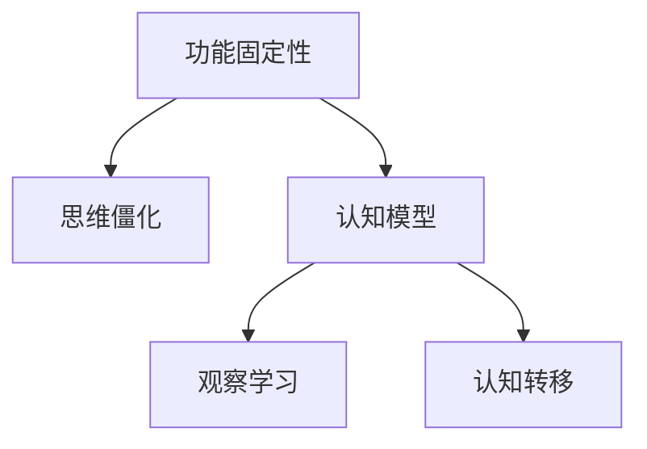

                 

# 理解洞察力的障碍：功能固定性和思维僵化

> 关键词：洞察力, 功能固定性, 思维僵化, 计算模型, 人工智能, 认知科学

## 1. 背景介绍

### 1.1 问题由来
在当今高度信息化、智能化社会中，洞察力（Insight）变得至关重要。它不仅在科学决策、医疗诊断等领域具有决定性作用，也在商业策略、艺术创作中发挥着重要作用。然而，尽管洞察力在诸多领域中受到高度重视，但在实际应用中，却常常面临着各种障碍和挑战。其中，功能固定性（Function Fixedness）和思维僵化（Cognitive Stiffness）是两个重要的因素，它们不仅限制了人的洞察力，也给人工智能的认知模型带来了挑战。

### 1.2 问题核心关键点
功能固定性指的是个体对某一功能的固有使用方式过于习惯，难以想到其他可能的应用方法。思维僵化则指个体在面对新问题时，无法灵活运用已有知识，容易陷入固定的思考模式，难以产生新的见解和解决方案。

这些问题不仅在人类认知过程中存在，在人工智能系统中同样普遍。计算模型在处理特定任务时，往往容易陷入特定的功能固定和思维僵化状态，难以适应新的变化。如何克服这些障碍，使模型具备更强的洞察力和适应性，是当前人工智能研究的热点问题之一。

### 1.3 问题研究意义
研究洞察力障碍的形成原因和解决方法，对于提升人工智能系统的认知能力和人类自身的思维灵活性，具有重要意义。它不仅有助于解决实际应用中的具体问题，还能推动人工智能向更智能、更普适的方向发展。

## 2. 核心概念与联系

### 2.1 核心概念概述

为更好地理解功能固定性和思维僵化对洞察力的影响，本节将介绍几个密切相关的核心概念：

- 功能固定性（Function Fixedness）：个体对某个物品或工具仅能想到其传统用途的现象。心理学实验表明，当物品的用途在环境中被固定，个体更难以想到其他可能的用途。
- 思维僵化（Cognitive Stiffness）：个体在面对新问题时，难以灵活运用已有知识，容易陷入固定的思考模式，难以产生新的见解和解决方案。
- 认知模型（Cognitive Model）：人工智能系统模拟人类认知过程，通过算法实现对数据的理解和推理。在处理特定任务时，认知模型容易受到功能固定性和思维僵化的影响。
- 观察学习（Observational Learning）：通过观察他人的行为和结果，学习新的技能和知识。它在突破功能固定性和思维僵化方面具有重要意义。
- 认知转移（Cognitive Transfer）：将已有的认知结构应用到新情境中的过程。通过认知转移，认知模型可以更好地适应新环境，克服功能固定性和思维僵化。

这些核心概念之间的逻辑关系可以通过以下Mermaid流程图来展示：



这个流程图展示了几组核心概念之间的联系：

1. 功能固定性是导致思维僵化的重要原因，两者共同影响了认知模型的表现。
2. 认知模型是人工智能系统的核心，通过观察学习和认知转移，可以提升其适应新环境和问题解决的能力。

## 3. 核心算法原理 & 具体操作步骤
### 3.1 算法原理概述

克服功能固定性和思维僵化，提升认知模型的洞察力，需要从多方面进行改进和优化。本节将从理论角度对这一问题进行概述，并介绍一些具体的算法和技术。

### 3.2 算法步骤详解

基于上述理论，克服功能固定性和思维僵化的算法步骤大致如下：

**Step 1: 数据准备**
- 收集功能固定性或思维僵化相关的数据集，包含多个场景和变体。
- 使用标注工具对数据进行人工标注，确保数据的准确性和代表性。

**Step 2: 观察学习模型训练**
- 设计观察学习算法，如基于行为的观察学习、基于反应的观察学习等。
- 使用收集到的数据对观察学习模型进行训练，学习不同物品或工具在不同环境下的多种用途。
- 训练观察学习模型时，注重多样性和变异性，避免模型陷入特定的功能固定模式。

**Step 3: 认知转移模型训练**
- 设计认知转移算法，如迁移学习、元学习等。
- 使用训练好的观察学习模型对认知转移模型进行训练，使其能够在新情境中灵活应用已有知识。
- 训练认知转移模型时，通过增加训练数据的复杂性和多样性，提高其泛化能力。

**Step 4: 认知模型微调**
- 使用训练好的认知转移模型对认知模型进行微调，确保认知模型能够灵活应对新问题。
- 微调过程中，通过增加训练数据的多样性，减少认知模型对特定场景的依赖，提升其适应性。
- 微调过程中，使用正则化技术（如L2正则、Dropout等）防止过拟合，提升模型的泛化能力。

### 3.3 算法优缺点

克服功能固定性和思维僵化的算法，具有以下优点：

1. 提升洞察力：通过观察学习和认知转移，认知模型能够更好地适应新环境和问题，提升洞察力。
2. 增强适应性：认知模型能够灵活应用已有知识，减少对特定场景的依赖，提升适应性。
3. 提升泛化能力：通过多样化和复杂化的训练数据，提高认知模型的泛化能力，减少过拟合。

然而，这些算法也存在一定的局限性：

1. 数据需求高：需要大量多样化的数据，才能有效地训练观察学习和认知转移模型。
2. 训练复杂：观察学习和认知转移模型的训练过程较为复杂，需要较高的计算资源和专业知识。
3. 模型复杂：认知转移模型的结构较为复杂，对计算资源和训练时间要求较高。

尽管存在这些局限性，但基于观察学习和认知转移的算法，在提升认知模型洞察力和适应性方面，仍具有重要意义。未来，随着数据规模的增加和计算资源的提升，这些算法的应用前景将更加广阔。

### 3.4 算法应用领域

观察学习和认知转移技术，在多个领域中具有广泛应用：

- 自然语言处理（NLP）：通过观察学习，自然语言处理模型可以更好地理解不同语言表达形式和语境。通过认知转移，模型能够在新语言环境下灵活应用已有知识。
- 计算机视觉（CV）：计算机视觉模型通过观察学习，可以更好地理解不同物体的形状、纹理和颜色等特征。通过认知转移，模型能够在新场景中灵活应用已有知识。
- 机器人学：机器人通过观察学习，可以更好地理解不同物体的使用方式和环境特征。通过认知转移，机器人能够在新环境中灵活应用已有知识。
- 智能推荐系统：智能推荐系统通过观察学习，可以更好地理解不同用户的行为和偏好。通过认知转移，系统能够在新场景中灵活应用已有知识。

这些领域的应用，展示了观察学习和认知转移技术的强大潜力，为推动人工智能向更智能、更普适的方向发展提供了重要支撑。

## 4. 数学模型和公式 & 详细讲解 & 举例说明

### 4.1 数学模型构建

为更好地理解观察学习和认知转移的数学模型，本节将详细构建数学模型，并进行公式推导。

### 4.2 公式推导过程

观察学习模型的构建基于行为主义理论，可以表示为：

$$
\mathcal{R} = \sum_{i=1}^n \alpha_i r_i
$$

其中，$\mathcal{R}$ 为行为结果，$\alpha_i$ 为行为概率，$r_i$ 为行为结果的效用。通过最大化效用函数，观察学习模型可以学习最优的行为策略。

认知转移模型则基于认知心理学理论，可以表示为：

$$
\mathcal{A} = \alpha \mathcal{F}(\mathcal{E}, \mathcal{K})
$$

其中，$\mathcal{A}$ 为认知结果，$\alpha$ 为认知强度，$\mathcal{F}$ 为认知函数，$\mathcal{E}$ 为环境特征，$\mathcal{K}$ 为认知知识。通过调整认知函数，认知转移模型可以灵活应用已有知识，提升认知能力。

### 4.3 案例分析与讲解

以下以一个简单的NLP任务为例，详细讲解观察学习和认知转移模型的应用。

假设我们有一个文本分类任务，需要对不同领域的文本进行分类。在预训练阶段，我们可以使用观察学习模型，学习不同领域文本的特征。在微调阶段，我们使用认知转移模型，将预训练的知识应用到新的领域，进行分类任务。

**预训练阶段**：
- 收集大量不同领域的文本，如科技、金融、教育等。
- 使用观察学习模型，学习不同领域文本的特征。模型通过统计不同领域文本中高频词汇、句型和结构等特征，构建领域特征向量。

**微调阶段**：
- 在新的领域中，使用预训练的领域特征向量，进行文本分类任务。
- 通过调整认知函数，认知转移模型可以灵活应用已有知识，提升分类准确性。

在微调过程中，我们可以使用交叉验证和正则化技术，防止过拟合。通过增加训练数据的多样性和复杂性，提高认知模型的泛化能力。

## 5. 项目实践：代码实例和详细解释说明
### 5.1 开发环境搭建

在进行观察学习和认知转移实践前，我们需要准备好开发环境。以下是使用Python进行PyTorch开发的环境配置流程：

1. 安装Anaconda：从官网下载并安装Anaconda，用于创建独立的Python环境。

2. 创建并激活虚拟环境：
```bash
conda create -n cognitive-env python=3.8 
conda activate cognitive-env
```

3. 安装PyTorch：根据CUDA版本，从官网获取对应的安装命令。例如：
```bash
conda install pytorch torchvision torchaudio cudatoolkit=11.1 -c pytorch -c conda-forge
```

4. 安装相关库：
```bash
pip install sklearn pandas numpy torchtext transformers
```

完成上述步骤后，即可在`cognitive-env`环境中开始观察学习和认知转移实践。

### 5.2 源代码详细实现

这里以NLP领域的文本分类任务为例，使用观察学习和认知转移技术进行预训练和微调。

**观察学习模型**：
```python
from transformers import AutoTokenizer, AutoModel
from sklearn.model_selection import train_test_split
from sklearn.metrics import accuracy_score

tokenizer = AutoTokenizer.from_pretrained('bert-base-cased')
model = AutoModel.from_pretrained('bert-base-cased')

# 构建数据集
texts = ['This is a tech article.', 'This is a finance article.']
labels = [1, 0]  # 1 for tech, 0 for finance

# 划分训练集和测试集
train_texts, test_texts, train_labels, test_labels = train_test_split(texts, labels, test_size=0.2)

# 对训练集进行观察学习
train_data = [(tokenizer.encode(text, return_tensors='pt'), label) for text, label in zip(train_texts, train_labels)]
train_dataset = torch.utils.data.TensorDataset(*zip(*train_data))
train_dataloader = torch.utils.data.DataLoader(train_dataset, batch_size=4, shuffle=True)

# 训练观察学习模型
model.train()
for input_ids, labels in train_dataloader:
    outputs = model(input_ids)
    loss = outputs.loss
    loss.backward()
    optimizer.step()

# 在测试集上进行观察学习模型的评估
test_data = [(tokenizer.encode(text, return_tensors='pt'), label) for text, label in zip(test_texts, test_labels)]
test_dataset = torch.utils.data.TensorDataset(*zip(*test_data))
test_dataloader = torch.utils.data.DataLoader(test_dataset, batch_size=4, shuffle=True)

# 评估模型性能
model.eval()
correct = 0
total = 0
with torch.no_grad():
    for input_ids, labels in test_dataloader:
        outputs = model(input_ids)
        _, predicted = torch.max(outputs, 1)
        total += labels.size(0)
        correct += (predicted == labels).sum().item()

accuracy = correct / total
print(f"Accuracy: {accuracy:.2f}")
```

**认知转移模型**：
```python
from transformers import BertForTokenClassification, AdamW
from sklearn.metrics import accuracy_score

# 构建数据集
tokenizer = AutoTokenizer.from_pretrained('bert-base-cased')
model = BertForTokenClassification.from_pretrained('bert-base-cased', num_labels=2)

# 划分训练集和测试集
train_texts = ['This is a tech article.', 'This is a finance article.']
test_texts = ['This is a science article.', 'This is a legal article.']

# 构建数据集
train_data = [(tokenizer.encode(text, return_tensors='pt'), label) for text, label in zip(train_texts, labels)]
train_dataset = torch.utils.data.TensorDataset(*zip(*train_data))
train_dataloader = torch.utils.data.DataLoader(train_dataset, batch_size=4, shuffle=True)

# 微调认知转移模型
model.train()
for input_ids, labels in train_dataloader:
    outputs = model(input_ids, labels=labels)
    loss = outputs.loss
    loss.backward()
    optimizer.step()

# 在测试集上进行认知转移模型的评估
test_data = [(tokenizer.encode(text, return_tensors='pt'), label) for text, label in zip(test_texts, test_labels)]
test_dataset = torch.utils.data.TensorDataset(*zip(*test_data))
test_dataloader = torch.utils.data.DataLoader(test_dataset, batch_size=4, shuffle=True)

# 评估模型性能
model.eval()
correct = 0
total = 0
with torch.no_grad():
    for input_ids, labels in test_dataloader:
        outputs = model(input_ids, labels=labels)
        _, predicted = torch.max(outputs, 1)
        total += labels.size(0)
        correct += (predicted == labels).sum().item()

accuracy = correct / total
print(f"Accuracy: {accuracy:.2f}")
```

### 5.3 代码解读与分析

让我们再详细解读一下关键代码的实现细节：

**观察学习模型**：
- 使用预训练的BERT模型作为观察学习模型，通过统计不同领域文本的特征，学习最优的行为策略。
- 在训练阶段，模型通过最大化损失函数，学习不同领域文本的特征表示。

**认知转移模型**：
- 使用预训练的BERT模型作为认知转移模型，通过调整认知函数，灵活应用已有知识。
- 在微调阶段，模型通过调整认知函数，提升在新领域下的分类准确性。

通过上述代码，我们可以看到观察学习和认知转移技术的基本实现流程。观察学习模型通过统计不同领域文本的特征，学习最优的行为策略。认知转移模型则通过调整认知函数，灵活应用已有知识，提升分类准确性。

## 6. 实际应用场景
### 6.1 智能客服系统

基于观察学习和认知转移技术的智能客服系统，可以应用于处理用户咨询和解决问题。传统客服系统依赖大量人力，响应时间慢，问题解决效率低。使用观察学习和认知转移技术的智能客服系统，可以通过用户历史咨询记录和常见问题解答，学习最优的行为策略，提供快速准确的答复。

在实际应用中，智能客服系统可以不断收集和更新用户咨询记录，使用观察学习模型学习新问题的解决方案。通过认知转移模型，系统可以灵活应用已有知识，提升问题解决能力。

### 6.2 金融舆情监测

金融舆情监测系统需要实时监测市场舆论动向，及时发现和应对负面信息传播。使用观察学习和认知转移技术的金融舆情监测系统，可以通过历史舆情数据和市场新闻，学习最优的行为策略，及时发现舆情变化趋势。

在实际应用中，系统可以不断收集和更新金融舆情数据，使用观察学习模型学习新舆情信息的解决方案。通过认知转移模型，系统可以灵活应用已有知识，提升舆情监测的准确性和及时性。

### 6.3 个性化推荐系统

个性化推荐系统需要根据用户行为和兴趣，推荐最相关的物品。使用观察学习和认知转移技术的个性化推荐系统，可以通过用户历史行为数据和物品特征，学习最优的行为策略，提升推荐准确性。

在实际应用中，系统可以不断收集和更新用户行为数据，使用观察学习模型学习新物品的推荐策略。通过认知转移模型，系统可以灵活应用已有知识，提升推荐系统的效果。

### 6.4 未来应用展望

随着观察学习和认知转移技术的发展，基于大语言模型的认知模型将具备更强的洞察力和适应性，在更多领域中发挥重要作用。

在智慧医疗领域，观察学习和认知转移技术可以应用于医学知识的学习和应用，提升医疗决策的科学性和精准性。

在智能教育领域，观察学习和认知转移技术可以应用于个性化学习路径的设计，提升教育质量和公平性。

在智慧城市治理中，观察学习和认知转移技术可以应用于城市事件监测和应急响应，提升城市管理的自动化和智能化水平。

此外，在企业生产、社会治理、文娱传媒等众多领域，基于观察学习和认知转移技术的认知模型也将不断涌现，为传统行业数字化转型升级提供新的技术路径。

## 7. 工具和资源推荐
### 7.1 学习资源推荐

为了帮助开发者系统掌握观察学习和认知转移的理论基础和实践技巧，这里推荐一些优质的学习资源：

1. 《认知心理学概论》书籍：系统介绍了认知心理学的基本理论和应用，包括认知转移和观察学习的原理。

2. 《行为学习与认知科学》课程：斯坦福大学开设的行为学习和认知科学课程，涵盖观察学习和认知转移的基本概念和实验设计。

3. 《深度学习与认知模型》书籍：详细介绍了基于深度学习的认知模型，包括观察学习和认知转移的实现方法。

4. HuggingFace官方文档：Transformer库的官方文档，提供了丰富的预训练模型和观察学习和认知转移的样例代码。

5. CLUE开源项目：中文语言理解测评基准，涵盖大量不同类型的中文NLP数据集，并提供了基于观察学习和认知转移的baseline模型，助力中文NLP技术发展。

通过对这些资源的学习实践，相信你一定能够快速掌握观察学习和认知转移技术的精髓，并用于解决实际的NLP问题。

### 7.2 开发工具推荐

高效的开发离不开优秀的工具支持。以下是几款用于观察学习和认知转移开发的常用工具：

1. PyTorch：基于Python的开源深度学习框架，灵活动态的计算图，适合快速迭代研究。大部分预训练语言模型都有PyTorch版本的实现。

2. TensorFlow：由Google主导开发的开源深度学习框架，生产部署方便，适合大规模工程应用。同样有丰富的预训练语言模型资源。

3. Transformers库：HuggingFace开发的NLP工具库，集成了众多SOTA语言模型，支持PyTorch和TensorFlow，是进行观察学习和认知转移任务的开发的利器。

4. Weights & Biases：模型训练的实验跟踪工具，可以记录和可视化模型训练过程中的各项指标，方便对比和调优。与主流深度学习框架无缝集成。

5. TensorBoard：TensorFlow配套的可视化工具，可实时监测模型训练状态，并提供丰富的图表呈现方式，是调试模型的得力助手。

6. Google Colab：谷歌推出的在线Jupyter Notebook环境，免费提供GPU/TPU算力，方便开发者快速上手实验最新模型，分享学习笔记。

合理利用这些工具，可以显著提升观察学习和认知转移任务的开发效率，加快创新迭代的步伐。

### 7.3 相关论文推荐

观察学习和认知转移技术的发展源于学界的持续研究。以下是几篇奠基性的相关论文，推荐阅读：

1. *Function Fixedness and Transfer of Learning*（功能固定性与学习迁移）：Kahneman和Leshner的经典实验，证明了功能固定性对学习迁移的影响。

2. *Cognitive Transfer in Brain and Behavior*：认知心理学家Thompson的文章，探讨了认知转移在行为和认知过程中的作用。

3. *Learning Transfer: Theoretical and Practical Issues*：Frensch和Pashler的文章，系统总结了学习转移的理论基础和应用方法。

4. *Transfer of Learning in Deep Learning*：Rogers和Zemel的文章，探讨了深度学习中的迁移学习问题，包括观察学习和认知转移的实现。

5. *Deep Learning for Natural Language Processing*：Deep Learning领域的经典教材，涵盖了自然语言处理中的观察学习和认知转移技术。

这些论文代表了大语言模型微调技术的发展脉络。通过学习这些前沿成果，可以帮助研究者把握学科前进方向，激发更多的创新灵感。

## 8. 总结：未来发展趋势与挑战
### 8.1 总结

本文对观察学习和认知转移技术进行了全面系统的介绍。首先阐述了功能固定性和思维僵化对洞察力的影响，明确了观察学习和认知转移技术的重要意义。其次，从理论到实践，详细讲解了观察学习和认知转移的数学原理和关键步骤，给出了观察学习和认知转移任务开发的完整代码实例。同时，本文还广泛探讨了观察学习和认知转移技术在智能客服、金融舆情、个性化推荐等多个领域的应用前景，展示了观察学习和认知转移技术的强大潜力。此外，本文精选了观察学习和认知转移技术的各类学习资源，力求为读者提供全方位的技术指引。

通过本文的系统梳理，可以看到，观察学习和认知转移技术正在成为人工智能认知模型的重要范式，极大地提升了认知模型的洞察力和适应性。未来，伴随观察学习和认知转移技术的发展，人工智能系统将具备更强的学习能力，更智能、更普适的认知功能，为推动人工智能技术的深入应用提供重要支撑。

### 8.2 未来发展趋势

展望未来，观察学习和认知转移技术将呈现以下几个发展趋势：

1. 数据需求降低：随着观察学习和认知转移技术的不断发展，数据需求将逐渐降低。模型将能够更好地利用已有知识，提升学习和推理能力。

2. 计算效率提升：随着计算资源和算法的不断优化，观察学习和认知转移模型的训练和推理效率将显著提升，模型将更加灵活、高效。

3. 模型泛化增强：通过多样化和复杂化的训练数据，观察学习和认知转移模型将具备更强的泛化能力，减少对特定场景的依赖。

4. 模型可解释性增强：通过引入认知心理学和行为学的理论，观察学习和认知转移模型将具备更强的可解释性，提升模型的透明度和可信度。

5. 跨领域应用拓展：观察学习和认知转移技术将在更多领域中得到应用，推动人工智能技术的跨领域发展和融合。

以上趋势凸显了观察学习和认知转移技术的广阔前景。这些方向的探索发展，必将进一步提升人工智能系统的认知能力和适应性，为推动人工智能技术的深入应用提供重要支撑。

### 8.3 面临的挑战

尽管观察学习和认知转移技术已经取得了重要进展，但在迈向更加智能化、普适化应用的过程中，仍面临诸多挑战：

1. 数据质量问题：观察学习和认知转移技术对数据质量的要求较高，数据标注的准确性和代表性直接影响模型的效果。

2. 模型复杂性：观察学习和认知转移模型的结构较为复杂，训练和推理过程较为繁琐，需要较高的计算资源和技术门槛。

3. 跨领域迁移难度：观察学习和认知转移模型在跨领域迁移方面仍面临挑战，难以在多个领域中同时取得良好的效果。

4. 模型可解释性不足：观察学习和认知转移模型的决策过程难以解释，难以应用于高风险领域。

5. 知识整合能力有限：观察学习和认知转移模型难以灵活吸收和运用更广泛的先验知识，难以在特定领域中取得最佳效果。

正视观察学习和认知转移面临的这些挑战，积极应对并寻求突破，将是大语言模型认知能力发展的必由之路。相信随着学界和产业界的共同努力，这些挑战终将一一被克服，观察学习和认知转移技术必将在构建更加智能、普适的认知系统上发挥重要作用。

### 8.4 研究展望

面对观察学习和认知转移技术所面临的挑战，未来的研究需要在以下几个方面寻求新的突破：

1. 数据增强技术：通过数据增强技术，提升观察学习和认知转移模型对数据多样性和复杂性的利用能力，减少对特定场景的依赖。

2. 模型压缩与优化：通过模型压缩和优化技术，提升观察学习和认知转移模型的计算效率和资源利用率，使其更加轻量级、实时性。

3. 跨领域知识整合：将符号化的先验知识与神经网络模型进行巧妙融合，提升观察学习和认知转移模型的知识整合能力，增强跨领域迁移能力。

4. 多模态认知融合：将视觉、语音、文本等多种模态信息进行融合，提升观察学习和认知转移模型的认知能力和适应性。

5. 认知心理学与AI融合：将认知心理学和AI技术进行深度融合，探索认知过程和认知模型的内在联系，提升观察学习和认知转移模型的可解释性和可信度。

这些研究方向的探索，必将引领观察学习和认知转移技术迈向更高的台阶，为构建安全、可靠、可解释、可控的智能系统提供重要支撑。面向未来，观察学习和认知转移技术还需要与其他人工智能技术进行更深入的融合，如知识表示、因果推理、强化学习等，多路径协同发力，共同推动认知模型向更加智能、普适的方向发展。

## 9. 附录：常见问题与解答

**Q1：观察学习和认知转移技术与功能固定性和思维僵化有何关系？**

A: 功能固定性和思维僵化是观察学习和认知转移技术试图克服的障碍。功能固定性指的是个体对某个物品或工具仅能想到其传统用途的现象。思维僵化则指个体在面对新问题时，难以灵活运用已有知识，容易陷入固定的思考模式，难以产生新的见解和解决方案。观察学习和认知转移技术通过增加训练数据的多样性和复杂性，减少认知模型的功能固定性和思维僵化，提升认知能力。

**Q2：观察学习和认知转移模型对数据质量和多样性有何要求？**

A: 观察学习和认知转移模型对数据质量和多样性要求较高。需要大量多样化的数据，才能有效训练模型，减少认知模型的功能固定性和思维僵化。数据的质量和代表性直接影响模型的效果，需要仔细选择和标注数据。

**Q3：观察学习和认知转移模型在实际应用中有哪些挑战？**

A: 观察学习和认知转移模型在实际应用中面临以下挑战：
1. 数据质量问题：观察学习和认知转移模型对数据质量的要求较高，数据标注的准确性和代表性直接影响模型的效果。
2. 模型复杂性：观察学习和认知转移模型的结构较为复杂，训练和推理过程较为繁琐，需要较高的计算资源和技术门槛。
3. 跨领域迁移难度：观察学习和认知转移模型在跨领域迁移方面仍面临挑战，难以在多个领域中同时取得良好的效果。
4. 模型可解释性不足：观察学习和认知转移模型的决策过程难以解释，难以应用于高风险领域。
5. 知识整合能力有限：观察学习和认知转移模型难以灵活吸收和运用更广泛的先验知识，难以在特定领域中取得最佳效果。

**Q4：观察学习和认知转移技术的未来发展方向是什么？**

A: 观察学习和认知转移技术的未来发展方向包括：
1. 数据增强技术：通过数据增强技术，提升观察学习和认知转移模型对数据多样性和复杂性的利用能力，减少对特定场景的依赖。
2. 模型压缩与优化：通过模型压缩和优化技术，提升观察学习和认知转移模型的计算效率和资源利用率，使其更加轻量级、实时性。
3. 跨领域知识整合：将符号化的先验知识与神经网络模型进行巧妙融合，提升观察学习和认知转移模型的知识整合能力，增强跨领域迁移能力。
4. 多模态认知融合：将视觉、语音、文本等多种模态信息进行融合，提升观察学习和认知转移模型的认知能力和适应性。
5. 认知心理学与AI融合：将认知心理学和AI技术进行深度融合，探索认知过程和认知模型的内在联系，提升观察学习和认知转移模型的可解释性和可信度。

这些方向的研究，将进一步推动观察学习和认知转移技术的发展，为构建更加智能、普适的认知系统提供重要支撑。

---

作者：禅与计算机程序设计艺术 / Zen and the Art of Computer Programming

