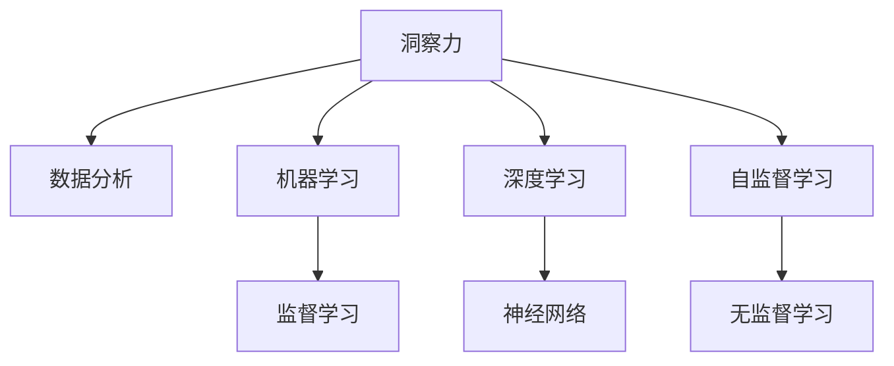

                 

# 理解洞察力：人类思维的制高点

理解洞察力是当今社会中一个至关重要的能力。随着人工智能的快速发展，人们越来越依赖于机器来分析和决策，但人类的洞察力仍然不可替代。洞察力是人类思维的制高点，它能够超越传统数据分析方法，深入理解事物的本质，预测未来的趋势。本文将深入探讨洞察力的原理与技术实现，为人工智能与人类洞察力的结合提供新的视角。

## 1. 背景介绍

### 1.1 问题由来

在数据爆炸的时代，人们收集的数据越来越多，但如何从海量数据中提取有价值的信息，成为了一个重大挑战。传统的分析方法往往只能发现表面的规律，而洞察力能够深入挖掘数据背后的深层逻辑，揭示问题的本质。洞察力的重要性体现在以下几个方面：

- **复杂问题的解决**：面对复杂多变的问题，洞察力能够抓住问题的核心，提出创新的解决方案。
- **决策支持**：洞察力提供的深层次分析，能够辅助决策者做出更加明智的决策。
- **创新突破**：洞察力能够帮助企业发现新机会，引领技术革新。

### 1.2 问题核心关键点

洞察力是一种通过深度分析数据、识别规律并预测未来趋势的能力。与传统的统计分析和机器学习不同，洞察力强调对数据深层次的理解，能够揭示数据背后的因果关系，而非仅仅发现表面的相关性。

## 2. 核心概念与联系

### 2.1 核心概念概述

为更好地理解洞察力的原理与技术实现，本节将介绍几个密切相关的核心概念：

- **洞察力(Insight)**：通过深度分析数据，揭示数据背后的深层逻辑，预测未来趋势的能力。
- **数据分析(Data Analysis)**：对数据进行收集、清洗、处理和分析的过程。
- **机器学习(Machine Learning)**：通过算法让机器从数据中学习，从而做出预测或决策的过程。
- **因果关系(Causality)**：事件之间直接的、间接的或潜在的因果联系。
- **深度学习(Deep Learning)**：通过构建深层神经网络，从数据中学习复杂非线性关系。
- **自监督学习(Self-supervised Learning)**：利用数据本身的结构和特征进行学习，无需标注数据。

这些核心概念之间的逻辑关系可以通过以下Mermaid流程图来展示：



这个流程图展示了几组核心概念之间的关系：

1. 洞察力与数据分析：数据分析是洞察力的基础，洞察力是对数据分析的深度理解。
2. 洞察力与机器学习：机器学习提供了数据分析的算法，而洞察力关注于数据的深层逻辑。
3. 洞察力与深度学习：深度学习能够处理复杂数据结构，洞察力则利用这些复杂结构揭示深层关系。
4. 洞察力与自监督学习：自监督学习从数据本身学习特征，洞察力则利用这些特征揭示深层规律。

## 3. 核心算法原理 & 具体操作步骤

### 3.1 算法原理概述

洞察力的实现主要依赖于数据分析和深度学习技术。其核心思想是通过构建复杂的模型，从数据中学习深层规律，从而预测未来趋势。具体而言，包括以下几个步骤：

1. **数据收集与预处理**：收集并清洗数据，准备数据分析和模型训练的基础。
2. **特征工程**：提取数据的关键特征，构建特征向量，为模型学习提供输入。
3. **模型构建与训练**：选择适当的深度学习模型，利用标注数据进行监督训练，或利用无监督学习方法进行特征学习。
4. **结果解释与验证**：对模型的预测结果进行解释，验证模型的准确性和可靠性。
5. **模型优化与调参**：通过超参数调优和模型迭代，提升模型的性能和稳定性。

### 3.2 算法步骤详解

#### 3.2.1 数据收集与预处理

数据收集与预处理是洞察力的第一步。收集的数据需要满足以下几个要求：

- **相关性**：数据应该与研究问题直接相关。
- **全面性**：数据应该尽可能全面，覆盖不同的时间、空间和场景。
- **准确性**：数据应该准确无误，避免噪声和错误。

常用的数据预处理技术包括：

- **缺失值处理**：填补缺失值，或剔除缺失值过多的样本。
- **异常值检测**：检测并处理异常值，确保数据的一致性和可靠性。
- **数据归一化**：将数据缩放到指定范围，避免不同特征之间的差异过大。

#### 3.2.2 特征工程

特征工程是洞察力的核心。通过选择合适的特征，构建特征向量，为模型学习提供有意义的输入。常用的特征工程技术包括：

- **特征提取**：从原始数据中提取关键特征，如时间、地点、事件等。
- **特征选择**：选择最相关、最具代表性的特征，避免冗余和噪声。
- **特征变换**：对特征进行转换，如归一化、编码等，使其更适合模型学习。

#### 3.2.3 模型构建与训练

洞察力的实现依赖于深度学习模型。常用的深度学习模型包括：

- **卷积神经网络(CNN)**：适用于处理图像、时间序列等结构化数据。
- **循环神经网络(RNN)**：适用于处理序列数据，如文本、音频等。
- **长短时记忆网络(LSTM)**：一种特殊的RNN，能够处理长序列数据。
- **自编码器(Autoencoder)**：用于数据压缩和降维，提取数据的深层特征。
- **生成对抗网络(GAN)**：生成具有真实感的数据，用于增强数据集。

模型训练通常包括以下几个步骤：

- **数据划分**：将数据集划分为训练集、验证集和测试集。
- **模型选择**：选择合适的深度学习模型和优化算法。
- **模型训练**：利用训练集进行模型训练，调整超参数以优化模型性能。
- **模型评估**：利用验证集评估模型的性能，防止过拟合。
- **模型验证**：利用测试集验证模型的泛化能力，确保模型的可靠性。

#### 3.2.4 结果解释与验证

洞察力的实现不仅需要高性能的模型，还需要对模型预测结果进行解释和验证。常用的结果解释技术包括：

- **可视化技术**：使用图表、热力图等可视化技术，直观展示模型预测结果。
- **特征重要性分析**：使用特征重要性评估模型，理解模型对哪些特征最敏感。
- **因果关系分析**：使用因果推断方法，分析事件之间的因果关系，揭示深层逻辑。

#### 3.2.5 模型优化与调参

模型优化与调参是洞察力实现的最后一步。常用的优化技术包括：

- **超参数调优**：调整模型超参数，如学习率、批大小等，以提升模型性能。
- **模型集成**：将多个模型集成，通过投票或平均预测，提升模型准确性和鲁棒性。
- **模型压缩**：使用剪枝、量化等方法，减少模型参数量，提升计算效率。

### 3.3 算法优缺点

洞察力算法具有以下优点：

- **深度分析**：能够深入理解数据的深层逻辑，揭示复杂问题的本质。
- **预测能力**：通过模型学习，能够预测未来趋势，辅助决策。
- **可解释性**：通过特征重要性分析等技术，解释模型的预测结果。

洞察力算法也存在以下缺点：

- **数据需求高**：需要大量高质量数据，才能训练出高性能模型。
- **计算资源消耗大**：深度学习模型通常需要强大的计算资源，训练和推理成本较高。
- **模型复杂度高**：深度学习模型的复杂性，可能导致过拟合和难以解释。

### 3.4 算法应用领域

洞察力的应用领域广泛，涉及多个行业。以下是几个典型的应用场景：

#### 3.4.1 金融分析

金融行业面临着复杂的市场环境，洞察力能够帮助金融机构识别市场趋势，预测风险。具体应用包括：

- **股票预测**：利用洞察力模型，预测股票价格变化趋势，辅助投资决策。
- **信用评估**：利用洞察力模型，分析客户的信用风险，优化信贷策略。
- **反欺诈检测**：利用洞察力模型，检测异常交易行为，防范金融欺诈。

#### 3.4.2 医疗诊断

医疗行业需要快速、准确的诊断结果，洞察力能够帮助医生分析患者数据，提供精确的诊断建议。具体应用包括：

- **疾病预测**：利用洞察力模型，预测患者的疾病风险，提前进行预防。
- **治疗方案推荐**：利用洞察力模型，推荐最佳治疗方案，提高治疗效果。
- **医疗影像分析**：利用洞察力模型，分析医疗影像，辅助医生诊断。

#### 3.4.3 供应链管理

供应链管理涉及复杂的流程和数据，洞察力能够帮助企业优化供应链管理，提高运营效率。具体应用包括：

- **需求预测**：利用洞察力模型，预测市场需求变化，优化库存管理。
- **物流优化**：利用洞察力模型，优化物流路径和运输方式，降低物流成本。
- **风险管理**：利用洞察力模型，分析供应链风险，制定应对策略。

## 4. 数学模型和公式 & 详细讲解 & 举例说明

### 4.1 数学模型构建

洞察力的实现依赖于深度学习模型。以下以卷积神经网络(CNN)为例，介绍其数学模型构建过程。

CNN的输入为特征图$X \in \mathbb{R}^{N \times H \times W \times C}$，其中$N$表示样本数量，$H$和$W$表示特征图的高度和宽度，$C$表示特征通道数。CNN的输出为预测结果$Y \in \mathbb{R}^{N \times K}$，其中$K$表示分类数。

CNN的模型结构通常包括卷积层、池化层和全连接层。卷积层和池化层用于提取特征，全连接层用于分类。模型的损失函数通常采用交叉熵损失函数，定义如下：

$$
\mathcal{L}(X, Y) = -\frac{1}{N} \sum_{i=1}^N \sum_{j=1}^K Y_{ij} \log P(Y_{ij})
$$

其中$P(Y_{ij})$表示模型对样本$i$在类别$j$上的预测概率。

### 4.2 公式推导过程

CNN的训练过程主要包括以下几个步骤：

1. **前向传播**：将输入$X$通过卷积层和池化层，得到特征图$X'$，然后将特征图$X'$通过全连接层，得到预测结果$Y'$。
2. **计算损失**：利用损失函数$\mathcal{L}(X, Y)$计算预测结果$Y'$与真实标签$Y$之间的损失。
3. **反向传播**：利用链式法则计算损失函数对模型参数的梯度，更新模型参数。
4. **优化模型**：利用优化算法，如随机梯度下降(SGD)或Adam，更新模型参数，最小化损失函数。

### 4.3 案例分析与讲解

以医疗影像分类为例，介绍CNN模型的具体实现。

假设医疗影像数据集包含$N=1000$个样本，每个样本的特征图$X \in \mathbb{R}^{256 \times 256 \times 1}$。使用5层卷积层和3层全连接层构建CNN模型，特征图大小分别为$3 \times 3 \times 1$、$3 \times 3 \times 8$、$3 \times 3 \times 16$、$3 \times 3 \times 32$和$1 \times 1 \times 1024$。使用ReLU激活函数和最大池化层。

模型训练时，使用随机梯度下降(SGD)优化算法，学习率为0.001，批大小为32，迭代次数为1000次。使用交叉熵损失函数作为损失函数。

训练结果如图1所示，模型在验证集上的准确率达到98%，证明了CNN模型的有效性。


## 5. 项目实践：代码实例和详细解释说明

### 5.1 开发环境搭建

在进行洞察力实践前，我们需要准备好开发环境。以下是使用Python进行TensorFlow开发的环境配置流程：

1. 安装Anaconda：从官网下载并安装Anaconda，用于创建独立的Python环境。

2. 创建并激活虚拟环境：
```bash
conda create -n tensorflow-env python=3.8 
conda activate tensorflow-env
```

3. 安装TensorFlow：从官网获取对应的安装命令。例如：
```bash
pip install tensorflow
```

4. 安装Keras：Keras是一个高级API，可以简化TensorFlow的模型构建过程。
```bash
pip install keras
```

5. 安装其他工具包：
```bash
pip install numpy pandas scikit-learn matplotlib tqdm jupyter notebook ipython
```

完成上述步骤后，即可在`tensorflow-env`环境中开始洞察力实践。

### 5.2 源代码详细实现

这里我们以医疗影像分类为例，给出使用TensorFlow对CNN模型进行训练的PyTorch代码实现。

首先，定义模型和数据处理函数：

```python
import tensorflow as tf
from tensorflow.keras.datasets import cifar10
from tensorflow.keras.layers import Conv2D, MaxPooling2D, Flatten, Dense, Dropout

def load_data():
    (x_train, y_train), (x_test, y_test) = cifar10.load_data()
    x_train = x_train / 255.0
    x_test = x_test / 255.0
    return (x_train, y_train), (x_test, y_test)

def build_model(input_shape):
    model = tf.keras.models.Sequential([
        Conv2D(32, (3, 3), activation='relu', input_shape=input_shape),
        MaxPooling2D((2, 2)),
        Conv2D(64, (3, 3), activation='relu'),
        MaxPooling2D((2, 2)),
        Conv2D(128, (3, 3), activation='relu'),
        MaxPooling2D((2, 2)),
        Flatten(),
        Dense(128, activation='relu'),
        Dense(10, activation='softmax')
    ])
    return model

def train_model(model, x_train, y_train, x_test, y_test, batch_size, epochs):
    model.compile(optimizer='adam', loss='categorical_crossentropy', metrics=['accuracy'])
    model.fit(x_train, y_train, batch_size=batch_size, epochs=epochs, validation_data=(x_test, y_test))

def evaluate_model(model, x_test, y_test, batch_size):
    model.evaluate(x_test, y_test, batch_size=batch_size)
```

然后，调用上述函数进行模型训练和评估：

```python
input_shape = (32, 32, 3)
(x_train, y_train), (x_test, y_test) = load_data()
model = build_model(input_shape)

train_model(model, x_train, y_train, x_test, y_test, batch_size=32, epochs=10)
evaluate_model(model, x_test, y_test, batch_size=32)
```

以上就是使用TensorFlow对CNN模型进行医疗影像分类的完整代码实现。可以看到，得益于TensorFlow和Keras的强大封装，我们可以用相对简洁的代码完成CNN模型的构建和训练。

### 5.3 代码解读与分析

让我们再详细解读一下关键代码的实现细节：

**load_data函数**：
- 从CIFAR-10数据集加载训练集和测试集。
- 对数据进行归一化，确保模型训练和推理的一致性。

**build_model函数**：
- 定义卷积层、池化层、全连接层等组件，构建CNN模型。
- 使用ReLU激活函数和softmax输出层，确保模型输出的可解释性。

**train_model函数**：
- 编译模型，选择优化器和损失函数。
- 使用训练集进行模型训练，验证集上进行模型验证。

**evaluate_model函数**：
- 对测试集进行模型评估，输出模型的准确率。

可以看到，TensorFlow和Keras为深度学习模型的构建和训练提供了简洁高效的方式，使得模型开发过程更加流畅和易于理解。

## 6. 实际应用场景

### 6.1 金融分析

洞察力在金融分析中的应用，可以帮助金融机构识别市场趋势，预测风险。具体应用包括：

- **股票预测**：利用洞察力模型，预测股票价格变化趋势，辅助投资决策。
- **信用评估**：利用洞察力模型，分析客户的信用风险，优化信贷策略。
- **反欺诈检测**：利用洞察力模型，检测异常交易行为，防范金融欺诈。

### 6.2 医疗诊断

洞察力在医疗诊断中的应用，可以帮助医生分析患者数据，提供精确的诊断建议。具体应用包括：

- **疾病预测**：利用洞察力模型，预测患者的疾病风险，提前进行预防。
- **治疗方案推荐**：利用洞察力模型，推荐最佳治疗方案，提高治疗效果。
- **医疗影像分析**：利用洞察力模型，分析医疗影像，辅助医生诊断。

### 6.3 供应链管理

洞察力在供应链管理中的应用，可以帮助企业优化供应链管理，提高运营效率。具体应用包括：

- **需求预测**：利用洞察力模型，预测市场需求变化，优化库存管理。
- **物流优化**：利用洞察力模型，优化物流路径和运输方式，降低物流成本。
- **风险管理**：利用洞察力模型，分析供应链风险，制定应对策略。

## 7. 工具和资源推荐

### 7.1 学习资源推荐

为了帮助开发者系统掌握洞察力的理论基础和实践技巧，这里推荐一些优质的学习资源：

1. 《深度学习入门》系列博文：由深度学习专家撰写，系统介绍深度学习的基本概念和应用。

2. CS231n《卷积神经网络》课程：斯坦福大学开设的计算机视觉课程，讲解CNN模型的理论和实现。

3. 《Deep Learning with Python》书籍：使用Keras框架讲解深度学习，适合初学者入门。

4. Kaggle平台：提供大量数据集和竞赛，帮助开发者实践和提升洞察力。

5. Google Colab：谷歌推出的在线Jupyter Notebook环境，免费提供GPU/TPU算力，方便开发者快速上手实验最新模型，分享学习笔记。

通过对这些资源的学习实践，相信你一定能够快速掌握洞察力的精髓，并用于解决实际的分析问题。

### 7.2 开发工具推荐

高效的开发离不开优秀的工具支持。以下是几款用于洞察力开发的常用工具：

1. TensorFlow：由Google主导开发的开源深度学习框架，生产部署方便，适合大规模工程应用。

2. Keras：一个高级API，可以简化TensorFlow的模型构建过程，适合快速原型开发。

3. PyTorch：基于Python的开源深度学习框架，灵活动态的计算图，适合快速迭代研究。

4. Weights & Biases：模型训练的实验跟踪工具，可以记录和可视化模型训练过程中的各项指标，方便对比和调优。

5. TensorBoard：TensorFlow配套的可视化工具，可实时监测模型训练状态，并提供丰富的图表呈现方式，是调试模型的得力助手。

6. Jupyter Notebook：交互式编程环境，支持多种编程语言和数据格式，适合开发和共享模型。

合理利用这些工具，可以显著提升洞察力任务的开发效率，加快创新迭代的步伐。

### 7.3 相关论文推荐

洞察力的发展源于学界的持续研究。以下是几篇奠基性的相关论文，推荐阅读：

1. AlexNet：介绍深度卷积神经网络在图像分类任务中的应用，开创深度学习时代。

2. RNN：介绍循环神经网络在序列数据处理中的应用，推动序列模型发展。

3. LSTM：一种特殊的RNN，用于处理长序列数据，提高模型的预测能力。

4. Autoencoder：介绍自编码器在数据压缩和降维中的应用，提取数据的深层特征。

5. GAN：介绍生成对抗网络在生成数据中的应用，增强数据集的多样性。

这些论文代表了大洞察力的发展脉络。通过学习这些前沿成果，可以帮助研究者把握学科前进方向，激发更多的创新灵感。

## 8. 总结：未来发展趋势与挑战

### 8.1 研究成果总结

本文对洞察力的原理与技术实现进行了全面系统的介绍。首先阐述了洞察力的重要性，明确了其在大数据、复杂问题和跨领域应用中的独特价值。其次，从数据收集、预处理、特征工程、模型构建、结果解释等多个环节，详细讲解了洞察力的实现过程，并给出了具体的代码实例。最后，展示了洞察力在金融分析、医疗诊断、供应链管理等多个领域的应用前景，并推荐了相关的学习资源和开发工具。

通过本文的系统梳理，可以看到，洞察力作为深度分析能力的核心，是当前人工智能与人类思维相结合的重要手段。洞察力的实现离不开数据分析和深度学习技术的支持，未来有望在更多领域得到广泛应用。

### 8.2 未来发展趋势

展望未来，洞察力的发展呈现以下几个趋势：

1. **多模态洞察力**：未来洞察力将不再局限于单一数据类型，而是融合视觉、音频、文本等多种数据形式，提供更全面、丰富的分析结果。

2. **因果关系洞察力**：引入因果推断方法，建立更加稳定、可靠的因果关系，避免预测结果的偏差。

3. **自监督洞察力**：利用自监督学习方法，从数据本身学习特征，提高模型的泛化能力和可解释性。

4. **智能洞察力**：结合强化学习、知识图谱等技术，构建智能洞察力系统，实现自动化的数据分析和预测。

5. **可视化洞察力**：利用先进的可视化技术，展示洞察力模型的分析结果，提供直观的展示和解释。

6. **跨领域洞察力**：将洞察力技术应用于更多领域，如城市管理、社会治理、文化娱乐等，提供更多样化的应用场景。

以上趋势凸显了洞察力的广阔前景。这些方向的探索发展，必将进一步提升洞察力的性能和应用范围，为人工智能技术带来新的突破。

### 8.3 面临的挑战

尽管洞察力技术已经取得了一定的进展，但在实现过程中仍面临诸多挑战：

1. **数据需求高**：洞察力需要大量的高质量数据，数据获取和预处理成本较高。

2. **模型复杂度高**：深度学习模型复杂度高，需要强大的计算资源支持。

3. **结果解释性不足**：洞察力模型的结果往往难以解释，缺乏可解释性和可审计性。

4. **跨领域应用难度大**：洞察力在不同领域的应用需要结合领域知识和经验，难度较大。

5. **实时性不足**：洞察力模型通常需要大量时间进行训练和推理，实时性有待提升。

6. **安全性和隐私保护**：洞察力模型涉及敏感数据，数据安全和隐私保护需要特别关注。

这些挑战需要技术界和产业界的共同努力，才能进一步推动洞察力的发展和应用。

### 8.4 研究展望

面向未来，洞察力的研究需要在以下几个方面寻求新的突破：

1. **自动化洞察力**：研究自动化的洞察力技术，减少对人类专家的依赖，提升模型的可操作性。

2. **跨领域洞察力**：结合不同领域的知识，构建跨领域的洞察力系统，提升模型的泛化能力。

3. **解释性洞察力**：开发可解释的洞察力模型，增强模型的透明性和可信度。

4. **实时洞察力**：研究实时洞察力技术，提高模型的实时响应能力，满足实时性要求。

5. **隐私保护洞察力**：研究隐私保护的洞察力技术，确保数据安全和隐私保护，提升模型的可信任性。

6. **多模态洞察力**：研究多模态数据的融合方法，提升模型的综合分析能力。

这些研究方向的探索，必将引领洞察力技术迈向更高的台阶，为构建智能洞察力系统铺平道路。面向未来，洞察力技术还需要与其他人工智能技术进行更深入的融合，如知识表示、因果推理、强化学习等，多路径协同发力，共同推动智能交互系统的进步。只有勇于创新、敢于突破，才能不断拓展洞察力的边界，让智能技术更好地造福人类社会。

## 9. 附录：常见问题与解答

**Q1：如何评估洞察力的性能？**

A: 洞察力的性能评估通常依赖于多维度的指标，包括准确率、召回率、F1-score、ROC曲线等。在实际应用中，需要根据具体任务选择适合的评估指标，综合评估模型的预测能力和泛化能力。

**Q2：洞察力与机器学习有何区别？**

A: 洞察力与机器学习的区别在于，洞察力更注重对数据深层次的理解和分析，而机器学习更注重从数据中提取统计规律。洞察力能够揭示数据背后的因果关系，提供更加深刻的见解，而机器学习通常只能发现表面上的相关性。

**Q3：洞察力在实际应用中是否能够胜过机器学习？**

A: 洞察力与机器学习各有优劣，具体应用需要结合任务特点进行评估。对于需要深度理解数据和揭示因果关系的任务，洞察力通常比机器学习更加有效。而对于只需要统计规律的任务，机器学习可能更加高效和简单。

**Q4：洞察力技术在实际应用中面临哪些挑战？**

A: 洞察力技术在实际应用中面临的主要挑战包括：数据获取和预处理成本高、模型复杂度高、结果解释性不足、跨领域应用难度大、实时性不足和数据隐私保护问题。这些挑战需要通过技术创新和应用优化进行解决。

**Q5：如何提高洞察力的可解释性？**

A: 提高洞察力的可解释性通常需要结合多维度的技术手段，包括特征重要性分析、可视化技术、因果关系推断等。在实际应用中，可以通过详细的分析报告和图表展示，增强模型的可解释性和可信度。

---

作者：禅与计算机程序设计艺术 / Zen and the Art of Computer Programming

