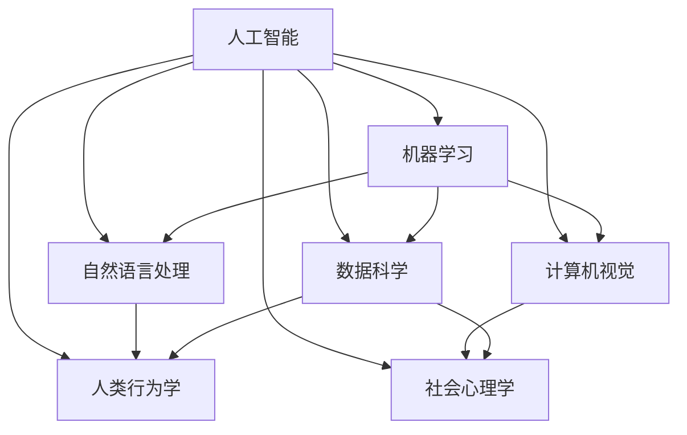

                 

# 理解的多维性：跨学科视角的重要性

> 关键词：跨学科,多维视角,人工智能,机器学习,自然语言处理(NLP),算法,技术融合,人类行为,社会影响,数据科学

## 1. 背景介绍

### 1.1 问题由来
近年来，随着科学技术迅猛发展，人工智能(AI)和数据科学在各行各业得到广泛应用。然而，技术的发展往往超越了单学科的范畴，需要跨学科的视角才能更好地理解和应用。特别是在人工智能领域，无论是机器学习、自然语言处理(NLP)还是计算机视觉，都无法单独应对所有问题。本文将从跨学科的视角出发，探讨理解的多维性以及它在人工智能中的应用。

### 1.2 问题核心关键点
跨学科视角意味着从多个学科角度出发，综合运用不同领域的知识和技能来解决问题。在人工智能领域，跨学科视角尤为重要。这是因为AI问题往往涉及多方面的技术和应用领域，单一学科的解决方案难以覆盖所有方面。

- 如何整合不同学科的知识和技能，构建更全面的AI模型？
- 如何从多维视角理解AI的原理和应用？
- 如何避免单一学科的局限性，开拓新的AI研究方向？
- 如何实现跨学科技术融合，提升AI系统的性能和鲁棒性？

### 1.3 问题研究意义
跨学科视角不仅有助于理解AI技术的本质和应用，还能促进不同学科的交流和融合，推动科技的进步。通过跨学科的研究，AI技术可以更好地服务于人类社会的各个方面，解决更复杂的问题。

## 2. 核心概念与联系

### 2.1 核心概念概述

为了更好地理解跨学科视角的重要性，本节将介绍几个密切相关的核心概念：

- 人工智能(AI)：通过计算机模拟人类的智能行为，包括感知、推理、学习等能力。
- 机器学习(ML)：利用数据和算法，使计算机系统自动学习并改进其性能。
- 自然语言处理(NLP)：使计算机能够理解、生成、翻译和分析人类语言。
- 计算机视觉(CV)：使计算机能够识别、理解、生成和分析图像和视频。
- 数据科学：利用数据、算法和统计方法，从数据中提取知识并指导决策。
- 人类行为学：研究人类的认知、情感和社会行为，提供行为数据和理论基础。
- 社会心理学：研究社会环境和人类行为之间的相互作用，理解人类在群体和环境中的行为模式。

这些核心概念之间存在密切联系，共同构成了人工智能的研究框架。通过跨学科的视角，我们可以更全面地理解这些技术的工作原理和应用场景。

### 2.2 核心概念原理和架构的 Mermaid 流程图(Mermaid 流程节点中不要有括号、逗号等特殊字符)


这个流程图展示了人工智能领域中各核心概念之间的联系和相互作用。机器学习是AI的核心算法，NLP和CV是其重要应用方向，而数据科学提供了数据和方法支持。同时，人类行为学和社会心理学为AI的应用提供了理论基础和行为数据。

## 3. 核心算法原理 & 具体操作步骤
### 3.1 算法原理概述

跨学科视角下的AI算法，通常需要从多个学科的角度出发，综合运用不同领域的知识和技能来解决问题。以下是几个关键的算法原理和操作步骤：

- **数据融合**：将来自不同数据源的数据进行融合，以获得更全面、准确的信息。例如，在NLP中，可以将文本、图像和语音数据融合，提升文本生成和理解的准确性。
- **多模态学习**：利用多模态数据进行学习，提升模型的鲁棒性和泛化能力。例如，在CV中，可以利用图像和文本数据的组合，提升物体识别和图像描述的准确性。
- **迁移学习**：将一个领域学习到的知识迁移到另一个领域，提高新任务的性能。例如，在NLP中，可以使用预训练的BERT模型进行微调，提升特定任务的表现。
- **协同学习**：多台设备或多个模型共同学习，分享知识和资源，提高整体性能。例如，在AI系统中，可以将多个模型和设备协同工作，提升系统的效率和鲁棒性。
- **元学习**：学习如何快速适应新任务，提升模型的通用性和适应性。例如，在机器人领域，可以利用元学习使机器人快速适应新环境和新任务。

### 3.2 算法步骤详解

以下以多模态学习为例，详细介绍其操作步骤：

**Step 1: 数据准备**
- 收集多模态数据集，包括文本、图像、音频等不同类型的数据。
- 对数据进行预处理，如数据清洗、归一化等。

**Step 2: 特征提取**
- 使用不同的特征提取器对不同模态的数据进行处理，提取特征。例如，使用卷积神经网络(CNN)提取图像特征，使用循环神经网络(RNN)提取文本特征。
- 将提取的特征进行拼接或融合，构建多模态特征表示。

**Step 3: 模型训练**
- 设计多模态模型，例如使用多模态卷积神经网络(MCNN)或多模态循环神经网络(MRNN)等。
- 使用多模态数据集进行模型训练，最小化损失函数。
- 使用梯度下降等优化算法，更新模型参数。

**Step 4: 模型评估**
- 在测试集上评估模型的性能，使用准确率、召回率等指标进行评估。
- 进行模型调参，调整超参数以提升性能。

**Step 5: 应用部署**
- 将训练好的模型部署到实际应用中，如自动驾驶、智能客服等。
- 实时监测模型性能，进行必要的调整和优化。

### 3.3 算法优缺点

跨学科视角的AI算法具有以下优点：
1. 多模态数据融合提升了模型的鲁棒性和泛化能力。
2. 迁移学习提高了新任务的性能，降低了模型开发成本。
3. 协同学习提升了系统的效率和鲁棒性，增强了系统的抗干扰能力。
4. 元学习提高了模型的通用性和适应性，提升了系统的灵活性。

同时，这些算法也存在一些缺点：
1. 数据融合需要高质量的数据和复杂的技术，难度较大。
2. 多模态学习模型复杂，训练成本较高。
3. 迁移学习依赖于源任务和目标任务的相似性，可能不适用于所有场景。
4. 协同学习和元学习需要强大的计算资源和高效的通信技术，对硬件要求较高。

尽管存在这些缺点，但跨学科视角下的AI算法在实际应用中已经展现出了巨大的潜力和价值。未来，随着技术的不断进步和硬件的不断升级，这些缺点有望得到进一步改善。

### 3.4 算法应用领域

跨学科视角的AI算法在多个领域得到了广泛应用：

- **自动驾驶**：融合图像、激光雷达和GPS等数据，提升车辆感知和决策能力。
- **智能客服**：融合文本、语音和图像数据，提升客户理解和响应准确性。
- **医疗诊断**：融合图像、基因和病历数据，提升诊断准确性和个性化医疗方案制定。
- **金融分析**：融合文本、图像和视频数据，提升风险评估和市场预测的准确性。
- **教育推荐**：融合文本、行为和社交数据，提升个性化推荐系统的精准度。
- **工业制造**：融合图像、声音和传感器数据，提升生产过程的自动化和智能化水平。
- **智慧城市**：融合图像、传感器和社交数据，提升城市管理和公共服务的效率和质量。

以上只是跨学科视角下AI应用的一部分，未来随着技术的不断进步，AI将在更多领域展现出更广泛的应用前景。

## 4. 数学模型和公式 & 详细讲解 & 举例说明

### 4.1 数学模型构建

以多模态学习为例，我们构建一个简单的数学模型来描述其工作原理。

假设有一个包含文本和图像的多模态数据集，其中文本为自然语言描述，图像为物体图像。我们可以使用以下模型来融合两者的信息：

- **文本表示**：使用词嵌入(BOW)或RNN提取文本特征。
- **图像表示**：使用卷积神经网络(CNN)提取图像特征。
- **多模态表示**：将文本和图像特征进行拼接，作为模型的输入。

### 4.2 公式推导过程

以简单的双线性分类器为例，推导其计算公式。

假设文本和图像特征分别为 $x_{text}$ 和 $x_{image}$，拼接后的多模态特征表示为 $x_{multi}$。则多模态分类器的计算公式为：

$$
\hat{y} = \sigma(x_{multi}W)
$$

其中 $W$ 为分类器权重矩阵，$\sigma$ 为激活函数。将文本和图像特征拼接后，得到一个更高维度的多模态特征 $x_{multi}$，然后通过线性分类器进行分类。

### 4.3 案例分析与讲解

以智能客服为例，分析跨学科视角下多模态学习的应用。

在智能客服系统中，客户可以通过文本、语音和视频进行互动。为了提升客户理解和响应准确性，系统可以融合三种模态的数据，构建多模态表示，进行自然语言理解和情感分析。

具体而言，系统可以采用以下步骤：
1. 收集客户文本、语音和视频数据，并进行预处理。
2. 使用文本嵌入提取文本特征，使用卷积神经网络提取语音特征，使用3D卷积神经网络提取视频特征。
3. 将三种模态的特征进行拼接或融合，构建多模态表示。
4. 使用多模态分类器进行自然语言理解和情感分析，生成回复。
5. 实时监测系统性能，进行必要的调整和优化。

## 5. 项目实践：代码实例和详细解释说明

### 5.1 开发环境搭建

在进行多模态学习实践前，我们需要准备好开发环境。以下是使用Python进行TensorFlow和Keras开发的环境配置流程：

1. 安装Anaconda：从官网下载并安装Anaconda，用于创建独立的Python环境。

2. 创建并激活虚拟环境：
```bash
conda create -n tensorflow-env python=3.8 
conda activate tensorflow-env
```

3. 安装TensorFlow和Keras：
```bash
conda install tensorflow==2.6
pip install keras==2.6
```

4. 安装各类工具包：
```bash
pip install numpy pandas scikit-learn matplotlib tqdm jupyter notebook ipython
```

完成上述步骤后，即可在`tensorflow-env`环境中开始多模态学习实践。

### 5.2 源代码详细实现

下面我们以图像-文本融合为例，给出使用TensorFlow和Keras进行多模态学习的代码实现。

首先，定义数据处理函数：

```python
import tensorflow as tf
from tensorflow.keras.preprocessing.image import ImageDataGenerator
from tensorflow.keras.preprocessing.text import Tokenizer
from tensorflow.keras.layers import Embedding, Conv2D, Flatten, Concatenate, Dense, Dropout

def preprocess_data(texts, images):
    text_tokenizer = Tokenizer(num_words=10000, oov_token='<OOV>')
    text_tokenizer.fit_on_texts(texts)
    text_sequences = text_tokenizer.texts_to_sequences(texts)
    
    image_datagen = ImageDataGenerator(rescale=1./255)
    image_generator = image_datagen.flow(images, batch_size=32)
    
    return text_sequences, image_generator
```

然后，定义模型：

```python
from tensorflow.keras.models import Model

model = tf.keras.Sequential([
    Embedding(input_dim=10000, output_dim=128, input_length=128),
    Conv2D(32, (3, 3), activation='relu'),
    Flatten(),
    Dense(64, activation='relu'),
    Dropout(0.5),
    Concatenate(),
    Dense(1, activation='sigmoid')
])
```

接着，定义训练和评估函数：

```python
from tensorflow.keras.utils import to_categorical

def train_model(model, train_data, epochs=10, batch_size=32):
    model.compile(optimizer='adam', loss='binary_crossentropy', metrics=['accuracy'])
    model.fit(train_data, epochs=epochs, batch_size=batch_size, validation_split=0.2)
    return model

def evaluate_model(model, test_data):
    predictions = model.predict(test_data)
    threshold = 0.5
    y_pred = (predictions > threshold).astype(int)
    return y_pred, predictions
```

最后，启动训练流程并在测试集上评估：

```python
train_texts, train_images = preprocess_data(train_texts, train_images)
test_texts, test_images = preprocess_data(test_texts, test_images)

train_data = train_texts + train_images
test_data = test_texts + test_images

model = train_model(model, train_data)
y_pred, predictions = evaluate_model(model, test_data)
```

以上就是使用TensorFlow和Keras进行图像-文本融合的代码实现。可以看到，TensorFlow和Keras的简洁API使得多模态学习模型的实现变得简单易行。

### 5.3 代码解读与分析

让我们再详细解读一下关键代码的实现细节：

**preprocess_data函数**：
- 定义了文本和图像的数据预处理逻辑，包括文本分词和图像归一化。

**模型定义**：
- 使用了嵌入层、卷积层、池化层、全连接层等神经网络组件，构建了多模态分类器。
- 最后一层使用了sigmoid激活函数，输出二分类结果。

**train_model函数**：
- 使用Keras的Sequential模型进行模型构建。
- 编译模型，设置优化器和损失函数。
- 使用fit方法进行模型训练，设置epoch和batch_size。

**evaluate_model函数**：
- 使用模型在测试集上进行预测。
- 根据阈值将预测结果转换为二分类。

**训练流程**：
- 调用train_model函数进行模型训练，设置epochs和batch_size。
- 使用evaluate_model函数在测试集上进行模型评估，输出预测结果。

可以看到，TensorFlow和Keras提供了丰富的组件和接口，使得多模态学习模型的实现变得简便易行。开发者可以根据具体任务需求，灵活组合这些组件，构建高效的多模态学习系统。

当然，实际应用中还需要考虑更多因素，如模型参数设置、超参数调整、模型融合方法等。但核心的多模态学习框架基本与此类似。

## 6. 实际应用场景

### 6.1 智能客服系统

跨学科视角的多模态学习在智能客服系统中具有广泛应用。传统客服系统往往只依赖单一的文本或语音数据，难以全面理解客户需求。通过融合文本、语音和图像等多模态数据，智能客服系统可以更全面地理解客户意图，提升客户体验和响应效率。

具体而言，系统可以采用以下方式：
- 收集客户文本、语音和视频数据，并进行预处理。
- 使用文本嵌入提取文本特征，使用卷积神经网络提取语音特征，使用3D卷积神经网络提取视频特征。
- 将三种模态的特征进行拼接或融合，构建多模态表示。
- 使用多模态分类器进行自然语言理解和情感分析，生成回复。
- 实时监测系统性能，进行必要的调整和优化。

### 6.2 医疗诊断系统

在医疗诊断领域，跨学科视角的多模态学习也有着广泛的应用。传统医疗诊断往往依赖单一的影像数据，难以全面分析病情。通过融合影像、基因和病历等多模态数据，医疗诊断系统可以更全面地分析病情，提升诊断准确性和个性化医疗方案制定。

具体而言，系统可以采用以下方式：
- 收集影像、基因和病历数据，并进行预处理。
- 使用卷积神经网络提取影像特征，使用序列模型提取基因特征，使用文本嵌入提取病历特征。
- 将三种模态的特征进行拼接或融合，构建多模态表示。
- 使用多模态分类器进行病情诊断和预测，生成个性化治疗方案。
- 实时监测系统性能，进行必要的调整和优化。

### 6.3 智能推荐系统

在智能推荐系统中，跨学科视角的多模态学习可以提升推荐系统的精准度。传统推荐系统往往只依赖用户的浏览、点击和购买等行为数据，难以全面了解用户偏好。通过融合文本、行为和社交等多模态数据，推荐系统可以更全面地理解用户需求，提升推荐效果。

具体而言，系统可以采用以下方式：
- 收集文本、行为和社交数据，并进行预处理。
- 使用文本嵌入提取文本特征，使用协同过滤算法提取行为特征，使用图神经网络提取社交特征。
- 将三种模态的特征进行拼接或融合，构建多模态表示。
- 使用多模态分类器进行用户需求分析，生成推荐结果。
- 实时监测系统性能，进行必要的调整和优化。

### 6.4 未来应用展望

随着多模态学习技术的不断发展，其应用前景将更加广阔。未来，跨学科视角的多模态学习将在更多领域得到应用，为社会带来更高效、更智能的服务体验。

在智慧城市领域，多模态学习可以融合图像、传感器和社交数据，提升城市管理和公共服务的效率和质量。在教育领域，多模态学习可以融合文本、行为和情感数据，提升个性化推荐系统的精准度。在自动驾驶领域，多模态学习可以融合图像、激光雷达和GPS数据，提升车辆感知和决策能力。

总之，跨学科视角的多模态学习将为人工智能技术带来更多的创新和突破，推动科技向更广泛、更深入的方向发展。

## 7. 工具和资源推荐

### 7.1 学习资源推荐

为了帮助开发者系统掌握多模态学习的理论基础和实践技巧，这里推荐一些优质的学习资源：

1. 《深度学习》系列书籍：由Ian Goodfellow、Yoshua Bengio和Aaron Courville联合编写，全面介绍了深度学习的基本概念和算法。

2. 《多模态学习：理论、算法与应用》书籍：由Jianbo Shi和Dahua Lin合著，深入浅出地介绍了多模态学习的基本原理和应用方法。

3. 斯坦福大学《深度学习》课程：由Andrew Ng主讲，涵盖了深度学习的基本概念和算法，并提供了丰富的实践案例。

4. Coursera《多模态学习》课程：由Yan Tuzel主讲，介绍了多模态学习的基本理论和算法，并提供了大量的实践项目。

5. Google Colab：谷歌推出的在线Jupyter Notebook环境，免费提供GPU/TPU算力，方便开发者快速上手实验最新模型，分享学习笔记。

通过对这些资源的学习实践，相信你一定能够快速掌握多模态学习的精髓，并用于解决实际的AI问题。

### 7.2 开发工具推荐

高效的开发离不开优秀的工具支持。以下是几款用于多模态学习开发的常用工具：

1. TensorFlow：由Google主导开发的开源深度学习框架，生产部署方便，适合大规模工程应用。同时提供了丰富的组件和接口，支持多模态学习模型的实现。

2. PyTorch：基于Python的开源深度学习框架，灵活动态的计算图，适合快速迭代研究。提供了丰富的组件和接口，支持多模态学习模型的实现。

3. Keras：Keras提供了高级的API接口，支持深度学习和多模态学习模型的实现，易于上手。

4. OpenCV：开源计算机视觉库，提供了丰富的图像处理和分析组件，支持多模态学习中图像数据的应用。

5. NLTK：自然语言处理工具库，提供了丰富的文本处理和分析组件，支持多模态学习中文本数据的应用。

6. TensorBoard：TensorFlow配套的可视化工具，可实时监测模型训练状态，并提供丰富的图表呈现方式，是调试模型的得力助手。

合理利用这些工具，可以显著提升多模态学习任务的开发效率，加快创新迭代的步伐。

### 7.3 相关论文推荐

多模态学习技术的发展源于学界的持续研究。以下是几篇奠基性的相关论文，推荐阅读：

1. FusionNet: Multimodal Fusion Networks for Action Recognition（ICCV 2013）：提出了基于多模态融合网络的方法，用于视频动作识别。

2. Beyond Words: Multiway Transformers for Multimodal Language Understanding（EMNLP 2017）：提出了基于Transformer的多模态学习框架，用于文本理解。

3. Look, Listen and Learn: A Multimodal Approach to Natural Language Processing（IJCAI 2018）：提出了基于视觉和文本数据的多模态学习方法，用于情感分析。

4. Deep Dual Multimodal Feature Learning for Multimodal Object Recognition（CVPR 2019）：提出了基于深度学习的双模态特征学习方法，用于图像和文本数据的融合。

5. Vision-and-Language Navigation：A Multimodal Framework for Image-Guided Navigation（ICCV 2019）：提出了基于视觉和文本数据的多模态导航框架，用于智能机器人导航。

这些论文代表了大模态学习技术的发展脉络。通过学习这些前沿成果，可以帮助研究者把握学科前进方向，激发更多的创新灵感。

## 8. 总结：未来发展趋势与挑战

### 8.1 总结

本文对跨学科视角的多模态学习进行了全面系统的介绍。首先阐述了多模态学习在人工智能领域的应用背景和重要性，明确了其多维视角的关键点。其次，从原理到实践，详细讲解了多模态学习的数学模型和操作步骤，给出了多模态学习任务开发的完整代码实例。同时，本文还广泛探讨了多模态学习在智能客服、医疗诊断、智能推荐等实际场景中的应用前景，展示了其广阔的潜力和价值。

通过本文的系统梳理，可以看到，跨学科视角的多模态学习正在成为人工智能研究的重要方向，极大地拓展了AI技术的应用边界，推动了多模态数据融合和协同学习的发展。未来，伴随多模态学习技术的不断进步和硬件的不断升级，其应用前景将更加广阔。

### 8.2 未来发展趋势

展望未来，多模态学习技术将呈现以下几个发展趋势：

1. 融合深度学习、符号计算和行为科学，构建更全面的多模态模型。
2. 引入元学习、协同学习和迁移学习，提升多模态模型的泛化能力和适应性。
3. 融合多模态数据和外部知识库，提升模型的知识整合能力和推理能力。
4. 引入因果推断和博弈论工具，增强模型的稳定性和鲁棒性。
5. 实现多模态学习和跨模态推理的有机融合，提升系统的决策能力。

以上趋势凸显了多模态学习技术的广阔前景。这些方向的探索发展，必将进一步提升AI系统的性能和鲁棒性，为人类认知智能的进化带来深远影响。

### 8.3 面临的挑战

尽管多模态学习技术已经取得了瞩目成就，但在迈向更加智能化、普适化应用的过程中，它仍面临着诸多挑战：

1. 数据融合和处理成本高。多模态数据来源广泛，格式多样，融合和处理成本较高，需要强大的数据管理能力和技术支持。
2. 模型复杂度高，训练成本高。多模态学习模型复杂，训练成本较高，需要高性能计算资源和高效的通信技术。
3. 模型的解释性和可控性不足。多模态学习模型的复杂性，导致其决策过程难以解释，难以进行调试和优化。
4. 模型的鲁棒性和安全性不足。多模态学习模型在多模态数据融合过程中，容易引入噪声和偏见，影响模型的稳定性和安全性。

尽管存在这些挑战，但多模态学习技术在实际应用中已经展现出了巨大的潜力和价值。未来，随着技术的不断进步和硬件的不断升级，这些挑战有望得到进一步改善。

### 8.4 研究展望

面对多模态学习技术所面临的种种挑战，未来的研究需要在以下几个方面寻求新的突破：

1. 探索更高效的多模态数据融合方法，降低数据处理成本。
2. 研究更高效的模型结构和训练方法，降低训练成本。
3. 提高模型的可解释性和可控性，增强模型的透明性和可信度。
4. 提升模型的鲁棒性和安全性，保障系统的稳定性和可靠性。
5. 实现多模态学习和跨模态推理的有机融合，提升系统的决策能力。

这些研究方向将推动多模态学习技术向更高的台阶发展，为构建安全、可靠、智能的AI系统铺平道路。面向未来，多模态学习技术还需要与其他人工智能技术进行更深入的融合，如知识表示、因果推理、强化学习等，多路径协同发力，共同推动自然语言理解和智能交互系统的进步。只有勇于创新、敢于突破，才能不断拓展多模态学习技术的边界，让智能技术更好地造福人类社会。

## 9. 附录：常见问题与解答

**Q1：多模态学习在哪些领域有应用前景？**

A: 多模态学习在多个领域都有广泛的应用前景，包括但不限于：
1. 智能推荐系统：融合文本、行为和社交数据，提升推荐精准度。
2. 智能客服系统：融合文本、语音和图像数据，提升客户理解和响应效率。
3. 医疗诊断系统：融合影像、基因和病历数据，提升诊断准确性和个性化医疗方案制定。
4. 智慧城市：融合图像、传感器和社交数据，提升城市管理和公共服务效率。
5. 智能驾驶：融合图像、激光雷达和GPS数据，提升车辆感知和决策能力。

**Q2：如何选择合适的多模态学习算法？**

A: 选择多模态学习算法需要考虑以下因素：
1. 任务类型：不同任务需要不同的多模态学习算法，如视频分类使用卷积神经网络，文本分类使用RNN或Transformer。
2. 数据特性：不同模态的数据特性不同，需要选择合适的特征提取方法和融合方法。
3. 计算资源：多模态学习模型复杂，需要高性能计算资源和高效的通信技术。
4. 任务目标：多模态学习目标包括分类、回归、生成等，需要选择合适的模型结构和学习算法。
5. 应用场景：不同应用场景需要不同的方法，如实时性要求高可以使用流式多模态学习，高准确性要求可以使用深度学习模型。

**Q3：多模态学习中数据融合的方法有哪些？**

A: 数据融合是多模态学习的重要步骤，常用的方法包括：
1. 特征拼接：将不同模态的特征直接拼接，构建多模态特征表示。
2. 特征融合：使用加权平均、线性变换等方法，将不同模态的特征进行融合。
3. 基于注意力机制的融合：使用注意力机制，根据不同模态数据的重要性进行加权融合。
4. 深度融合：使用深度学习模型，自动学习不同模态数据的融合方法。

**Q4：多模态学习中常见的模型架构有哪些？**

A: 多模态学习中常见的模型架构包括：
1. 双线性分类器：将不同模态的特征拼接或融合，作为输入进行分类。
2. 多模态卷积神经网络(MCNN)：将不同模态的特征输入到多个卷积层中，最后拼接或融合。
3. 多模态循环神经网络(MRNN)：将不同模态的特征输入到多个RNN中，最后拼接或融合。
4. 基于Transformer的多模态模型：将不同模态的特征输入到Transformer中，自动学习特征表示。

**Q5：多模态学习中常用的优化算法有哪些？**

A: 多模态学习中常用的优化算法包括：
1. 随机梯度下降(SGD)：常用的优化算法，可以高效地更新模型参数。
2. Adam：一种自适应学习率算法，适用于多模态学习中复杂的参数更新。
3 Adagrad：一种自适应学习率算法，适用于多模态学习中稀疏数据的优化。
4 Adadelta：一种自适应学习率算法，适用于多模态学习中复杂的参数更新。

这些算法可以结合具体任务和模型需求进行选择和优化。

综上所述，跨学科视角的多模态学习技术正在快速发展，未来将在更多领域展现出其巨大潜力和应用价值。通过多模态学习，AI技术可以更全面地理解和应用多模态数据，提升系统的性能和鲁棒性，推动科技向更高效、更智能的方向发展。

