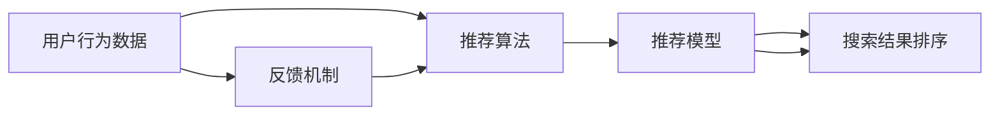

                 

# 用户反馈驱动的AI搜索优化

## 1. 背景介绍

在当今信息爆炸的时代，搜索引擎已成为获取信息、知识和服务的重要工具。然而，如何为用户快速、准确地呈现相关内容，满足其查询需求，是搜索引擎优化(Optimization of AI Search)的重要挑战。传统的搜索结果排序算法多基于静态模型和少量人为干预，难以适应用户动态需求和复杂查询场景。随着人工智能技术的普及，越来越多的搜索引擎开始引入AI技术进行智能化优化，以提升用户体验和搜索效果。

用户反馈驱动的AI搜索优化，是指通过机器学习算法，结合用户的点击、停留时间、搜索历史等实时反馈数据，动态调整搜索结果排序策略，从而提供更加个性化、相关性更高的搜索体验。本文将系统介绍该技术的关键原理、核心算法以及具体的实现步骤，并探讨其应用领域和未来发展趋势。

## 2. 核心概念与联系

### 2.1 核心概念概述

用户反馈驱动的AI搜索优化，是一个典型的AI驱动的个性化推荐系统，涉及以下核心概念：

- **用户行为数据**：用户的点击、停留时间、搜索历史等行为数据是进行个性化推荐的基础。
- **推荐算法**：机器学习算法是实现个性化推荐的关键，包括协同过滤、基于内容的推荐、深度学习等。
- **推荐模型**：基于用户行为数据训练的推荐模型，用于生成个性化搜索结果排序。
- **反馈机制**：实时收集用户反馈数据，用于动态调整推荐策略。
- **搜索结果排序**：根据推荐模型生成，动态调整搜索结果排序，优化用户体验。

这些核心概念通过反馈机制相联系，形成了一个闭环的优化系统，能够不断根据用户反馈进行模型更新和优化。

### 2.2 核心概念原理和架构的 Mermaid 流程图



以上流程图展示了核心概念之间的逻辑关系：用户行为数据通过推荐算法生成推荐模型，再由推荐模型生成搜索结果排序，并通过反馈机制不断调整，形成了一个动态的优化循环。

## 3. 核心算法原理 & 具体操作步骤

### 3.1 算法原理概述

用户反馈驱动的AI搜索优化，基于强化学习(Reinforcement Learning, RL)和深度学习(Deep Learning)的结合。其核心思想是通过不断收集用户的实时反馈数据，训练一个强化学习模型，动态调整搜索结果排序策略，以提升搜索效果和用户体验。

具体而言，模型在用户输入查询后，生成一系列可能的搜索结果排序，并通过观察用户的行为反馈（如点击率、停留时间、跳出率等），更新模型参数，优化排序策略。通过不断的训练和优化，模型能够逐渐学习到最优的排序规则，从而在新的用户查询时，生成更加符合用户期望的搜索结果。

### 3.2 算法步骤详解

用户反馈驱动的AI搜索优化的主要步骤包括：

1. **数据收集**：收集用户的点击、停留时间、搜索历史等行为数据，作为推荐模型的输入。

2. **模型训练**：使用机器学习算法训练推荐模型，将用户行为数据映射为搜索结果排序。

3. **在线推荐**：在用户查询时，根据推荐模型生成多个可能的排序结果，并动态调整，生成最终排序结果。

4. **反馈收集**：收集用户对排序结果的反馈数据，如点击率、停留时间、跳出率等。

5. **模型更新**：根据反馈数据，使用强化学习算法更新推荐模型参数，优化排序策略。

6. **迭代优化**：重复步骤2-5，不断优化模型，提升搜索效果。

### 3.3 算法优缺点

用户反馈驱动的AI搜索优化具有以下优点：

- **个性化强**：通过实时反馈数据，动态调整排序策略，能够提供更加个性化的搜索结果。
- **效果显著**：能够显著提升搜索相关性，改善用户体验，增加点击率、停留时间等指标。
- **灵活性高**：模型可以根据用户行为数据进行自适应调整，适用于不同类型和规模的搜索引擎。

同时，该方法也存在一些局限性：

- **数据需求高**：需要大量用户行为数据进行训练，数据收集和处理成本较高。
- **模型复杂**：深度学习和强化学习算法较为复杂，需要较高计算资源和专业知识。
- **用户隐私**：收集用户行为数据可能会引发隐私问题，需要采取相应的隐私保护措施。
- **冷启动问题**：新用户的行为数据不足，难以有效进行个性化推荐。

### 3.4 算法应用领域

用户反馈驱动的AI搜索优化已在多个领域得到了广泛应用，包括但不限于：

- **电商搜索**：通过实时反馈数据，优化商品推荐排序，提升用户购物体验。
- **新闻推荐**：根据用户的浏览历史和反馈，动态调整新闻推荐排序，提高用户阅读兴趣。
- **健康医疗**：根据用户的搜索行为和反馈，提供个性化医疗咨询和推荐。
- **旅游服务**：提供个性化旅游目的地推荐和行程安排建议，提升用户旅游体验。
- **金融投资**：通过用户的投资行为和反馈，生成个性化金融产品推荐，提高用户投资回报率。

## 4. 数学模型和公式 & 详细讲解

### 4.1 数学模型构建

假设用户的行为数据为 $D=\{(x_i, y_i)\}_{i=1}^N$，其中 $x_i$ 为行为特征向量，$y_i$ 为对应结果标签（如点击、停留时间等）。

定义推荐模型 $f: \mathcal{X} \rightarrow \mathcal{Y}$，其中 $\mathcal{X}$ 为行为特征空间，$\mathcal{Y}$ 为推荐结果空间。推荐模型的目标是最大化预测结果与真实结果之间的平均损失函数：

$$
\max_{f} \mathbb{E}_{(x,y) \sim D} [\log f(x)]
$$

其中 $f(x)$ 表示模型对行为特征 $x$ 的推荐结果。

### 4.2 公式推导过程

为了构建推荐模型，我们通常使用深度学习算法，如深度神经网络。设推荐模型为 $f_{\theta}(x)=\sigma(W_{\theta}x+b)$，其中 $\sigma$ 为激活函数，$W_{\theta}$ 和 $b$ 为模型参数。

使用交叉熵损失函数作为优化目标：

$$
\mathcal{L}(\theta) = -\frac{1}{N} \sum_{i=1}^N \sum_{j=1}^{M} y_{i,j} \log f_{\theta}(x_i)
$$

其中 $M$ 为每个用户可能的推荐结果数，$y_{i,j}$ 表示用户 $i$ 对第 $j$ 个推荐结果的标签。

优化目标为最小化损失函数：

$$
\min_{\theta} \mathcal{L}(\theta)
$$

使用梯度下降等优化算法进行求解，得到最优模型参数 $\theta^*$。

### 4.3 案例分析与讲解

以电商搜索为例，用户的行为数据可能包括浏览时间、点击商品、加入购物车、购买行为等。通过将这些行为数据输入推荐模型，生成多个可能的结果排序，如商品推荐列表。使用强化学习算法（如Q-learning），根据用户的点击、停留时间等反馈数据，更新模型参数，优化排序策略。例如，对于点击次数高的商品，模型会给予更高的排序优先级。

## 5. 项目实践：代码实例和详细解释说明

### 5.1 开发环境搭建

在进行项目实践前，需要搭建好开发环境。以下是使用Python进行TensorFlow开发的环境配置流程：

1. 安装Anaconda：从官网下载并安装Anaconda，用于创建独立的Python环境。

2. 创建并激活虚拟环境：
```bash
conda create -n tensorflow-env python=3.8 
conda activate tensorflow-env
```

3. 安装TensorFlow：根据CUDA版本，从官网获取对应的安装命令。例如：
```bash
conda install tensorflow -c conda-forge -c pypi
```

4. 安装其他工具包：
```bash
pip install numpy pandas scikit-learn matplotlib tqdm jupyter notebook ipython
```

完成上述步骤后，即可在`tensorflow-env`环境中开始项目实践。

### 5.2 源代码详细实现

以下以电商搜索为例，给出使用TensorFlow进行推荐模型训练和在线推荐的PyTorch代码实现。

首先，定义推荐模型的数据处理函数：

```python
import tensorflow as tf
from tensorflow.keras.layers import Input, Dense, Activation, Embedding, concatenate
from tensorflow.keras.models import Model

class RecommendationModel(tf.keras.Model):
    def __init__(self, input_dim, output_dim, embed_dim=128, activation='relu'):
        super(RecommendationModel, self).__init__()
        self.input_dim = input_dim
        self.output_dim = output_dim
        self.embed_dim = embed_dim
        self.activation = activation
        
        self.embedding = Embedding(input_dim, embed_dim)
        self.dense1 = Dense(128, activation=activation)
        self.dense2 = Dense(32, activation=activation)
        self.dense3 = Dense(output_dim, activation='softmax')
        
    def call(self, x):
        x = self.embedding(x)
        x = self.dense1(x)
        x = self.dense2(x)
        x = self.dense3(x)
        return x
```

然后，定义模型的优化器和损失函数：

```python
model = RecommendationModel(input_dim, output_dim)

optimizer = tf.keras.optimizers.Adam(learning_rate=0.001)
loss_fn = tf.keras.losses.SparseCategoricalCrossentropy()
```

接着，定义训练和评估函数：

```python
@tf.function
def train_step(x, y):
    with tf.GradientTape() as tape:
        logits = model(x)
        loss = loss_fn(y, logits)
    gradients = tape.gradient(loss, model.trainable_variables)
    optimizer.apply_gradients(zip(gradients, model.trainable_variables))
    return loss

@tf.function
def evaluate(x, y):
    logits = model(x)
    loss = loss_fn(y, logits)
    accuracy = tf.reduce_mean(tf.cast(tf.equal(y, tf.argmax(logits, axis=1)), tf.float32))
    return loss, accuracy
```

最后，启动训练流程并在测试集上评估：

```python
epochs = 100
batch_size = 128

for epoch in range(epochs):
    total_loss = 0
    for i in range(0, len(train_dataset), batch_size):
        x_batch, y_batch = train_dataset[i:i+batch_size]
        loss = train_step(x_batch, y_batch)
        total_loss += loss
        
    print(f"Epoch {epoch+1}, training loss: {total_loss/len(train_dataset)}")
    
    test_loss, test_accuracy = evaluate(test_dataset, test_labels)
    print(f"Epoch {epoch+1}, test accuracy: {test_accuracy}")
    
print("Training completed.")
```

以上就是使用TensorFlow对电商搜索推荐模型进行训练和评估的完整代码实现。可以看到，TensorFlow提供了丰富的模型构建和优化工具，可以方便地进行推荐模型的开发和优化。

### 5.3 代码解读与分析

让我们再详细解读一下关键代码的实现细节：

**RecommendationModel类**：
- `__init__`方法：初始化行为特征维度、推荐结果维度、嵌入维度、激活函数等关键参数。
- `call`方法：定义模型的前向传播过程，将输入特征映射为推荐结果。

**optimizer和loss_fn**：
- 使用Adam优化器，学习率为0.001，损失函数为稀疏分类交叉熵。

**train_step和evaluate函数**：
- 使用tf.function进行编译，以提升模型训练和推理的效率。
- 在训练时，使用梯度下降更新模型参数，计算损失。
- 在评估时，计算模型预测结果与真实结果之间的交叉熵损失和准确率。

**训练流程**：
- 定义总的epoch数和batch size，开始循环迭代
- 每个epoch内，在训练集上训练，输出平均损失
- 在测试集上评估，输出准确率
- 所有epoch结束后，给出训练完成信息

可以看到，TensorFlow提供了丰富的工具和框架，能够方便快捷地进行推荐模型的训练和评估。开发者可以将更多精力放在数据处理、模型改进等高层逻辑上，而不必过多关注底层的实现细节。

## 6. 实际应用场景

### 6.1 电商搜索

基于用户反馈驱动的AI搜索优化，可以在电商平台上广泛应用。传统电商搜索往往基于静态排序算法，难以适应复杂查询和多变需求。通过实时反馈数据，动态调整搜索结果排序，可以显著提升用户购物体验和转化率。

具体而言，可以收集用户的浏览时间、点击商品、加入购物车、购买行为等数据，作为推荐模型的输入。通过深度学习算法训练推荐模型，生成多个可能的推荐结果排序。使用强化学习算法，根据用户的点击、停留时间等反馈数据，动态调整排序策略，生成最终排序结果。如此构建的电商搜索系统，能够根据用户行为数据，动态调整搜索结果，提供更加个性化的购物推荐。

### 6.2 新闻推荐

在新闻推荐领域，传统推荐算法往往难以适应用户多变的阅读兴趣和复杂的新闻内容。通过实时反馈数据，动态调整推荐策略，可以显著提升新闻阅读体验和用户粘性。

具体而言，可以收集用户的浏览历史、停留时间、评论等行为数据，作为推荐模型的输入。通过深度学习算法训练推荐模型，生成多个可能的新闻推荐排序。使用强化学习算法，根据用户的点击、停留时间等反馈数据，动态调整排序策略，生成最终排序结果。如此构建的新闻推荐系统，能够根据用户行为数据，动态调整新闻推荐，提供更加个性化的新闻内容。

### 6.3 健康医疗

在健康医疗领域，传统的搜索结果排序往往难以满足用户的个性化需求。通过实时反馈数据，动态调整推荐策略，可以显著提升医疗咨询和诊断的准确性。

具体而言，可以收集用户的搜索历史、症状描述、诊断结果等行为数据，作为推荐模型的输入。通过深度学习算法训练推荐模型，生成多个可能的医疗推荐排序。使用强化学习算法，根据用户的点击、停留时间等反馈数据，动态调整排序策略，生成最终排序结果。如此构建的健康医疗推荐系统，能够根据用户行为数据，动态调整医疗推荐，提供更加个性化的医疗咨询服务。

### 6.4 金融投资

在金融投资领域，传统的搜索结果排序往往难以满足用户的个性化需求和动态变化的市场信息。通过实时反馈数据，动态调整推荐策略，可以显著提升投资决策的准确性。

具体而言，可以收集用户的投资行为、历史数据、市场动态等行为数据，作为推荐模型的输入。通过深度学习算法训练推荐模型，生成多个可能的金融产品推荐排序。使用强化学习算法，根据用户的点击、停留时间等反馈数据，动态调整排序策略，生成最终排序结果。如此构建的金融投资推荐系统，能够根据用户行为数据，动态调整金融产品推荐，提供更加个性化的投资建议。

## 7. 工具和资源推荐

### 7.1 学习资源推荐

为了帮助开发者系统掌握用户反馈驱动的AI搜索优化的理论基础和实践技巧，这里推荐一些优质的学习资源：

1. 《Reinforcement Learning: An Introduction》：由Richard S. Sutton和Andrew G. Barto撰写，介绍了强化学习的基本原理和应用。

2. 《Deep Learning for AI》：由DeepMind开发者撰写，涵盖了深度学习的基本概念和应用。

3. 《Machine Learning Yearning》：由Andrew Ng撰写，介绍了机器学习的工程实践和项目管理经验。

4. 《TensorFlow Official Guide》：TensorFlow官方文档，提供了丰富的API文档和示例代码。

5. Weights & Biases：模型训练的实验跟踪工具，可以记录和可视化模型训练过程中的各项指标，方便对比和调优。

通过这些资源的学习实践，相信你一定能够快速掌握用户反馈驱动的AI搜索优化的精髓，并用于解决实际的搜索问题。

### 7.2 开发工具推荐

高效的开发离不开优秀的工具支持。以下是几款用于用户反馈驱动的AI搜索优化的常用工具：

1. TensorFlow：由Google主导开发的开源深度学习框架，生产部署方便，适合大规模工程应用。

2. PyTorch：基于Python的开源深度学习框架，灵活动态的计算图，适合快速迭代研究。

3. Keras：高级深度学习API，简单易用，适合快速原型开发。

4. Weights & Biases：模型训练的实验跟踪工具，可以记录和可视化模型训练过程中的各项指标，方便对比和调优。

5. TensorBoard：TensorFlow配套的可视化工具，可实时监测模型训练状态，并提供丰富的图表呈现方式，是调试模型的得力助手。

合理利用这些工具，可以显著提升用户反馈驱动的AI搜索优化的开发效率，加快创新迭代的步伐。

### 7.3 相关论文推荐

用户反馈驱动的AI搜索优化技术的发展源于学界的持续研究。以下是几篇奠基性的相关论文，推荐阅读：

1. Human-in-the-loop Reinforcement Learning for AI Recommendation Systems：提出人机协同强化学习框架，提升推荐系统性能。

2. Contextual Bandits for Sequential Composition in Recommendation Systems：使用上下文强化学习，动态调整推荐策略，提升个性化推荐效果。

3. Machine Learning Techniques for Personalized Recommendations：介绍多种机器学习算法在个性化推荐中的应用。

4. A Survey on Recommender Systems with Deep Learning：综述深度学习在推荐系统中的应用，包括深度神经网络、协同过滤等。

这些论文代表了大语言模型微调技术的发展脉络。通过学习这些前沿成果，可以帮助研究者把握学科前进方向，激发更多的创新灵感。

## 8. 总结：未来发展趋势与挑战

### 8.1 总结

本文对用户反馈驱动的AI搜索优化的关键原理、核心算法以及具体的实现步骤进行了全面系统的介绍。首先阐述了该技术的研究背景和意义，明确了其在个性化推荐系统中的应用价值。其次，从原理到实践，详细讲解了深度学习和强化学习算法，并给出了推荐模型的代码实现。同时，本文还探讨了该技术在电商搜索、新闻推荐、健康医疗、金融投资等多个领域的应用前景，展示了其巨大的应用潜力。此外，本文精选了相关学习资源，力求为读者提供全方位的技术指引。

通过本文的系统梳理，可以看到，用户反馈驱动的AI搜索优化技术正在成为推荐系统的重要范式，极大地提升了搜索结果的个性化和相关性。基于用户行为数据进行动态调整，能够在不同场景下提供更加贴合用户需求的搜索结果，显著提升用户体验和系统性能。未来，伴随算力的提升和技术的进步，用户反馈驱动的AI搜索优化技术必将在更多领域大放异彩。

### 8.2 未来发展趋势

展望未来，用户反馈驱动的AI搜索优化技术将呈现以下几个发展趋势：

1. **个性化更精准**：随着数据量的增加和算法的优化，推荐模型的个性化能力将进一步提升，能够更加准确地预测用户行为和偏好。

2. **实时性更强**：基于边缘计算和分布式计算技术，推荐模型能够在实时数据流上进行训练和推理，提供更加即时响应的搜索结果。

3. **跨领域应用**：推荐模型将进一步扩展到更多的领域和场景，如视频推荐、图像推荐、音乐推荐等，为用户提供全面的内容推荐服务。

4. **多模态融合**：推荐模型将整合视觉、语音、文本等多模态数据，提升用户交互体验和推荐效果。

5. **隐私保护增强**：为了保护用户隐私，推荐模型将采用差分隐私、联邦学习等技术，确保用户数据的安全性和隐私性。

6. **自动化优化**：推荐模型将通过自动调参、自适应学习等技术，提高优化效率，减少人为干预。

以上趋势凸显了用户反馈驱动的AI搜索优化技术的广阔前景。这些方向的探索发展，必将进一步提升推荐系统的性能和应用范围，为人类认知智能的进化带来深远影响。

### 8.3 面临的挑战

尽管用户反馈驱动的AI搜索优化技术已经取得了瞩目成就，但在迈向更加智能化、普适化应用的过程中，它仍面临着诸多挑战：

1. **数据质量和多样性**：用户行为数据的质量和多样性直接影响推荐模型的效果，高质量、多维度的数据采集和处理是重要前提。

2. **计算资源需求**：深度学习和强化学习算法的复杂度较高，需要较强的计算资源支持，尤其是大规模数据和高维度特征的处理。

3. **隐私保护**：收集和处理用户行为数据涉及隐私问题，需要严格的数据保护和匿名化措施。

4. **冷启动问题**：新用户的行为数据不足，难以有效进行个性化推荐，需要通过多种方法解决冷启动问题。

5. **模型鲁棒性**：推荐模型面对噪声数据和异常情况时，容易产生过拟合或泛化性能下降，需要设计鲁棒性强的算法。

6. **交互复杂度**：在多轮交互的场景下，如何设计有效的反馈机制，动态调整推荐策略，是一个复杂而关键的问题。

这些挑战需要我们在理论研究和技术实现上进行深入探索和突破，才能将用户反馈驱动的AI搜索优化技术推向更高的台阶。

### 8.4 研究展望

面对用户反馈驱动的AI搜索优化技术所面临的种种挑战，未来的研究需要在以下几个方面寻求新的突破：

1. **模型压缩与加速**：通过模型压缩、量化等技术，减小模型尺寸，提升推理速度和资源效率。

2. **自适应学习**：通过自适应学习算法，动态调整模型参数，增强模型的泛化能力和适应性。

3. **多任务学习**：通过多任务学习，提升推荐模型的鲁棒性和多任务处理能力。

4. **跨模态融合**：整合多模态数据，提升推荐模型的综合表现力和用户交互体验。

5. **隐私保护与匿名化**：通过差分隐私、联邦学习等技术，保护用户数据隐私。

6. **自动化优化**：通过自动化调参、超参数优化等技术，提高推荐模型的优化效率和效果。

这些研究方向的探索，必将引领用户反馈驱动的AI搜索优化技术迈向更高的台阶，为构建更加智能化、个性化的推荐系统提供强大的技术支持。

## 9. 附录：常见问题与解答

**Q1：用户反馈驱动的AI搜索优化是否适用于所有推荐场景？**

A: 用户反馈驱动的AI搜索优化在绝大多数推荐场景中都能取得不错的效果，特别是在数据量较充足、用户行为多样化的场景中。但对于一些特殊场景，如某些垂直领域或特定任务，可能需要结合领域知识进行特定优化。

**Q2：如何缓解冷启动问题？**

A: 缓解冷启动问题的方法包括：
1. 使用先验知识：结合领域知识或专家标注，提供初步推荐。
2. 用户行为引导：通过引导问题、推荐相似物品等方式，快速获取用户行为数据。
3. 多用户协作：利用用户行为数据进行推荐，逐步积累推荐模型参数。
4. 伪数据生成：使用生成模型生成伪数据，丰富数据集，提升推荐效果。

**Q3：用户反馈驱动的AI搜索优化如何处理噪声数据？**

A: 处理噪声数据的方法包括：
1. 数据清洗：通过数据清洗和去噪技术，提升数据质量。
2. 鲁棒优化：使用鲁棒优化算法，增强模型对噪声数据的容忍度。
3. 多源数据融合：整合多种数据源，提升推荐模型的鲁棒性。

**Q4：如何提升推荐模型的实时性？**

A: 提升推荐模型的实时性可以通过以下方法：
1. 边缘计算：将模型部署在靠近用户的边缘设备上，减少数据传输延迟。
2. 分布式计算：采用分布式计算框架，实现模型的并行计算和推理。
3. 数据流处理：使用流处理技术，实时处理用户行为数据，生成推荐结果。

**Q5：用户反馈驱动的AI搜索优化是否需要用户主动反馈？**

A: 用户反馈驱动的AI搜索优化可以通过主动收集用户行为数据进行优化，而无需用户主动反馈。但为了提升优化效果，用户反馈仍然是重要的参考指标，可以通过引导用户反馈等方式，增强模型的个性化能力。

总之，用户反馈驱动的AI搜索优化技术正处于快速发展阶段，将在多个领域得到广泛应用。尽管面临诸多挑战，但其在个性化推荐、实时搜索优化等方面的优势将使其在未来的AI发展中扮演重要角色。通过不断的技术创新和实践积累，相信该技术将不断完善和优化，为人们提供更加智能、个性化的搜索体验。

