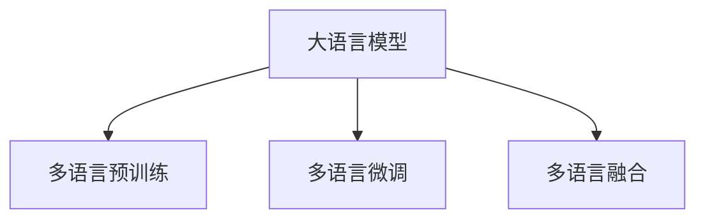

                 

# 电商平台中AI大模型的多语言支持技术

## 1. 背景介绍

### 1.1 问题由来

在当今全球化的电商平台上，多语言支持已经成为其核心竞争力之一。为了更好地服务全球客户，电商平台需要具备跨语言的搜索、推荐、客服等功能。然而，现有的电商平台的推荐和搜索系统大多基于英语等主流语言训练，对于非英语市场支持不够完善，用户体验和销售转化率均受到影响。

大模型如BERT、GPT等在自然语言处理（NLP）领域取得了显著的进展，可以广泛应用于文本分类、实体识别、问答系统等多个任务。通过在大规模语料上进行预训练，大模型能够掌握多种语言的通用语言表示，适用于多语言场景。本文将介绍如何利用大模型在电商平台中实现多语言支持。

### 1.2 问题核心关键点

目前，大模型在电商平台的多语言支持主要通过以下方式实现：

1. **多语言预训练**：利用多语言数据集对大模型进行预训练，使其能够掌握多种语言的语法和语义特征。
2. **多语言微调**：在电商平台的特定任务上，对预训练模型进行微调，以适应电商平台的语境和数据分布。
3. **多语言融合**：将单语言模型进行融合，形成多语言模型，支持多种语言的混合应用。

本文将重点介绍大模型在电商平台多语言支持中的核心概念、算法原理和操作步骤，并通过具体案例展示其实际应用效果。

## 2. 核心概念与联系

### 2.1 核心概念概述

为更好地理解大模型在电商平台中的多语言支持，本节将介绍几个密切相关的核心概念：

- **大语言模型（Large Language Models, LLMs）**：指基于Transformer等架构的预训练语言模型，如BERT、GPT等。这些模型通过在大规模语料上进行自监督学习，掌握多种语言的通用语言表示。
- **多语言预训练（Multilingual Pre-training）**：指在大规模多语言语料上对大模型进行预训练，使其能够适应多种语言的语言特征。
- **多语言微调（Multilingual Fine-tuning）**：指在特定多语言任务上，对预训练模型进行微调，以适应电商平台的语境和数据分布。
- **多语言融合（Multilingual Fusion）**：指将多个单语言模型进行融合，形成支持多种语言的混合模型，提升多语言场景下的性能。

这些概念之间的逻辑关系可以通过以下Mermaid流程图来展示：



这个流程图展示了大语言模型在电商平台多语言支持中的核心概念及其之间的关系：

1. 大语言模型通过多语言预训练获得语言通用表示。
2. 微调使得模型更好地适应电商平台的特定任务。
3. 融合使得模型能够同时处理多种语言。

这些概念共同构成了电商平台多语言支持的核心技术框架，使得大模型能够高效、准确地服务于全球客户。

## 3. 核心算法原理 & 具体操作步骤

### 3.1 算法原理概述

大模型在电商平台中的多语言支持，本质上是一个多任务的迁移学习过程。其核心思想是：将大模型视作一个强大的语言处理工具，通过多语言预训练和多语言微调，使其能够适应多种语言的多样化场景，并在电商平台中提供高质量的搜索、推荐和客服等服务。

具体而言，步骤如下：

1. **多语言预训练**：在大规模多语言语料上对大模型进行预训练，学习多种语言的通用语言表示。
2. **多语言微调**：在电商平台的特定多语言任务上，对预训练模型进行微调，使其输出适应电商平台的语境和数据分布。
3. **多语言融合**：将多个单语言模型进行融合，形成支持多种语言的混合模型，提升多语言场景下的性能。

### 3.2 算法步骤详解

#### 3.2.1 多语言预训练

多语言预训练的目的是学习多种语言的通用语言表示。假设我们有多组不同语言的语料，即 $\mathcal{L}_1, \mathcal{L}_2, \ldots, \mathcal{L}_M$，其中 $M$ 表示语言数量。我们将这些语料作为预训练数据，对大模型进行多语言预训练。

预训练任务包括掩码语言模型（Masked Language Model, MLM）、下一句预测（Next Sentence Prediction, NSP）、词汇选择（Token Classification）等。对于每种语言的语料，我们都可以设计对应的预训练任务，使得大模型能够学习到该语言的语言特征。

假设预训练语言模型为 $M_{\theta}$，其中 $\theta$ 为预训练得到的模型参数。多语言预训练的目标是：

$$
\theta^* = \mathop{\arg\min}_{\theta} \sum_{i=1}^M \mathcal{L}_i(M_{\theta}, \mathcal{L}_i)
$$

其中 $\mathcal{L}_i$ 为针对第 $i$ 种语言设计的预训练损失函数，$\mathcal{L}_i(M_{\theta}, \mathcal{L}_i)$ 表示在语料 $\mathcal{L}_i$ 上进行预训练时，模型 $M_{\theta}$ 的损失。

#### 3.2.2 多语言微调

多语言微调是在特定多语言任务上对预训练模型进行微调的过程。假设电商平台的特定任务为 $T$，标注数据集为 $D=\{(x_i, y_i)\}_{i=1}^N$，其中 $x_i$ 为输入文本，$y_i$ 为任务标签。微调的目标是找到新的模型参数 $\hat{\theta}$，使得模型输出能够匹配任务标签：

$$
\hat{\theta} = \mathop{\arg\min}_{\theta} \mathcal{L}(M_{\theta},D)
$$

其中 $\mathcal{L}$ 为针对任务 $T$ 设计的损失函数，用于衡量模型预测输出与真实标签之间的差异。

多语言微调可以通过不同的方式实现，如：

1. **独立微调**：为每种语言分别进行微调，形成多语言微调模型。
2. **联合微调**：将多语言微调看作一个整体任务，对所有语言进行联合微调，形成多语言联合微调模型。

#### 3.2.3 多语言融合

多语言融合是将多个单语言模型进行融合，形成支持多种语言的混合模型。假设我们已经训练了 $K$ 个单语言模型，每个模型对应一种语言。我们可以使用注意力机制、加权平均、拼接等方式将这些模型进行融合，形成多语言融合模型。

### 3.3 算法优缺点

多语言预训练、微调和融合方法具有以下优点：

1. **高效性**：大模型可以在大规模语料上进行预训练，学习多种语言的通用语言表示。
2. **鲁棒性**：多语言融合模型可以适应多种语言的混合应用，提升模型鲁棒性。
3. **可扩展性**：多语言预训练和微调方法可以方便地扩展到新的语言，适应电商平台的全球化需求。

但同时也存在以下缺点：

1. **计算资源消耗大**：大规模语料和多语言微调需要大量的计算资源。
2. **数据分布差异**：不同语言的语言特征和语境差异较大，微调效果可能受到影响。
3. **模型复杂度高**：多语言融合模型结构复杂，可能导致推理速度变慢。

## 4. 数学模型和公式 & 详细讲解

### 4.1 数学模型构建

本节将使用数学语言对电商平台中大模型的多语言支持过程进行更加严格的刻画。

假设我们有多组不同语言的语料，即 $\mathcal{L}_1, \mathcal{L}_2, \ldots, \mathcal{L}_M$，其中 $M$ 表示语言数量。假设每组语料大小为 $N$，且语料均已进行token化处理。

多语言预训练的目标是：

$$
\theta^* = \mathop{\arg\min}_{\theta} \sum_{i=1}^M \mathcal{L}_i(M_{\theta}, \mathcal{L}_i)
$$

其中 $\mathcal{L}_i$ 为针对第 $i$ 种语言设计的预训练损失函数，$\mathcal{L}_i(M_{\theta}, \mathcal{L}_i)$ 表示在语料 $\mathcal{L}_i$ 上进行预训练时，模型 $M_{\theta}$ 的损失。

以BERT为例，其预训练损失函数 $\mathcal{L}_i$ 包括掩码语言模型（Masked Language Model, MLM）和下一句预测（Next Sentence Prediction, NSP）。掩码语言模型的目标是通过掩码一些随机位置的token，预测这些token的原始内容。下一句预测的目标是预测两个连续句子是否为同一段落的一部分。

### 4.2 公式推导过程

以下我们以BERT为例，推导掩码语言模型的数学公式。

假设语料 $\mathcal{L}_i$ 中包含 $N$ 个句子，每个句子 $x_j$ 包含 $n_j$ 个token。我们将每个句子 $x_j$ 进行token化处理，并计算掩码概率 $p_{ij}$，即随机掩码 $x_j$ 中的一部分token。假设掩码比例为 $p$，则每个句子掩码的token数量为 $n_{ij} \sim \text{Binomial}(n_j, p)$。

掩码语言模型的目标是通过掩码一些随机位置的token，预测这些token的原始内容。设掩码后的句子为 $\tilde{x}_j$，其原始内容为 $x_j$。掩码语言模型的目标是最大化预测准确率，即：

$$
\arg\max_{x_j} P(\tilde{x}_j | M_{\theta}, x_j)
$$

其中 $P(\tilde{x}_j | M_{\theta}, x_j)$ 为模型 $M_{\theta}$ 在掩码后的句子 $\tilde{x}_j$ 上的预测概率。

对于每个掩码的token，其原始内容的概率为：

$$
P(x_j | M_{\theta}, \tilde{x}_j) = \frac{P(\tilde{x}_j | M_{\theta}, x_j)P(x_j | M_{\theta})}{P(\tilde{x}_j | M_{\theta})}
$$

其中 $P(x_j | M_{\theta})$ 为句子 $x_j$ 的原始概率，$P(\tilde{x}_j | M_{\theta})$ 为掩码后的句子 $\tilde{x}_j$ 的预测概率。

通过最大化预测概率，我们可以训练出掩码语言模型。在训练过程中，我们只保留未被掩码的token，因此损失函数可以表示为：

$$
\mathcal{L}_{\text{MLM}} = -\frac{1}{N}\sum_{i=1}^N \sum_{j=1}^{n_j} \sum_{k=1}^{n_j} p_{ij} \log P(\tilde{x}_{ij} | M_{\theta}, x_j)
$$

其中 $\tilde{x}_{ij}$ 为掩码后的句子 $x_j$ 中第 $k$ 个token。

### 4.3 案例分析与讲解

假设我们有一个电商平台，需要支持英语、中文、法语三种语言。我们收集了三种语言的语料 $\mathcal{L}_1, \mathcal{L}_2, \mathcal{L}_3$，其中 $\mathcal{L}_1$ 为英语语料，$\mathcal{L}_2$ 为中文语料，$\mathcal{L}_3$ 为法语语料。

我们使用BERT模型进行多语言预训练，目标是最小化预训练损失：

$$
\theta^* = \mathop{\arg\min}_{\theta} \sum_{i=1}^3 \mathcal{L}_i(M_{\theta}, \mathcal{L}_i)
$$

其中 $\mathcal{L}_i$ 为针对第 $i$ 种语言设计的预训练损失函数。假设我们使用掩码语言模型进行预训练，则损失函数为：

$$
\mathcal{L}_{\text{MLM}} = -\frac{1}{N}\sum_{i=1}^3 \sum_{j=1}^{n_i} \sum_{k=1}^{n_i} p_{ij} \log P(\tilde{x}_{ij} | M_{\theta}, x_j)
$$

其中 $p_{ij}$ 为第 $i$ 种语言的第 $j$ 个句子 $x_j$ 中第 $k$ 个token的掩码概率。

通过预训练，我们得到了一个支持多种语言的BERT模型。接下来，我们可以在电商平台的特定任务上对该模型进行微调，如搜索、推荐、客服等。假设我们需要在电商平台的搜索任务上进行微调，标注数据集为 $D=\{(x_i, y_i)\}_{i=1}^N$，其中 $x_i$ 为搜索查询，$y_i$ 为搜索结果。

微调的目标是找到新的模型参数 $\hat{\theta}$，使得模型输出能够匹配任务标签：

$$
\hat{\theta} = \mathop{\arg\min}_{\theta} \mathcal{L}(M_{\theta},D)
$$

其中 $\mathcal{L}$ 为针对搜索任务设计的损失函数，用于衡量模型预测输出与真实标签之间的差异。假设我们使用交叉熵损失函数，则损失函数为：

$$
\mathcal{L}_{\text{Search}} = -\frac{1}{N}\sum_{i=1}^N \sum_{j=1}^{m_i} y_{ij} \log P(y_{ij} | M_{\theta}, x_i)
$$

其中 $y_{ij}$ 为第 $i$ 个查询 $x_i$ 的搜索结果，$m_i$ 为查询 $x_i$ 的搜索结果数量。

## 5. 项目实践：代码实例和详细解释说明

### 5.1 开发环境搭建

在进行多语言支持项目实践前，我们需要准备好开发环境。以下是使用Python进行PyTorch开发的环境配置流程：

1. 安装Anaconda：从官网下载并安装Anaconda，用于创建独立的Python环境。

2. 创建并激活虚拟环境：
```bash
conda create -n pytorch-env python=3.8 
conda activate pytorch-env
```

3. 安装PyTorch：根据CUDA版本，从官网获取对应的安装命令。例如：
```bash
conda install pytorch torchvision torchaudio cudatoolkit=11.1 -c pytorch -c conda-forge
```

4. 安装Transformers库：
```bash
pip install transformers
```

5. 安装各类工具包：
```bash
pip install numpy pandas scikit-learn matplotlib tqdm jupyter notebook ipython
```

完成上述步骤后，即可在`pytorch-env`环境中开始多语言支持项目实践。

### 5.2 源代码详细实现

下面我们以电商平台搜索任务为例，给出使用Transformers库对BERT模型进行多语言支持微调的PyTorch代码实现。

首先，定义多语言搜索任务的数据处理函数：

```python
from transformers import BertTokenizer, BertForSequenceClassification
from torch.utils.data import Dataset
import torch

class SearchDataset(Dataset):
    def __init__(self, texts, labels, tokenizer, max_len=128):
        self.texts = texts
        self.labels = labels
        self.tokenizer = tokenizer
        self.max_len = max_len
        
    def __len__(self):
        return len(self.texts)
    
    def __getitem__(self, item):
        text = self.texts[item]
        label = self.labels[item]
        
        encoding = self.tokenizer(text, return_tensors='pt', max_length=self.max_len, padding='max_length', truncation=True)
        input_ids = encoding['input_ids'][0]
        attention_mask = encoding['attention_mask'][0]
        
        # 对标签进行编码
        label = label2id[label]
        labels = torch.tensor([label], dtype=torch.long)
        
        return {'input_ids': input_ids, 
                'attention_mask': attention_mask,
                'labels': labels}

# 标签与id的映射
label2id = {'查询': 0, '商品': 1}

# 创建dataset
tokenizer = BertTokenizer.from_pretrained('bert-base-cased')

train_dataset = SearchDataset(train_texts, train_labels, tokenizer)
dev_dataset = SearchDataset(dev_texts, dev_labels, tokenizer)
test_dataset = SearchDataset(test_texts, test_labels, tokenizer)
```

然后，定义模型和优化器：

```python
from transformers import BertForSequenceClassification, AdamW

model = BertForSequenceClassification.from_pretrained('bert-base-cased', num_labels=len(label2id))

optimizer = AdamW(model.parameters(), lr=2e-5)
```

接着，定义训练和评估函数：

```python
from torch.utils.data import DataLoader
from tqdm import tqdm
from sklearn.metrics import accuracy_score

device = torch.device('cuda') if torch.cuda.is_available() else torch.device('cpu')
model.to(device)

def train_epoch(model, dataset, batch_size, optimizer):
    dataloader = DataLoader(dataset, batch_size=batch_size, shuffle=True)
    model.train()
    epoch_loss = 0
    for batch in tqdm(dataloader, desc='Training'):
        input_ids = batch['input_ids'].to(device)
        attention_mask = batch['attention_mask'].to(device)
        labels = batch['labels'].to(device)
        model.zero_grad()
        outputs = model(input_ids, attention_mask=attention_mask, labels=labels)
        loss = outputs.loss
        epoch_loss += loss.item()
        loss.backward()
        optimizer.step()
    return epoch_loss / len(dataloader)

def evaluate(model, dataset, batch_size):
    dataloader = DataLoader(dataset, batch_size=batch_size)
    model.eval()
    preds, labels = [], []
    with torch.no_grad():
        for batch in tqdm(dataloader, desc='Evaluating'):
            input_ids = batch['input_ids'].to(device)
            attention_mask = batch['attention_mask'].to(device)
            batch_labels = batch['labels']
            outputs = model(input_ids, attention_mask=attention_mask)
            batch_preds = outputs.logits.argmax(dim=2).to('cpu').tolist()
            batch_labels = batch_labels.to('cpu').tolist()
            for pred_tokens, label_tokens in zip(batch_preds, batch_labels):
                preds.append(pred_tokens[0])
                labels.append(label_tokens[0])
                
    print('Accuracy: %.4f' % accuracy_score(labels, preds))
```

最后，启动训练流程并在测试集上评估：

```python
epochs = 5
batch_size = 16

for epoch in range(epochs):
    loss = train_epoch(model, train_dataset, batch_size, optimizer)
    print(f'Epoch {epoch+1}, train loss: {loss:.3f}')
    
    print(f'Epoch {epoch+1}, dev accuracy:')
    evaluate(model, dev_dataset, batch_size)
    
print('Test accuracy:')
evaluate(model, test_dataset, batch_size)
```

以上就是使用PyTorch对BERT模型进行多语言搜索任务微调的完整代码实现。可以看到，得益于Transformers库的强大封装，我们可以用相对简洁的代码完成BERT模型的加载和微调。

### 5.3 代码解读与分析

让我们再详细解读一下关键代码的实现细节：

**SearchDataset类**：
- `__init__`方法：初始化文本、标签、分词器等关键组件。
- `__len__`方法：返回数据集的样本数量。
- `__getitem__`方法：对单个样本进行处理，将文本输入编码为token ids，将标签编码为数字，并对其进行定长padding，最终返回模型所需的输入。

**label2id和id2label字典**：
- 定义了标签与数字id之间的映射关系，用于将预测结果解码回真实标签。

**训练和评估函数**：
- 使用PyTorch的DataLoader对数据集进行批次化加载，供模型训练和推理使用。
- 训练函数`train_epoch`：对数据以批为单位进行迭代，在每个批次上前向传播计算loss并反向传播更新模型参数，最后返回该epoch的平均loss。
- 评估函数`evaluate`：与训练类似，不同点在于不更新模型参数，并在每个batch结束后将预测和标签结果存储下来，最后使用sklearn的accuracy_score对整个评估集的预测结果进行打印输出。

**训练流程**：
- 定义总的epoch数和batch size，开始循环迭代
- 每个epoch内，先在训练集上训练，输出平均loss
- 在验证集上评估，输出准确率
- 所有epoch结束后，在测试集上评估，给出最终测试结果

可以看到，PyTorch配合Transformers库使得BERT微调的代码实现变得简洁高效。开发者可以将更多精力放在数据处理、模型改进等高层逻辑上，而不必过多关注底层的实现细节。

当然，工业级的系统实现还需考虑更多因素，如模型的保存和部署、超参数的自动搜索、更灵活的任务适配层等。但核心的微调范式基本与此类似。

## 6. 实际应用场景

### 6.1 智能搜索推荐

在电商平台的搜索和推荐系统中，利用多语言支持可以大幅提升用户体验和销售转化率。通过多语言搜索模型，用户可以在任何语言环境下都能找到所需商品，享受无缝购物体验。推荐模型则可以基于用户的语言偏好，提供更加个性化、本地化的商品推荐。

以电商平台的多语言搜索为例，我们可以通过多语言预训练模型，对不同语言的查询进行处理和理解。对于每种语言的查询，我们可以使用对应的预训练模型进行编码，然后通过注意力机制或拼接等方式，将不同语言的编码结果进行融合，输出最终的搜索结果。

### 6.2 多语言客服系统

电商平台的客服系统需要支持多种语言，以应对全球客户的需求。利用多语言支持，客服系统可以自动识别客户的语言，并根据语言偏好提供相应的客户服务。

例如，在多语言客服系统中，我们可以使用多语言预训练模型对用户输入的文本进行编码，然后通过解码器生成回复。对于不同语言的输入，我们可以使用对应的预训练模型进行编码，然后根据用户选择的语言，选择相应的解码器生成回复。

### 6.3 全球化数据分析

电商平台的数据分析系统需要支持全球化的多语言数据。利用多语言支持，数据分析系统可以更好地理解不同语言的市场趋势和用户行为。

例如，在电商平台的销售数据分析中，我们可以使用多语言支持的数据分析模型，对不同语言的销售数据进行处理和分析。通过多语言预训练模型，我们可以对不同语言的销售数据进行编码，然后通过多语言融合模型，将不同语言的编码结果进行融合，得到全球化的销售数据分析结果。

### 6.4 未来应用展望

随着大语言模型和多语言支持技术的发展，电商平台的多语言应用场景将进一步拓展，为全球客户带来更加丰富和便捷的购物体验。

在未来，电商平台的多语言支持将不仅仅是文本处理，还可能扩展到图像、视频等多模态数据。通过多语言支持，我们可以更好地理解不同语言的多模态数据，提供更加个性化、本地化的电商服务。

## 7. 工具和资源推荐

### 7.1 学习资源推荐

为了帮助开发者系统掌握大模型在电商平台中的多语言支持理论基础和实践技巧，这里推荐一些优质的学习资源：

1. 《Transformer from Guru to Beginner》系列博文：由大模型技术专家撰写，深入浅出地介绍了Transformer原理、BERT模型、多语言预训练等前沿话题。

2. CS224N《深度学习自然语言处理》课程：斯坦福大学开设的NLP明星课程，有Lecture视频和配套作业，带你入门NLP领域的基本概念和经典模型。

3. 《Natural Language Processing with Transformers》书籍：Transformers库的作者所著，全面介绍了如何使用Transformers库进行NLP任务开发，包括多语言预训练在内的诸多范式。

4. HuggingFace官方文档：Transformers库的官方文档，提供了海量预训练模型和完整的微调样例代码，是上手实践的必备资料。

5. CLUE开源项目：中文语言理解测评基准，涵盖大量不同类型的中文NLP数据集，并提供了基于多语言预训练的baseline模型，助力中文NLP技术发展。

通过对这些资源的学习实践，相信你一定能够快速掌握大模型在电商平台中的多语言支持精髓，并用于解决实际的NLP问题。

### 7.2 开发工具推荐

高效的开发离不开优秀的工具支持。以下是几款用于大模型在电商平台多语言支持开发的常用工具：

1. PyTorch：基于Python的开源深度学习框架，灵活动态的计算图，适合快速迭代研究。大部分预训练语言模型都有PyTorch版本的实现。

2. TensorFlow：由Google主导开发的开源深度学习框架，生产部署方便，适合大规模工程应用。同样有丰富的预训练语言模型资源。

3. Transformers库：HuggingFace开发的NLP工具库，集成了众多SOTA语言模型，支持PyTorch和TensorFlow，是进行多语言预训练和微调任务开发的利器。

4. Weights & Biases：模型训练的实验跟踪工具，可以记录和可视化模型训练过程中的各项指标，方便对比和调优。与主流深度学习框架无缝集成。

5. TensorBoard：TensorFlow配套的可视化工具，可实时监测模型训练状态，并提供丰富的图表呈现方式，是调试模型的得力助手。

6. Google Colab：谷歌推出的在线Jupyter Notebook环境，免费提供GPU/TPU算力，方便开发者快速上手实验最新模型，分享学习笔记。

合理利用这些工具，可以显著提升大模型在电商平台中的多语言支持开发效率，加快创新迭代的步伐。

### 7.3 相关论文推荐

大模型在电商平台中的多语言支持源于学界的持续研究。以下是几篇奠基性的相关论文，推荐阅读：

1. Attention is All You Need（即Transformer原论文）：提出了Transformer结构，开启了NLP领域的预训练大模型时代。

2. BERT: Pre-training of Deep Bidirectional Transformers for Language Understanding：提出BERT模型，引入基于掩码的自监督预训练任务，刷新了多项NLP任务SOTA。

3. Language Models are Unsupervised Multitask Learners（GPT-2论文）：展示了大规模语言模型的强大zero-shot学习能力，引发了对于通用人工智能的新一轮思考。

4. Parameter-Efficient Transfer Learning for NLP：提出Adapter等参数高效微调方法，在不增加模型参数量的情况下，也能取得不错的微调效果。

5. Parameter-Efficient Multilingual Transfer Learning with Language-agnostic BERT：提出多语言预训练模型，支持多种语言的无监督预训练。

6. Multi-Task Unsupervised Pre-training for Language Modeling：提出多任务无监督预训练方法，提升模型在多语言场景下的泛化能力。

这些论文代表了大模型在电商平台中的多语言支持发展脉络。通过学习这些前沿成果，可以帮助研究者把握学科前进方向，激发更多的创新灵感。

## 8. 总结：未来发展趋势与挑战

### 8.1 总结

本文对大模型在电商平台中的多语言支持进行了全面系统的介绍。首先阐述了多语言支持的背景和意义，明确了多语言预训练、微调和融合在电商平台中的核心作用。其次，从原理到实践，详细讲解了多语言预训练、微调和融合的数学模型和操作步骤，并通过具体案例展示了其实际应用效果。同时，本文还探讨了多语言支持在电商平台中的应用场景，展示了其广泛的应用前景。

通过本文的系统梳理，可以看到，大模型在电商平台中的多语言支持技术已经取得显著进展，能够高效、准确地服务于全球客户，提升用户体验和销售转化率。未来，伴随大语言模型和多语言支持技术的持续演进，电商平台的多语言应用场景将进一步拓展，为全球客户带来更加丰富和便捷的购物体验。

### 8.2 未来发展趋势

展望未来，大模型在电商平台中的多语言支持将呈现以下几个发展趋势：

1. **多语言模型的进一步优化**：未来的多语言模型将更加高效、鲁棒，能够更好地适应多种语言的多样化场景。
2. **多语言融合的深入研究**：未来的多语言融合方法将更加智能，能够更好地整合不同语言的信息，提升多语言场景下的性能。
3. **多模态应用的扩展**：未来的多语言支持将扩展到图像、视频等多模态数据，提升电商平台的多模态应用能力。
4. **跨语言迁移学习的研究**：未来的多语言预训练和微调方法将更加注重跨语言的迁移学习，提升模型的泛化能力。

这些趋势将进一步提升电商平台的多语言应用能力，为全球客户带来更加丰富和便捷的购物体验。

### 8.3 面临的挑战

尽管大模型在电商平台中的多语言支持已经取得了显著成就，但在迈向更加智能化、普适化应用的过程中，仍面临诸多挑战：

1. **数据分布差异**：不同语言的语言特征和语境差异较大，多语言融合模型需要更好地适应这些差异。
2. **计算资源消耗**：大规模语料和多语言微调需要大量的计算资源，如何优化资源使用是一个重要的研究方向。
3. **模型复杂度**：多语言融合模型结构复杂，推理速度较慢，需要进一步简化模型结构以提升性能。
4. **模型鲁棒性**：多语言融合模型在处理多种语言时，需要更好地保持模型的鲁棒性和泛化能力。
5. **隐私保护**：电商平台需要保护用户的隐私数据，如何在多语言支持的同时保护用户隐私也是一个重要的研究方向。

这些挑战需要研究者从数据、模型、算法、工程等多个维度进行全面优化，方能实现大模型在电商平台中的多语言支持技术。

### 8.4 研究展望

面对大模型在电商平台中的多语言支持所面临的挑战，未来的研究需要在以下几个方面寻求新的突破：

1. **无监督和半监督预训练方法**：探索无监督和半监督预训练方法，摆脱对大规模标注数据的依赖，利用自监督学习、主动学习等无监督和半监督范式，最大限度利用非结构化数据，实现更加灵活高效的多语言预训练。
2. **多任务无监督预训练**：研究多任务无监督预训练方法，提升模型在多语言场景下的泛化能力。
3. **多模态融合方法**：开发多模态融合方法，提升电商平台的多模态应用能力。
4. **跨语言迁移学习**：研究跨语言迁移学习方法，提升模型的泛化能力和鲁棒性。
5. **隐私保护技术**：探索隐私保护技术，保护用户的隐私数据。

这些研究方向将推动大模型在电商平台中的多语言支持技术迈向更高的台阶，为电商平台的多语言应用带来新的突破。

## 9. 附录：常见问题与解答

**Q1：电商平台中的多语言支持是否适用于所有NLP任务？**

A: 电商平台中的多语言支持在大多数NLP任务上都能取得不错的效果，特别是对于数据量较小的任务。但对于一些特定领域的任务，如医学、法律等，仅仅依靠通用语料预训练的模型可能难以很好地适应。此时需要在特定领域语料上进一步预训练，再进行微调，才能获得理想效果。

**Q2：多语言预训练和微调过程中如何选择合适的学习率？**

A: 多语言预训练和微调的学习率一般要比预训练时小1-2个数量级，如果使用过大的学习率，容易破坏预训练权重，导致过拟合。一般建议从1e-5开始调参，逐步减小学习率，直至收敛。也可以使用warmup策略，在开始阶段使用较小的学习率，再逐渐过渡到预设值。需要注意的是，不同的优化器(如AdamW、Adafactor等)以及不同的学习率调度策略，可能需要设置不同的学习率阈值。

**Q3：电商平台中的多语言支持如何缓解过拟合问题？**

A: 过拟合是电商多语言支持面临的主要挑战之一。常见的缓解策略包括：
1. 数据增强：通过回译、近义替换等方式扩充训练集。
2. 正则化：使用L2正则、Dropout、Early Stopping等避免过拟合。
3. 对抗训练：引入对抗样本，提高模型鲁棒性。
4. 参数高效微调：只调整少量参数(如Adapter、Prefix等)，减小过拟合风险。

这些策略往往需要根据具体任务和数据特点进行灵活组合。只有在数据、模型、训练、推理等各环节进行全面优化，才能最大限度地发挥多语言支持的优势。

**Q4：多语言预训练和微调在落地部署时需要注意哪些问题？**

A: 将多语言预训练和微调模型转化为实际应用，还需要考虑以下因素：
1. 模型裁剪：去除不必要的层和参数，减小模型尺寸，加快推理速度。
2. 量化加速：将浮点模型转为定点模型，压缩存储空间，提高计算效率。
3. 服务化封装：将模型封装为标准化服务接口，便于集成调用。
4. 弹性伸缩：根据请求流量动态调整资源配置，平衡服务质量和成本。
5. 监控告警：实时采集系统指标，设置异常告警阈值，确保服务稳定性。
6. 安全防护：采用访问鉴权、数据脱敏等措施，保障数据和模型安全。

多语言预训练和微调为电商平台的落地应用提供了强大的技术支持，但如何将强大的性能转化为稳定、高效、安全的业务价值，还需要工程实践的不断打磨。唯有从数据、算法、工程、业务等多个维度协同发力，才能真正实现多语言支持技术的落地应用。

---

作者：禅与计算机程序设计艺术 / Zen and the Art of Computer Programming

