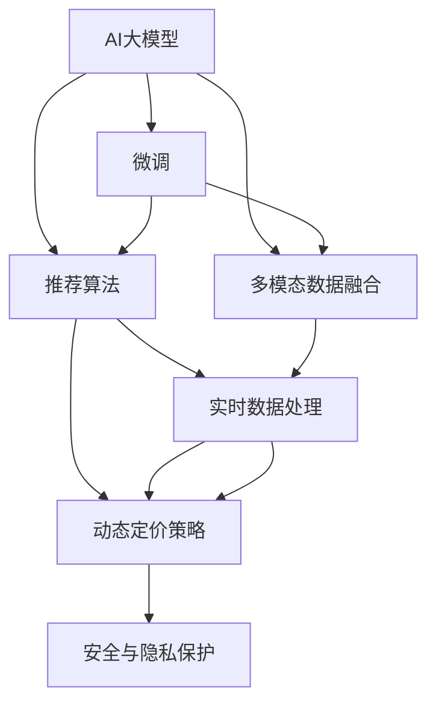

                 

# 电商平台中AI大模型的实时决策系统构建

> 关键词：电商平台, AI大模型, 实时决策系统, 推荐算法, 多模态数据融合, 数据增强, 对抗训练, 动态定价策略

## 1. 背景介绍

### 1.1 问题由来
在现代社会中，电商平台已成为消费者购买商品的主要渠道之一。为了更好地满足消费者需求，电商平台需要不断地优化其运营策略，提高服务质量和用户体验。AI大模型的应用，为电商平台带来了新的发展机遇。AI模型可以处理海量数据，自动发现用户行为模式，并实时进行决策。但同时也面临一些挑战：数据处理速度、模型实时响应能力、决策准确性等。本文将介绍如何构建电商平台的AI实时决策系统，以提升其运营效率和客户满意度。

### 1.2 问题核心关键点
本节将介绍构建电商平台的AI实时决策系统所需的关键点：

1. **数据收集与处理**：电商平台需要收集用户的浏览行为、购买记录、评价信息等多维度数据。

2. **模型构建与微调**：选择合适的AI模型进行构建，并通过微调提升其对电商平台的适应性。

3. **实时数据处理**：保证模型能够实时处理用户请求，提供即时的决策结果。

4. **决策策略优化**：设计合理的决策策略，提高推荐和定价的准确性。

5. **系统性能优化**：优化系统的响应速度和稳定性，提升用户体验。

6. **安全与隐私保护**：确保用户数据安全，遵守隐私保护法律法规。

通过理解这些关键点，可以更好地设计电商平台中的AI实时决策系统。

### 1.3 问题研究意义
构建电商平台的AI实时决策系统具有以下研究意义：

1. **提升运营效率**：通过AI模型，电商平台可以自动化处理用户请求，提高运营效率。

2. **优化用户体验**：AI实时决策系统可以根据用户行为，提供个性化的推荐和定价，提升用户体验。

3. **增加收益**：通过智能定价和推荐，电商平台可以优化商品价格和库存，增加收益。

4. **应对市场变化**：AI系统能够实时监测市场变化，快速调整策略，提高竞争力。

5. **数据驱动决策**：AI模型可以分析用户行为，为电商平台提供数据驱动的决策支持。

因此，构建电商平台的AI实时决策系统，有助于提升电商平台的运营能力和市场竞争力。

## 2. 核心概念与联系

### 2.1 核心概念概述

构建电商平台的AI实时决策系统涉及多个核心概念：

- **AI大模型**：如BERT、GPT等，通过大规模数据预训练，学习通用的语言表示，具备强大的语言理解和生成能力。

- **微调(Fine-tuning)**：通过在特定任务上微调预训练模型，使其能够适应电商平台的业务需求。

- **多模态数据融合**：将不同模态的数据（文本、图像、视频等）进行融合，提升模型的决策能力。

- **推荐算法**：如协同过滤、基于内容的推荐等，根据用户历史行为，推荐合适的商品。

- **实时数据处理**：通过流处理技术，如Apache Kafka、Apache Flink等，实时处理用户请求。

- **动态定价策略**：根据市场需求和竞争对手价格，动态调整商品价格，实现最佳收益。

- **安全与隐私保护**：在数据处理和模型训练过程中，确保用户隐私和数据安全。

这些核心概念之间的逻辑关系可以通过以下Mermaid流程图来展示：



这个流程图展示了一些关键概念的相互联系：

1. AI大模型通过微调学习电商平台的业务知识。
2. 多模态数据融合和推荐算法增强模型的决策能力。
3. 实时数据处理和动态定价策略优化模型响应速度和决策效果。
4. 安全与隐私保护保障数据和模型的安全。

## 3. 核心算法原理 & 具体操作步骤

### 3.1 算法原理概述

电商平台的AI实时决策系统依赖于AI大模型的微调，通过多模态数据融合和推荐算法，实现实时决策。其核心算法原理如下：

1. **数据收集与预处理**：收集用户的浏览行为、购买记录、评价信息等数据，并进行预处理和特征提取。

2. **模型构建与微调**：选择合适的AI模型，如BERT、GPT等，通过微调学习电商平台的业务知识。

3. **多模态数据融合**：将文本、图像、视频等多模态数据进行融合，提升模型的决策能力。

4. **实时数据处理**：通过流处理技术，如Apache Kafka、Apache Flink等，实时处理用户请求。

5. **推荐算法**：根据用户历史行为，推荐合适的商品。

6. **动态定价策略**：根据市场需求和竞争对手价格，动态调整商品价格，实现最佳收益。

7. **安全与隐私保护**：在数据处理和模型训练过程中，确保用户隐私和数据安全。

### 3.2 算法步骤详解

电商平台的AI实时决策系统构建流程如下：

**Step 1: 数据收集与预处理**

- 收集用户的浏览行为、购买记录、评价信息等数据，并进行清洗、去重、归一化等预处理。

- 对文本数据进行分词、词性标注、实体识别等特征提取，生成特征向量。

- 对图像、视频等非文本数据进行特征提取，如使用CNN提取图像特征，使用LSTM提取视频特征。

**Step 2: 模型构建与微调**

- 选择合适的预训练语言模型，如BERT、GPT等。

- 在电商平台的标注数据集上进行微调，训练模型学习电商平台的业务知识。

- 使用多模态数据融合技术，将文本、图像、视频等数据进行融合，提升模型的决策能力。

**Step 3: 实时数据处理**

- 使用流处理技术，如Apache Kafka、Apache Flink等，实时处理用户请求。

- 将用户请求数据输入到微调后的模型中，生成推荐和定价结果。

**Step 4: 决策策略优化**

- 使用推荐算法，如协同过滤、基于内容的推荐等，根据用户历史行为，推荐合适的商品。

- 根据市场需求和竞争对手价格，设计动态定价策略，调整商品价格，实现最佳收益。

**Step 5: 系统性能优化**

- 优化系统的响应速度和稳定性，提升用户体验。

- 使用缓存技术，如Redis等，减少模型计算时间。

- 使用负载均衡技术，确保系统能够高效处理大量请求。

**Step 6: 安全与隐私保护**

- 在数据处理和模型训练过程中，确保用户隐私和数据安全。

- 使用加密技术，如SSL/TLS等，保护数据传输安全。

- 遵守隐私保护法律法规，如GDPR、CCPA等。

### 3.3 算法优缺点

电商平台的AI实时决策系统具有以下优点：

1. **高效处理数据**：通过AI大模型和多模态数据融合，可以高效处理大量数据，提升决策效率。

2. **个性化推荐**：通过推荐算法，可以提供个性化的商品推荐，提升用户体验。

3. **动态定价策略**：通过动态定价策略，可以实现最佳收益，提高电商平台的盈利能力。

4. **实时响应**：通过实时数据处理，可以及时响应用户请求，提升系统响应速度。

5. **多模态数据融合**：通过多模态数据融合，可以全面分析用户行为，提高决策的准确性。

6. **安全性高**：通过安全与隐私保护措施，可以确保用户数据和模型的安全。

同时，该系统也存在以下缺点：

1. **数据质量要求高**：电商平台的AI实时决策系统依赖于高质量的数据，数据偏差可能导致决策错误。

2. **模型复杂度高**：大规模语言模型的参数量庞大，对计算资源要求高。

3. **实时性要求高**：电商平台对系统响应速度要求高，需要优化系统的实时处理能力。

4. **隐私保护挑战**：在数据处理和模型训练过程中，需要确保用户隐私和数据安全，遵守隐私保护法律法规。

5. **动态定价策略复杂**：动态定价策略的设计需要考虑市场变化、竞争对手价格、用户行为等多种因素。

尽管存在这些缺点，但就目前而言，AI实时决策系统仍是目前电商平台的最佳选择。

### 3.4 算法应用领域

电商平台的AI实时决策系统在多个领域得到了应用，包括：

1. **推荐系统**：根据用户历史行为，推荐合适的商品。

2. **定价系统**：根据市场需求和竞争对手价格，动态调整商品价格，实现最佳收益。

3. **客户服务**：通过智能客服，提高客户服务效率和质量。

4. **库存管理**：通过预测用户购买行为，优化库存管理，减少库存积压。

5. **风险控制**：通过风险评估模型，识别潜在风险，保护电商平台的安全。

6. **广告投放**：根据用户行为，优化广告投放策略，提高广告效果。

通过这些应用，电商平台可以更好地优化运营策略，提升用户体验，增加收益。

## 4. 数学模型和公式 & 详细讲解 & 举例说明

### 4.1 数学模型构建

电商平台的AI实时决策系统涉及多个数学模型，以下以推荐系统为例，进行详细讲解。

假设电商平台的推荐系统为协同过滤推荐，输入为用户的特征向量 $\mathbf{x}$ 和商品的特征向量 $\mathbf{y}$，输出为用户对商品的评分 $r$。则推荐模型的目标函数为：

$$
\min_{\theta} \sum_{i=1}^N \sum_{j=1}^M (r_{ij}-\mathbf{x}_i^T \theta \mathbf{y}_j)^2
$$

其中 $r_{ij}$ 为用户 $i$ 对商品 $j$ 的评分，$\theta$ 为模型的权重参数。

通过最小化目标函数，可以训练得到推荐模型。在电商平台的实际应用中，还需要考虑多模态数据融合、实时数据处理等因素，对模型进行优化。

### 4.2 公式推导过程

对于推荐系统，我们可以通过矩阵分解技术进行模型优化。假设用户与商品的评分矩阵为 $\mathbf{R}$，用户特征矩阵为 $\mathbf{X}$，商品特征矩阵为 $\mathbf{Y}$，则推荐模型的矩阵分解形式为：

$$
\mathbf{R} \approx \mathbf{X} \mathbf{Z}^T
$$

其中 $\mathbf{Z}$ 为低秩矩阵，$\mathbf{Z}=\mathbf{X} \mathbf{W} \mathbf{U}^T$，$\mathbf{W}$ 和 $\mathbf{U}$ 为模型的权重参数。

根据矩阵分解形式，推荐模型的目标函数可以转化为：

$$
\min_{\mathbf{W},\mathbf{U}} \|\mathbf{R}-\mathbf{X} \mathbf{W} \mathbf{U}^T\|_F^2
$$

其中 $\|\cdot\|_F$ 表示矩阵的Frobenius范数。

通过求解上述优化问题，可以训练得到低秩矩阵 $\mathbf{Z}$，从而得到推荐模型的权重参数。

### 4.3 案例分析与讲解

下面以一个具体案例进行分析：

假设电商平台有一个用户 $i$，其特征向量为 $\mathbf{x}_i$，有 $n$ 个商品，其评分矩阵为 $\mathbf{R}$，商品特征矩阵为 $\mathbf{Y}$。

- **数据收集与预处理**：
  - 收集用户的浏览行为、购买记录、评价信息等数据。
  - 对文本数据进行分词、词性标注、实体识别等特征提取，生成特征向量 $\mathbf{x}_i$。
  - 对商品特征进行提取，生成特征向量 $\mathbf{y}_j$。

- **模型构建与微调**：
  - 选择合适的预训练语言模型，如BERT、GPT等。
  - 在电商平台的标注数据集上进行微调，训练模型学习电商平台的业务知识。
  - 使用多模态数据融合技术，将文本、图像、视频等数据进行融合，提升模型的决策能力。

- **实时数据处理**：
  - 使用流处理技术，如Apache Kafka、Apache Flink等，实时处理用户请求。
  - 将用户请求数据输入到微调后的模型中，生成推荐和定价结果。

- **决策策略优化**：
  - 使用推荐算法，如协同过滤、基于内容的推荐等，根据用户历史行为，推荐合适的商品。
  - 根据市场需求和竞争对手价格，设计动态定价策略，调整商品价格，实现最佳收益。

- **系统性能优化**：
  - 优化系统的响应速度和稳定性，提升用户体验。
  - 使用缓存技术，如Redis等，减少模型计算时间。
  - 使用负载均衡技术，确保系统能够高效处理大量请求。

- **安全与隐私保护**：
  - 在数据处理和模型训练过程中，确保用户隐私和数据安全。
  - 使用加密技术，如SSL/TLS等，保护数据传输安全。
  - 遵守隐私保护法律法规，如GDPR、CCPA等。

## 5. 项目实践：代码实例和详细解释说明

### 5.1 开发环境搭建

在进行电商平台的AI实时决策系统开发前，我们需要准备好开发环境。以下是使用Python进行PyTorch开发的环境配置流程：

1. 安装Anaconda：从官网下载并安装Anaconda，用于创建独立的Python环境。

2. 创建并激活虚拟环境：
```bash
conda create -n pytorch-env python=3.8 
conda activate pytorch-env
```

3. 安装PyTorch：根据CUDA版本，从官网获取对应的安装命令。例如：
```bash
conda install pytorch torchvision torchaudio cudatoolkit=11.1 -c pytorch -c conda-forge
```

4. 安装Transformers库：
```bash
pip install transformers
```

5. 安装各类工具包：
```bash
pip install numpy pandas scikit-learn matplotlib tqdm jupyter notebook ipython
```

完成上述步骤后，即可在`pytorch-env`环境中开始电商平台的AI实时决策系统开发。

### 5.2 源代码详细实现

下面我们以推荐系统为例，给出使用Transformers库对BERT模型进行微调的PyTorch代码实现。

首先，定义推荐系统数据处理函数：

```python
from transformers import BertTokenizer
from torch.utils.data import Dataset
import torch

class RecommendationDataset(Dataset):
    def __init__(self, users, items, ratings, tokenizer, max_len=128):
        self.users = users
        self.items = items
        self.ratings = ratings
        self.tokenizer = tokenizer
        self.max_len = max_len
        
    def __len__(self):
        return len(self.users)
    
    def __getitem__(self, item):
        user = self.users[item]
        item = self.items[item]
        rating = self.ratings[item]
        
        encoding = self.tokenizer([f"User: {user}, Item: {item}"], return_tensors='pt', max_length=self.max_len, padding='max_length', truncation=True)
        input_ids = encoding['input_ids'][0]
        attention_mask = encoding['attention_mask'][0]
        
        # 对用户、商品评分进行编码
        encoded_user = [tokenizer([f"User: {user}"]) for user in self.users]
        encoded_item = [tokenizer([f"Item: {item}"]) for item in self.items]
        encoded_ratings = [rating for rating in self.ratings]
        
        return {'input_ids': input_ids, 
                'attention_mask': attention_mask,
                'encoded_user': encoded_user,
                'encoded_item': encoded_item,
                'encoded_ratings': encoded_ratings}

# 标签与id的映射
user2id = {user: i for i, user in enumerate(set(users))}
id2user = {i: user for i, user in enumerate(set(users))}
item2id = {item: i for i, item in enumerate(set(items))}
id2item = {i: item for i, item in enumerate(set(items))}

# 创建dataset
tokenizer = BertTokenizer.from_pretrained('bert-base-cased')

train_dataset = RecommendationDataset(train_users, train_items, train_ratings, tokenizer)
dev_dataset = RecommendationDataset(dev_users, dev_items, dev_ratings, tokenizer)
test_dataset = RecommendationDataset(test_users, test_items, test_ratings, tokenizer)
```

然后，定义模型和优化器：

```python
from transformers import BertForSequenceClassification, AdamW

model = BertForSequenceClassification.from_pretrained('bert-base-cased', num_labels=len(id2user))
optimizer = AdamW(model.parameters(), lr=2e-5)
```

接着，定义训练和评估函数：

```python
from torch.utils.data import DataLoader
from tqdm import tqdm
from sklearn.metrics import mean_squared_error

device = torch.device('cuda') if torch.cuda.is_available() else torch.device('cpu')
model.to(device)

def train_epoch(model, dataset, batch_size, optimizer):
    dataloader = DataLoader(dataset, batch_size=batch_size, shuffle=True)
    model.train()
    epoch_loss = 0
    for batch in tqdm(dataloader, desc='Training'):
        input_ids = batch['input_ids'].to(device)
        attention_mask = batch['attention_mask'].to(device)
        encoded_user = batch['encoded_user'].to(device)
        encoded_item = batch['encoded_item'].to(device)
        encoded_ratings = batch['encoded_ratings'].to(device)
        model.zero_grad()
        outputs = model(input_ids, attention_mask=attention_mask, labels=encoded_ratings)
        loss = outputs.loss
        epoch_loss += loss.item()
        loss.backward()
        optimizer.step()
    return epoch_loss / len(dataloader)

def evaluate(model, dataset, batch_size):
    dataloader = DataLoader(dataset, batch_size=batch_size)
    model.eval()
    predictions = []
    labels = []
    with torch.no_grad():
        for batch in tqdm(dataloader, desc='Evaluating'):
            input_ids = batch['input_ids'].to(device)
            attention_mask = batch['attention_mask'].to(device)
            encoded_user = batch['encoded_user'].to(device)
            encoded_item = batch['encoded_item'].to(device)
            batch_labels = batch['encoded_ratings'].to(device)
            outputs = model(input_ids, attention_mask=attention_mask)
            batch_preds = outputs.logits.argmax(dim=2).to('cpu').tolist()
            batch_labels = batch_labels.to('cpu').tolist()
            for preds_tokens, label_tokens in zip(batch_preds, batch_labels):
                predictions.append(preds_tokens[:len(label_tokens)])
                labels.append(label_tokens)
                
    print(mean_squared_error(labels, predictions))
```

最后，启动训练流程并在测试集上评估：

```python
epochs = 5
batch_size = 16

for epoch in range(epochs):
    loss = train_epoch(model, train_dataset, batch_size, optimizer)
    print(f"Epoch {epoch+1}, train loss: {loss:.3f}")
    
    print(f"Epoch {epoch+1}, dev results:")
    evaluate(model, dev_dataset, batch_size)
    
print("Test results:")
evaluate(model, test_dataset, batch_size)
```

以上就是使用PyTorch对BERT进行推荐系统微调的完整代码实现。可以看到，得益于Transformers库的强大封装，我们可以用相对简洁的代码完成BERT模型的加载和微调。

### 5.3 代码解读与分析

让我们再详细解读一下关键代码的实现细节：

**RecommendationDataset类**：
- `__init__`方法：初始化用户、商品、评分等关键组件。
- `__len__`方法：返回数据集的样本数量。
- `__getitem__`方法：对单个样本进行处理，将用户、商品和评分进行编码，并对其进行定长padding，最终返回模型所需的输入。

**用户与商品映射字典**：
- 定义了用户与数字id之间的映射关系，用于将评分进行编码。

**训练和评估函数**：
- 使用PyTorch的DataLoader对数据集进行批次化加载，供模型训练和推理使用。
- 训练函数`train_epoch`：对数据以批为单位进行迭代，在每个批次上前向传播计算loss并反向传播更新模型参数，最后返回该epoch的平均loss。
- 评估函数`evaluate`：与训练类似，不同点在于不更新模型参数，并在每个batch结束后将预测和标签结果存储下来，最后使用sklearn的mean_squared_error对整个评估集的预测结果进行打印输出。

**训练流程**：
- 定义总的epoch数和batch size，开始循环迭代
- 每个epoch内，先在训练集上训练，输出平均loss
- 在验证集上评估，输出MSE（Mean Squared Error）损失
- 所有epoch结束后，在测试集上评估，给出最终测试结果

可以看到，PyTorch配合Transformers库使得BERT微调的代码实现变得简洁高效。开发者可以将更多精力放在数据处理、模型改进等高层逻辑上，而不必过多关注底层的实现细节。

当然，工业级的系统实现还需考虑更多因素，如模型的保存和部署、超参数的自动搜索、更灵活的任务适配层等。但核心的微调范式基本与此类似。

## 6. 实际应用场景

### 6.1 智能推荐系统

智能推荐系统是电商平台的核心功能之一，通过AI实时决策系统，可以实现个性化推荐，提高用户满意度和销售额。

具体而言，可以将用户的浏览行为、购买记录、评价信息等多维度数据进行预处理，并输入到微调后的BERT模型中进行特征提取。然后，将提取的特征与商品特征进行融合，使用协同过滤等推荐算法，生成推荐结果。

通过智能推荐系统，电商平台可以更好地满足用户需求，提高用户满意度，增加销售额。

### 6.2 实时定价策略

电商平台实时定价策略需要考虑市场需求和竞争对手价格，通过AI实时决策系统，可以实时调整商品价格，实现最佳收益。

具体而言，可以将商品的市场需求、竞争对手价格、用户行为等数据进行预处理，并输入到微调后的BERT模型中进行特征提取。然后，根据市场需求和竞争对手价格，设计动态定价策略，调整商品价格，实现最佳收益。

通过实时定价策略，电商平台可以更好地应对市场变化，优化商品价格，增加收益。

### 6.3 动态库存管理

电商平台的库存管理需要考虑市场需求和库存量，通过AI实时决策系统，可以实时调整库存，减少库存积压。

具体而言，可以将市场需求、库存量、用户行为等数据进行预处理，并输入到微调后的BERT模型中进行特征提取。然后，根据市场需求和库存量，设计动态库存管理策略，调整库存，减少库存积压。

通过动态库存管理，电商平台可以更好地控制库存，降低成本，提高运营效率。

### 6.4 未来应用展望

随着AI实时决策系统的发展，未来的电商平台将具备更加智能的运营能力，具体展望如下：

1. **数据驱动决策**：电商平台可以全面分析用户行为，实现数据驱动的决策，提升决策的准确性。

2. **个性化推荐**：通过智能推荐系统，电商平台可以提供个性化的商品推荐，提高用户满意度。

3. **实时定价策略**：通过实时定价策略，电商平台可以实时调整商品价格，实现最佳收益。

4. **动态库存管理**：通过动态库存管理，电商平台可以实时调整库存，减少库存积压。

5. **多模态数据融合**：通过多模态数据融合，电商平台可以全面分析用户行为，提升决策的准确性。

6. **实时处理能力**：通过实时数据处理技术，电商平台可以实时处理用户请求，提升用户体验。

7. **动态定价策略**：通过动态定价策略，电商平台可以实时调整商品价格，实现最佳收益。

8. **安全性高**：通过安全与隐私保护措施，电商平台可以确保用户数据和模型的安全。

总之，未来电商平台中的AI实时决策系统将具备更加智能的运营能力，为消费者提供更优质的购物体验，为商家提供更高效的运营支持，为平台带来更大的收益。

## 7. 工具和资源推荐

### 7.1 学习资源推荐

为了帮助开发者系统掌握AI实时决策系统的理论基础和实践技巧，这里推荐一些优质的学习资源：

1. 《Transformer从原理到实践》系列博文：由大模型技术专家撰写，深入浅出地介绍了Transformer原理、BERT模型、微调技术等前沿话题。

2. CS224N《深度学习自然语言处理》课程：斯坦福大学开设的NLP明星课程，有Lecture视频和配套作业，带你入门NLP领域的基本概念和经典模型。

3. 《Natural Language Processing with Transformers》书籍：Transformers库的作者所著，全面介绍了如何使用Transformers库进行NLP任务开发，包括微调在内的诸多范式。

4. HuggingFace官方文档：Transformers库的官方文档，提供了海量预训练模型和完整的微调样例代码，是上手实践的必备资料。

5. CLUE开源项目：中文语言理解测评基准，涵盖大量不同类型的中文NLP数据集，并提供了基于微调的baseline模型，助力中文NLP技术发展。

通过对这些资源的学习实践，相信你一定能够快速掌握AI实时决策系统的精髓，并用于解决实际的NLP问题。

### 7.2 开发工具推荐

高效的开发离不开优秀的工具支持。以下是几款用于电商平台AI实时决策系统开发的常用工具：

1. PyTorch：基于Python的开源深度学习框架，灵活动态的计算图，适合快速迭代研究。大部分预训练语言模型都有PyTorch版本的实现。

2. TensorFlow：由Google主导开发的开源深度学习框架，生产部署方便，适合大规模工程应用。同样有丰富的预训练语言模型资源。

3. Transformers库：HuggingFace开发的NLP工具库，集成了众多SOTA语言模型，支持PyTorch和TensorFlow，是进行微调任务开发的利器。

4. Weights & Biases：模型训练的实验跟踪工具，可以记录和可视化模型训练过程中的各项指标，方便对比和调优。与主流深度学习框架无缝集成。

5. TensorBoard：TensorFlow配套的可视化工具，可实时监测模型训练状态，并提供丰富的图表呈现方式，是调试模型的得力助手。

6. Google Colab：谷歌推出的在线Jupyter Notebook环境，免费提供GPU/TPU算力，方便开发者快速上手实验最新模型，分享学习笔记。

合理利用这些工具，可以显著提升电商平台AI实时决策系统的开发效率，加快创新迭代的步伐。

### 7.3 相关论文推荐

AI实时决策系统的发展源于学界的持续研究。以下是几篇奠基性的相关论文，推荐阅读：

1. Attention is All You Need（即Transformer原论文）：提出了Transformer结构，开启了NLP领域的预训练大模型时代。

2. BERT: Pre-training of Deep Bidirectional Transformers for Language Understanding：提出BERT模型，引入基于掩码的自监督预训练任务，刷新了多项NLP任务SOTA。

3. Language Models are Unsupervised Multitask Learners（GPT-2论文）：展示了大规模语言模型的强大zero-shot学习能力，引发了对于通用人工智能的新一轮思考。

4. Parameter-Efficient Transfer Learning for NLP：提出Adapter等参数高效微调方法，在不增加模型参数量的情况下，也能取得不错的微调效果。

5. Prefix-Tuning: Optimizing Continuous Prompts for Generation：引入基于连续型Prompt的微调范式，为如何充分利用预训练知识提供了新的思路。

6. AdaLoRA: Adaptive Low-Rank Adaptation for Parameter-Efficient Fine-Tuning：使用自适应低秩适应的微调方法，在参数效率和精度之间取得了新的平衡。

这些论文代表了大语言模型微调技术的发展脉络。通过学习这些前沿成果，可以帮助研究者把握学科前进方向，激发更多的创新灵感。

## 8. 总结：未来发展趋势与挑战

### 8.1 总结

本文对电商平台的AI实时决策系统进行了全面系统的介绍。首先阐述了构建电商平台的AI实时决策系统所需的关键点，明确了系统构建的过程和目标。其次，从原理到实践，详细讲解了AI实时决策系统的数学原理和关键步骤，给出了系统的代码实现和解释分析。同时，本文还广泛探讨了AI实时决策系统在电商平台中的应用场景，展示了系统的重要作用。

通过本文的系统梳理，可以看到，电商平台的AI实时决策系统通过AI大模型和多模态数据融合，实现了实时决策，提升了运营效率和用户体验。未来，伴随AI技术的发展，电商平台中的AI实时决策系统将具备更加智能的运营能力，进一步推动电商行业的数字化转型。

### 8.2 未来发展趋势

电商平台的AI实时决策系统具有以下发展趋势：

1. **智能化运营**：通过AI实时决策系统，电商平台可以实现数据驱动的运营决策，提升运营效率和用户体验。

2. **个性化推荐**：通过智能推荐系统，电商平台可以提供个性化的商品推荐，提高用户满意度。

3. **实时定价策略**：通过实时定价策略，电商平台可以实时调整商品价格，实现最佳收益。

4. **动态库存管理**：通过动态库存管理，电商平台可以实时调整库存，减少库存积压。

5. **多模态数据融合**：通过多模态数据融合，电商平台可以全面分析用户行为，提升决策的准确性。

6. **实时处理能力**：通过实时数据处理技术，电商平台可以实时处理用户请求，提升用户体验。

7. **动态定价策略**：通过动态定价策略，电商平台可以实时调整商品价格，实现最佳收益。

8. **安全性高**：通过安全与隐私保护措施，电商平台可以确保用户数据和模型的安全。

这些趋势凸显了电商平台的AI实时决策系统的广阔前景。未来，随着AI技术的发展，电商平台中的AI实时决策系统将具备更加智能的运营能力，为消费者提供更优质的购物体验，为商家提供更高效的运营支持，为平台带来更大的收益。

### 8.3 面临的挑战

尽管电商平台的AI实时决策系统已经取得了瞩目成就，但在迈向更加智能化、普适化应用的过程中，它仍面临一些挑战：

1. **数据质量要求高**：电商平台的AI实时决策系统依赖于高质量的数据，数据偏差可能导致决策错误。

2. **模型复杂度高**：大规模语言模型的参数量庞大，对计算资源要求高。

3. **实时性要求高**：电商平台对系统响应速度要求高，需要优化系统的实时处理能力。

4. **隐私保护挑战**：在数据处理和模型训练过程中，需要确保用户隐私和数据安全，遵守隐私保护法律法规。

5. **动态定价策略复杂**：动态定价策略的设计需要考虑市场变化、竞争对手价格、用户行为等多种因素。

尽管存在这些挑战，但就目前而言，AI实时决策系统仍是目前电商平台的最佳选择。未来，我们需要不断优化数据质量，提高模型效率，优化实时处理能力，保障用户隐私和数据安全，才能实现更加智能的电商平台。

### 8.4 研究展望

未来，在电商平台的AI实时决策系统研究中，还需要在以下几个方面进行深入探索：

1. **优化数据质量**：通过数据清洗、数据增强等方法，提高数据质量，减少数据偏差。

2. **提高模型效率**：通过优化模型结构和参数，提高模型效率，降低计算资源消耗。

3. **提升实时处理能力**：通过流处理技术、缓存技术等，优化实时处理能力，提升系统响应速度。

4. **保障用户隐私**：通过加密技术、数据脱敏等方法，保障用户隐私和数据安全。

5. **设计动态定价策略**：通过引入博弈论、因果推断等方法，设计动态定价策略，优化定价效果。

6. **融合多模态数据**：通过多模态数据融合技术，全面分析用户行为，提升决策的准确性。

7. **优化推荐算法**：通过优化推荐算法，提高推荐效果，提升用户体验。

这些研究方向将推动电商平台的AI实时决策系统不断发展，为消费者提供更优质的购物体验，为商家提供更高效的运营支持，为平台带来更大的收益。

## 9. 附录：常见问题与解答

**Q1：电商平台的AI实时决策系统是否适用于所有电商平台？**

A: 电商平台的AI实时决策系统可以适用于多种类型的电商平台，包括B2B、B2C、C2C等。但不同类型电商平台的数据特点和运营策略不同，需要进行针对性的设计。

**Q2：AI实时决策系统需要哪些关键组件？**

A: AI实时决策系统需要以下关键组件：

1. **数据收集与预处理**：收集用户行为、购买记录、评价信息等多维度数据，并进行预处理和特征提取。

2. **模型构建与微调**：选择合适的预训练语言模型，并通过微调学习电商平台的业务知识。

3. **多模态数据融合**：将文本、图像、视频等多模态数据进行融合，提升模型的决策能力。

4. **实时数据处理**：通过流处理技术，实时处理用户请求。

5. **决策策略优化**：设计合理的决策策略，提高推荐和定价的准确性。

6. **系统性能优化**：优化系统的响应速度和稳定性，提升用户体验。

7. **安全与隐私保护**：确保用户数据和模型的安全，遵守隐私保护法律法规。

**Q3：AI实时决策系统需要哪些技术支持？**

A: AI实时决策系统需要以下技术支持：

1. **深度学习框架**：如PyTorch、TensorFlow等，用于构建和训练AI模型。

2. **自然语言处理工具**：如Transformers库，用于处理和提取自然语言信息。

3. **流处理技术**：如Apache Kafka、Apache Flink等，用于实时处理用户请求。

4. **推荐算法**：如协同过滤、基于内容的推荐等，用于生成推荐结果。

5. **动态定价策略**：用于根据市场需求和竞争对手价格，动态调整商品价格。

6. **安全与隐私保护技术**：如加密技术、数据脱敏等，用于保障用户数据和模型的安全。

**Q4：电商平台的AI实时决策系统有哪些应用场景？**

A: 电商平台的AI实时决策系统可以应用于以下场景：

1. **智能推荐系统**：根据用户历史行为，推荐合适的商品。

2. **实时定价策略**：根据市场需求和竞争对手价格，动态调整商品价格。

3. **动态库存管理**：根据市场需求和库存量，调整库存，减少库存积压。

4. **智能客服**：通过智能客服，提高客户服务效率和质量。

5. **风险控制**：通过风险评估模型，识别潜在风险，保护电商平台的安全。

6. **广告投放**：根据用户行为，优化广告投放策略，提高广告效果。

通过这些应用，电商平台可以更好地优化运营策略，提升用户体验，增加收益。

**Q5：如何评估电商平台的AI实时决策系统？**

A: 电商平台的AI实时决策系统可以通过以下指标进行评估：

1. **准确性**：通过均方误差（MSE）、准确率、召回率等指标，评估推荐和定价的准确性。

2. **效率**：通过响应时间、吞吐量等指标，评估系统的实时处理能力。

3. **效果**：通过转化率、销售额等指标，评估系统的实际效果。

4. **稳定性**：通过系统稳定性、可用性等指标，评估系统的可靠性。

5. **用户体验**：通过用户满意度、投诉率等指标，评估系统的用户体验。

6. **安全与隐私**：通过数据安全、隐私保护等指标，评估系统的安全性。

通过这些指标的评估，可以全面了解电商平台的AI实时决策系统的性能和效果。

---

作者：禅与计算机程序设计艺术 / Zen and the Art of Computer Programming

