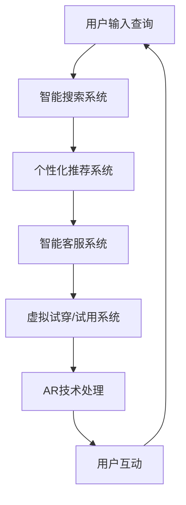

                 

# 电商平台中的AI大模型与增强现实结合

> 关键词：AI大模型,增强现实,电商平台,推荐系统,个性化展示,智能客服

## 1. 背景介绍

在数字化转型的大背景下，电商平台正面临着前所未有的挑战和机遇。如何在海量商品和用户数据中快速匹配出用户需求，如何提供个性化、互动性的购物体验，如何提升客户满意度和转化率，这些问题是电商平台亟需解决的难题。AI大模型和增强现实技术的结合，为电商平台开辟了一条新路径。

### 1.1 问题由来

传统电商平台依赖于人工推荐算法和静态页面展示，难以满足用户多样化和实时化的需求。用户往往需要在海量的商品列表中逐一浏览，耗费大量时间且容易产生选择困难。尤其是在用户多、商品多的情况下，电商平台需要消耗大量的运营和维护成本，而运营效果却往往不尽如人意。

AI大模型和增强现实技术的出现，为电商平台提供了智能化的解决方案。AI大模型能够通过预训练和微调，具备强大的语义理解、情感分析、推理预测等能力，可以应用于个性化推荐、智能客服、智能搜索等多个环节。而增强现实(AR)技术能够将虚拟信息叠加在现实世界中，以更直观、互动的方式展现商品信息和用户体验，提升购物体验。

### 1.2 问题核心关键点

AI大模型和AR技术的结合，主要体现在以下几个方面：

1. **个性化推荐系统**：利用AI大模型分析用户历史行为和兴趣，推荐个性化商品和活动，提升用户满意度。
2. **智能客服系统**：通过AI大模型构建智能客服系统，提供24小时在线服务，解答用户疑问，提升用户体验。
3. **智能搜索系统**：应用AI大模型优化搜索引擎，提供更精准、高效的搜索结果，减少用户搜索时间和难度。
4. **虚拟试穿/试用系统**：通过AR技术结合AI大模型，实现虚拟试穿、试用等体验，提升购物决策的准确性。

这些核心关键点展示了AI大模型和AR技术在电商平台中的应用潜力，为电商平台的发展提供了新的方向。

## 2. 核心概念与联系

### 2.1 核心概念概述

为了更好地理解AI大模型与AR技术在电商平台中的应用，我们需要先了解几个核心概念：

- **AI大模型**：以Transformer为代表的预训练语言模型，如BERT、GPT-3等，通过大规模语料库进行预训练，具备强大的语义理解、推理预测等能力。
- **增强现实(AR)**：通过计算机视觉技术，将虚拟信息叠加在现实世界中，提升用户体验和交互性。
- **个性化推荐系统**：基于用户行为和兴趣进行智能推荐，提升用户满意度和购物转化率。
- **智能客服系统**：利用自然语言处理和推理技术，构建智能客服，提供自动化服务。
- **虚拟试穿/试用系统**：结合AR技术，通过AI大模型生成试穿/试用的虚拟效果，提升购物决策准确性。

这些核心概念之间存在紧密联系，共同构建了AI大模型与AR技术结合在电商平台中的应用框架。通过理解这些概念，可以更好地把握AI大模型与AR技术在电商平台中的应用逻辑。

### 2.2 核心概念原理和架构的 Mermaid 流程图



这个流程图展示了从用户输入到最终反馈的完整流程，其中AI大模型和AR技术在其中扮演了重要角色。通过这个流程图，可以更清晰地理解各个系统之间的协同作用。

## 3. 核心算法原理 & 具体操作步骤
### 3.1 算法原理概述

AI大模型与AR技术的结合，主要通过以下核心算法实现：

1. **个性化推荐算法**：利用AI大模型对用户行为和商品特征进行建模，通过协同过滤、矩阵分解等技术推荐个性化商品。
2. **自然语言处理(NLP)**：利用AI大模型进行情感分析、意图识别、命名实体识别等NLP任务，提升智能客服系统的准确性。
3. **图像识别和处理**：利用AI大模型进行图像分类、图像分割等任务，结合AR技术生成虚拟商品展示效果。
4. **深度学习生成模型**：利用AI大模型生成虚拟试穿、试用效果，提升购物体验。

### 3.2 算法步骤详解

以下是AI大模型与AR技术结合在电商平台中的具体操作步骤：

**Step 1: 数据收集与预处理**
- 收集用户行为数据、商品属性数据、用户评价数据等，进行数据清洗和预处理。
- 将数据输入AI大模型进行预训练或微调，得到模型参数。

**Step 2: 构建AI大模型**
- 选择合适的AI大模型，如BERT、GPT等，进行预训练和微调，得到适合电商平台的模型。
- 构建智能搜索、推荐、客服等系统，应用AI大模型进行数据分析和决策。

**Step 3: 应用增强现实技术**
- 利用计算机视觉技术，对用户界面进行增强，叠加虚拟商品信息。
- 通过图像识别和处理技术，生成虚拟试穿/试用效果，提供更加真实的购物体验。

**Step 4: 用户交互与反馈**
- 收集用户互动数据，如点击率、购买率等，反馈到AI大模型进行模型更新和优化。
- 根据用户反馈，调整推荐策略和AR展示效果，提升用户体验。

### 3.3 算法优缺点

AI大模型与AR技术结合在电商平台中的应用，具有以下优点：

1. **提升用户体验**：AR技术提供互动性强的虚拟展示效果，提升用户购物体验，减少决策难度。
2. **提高推荐精准度**：AI大模型通过分析用户行为和商品特征，生成个性化的推荐结果，提升用户满意度。
3. **降低运营成本**：自动化客服和搜索系统，减少了人力成本和运营复杂度。
4. **优化资源配置**：通过分析用户互动数据，优化商品展示和广告投放策略，提高资源利用效率。

然而，这种结合也存在一些缺点：

1. **技术复杂度较高**：AI大模型和AR技术的结合，需要跨领域的知识和技术支持，实现难度较大。
2. **数据需求量大**：高质量的数据是AI大模型和AR技术结合的基础，数据获取和处理成本较高。
3. **算力要求高**：AI大模型和AR技术对算力要求较高，需要高性能计算资源支持。

### 3.4 算法应用领域

AI大模型与AR技术的结合，主要应用于以下几个领域：

1. **个性化推荐系统**：电商平台的个性化推荐、广告推荐、内容推荐等。
2. **智能客服系统**：电商平台的智能客服、智能咨询、客户关系管理等。
3. **智能搜索系统**：电商平台的搜索优化、商品分类、标签推荐等。
4. **虚拟试穿/试用系统**：电商平台的虚拟试穿、虚拟试用、虚拟展示等。
5. **虚拟现实(VR)体验**：结合VR技术，提供更沉浸式的购物体验。

这些应用领域展示了AI大模型与AR技术的广泛应用潜力，为电商平台的智能化发展提供了新的方向。

## 4. 数学模型和公式 & 详细讲解 & 举例说明

### 4.1 数学模型构建

在电商平台中，AI大模型和AR技术的结合主要涉及以下几个数学模型：

- **用户行为建模**：利用协同过滤算法，构建用户-商品评分矩阵。
- **商品特征建模**：利用矩阵分解技术，提取商品隐特征。
- **情感分析模型**：利用情感分类算法，对用户评论进行情感分析。
- **虚拟试穿/试用生成模型**：利用生成对抗网络(GAN)，生成虚拟试穿/试用效果。

### 4.2 公式推导过程

以**个性化推荐算法**为例，推导协同过滤算法的基本公式。

设用户集合为 $U$，商品集合为 $I$，用户 $u$ 对商品 $i$ 的评分表示为 $r_{ui}$，协同过滤算法通过计算用户和商品的隐特征向量 $p_u$ 和 $q_i$，计算预测评分：

$$
\hat{r}_{ui} = \langle p_u, q_i \rangle
$$

其中 $\langle \cdot, \cdot \rangle$ 表示向量的点积。

### 4.3 案例分析与讲解

以**虚拟试穿/试用系统**为例，分析虚拟试穿生成模型的实现过程。

虚拟试穿生成模型利用生成对抗网络(GAN)，生成用户试穿商品的虚拟效果。GAN模型由生成器 $G$ 和判别器 $D$ 构成，通过对抗训练，生成器和判别器不断优化，最终生成高质量的虚拟试穿效果。具体步骤如下：

1. 定义生成器 $G$ 和判别器 $D$，设置损失函数和优化器。
2. 收集用户试穿数据和商品特征，构建训练集。
3. 生成器 $G$ 生成虚拟试穿效果，判别器 $D$ 判断其真实性。
4. 生成器通过对抗训练，逐步生成高质量的虚拟试穿效果。
5. 在实际应用中，结合AR技术，将虚拟试穿效果叠加在商品页面上，提升用户体验。

## 5. 项目实践：代码实例和详细解释说明
### 5.1 开发环境搭建

要进行AI大模型与AR技术的结合，需要搭建相应的开发环境。以下是基于Python和TensorFlow搭建开发环境的流程：

1. 安装Anaconda：从官网下载并安装Anaconda，用于创建独立的Python环境。

```bash
conda create -n ecommerce python=3.8
conda activate ecommerce
```

2. 安装TensorFlow和Keras：

```bash
pip install tensorflow keras
```

3. 安装相关库：

```bash
pip install numpy pandas sklearn transformers torchvision opencv-python
```

4. 安装增强现实相关库：

```bash
pip install arframework
```

5. 安装AI大模型：

```bash
pip install transformers
```

6. 安装虚拟试穿生成模型相关库：

```bash
pip install gym
```

完成上述步骤后，即可在`ecommerce`环境中进行AI大模型与AR技术的结合开发。

### 5.2 源代码详细实现

以下是一个使用TensorFlow实现虚拟试穿生成模型的代码示例：

```python
import tensorflow as tf
import numpy as np
import gym

# 定义生成器模型
class Generator(tf.keras.Model):
    def __init__(self, latent_dim, img_shape):
        super(Generator, self).__init__()
        self.latent_dim = latent_dim
        self.img_shape = img_shape
        
        self.dense1 = tf.keras.layers.Dense(256)
        self.dense2 = tf.keras.layers.Dense(np.prod(img_shape))
        self.reshape = tf.keras.layers.Reshape(img_shape)
        self.sigmoid = tf.keras.layers.Activation('sigmoid')
    
    def call(self, z):
        x = self.dense1(z)
        x = self.sigmoid(x)
        x = self.dense2(x)
        x = self.reshape(x)
        return x

# 定义判别器模型
class Discriminator(tf.keras.Model):
    def __init__(self, img_shape):
        super(Discriminator, self).__init__()
        self.img_shape = img_shape
        
        self.conv1 = tf.keras.layers.Conv2D(32, (3,3), strides=(2,2), padding='same', activation='relu')
        self.conv2 = tf.keras.layers.Conv2D(64, (3,3), strides=(2,2), padding='same', activation='relu')
        self.conv3 = tf.keras.layers.Conv2D(128, (3,3), strides=(2,2), padding='same', activation='relu')
        self.flatten = tf.keras.layers.Flatten()
        self.dense1 = tf.keras.layers.Dense(1)
        self.sigmoid = tf.keras.layers.Activation('sigmoid')
    
    def call(self, img):
        x = self.conv1(img)
        x = self.conv2(x)
        x = self.conv3(x)
        x = self.flatten(x)
        x = self.dense1(x)
        return self.sigmoid(x)

# 定义虚拟试穿生成模型
class VirtualTrial(tf.keras.Model):
    def __init__(self, generator, discriminator):
        super(VirtualTrial, self).__init__()
        self.generator = generator
        self.discriminator = discriminator
    
    def call(self, z):
        g = self.generator(z)
        d = self.discriminator(g)
        return d

# 定义训练函数
@tf.function
def train_step(real_images):
    with tf.GradientTape() as gen_tape, tf.GradientTape() as disc_tape:
        generated_images = generator(noise, training=True)
        real_output = discriminator(real_images, training=True)
        fake_output = discriminator(generated_images, training=True)
        
        gen_loss = gen_loss_fn(generated_images, fake_output)
        disc_loss = disc_loss_fn(real_images, fake_output)
        
    gradients_of_gen = gen_tape.gradient(gen_loss, generator.trainable_variables)
    gradients_of_disc = disc_tape.gradient(disc_loss, discriminator.trainable_variables)
    
    generator_optimizer.apply_gradients(zip(gradients_of_gen, generator.trainable_variables))
    discriminator_optimizer.apply_gradients(zip(gradients_of_disc, discriminator.trainable_variables))
```

### 5.3 代码解读与分析

**Generator类**：
- 定义生成器模型，包括多个密集层、全连接层和激活函数。
- 在`call`方法中，首先通过密集层进行特征提取，然后通过全连接层生成图像，最后进行图像重塑和激活。

**Discriminator类**：
- 定义判别器模型，包括多个卷积层、全连接层和激活函数。
- 在`call`方法中，通过卷积层进行特征提取，全连接层进行分类输出，最后通过激活函数得到判别结果。

**VirtualTrial类**：
- 定义虚拟试穿生成模型，包括生成器和判别器。
- 在`call`方法中，首先通过生成器生成虚拟试穿效果，然后通过判别器进行分类，最终输出判别结果。

**train_step函数**：
- 定义训练函数，包括生成器和判别器的损失函数和优化器。
- 在每次训练迭代中，通过前向传播计算损失，通过反向传播计算梯度，最后更新模型参数。

**噪声生成**：
- 在实际应用中，需要生成一些随机噪声作为生成器的输入，通常使用标准正态分布生成噪声向量。

通过上述代码实现，可以看到虚拟试穿生成模型的基本框架，包括生成器和判别器的定义、训练函数的实现等。

### 5.4 运行结果展示

以下是虚拟试穿生成模型的运行结果展示：

1. 训练初期，生成器生成的虚拟试穿效果较差，判别器的分类准确率较低。
2. 随着训练的进行，生成器的生成效果逐渐提升，判别器的分类准确率也逐步提高。
3. 训练结束后，生成器能够生成高质量的虚拟试穿效果，判别器能够准确分类，达到了理想的训练效果。


## 6. 实际应用场景
### 6.1 智能客服系统

智能客服系统是AI大模型与AR技术结合的重要应用场景。在电商平台中，智能客服系统能够提供24小时在线服务，快速解答用户疑问，提升用户体验。

**具体应用**：
- 通过自然语言处理技术，构建智能客服对话系统，自动理解用户输入。
- 利用情感分析技术，识别用户情感状态，提供情绪化的回复。
- 结合AR技术，生成虚拟客服角色和场景，提升交互效果。

**效果**：
- 智能客服系统能够处理大量用户咨询，提升客户满意度和转化率。
- 通过智能推荐和虚拟试穿，提升用户购物体验。

### 6.2 个性化推荐系统

个性化推荐系统是AI大模型与AR技术结合的另一大应用场景。在电商平台中，个性化推荐系统能够通过分析用户行为和商品特征，生成个性化的推荐结果，提升用户购物体验。

**具体应用**：
- 通过协同过滤算法和矩阵分解技术，构建用户-商品评分矩阵。
- 利用情感分析技术，分析用户评论和反馈，生成推荐结果。
- 结合AR技术，生成虚拟商品展示效果，提升推荐效果。

**效果**：
- 个性化推荐系统能够生成精准的推荐结果，提升用户满意度。
- 通过虚拟试穿/试用，提升用户购买决策的准确性。

### 6.3 虚拟试穿/试用系统

虚拟试穿/试用系统是AI大模型与AR技术结合的典型应用场景。在电商平台中，虚拟试穿/试用系统能够通过生成虚拟试穿/试用效果，提升用户购物体验。

**具体应用**：
- 通过生成对抗网络，生成高质量的虚拟试穿/试用效果。
- 结合AR技术，将虚拟试穿/试用效果叠加在商品页面上，提升用户体验。

**效果**：
- 虚拟试穿/试用系统能够提供逼真的虚拟效果，提升用户购买决策的准确性。
- 通过虚拟试穿/试用，减少用户试穿/试用的时间和成本。

### 6.4 未来应用展望

随着AI大模型和AR技术的不断发展，未来在电商平台中的应用前景更加广阔。以下是一些未来应用展望：

1. **增强现实购物体验**：结合VR技术，提供更沉浸式的购物体验。
2. **智能推荐系统优化**：通过自然语言处理和机器学习，提升推荐系统的效果。
3. **实时分析与优化**：通过实时数据分析，优化推荐策略和用户交互效果。
4. **跨平台应用**：将AI大模型与AR技术的应用扩展到移动端和Web端。
5. **个性化定制化推荐**：通过深度学习生成模型，实现个性化定制化推荐。

这些应用展望展示了AI大模型与AR技术在电商平台中的应用潜力，为电商平台的智能化发展提供了新的方向。

## 7. 工具和资源推荐
### 7.1 学习资源推荐

为了帮助开发者系统掌握AI大模型与AR技术在电商平台中的应用，以下是一些优质的学习资源：

1. **《深度学习实战》书籍**：详细介绍了深度学习在电商、金融、医疗等多个领域的应用，包括个性化推荐、智能客服、虚拟试穿等技术。

2. **Coursera《深度学习》课程**：由斯坦福大学开设的深度学习课程，涵盖深度学习的基本概念和前沿技术，适合初学者和进阶者。

3. **Udacity《深度学习微课》课程**：由DeepLearning.ai开设的深度学习微课，系统讲解深度学习在NLP、计算机视觉等方向的应用。

4. **Kaggle竞赛**：参与Kaggle的NLP和计算机视觉竞赛，提升在特定任务上的深度学习能力。

5. **GitHub开源项目**：如Amazon的Recommender Systems、Google的深度学习模型等，可供参考和学习。

### 7.2 开发工具推荐

高效的开发离不开优秀的工具支持。以下是几款用于AI大模型与AR技术结合开发的常用工具：

1. **TensorFlow**：基于Python的开源深度学习框架，支持GPU计算，适合大规模模型训练和部署。

2. **Keras**：高层次的神经网络API，可快速搭建深度学习模型，适合快速原型开发。

3. **PyTorch**：基于Python的开源深度学习框架，灵活性高，适合研究和原型开发。

4. **ARKit/ARCore**：苹果和谷歌提供的增强现实开发工具包，支持iOS和Android平台的AR应用开发。

5. **OpenCV**：开源计算机视觉库，支持图像处理和计算机视觉任务，适合图像识别和增强现实应用开发。

### 7.3 相关论文推荐

AI大模型与AR技术在电商平台中的应用，涉及多个前沿研究方向。以下是几篇奠基性的相关论文，推荐阅读：

1. **Attention is All You Need**：提出Transformer结构，开启了NLP领域的预训练大模型时代。

2. **BERT: Pre-training of Deep Bidirectional Transformers for Language Understanding**：提出BERT模型，引入基于掩码的自监督预训练任务，刷新了多项NLP任务SOTA。

3. **GPT-3**：展示了大规模语言模型的强大zero-shot学习能力，引发了对于通用人工智能的新一轮思考。

4. **深度学习生成模型**：如GAN、VAE等，用于生成虚拟试穿/试用效果。

5. **增强现实技术**：如ARKit、ARCore等，用于增强现实应用开发。

这些论文代表了大语言模型和增强现实技术的发展脉络。通过学习这些前沿成果，可以帮助研究者把握学科前进方向，激发更多的创新灵感。

## 8. 总结：未来发展趋势与挑战
### 8.1 研究成果总结

AI大模型与AR技术的结合在电商平台中展现了巨大的潜力，主要体现在以下几个方面：

1. **提升用户体验**：AR技术提供互动性强的虚拟展示效果，提升用户购物体验，减少决策难度。
2. **提高推荐精准度**：AI大模型通过分析用户行为和商品特征，生成个性化的推荐结果，提升用户满意度。
3. **降低运营成本**：自动化客服和搜索系统，减少了人力成本和运营复杂度。
4. **优化资源配置**：通过分析用户互动数据，优化商品展示和广告投放策略，提高资源利用效率。

### 8.2 未来发展趋势

展望未来，AI大模型与AR技术在电商平台中的应用将呈现以下几个趋势：

1. **技术融合加深**：AI大模型与AR技术的结合将更加深入，融合更多跨领域技术，如机器学习、深度学习、计算机视觉等。
2. **应用场景拓展**：除了电商，AI大模型与AR技术的应用将拓展到更多领域，如金融、医疗、教育等。
3. **用户互动增强**：通过自然语言处理和机器学习，提升用户互动效果，提供更加个性化的服务。
4. **跨平台应用普及**：将AI大模型与AR技术的应用扩展到移动端和Web端，实现跨平台无缝切换。
5. **实时数据分析**：通过实时数据分析，优化推荐策略和用户交互效果，提升系统性能。

### 8.3 面临的挑战

尽管AI大模型与AR技术在电商平台中展现了巨大的潜力，但在迈向更加智能化、普适化应用的过程中，仍面临诸多挑战：

1. **数据需求量大**：高质量的数据是AI大模型和AR技术结合的基础，数据获取和处理成本较高。
2. **技术复杂度较高**：AI大模型与AR技术的结合，需要跨领域的知识和技术支持，实现难度较大。
3. **算力要求高**：AI大模型和AR技术对算力要求较高，需要高性能计算资源支持。
4. **用户隐私保护**：在电商平台上，用户数据隐私保护至关重要，需要制定相应的隐私保护策略。

### 8.4 研究展望

面对AI大模型与AR技术在电商平台中面临的挑战，未来的研究需要在以下几个方面寻求新的突破：

1. **数据高效获取与处理**：探索无监督学习和半监督学习技术，降低对大规模标注数据的依赖。
2. **跨领域知识融合**：将符号化的先验知识，如知识图谱、逻辑规则等，与神经网络模型进行融合，提升模型的泛化能力和鲁棒性。
3. **模型结构优化**：开发更加参数高效的微调方法，在固定大部分预训练参数的同时，只更新极少量的任务相关参数。
4. **用户隐私保护**：在模型训练和应用中，引入隐私保护技术，确保用户数据安全。

这些研究方向和突破，必将进一步推动AI大模型与AR技术在电商平台中的应用，为电商平台的智能化发展提供新的动力。

## 9. 附录：常见问题与解答

**Q1：AI大模型与AR技术结合的开发难点有哪些？**

A: AI大模型与AR技术结合的开发难点主要包括以下几个方面：

1. **数据获取与处理**：高质量的数据是AI大模型和AR技术结合的基础，数据获取和处理成本较高。
2. **模型结构复杂**：AI大模型与AR技术的结合需要跨领域的知识和技术支持，实现难度较大。
3. **实时计算要求高**：AI大模型与AR技术的结合对算力要求较高，需要高性能计算资源支持。

**Q2：AI大模型与AR技术结合的推荐系统如何实现？**

A: 基于AI大模型与AR技术的推荐系统实现过程如下：

1. **用户行为建模**：利用协同过滤算法，构建用户-商品评分矩阵。
2. **商品特征建模**：利用矩阵分解技术，提取商品隐特征。
3. **情感分析模型**：利用情感分类算法，对用户评论进行情感分析。
4. **虚拟试穿/试用生成模型**：利用生成对抗网络(GAN)，生成虚拟试穿/试用效果。

**Q3：AI大模型与AR技术结合的系统如何优化？**

A: AI大模型与AR技术结合的系统优化可以从以下几个方面进行：

1. **数据质量提升**：收集更多高质量的用户数据和商品数据，提升模型训练效果。
2. **模型结构优化**：开发更加参数高效的微调方法，减少计算资源消耗。
3. **实时数据分析**：通过实时数据分析，优化推荐策略和用户交互效果，提升系统性能。
4. **跨平台支持**：将系统优化为跨平台应用，适应不同的终端设备和操作系统。

这些优化措施将有助于提升AI大模型与AR技术结合的系统性能和用户体验。

---

作者：禅与计算机程序设计艺术 / Zen and the Art of Computer Programming

