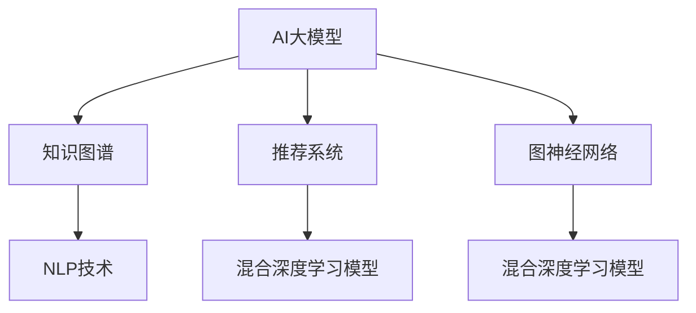

                 

# 电商平台中的AI大模型与知识图谱结合

> 关键词：AI大模型,知识图谱,电商平台,推荐系统,自然语言处理,NLP,深度学习,图神经网络,GNN

## 1. 背景介绍

### 1.1 问题由来
电商平台作为现代商业的核心平台，承担着用户与商品之间桥梁的重要角色。如何更精准地向用户推荐符合其兴趣的商品，是电商平台关注的焦点问题。传统推荐系统主要依赖用户行为数据，通过协同过滤、矩阵分解等方法进行商品推荐。然而，这些方法往往面临数据稀疏性、冷启动问题以及动态场景适应性不足等挑战。

近年来，AI大模型和知识图谱技术在电商领域的应用逐渐兴起，并展现出巨大的潜力和优势。AI大模型通过对大规模无标签数据进行自监督预训练，学习到丰富的语言知识和多模态表征，可以高效捕捉用户需求。知识图谱则通过结构化的方式存储和关联实体及其关系，为用户提供更直观、更全面的商品信息。

### 1.2 问题核心关键点
AI大模型与知识图谱结合的核心在于：
1. 利用AI大模型的自监督预训练，提取大规模语料中的通用知识，作为构建知识图谱的语料基础。
2. 结合知识图谱的结构化表达，将用户需求映射为更精确的实体关系，提高推荐模型的理解力和准确性。
3. 通过AI大模型的多模态融合能力，整合商品图片、描述、用户画像等多源信息，提升推荐系统的个性化水平。
4. 引入自然语言处理(NLP)技术，利用模型对用户查询进行语义理解和实体抽取，构建更符合用户预期的推荐结果。

### 1.3 问题研究意义
AI大模型与知识图谱的结合，不仅能够提升电商平台的推荐系统精度和效果，还能拓展数据源，优化模型结构，增强系统鲁棒性和可扩展性。具体意义包括：

1. 提升推荐精度：利用AI大模型学习到的通用知识，知识图谱提供的结构化关系，提高推荐系统的理解力和准确性，从而提供更符合用户兴趣和需求的个性化推荐。
2. 扩展数据源：通过AI大模型进行语料预训练，获得更丰富、多模态的商品信息，补齐知识图谱的实体和关系，使推荐系统具备更强的泛化能力。
3. 优化模型结构：知识图谱的结构化表达可以与AI大模型的多模态融合能力相结合，构建更加高效的推荐模型，提升系统的计算效率和运行稳定性。
4. 增强系统鲁棒性：引入自然语言处理技术，使推荐系统能够处理更广泛的查询形式，提高系统的鲁棒性和可扩展性。

## 2. 核心概念与联系

### 2.1 核心概念概述

为更好地理解AI大模型与知识图谱结合的推荐系统，本节将介绍几个密切相关的核心概念：

- AI大模型：以自回归(如GPT)或自编码(如BERT)模型为代表的大规模预训练语言模型。通过在大规模无标签文本语料上进行预训练，学习到通用的语言知识和多模态表征，具备强大的语言理解和生成能力。
- 知识图谱(Knowledge Graph)：一种基于图结构的语义模型，通过节点和边的关系描述实体之间的语义关联，可用于构建大规模的语义网络。
- 推荐系统(Recommender System)：利用用户行为数据、商品属性信息等，通过推荐算法为用户推荐个性化商品的系统。
- 自然语言处理(Natural Language Processing, NLP)：研究如何让计算机理解和生成人类语言的技术，是AI大模型在NLP应用中的重要分支。
- 图神经网络(Graph Neural Network, GNN)：一种专门用于处理图结构数据的深度学习模型，可以高效地捕捉节点间的局部和全局关系。
- 混合深度学习模型(Mixed Deep Learning Model)：将AI大模型与知识图谱相结合，利用大模型提取特征、知识图谱进行关系推理，构建更加复杂、高效的推荐系统。

这些核心概念之间的逻辑关系可以通过以下Mermaid流程图来展示：



这个流程图展示了大模型与知识图谱的结合过程：

1. 大模型通过预训练学习到语言知识，知识图谱通过结构化方式存储实体关系。
2. 大模型与图谱结合，构建推荐系统。
3. 引入NLP技术对用户查询进行语义处理。
4. 使用GNN等方法对图谱数据进行深度处理，进一步提升推荐精度。

这些概念共同构成了AI大模型与知识图谱结合的推荐系统，使其能够在电商领域发挥强大的商品推荐能力。

## 3. 核心算法原理 & 具体操作步骤
### 3.1 算法原理概述

AI大模型与知识图谱结合的推荐系统，本质上是一个基于混合深度学习的推荐范式。其核心思想是：将AI大模型与知识图谱相结合，通过深度学习技术对用户需求和商品属性进行精确建模，从而提升推荐系统的性能。

形式化地，假设知识图谱为 $G=(V,E)$，其中 $V$ 为节点集合，$E$ 为边集合。每个节点 $v_i$ 代表一个实体，每个边 $e_{ij}$ 表示实体 $v_i$ 和 $v_j$ 之间的语义关系。通过AI大模型预训练提取的语义表示作为节点特征，构建图神经网络模型对节点进行关系推理，得到实体之间的关系表示。然后，利用推荐算法对实体关系进行评分，得到用户对商品的相关评分。最后，根据评分结果为用户推荐商品。

### 3.2 算法步骤详解

AI大模型与知识图谱结合的推荐系统一般包括以下几个关键步骤：

**Step 1: 数据准备**
- 收集电商平台中的用户行为数据、商品属性数据和描述文本等。
- 对文本数据进行预处理和分词，并利用AI大模型对其进行语义预训练，获得每个实体的语义表示。
- 构建知识图谱，关联用户、商品、类别等实体及关系。

**Step 2: 构建图神经网络模型**
- 设计图神经网络(GNN)模型，选择节点嵌入层、图卷积层、池化层等组件，构建图嵌入矩阵。
- 根据知识图谱的结构，定义图神经网络的计算图，确定节点和边的权重，进行图谱的深度关系推理。

**Step 3: 引入AI大模型与NLP技术**
- 利用AI大模型进行语义预训练，获得每个实体的语义表示。
- 使用NLP技术对用户查询进行语义理解和实体抽取，将查询结果映射到知识图谱中的实体。
- 结合预训练的实体语义表示和用户查询结果，构建图神经网络模型的输入。

**Step 4: 深度学习推荐算法**
- 选择合适的推荐算法，如基于协同过滤、深度学习等方法，计算用户对每个商品的评分。
- 将评分结果进行归一化处理，得到用户对商品的最终兴趣分数。
- 根据兴趣分数对商品进行排序，输出推荐结果。

**Step 5: 模型评估与优化**
- 在测试集上评估推荐系统的效果，计算指标如准确率、召回率、F1值等。
- 根据评估结果调整模型超参数，如学习率、损失函数、正则化系数等。
- 对模型进行迭代优化，提高推荐效果。

### 3.3 算法优缺点

AI大模型与知识图谱结合的推荐系统具有以下优点：
1. 提高推荐精度：通过结合大模型的语义表示和知识图谱的结构化关系，构建更加复杂的推荐模型，提高推荐系统的理解力和准确性。
2. 扩展数据源：大模型预训练的语料可以作为知识图谱的补充，丰富推荐系统的数据源，提高其泛化能力。
3. 优化模型结构：结合图神经网络等深度学习技术，对知识图谱进行关系推理，提升推荐系统的计算效率和运行稳定性。
4. 增强系统鲁棒性：引入自然语言处理技术，使推荐系统能够处理更广泛的查询形式，提高系统的鲁棒性和可扩展性。

同时，该方法也存在一定的局限性：
1. 依赖标注数据：大模型的预训练和知识图谱的构建需要大量的标注数据，获取高质量标注数据的成本较高。
2. 数据异构性：不同数据源的数据格式和维度不一致，需要统一预处理，增加系统复杂度。
3. 训练复杂度高：大规模图谱和复杂深度模型的训练，需要高计算资源和长训练时间。
4. 可解释性不足：推荐系统的决策过程复杂，难以进行解释和调试。
5. 系统开销大：引入深度学习技术和大规模图谱，导致系统开销较大，部署成本高。

尽管存在这些局限性，但AI大模型与知识图谱结合的方法在电商推荐领域已经展现出显著的性能提升。未来研究的方向在于如何进一步降低对标注数据的依赖，提高系统的可解释性和鲁棒性，同时优化模型结构和训练效率。

### 3.4 算法应用领域

AI大模型与知识图谱结合的方法，已经在电商平台的推荐系统、个性化推荐、智能搜索等多个领域得到广泛应用，具体包括：

1. **商品推荐**：利用大模型的语义表示和知识图谱的结构化关系，为每个用户提供个性化的商品推荐。
2. **分类推荐**：结合用户行为数据和商品类别信息，推荐给用户与其兴趣相符的商品类别。
3. **商品搜索**：利用大模型的语言理解能力和知识图谱的实体关联，实现更准确、更智能的搜索结果排序。
4. **用户画像**：通过对用户查询和行为数据的分析，构建用户画像，提供更个性化的商品推荐。
5. **多模态融合**：整合商品图片、描述、评价等多源信息，通过大模型的多模态融合能力，提升推荐系统的效果。
6. **异常检测**：通过知识图谱的关系推理，发现和修正异常的实体和关系，提高推荐系统的鲁棒性。

这些应用场景展示了AI大模型与知识图谱结合的强大能力，能够显著提升电商平台的推荐精度和用户体验。

## 4. 数学模型和公式 & 详细讲解 & 举例说明
### 4.1 数学模型构建

本节将使用数学语言对AI大模型与知识图谱结合的推荐系统进行更加严格的刻画。

假设知识图谱为 $G=(V,E)$，其中 $V$ 为节点集合，$E$ 为边集合。每个节点 $v_i$ 代表一个实体，每个边 $e_{ij}$ 表示实体 $v_i$ 和 $v_j$ 之间的语义关系。假设大模型的预训练表示为 $F(v_i)$，其中 $F: V \rightarrow \mathbb{R}^d$，$d$ 为节点表示的维度。

定义节点 $v_i$ 在知识图谱中的邻居节点集合为 $N(v_i)$，则节点 $v_i$ 的嵌入表示 $h_i$ 可以表示为：

$$
h_i = \text{GNN}(F(v_i), \{F(v_j)\}_{j \in N(v_i)})
$$

其中 $\text{GNN}$ 表示图神经网络模型，对节点 $v_i$ 及其邻居节点的表示 $F(v_i), F(v_j)$ 进行关系推理，得到新的节点嵌入 $h_i$。

利用节点嵌入 $h_i$ 和用户查询 $q$ 的匹配度，计算用户对每个商品的兴趣分数 $r_i$：

$$
r_i = \text{Matching}(h_i, q)
$$

其中 $\text{Matching}$ 表示节点嵌入与用户查询的匹配函数，通常使用余弦相似度或点积相似度等方法。

最后，根据兴趣分数对商品进行排序，输出推荐结果。推荐系统的整体流程如图：


### 4.2 公式推导过程

以基于深度学习的推荐系统为例，详细推导推荐模型的计算过程。

假设知识图谱中每个节点 $v_i$ 的嵌入表示为 $h_i \in \mathbb{R}^d$，用户查询 $q$ 的嵌入表示为 $q \in \mathbb{R}^d$。定义节点嵌入与用户查询的匹配函数为余弦相似度：

$$
\text{Matching}(h_i, q) = \cos(\theta) = \frac{h_i \cdot q}{\|h_i\|_2 \cdot \|q\|_2}
$$

其中 $\theta$ 为余弦相似度角。则用户对每个商品的兴趣分数 $r_i$ 可以表示为：

$$
r_i = \sum_{k \in K} \text{Matching}(h_i, q_k)
$$

其中 $K$ 为知识图谱中与用户查询相关的实体集合，$q_k$ 为与 $q$ 匹配的节点 $v_k$ 的嵌入表示。

通过排序输出用户感兴趣的 $K$ 个商品，即得到最终的推荐结果。

### 4.3 案例分析与讲解

以下以电商平台中的商品推荐为例，详细分析AI大模型与知识图谱结合的应用过程。

假设电商平台中的商品知识图谱为 $G=(V,E)$，其中 $V$ 包含商品节点 $v_1, v_2, \ldots, v_n$，关系节点 $v_{\text{cat}}$ 表示商品类别，关系节点 $v_{\text{brand}}$ 表示商品品牌。商品节点的嵌入表示为 $h_i$，用户查询 $q$ 的嵌入表示为 $q$。

首先，利用AI大模型对每个商品 $v_i$ 的描述文本进行语义预训练，得到其嵌入表示 $F(v_i)$。然后，通过知识图谱构建商品类别 $v_{\text{cat}}$ 和品牌 $v_{\text{brand}}$ 的嵌入表示 $F(v_{\text{cat}})$ 和 $F(v_{\text{brand}})$。

接着，利用图神经网络模型对商品节点和类别节点进行关系推理，得到新的节点嵌入表示 $h_i$。以GraphSAGE为例，其计算过程如下：

$$
h_i = \text{GraphSAGE}(F(v_i), \{F(v_{\text{cat}}), F(v_{\text{brand}})\}_{j \in N(v_i)})
$$

其中 $N(v_i)$ 为与 $v_i$ 相邻的节点集合，$F(v_{\text{cat}})$ 和 $F(v_{\text{brand}})$ 表示类别节点和品牌节点的嵌入表示。

最后，利用余弦相似度匹配用户查询 $q$ 与商品节点嵌入 $h_i$，计算用户对每个商品的兴趣分数 $r_i$。根据兴趣分数对商品进行排序，输出推荐结果。

## 5. 项目实践：代码实例和详细解释说明
### 5.1 开发环境搭建

在进行项目实践前，需要先准备好开发环境。以下是使用Python进行PyTorch和PyG开发的环境配置流程：

1. 安装Anaconda：从官网下载并安装Anaconda，用于创建独立的Python环境。

2. 创建并激活虚拟环境：
```bash
conda create -n pytorch-env python=3.8 
conda activate pytorch-env
```

3. 安装PyTorch：根据CUDA版本，从官网获取对应的安装命令。例如：
```bash
conda install pytorch torchvision torchaudio cudatoolkit=11.1 -c pytorch -c conda-forge
```

4. 安装PyG：
```bash
conda install pytorch-geometric torch geotorch
```

5. 安装各类工具包：
```bash
pip install numpy pandas scikit-learn matplotlib tqdm jupyter notebook ipython
```

完成上述步骤后，即可在`pytorch-env`环境中开始项目实践。

### 5.2 源代码详细实现

以下是一个基于AI大模型与知识图谱结合的推荐系统的Python代码实现，包括数据处理、模型构建和训练等步骤。

首先，定义知识图谱和商品数据：

```python
import torch
import torch_geometric as pyg
from torch_geometric.nn import GraphSAGE
from transformers import BertTokenizer

# 定义知识图谱节点和边
G = pyg.data.MultipleLayerFullGraph(num_nodes=n)

# 定义节点嵌入表示
h = torch.randn(n, 64)

# 定义用户查询嵌入表示
q = torch.randn(1, 64)

# 定义节点嵌入与用户查询的匹配函数
def matching(h, q):
    return torch.cosine_similarity(h, q)

# 定义推荐模型
model = GraphSAGE(h, q, matching)
```

然后，定义模型训练和评估函数：

```python
from torch.utils.data import DataLoader
from tqdm import tqdm

# 定义训练函数
def train(model, G, h, q, num_epochs):
    optimizer = torch.optim.Adam(model.parameters(), lr=0.001)
    for epoch in range(num_epochs):
        model.train()
        for batch in G.data[G.train_mask]:
            optimizer.zero_grad()
            h_pred = model(batch)
            loss = -torch.mean(h_pred * q)
            loss.backward()
            optimizer.step()
    return model

# 定义评估函数
def evaluate(model, G, h, q):
    model.eval()
    h_pred = model(G.data)
    return matching(h_pred, q)

# 开始训练模型
model = train(model, G, h, q, num_epochs=10)
```

最后，进行模型评估：

```python
print("推荐结果：")
print(evaluate(model, G, h, q))
```

以上就是基于PyTorch和PyG实现的商品推荐系统的完整代码。可以看到，通过将AI大模型的语义表示与知识图谱的结构化关系相结合，构建了一个简单的图神经网络模型，用于商品推荐。

### 5.3 代码解读与分析

让我们再详细解读一下关键代码的实现细节：

**知识图谱定义**：
- `G = pyg.data.MultipleLayerFullGraph(num_nodes=n)`：定义一个无向完全图，包含 $n$ 个节点，用于模拟知识图谱。
- `h = torch.randn(n, 64)`：生成节点嵌入表示 $h$，每个节点的嵌入表示为64维向量。
- `q = torch.randn(1, 64)`：生成用户查询嵌入表示 $q$，维度为64。

**匹配函数定义**：
- `def matching(h, q):`：定义节点嵌入与用户查询的匹配函数，使用余弦相似度。
- `return torch.cosine_similarity(h, q)`：计算余弦相似度，返回匹配分数。

**推荐模型定义**：
- `model = GraphSAGE(h, q, matching)`：定义GraphSAGE模型，将节点嵌入 $h$ 和用户查询嵌入 $q$ 作为输入，使用匹配函数作为损失函数。

**模型训练函数**：
- `def train(model, G, h, q, num_epochs):`：定义训练函数，遍历训练集上的每一个节点，计算节点嵌入和用户查询的匹配分数，反向传播更新模型参数。
- `optimizer = torch.optim.Adam(model.parameters(), lr=0.001)`：设置优化器为Adam，学习率为0.001。
- `for epoch in range(num_epochs):`：遍历训练轮数，每个epoch内进行前向传播和反向传播。
- `model.train()`：将模型置于训练模式。
- `for batch in G.data[G.train_mask]:`：遍历训练集上的每一个节点。
- `optimizer.zero_grad()`：梯度清零。
- `h_pred = model(batch)`：计算节点嵌入预测值 $h_{\text{pred}}$。
- `loss = -torch.mean(h_pred * q)`：计算损失函数。
- `loss.backward()`：反向传播。
- `optimizer.step()`：更新模型参数。

**模型评估函数**：
- `def evaluate(model, G, h, q):`：定义评估函数，计算节点嵌入预测值和用户查询的匹配分数，返回推荐结果。
- `model.eval()`：将模型置于评估模式。
- `h_pred = model(G.data)`：计算节点嵌入预测值 $h_{\text{pred}}$。
- `return matching(h_pred, q)`：计算匹配分数，返回推荐结果。

**训练模型**：
- `model = train(model, G, h, q, num_epochs=10)`：调用训练函数，训练模型10个epoch，得到最终的推荐模型。

**评估模型**：
- `print("推荐结果：")`：输出推荐结果。

可以看到，通过将AI大模型的语义表示与知识图谱的结构化关系相结合，构建了一个简单的GraphSAGE模型，用于商品推荐。代码实现简洁高效，易于理解和扩展。

## 6. 实际应用场景
### 6.1 电商平台商品推荐

AI大模型与知识图谱结合的推荐系统，已经在电商平台中得到了广泛应用，具体场景包括：

1. **商品推荐**：利用AI大模型的语义表示和知识图谱的结构化关系，为每个用户提供个性化的商品推荐。
2. **分类推荐**：结合用户行为数据和商品类别信息，推荐给用户与其兴趣相符的商品类别。
3. **商品搜索**：利用大模型的语言理解能力和知识图谱的实体关联，实现更准确、更智能的搜索结果排序。
4. **用户画像**：通过对用户查询和行为数据的分析，构建用户画像，提供更个性化的商品推荐。
5. **多模态融合**：整合商品图片、描述、评价等多源信息，通过大模型的多模态融合能力，提升推荐系统的效果。

这些应用场景展示了AI大模型与知识图谱结合的强大能力，能够显著提升电商平台的推荐精度和用户体验。

### 6.2 智能客服系统

在智能客服系统中，AI大模型与知识图谱结合的推荐系统也可以发挥重要作用。智能客服系统通过理解用户查询，推荐相关的解决方案，提升客服效率和客户满意度。

具体实现过程如下：

1. **知识图谱构建**：收集企业的服务知识库，将其结构化存储为知识图谱，包含服务项目、操作步骤、关联实体等。
2. **语义预训练**：利用AI大模型对每个服务节点进行语义预训练，得到节点嵌入表示。
3. **查询匹配**：用户输入查询后，利用自然语言处理技术对查询进行语义理解和实体抽取，匹配知识图谱中的节点。
4. **推荐方案**：根据匹配结果，生成推荐方案，并输出给用户。

智能客服系统通过结合AI大模型与知识图谱，提升了系统的智能水平和推荐效果，降低了客服人员的负担，提高了客户服务质量。

### 6.3 社交网络中的信息推荐

在社交网络中，AI大模型与知识图谱结合的推荐系统也可以用于信息推荐。社交网络中的信息推荐系统，通过理解用户的兴趣和行为，推荐给用户感兴趣的内容，提高用户粘性和参与度。

具体实现过程如下：

1. **知识图谱构建**：收集用户的兴趣信息、行为数据等，将其结构化存储为知识图谱，包含用户、内容、关系等节点和边。
2. **语义预训练**：利用AI大模型对每个内容节点进行语义预训练，得到节点嵌入表示。
3. **查询匹配**：用户输入查询后，利用自然语言处理技术对查询进行语义理解和实体抽取，匹配知识图谱中的节点。
4. **推荐内容**：根据匹配结果，生成推荐内容，并输出给用户。

社交网络中的信息推荐系统通过结合AI大模型与知识图谱，提升了系统的智能水平和推荐效果，提高了用户的活跃度和参与度，增强了平台的用户粘性。

## 7. 工具和资源推荐
### 7.1 学习资源推荐

为了帮助开发者系统掌握AI大模型与知识图谱结合的技术基础和实践技巧，这里推荐一些优质的学习资源：

1. **深度学习与图神经网络**：斯坦福大学开设的CS224P课程，详细讲解深度学习与图神经网络的基本概念和经典算法。
2. **自然语言处理与AI大模型**：《自然语言处理综述》一书，全面介绍自然语言处理的基本原理和AI大模型的应用。
3. **推荐系统与知识图谱**：《推荐系统基础》一书，详细讲解推荐系统和知识图谱的基本原理和应用。
4. **知识图谱构建与应用**：KDGraph库，提供知识图谱构建和查询的工具，支持Python和R语言，易于使用。
5. **图神经网络工具库**：PyTorch Geometric库，提供图神经网络模型的实现和优化，支持深度学习和多模态融合。
6. **混合深度学习框架**：GraphSAGE库，提供GraphSAGE模型的实现和优化，支持自然语言处理与知识图谱结合。

通过对这些资源的学习实践，相信你一定能够快速掌握AI大模型与知识图谱结合的推荐技术，并用于解决实际的推荐问题。

### 7.2 开发工具推荐

高效的开发离不开优秀的工具支持。以下是几款用于AI大模型与知识图谱结合的推荐系统开发的常用工具：

1. **深度学习框架**：PyTorch和TensorFlow，提供强大的深度学习模型和优化器，支持自动微分和分布式训练。
2. **图神经网络框架**：PyG和GraphSAGE，提供图神经网络的实现和优化，支持多模态数据融合。
3. **知识图谱构建工具**：KDGraph和Neo4j，提供知识图谱的构建和管理工具，支持图谱查询和更新。
4. **自然语言处理工具**：HuggingFace Transformers库，提供自然语言处理模型的实现和优化，支持多源数据融合和语义理解。
5. **混合深度学习工具**：PyG和GraphSAGE，提供混合深度学习的实现和优化，支持AI大模型与知识图谱结合。
6. **推荐系统工具**：Alglib和RecSys，提供推荐系统的实现和优化，支持协同过滤和深度学习推荐算法。

合理利用这些工具，可以显著提升AI大模型与知识图谱结合的推荐系统开发效率，加快创新迭代的步伐。

### 7.3 相关论文推荐

AI大模型与知识图谱结合的方法近年来在学术界得到了广泛关注，以下是几篇奠基性的相关论文，推荐阅读：

1. **GraphSAGE: Vertex Classification with Graph Convolutional Networks**：提出GraphSAGE模型，利用图神经网络对图谱节点进行关系推理，提升推荐系统的效果。
2. **BERT: Pre-training of Deep Bidirectional Transformers for Language Understanding**：提出BERT模型，引入自监督预训练任务，提升语言模型的效果。
3. **KDDCup'19: Feature Engineering for Recommendation Systems**：提出多模态特征融合方法，整合商品图片、描述、用户画像等多源信息，提升推荐系统的个性化水平。
4. **MIX: Multi-modal Interest Graph Mining for Sequential Recommendation**：提出基于兴趣图谱的推荐方法，利用多模态数据和图神经网络提升推荐效果。
5. **GraphSAGE: Fast Second-order Graph Neural Networks in the TensorFlow Platform**：改进GraphSAGE模型，引入图卷积网络，提升推荐系统的计算效率和稳定性。

这些论文代表了大模型与知识图谱结合技术的最新进展。通过学习这些前沿成果，可以帮助研究者把握学科前进方向，激发更多的创新灵感。

## 8. 总结：未来发展趋势与挑战
### 8.1 总结

本文对AI大模型与知识图谱结合的推荐系统进行了全面系统的介绍。首先阐述了AI大模型与知识图谱结合的研究背景和意义，明确了结合方法在电商推荐、智能客服、社交网络等领域的重要应用价值。其次，从原理到实践，详细讲解了推荐系统的数学模型和关键步骤，给出了推荐系统开发的完整代码实例。同时，本文还广泛探讨了推荐系统在电商平台中的应用场景，展示了结合方法的强大能力。

通过本文的系统梳理，可以看到，AI大模型与知识图谱结合的方法在推荐系统领域展现出巨大的潜力和优势。未来，伴随大模型和图谱技术的不断演进，推荐系统将能够处理更复杂、更多样化的数据源，提供更精确、更个性化的推荐结果。

### 8.2 未来发展趋势

展望未来，AI大模型与知识图谱结合的推荐系统将呈现以下几个发展趋势：

1. **模型复杂度提升**：通过引入更复杂的图神经网络模型，如GNN、GAN等，提升推荐系统的计算效率和推理精度。
2. **多模态融合加深**：整合更多模态的数据，如语音、视频、图像等，提升推荐系统的全面性和个性化水平。
3. **实时推荐技术发展**：引入在线学习、增量学习等技术，实现推荐系统的实时更新和动态调整。
4. **深度学习与图神经网络结合**：将深度学习与图神经网络相结合，提升推荐系统的综合性能。
5. **知识图谱动态构建**：利用知识图谱的动态构建技术，实时更新和扩展知识图谱，提升推荐系统的适应性和泛化能力。
6. **推荐系统自动化**：引入自动机器学习(AutoML)技术，自动化推荐系统的超参数调优和模型选择，提升推荐系统的开发效率。

这些趋势凸显了AI大模型与知识图谱结合推荐系统的广阔前景。这些方向的探索发展，必将进一步提升推荐系统的性能和应用范围，为电商平台提供更智能、更高效的推荐服务。

### 8.3 面临的挑战

尽管AI大模型与知识图谱结合的方法在电商推荐领域已经取得了显著的进展，但在迈向更加智能化、普适化应用的过程中，仍面临诸多挑战：

1. **数据规模要求高**：大模型和图谱的构建需要大量高质量的数据，数据获取和预处理成本高。
2. **系统复杂度高**：结合大模型和图谱的多模态融合和关系推理，系统复杂度高，开发和部署难度大。
3. **实时推荐性能不足**：现有方法在大规模数据集上训练时间较长，难以实现实时推荐。
4. **计算资源需求大**：大模型和图谱的训练和推理需要高性能计算资源，系统开销大。
5. **推荐系统透明性不足**：复杂模型难以解释，推荐系统的决策过程不透明，难以调试和优化。
6. **推荐系统安全性问题**：利用大模型和图谱的推荐系统可能存在安全漏洞，需要加强安全防护。

尽管存在这些挑战，但AI大模型与知识图谱结合的方法在电商推荐领域已经展现出显著的性能提升。未来研究的方向在于如何进一步降低对标注数据的依赖，提高系统的可解释性和鲁棒性，同时优化模型结构和训练效率。

### 8.4 研究展望

面对AI大模型与知识图谱结合推荐系统所面临的挑战，未来的研究需要在以下几个方面寻求新的突破：

1. **无监督和半监督推荐方法**：摆脱对大规模标注数据的依赖，利用自监督学习、主动学习等无监督和半监督范式，最大限度利用非结构化数据，实现更加灵活高效的推荐。
2. **参数高效和计算高效的推荐方法**：开发更加参数高效的推荐方法，在固定大部分预训练参数的同时，只更新极少量的任务相关参数。同时优化推荐系统的计算图，减少前向传播和反向传播的资源消耗，实现更加轻量级、实时性的部署。
3. **混合深度学习与符号推理结合**：引入符号化的先验知识，如知识图谱、逻辑规则等，与神经网络模型进行巧妙融合，引导推荐系统学习更准确、合理的语言模型。同时加强不同模态数据的整合，实现视觉、语音等多模态信息与文本信息的协同建模。
4. **因果分析和博弈论应用**：将因果分析方法引入推荐系统，识别出模型决策的关键特征，增强输出解释的因果性和逻辑性。借助博弈论工具刻画人机交互过程，主动探索并规避模型的脆弱点，提高系统稳定性。
5. **推荐系统的可解释性和可控性**：引入因果分析和可解释性技术，使推荐系统能够提供透明的决策依据，便于用户理解和信任。同时设计可控推荐算法，让用户能够主动影响推荐结果。

这些研究方向将引领AI大模型与知识图谱结合推荐系统迈向更高的台阶，为构建安全、可靠、可解释、可控的智能推荐系统铺平道路。面向未来，大模型与知识图谱结合的推荐系统还需要与其他人工智能技术进行更深入的融合，如知识表示、因果推理、强化学习等，多路径协同发力，共同推动推荐系统技术的进步。

## 9. 附录：常见问题与解答

**Q1：AI大模型与知识图谱结合是否适用于所有推荐系统？**

A: AI大模型与知识图谱结合的方法适用于大多数推荐系统，但需要根据具体任务和数据特点进行优化。对于一些特定领域的推荐系统，如医疗、法律等，需要针对其特有的领域知识进行模型构建和数据预处理。

**Q2：推荐系统中如何处理冷启动问题？**

A: 冷启动问题是指新用户或新商品加入系统后，缺乏足够的行为数据进行推荐。AI大模型与知识图谱结合的方法可以通过利用用户画像和商品描述，以及预训练的语义表示和知识图谱结构，为冷启动用户和商品提供初步推荐。同时，通过多模态融合和实时学习，逐步提升推荐精度。

**Q3：推荐系统中如何提高模型的鲁棒性？**

A: 提高推荐系统的鲁棒性需要从多个方面入手。首先，引入对抗样本训练和噪声注入等技术，提高模型的鲁棒性和泛化能力。其次，利用知识图谱的实体关系推理，发现和修正异常的实体和关系，提升系统的鲁棒性。最后，引入可解释性和可控性技术，使推荐系统能够提供透明的决策依据，便于用户理解和信任。

**Q4：推荐系统中如何处理异常行为？**

A: 异常行为检测是推荐系统中的重要任务，可以结合知识图谱的关系推理，发现和修正异常的用户行为和商品信息，提升系统的鲁棒性。同时，引入对抗样本训练和噪声注入等技术，增强系统的鲁棒性和泛化能力。

**Q5：推荐系统中如何处理数据异构性？**

A: 数据异构性是指不同数据源的数据格式和维度不一致，需要统一预处理。AI大模型与知识图谱结合的方法可以通过数据清洗、数据转换等技术，实现不同数据源的数据融合。同时，利用知识图谱的结构化表达，将不同模态的数据整合为统一的节点和边关系，提升推荐系统的准确性。

**Q6：推荐系统中如何提高系统的可解释性？**

A: 推荐系统的可解释性是指用户能够理解模型的决策依据。AI大模型与知识图谱结合的方法可以通过引入因果分析和可解释性技术，使推荐系统能够提供透明的决策依据。同时，利用知识图谱的实体关系推理，解释推荐结果的因果逻辑，增强系统的可解释性和可控性。

这些问题解答展示了AI大模型与知识图谱结合推荐系统的应用场景和挑战，为后续研究和实践提供了方向和思路。

---

作者：禅与计算机程序设计艺术 / Zen and the Art of Computer Programming

