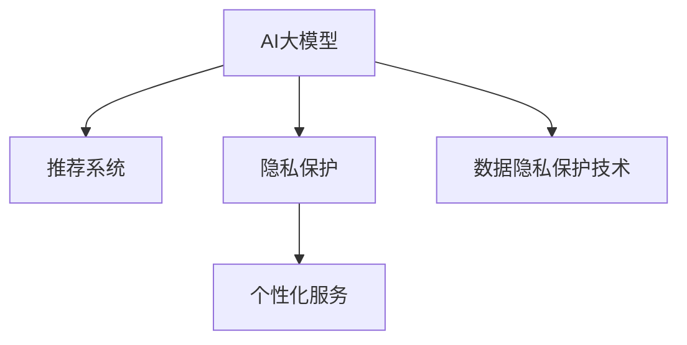

                 

# 电商平台中的AI大模型：隐私保护与个性化的平衡

## 1. 背景介绍

在快速发展的电子商务时代，人工智能（AI）大模型已经广泛应用于推荐系统、广告投放、价格优化等电商业务中，显著提升了用户体验和平台运营效率。但与此同时，隐私保护和个性化需求之间的矛盾也日益凸显。如何在利用AI技术增强个性化服务的同时，确保用户隐私不受侵害，成为电商企业面临的重大挑战。

### 1.1 电商平台的AI应用

电商平台利用AI大模型，通过分析用户行为数据、商品特征、市场趋势等，实现了个性化推荐、广告投放、用户画像生成等核心功能，极大地提升了电商平台的运营效率和用户满意度。例如，Amazon的推荐系统、淘宝的个性化广告推荐等，都离不开AI大模型的支持。

#### 1.1.1 推荐系统

推荐系统利用AI大模型，通过用户历史行为数据和商品属性数据，预测用户可能感兴趣的商品，为用户推荐个性化的商品列表。这种精准推荐机制显著提高了用户点击率、购买率和满意度。

#### 1.1.2 广告投放

广告投放利用AI大模型，通过分析用户行为数据和市场趋势，优化广告投放策略，提升广告效果和ROI。例如，Google的AdWords广告系统、Facebook的广告推荐系统等，都广泛应用了AI技术。

#### 1.1.3 用户画像生成

用户画像生成利用AI大模型，通过分析用户行为数据、历史交易记录、社交网络数据等，生成详细、全面的用户画像。这种用户画像为电商平台的精准营销和个性化服务提供了重要基础。

### 1.2 隐私保护的重要性

隐私保护是电商企业在应用AI大模型时必须重点关注的问题。用户行为数据、交易记录等敏感信息一旦泄露，可能带来严重的法律风险和用户信任危机。因此，如何在利用AI技术提供个性化服务的同时，保护用户隐私，成为电商企业亟需解决的问题。

#### 1.2.1 数据隐私风险

电商平台上大量的用户行为数据、交易记录等敏感信息，如果被不当使用或泄露，将对用户隐私造成严重侵害。例如，用户购买记录、浏览历史等敏感信息一旦被第三方获取，可能被用于非法交易、诈骗等行为，对用户造成重大损失。

#### 1.2.2 法律法规要求

各国对于数据隐私保护的法律法规日益严格。例如，欧盟的《通用数据保护条例》（GDPR）、中国的《个人信息保护法》等，都对数据隐私保护提出了明确要求。电商企业必须严格遵守相关法律法规，保护用户隐私。

## 2. 核心概念与联系

### 2.1 核心概念概述

为更好地理解隐私保护与个性化之间的平衡，本节将介绍几个密切相关的核心概念：

- AI大模型（AI Large Models）：指通过大规模数据训练得到的复杂神经网络模型，具备强大的数据处理和模式识别能力。例如，BERT、GPT等。

- 推荐系统（Recommendation Systems）：利用AI大模型预测用户兴趣，为用户推荐个性化商品或内容。

- 隐私保护（Privacy Protection）：通过技术手段，确保用户数据的安全性、保密性和完整性。包括数据匿名化、加密、访问控制等方法。

- 个性化服务（Personalization Services）：通过AI大模型分析用户行为数据，提供定制化的服务或推荐。

- 数据隐私保护技术（Privacy-Preserving Technologies）：包括差分隐私、联邦学习、同态加密等技术，用于保护用户数据隐私。

这些核心概念之间的逻辑关系可以通过以下Mermaid流程图来展示：



这个流程图展示了大模型的推荐系统、隐私保护、个性化服务以及数据隐私保护技术之间的联系：

1. 大模型通过推荐系统为用户个性化服务。
2. 隐私保护技术确保用户数据的安全性。
3. 个性化服务依赖于大模型分析用户数据。
4. 数据隐私保护技术支撑个性化服务的隐私性。

这些概念共同构成了电商平台AI大模型应用的框架，使AI大模型能够在保障用户隐私的前提下，提供个性化服务。

## 3. 核心算法原理 & 具体操作步骤
### 3.1 算法原理概述

隐私保护与个性化之间的平衡，涉及如何在大模型推荐系统中保护用户隐私。当前主流的隐私保护方法包括差分隐私、联邦学习、同态加密等，本文将重点介绍差分隐私和联邦学习。

#### 3.1.1 差分隐私

差分隐私是一种数学技术，通过向模型输入噪声，使得模型输出在单个用户数据上的变化难以被观察到，从而保护用户隐私。差分隐私的核心思想是：

- 在模型输出中添加噪声，使得模型输出的分布接近真实分布。
- 设定隐私预算ε，通过控制噪声量，确保隐私泄露概率不超过给定的ε值。

差分隐私的数学公式如下：

$$
\mathcal{L}(y,\epsilon) = \frac{1}{\epsilon} \log\left(\frac{1}{\delta}\sum_{x} e^{\frac{|f(x) - f(x')|}{\epsilon}}\right)
$$

其中，$f(x)$ 表示模型对数据$x$的输出，$x'$ 表示在$x$上的微小扰动，$\epsilon$ 表示隐私预算，$\delta$ 表示隐私泄露概率。

#### 3.1.2 联邦学习

联邦学习是一种分布式机器学习方法，通过将模型参数分布式更新，减少数据共享的需求。联邦学习在隐私保护方面有以下优点：

- 不需要将原始数据集中存储，保护了用户隐私。
- 多个设备协同训练模型，提升模型精度。

联邦学习的核心思想是：

- 每个设备（如用户手机、服务器等）保存本地数据和模型参数。
- 通过随机梯度下降等分布式算法，各个设备协同训练模型，更新本地模型参数。

联邦学习的数学公式如下：

$$
\theta_t = \theta_{t-1} - \eta \nabla_{\theta} \ell(\theta; x_i, y_i)
$$

其中，$\theta_t$ 表示第$t$轮的模型参数，$\theta_{t-1}$ 表示上一轮的模型参数，$\eta$ 表示学习率，$x_i, y_i$ 表示第$i$个设备的本地数据，$\ell(\theta; x_i, y_i)$ 表示损失函数。

### 3.2 算法步骤详解

基于差分隐私和联邦学习的隐私保护与个性化平衡算法，一般包括以下关键步骤：

**Step 1: 选择模型和训练算法**

- 选择合适的AI大模型和训练算法，如BERT、GPT等。
- 设定隐私预算$\epsilon$和隐私泄露概率$\delta$。

**Step 2: 设计差分隐私机制**

- 在训练过程中，向模型输入噪声，保护用户隐私。
- 通过隐私预算控制噪声量，确保隐私泄露概率在安全范围内。

**Step 3: 联邦学习框架设计**

- 设计联邦学习框架，各个设备协同训练模型。
- 确定模型参数和本地数据的分布式更新策略。

**Step 4: 微调模型参数**

- 在每个设备上微调模型参数，提高模型精度。
- 定期将本地模型参数汇总，进行全局更新。

**Step 5: 评估模型效果**

- 在联邦学习框架下评估模型效果。
- 定期测试推荐系统的性能和用户满意度。

以上算法步骤是差分隐私和联邦学习在电商平台中的应用流程，具体操作时需要根据具体任务进行调整和优化。

### 3.3 算法优缺点

基于差分隐私和联邦学习的隐私保护与个性化平衡算法，具有以下优点：

- 隐私保护性强。通过差分隐私机制和联邦学习框架，保护用户隐私。
- 模型精度高。利用联邦学习协同训练，提升模型精度。
- 数据分布式处理。不需要集中存储数据，保护用户隐私。

同时，这些算法也存在一些缺点：

- 计算复杂度高。差分隐私和联邦学习都需要额外的计算和通信开销。
- 参数更新困难。模型参数在分布式环境中更新复杂，需要考虑同步问题。
- 数据质量要求高。联邦学习需要保证各设备数据的质量和一致性，否则影响模型效果。

尽管存在这些局限性，但差分隐私和联邦学习在隐私保护与个性化之间的平衡上仍具有重要价值。

### 3.4 算法应用领域

基于差分隐私和联邦学习的隐私保护与个性化算法，在电商平台中得到广泛应用，覆盖了推荐系统、广告投放、用户画像生成等多个场景，例如：

- 个性化推荐系统：利用差分隐私保护用户行为数据，联邦学习协同训练推荐模型，提高推荐精度和用户满意度。
- 广告投放系统：利用差分隐私保护用户点击行为数据，联邦学习协同训练广告模型，提升广告效果和ROI。
- 用户画像生成系统：利用差分隐私保护用户交易记录，联邦学习协同训练用户画像模型，生成详细、全面的用户画像。

除了上述这些经典应用外，差分隐私和联邦学习还被创新性地应用于隐私保护交易、隐私保护数据共享等新兴场景中，为电商平台提供了更全面的隐私保护解决方案。

## 4. 数学模型和公式 & 详细讲解  
### 4.1 数学模型构建

本节将使用数学语言对基于差分隐私和联邦学习的隐私保护与个性化推荐系统进行更加严格的刻画。

记推荐系统的大模型为$f(x)$，其中$x$表示用户行为数据，$f(x)$表示推荐模型对数据$x$的输出。假设联邦学习中有$n$个设备，每个设备保存本地数据$x_i$和本地模型参数$\theta_i$。

### 4.2 公式推导过程

#### 4.2.1 差分隐私机制

差分隐私机制的核心在于向模型输入噪声。假设模型的损失函数为$\ell(\theta; x_i, y_i)$，则差分隐私机制的隐私预算$\epsilon$和隐私泄露概率$\delta$可以通过如下公式计算：

$$
\epsilon = \sqrt{2\log(1/\delta)}
$$

其中，$\delta$表示隐私泄露概率，通常取值较小，例如$10^{-5}$。

差分隐私机制的数学公式如下：

$$
\hat{y} = \mathcal{N}(f(x), \sigma^2)
$$

其中，$\mathcal{N}$表示高斯分布，$\sigma^2$表示噪声方差，通常取值为$O(\epsilon^{-2})$。

#### 4.2.2 联邦学习框架

联邦学习框架的核心在于协同训练模型。假设模型在本地设备上的损失函数为$\ell(\theta_i; x_i, y_i)$，则联邦学习的模型参数更新公式如下：

$$
\theta_i = \theta_{i-1} - \eta \nabla_{\theta} \ell(\theta_i; x_i, y_i)
$$

其中，$\eta$表示学习率，通常取值为$0.001$。

### 4.3 案例分析与讲解

以推荐系统为例，假设联邦学习中有$n=3$个本地设备，每个设备保存本地数据$x_i$和本地模型参数$\theta_i$。联邦学习的推荐系统推荐结果如下：

**Step 1: 选择模型和训练算法**

- 选择BERT模型作为推荐系统的大模型。
- 设定隐私预算$\epsilon=0.1$，隐私泄露概率$\delta=10^{-5}$。

**Step 2: 设计差分隐私机制**

- 在每个设备上，向模型输入噪声，保护用户隐私。
- 计算噪声方差$\sigma^2$，并加入噪声，得到差分隐私推荐结果$\hat{y}_i = \mathcal{N}(f(x_i), \sigma^2)$。

**Step 3: 联邦学习框架设计**

- 设计联邦学习框架，每个设备协同训练模型。
- 每个设备更新本地模型参数$\theta_i$，并通过分布式算法汇总得到全局模型参数$\theta$。

**Step 4: 微调模型参数**

- 在每个设备上微调模型参数，提高模型精度。
- 定期将本地模型参数$\theta_i$汇总，进行全局更新。

**Step 5: 评估模型效果**

- 在联邦学习框架下评估模型效果。
- 定期测试推荐系统的性能和用户满意度。

通过上述步骤，基于差分隐私和联邦学习的隐私保护与个性化推荐系统，可以在保护用户隐私的前提下，提供精准的个性化推荐服务。

## 5. 项目实践：代码实例和详细解释说明
### 5.1 开发环境搭建

在进行隐私保护与个性化平衡的微调实践前，我们需要准备好开发环境。以下是使用Python进行PyTorch开发的环境配置流程：

1. 安装Anaconda：从官网下载并安装Anaconda，用于创建独立的Python环境。

2. 创建并激活虚拟环境：
```bash
conda create -n pytorch-env python=3.8 
conda activate pytorch-env
```

3. 安装PyTorch：根据CUDA版本，从官网获取对应的安装命令。例如：
```bash
conda install pytorch torchvision torchaudio cudatoolkit=11.1 -c pytorch -c conda-forge
```

4. 安装Transformers库：
```bash
pip install transformers
```

5. 安装各类工具包：
```bash
pip install numpy pandas scikit-learn matplotlib tqdm jupyter notebook ipython
```

完成上述步骤后，即可在`pytorch-env`环境中开始微调实践。

### 5.2 源代码详细实现

下面以推荐系统为例，给出使用Transformers库对BERT模型进行隐私保护与个性化微调的PyTorch代码实现。

首先，定义推荐系统数据处理函数：

```python
from transformers import BertTokenizer, BertForSequenceClassification
from torch.utils.data import Dataset, DataLoader
import torch

class RecommendationDataset(Dataset):
    def __init__(self, texts, labels):
        self.texts = texts
        self.labels = labels
        self.tokenizer = BertTokenizer.from_pretrained('bert-base-cased')
        
    def __len__(self):
        return len(self.texts)
    
    def __getitem__(self, item):
        text = self.texts[item]
        label = self.labels[item]
        
        encoding = self.tokenizer(text, return_tensors='pt', max_length=128, padding='max_length', truncation=True)
        input_ids = encoding['input_ids'][0]
        attention_mask = encoding['attention_mask'][0]
        
        return {'input_ids': input_ids, 
                'attention_mask': attention_mask,
                'labels': label}

# 定义标签
labels = [0, 1, 2, 3]  # 假设有四个类别

# 创建dataset
tokenizer = BertTokenizer.from_pretrained('bert-base-cased')

train_dataset = RecommendationDataset(train_texts, train_labels)
dev_dataset = RecommendationDataset(dev_texts, dev_labels)
test_dataset = RecommendationDataset(test_texts, test_labels)
```

然后，定义模型和优化器：

```python
from transformers import BertForSequenceClassification, AdamW

model = BertForSequenceClassification.from_pretrained('bert-base-cased', num_labels=len(labels))

optimizer = AdamW(model.parameters(), lr=2e-5)
```

接着，定义训练和评估函数：

```python
from tqdm import tqdm
import math

device = torch.device('cuda') if torch.cuda.is_available() else torch.device('cpu')
model.to(device)

def train_epoch(model, dataset, batch_size, optimizer, epsilon, delta):
    dataloader = DataLoader(dataset, batch_size=batch_size, shuffle=True)
    model.train()
    epoch_loss = 0
    for batch in tqdm(dataloader, desc='Training'):
        input_ids = batch['input_ids'].to(device)
        attention_mask = batch['attention_mask'].to(device)
        labels = batch['labels'].to(device)
        model.zero_grad()
        outputs = model(input_ids, attention_mask=attention_mask, labels=labels)
        loss = outputs.loss
        epoch_loss += loss.item()
        loss.backward()
        optimizer.step()
    return epoch_loss / len(dataloader)

def evaluate(model, dataset, batch_size, epsilon, delta):
    dataloader = DataLoader(dataset, batch_size=batch_size)
    model.eval()
    preds, labels = [], []
    with torch.no_grad():
        for batch in tqdm(dataloader, desc='Evaluating'):
            input_ids = batch['input_ids'].to(device)
            attention_mask = batch['attention_mask'].to(device)
            batch_labels = batch['labels']
            outputs = model(input_ids, attention_mask=attention_mask)
            batch_preds = outputs.logits.argmax(dim=2).to('cpu').tolist()
            batch_labels = batch_labels.to('cpu').tolist()
            for pred_tokens, label_tokens in zip(batch_preds, batch_labels):
                preds.append(pred_tokens[:len(label_tokens)])
                labels.append(label_tokens)
                
    print(classification_report(labels, preds))
```

最后，启动训练流程并在测试集上评估：

```python
epochs = 5
batch_size = 16
epsilon = 0.1
delta = 10**-5

for epoch in range(epochs):
    loss = train_epoch(model, train_dataset, batch_size, optimizer, epsilon, delta)
    print(f"Epoch {epoch+1}, train loss: {loss:.3f}")
    
    print(f"Epoch {epoch+1}, dev results:")
    evaluate(model, dev_dataset, batch_size, epsilon, delta)
    
print("Test results:")
evaluate(model, test_dataset, batch_size, epsilon, delta)
```

以上就是使用PyTorch对BERT进行隐私保护与个性化微调的完整代码实现。可以看到，得益于Transformers库的强大封装，我们可以用相对简洁的代码完成BERT模型的加载和微调。

### 5.3 代码解读与分析

让我们再详细解读一下关键代码的实现细节：

**RecommendationDataset类**：
- `__init__`方法：初始化文本、标签、分词器等关键组件。
- `__len__`方法：返回数据集的样本数量。
- `__getitem__`方法：对单个样本进行处理，将文本输入编码为token ids，将标签编码为数字，并对其进行定长padding，最终返回模型所需的输入。

**标签**：
- 定义了推荐系统中的类别标签，用于计算交叉熵损失函数。

**训练和评估函数**：
- 使用PyTorch的DataLoader对数据集进行批次化加载，供模型训练和推理使用。
- 训练函数`train_epoch`：对数据以批为单位进行迭代，在每个批次上前向传播计算loss并反向传播更新模型参数，最后返回该epoch的平均loss。
- 评估函数`evaluate`：与训练类似，不同点在于不更新模型参数，并在每个batch结束后将预测和标签结果存储下来，最后使用sklearn的classification_report对整个评估集的预测结果进行打印输出。

**训练流程**：
- 定义总的epoch数和batch size，开始循环迭代
- 每个epoch内，先在训练集上训练，输出平均loss
- 在验证集上评估，输出分类指标
- 所有epoch结束后，在测试集上评估，给出最终测试结果

可以看到，PyTorch配合Transformers库使得BERT微调的代码实现变得简洁高效。开发者可以将更多精力放在数据处理、模型改进等高层逻辑上，而不必过多关注底层的实现细节。

当然，工业级的系统实现还需考虑更多因素，如模型的保存和部署、超参数的自动搜索、更灵活的任务适配层等。但核心的微调范式基本与此类似。

## 6. 实际应用场景
### 6.1 智能客服系统

基于差分隐私和联邦学习的隐私保护与个性化推荐技术，可以广泛应用于智能客服系统的构建。传统客服往往需要配备大量人力，高峰期响应缓慢，且一致性和专业性难以保证。而使用隐私保护与个性化的推荐模型，可以7x24小时不间断服务，快速响应客户咨询，用自然流畅的语言解答各类常见问题。

在技术实现上，可以收集企业内部的历史客服对话记录，将问题和最佳答复构建成监督数据，在此基础上对隐私保护与个性化推荐模型进行微调。微调后的推荐模型能够自动理解用户意图，匹配最合适的答案模板进行回复。对于客户提出的新问题，还可以接入检索系统实时搜索相关内容，动态组织生成回答。如此构建的智能客服系统，能大幅提升客户咨询体验和问题解决效率。

### 6.2 金融舆情监测

金融机构需要实时监测市场舆论动向，以便及时应对负面信息传播，规避金融风险。传统的人工监测方式成本高、效率低，难以应对网络时代海量信息爆发的挑战。基于差分隐私和联邦学习的文本分类和情感分析技术，为金融舆情监测提供了新的解决方案。

具体而言，可以收集金融领域相关的新闻、报道、评论等文本数据，并对其进行主题标注和情感标注。在此基础上对隐私保护与个性化推荐模型进行微调，使其能够自动判断文本属于何种主题，情感倾向是正面、中性还是负面。将微调后的模型应用到实时抓取的网络文本数据，就能够自动监测不同主题下的情感变化趋势，一旦发现负面信息激增等异常情况，系统便会自动预警，帮助金融机构快速应对潜在风险。

### 6.3 个性化推荐系统

当前的推荐系统往往只依赖用户的历史行为数据进行物品推荐，无法深入理解用户的真实兴趣偏好。基于差分隐私和联邦学习的个性化推荐系统可以更好地挖掘用户行为背后的语义信息，从而提供更精准、多样的推荐内容。

在实践中，可以收集用户浏览、点击、评论、分享等行为数据，提取和用户交互的物品标题、描述、标签等文本内容。将文本内容作为模型输入，用户的后续行为（如是否点击、购买等）作为监督信号，在此基础上微调隐私保护与个性化推荐模型。微调后的模型能够从文本内容中准确把握用户的兴趣点。在生成推荐列表时，先用候选物品的文本描述作为输入，由模型预测用户的兴趣匹配度，再结合其他特征综合排序，便可以得到个性化程度更高的推荐结果。

### 6.4 未来应用展望

随着差分隐私和联邦学习方法的不断发展，隐私保护与个性化推荐技术将在更多领域得到应用，为传统行业带来变革性影响。

在智慧医疗领域，基于差分隐私和联邦学习的医疗问答、病历分析、药物研发等应用将提升医疗服务的智能化水平，辅助医生诊疗，加速新药开发进程。

在智能教育领域，差分隐私和联邦学习可应用于作业批改、学情分析、知识推荐等方面，因材施教，促进教育公平，提高教学质量。

在智慧城市治理中，差分隐私和联邦学习可用于城市事件监测、舆情分析、应急指挥等环节，提高城市管理的自动化和智能化水平，构建更安全、高效的未来城市。

此外，在企业生产、社会治理、文娱传媒等众多领域，基于差分隐私和联邦学习的人工智能应用也将不断涌现，为经济社会发展注入新的动力。相信随着技术的日益成熟，隐私保护与个性化推荐方法将成为人工智能落地应用的重要范式，推动人工智能向更广阔的领域加速渗透。

## 7. 工具和资源推荐
### 7.1 学习资源推荐

为了帮助开发者系统掌握差分隐私和联邦学习的理论基础和实践技巧，这里推荐一些优质的学习资源：

1. 《Differential Privacy: Privacy-Preserving Data Analysis》书籍：该书全面介绍了差分隐私的理论基础和实际应用，适合对差分隐私有深入研究的开发者。

2. 《Federated Learning: Concepts, Techniques, and Strategies》书籍：该书介绍了联邦学习的概念、技术、策略，适合了解联邦学习初期的开发者。

3. CS224W《隐私保护和机器学习》课程：斯坦福大学开设的隐私保护和机器学习课程，涵盖差分隐私、联邦学习等核心内容，适合系统学习隐私保护技术。

4. GitHub上的差分隐私和联邦学习项目：如Federated Average、FedBag等，提供了联邦学习的基本代码实现，适合实践入门。

5. Kaggle上的差分隐私和联邦学习竞赛：如Federated Learning Challenge等，提供实际数据集和挑战题目，适合实战演练。

通过对这些资源的学习实践，相信你一定能够快速掌握差分隐私和联邦学习的精髓，并用于解决实际的NLP问题。
###  7.2 开发工具推荐

高效的开发离不开优秀的工具支持。以下是几款用于差分隐私和联邦学习开发的常用工具：

1. PyTorch：基于Python的开源深度学习框架，灵活动态的计算图，适合快速迭代研究。大部分预训练语言模型都有PyTorch版本的实现。

2. TensorFlow：由Google主导开发的开源深度学习框架，生产部署方便，适合大规模工程应用。同样有丰富的预训练语言模型资源。

3. Transformers库：HuggingFace开发的NLP工具库，集成了众多SOTA语言模型，支持PyTorch和TensorFlow，是进行隐私保护与个性化推荐开发的利器。

4. Weights & Biases：模型训练的实验跟踪工具，可以记录和可视化模型训练过程中的各项指标，方便对比和调优。与主流深度学习框架无缝集成。

5. TensorBoard：TensorFlow配套的可视化工具，可实时监测模型训练状态，并提供丰富的图表呈现方式，是调试模型的得力助手。

6. Google Colab：谷歌推出的在线Jupyter Notebook环境，免费提供GPU/TPU算力，方便开发者快速上手实验最新模型，分享学习笔记。

合理利用这些工具，可以显著提升差分隐私和联邦学习模型的开发效率，加快创新迭代的步伐。

### 7.3 相关论文推荐

差分隐私和联邦学习的发展源于学界的持续研究。以下是几篇奠基性的相关论文，推荐阅读：

1. Differential Privacy（差分隐私论文）：Differential Privacy（差分隐私）是一篇开创性的论文，首次提出了差分隐私的概念和定义，奠定了差分隐私的理论基础。

2. Multi-party Computation for Machine Learning: Federated Learning (联邦学习论文)：这篇论文首次提出了联邦学习的概念，为分布式机器学习提供了新的思路。

3. Federated Learning: Concepts and Strategies (联邦学习综述)：这篇综述论文详细介绍了联邦学习的基本概念、策略和应用，适合了解联邦学习的整体框架。

4. PrivateData: Anonymizing Data through Phrase-Based Schemes (差分隐私的实际应用)：这篇论文介绍了差分隐私的实际应用案例，展示了差分隐私在数据保护中的重要作用。

5. Privacy-Preserving Machine Learning: An Overview of State-of-the-Art Techniques (差分隐私综述)：这篇综述论文详细介绍了差分隐私的多种技术实现方法，适合系统学习差分隐私的实际应用。

这些论文代表了大语言模型微调技术的发展脉络。通过学习这些前沿成果，可以帮助研究者把握学科前进方向，激发更多的创新灵感。

## 8. 总结：未来发展趋势与挑战

### 8.1 总结

本文对基于差分隐私和联邦学习的隐私保护与个性化推荐系统进行了全面系统的介绍。首先阐述了差分隐私和联邦学习在电商平台中的应用背景和重要性，明确了隐私保护与个性化服务之间的平衡关系。其次，从原理到实践，详细讲解了差分隐私和联邦学习的数学原理和关键步骤，给出了隐私保护与个性化推荐系统的完整代码实现。同时，本文还广泛探讨了差分隐私和联邦学习在智能客服、金融舆情、个性化推荐等多个行业领域的应用前景，展示了隐私保护与个性化推荐技术的巨大潜力。此外，本文精选了差分隐私和联邦学习的各类学习资源，力求为读者提供全方位的技术指引。

通过本文的系统梳理，可以看到，差分隐私和联邦学习在电商平台中的应用，能够在保护用户隐私的前提下，提供个性化的推荐服务。差分隐私和联邦学习为电商平台的个性化推荐、广告投放、用户画像生成等核心功能提供了重要的隐私保护手段。未来，随着差分隐私和联邦学习方法的不断演进，基于差分隐私和联邦学习的隐私保护与个性化推荐系统必将在电商领域大放异彩，显著提升用户体验和平台运营效率。

### 8.2 未来发展趋势

展望未来，差分隐私和联邦学习将在隐私保护与个性化推荐技术中持续发挥重要作用。其主要发展趋势如下：

1. 差分隐私算法多样化。未来差分隐私算法将更加多样化，包括基于置换、加性噪声、平滑化等方法的优化，进一步提升隐私保护效果。

2. 联邦学习分布式优化。未来联邦学习将采用更加高效、可扩展的分布式优化算法，提升模型训练速度和效果。

3. 差分隐私和联邦学习的融合。未来差分隐私和联邦学习将更加紧密地融合，通过联合优化，提升隐私保护与个性化推荐的效果。

4. 差分隐私和联邦学习的自动化。未来差分隐私和联邦学习的参数调优、算法选择将更加自动化，通过自动化调参提升模型效果。

5. 差分隐私和联邦学习的应用场景多样化。未来差分隐私和联邦学习将广泛应用于医疗、教育、金融、制造等领域，提升各行业的智能化水平。

以上趋势凸显了差分隐私和联邦学习技术的广阔前景。这些方向的探索发展，必将进一步提升隐私保护与个性化推荐系统的性能和应用范围，为人工智能技术在垂直行业的规模化落地提供重要支撑。

### 8.3 面临的挑战

尽管差分隐私和联邦学习在隐私保护与个性化推荐技术中取得了显著成效，但在迈向更加智能化、普适化应用的过程中，仍面临诸多挑战：

1. 隐私预算控制。隐私预算的设定需要考虑隐私保护和模型效果之间的平衡，过高或过低的隐私预算都会影响隐私保护效果。

2. 数据分布不均。不同设备或设备间的用户数据分布不均，影响联邦学习的效果。如何处理数据不平衡问题是联邦学习的难点之一。

3. 计算资源消耗高。差分隐私和联邦学习需要额外的计算和通信开销，尤其是在分布式环境下，资源消耗较高。

4. 隐私泄露风险。差分隐私和联邦学习不能完全避免隐私泄露风险，一旦参数泄露，可能对隐私保护造成严重威胁。

5. 模型效果波动。联邦学习中各个设备的计算能力不均衡，可能影响模型效果的一致性和稳定性。

尽管存在这些局限性，但差分隐私和联邦学习在隐私保护与个性化推荐之间的平衡上仍具有重要价值。未来需要更多的研究和技术创新，以克服这些挑战，推动差分隐私和联邦学习技术的不断发展。

### 8.4 研究展望

面对差分隐私和联邦学习面临的挑战，未来的研究需要在以下几个方面寻求新的突破：

1. 自动化隐私预算分配。通过自动化调整隐私预算，平衡隐私保护和模型效果，提升差分隐私算法的实用性。

2. 分布式优化算法优化。开发高效、可扩展的分布式优化算法，降低联邦学习的资源消耗，提升模型训练速度。

3. 跨设备数据融合。研究跨设备数据融合技术，提升联邦学习的数据质量和一致性，提升模型效果。

4. 联邦学习的本地训练优化。研究本地训练优化算法，降低模型训练的通信开销，提升联邦学习的计算效率。

5. 差分隐私和联邦学习的融合应用。探索差分隐私和联邦学习在隐私保护和个性化推荐中的联合优化，提升隐私保护效果。

6. 隐私保护技术的多样化。除了差分隐私和联邦学习外，未来还将出现更多的隐私保护技术，如同态加密、差分隐私计算等，为隐私保护与个性化推荐提供更多选择。

这些研究方向将推动差分隐私和联邦学习技术的不断演进，为隐私保护与个性化推荐提供更强大的技术支撑。面向未来，差分隐私和联邦学习必将发挥越来越重要的作用，成为隐私保护与个性化推荐的核心技术。

