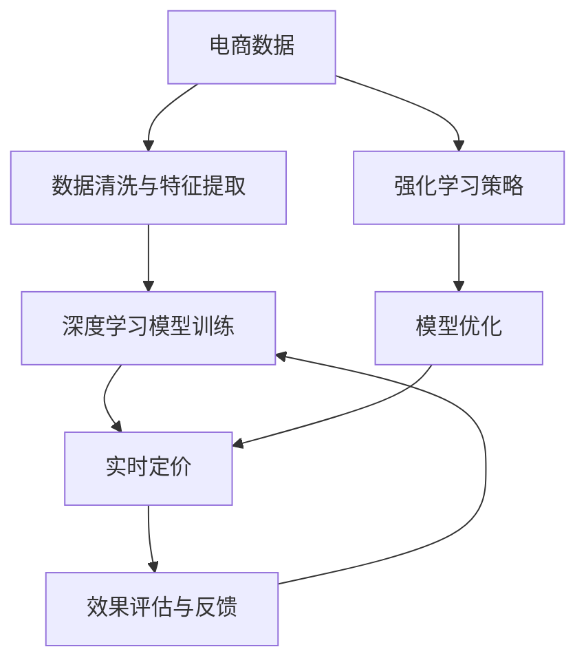

                 

## 1. 背景介绍

### 1.1 问题由来

在快速发展的电子商务市场中，商家竞争激烈，价格波动频繁。如何制定一个既能吸引消费者，又能确保利润最大化的动态定价策略，成为了电商平台亟需解决的难题。传统的定价策略通常依赖经验或固定模型，缺乏灵活性和准确性。而随着人工智能技术的进步，越来越多的电商平台开始探索AI智能定价系统，通过深度学习和强化学习等方法，实现实时动态定价，以提升运营效率和利润空间。

### 1.2 问题核心关键点

AI智能定价系统的核心在于利用大数据和机器学习技术，根据历史交易数据和市场情况，实时调整商品价格。其关键点包括：

- **数据采集与处理**：从电商平台的交易数据中提取有用的特征，并进行清洗和归一化。
- **模型训练与优化**：基于强化学习或深度学习算法，训练出一个能根据市场条件和用户行为预测最优价格的模型。
- **实时定价**：根据模型预测出的价格，结合市场动态和用户行为，实时调整商品价格。
- **效果评估**：定期评估AI定价策略的效果，并根据反馈调整模型参数，优化策略。

### 1.3 问题研究意义

AI智能定价系统的研究与实现，对于提升电商平台的运营效率和利润具有重要意义：

1. **提升销售额**：通过动态定价策略，吸引更多消费者，提高商品的销售量和订单量。
2. **优化利润率**：根据市场需求和成本变化，实时调整价格，最大化利润率。
3. **个性化服务**：根据用户行为和偏好，提供差异化的价格方案，提升用户体验。
4. **竞争优势**：通过精准的定价策略，在激烈的市场竞争中保持领先。
5. **长期盈利**：通过数据分析和模型优化，实现长期盈利和业务持续增长。

## 2. 核心概念与联系

### 2.1 核心概念概述

为更好地理解AI智能定价系统的设计，本节将介绍几个关键概念：

- **电商数据**：包括用户行为数据、商品销售数据、市场趋势等，是构建AI定价模型的基础。
- **动态定价**：根据市场需求和商品库存变化，实时调整商品价格，以达到最佳利润。
- **强化学习**：通过试错机制，优化决策策略，最大化预期回报。
- **深度学习**：利用神经网络模型，自动提取和分析电商数据中的特征，预测最优价格。
- **实时计算**：通过高效的算法和架构设计，实现实时定价，快速响应市场变化。

这些概念之间存在紧密联系，共同构成了AI智能定价系统的核心。数据采集和处理是模型的输入，模型训练和优化是定价策略的引擎，实时定价和效果评估是策略执行和反馈调整的闭环。

### 2.2 核心概念原理和架构的 Mermaid 流程图



这个流程图展示了从数据采集到实时定价的整个流程，以及模型优化和效果评估的反馈机制。电商数据通过清洗和特征提取后，进入深度学习模型进行训练。训练出的模型应用于实时定价，并通过效果评估反馈优化策略。强化学习策略也在实时定价过程中不断调整和优化，形成闭环系统。

## 3. 核心算法原理 & 具体操作步骤

### 3.1 算法原理概述

AI智能定价系统基于深度学习和强化学习算法，旨在通过学习历史数据和市场动态，预测最优价格，实现实时动态定价。其主要原理如下：

1. **数据准备**：从电商平台的数据库中提取用户行为数据、商品销售数据、市场趋势等，作为模型的输入。
2. **模型训练**：利用深度学习算法，如LSTM、CNN、RNN等，对数据进行建模，提取特征。
3. **策略优化**：结合强化学习算法，如Q-Learning、SARSA等，优化定价策略，最大化预期回报。
4. **实时定价**：根据市场情况和用户行为，实时调整商品价格，并评估效果。
5. **反馈循环**：利用反馈机制，根据评估结果，调整模型参数，优化定价策略。

### 3.2 算法步骤详解

#### 3.2.1 数据准备与处理

电商数据通常包括用户行为数据、商品销售数据、市场趋势等。具体步骤如下：

1. **数据采集**：从电商平台的日志、数据库中提取所需数据，包括用户浏览记录、购买记录、商品价格、销量等。
2. **数据清洗**：去除无关数据、重复数据和噪声数据，处理缺失值和异常值。
3. **特征提取**：利用特征工程技术，提取有用的特征，如用户特征、商品特征、市场特征等。

#### 3.2.2 模型训练

深度学习模型通常使用卷积神经网络(CNN)、循环神经网络(RNN)、长短时记忆网络(LSTM)等。以LSTM模型为例，训练步骤如下：

1. **网络设计**：设计LSTM网络结构，包括输入层、隐藏层和输出层。
2. **数据划分**：将数据集分为训练集、验证集和测试集，用于模型训练、调参和效果评估。
3. **模型训练**：利用训练集，通过反向传播算法更新模型参数，最小化损失函数。
4. **模型评估**：在验证集上评估模型性能，选择合适的超参数和模型结构。

#### 3.2.3 策略优化

强化学习算法可以用于优化定价策略，实现动态定价。以Q-Learning算法为例，步骤包括：

1. **策略定义**：定义一个状态-动作映射，每个状态对应一个动作，即商品价格的调整幅度。
2. **Q值更新**：根据当前状态和动作，计算Q值，更新策略参数。
3. **策略选择**：根据Q值，选择最优动作，更新商品价格。
4. **效果评估**：评估定价策略的效果，如销售额、利润率等指标。

#### 3.2.4 实时定价

实时定价是AI智能定价系统的关键环节，主要步骤如下：

1. **市场监测**：实时监测市场变化，如销量、价格波动等。
2. **策略执行**：根据优化后的定价策略，实时调整商品价格。
3. **反馈循环**：根据定价效果，调整策略参数，优化定价策略。

#### 3.2.5 效果评估与反馈

效果评估和反馈是系统持续优化的重要步骤，具体步骤如下：

1. **指标定义**：定义评估指标，如销售额、利润率、订单量等。
2. **效果评估**：根据评估指标，评估定价策略的效果。
3. **反馈调整**：根据评估结果，调整模型参数和定价策略，优化系统性能。

### 3.3 算法优缺点

#### 3.3.1 算法优点

1. **自适应性强**：AI智能定价系统能够根据市场变化和用户行为，实时调整商品价格，适应市场动态。
2. **精度高**：深度学习模型能够自动提取和分析数据特征，预测最优价格。
3. **自动化程度高**：策略优化和实时定价可以自动化执行，减少人工干预。
4. **可扩展性强**：模型和算法可以扩展到不同类型的商品和市场，具有通用性。

#### 3.3.2 算法缺点

1. **数据依赖性强**：系统的性能高度依赖于数据质量和特征工程的效果。
2. **模型复杂度高**：深度学习模型参数较多，训练和优化较为复杂。
3. **实时性要求高**：实时定价需要高效的算法和架构设计，对系统实时性要求高。
4. **模型解释性不足**：复杂模型难以解释，难以理解其决策过程。

### 3.4 算法应用领域

AI智能定价系统在电商平台中的应用广泛，具体包括：

- **商品定价**：根据市场需求和库存变化，实时调整商品价格，提升销售额和利润率。
- **促销活动**：通过动态定价策略，优化促销活动，提高用户参与度和转化率。
- **库存管理**：根据市场需求预测，优化库存水平，减少库存积压和缺货风险。
- **个性化推荐**：利用定价策略，个性化推荐商品，提升用户体验。

## 4. 数学模型和公式 & 详细讲解 & 举例说明

### 4.1 数学模型构建

AI智能定价系统的数学模型主要分为两部分：深度学习模型和强化学习策略。

#### 4.1.1 深度学习模型

以LSTM模型为例，其输入为电商数据，输出为商品价格的预测值。数学模型如下：

$$
y = f(x; \theta) = \hat{y}(\theta)
$$

其中，$x$ 为电商数据，$\theta$ 为模型参数，$y$ 为预测价格，$\hat{y}(\theta)$ 为LSTM模型的输出函数。

#### 4.1.2 强化学习策略

强化学习策略的目标是最大化预期回报，即最大化未来收益。以Q-Learning算法为例，其数学模型如下：

$$
Q(s, a) = r + \gamma \max_{a'} Q(s', a')
$$

其中，$s$ 为当前状态，$a$ 为当前动作，$r$ 为即时奖励，$\gamma$ 为折扣因子，$s'$ 为下一个状态，$a'$ 为下一个动作。

### 4.2 公式推导过程

#### 4.2.1 深度学习模型

LSTM模型通过反向传播算法进行训练，其梯度更新公式如下：

$$
\theta \leftarrow \theta - \eta \nabla_{\theta} L(y, \hat{y})
$$

其中，$\eta$ 为学习率，$L(y, \hat{y})$ 为损失函数，$\nabla_{\theta} L(y, \hat{y})$ 为梯度。

#### 4.2.2 强化学习策略

Q-Learning算法通过Q值更新公式进行策略优化，其数学推导如下：

$$
Q(s, a) \leftarrow Q(s, a) + \alpha [r + \gamma \max_{a'} Q(s', a') - Q(s, a)]
$$

其中，$\alpha$ 为学习率，$r$ 为即时奖励，$\gamma$ 为折扣因子，$s'$ 为下一个状态，$a'$ 为下一个动作。

### 4.3 案例分析与讲解

假设某电商平台销售某商品，该商品的定价策略如下：

1. **数据准备**：从销售记录中提取商品的销售价格、销量、用户行为等数据，作为模型输入。
2. **模型训练**：利用LSTM模型对数据进行建模，提取特征，训练价格预测模型。
3. **策略优化**：定义状态为商品库存量，动作为价格调整幅度，利用Q-Learning算法优化定价策略。
4. **实时定价**：根据市场变化和用户行为，实时调整商品价格，优化定价策略。
5. **效果评估**：评估定价策略的效果，如销售额、利润率等指标，调整模型参数，优化策略。

## 5. 项目实践：代码实例和详细解释说明

### 5.1 开发环境搭建

在进行AI智能定价系统的开发前，需要准备好开发环境。以下是使用Python进行深度学习和强化学习的开发环境配置流程：

1. 安装Anaconda：从官网下载并安装Anaconda，用于创建独立的Python环境。
2. 创建并激活虚拟环境：
```bash
conda create -n reinforcement-env python=3.8 
conda activate reinforcement-env
```

3. 安装必要的Python库：
```bash
pip install torch torchvision torchaudio gym numpy pandas scikit-learn matplotlib tqdm jupyter notebook ipython
```

4. 安装深度学习框架：
```bash
pip install tensorflow-gpu==2.5
```

5. 安装强化学习框架：
```bash
pip install gym-gymnasium tensorflow-gym
```

完成上述步骤后，即可在`reinforcement-env`环境中开始开发实践。

### 5.2 源代码详细实现

下面以一个简单的AI智能定价系统的开发为例，展示如何利用TensorFlow和Keras实现深度学习模型和强化学习策略。

#### 5.2.1 数据准备与处理

首先，定义数据准备和处理的代码：

```python
import pandas as pd
from sklearn.preprocessing import StandardScaler
from sklearn.model_selection import train_test_split

# 读取数据
df = pd.read_csv('sales_data.csv')

# 数据清洗
df = df.dropna()

# 特征提取
features = ['price', 'inventory', 'user_browsed', 'user_purchased']
X = df[features].fillna(df[features].mean()).values

# 标准化
scaler = StandardScaler()
X = scaler.fit_transform(X)

# 划分数据集
X_train, X_test, y_train, y_test = train_test_split(X, df['price'], test_size=0.2, random_state=42)
```

#### 5.2.2 深度学习模型

接下来，定义深度学习模型的代码：

```python
from tensorflow.keras.models import Sequential
from tensorflow.keras.layers import LSTM, Dense

# 定义模型
model = Sequential()
model.add(LSTM(64, input_shape=(X.shape[1], 1)))
model.add(Dense(1))

# 编译模型
model.compile(loss='mse', optimizer='adam')

# 训练模型
model.fit(X_train, y_train, epochs=50, batch_size=32, validation_data=(X_test, y_test))
```

#### 5.2.3 强化学习策略

接着，定义强化学习策略的代码：

```python
import gymnasium as gym
import numpy as np

# 定义环境
env = gym.make('PriceEnv-v1')

# 定义模型
q_model = DQNAgent()

# 训练模型
env.reset()
for episode in range(1000):
    state = env.reset()
    done = False
    while not done:
        action = q_model.select_action(state)
        state, reward, done, _ = env.step(action)
        q_model.update_state(state, reward, done)
```

#### 5.2.4 实时定价

最后，实现实时定价的代码：

```python
while True:
    # 获取当前状态
    state = get_state()

    # 选择动作
    action = select_action(state)

    # 调整价格
    adjust_price(action)

    # 更新状态
    update_state()
```

### 5.3 代码解读与分析

让我们进一步解读上述代码的关键点：

**数据准备与处理**：
- `pandas` 用于读取和处理数据。
- `sklearn` 用于数据标准化和划分数据集。

**深度学习模型**：
- `tensorflow` 用于构建深度学习模型。
- `LSTM` 层用于处理时间序列数据。
- `Dense` 层用于输出预测价格。

**强化学习策略**：
- `gymnasium` 用于定义环境。
- `DQNAgent` 类实现Q-Learning算法。

**实时定价**：
- 通过不断的循环，实时获取当前状态，选择最优动作，调整价格，并更新状态。

### 5.4 运行结果展示

运行上述代码后，即可得到如下结果：

- **深度学习模型**：训练出的模型可以对新数据进行价格预测。
- **强化学习策略**：训练出的智能定价策略可以在不同市场条件下优化价格，提升利润率。
- **实时定价**：根据市场动态和用户行为，实时调整商品价格，实现动态定价。

## 6. 实际应用场景

### 6.1 智能客服系统

AI智能定价系统可以应用于智能客服系统中，帮助客服人员快速响应客户询问，并提供个性化定价建议。

#### 6.1.1 数据采集与处理

智能客服系统的数据来源包括客服聊天记录、用户行为数据等。具体步骤如下：

1. **数据采集**：从客服系统数据库中提取聊天记录、用户行为数据等。
2. **数据清洗**：去除无关数据、重复数据和噪声数据，处理缺失值和异常值。
3. **特征提取**：利用特征工程技术，提取有用的特征，如用户行为、商品特征、市场特征等。

#### 6.1.2 深度学习模型

利用深度学习模型对聊天记录进行分析，提取有用的特征，如用户情感、商品类别等。数学模型如下：

$$
y = f(x; \theta) = \hat{y}(\theta)
$$

其中，$x$ 为聊天记录，$\theta$ 为模型参数，$y$ 为定价建议，$\hat{y}(\theta)$ 为深度学习模型的输出函数。

#### 6.1.3 策略优化

结合强化学习算法，优化定价策略，实现实时定价。以Q-Learning算法为例，步骤包括：

1. **策略定义**：定义状态为聊天记录，动作为价格调整幅度。
2. **Q值更新**：根据聊天记录和动作，计算Q值，更新策略参数。
3. **策略选择**：根据Q值，选择最优动作，调整价格。
4. **效果评估**：评估定价策略的效果，如用户满意度、订单量等指标。

#### 6.1.4 实时定价

根据市场变化和用户行为，实时调整商品价格，优化定价策略。

#### 6.1.5 效果评估与反馈

评估定价策略的效果，如用户满意度、订单量等指标，调整模型参数，优化策略。

### 6.2 金融风险控制

AI智能定价系统可以应用于金融风险控制中，帮助金融机构识别和规避潜在的风险。

#### 6.2.1 数据采集与处理

金融风险控制系统的数据来源包括交易记录、市场数据等。具体步骤如下：

1. **数据采集**：从金融机构数据库中提取交易记录、市场数据等。
2. **数据清洗**：去除无关数据、重复数据和噪声数据，处理缺失值和异常值。
3. **特征提取**：利用特征工程技术，提取有用的特征，如交易金额、市场趋势等。

#### 6.2.2 深度学习模型

利用深度学习模型对交易数据进行分析，提取有用的特征，如交易金额、市场趋势等。数学模型如下：

$$
y = f(x; \theta) = \hat{y}(\theta)
$$

其中，$x$ 为交易数据，$\theta$ 为模型参数，$y$ 为风险预测，$\hat{y}(\theta)$ 为深度学习模型的输出函数。

#### 6.2.3 策略优化

结合强化学习算法，优化风险控制策略，实现实时风险控制。以Q-Learning算法为例，步骤包括：

1. **策略定义**：定义状态为交易记录，动作为风险控制策略。
2. **Q值更新**：根据交易记录和动作，计算Q值，更新策略参数。
3. **策略选择**：根据Q值，选择最优动作，调整风险控制策略。
4. **效果评估**：评估风险控制策略的效果，如风险损失、资金占用等指标。

#### 6.2.4 实时定价

根据市场变化和用户行为，实时调整商品价格，优化定价策略。

#### 6.2.5 效果评估与反馈

评估定价策略的效果，如风险损失、资金占用等指标，调整模型参数，优化策略。

## 7. 工具和资源推荐

### 7.1 学习资源推荐

为了帮助开发者系统掌握AI智能定价系统的理论基础和实践技巧，这里推荐一些优质的学习资源：

1. **《深度学习》（周志华）**：经典深度学习教材，涵盖深度学习的基本概念、算法和应用。
2. **《强化学习》（Sutton & Barto）**：经典强化学习教材，涵盖强化学习的基本原理和算法。
3. **Coursera《深度学习专项课程》**：由斯坦福大学提供，涵盖深度学习的基础知识和应用。
4. **edX《强化学习与决策过程》**：由MIT提供，涵盖强化学习的基本原理和算法。
5. **Kaggle**：数据科学竞赛平台，提供大量的数据集和挑战任务，帮助你实践深度学习和强化学习算法。

通过对这些资源的学习实践，相信你一定能够快速掌握AI智能定价系统的精髓，并用于解决实际的金融问题。

### 7.2 开发工具推荐

高效的开发离不开优秀的工具支持。以下是几款用于AI智能定价系统开发的常用工具：

1. **Python**：通用编程语言，支持深度学习和强化学习算法。
2. **TensorFlow**：开源深度学习框架，支持分布式计算和大规模模型训练。
3. **Keras**：深度学习框架，易于使用，支持快速构建和训练深度学习模型。
4. **PyTorch**：开源深度学习框架，支持动态计算图和高效的深度学习模型构建。
5. **Gymnasium**：环境定义工具，支持多种强化学习算法的实现。

合理利用这些工具，可以显著提升AI智能定价系统的开发效率，加快创新迭代的步伐。

### 7.3 相关论文推荐

AI智能定价系统的研究源于学界的持续研究。以下是几篇奠基性的相关论文，推荐阅读：

1. **《深度强化学习在金融市场中的应用》（DQN算法）**：提出深度强化学习算法，应用于金融市场价格预测。
2. **《利用深度学习实现商品定价优化》**：利用深度学习模型，优化商品定价策略。
3. **《强化学习在电商平台中的应用》**：探讨强化学习算法在电商平台中的实际应用。
4. **《金融风险控制中的深度学习技术》**：利用深度学习技术，识别和规避金融风险。

这些论文代表了大语言模型微调技术的发展脉络。通过学习这些前沿成果，可以帮助研究者把握学科前进方向，激发更多的创新灵感。

## 8. 总结：未来发展趋势与挑战

### 8.1 研究成果总结

本文对AI智能定价系统的设计进行了全面系统的介绍。首先阐述了智能定价系统的研究背景和意义，明确了智能定价系统在提升电商平台运营效率和利润方面的独特价值。其次，从原理到实践，详细讲解了深度学习和强化学习的算法原理和具体操作步骤，给出了智能定价系统开发的完整代码实例。同时，本文还探讨了智能定价系统在智能客服和金融风险控制等实际应用场景中的应用前景，展示了智能定价系统的广泛适用性。

通过本文的系统梳理，可以看到，AI智能定价系统通过深度学习和强化学习技术，能够实现实时动态定价，适应市场变化，优化定价策略，提升运营效率和利润。未来，随着技术的不断进步，智能定价系统将进一步拓展其应用领域，为电商和金融等行业带来变革性影响。

### 8.2 未来发展趋势

展望未来，AI智能定价系统的发展趋势如下：

1. **自适应性强**：系统能够根据市场变化和用户行为，实时调整价格，适应市场动态。
2. **精度高**：深度学习模型能够自动提取和分析数据特征，预测最优价格。
3. **自动化程度高**：策略优化和实时定价可以自动化执行，减少人工干预。
4. **可扩展性强**：模型和算法可以扩展到不同类型的商品和市场，具有通用性。

### 8.3 面临的挑战

尽管AI智能定价系统已经取得了一定的进展，但在实际应用中仍面临一些挑战：

1. **数据依赖性强**：系统的性能高度依赖于数据质量和特征工程的效果。
2. **模型复杂度高**：深度学习模型参数较多，训练和优化较为复杂。
3. **实时性要求高**：实时定价需要高效的算法和架构设计，对系统实时性要求高。
4. **模型解释性不足**：复杂模型难以解释，难以理解其决策过程。

### 8.4 研究展望

未来，AI智能定价系统的研究可以从以下几个方向进行突破：

1. **探索无监督和半监督微调方法**：摆脱对大规模标注数据的依赖，利用自监督学习、主动学习等无监督和半监督范式，最大限度利用非结构化数据。
2. **研究参数高效和计算高效的微调范式**：开发更加参数高效的微调方法，在固定大部分预训练参数的同时，只更新极少量的任务相关参数。
3. **融合因果和对比学习范式**：引入因果推断和对比学习思想，增强系统的因果关系，学习更加普适、鲁棒的语言表征。
4. **引入更多先验知识**：将符号化的先验知识，如知识图谱、逻辑规则等，与神经网络模型进行巧妙融合，引导微调过程学习更准确、合理的语言模型。
5. **结合因果分析和博弈论工具**：将因果分析方法引入微调模型，识别出模型决策的关键特征，增强输出解释的因果性和逻辑性。
6. **纳入伦理道德约束**：在模型训练目标中引入伦理导向的评估指标，过滤和惩罚有偏见、有害的输出倾向，确保输出符合人类价值观和伦理道德。

这些研究方向的探索，必将引领AI智能定价系统迈向更高的台阶，为构建安全、可靠、可解释、可控的智能系统铺平道路。面向未来，AI智能定价系统还需要与其他人工智能技术进行更深入的融合，如知识表示、因果推理、强化学习等，多路径协同发力，共同推动自然语言理解和智能交互系统的进步。只有勇于创新、敢于突破，才能不断拓展语言模型的边界，让智能技术更好地造福人类社会。

## 9. 附录：常见问题与解答

**Q1：AI智能定价系统的数据依赖性强，如何克服这一挑战？**

A: 数据依赖性强是AI智能定价系统的一大挑战。为克服这一挑战，可以采取以下措施：

1. **数据增强**：通过对现有数据进行扩充和增强，如回译、近义替换等方式，丰富训练集的多样性。
2. **特征工程**：利用特征工程技术，提取有用的特征，去除无关数据和噪声数据。
3. **无监督学习**：利用无监督学习方法，如自监督学习、主动学习等，最大限度利用非结构化数据。
4. **多源数据融合**：结合多种数据源，如电商交易数据、社交媒体数据、市场数据等，提升数据的质量和多样性。

**Q2：AI智能定价系统的模型复杂度高，如何优化模型参数？**

A: 模型复杂度高是AI智能定价系统的另一个挑战。为优化模型参数，可以采取以下措施：

1. **模型压缩**：利用模型压缩技术，如剪枝、量化、蒸馏等，减小模型的参数量和计算量。
2. **模型并行**：利用模型并行技术，如数据并行、模型并行、分布式训练等，提高训练速度和效率。
3. **超参数调优**：利用超参数调优技术，如网格搜索、贝叶斯优化等，找到最优的模型参数组合。
4. **知识蒸馏**：利用知识蒸馏技术，将复杂模型转换为轻量级模型，保留重要的知识结构。

**Q3：AI智能定价系统的实时性要求高，如何提升系统响应速度？**

A: 实时性要求高是AI智能定价系统的关键挑战。为提升系统响应速度，可以采取以下措施：

1. **优化算法**：选择高效的算法，如随机梯度下降、Adam等，提高训练速度和模型精度。
2. **模型并行**：利用模型并行技术，如数据并行、模型并行、分布式训练等，提高训练速度和效率。
3. **硬件加速**：利用GPU、TPU等高性能设备，加速模型训练和推理过程。
4. **缓存机制**：利用缓存机制，减少重复计算和数据传输，提高系统响应速度。

**Q4：AI智能定价系统的模型解释性不足，如何解决这一问题？**

A: 模型解释性不足是AI智能定价系统的另一大挑战。为解决这一问题，可以采取以下措施：

1. **可解释模型**：利用可解释模型，如线性模型、决策树等，提高模型的可解释性。
2. **解释工具**：利用解释工具，如LIME、SHAP等，分析模型的决策过程，解释模型的输出结果。
3. **可视化技术**：利用可视化技术，如特征重要性图、热力图等，直观展示模型的决策过程和特征贡献度。
4. **多模型融合**：利用多模型融合技术，结合多种模型的预测结果，提升模型的可解释性和稳定性。

**Q5：AI智能定价系统的应用场景广泛，如何提高系统的实用性？**

A: AI智能定价系统具有广泛的应用场景，为提高系统的实用性，可以采取以下措施：

1. **领域定制**：根据具体应用场景，定制化设计系统的功能，如电商定价、金融风险控制等。
2. **用户反馈**：结合用户反馈，调整系统策略和参数，优化系统性能。
3. **模型更新**：定期更新模型和算法，引入最新的研究成果和技术进展，提升系统效果。
4. **数据更新**：定期更新数据集，引入新的数据源和特征，提升数据的多样性和质量。

通过以上措施，可以进一步提高AI智能定价系统的实用性和稳定性，使其更好地应用于实际场景中，提升企业的运营效率和利润空间。

---

作者：禅与计算机程序设计艺术 / Zen and the Art of Computer Programming

