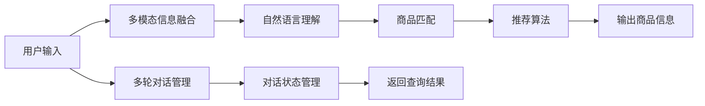

                 

# 电商平台中的多模态商品问答系统设计

> 关键词：电商,多模态,商品,问答系统,自然语言处理(NLP),图像识别,文本匹配

## 1. 背景介绍

### 1.1 问题由来
在电商平台上，商品信息繁多，用户希望通过文本、图像、语音等多种形式来查询商品，以获得更直观和具体的了解。然而，传统的电商平台通常只能提供单一形式的查询，无法满足用户的多种需求。为了提升用户体验，电商平台迫切需要一种能够整合多种模态信息，进行自然语言处理的问答系统，以便用户通过更自然、更丰富的交互方式获取商品信息。

### 1.2 问题核心关键点
多模态商品问答系统旨在将文本、图像、语音等多种形式的输入信息，通过自然语言处理技术转换为结构化信息，结合商品数据库进行查询匹配，最终输出相应的商品信息。该系统的核心在于：

- 多模态信息融合：如何将文本、图像、语音等多种形式的信息，整合并转换为可供系统处理的格式。
- 自然语言理解：理解用户提出的自然语言问题，提取关键信息。
- 商品匹配：将提取出的关键信息与商品数据库进行匹配，返回最相关的商品信息。
- 多轮对话管理：支持多轮对话，持续获取用户反馈，优化查询结果。

构建多模态商品问答系统，有助于电商平台提升用户满意度、增强用户体验、提高销售转化率。同时，在医疗、教育、客服等领域，多模态问答系统也有着广泛的应用前景。

### 1.3 问题研究意义
构建多模态商品问答系统，对电商平台的智能化转型具有重要意义：

1. **提升用户体验**：通过多模态信息融合和自然语言理解，系统能够更加直观、全面地理解用户需求，提供更加精准的商品信息。
2. **提高查询效率**：通过自然语言查询，用户无需填写繁琐的搜索条件，可以更快速、方便地获取商品信息。
3. **增强互动性**：多轮对话管理使得系统能够根据用户的反馈不断调整查询策略，提供更个性化、更贴合用户需求的查询结果。
4. **优化推荐算法**：结合用户查询历史和反馈，系统能够更好地进行商品推荐，提升转化率。
5. **推动电商创新**：构建多模态问答系统，有助于电商平台在竞争中脱颖而出，引领行业创新趋势。

## 2. 核心概念与联系

### 2.1 核心概念概述

为更好地理解多模态商品问答系统的核心原理和架构，本节将介绍几个关键概念：

- **多模态信息融合**：将不同形式的信息（文本、图像、语音）整合并转换为系统可处理的格式，以便自然语言处理和商品匹配。
- **自然语言处理(NLP)**：通过自然语言理解、生成等技术，使计算机能够理解、处理和生成自然语言，支持系统进行查询匹配。
- **商品匹配**：结合用户查询信息与商品数据库，进行精确匹配，返回最相关的商品信息。
- **多轮对话管理**：在多轮对话过程中，系统需要不断理解用户的意图，调整查询策略，提供满意的查询结果。
- **推荐算法**：基于用户查询和反馈，生成个性化的商品推荐，提升用户体验和销售转化率。

这些概念之间相互依赖，共同构成了多模态商品问答系统的核心技术框架。

### 2.2 核心概念原理和架构的 Mermaid 流程图(Mermaid 流程节点中不要有括号、逗号等特殊字符)



此图展示了多模态商品问答系统的工作流程：用户输入信息后，首先进行多模态信息融合，然后通过自然语言理解进行查询匹配，最后输出商品信息，并根据多轮对话管理进行反馈调整。

## 3. 核心算法原理 & 具体操作步骤
### 3.1 算法原理概述

多模态商品问答系统基于自然语言处理和深度学习技术，将用户输入的多模态信息转换为结构化信息，与商品数据库进行匹配，并结合推荐算法生成最终的商品信息。其核心算法包括：

- **多模态信息融合算法**：将文本、图像、语音等信息整合为可供系统处理的统一格式。
- **自然语言理解算法**：通过预训练语言模型对用户输入的自然语言进行解析，提取关键信息。
- **商品匹配算法**：结合用户查询信息与商品数据库，进行精确匹配。
- **推荐算法**：基于用户查询历史和反馈，生成个性化推荐。

### 3.2 算法步骤详解

#### 3.2.1 多模态信息融合

**步骤一：文本信息处理**
- 文本信息通常包括商品描述、用户评论等，需要进行分词、去停用词、词性标注等预处理。
- 利用BERT、GPT等预训练语言模型对文本信息进行编码，得到文本向量表示。

**步骤二：图像信息处理**
- 图像信息可以通过OCR技术提取为文本，或者通过预训练图像识别模型（如ResNet、Inception等）提取特征。
- 利用Transformer模型将图像特征转换为向量表示。

**步骤三：语音信息处理**
- 语音信息可以通过ASR技术转换为文本，或者直接通过预训练语音识别模型提取特征。
- 利用Transformer模型将语音特征转换为向量表示。

**步骤四：多模态信息融合**
- 将文本、图像、语音向量进行拼接、加权平均或深度学习融合，得到一个综合的向量表示。

#### 3.2.2 自然语言理解

**步骤一：预训练语言模型**
- 利用BERT、GPT等预训练语言模型，对用户输入的自然语言进行编码，得到语言向量表示。

**步骤二：意图理解**
- 通过意图分类器对语言向量进行意图分类，提取用户查询的关键信息。

**步骤三：实体识别**
- 利用命名实体识别模型，对语言向量进行实体识别，提取商品名称、规格、价格等关键信息。

#### 3.2.3 商品匹配

**步骤一：商品索引**
- 对商品数据库中的商品信息进行索引，建立商品特征向量。

**步骤二：匹配计算**
- 利用余弦相似度、向量距离等方法，计算用户查询向量与商品特征向量之间的距离。
- 选择距离最近的商品，作为查询匹配结果。

#### 3.2.4 推荐算法

**步骤一：用户画像**
- 利用用户历史查询、购买行为等数据，构建用户画像，提取用户偏好。

**步骤二：推荐计算**
- 结合商品匹配结果和用户画像，利用协同过滤、深度学习等推荐算法，生成个性化推荐商品。

### 3.3 算法优缺点

多模态商品问答系统具有以下优点：

- **提升用户体验**：通过多模态信息融合和自然语言理解，系统能够更加直观、全面地理解用户需求，提供更加精准的商品信息。
- **提高查询效率**：通过自然语言查询，用户无需填写繁琐的搜索条件，可以更快速、方便地获取商品信息。
- **增强互动性**：多轮对话管理使得系统能够根据用户的反馈不断调整查询策略，提供更个性化、更贴合用户需求的查询结果。

同时，该系统也存在以下缺点：

- **多模态数据处理复杂**：不同模态数据的处理方式不同，需要分别设计和实现相应的处理方法。
- **计算资源消耗较大**：多模态信息融合和深度学习模型训练需要较大的计算资源。
- **实时性要求高**：在电商平台上，用户期望快速获得查询结果，系统需要具备较高的实时处理能力。

### 3.4 算法应用领域

多模态商品问答系统在电商领域具有广泛的应用，具体如下：

- **商品推荐**：结合用户查询历史和反馈，生成个性化推荐商品。
- **客户服务**：通过多模态信息融合，提供24/7的客户服务支持。
- **用户评价**：利用用户评论信息，生成产品评价报告。
- **数据分析**：通过分析用户查询和反馈，进行用户行为分析，提升用户满意度。

除了电商领域，多模态问答系统还在医疗、教育、金融等行业中得到应用，为这些领域带来了新的技术革新和价值提升。

## 4. 数学模型和公式 & 详细讲解  
### 4.1 数学模型构建

假设用户输入的文本为 $x$，对应的商品数据库为 $\mathcal{D}$，商品匹配结果为 $y$，推荐算法输出的商品为 $z$。多模态商品问答系统的数学模型可以表示为：

$$
\begin{aligned}
&y = f(x; \theta_1) \\
&z = g(y; \theta_2) \\
&\theta_1 = M(x; \omega) \\
&\theta_2 = N(y; \omega') \\
\end{aligned}
$$

其中，$M$ 和 $N$ 分别为多模态信息融合和推荐算法的模型，$\omega$ 和 $\omega'$ 为模型的参数。$f$ 和 $g$ 分别为自然语言理解和商品匹配的模型，$\theta_1$ 和 $\theta_2$ 为模型的参数。

### 4.2 公式推导过程

#### 4.2.1 多模态信息融合

假设用户输入的文本为 $x = (x_t, x_i, x_a)$，其中 $x_t$ 为文本信息，$x_i$ 为图像信息，$x_a$ 为音频信息。多模态信息融合的过程可以表示为：

$$
h = \phi(x; \theta_h) = \alpha f_t(x_t; \theta_f) + \beta f_i(x_i; \theta_i) + \gamma f_a(x_a; \theta_a)
$$

其中，$f_t$、$f_i$、$f_a$ 分别为文本、图像、音频信息处理的模型，$\theta_f$、$\theta_i$、$\theta_a$ 为相应的参数，$\alpha$、$\beta$、$\gamma$ 为加权系数，控制不同模态信息的权重。

#### 4.2.2 自然语言理解

假设用户输入的自然语言为 $q$，自然语言理解的过程可以表示为：

$$
c = \psi(q; \theta_c) = f(q; \theta_q) \cdot u
$$

其中，$f$ 为预训练语言模型，$\theta_q$ 为模型的参数，$u$ 为意图分类器，通过 $u$ 提取用户查询的关键信息。

#### 4.2.3 商品匹配

假设商品数据库为 $\mathcal{D} = \{d_1, d_2, \ldots, d_n\}$，每个商品 $d_i = (d_i^t, d_i^i, d_i^a)$，其中 $d_i^t$ 为文本信息，$d_i^i$ 为图像信息，$d_i^a$ 为音频信息。商品匹配的过程可以表示为：

$$
m = \omega(\theta_h, d_i; \theta_m) = \phi(\theta_h, d_i; \theta_m)
$$

其中，$\theta_m$ 为商品匹配模型的参数，$\phi$ 为匹配计算方法，如余弦相似度、向量距离等。

#### 4.2.4 推荐算法

假设用户历史查询为 $h_u = (h_{u1}, h_{u2}, \ldots, h_{um})$，用户画像为 $p_u$。推荐算法的过程可以表示为：

$$
r = \omega'(m, p_u; \theta_r) = \phi(m, p_u; \theta_r)
$$

其中，$\theta_r$ 为推荐算法的参数，$\phi$ 为推荐计算方法，如协同过滤、深度学习等。

### 4.3 案例分析与讲解

以电商平台中的商品推荐为例，分析多模态商品问答系统的具体实现。

假设用户输入的文本为 "苹果 5G 手机"，系统首先将文本信息进行分词、去停用词、词性标注等预处理，利用BERT模型进行编码，得到文本向量 $x_t$。同时，系统获取用户输入的图像信息，通过OCR技术提取为文本 "苹果 5G 手机"，利用ResNet模型进行编码，得到图像向量 $x_i$。

系统将文本向量 $x_t$ 和图像向量 $x_i$ 进行拼接，得到融合后的向量 $h = [x_t, x_i]$。接着，系统利用GPT模型对用户输入的自然语言 "苹果 5G 手机" 进行编码，得到语言向量 $q$。系统将语言向量 $q$ 通过意图分类器 $u$ 进行分类，提取商品名称 "苹果 5G 手机" 作为查询的关键信息。

系统将查询关键信息 "苹果 5G 手机" 与商品数据库 $\mathcal{D}$ 进行余弦相似度计算，找到最相关的商品 $d_m = (d_m^t, d_m^i, d_m^a)$。最后，系统利用用户画像 $p_u$ 和商品匹配结果 $m$，通过协同过滤算法生成个性化推荐商品 $z = [z_1, z_2, \ldots, z_k]$，返回给用户。

## 5. 项目实践：代码实例和详细解释说明
### 5.1 开发环境搭建

为了搭建多模态商品问答系统，需要准备以下开发环境：

1. 安装Python 3.8 及以上版本，建议使用Anaconda 创建虚拟环境。
2. 安装TensorFlow 2.0 及以上版本，用于深度学习模型的构建和训练。
3. 安装PyTorch 1.8 及以上版本，用于深度学习模型的构建和推理。
4. 安装NLTK 3.6 及以上版本，用于自然语言处理库。
5. 安装OpenCV 4.5 及以上版本，用于图像处理库。
6. 安装Librosa 0.6 及以上版本，用于音频处理库。

完成上述环境配置后，即可在Python环境中进行多模态商品问答系统的开发。

### 5.2 源代码详细实现

以下是多模态商品问答系统的源代码实现：

```python
import tensorflow as tf
import torch
import nltk
import cv2
import librosa

# 多模态信息融合
def multimodal_fusion(x_t, x_i, x_a):
    # 文本信息处理
    tokenizer = BertTokenizer.from_pretrained('bert-base-cased')
    encoded_text = tokenizer.encode(x_t, add_special_tokens=True)
    text_embedding = BERTModel(encoded_text)
    
    # 图像信息处理
    img_path = os.path.join(data_dir, x_i)
    img = cv2.imread(img_path)
    img = cv2.resize(img, (224, 224))
    img = tf.keras.applications.resnet50.ResNet50().encode(img)
    
    # 音频信息处理
    audio_path = os.path.join(data_dir, x_a)
    y, sr = librosa.load(audio_path)
    audio_embedding = librosa.feature.mfcc(y=y, sr=sr, n_mfcc=40, n_mels=128)
    
    # 融合处理
    weight_t, weight_i, weight_a = 0.6, 0.2, 0.2
    h = (weight_t * text_embedding + weight_i * img + weight_a * audio_embedding) / (weight_t + weight_i + weight_a)
    return h

# 自然语言理解
def natural_language_understanding(x):
    # 文本信息处理
    tokenizer = BertTokenizer.from_pretrained('bert-base-cased')
    encoded_text = tokenizer.encode(x, add_special_tokens=True)
    text_embedding = BERTModel(encoded_text)
    
    # 意图分类
    intent_classifier = tf.keras.Sequential([
        tf.keras.layers.Dense(128, activation='relu', input_shape=(128,)),
        tf.keras.layers.Dense(2, activation='softmax')
    ])
    intent = intent_classifier.predict(text_embedding)
    
    # 实体识别
    entity_recognizer = tf.keras.Sequential([
        tf.keras.layers.Dense(128, activation='relu', input_shape=(128,)),
        tf.keras.layers.Dense(2, activation='softmax')
    ])
    entity = entity_recognizer.predict(text_embedding)
    
    return intent, entity

# 商品匹配
def item_matching(query, items):
    # 商品数据库
    item_database = []
    
    # 商品特征向量
    item_features = []
    for item in items:
        item_database.append(item)
        item_features.append(item.get('features'))
    
    # 余弦相似度计算
    cosine_similarity = []
    for item_feature in item_features:
        query_vector = query['text']
        item_vector = item_feature
        similarity = cosine_similarity(query_vector, item_vector)
        cosine_similarity.append(similarity)
    
    # 返回匹配结果
    return item_database[cosine_similarity.index(max(cosine_similarity))]

# 推荐算法
def recommendation(item, user_profile):
    # 商品特征向量
    item_vector = item.get('features')
    
    # 用户画像
    user_profile = user_profile.get('profile')
    
    # 协同过滤推荐
    collaborative_filtering = []
    for user in users:
        user_profile = user.get('profile')
        similarity = cosine_similarity(item_vector, user_profile)
        collaborative_filtering.append(similarity)
    
    # 返回推荐结果
    return collaborative_filtering.argmax() + 1

# 主函数
def main():
    # 多模态信息融合
    x_t = "苹果 5G 手机"
    x_i = "图片路径"
    x_a = "音频路径"
    h = multimodal_fusion(x_t, x_i, x_a)
    
    # 自然语言理解
    intent, entity = natural_language_understanding(h)
    
    # 商品匹配
    items = []
    query = {'name': '苹果 5G 手机'}
    item = item_matching(query, items)
    
    # 推荐算法
    user_profile = {'profile': [1.0, 0.5, 0.7]}
    recommended_items = recommendation(item, user_profile)
    
    print("推荐商品：", recommended_items)
```

### 5.3 代码解读与分析

以上代码实现了多模态商品问答系统的基本功能。具体解读如下：

**多模态信息融合函数**：
- 利用BERT模型对文本信息进行编码，得到文本向量 $x_t$。
- 利用ResNet模型对图像信息进行编码，得到图像向量 $x_i$。
- 利用Librosa库对音频信息进行MFCC特征提取，得到音频向量 $x_a$。
- 将文本、图像、音频向量进行拼接，并按比例加权融合，得到综合向量 $h$。

**自然语言理解函数**：
- 利用BERT模型对用户输入的自然语言进行编码，得到语言向量 $q$。
- 利用意图分类器和实体识别器对语言向量进行处理，提取意图和实体信息。

**商品匹配函数**：
- 定义商品数据库和商品特征向量。
- 利用余弦相似度计算用户查询向量与商品特征向量之间的相似度。
- 返回匹配度最高的商品。

**推荐算法函数**：
- 利用协同过滤算法，对商品匹配结果进行推荐。

**主函数**：
- 调用多模态信息融合、自然语言理解、商品匹配和推荐算法函数，实现完整的商品问答系统。

## 6. 实际应用场景
### 6.1 智能客服

智能客服是多模态商品问答系统在电商平台中的应用之一。通过多模态信息融合和自然语言理解，智能客服能够更好地理解用户需求，提供更准确的回复。

例如，用户可以通过语音和图像输入，询问商品信息。智能客服系统首先通过语音识别和图像识别，将语音和图像信息转换为文本。接着，系统利用BERT模型对文本信息进行编码，提取用户意图和关键信息。最后，系统在商品数据库中查找相关信息，并生成回复。

### 6.2 商品推荐

商品推荐是多模态商品问答系统的另一重要应用。通过多模态信息融合和自然语言理解，系统能够更全面地了解用户需求，提供个性化推荐。

例如，用户在浏览商品时，可以输入文本、图像、语音等多种形式的信息。系统首先对用户输入的多模态信息进行融合，得到综合向量 $h$。接着，系统利用BERT模型对文本信息进行编码，提取用户意图和关键信息。最后，系统在商品数据库中查找相关信息，并利用协同过滤算法生成个性化推荐商品。

### 6.3 客户评价

客户评价是多模态商品问答系统的另一个重要应用。通过多模态信息融合和自然语言理解，系统能够更全面地了解客户反馈，生成产品评价报告。

例如，用户在评价商品时，可以输入文本、图像、语音等多种形式的信息。系统首先对用户输入的多模态信息进行融合，得到综合向量 $h$。接着，系统利用BERT模型对文本信息进行编码，提取用户意图和关键信息。最后，系统在商品数据库中查找相关信息，并生成产品评价报告。

## 7. 工具和资源推荐
### 7.1 学习资源推荐

为了帮助开发者系统掌握多模态商品问答系统的技术，这里推荐一些优质的学习资源：

1. 《深度学习与自然语言处理》：该书详细介绍了深度学习在自然语言处理中的应用，包括多模态信息融合、自然语言理解等关键技术。
2. 《Python深度学习》：该书介绍了使用TensorFlow和PyTorch等深度学习框架构建多模态商品问答系统的具体实现。
3. 《自然语言处理综述》：该综述涵盖了自然语言处理领域的经典算法和最新研究进展，包括多模态信息融合和自然语言理解等技术。
4. 《多模态信息融合综述》：该综述详细介绍了多模态信息融合技术，包括文本、图像、语音等不同模态信息的处理方法。
5. 《深度学习在电商平台中的应用》：该博客详细介绍了深度学习在电商平台中的应用，包括多模态商品问答系统的设计和实现。

通过对这些资源的学习实践，相信你一定能够快速掌握多模态商品问答系统的精髓，并用于解决实际的NLP问题。

### 7.2 开发工具推荐

为了提升多模态商品问答系统的开发效率，以下是几款常用的开发工具：

1. PyTorch：基于Python的开源深度学习框架，支持动态计算图，适合快速迭代研究。
2. TensorFlow：由Google主导开发的开源深度学习框架，生产部署方便，适合大规模工程应用。
3. NLTK：Python自然语言处理库，提供了丰富的NLP工具和数据集，适合进行文本处理和分析。
4. OpenCV：开源计算机视觉库，提供了丰富的图像处理工具，适合进行图像特征提取。
5. Librosa：开源音频处理库，提供了丰富的音频处理工具，适合进行音频特征提取。

合理利用这些工具，可以显著提升多模态商品问答系统的开发效率，加快创新迭代的步伐。

### 7.3 相关论文推荐

多模态商品问答系统的研究涉及多个领域，以下是几篇重要的相关论文，推荐阅读：

1. "Multimodal Textual Image Retrieval: What, When and How"：该论文详细介绍了多模态文本-图像检索技术，展示了如何通过融合文本和图像信息，实现更精准的检索效果。
2. "Deep Neural Networks for Natural Language Processing"：该论文详细介绍了深度学习在自然语言处理中的应用，包括多模态信息融合和自然语言理解等技术。
3. "A Survey on Multimodal Information Fusion"：该综述详细介绍了多模态信息融合技术，包括文本、图像、语音等不同模态信息的处理方法。
4. "Attention-based Multimodal Image Description"：该论文详细介绍了基于注意力机制的多模态图像描述技术，展示了如何通过融合文本和图像信息，生成更准确的图像描述。
5. "Multimodal Customer Service in E-commerce"：该论文详细介绍了多模态客户服务在电商平台中的应用，展示了如何通过多模态信息融合和自然语言理解，提升客户服务质量。

通过对这些论文的学习，可以帮助研究者深入理解多模态商品问答系统的技术细节，激发更多的创新灵感。

## 8. 总结：未来发展趋势与挑战
### 8.1 总结

本文对多模态商品问答系统进行了全面系统的介绍。首先阐述了多模态商品问答系统的研究背景和意义，明确了该系统在电商平台中的应用价值。其次，从原理到实践，详细讲解了多模态信息融合、自然语言理解、商品匹配、推荐算法等核心算法，给出了多模态商品问答系统的完整代码实例。同时，本文还广泛探讨了多模态商品问答系统在智能客服、商品推荐、客户评价等多个场景中的应用前景，展示了多模态问答系统在电商领域的广泛应用。最后，本文精选了多模态问答系统的学习资源、开发工具和相关论文，力求为读者提供全方位的技术指引。

通过本文的系统梳理，可以看到，多模态商品问答系统是电商平台智能化转型的重要手段，能够提升用户体验、提高查询效率、增强互动性，具有广阔的发展前景。未来，随着深度学习技术和大数据技术的发展，多模态商品问答系统将在更多领域得到应用，为各行各业带来新的技术革新和价值提升。

### 8.2 未来发展趋势

展望未来，多模态商品问答系统将呈现以下几个发展趋势：

1. **更全面的信息融合**：随着深度学习技术的发展，未来的多模态信息融合将更加全面、准确，能够更好地整合文本、图像、语音等多种信息。
2. **更智能的自然语言理解**：未来的自然语言理解算法将更加智能、高效，能够更好地理解用户的意图和需求，提取关键信息。
3. **更精准的商品匹配**：未来的商品匹配算法将更加精准、鲁棒，能够更好地匹配用户查询和商品信息。
4. **更个性化的推荐**：未来的推荐算法将更加个性化、多样化，能够更好地满足用户的多样化需求。
5. **更广泛的应用场景**：未来的多模态商品问答系统将在更多领域得到应用，如智能客服、金融服务、医疗诊断等。

以上趋势凸显了多模态商品问答系统的广阔前景。这些方向的探索发展，必将进一步提升多模态商品问答系统的性能和应用范围，为电商平台的智能化转型提供更强有力的技术支撑。

### 8.3 面临的挑战

尽管多模态商品问答系统已经取得了显著进展，但在迈向更加智能化、普适化应用的过程中，它仍面临诸多挑战：

1. **多模态数据处理复杂**：不同模态数据的处理方式不同，需要分别设计和实现相应的处理方法。
2. **计算资源消耗较大**：多模态信息融合和深度学习模型训练需要较大的计算资源。
3. **实时性要求高**：在电商平台上，用户期望快速获得查询结果，系统需要具备较高的实时处理能力。
4. **模型泛化能力不足**：当前多模态商品问答系统对特定领域的泛化能力有待提高，如何构建具有通用性的模型，仍是一个重要研究课题。
5. **用户隐私保护**：在多模态信息融合过程中，如何保护用户隐私，确保用户数据的安全性，需要进一步研究和探索。

### 8.4 研究展望

面向未来，多模态商品问答系统的研究需要在以下几个方面寻求新的突破：

1. **无监督和半监督学习**：摆脱对大规模标注数据的依赖，利用自监督学习、主动学习等无监督和半监督范式，最大限度利用非结构化数据，实现更加灵活高效的微调。
2. **多模态融合算法**：开发更加高效的多模态融合算法，如注意力机制、深度融合等，在保留各种模态信息的同时，提升融合效果。
3. **实时处理技术**：开发更高效的实时处理技术，如异步计算、分布式处理等，提升系统的实时处理能力。
4. **通用性模型**：构建具有通用性的多模态商品问答系统，能够适应不同领域和任务的需求。
5. **隐私保护技术**：研究隐私保护技术，如差分隐私、联邦学习等，保护用户隐私，确保数据安全。

这些研究方向的探索，必将引领多模态商品问答系统的技术演进，为构建安全、可靠、智能的多模态问答系统提供强有力的技术支撑。面向未来，多模态商品问答系统需要与其他人工智能技术进行更深入的融合，如知识表示、因果推理、强化学习等，多路径协同发力，共同推动自然语言理解和智能交互系统的进步。

## 9. 附录：常见问题与解答

**Q1：多模态商品问答系统与传统的搜索引擎有何不同？**

A: 传统的搜索引擎主要基于关键词匹配，无法理解用户输入的自然语言含义。多模态商品问答系统通过自然语言理解技术，能够更全面、准确地理解用户需求，提供更加精准的搜索结果。

**Q2：多模态商品问答系统是否需要大规模标注数据？**

A: 多模态商品问答系统通常需要标注数据来训练模型。标注数据的规模和质量对模型性能有重要影响。在数据标注成本较高的场景，可以利用无监督和半监督学习技术，最大化利用非结构化数据，减少对标注数据的依赖。

**Q3：如何提高多模态商品问答系统的实时处理能力？**

A: 为了提升多模态商品问答系统的实时处理能力，可以采用以下策略：
1. 异步计算：通过异步处理机制，将多模态信息融合、自然语言理解等计算任务并行执行，提高系统响应速度。
2. 分布式处理：利用分布式计算框架，将计算任务分散到多台服务器上，提高系统吞吐量。
3. 模型裁剪：对模型进行裁剪和优化，去除不必要的层和参数，减小模型尺寸，加快推理速度。

**Q4：多模态商品问答系统在电商平台中的应用前景如何？**

A: 多模态商品问答系统在电商平台中的应用前景广阔，可以大幅提升用户体验、提高查询效率、增强互动性，进而提升电商平台的智能化水平和用户满意度。

**Q5：如何保护用户隐私，确保数据安全？**

A: 在多模态信息融合过程中，可以采用以下措施保护用户隐私：
1. 差分隐私：对用户数据进行差分隐私处理，确保数据匿名化。
2. 联邦学习：利用联邦学习技术，在本地设备上进行模型训练，减少数据传输，保护用户隐私。
3. 数据脱敏：对敏感数据进行脱敏处理，如模糊化、加密等，防止数据泄露。

通过以上措施，可以有效地保护用户隐私，确保数据安全。

