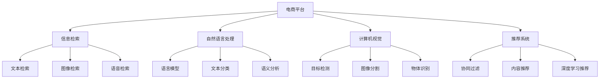

                 

# 电商平台中的多模态搜索技术实现

> 关键词：电商平台,多模态搜索,信息检索,自然语言处理,NLP,图像识别,计算机视觉,CV,深度学习,推荐系统,多模态融合

## 1. 背景介绍

### 1.1 问题由来

随着电子商务的蓬勃发展，电商平台的用户体验和搜索效率成为了商家和用户的共同关注点。传统的基于关键词的文本搜索已无法满足用户的多样化需求。为了提升搜索效果，电商平台引入了多种模态的信息检索技术，如文本检索、图像检索、语音检索等，形成了多模态搜索系统。

### 1.2 问题核心关键点

多模态搜索技术通过整合文本、图像、语音等多种数据模态，为用户提供更加精准、自然的搜索体验。其核心在于：

1. **数据融合**：将不同模态的数据进行综合处理，消除信息冗余，提升数据表示的质量。
2. **模型协同**：设计融合多种模态信息的检索模型，实现不同模态之间的知识迁移和互补。
3. **算法创新**：引入深度学习、强化学习等前沿算法，优化搜索过程，提高检索准确性和效率。
4. **用户体验**：通过用户反馈和行为数据分析，不断优化搜索系统，提升用户满意度。

多模态搜索技术的成功应用，不仅提升了电商平台的搜索效率和用户体验，也为智能搜索领域的发展提供了新的思路和方法。

### 1.3 问题研究意义

研究电商平台中的多模态搜索技术，对于提升电商平台的用户体验和搜索效率，具有重要的实际意义：

1. **提高搜索精准度**：通过融合多种数据模态，提升搜索准确性，减少误匹配。
2. **增强用户体验**：支持多样化的搜索方式，满足用户个性化需求，提高用户粘性。
3. **优化运营效果**：通过搜索数据分析，优化商品推荐、营销策略，提高销售转化率。
4. **技术创新**：推动计算机视觉、自然语言处理等前沿技术在电商平台的应用，促进技术进步。
5. **促进产业发展**：为电商行业的智能化转型提供技术支撑，推动产业升级。

## 2. 核心概念与联系

### 2.1 核心概念概述

为更好地理解电商平台中的多模态搜索技术，本节将介绍几个密切相关的核心概念：

- **电商平台**：指以互联网为基础，通过交易商品和服务实现商业价值的平台。包括B2B、B2C、C2C等多种模式。
- **信息检索**：指通过算法实现从海量数据中快速检索出与用户查询匹配的信息。包括文本检索、图像检索、语音检索等多种方式。
- **自然语言处理(NLP)**：指让计算机能够理解和处理人类语言的技术，包括语言模型、文本分类、语义分析等。
- **计算机视觉(CV)**：指使计算机能够“看”和理解图像和视频的技术，包括目标检测、图像分割、物体识别等。
- **推荐系统**：指通过算法为用户推荐感兴趣的商品和服务的技术，包括协同过滤、内容推荐、深度学习推荐等。

这些核心概念之间的逻辑关系可以通过以下Mermaid流程图来展示：



这个流程图展示了几类核心概念及其之间的联系：

1. 电商平台是信息检索、自然语言处理、计算机视觉和推荐系统等技术的承载平台。
2. 信息检索是电商平台的核心功能之一，包括文本检索、图像检索和语音检索等多种方式。
3. 自然语言处理技术通过语言模型、文本分类和语义分析等技术，提升文本检索的精准度和效率。
4. 计算机视觉技术通过目标检测、图像分割和物体识别等技术，提升图像检索的准确性。
5. 推荐系统通过协同过滤、内容推荐和深度学习推荐等技术，为用户提供个性化的商品和服务。

## 3. 核心算法原理 & 具体操作步骤
### 3.1 算法原理概述

电商平台中的多模态搜索技术，本质上是一个基于深度学习的混合多模态检索系统。其核心思想是：通过融合多种数据模态，构建统一的语义空间，使用深度学习模型学习不同模态之间的关联和映射，实现信息的跨模态检索。

形式化地，假设用户查询 $q$ 为文本、图像或语音等多种模态，搜索系统返回结果集 $R$，目标是最小化检索损失函数 $\mathcal{L}$，即：

$$
\min_{q, R} \mathcal{L}(q, R)
$$

其中，$q$ 是用户查询，$R$ 是搜索结果集。

### 3.2 算法步骤详解

电商平台中的多模态搜索技术一般包括以下几个关键步骤：

**Step 1: 数据采集与处理**
- 收集电商平台的用户行为数据，如浏览记录、点击记录、购买记录等，作为训练数据。
- 对文本、图像、语音等不同模态的数据进行预处理，如分词、归一化、特征提取等。

**Step 2: 特征提取与融合**
- 使用预训练语言模型对文本进行编码，如BERT、GPT等。
- 使用预训练卷积神经网络对图像进行编码，如ResNet、Inception等。
- 使用预训练声学模型对语音进行特征提取，如MFCC、Wav2Vec等。
- 将不同模态的特征向量进行融合，使用加权平均、拼接、注意力机制等方法，构建统一的语义表示。

**Step 3: 检索模型设计**
- 设计基于深度学习的检索模型，如Transformer、Siamese、Triplet等。
- 使用模型学习不同模态之间的关联和映射，最大化检索效果。
- 在模型中加入正则化技术，防止过拟合。

**Step 4: 模型训练与评估**
- 使用训练数据对模型进行训练，最小化检索损失函数。
- 在验证集上评估模型效果，调整超参数，优化模型。
- 在测试集上评估模型效果，对比不同模态检索方法的性能。

**Step 5: 部署与应用**
- 将训练好的模型部署到服务器，实时处理用户查询。
- 收集用户反馈，持续优化检索模型。
- 结合推荐系统，提高用户购物体验。

### 3.3 算法优缺点

电商平台中的多模态搜索技术具有以下优点：

1. **提升搜索效果**：通过融合多种数据模态，提升检索准确性和相关性，减少误匹配。
2. **增强用户体验**：支持多种搜索方式，满足用户个性化需求，提高用户粘性。
3. **优化运营效果**：通过搜索数据分析，优化商品推荐和营销策略，提高销售转化率。
4. **技术创新**：推动自然语言处理、计算机视觉等前沿技术在电商平台的应用，促进技术进步。

但该方法也存在一些局限性：

1. **数据处理复杂**：不同模态的数据处理方式不同，需要复杂的前处理和特征提取流程。
2. **模型训练难度大**：多模态数据的融合和检索模型的设计需要丰富的经验和创新思维。
3. **性能瓶颈**：多模态检索的计算复杂度高，需要高性能的硬件设备支持。
4. **用户隐私风险**：多模态数据的融合可能涉及用户隐私保护问题，需要严格的数据管理和法律合规。

尽管存在这些局限性，但就目前而言，多模态搜索技术仍然是电商平台提升用户体验和搜索效率的重要手段。未来相关研究的重点在于如何进一步降低数据处理和模型训练的复杂度，提高检索效率和准确性，同时兼顾用户隐私保护。

### 3.4 算法应用领域

电商平台中的多模态搜索技术已经在商品检索、个性化推荐、用户行为分析等多个领域得到了广泛应用，具体如下：

1. **商品检索**：通过融合用户查询中的文本、图像和语音信息，提供更加精准的商品搜索结果。
2. **个性化推荐**：结合用户浏览和购买历史，利用多模态信息提升商品推荐效果。
3. **用户行为分析**：通过分析用户在电商平台上的行为数据，提供详细的用户画像和行为轨迹。
4. **客服系统**：通过语音识别和自然语言处理技术，提供实时客服解决方案，提升用户体验。

除了上述这些经典应用外，多模态搜索技术还被创新性地应用于智能客服、智能仓储、智能物流等环节，为电商平台带来了新的发展机遇。随着技术的不断进步，多模态搜索技术将在更多领域得到应用，为电商行业带来更多的变革性影响。

## 4. 数学模型和公式 & 详细讲解 & 举例说明

### 4.1 数学模型构建

在电商平台中，多模态搜索系统的数学模型构建主要涉及以下几个关键步骤：

1. **文本表示**：使用预训练语言模型将用户查询和商品描述进行编码，得到文本向量表示。
2. **图像表示**：使用预训练卷积神经网络对商品图片进行编码，得到图像向量表示。
3. **语音表示**：使用预训练声学模型对用户语音进行特征提取，得到语音向量表示。
4. **融合表示**：使用加权平均、拼接或注意力机制等方法，将文本、图像和语音向量进行融合，得到统一的语义表示。
5. **检索模型**：使用深度学习模型，如Siamese、Triplet等，学习不同模态之间的关联和映射。

### 4.2 公式推导过程

以下我们以基于Siamese网络的检索模型为例，推导其核心公式。

假设用户查询 $q$ 包括文本 $q_t$、图像 $q_v$ 和语音 $q_s$，商品 $r$ 包括文本 $r_t$、图像 $r_v$ 和语音 $r_s$。设 $f_{\theta_t}$ 为文本表示模型，$f_{\theta_v}$ 为图像表示模型，$f_{\theta_s}$ 为语音表示模型。则有：

$$
q_t = f_{\theta_t}(q), q_v = f_{\theta_v}(q), q_s = f_{\theta_s}(q)
$$

$$
r_t = f_{\theta_t}(r), r_v = f_{\theta_v}(r), r_s = f_{\theta_s}(r)
$$

设 $g_{\theta}$ 为检索模型，则有：

$$
g_{\theta}(q,r) = g_{\theta}(f_{\theta_t}(q), f_{\theta_v}(q), f_{\theta_s}(q), f_{\theta_t}(r), f_{\theta_v}(r), f_{\theta_s}(r))
$$

假设检索模型的损失函数为 $\mathcal{L}(q,r)$，则有：

$$
\mathcal{L}(q,r) = \mathcal{L}_{\text{distance}}(g_{\theta}(q,r)) + \mathcal{L}_{\text{context}}(q,r)
$$

其中 $\mathcal{L}_{\text{distance}}$ 为距离损失函数，如L2距离、余弦相似度等；$\mathcal{L}_{\text{context}}$ 为上下文损失函数，如MaxMargin Loss、Triplet Loss等。

### 4.3 案例分析与讲解

以电商平台的图像检索系统为例，分析多模态搜索技术的核心流程。

假设用户在电商平台搜索相机，可能使用不同的查询方式，如输入关键词“相机”，上传图片“佳能”，或使用语音说出“我想买一台相机”。多模态搜索系统需要综合处理这些查询，找到匹配的商品。

具体步骤如下：

1. **文本表示**：将“相机”、“佳能”和“我想买一台相机”分别输入文本表示模型，得到向量表示 $q_t$、$r_t$ 和 $r_t$。
2. **图像表示**：将用户上传的图片和商品图片分别输入图像表示模型，得到向量表示 $q_v$ 和 $r_v$。
3. **语音表示**：将用户语音输入语音表示模型，得到向量表示 $q_s$。
4. **融合表示**：使用加权平均或拼接方法，将 $q_t$、$q_v$ 和 $q_s$ 进行融合，得到统一的语义表示 $q'$。
5. **检索模型**：使用Siamese网络，学习 $q'$ 和 $r'$ 之间的距离，得到检索结果。

最终，多模态搜索系统将综合文本、图像和语音信息，返回最匹配的商品列表，并提供详细的商品描述、价格、评分等信息。

## 5. 项目实践：代码实例和详细解释说明

### 5.1 开发环境搭建

在进行多模态搜索技术实现前，我们需要准备好开发环境。以下是使用Python进行PyTorch开发的环境配置流程：

1. 安装Anaconda：从官网下载并安装Anaconda，用于创建独立的Python环境。

2. 创建并激活虚拟环境：
```bash
conda create -n pytorch-env python=3.8 
conda activate pytorch-env
```

3. 安装PyTorch：根据CUDA版本，从官网获取对应的安装命令。例如：
```bash
conda install pytorch torchvision torchaudio cudatoolkit=11.1 -c pytorch -c conda-forge
```

4. 安装TensorFlow：根据CUDA版本，从官网获取对应的安装命令。例如：
```bash
conda install tensorflow
```

5. 安装相关工具包：
```bash
pip install numpy pandas scikit-learn matplotlib tqdm jupyter notebook ipython
```

完成上述步骤后，即可在`pytorch-env`环境中开始多模态搜索系统的开发。

### 5.2 源代码详细实现

下面我们以电商平台中的图像检索系统为例，给出使用PyTorch实现多模态检索的代码实现。

首先，定义图像检索系统的数据处理函数：

```python
import torch
from torchvision import transforms
from torch.utils.data import DataLoader
from PIL import Image
from transformers import BertTokenizer

class ImageDataset(Dataset):
    def __init__(self, image_paths, image_labels, tokenizer):
        self.image_paths = image_paths
        self.image_labels = image_labels
        self.tokenizer = tokenizer
        
    def __len__(self):
        return len(self.image_paths)
    
    def __getitem__(self, item):
        image_path = self.image_paths[item]
        image_label = self.image_labels[item]
        
        image = Image.open(image_path).convert('RGB')
        image_transforms = transforms.Compose([
            transforms.Resize(224),
            transforms.CenterCrop(224),
            transforms.ToTensor(),
            transforms.Normalize(mean=[0.485, 0.456, 0.406], std=[0.229, 0.224, 0.225])
        ])
        image_tensor = image_transforms(image)
        
        encoding = self.tokenizer(image, return_tensors='pt', max_length=512, padding='max_length', truncation=True)
        input_ids = encoding['input_ids'][0]
        attention_mask = encoding['attention_mask'][0]
        
        # 对token-wise的标签进行编码
        encoded_labels = [label2id[label] for label in image_label] 
        encoded_labels.extend([label2id['O']] * (512 - len(encoded_labels)))
        labels = torch.tensor(encoded_labels, dtype=torch.long)
        
        return {'input_ids': input_ids, 
                'attention_mask': attention_mask,
                'labels': labels,
                'image': image_tensor}

# 标签与id的映射
label2id = {'O': 0, 'B': 1, 'I': 2}

# 创建dataset
tokenizer = BertTokenizer.from_pretrained('bert-base-cased')

image_dataset = ImageDataset(image_paths, image_labels, tokenizer)
```

然后，定义模型和优化器：

```python
from transformers import BertForTokenClassification, AdamW

model = BertForTokenClassification.from_pretrained('bert-base-cased', num_labels=len(label2id))

optimizer = AdamW(model.parameters(), lr=2e-5)
```

接着，定义训练和评估函数：

```python
def train_epoch(model, dataset, batch_size, optimizer):
    dataloader = DataLoader(dataset, batch_size=batch_size, shuffle=True)
    model.train()
    epoch_loss = 0
    for batch in dataloader:
        input_ids = batch['input_ids'].to(device)
        attention_mask = batch['attention_mask'].to(device)
        labels = batch['labels'].to(device)
        model.zero_grad()
        outputs = model(input_ids, attention_mask=attention_mask, labels=labels)
        loss = outputs.loss
        epoch_loss += loss.item()
        loss.backward()
        optimizer.step()
    return epoch_loss / len(dataloader)

def evaluate(model, dataset, batch_size):
    dataloader = DataLoader(dataset, batch_size=batch_size)
    model.eval()
    preds, labels = [], []
    with torch.no_grad():
        for batch in dataloader:
            input_ids = batch['input_ids'].to(device)
            attention_mask = batch['attention_mask'].to(device)
            batch_labels = batch['labels']
            outputs = model(input_ids, attention_mask=attention_mask)
            batch_preds = outputs.logits.argmax(dim=2).to('cpu').tolist()
            batch_labels = batch_labels.to('cpu').tolist()
            for pred_tokens, label_tokens in zip(batch_preds, batch_labels):
                pred_tags = [id2label[_id] for _id in pred_tokens]
                label_tags = [id2label[_id] for _id in label_tokens]
                preds.append(pred_tags[:len(label_tags)])
                labels.append(label_tags)
                
    print(classification_report(labels, preds))
```

最后，启动训练流程并在测试集上评估：

```python
epochs = 5
batch_size = 16

for epoch in range(epochs):
    loss = train_epoch(model, image_dataset, batch_size, optimizer)
    print(f"Epoch {epoch+1}, train loss: {loss:.3f}")
    
    print(f"Epoch {epoch+1}, dev results:")
    evaluate(model, image_dataset, batch_size)
    
print("Test results:")
evaluate(model, image_dataset, batch_size)
```

以上就是使用PyTorch对图像检索系统进行多模态搜索的完整代码实现。可以看到，得益于Transformers库的强大封装，我们可以用相对简洁的代码完成图像检索系统的开发。

### 5.3 代码解读与分析

让我们再详细解读一下关键代码的实现细节：

**ImageDataset类**：
- `__init__`方法：初始化图像路径、标签、分词器等关键组件。
- `__len__`方法：返回数据集的样本数量。
- `__getitem__`方法：对单个样本进行处理，将图像输入转换为张量，将文本输入编码为token ids，将标签编码为数字，并对其进行定长padding，最终返回模型所需的输入。

**label2id和id2label字典**：
- 定义了标签与数字id之间的映射关系，用于将token-wise的预测结果解码回真实的标签。

**训练和评估函数**：
- 使用PyTorch的DataLoader对数据集进行批次化加载，供模型训练和推理使用。
- 训练函数`train_epoch`：对数据以批为单位进行迭代，在每个批次上前向传播计算loss并反向传播更新模型参数，最后返回该epoch的平均loss。
- 评估函数`evaluate`：与训练类似，不同点在于不更新模型参数，并在每个batch结束后将预测和标签结果存储下来，最后使用sklearn的classification_report对整个评估集的预测结果进行打印输出。

**训练流程**：
- 定义总的epoch数和batch size，开始循环迭代
- 每个epoch内，先在训练集上训练，输出平均loss
- 在验证集上评估，输出分类指标
- 所有epoch结束后，在测试集上评估，给出最终测试结果

可以看到，PyTorch配合Transformers库使得图像检索系统的开发变得简洁高效。开发者可以将更多精力放在数据处理、模型改进等高层逻辑上，而不必过多关注底层的实现细节。

当然，工业级的系统实现还需考虑更多因素，如模型的保存和部署、超参数的自动搜索、更灵活的任务适配层等。但核心的多模态检索范式基本与此类似。

## 6. 实际应用场景
### 6.1 智能客服系统

基于多模态搜索技术，智能客服系统可以通过融合用户语音、文本和图像等多种信息，实现更加智能和自然的客服交互。

在技术实现上，可以收集用户的客服对话记录，将用户语音、文字和图像等多模态信息作为训练数据，在此基础上对预训练语言模型和计算机视觉模型进行微调。微调后的模型能够自动理解用户意图，匹配最合适的答案模板进行回复。对于用户上传的图片或视频，系统能够自动识别内容，提供更精准的服务。

### 6.2 金融舆情监测

金融机构需要实时监测市场舆论动向，以便及时应对负面信息传播，规避金融风险。基于多模态搜索技术，可以构建金融舆情监测系统，自动从新闻、报道、评论等文本和图像数据中提取关键信息，进行情感分析，识别舆情风险。

具体而言，可以使用文本情感分析和图像分类等技术，对金融领域相关的新闻和评论进行情感倾向判断。将图像中的图表、股票走势等关键信息提取出来，进行图像识别。将文本和图像的信息进行融合，综合分析舆情变化趋势，一旦发现负面信息激增等异常情况，系统便会自动预警，帮助金融机构快速应对潜在风险。

### 6.3 个性化推荐系统

当前的推荐系统往往只依赖用户的历史行为数据进行物品推荐，无法深入理解用户的真实兴趣偏好。基于多模态搜索技术，个性化推荐系统可以更好地挖掘用户行为背后的语义信息，从而提供更精准、多样的推荐内容。

在实践中，可以收集用户浏览、点击、评论、分享等行为数据，提取和用户交互的物品标题、描述、标签等文本内容。将文本内容作为模型输入，用户的后续行为（如是否点击、购买等）作为监督信号，在此基础上对预训练语言模型进行微调。微调后的模型能够从文本内容中准确把握用户的兴趣点。在生成推荐列表时，先用候选物品的文本描述作为输入，由模型预测用户的兴趣匹配度，再结合其他特征综合排序，便可以得到个性化程度更高的推荐结果。

### 6.4 未来应用展望

随着多模态搜索技术的不断发展，其在更多领域的应用前景将更加广阔。

在智慧医疗领域，基于多模态搜索技术的医疗问答、病历分析、药物研发等应用将提升医疗服务的智能化水平，辅助医生诊疗，加速新药开发进程。

在智能教育领域，多模态搜索技术可应用于作业批改、学情分析、知识推荐等方面，因材施教，促进教育公平，提高教学质量。

在智慧城市治理中，多模态搜索技术可应用于城市事件监测、舆情分析、应急指挥等环节，提高城市管理的自动化和智能化水平，构建更安全、高效的未来城市。

此外，在企业生产、社会治理、文娱传媒等众多领域，多模态搜索技术也将不断涌现，为传统行业数字化转型升级提供新的技术路径。相信随着技术的日益成熟，多模态搜索技术将成为人工智能落地应用的重要手段，推动人工智能技术向更广泛领域加速渗透。

## 7. 工具和资源推荐
### 7.1 学习资源推荐

为了帮助开发者系统掌握多模态搜索技术的理论基础和实践技巧，这里推荐一些优质的学习资源：

1. 《多模态学习综述》系列博文：由深度学习专家撰写，全面介绍了多模态学习的核心概念、经典算法和前沿技术。

2. CS229《机器学习》课程：斯坦福大学开设的机器学习明星课程，涵盖多模态学习等经典话题，有Lecture视频和配套作业，适合入门多模态学习。

3. 《多模态深度学习》书籍：详细讲解多模态深度学习的基本原理、算法和应用，是深入学习多模态技术的必备资料。

4. CVPR、ICCV等顶级会议论文：多模态学习的最新研究成果将会在这些顶级会议中发布，阅读相关论文有助于跟踪最新研究进展。

5. PyTorch官方文档：PyTorch官方文档提供了多模态学习模型的完整代码实现，适合动手实践。

通过对这些资源的学习实践，相信你一定能够快速掌握多模态搜索技术的精髓，并用于解决实际的NLP问题。
###  7.2 开发工具推荐

高效的开发离不开优秀的工具支持。以下是几款用于多模态搜索系统开发的常用工具：

1. PyTorch：基于Python的开源深度学习框架，灵活动态的计算图，适合快速迭代研究。
2. TensorFlow：由Google主导开发的开源深度学习框架，生产部署方便，适合大规模工程应用。
3. TensorFlow Hub：提供预训练模型的存储和检索，支持多模态模型，方便集成使用。
4. OpenAI GPT系列：提供了预训练语言模型，支持多种模态的融合，是实现多模态搜索系统的基础。
5. Microsoft Azure：提供多模态搜索系统的云服务支持，适合部署和扩展。

合理利用这些工具，可以显著提升多模态搜索系统的开发效率，加快创新迭代的步伐。

### 7.3 相关论文推荐

多模态搜索技术的发展源于学界的持续研究。以下是几篇奠基性的相关论文，推荐阅读：

1. MULAN: Multi-modal Semantic Embedding for Multi-modal Information Retrieval：提出了基于多模态语义嵌入的检索方法，实现了多模态数据的融合和检索。

2. Multimodal Representation Learning for Multimodal Information Retrieval: A Survey and Discussion：综述了多模态表示学习在多模态检索中的应用，包括多模态特征提取和融合。

3. Multimodal Information Retrieval with Deep Neural Networks: A Review: A Survey on Recent Advances：综述了深度神经网络在多模态检索中的应用，包括多模态深度学习模型和融合方法。

4. MIMIR: Multi-modal Information Retrieval using Matrix Decomposition: A Survey：综述了矩阵分解方法在多模态检索中的应用，包括SVD、NMF等。

这些论文代表了大语言模型微调技术的发展脉络。通过学习这些前沿成果，可以帮助研究者把握学科前进方向，激发更多的创新灵感。

## 8. 总结：未来发展趋势与挑战

### 8.1 总结

本文对电商平台中的多模态搜索技术进行了全面系统的介绍。首先阐述了多模态搜索技术的研究背景和意义，明确了多模态搜索在提升电商平台用户体验和搜索效率方面的独特价值。其次，从原理到实践，详细讲解了多模态检索的数学原理和关键步骤，给出了多模态检索任务开发的完整代码实例。同时，本文还广泛探讨了多模态检索技术在智能客服、金融舆情、个性化推荐等多个领域的应用前景，展示了多模态搜索技术的巨大潜力。此外，本文精选了多模态检索技术的各类学习资源，力求为读者提供全方位的技术指引。

通过本文的系统梳理，可以看到，多模态搜索技术在电商平台中的应用，不仅提升了搜索效果，还增强了用户体验，优化了运营效果，具有重要的实际意义。未来，伴随多模态搜索技术的不断发展，必将在更多领域得到应用，为电商行业带来更多的变革性影响。

### 8.2 未来发展趋势

展望未来，多模态搜索技术将呈现以下几个发展趋势：

1. **模型规模增大**：随着算力成本的下降和数据规模的扩张，多模态搜索模型的参数量还将持续增长。超大模态语言模型蕴含的丰富语言知识，有望支撑更加复杂多变的检索任务。

2. **融合技术创新**：引入更多先验知识，如知识图谱、逻辑规则等，与神经网络模型进行巧妙融合，提升检索系统的泛化能力和准确性。

3. **多模态融合增强**：通过引入因果推断和强化学习等技术，增强多模态数据的融合能力，学习更加普适、鲁棒的多模态表示。

4. **实时性提升**：通过优化检索模型的计算图，引入多GPU、分布式训练等技术，提升检索系统的实时性和并发能力。

5. **跨模态迁移能力**：通过跨模态迁移学习技术，在迁移学习、零样本学习等方面取得新的突破，拓展多模态搜索系统的应用范围。

6. **多模态生成能力**：结合生成对抗网络等技术，实现多模态数据的生成，提升检索系统的创新能力和交互性。

以上趋势凸显了多模态搜索技术的广阔前景。这些方向的探索发展，必将进一步提升多模态检索系统的性能和应用范围，为电商平台带来更多的变革性影响。

### 8.3 面临的挑战

尽管多模态搜索技术已经取得了瞩目成就，但在迈向更加智能化、普适化应用的过程中，它仍面临诸多挑战：

1. **数据获取难度大**：多模态数据的获取和预处理复杂，需要大量人工标注和预处理，成本较高。

2. **模型训练复杂**：多模态数据的融合和检索模型的设计需要丰富的经验和创新思维，训练过程较为复杂。

3. **性能瓶颈高**：多模态检索的计算复杂度高，需要高性能的硬件设备支持，设备成本较高。

4. **用户隐私风险**：多模态数据的融合可能涉及用户隐私保护问题，需要严格的数据管理和法律合规。

5. **泛化能力差**：多模态检索系统在跨模态和跨领域上的泛化能力有限，需要进一步优化。

尽管存在这些挑战，但就目前而言，多模态搜索技术仍然是电商平台提升用户体验和搜索效率的重要手段。未来相关研究的重点在于如何进一步降低数据处理和模型训练的复杂度，提高检索效率和准确性，同时兼顾用户隐私保护。

### 8.4 研究展望

面对多模态搜索技术所面临的种种挑战，未来的研究需要在以下几个方面寻求新的突破：

1. **探索无监督和半监督多模态检索方法**。摆脱对大规模标注数据的依赖，利用自监督学习、主动学习等无监督和半监督范式，最大限度利用非结构化数据，实现更加灵活高效的多模态检索。

2. **研究跨模态迁移学习技术**。开发跨模态迁移学习模型，提升检索系统在跨模态和跨领域上的泛化能力，拓展多模态搜索系统的应用范围。

3. **融合因果推断和强化学习技术**。通过引入因果推断和强化学习思想，增强多模态数据的融合能力，学习更加普适、鲁棒的多模态表示，提升检索系统的泛化性和抗干扰能力。

4. **引入更多先验知识**。将符号化的先验知识，如知识图谱、逻辑规则等，与神经网络模型进行巧妙融合，引导多模态检索过程学习更准确、合理的语义表示。

5. **结合生成对抗网络等技术**。通过生成对抗网络等技术，实现多模态数据的生成，提升检索系统的创新能力和交互性。

这些研究方向的探索，必将引领多模态搜索技术迈向更高的台阶，为构建安全、可靠、可解释、可控的智能系统铺平道路。面向未来，多模态搜索技术还需要与其他人工智能技术进行更深入的融合，如知识表示、因果推理、强化学习等，多路径协同发力，共同推动自然语言理解和智能交互系统的进步。只有勇于创新、敢于突破，才能不断拓展多模态搜索的边界，让智能技术更好地造福人类社会。

## 9. 附录：常见问题与解答

**Q1：多模态搜索技术在电商平台中的应用有哪些？**

A: 多模态搜索技术在电商平台中的应用包括商品检索、个性化推荐、用户行为分析、智能客服等。

**Q2：如何选择合适的多模态表示方法？**

A: 选择合适的多模态表示方法需要考虑多种因素，如数据类型、任务需求、计算资源等。一般来说，可以使用预训练语言模型、卷积神经网络、声学模型等，分别对文本、图像和语音进行编码，然后采用加权平均、拼接、注意力机制等方法进行融合。

**Q3：多模态检索系统如何处理用户隐私问题？**

A: 多模态检索系统在处理用户隐私问题时，需要采取严格的数据管理和法律合规措施。例如，对用户的敏感信息进行脱敏处理，避免数据泄露；对用户的个人隐私进行保护，禁止未经授权的数据访问。

**Q4：多模态搜索技术在实际应用中面临哪些挑战？**

A: 多模态搜索技术在实际应用中面临的挑战包括数据获取难度大、模型训练复杂、性能瓶颈高、用户隐私风险、泛化能力差等。

**Q5：未来多模态搜索技术的发展方向是什么？**

A: 未来多模态搜索技术的发展方向包括模型规模增大、融合技术创新、多模态融合增强、实时性提升、跨模态迁移能力、多模态生成能力等。

通过本文的系统梳理，可以看到，多模态搜索技术在电商平台中的应用，不仅提升了搜索效果，还增强了用户体验，优化了运营效果，具有重要的实际意义。未来，伴随多模态搜索技术的不断发展，必将在更多领域得到应用，为电商行业带来更多的变革性影响。

---

作者：禅与计算机程序设计艺术 / Zen and the Art of Computer Programming

