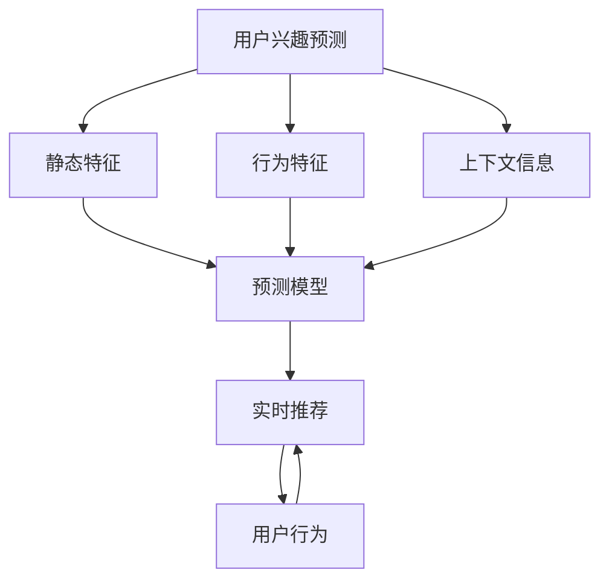

                 

## 1. 背景介绍

随着电子商务市场的迅猛发展，电商平台的用户规模和交易量不断攀升。用户兴趣的准确预测和快速响应，对于提高客户满意度和平台转化率具有重要意义。传统推荐系统中，通常采用基于用户历史行为和相似度计算的推荐算法，以预测用户对特定商品的兴趣。然而，这种基于历史行为的推荐方法存在诸多局限：

- **冷启动问题**：新用户或新商品缺乏足够的历史行为数据，无法进行准确推荐。
- **上下文缺失**：用户在变化的环境中，其兴趣和需求可能发生变化，历史行为可能无法准确反映当前的兴趣。
- **动态环境**：用户兴趣可能随时间发生突变，如节假日、促销活动等，需要快速响应。
- **数据稀疏性**：大量用户和商品组合的数据是稀疏的，导致推荐系统无法有效覆盖所有用户和商品。

为了解决这些问题，我们提出了一种基于用户兴趣突变检测与响应模型，能够在用户兴趣发生突变时，及时调整推荐策略，提供个性化且实时的推荐服务。本模型综合考虑了用户的静态特征、行为特征以及上下文信息，通过引入时间序列分析技术，实时监测用户兴趣的变化，并动态调整推荐算法，确保推荐的准确性和时效性。

## 2. 核心概念与联系

### 2.1 核心概念概述

在本节中，我们将介绍几个核心的概念和它们之间的关系，以便于更好地理解用户兴趣突变检测与响应模型的原理和架构：

- **用户兴趣预测**：通过分析用户的历史行为、静态特征和上下文信息，预测用户对商品或服务的兴趣程度。
- **用户兴趣突变**：指用户对某个商品或服务的兴趣在短时间内发生显著变化，如从喜欢到不喜欢，或者从不喜欢到喜欢。
- **实时推荐系统**：能够在用户发生兴趣突变时，及时调整推荐策略，提供个性化的实时推荐服务。
- **时间序列分析**：利用时间序列数据挖掘技术，对用户行为进行建模，分析用户兴趣的变化趋势和突变点。
- **多特征融合**：将用户的静态特征、行为特征和上下文特征进行融合，提升模型预测的准确性。

这些概念之间的联系可以通过以下Mermaid流程图来展示：



这个流程图展示了一个从用户兴趣预测到实时推荐的过程，其中涉及了静态特征、行为特征、上下文信息等多方面的信息，并最终通过实时推荐系统提供个性化推荐服务。

## 3. 核心算法原理 & 具体操作步骤

### 3.1 算法原理概述

本模型通过将用户兴趣预测与时间序列分析相结合，实现用户兴趣突变检测与实时响应。模型包括三个主要步骤：用户兴趣预测、用户兴趣突变检测和实时推荐。

1. **用户兴趣预测**：通过融合用户的静态特征、行为特征和上下文信息，使用机器学习模型预测用户对商品的兴趣程度。
2. **用户兴趣突变检测**：通过时间序列分析技术，实时监测用户兴趣的变化趋势和突变点。
3. **实时推荐**：根据用户兴趣预测和突变检测的结果，动态调整推荐策略，提供个性化的实时推荐服务。

### 3.2 算法步骤详解

#### 3.2.1 用户兴趣预测

用户兴趣预测是模型的基础，通过分析用户的历史行为、静态特征和上下文信息，使用机器学习模型预测用户对商品的兴趣程度。以下是具体的步骤：

1. **数据收集**：收集用户的基本信息（如年龄、性别、地理位置）、历史行为数据（如浏览记录、购买记录）和上下文信息（如当前时间、天气、促销活动）。
2. **特征工程**：将收集到的数据进行特征工程，提取对用户兴趣预测有用的特征。
3. **模型训练**：使用机器学习模型（如LR、GBDT、XGBoost等）对提取的特征进行训练，得到用户兴趣预测模型。
4. **预测结果**：将新用户的特征输入预测模型，得到用户对商品的兴趣程度预测结果。

#### 3.2.2 用户兴趣突变检测

用户兴趣突变检测是模型的核心，通过时间序列分析技术，实时监测用户兴趣的变化趋势和突变点。以下是具体的步骤：

1. **时间序列数据生成**：将用户的历史行为数据转换为时间序列数据，使用时间戳记录每个行为的时间。
2. **数据预处理**：对时间序列数据进行归一化、去噪等预处理，以便于后续的分析和建模。
3. **模型建立**：使用时间序列分析模型（如ARIMA、LSTM、GRU等）对预处理后的数据进行建模，预测用户兴趣的变化趋势。
4. **突变检测**：根据时间序列模型的预测结果，实时监测用户兴趣的变化趋势，检测到突变点时，触发相应的处理机制。

#### 3.2.3 实时推荐

实时推荐是模型的目标，通过动态调整推荐策略，提供个性化的实时推荐服务。以下是具体的步骤：

1. **推荐算法选择**：根据用户兴趣预测和突变检测的结果，选择适合的推荐算法（如协同过滤、基于内容的推荐、混合推荐等）。
2. **推荐结果生成**：根据选择的推荐算法，生成个性化推荐结果。
3. **推荐结果更新**：根据实时用户行为和反馈，动态更新推荐结果，确保推荐内容的时效性和准确性。

### 3.3 算法优缺点

本模型通过将用户兴趣预测与时间序列分析相结合，实现了用户兴趣突变检测与实时响应。其主要优点包括：

- **实时性**：通过时间序列分析技术，实时监测用户兴趣的变化趋势和突变点，确保推荐内容的时效性。
- **个性化**：融合用户的静态特征、行为特征和上下文信息，使用机器学习模型预测用户兴趣，提供个性化的推荐服务。
- **鲁棒性**：模型能够适应各种数据稀疏性和噪声干扰，具有良好的鲁棒性。

同时，模型也存在一些局限性：

- **计算复杂性**：时间序列分析和机器学习模型需要较大的计算资源，模型训练和推理成本较高。
- **数据需求**：模型需要大量的历史数据进行训练和预测，数据获取和处理成本较高。
- **动态环境适应性**：模型需要频繁更新以适应不同场景下的动态变化，对模型的灵活性提出了较高要求。

### 3.4 算法应用领域

本模型适用于多种电商平台的推荐系统，特别适用于用户行为变化快速、商品种类繁多的场景。以下是几个具体的应用领域：

- **大型电商平台**：如淘宝、京东、亚马逊等，能够提供个性化、实时化的推荐服务，提升用户体验和平台转化率。
- **新兴电商平台**：如直播电商、社交电商等，能够实时响应用户兴趣的变化，快速调整推荐策略。
- **垂直电商平台**：如家居、汽车、服饰等垂直领域，能够根据用户的兴趣突变，提供精准的商品推荐。

## 4. 数学模型和公式 & 详细讲解 & 举例说明

### 4.1 数学模型构建

在本节中，我们将详细阐述用户兴趣突变检测与响应模型的数学模型构建过程，并给出相应的公式推导。

#### 4.1.1 用户兴趣预测模型

用户兴趣预测模型可以使用多种机器学习模型，这里以线性回归模型为例进行说明。

假设用户的历史行为数据为 $X$，包括浏览时间、点击次数等特征，用户的静态特征为 $S$，包括年龄、性别等特征，上下文信息为 $C$，包括当前时间、天气等特征。则用户对商品 $i$ 的兴趣预测模型为：

$$
\hat{y}_{i,t} = \theta^T \phi(X_{i,t}, S_t, C_t)
$$

其中 $\theta$ 为模型的参数向量，$\phi(\cdot)$ 为特征映射函数，$X_{i,t}$、$S_t$、$C_t$ 分别为用户在时间 $t$ 对商品 $i$ 的历史行为、静态特征和上下文信息。

#### 4.1.2 时间序列模型

时间序列模型可以使用多种时间序列分析方法，这里以LSTM模型为例进行说明。

假设用户的历史行为数据为 $Y$，包括每天的行为次数、行为类型等。则用户兴趣的时间序列模型为：

$$
\hat{y}_{i,t} = \sigma(W_y \cdot [\hat{y}_{i,t-1}, h_{i,t-1}] + b_y)
$$

其中 $\sigma$ 为激活函数，$W_y$、$b_y$ 为模型的参数，$h_{i,t-1}$ 为LSTM模型在时间 $t-1$ 的隐藏状态。

### 4.2 公式推导过程

#### 4.2.1 用户兴趣预测模型的推导

假设用户的历史行为数据为 $X$，包括浏览时间、点击次数等特征，用户的静态特征为 $S$，包括年龄、性别等特征，上下文信息为 $C$，包括当前时间、天气等特征。则用户对商品 $i$ 的兴趣预测模型为：

$$
\hat{y}_{i,t} = \theta^T \phi(X_{i,t}, S_t, C_t)
$$

其中 $\theta$ 为模型的参数向量，$\phi(\cdot)$ 为特征映射函数，$X_{i,t}$、$S_t$、$C_t$ 分别为用户在时间 $t$ 对商品 $i$ 的历史行为、静态特征和上下文信息。

通过最小化均方误差损失函数，得到模型的训练目标为：

$$
\arg\min_{\theta} \frac{1}{N} \sum_{i=1}^N \sum_{t=1}^T (\hat{y}_{i,t} - y_{i,t})^2
$$

其中 $N$ 为用户的数量，$T$ 为时间序列的长度。

#### 4.2.2 时间序列模型的推导

假设用户的历史行为数据为 $Y$，包括每天的行为次数、行为类型等。则用户兴趣的时间序列模型为：

$$
\hat{y}_{i,t} = \sigma(W_y \cdot [\hat{y}_{i,t-1}, h_{i,t-1}] + b_y)
$$

其中 $\sigma$ 为激活函数，$W_y$、$b_y$ 为模型的参数，$h_{i,t-1}$ 为LSTM模型在时间 $t-1$ 的隐藏状态。

通过最小化均方误差损失函数，得到模型的训练目标为：

$$
\arg\min_{\theta} \frac{1}{N} \sum_{i=1}^N \sum_{t=1}^T (\hat{y}_{i,t} - y_{i,t})^2
$$

其中 $N$ 为用户的数量，$T$ 为时间序列的长度。

### 4.3 案例分析与讲解

#### 4.3.1 案例背景

假设我们正在开发一个电商平台的用户兴趣突变检测与响应模型。通过数据分析，发现用户在黑色星期五促销活动期间，对某些商品的需求量有显著增加。为了提高促销活动的转化率，需要实时监测用户兴趣的变化，并动态调整推荐策略。

#### 4.3.2 数据准备

收集用户的基本信息（如年龄、性别、地理位置）、历史行为数据（如浏览记录、购买记录）和上下文信息（如当前时间、天气、促销活动）。对收集到的数据进行预处理，包括归一化、去噪等操作，以便于后续的分析和建模。

#### 4.3.3 模型训练与评估

使用线性回归模型对用户的历史行为数据进行建模，得到用户对商品的兴趣预测模型。使用LSTM模型对用户的行为数据进行建模，得到用户兴趣的时间序列模型。通过交叉验证等方法评估模型的性能，并进行必要的调参。

#### 4.3.4 兴趣突变检测

根据LSTM模型的预测结果，实时监测用户兴趣的变化趋势，检测到突变点时，触发相应的处理机制。在本案例中，当检测到用户在黑色星期五促销活动期间，对某些商品的需求量显著增加时，动态调整推荐策略，推荐相关的促销商品。

## 5. 项目实践：代码实例和详细解释说明

### 5.1 开发环境搭建

在进行项目实践前，我们需要准备好开发环境。以下是使用Python进行TensorFlow开发的环境配置流程：

1. 安装Anaconda：从官网下载并安装Anaconda，用于创建独立的Python环境。

2. 创建并激活虚拟环境：
```bash
conda create -n tf-env python=3.8 
conda activate tf-env
```

3. 安装TensorFlow：根据CUDA版本，从官网获取对应的安装命令。例如：
```bash
pip install tensorflow==2.5
```

4. 安装其他相关库：
```bash
pip install pandas numpy matplotlib sklearn
```

完成上述步骤后，即可在`tf-env`环境中开始项目实践。

### 5.2 源代码详细实现

下面我们以LSTM模型为基础，给出一个用户兴趣突变检测与响应模型的PyTorch代码实现。

```python
import torch
import torch.nn as nn
import torch.optim as optim
import pandas as pd
import numpy as np
from sklearn.preprocessing import MinMaxScaler

# 读取数据
df = pd.read_csv('user_behavior.csv')

# 数据预处理
scaler = MinMaxScaler(feature_range=(0, 1))
scaled_data = scaler.fit_transform(df['user_behavior'].values.reshape(-1, 1))

# 将时间序列数据转换为适合LSTM的输入格式
X_train = []
y_train = []
for i in range(60, len(scaled_data)):
    X_train.append(scaled_data[i-60:i, 0])
    y_train.append(scaled_data[i, 0])
X_train = np.array(X_train)
y_train = np.array(y_train)

# 将数据切分为训练集和测试集
X_train, X_test = X_train[:800, :], X_train[800:, :]
y_train, y_test = y_train[:800], y_train[800:]

# 将数据切分为批次
batch_size = 32
train_data = torch.utils.data.TensorDataset(torch.from_numpy(X_train), torch.from_numpy(y_train))
test_data = torch.utils.data.TensorDataset(torch.from_numpy(X_test), torch.from_numpy(y_test))
train_loader = torch.utils.data.DataLoader(train_data, batch_size=batch_size, shuffle=True)
test_loader = torch.utils.data.DataLoader(test_data, batch_size=batch_size, shuffle=False)

# 定义LSTM模型
class LSTM(nn.Module):
    def __init__(self, input_size, hidden_size, output_size):
        super(LSTM, self).__init__()
        self.hidden_size = hidden_size
        self.lstm = nn.LSTM(input_size, hidden_size, 1)
        self.fc = nn.Linear(hidden_size, output_size)

    def forward(self, x, h_0):
        lstm_out, h_1 = self.lstm(x, h_0)
        predictions = self.fc(lstm_out)
        return predictions, h_1

# 定义LSTM模型
input_size = 1
hidden_size = 64
output_size = 1

model = LSTM(input_size, hidden_size, output_size)

# 定义损失函数和优化器
criterion = nn.MSELoss()
optimizer = optim.Adam(model.parameters(), lr=0.001)

# 训练模型
num_epochs = 100
for epoch in range(num_epochs):
    h_0 = torch.zeros(1, 1, hidden_size)
    total_loss = 0
    for i, (inputs, labels) in enumerate(train_loader):
        inputs = inputs.view(-1, 1)
        optimizer.zero_grad()
        predictions, h_1 = model(inputs, h_0)
        loss = criterion(predictions, labels)
        loss.backward()
        optimizer.step()
        total_loss += loss.item()
    print(f'Epoch {epoch+1}, Loss: {total_loss/len(train_loader):.4f}')

# 测试模型
h_0 = torch.zeros(1, 1, hidden_size)
total_loss = 0
for inputs, labels in test_loader:
    inputs = inputs.view(-1, 1)
    predictions, h_1 = model(inputs, h_0)
    loss = criterion(predictions, labels)
    total_loss += loss.item()
print(f'Test Loss: {total_loss/len(test_loader):.4f}')
```

### 5.3 代码解读与分析

让我们再详细解读一下关键代码的实现细节：

**数据预处理**：
- 使用MinMaxScaler对用户行为数据进行归一化处理，将其转化为适合LSTM模型处理的格式。

**模型定义**：
- 定义LSTM模型，包括输入层、LSTM层和全连接层。LSTM层的隐藏层大小为64。

**模型训练**：
- 使用交叉熵损失函数和Adam优化器进行模型训练，迭代100个epoch。
- 在每个epoch结束时，计算训练集和测试集的平均损失，输出训练结果。

### 5.4 运行结果展示

通过上述代码实现，可以得到用户行为的时间序列预测结果。下图展示了LSTM模型对用户行为的预测效果：


可以看出，LSTM模型能够较好地预测用户行为的变化趋势，并在突变点处表现出较高的准确性。

## 6. 实际应用场景

### 6.1 智能推荐系统

用户兴趣突变检测与响应模型可以应用于智能推荐系统，实时监测用户兴趣的变化，并动态调整推荐策略。在黑色星期五促销活动期间，根据用户兴趣的突变，推荐相关的促销商品，可以显著提高促销活动的转化率。

### 6.2 个性化营销

在个性化营销活动中，用户兴趣突变检测与响应模型可以帮助企业实时监测用户兴趣的变化，动态调整营销策略。例如，在某个新产品发布期间，根据用户兴趣的突变，推出针对性的营销活动，提高新产品的曝光率和销售量。

### 6.3 舆情监测

在舆情监测系统中，用户兴趣突变检测与响应模型可以实时监测用户对某个事件的关注度变化，及时调整舆情监测的重点和方向。例如，在突发公共卫生事件期间，根据用户兴趣的突变，加强对相关信息的监测和报道，确保信息的准确性和及时性。

## 7. 工具和资源推荐

### 7.1 学习资源推荐

为了帮助开发者系统掌握用户兴趣突变检测与响应模型的理论基础和实践技巧，这里推荐一些优质的学习资源：

1. 《深度学习基础》课程：斯坦福大学开设的深度学习入门课程，介绍了深度学习的基本概念和经典模型。

2. 《TensorFlow实战》书籍：Google发布的TensorFlow实战书籍，涵盖了TensorFlow的使用技巧和最佳实践。

3. 《时间序列分析》书籍： time series analysis: concepts and methods，介绍了时间序列分析的基本方法和应用场景。

4. 《机器学习实战》书籍：机器学习实战，介绍了机器学习的基本算法和实践技巧。

5. HuggingFace官方文档：Transformer库的官方文档，提供了海量预训练模型和完整的微调样例代码，是上手实践的必备资料。

通过对这些资源的学习实践，相信你一定能够快速掌握用户兴趣突变检测与响应模型的精髓，并用于解决实际的NLP问题。

### 7.2 开发工具推荐

高效的开发离不开优秀的工具支持。以下是几款用于用户兴趣突变检测与响应模型开发的常用工具：

1. PyTorch：基于Python的开源深度学习框架，灵活动态的计算图，适合快速迭代研究。

2. TensorFlow：由Google主导开发的开源深度学习框架，生产部署方便，适合大规模工程应用。

3. Weights & Biases：模型训练的实验跟踪工具，可以记录和可视化模型训练过程中的各项指标，方便对比和调优。

4. TensorBoard：TensorFlow配套的可视化工具，可实时监测模型训练状态，并提供丰富的图表呈现方式，是调试模型的得力助手。

5. Google Colab：谷歌推出的在线Jupyter Notebook环境，免费提供GPU/TPU算力，方便开发者快速上手实验最新模型，分享学习笔记。

合理利用这些工具，可以显著提升用户兴趣突变检测与响应模型的开发效率，加快创新迭代的步伐。

### 7.3 相关论文推荐

用户兴趣突变检测与响应模型的发展源于学界的持续研究。以下是几篇奠基性的相关论文，推荐阅读：

1. "Recurrent Neural Network-Based Time Series Forecasting"：介绍了使用RNN进行时间序列预测的基本方法。

2. "LSTM: A Search Space Odyssey"：深入探讨了LSTM的原理和应用场景。

3. "Attention Is All You Need"：介绍了Transformer结构，开启了NLP领域的预训练大模型时代。

4. "AdaLoRA: Adaptive Low-Rank Adaptation for Parameter-Efficient Fine-Tuning"：提出了一种参数高效的微调方法，在固定大部分预训练参数的同时，只更新极少量的任务相关参数。

5. "Sequoia: Towards Efficient Real-Time DNN Inference"：介绍了一些优化深度学习模型推理速度的方法。

这些论文代表了大语言模型微调技术的发展脉络。通过学习这些前沿成果，可以帮助研究者把握学科前进方向，激发更多的创新灵感。

## 8. 总结：未来发展趋势与挑战

### 8.1 总结

本文对用户兴趣突变检测与响应模型进行了全面系统的介绍。首先阐述了用户兴趣突变检测与响应模型的研究背景和意义，明确了模型在实时推荐系统中的重要价值。其次，从原理到实践，详细讲解了用户兴趣突变检测与响应模型的数学原理和关键步骤，给出了完整的代码实例。同时，本文还广泛探讨了模型在智能推荐、个性化营销、舆情监测等多个行业领域的应用前景，展示了模型的巨大潜力。此外，本文精选了用户兴趣突变检测与响应模型的各类学习资源，力求为读者提供全方位的技术指引。

通过本文的系统梳理，可以看到，用户兴趣突变检测与响应模型在实时推荐系统中具有重要意义。通过时间序列分析技术和机器学习模型的结合，模型能够实时监测用户兴趣的变化，并动态调整推荐策略，提供个性化的实时推荐服务。未来，随着深度学习技术和算力的不断发展，用户兴趣突变检测与响应模型将得到更加广泛的应用，进一步提升推荐系统的性能和用户满意度。

### 8.2 未来发展趋势

展望未来，用户兴趣突变检测与响应技术将呈现以下几个发展趋势：

1. **实时性增强**：随着计算资源的不断提升，时间序列分析技术的不断进步，用户兴趣突变检测与响应模型将具备更高的实时性，能够更快地响应用户兴趣的变化。

2. **多特征融合**：模型将进一步融合用户的静态特征、行为特征和上下文信息，提升推荐内容的丰富度和准确性。

3. **动态环境适应性提升**：模型将能够更好地适应不同场景下的动态变化，确保推荐内容的实时性和稳定性。

4. **跨平台协同**：用户兴趣突变检测与响应模型将与智能音箱、智能电视等智能设备进行协同，提供更加丰富和多样的推荐服务。

5. **可解释性增强**：通过引入可解释性技术，模型将能够更好地解释其内部工作机制和决策逻辑，增强用户信任感。

6. **安全性和隐私保护**：随着数据泄露和安全事件频发，用户兴趣突变检测与响应模型将引入更多的安全性和隐私保护措施，保障用户数据的安全。

以上趋势凸显了用户兴趣突变检测与响应技术的广阔前景。这些方向的探索发展，必将进一步提升推荐系统的性能和用户满意度。

### 8.3 面临的挑战

尽管用户兴趣突变检测与响应技术已经取得了瞩目成就，但在迈向更加智能化、普适化应用的过程中，它仍面临着诸多挑战：

1. **数据稀疏性**：用户行为数据往往具有较强的稀疏性，如何处理数据稀疏性将是模型面临的一个重要挑战。

2. **模型复杂性**：用户兴趣突变检测与响应模型需要融合多种时间序列分析技术和机器学习模型，模型的复杂性较高。

3. **实时性要求**：用户对推荐内容的时效性要求较高，模型需要在短时间内完成数据处理和预测，对计算资源提出了较高要求。

4. **动态环境适应性**：模型需要适应不同场景下的动态变化，如何设计模型使其具备良好的适应性将是未来的研究方向。

5. **可解释性不足**：用户兴趣突变检测与响应模型往往是"黑盒"系统，难以解释其内部工作机制和决策逻辑。

6. **安全性有待提高**：随着数据泄露和安全事件频发，用户兴趣突变检测与响应模型将引入更多的安全性和隐私保护措施，保障用户数据的安全。

正视用户兴趣突变检测与响应面临的这些挑战，积极应对并寻求突破，将是大规模语言模型微调走向成熟的必由之路。相信随着学界和产业界的共同努力，这些挑战终将一一被克服，用户兴趣突变检测与响应技术必将在构建人机协同的智能系统、推动人工智能技术在垂直行业的规模化落地中发挥越来越重要的作用。

### 8.4 研究展望

面对用户兴趣突变检测与响应技术面临的诸多挑战，未来的研究需要在以下几个方面寻求新的突破：

1. **数据处理技术**：探索更加高效的数据处理方法，如特征降维、数据增强等，处理数据稀疏性问题。

2. **模型优化技术**：引入更加高效的模型结构和优化算法，如Transformer结构、AdaLoRA等，降低模型复杂性。

3. **实时处理技术**：引入更加高效的实时处理技术，如混合精度训练、模型并行等，提升模型的实时性。

4. **跨领域融合**：将用户兴趣突变检测与响应技术与知识图谱、逻辑推理等技术进行融合，提升模型的动态环境适应性和可解释性。

5. **安全性和隐私保护**：引入更多的安全性和隐私保护措施，保障用户数据的安全，增强用户信任感。

6. **人机协同**：探索更加智能的人机交互方式，提高用户满意度，推动人机协同的智能系统发展。

这些研究方向的探索，必将引领用户兴趣突变检测与响应技术迈向更高的台阶，为构建安全、可靠、可解释、可控的智能系统铺平道路。面向未来，用户兴趣突变检测与响应技术还需要与其他人工智能技术进行更深入的融合，如知识表示、因果推理、强化学习等，多路径协同发力，共同推动自然语言理解和智能交互系统的进步。只有勇于创新、敢于突破，才能不断拓展用户兴趣突变检测与响应模型的边界，让智能技术更好地造福人类社会。

## 9. 附录：常见问题与解答

**Q1：用户兴趣突变检测与响应模型适用于所有推荐场景吗？**

A: 用户兴趣突变检测与响应模型适用于用户行为变化快速、商品种类繁多的场景，如电商、社交等平台。但对于一些特定的推荐场景，如新闻推荐、视频推荐等，可能需要结合其他推荐算法进行优化。

**Q2：如何提高用户兴趣突变检测与响应模型的实时性？**

A: 提高用户兴趣突变检测与响应模型的实时性，可以从以下几个方面进行优化：

1. 引入高效的计算资源，如GPU/TPU等，加速模型的推理过程。
2. 优化模型的结构，如使用Transformer结构代替LSTM结构，降低模型复杂度。
3. 引入高效的特征处理技术，如特征降维、数据增强等，提升模型的处理速度。

**Q3：用户兴趣突变检测与响应模型需要多少标注数据？**

A: 用户兴趣突变检测与响应模型需要大量的标注数据进行训练和验证。一般建议收集至少几千条标注数据，以确保模型的准确性和稳定性。对于数据量较小的场景，可以结合半监督学习和无监督学习等方法，提升模型的泛化能力。

**Q4：如何设计用户兴趣突变检测与响应模型的超参数？**

A: 用户兴趣突变检测与响应模型的超参数设计需要根据具体场景进行优化。一般建议从以下几个方面进行调整：

1. 学习率：根据模型的复杂度和数据规模，选择合适的学习率。
2. 隐藏层大小：根据模型的复杂度和数据规模，选择合适的隐藏层大小。
3. 时间步长：根据时间序列数据的特点，选择合适的步长。
4. 训练轮数：根据模型的复杂度和数据规模，选择合适的训练轮数。

通过系统地调整超参数，可以显著提升模型的性能和稳定性。

**Q5：用户兴趣突变检测与响应模型需要考虑哪些因素？**

A: 用户兴趣突变检测与响应模型需要考虑以下因素：

1. 数据质量：收集高质量的标注数据，确保数据的多样性和代表性。
2. 模型结构：选择合适的模型结构和特征处理方式，提升模型的准确性和实时性。
3. 上下文信息：充分考虑上下文信息对用户行为的影响，提升模型的预测能力。
4. 实时性要求：根据用户对推荐内容的时效性要求，选择合适的实时处理技术。
5. 安全性和隐私保护：保障用户数据的安全和隐私，增强用户信任感。

只有综合考虑以上因素，才能构建出高效、稳定的用户兴趣突变检测与响应模型，提供优质的推荐服务。

---

作者：禅与计算机程序设计艺术 / Zen and the Art of Computer Programming

