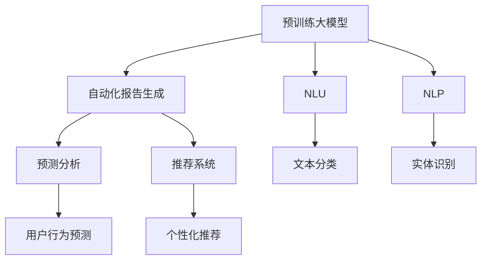

                 

# 电商平台中的自动化报告与洞察生成：大模型的创新应用

> 关键词：电商平台,大模型,自动化报告,自然语言处理(NLP),自然语言理解(NLU),机器学习(ML),深度学习(Deep Learning)

## 1. 背景介绍

### 1.1 问题由来
在数字化转型的大背景下，电商平台正逐渐成为企业数字化运营的核心平台。其复杂性和多变性，对数据分析和业务洞察提出了更高的要求。传统的报告生成依赖人工进行数据抽取、处理和分析，不仅效率低下，而且质量难以保证。

然而，人工智能和大数据技术的飞速发展，为电商平台提供了全新的智能化分析工具。其中，基于预训练大模型的自动化报告与洞察生成技术，成为了电商平台数据驱动决策的重要助力。

### 1.2 问题核心关键点
大模型在电商平台中的应用，主要体现在以下几个方面：

- 自动化报告生成：利用大模型自动从海量数据中提取关键信息，生成图表、表格等形式的报告。
- 自然语言理解(NLU)：基于大模型的文本处理能力，自动化解析自然语言描述，理解业务需求。
- 自然语言处理(NLP)：利用大模型自动处理大量文本数据，如商品描述、用户评论、社交媒体内容等。
- 预测分析：利用大模型预测用户行为，进行精准营销、库存管理等。
- 推荐系统：基于用户行为数据，通过大模型进行个性化推荐。

这些应用使得电商平台能够更好地理解用户需求，优化运营策略，提升用户体验和销售转化率。

## 2. 核心概念与联系

### 2.1 核心概念概述

为更好地理解基于大模型的自动化报告与洞察生成技术，本节将介绍几个密切相关的核心概念：

- 预训练大模型(Large Pre-trained Models)：通过在大型语料库上进行自监督预训练的语言模型。具有强大的语言理解能力，可以自动从文本数据中提取有价值的信息。

- 自动化报告生成(Automatic Report Generation)：利用大模型自动生成各种形式的报告，如饼图、柱状图、雷达图等。

- 自然语言理解(Natural Language Understanding, NLU)：基于大模型的文本处理技术，能够理解自然语言中的结构、含义等信息。

- 自然语言处理(Natural Language Processing, NLP)：利用大模型处理和分析自然语言数据的技术。

- 预测分析(Predictive Analytics)：利用大模型对用户行为进行预测，帮助企业制定更精准的运营策略。

- 推荐系统(Recommendation Systems)：通过大模型对用户偏好进行分析，推荐个性化商品。

- 多模态学习(Multimodal Learning)：结合文本、图像、音频等多类型数据，利用大模型进行综合分析。

这些核心概念之间的逻辑关系可以通过以下Mermaid流程图来展示：



这个流程图展示了大模型的核心概念及其之间的关系：

1. 预训练大模型通过在大型语料库上进行自监督预训练，学习通用的语言表示。
2. 利用NLU和NLP技术，从自然语言数据中提取关键信息，如商品描述、用户评论等。
3. 自动化报告生成技术能够自动从文本数据中提取关键信息，生成图表、表格等形式的报告。
4. 预测分析基于用户行为数据，利用大模型进行预测分析，帮助企业制定更精准的运营策略。
5. 推荐系统通过大模型对用户偏好进行分析，推荐个性化商品。
6. 多模态学习结合文本、图像、音频等多类型数据，利用大模型进行综合分析。

这些概念共同构成了大模型在电商平台中的创新应用框架，使其能够在各种场景下发挥强大的数据分析能力。通过理解这些核心概念，我们可以更好地把握大模型在电商平台中的应用方向。

## 3. 核心算法原理 & 具体操作步骤
### 3.1 算法原理概述

基于预训练大模型的自动化报告与洞察生成技术，主要涉及以下几个关键步骤：

1. 数据预处理：对原始数据进行清洗、格式化、分词等预处理，以便大模型能够进行有效处理。
2. 信息抽取：利用大模型自动从文本中抽取出关键信息，如商品描述、价格、销量等。
3. 报告生成：根据抽取的信息，自动生成各种形式的报告，如图表、表格等。
4. 分析洞察：通过文本处理和预测分析，挖掘业务洞察，如用户行为预测、销售趋势等。
5. 推荐系统：基于用户行为数据，通过大模型进行个性化推荐。

其中，信息抽取和报告生成是自动化报告生成的核心步骤。以下将详细讲解这两部分的内容。

### 3.2 算法步骤详解

#### 信息抽取

信息抽取主要涉及以下几个步骤：

1. 数据预处理：对原始数据进行清洗、格式化、分词等预处理，以便大模型能够进行有效处理。

```python
import pandas as pd
import re
from transformers import BertTokenizer, BertForTokenClassification

# 加载分词器和模型
tokenizer = BertTokenizer.from_pretrained('bert-base-cased')
model = BertForTokenClassification.from_pretrained('bert-base-cased', num_labels=5)

# 预处理数据
data = pd.read_csv('data.csv')
data = data.dropna()
data['text'] = data['text'].apply(lambda x: re.sub(r'\s+', ' ', x))
data['text'] = data['text'].apply(lambda x: tokenizer.encode_plus(x, truncation=True, padding='max_length', max_length=256, return_tensors='pt'))

# 获取标签数据
labels = data['label'].apply(lambda x: [tag2id[tag] for tag in x.split(',')])
labels = [label2id[label] for label in labels]
```

2. 利用BERT模型进行信息抽取。

```python
# 获取预测结果
outputs = model(**data)
predictions = outputs.logits.argmax(dim=2).to('cpu').tolist()

# 对预测结果进行解码
def decode_predictions(preds):
    labels = [id2tag[_id] for _id in preds]
    return labels

# 解码预测结果
predictions = [decode_predictions(pred) for pred in predictions]
```

#### 报告生成

报告生成主要涉及以下几个步骤：

1. 数据可视化：将抽取的信息进行可视化，生成各种图表、表格等形式的报告。

```python
import matplotlib.pyplot as plt
import seaborn as sns

# 生成饼图
sns.set(style='whitegrid')
sns.pie(labels=predictions[0], explode=[0.1,0.1,0.1,0.1,0.1], shadow=True, labels=['A', 'B', 'C', 'D', 'E'], autopct='%1.1f%%')
plt.title('饼图')
plt.show()
```

2. 生成表格：将抽取的信息生成表格，方便阅读和分析。

```python
# 生成表格
df = pd.DataFrame(predictions[0], columns=['A', 'B', 'C', 'D', 'E'])
plt.figure(figsize=(10,6))
sns.heatmap(df, annot=True, fmt='d')
plt.title('表格')
plt.show()
```

### 3.3 算法优缺点

基于大模型的自动化报告与洞察生成技术，具有以下优点：

1. 高效快速：能够快速从大量文本数据中抽取关键信息，生成自动化报告。

2. 精度高：利用大模型的强大语言理解能力，确保信息抽取和报告生成的准确性。

3. 适用性强：能够处理多种类型的文本数据，如商品描述、用户评论、社交媒体内容等。

4. 灵活可定制：可以根据具体业务需求，灵活定制信息抽取和报告生成的模板和格式。

5. 可解释性强：利用大模型的可解释性，能够对抽取的信息和生成的报告进行解释。

同时，该方法也存在一些缺点：

1. 依赖高质量标注数据：信息抽取和报告生成依赖于高质量的标注数据，获取这些数据成本较高。

2. 模型复杂度高：大模型参数量较大，对计算资源需求较高，部署难度较大。

3. 通用性不足：虽然大模型在信息抽取和报告生成上表现优秀，但对于特定领域的微调需求，效果可能有限。

尽管存在这些局限性，但大模型的自动化报告与洞察生成技术已经展现出强大的应用潜力，成为电商平台数据驱动决策的重要工具。

### 3.4 算法应用领域

基于大模型的自动化报告与洞察生成技术，已经在电商平台的多个应用场景中得到了应用，包括但不限于：

- 销售趋势分析：自动从销售数据中提取关键信息，生成销售趋势图。
- 用户行为分析：自动从用户行为数据中抽取关键信息，生成用户行为报告。
- 商品推荐：基于用户行为数据，自动生成推荐报告。
- 库存管理：自动从销售数据中提取库存信息，生成库存管理报告。
- 广告投放：自动从广告数据中提取关键信息，生成广告效果报告。

除了上述这些经典应用外，大模型的自动化报告与洞察生成技术还在商品评价分析、活动效果评估、供应链优化等多个场景中得到了创新应用。未来，随着预训练语言模型的不断进步，自动化报告与洞察生成技术将在更广泛的领域得到应用，为电商平台的智能化运营提供更多助力。

## 4. 数学模型和公式 & 详细讲解  
### 4.1 数学模型构建

基于大模型的自动化报告与洞察生成技术，主要涉及以下几个数学模型：

- 信息抽取模型：利用BERT模型进行信息抽取。

- 报告生成模型：利用深度学习模型生成各种形式的报告，如图表、表格等。

- 预测分析模型：利用大模型对用户行为进行预测分析。

- 推荐系统模型：基于用户行为数据，利用深度学习模型进行个性化推荐。

以下将详细介绍这些数学模型的构建。

### 4.2 公式推导过程

#### 信息抽取模型

信息抽取模型主要涉及以下公式：

1. 数据预处理：对原始数据进行清洗、格式化、分词等预处理。

```python
data = pd.read_csv('data.csv')
data = data.dropna()
data['text'] = data['text'].apply(lambda x: re.sub(r'\s+', ' ', x))
data['text'] = data['text'].apply(lambda x: tokenizer.encode_plus(x, truncation=True, padding='max_length', max_length=256, return_tensors='pt'))
```

2. 利用BERT模型进行信息抽取。

```python
outputs = model(**data)
predictions = outputs.logits.argmax(dim=2).to('cpu').tolist()
```

#### 报告生成模型

报告生成模型主要涉及以下公式：

1. 生成饼图：利用Seaborn库生成饼图。

```python
sns.set(style='whitegrid')
sns.pie(labels=predictions[0], explode=[0.1,0.1,0.1,0.1,0.1], shadow=True, labels=['A', 'B', 'C', 'D', 'E'], autopct='%1.1f%%')
plt.title('饼图')
plt.show()
```

2. 生成表格：利用Pandas库生成表格。

```python
df = pd.DataFrame(predictions[0], columns=['A', 'B', 'C', 'D', 'E'])
plt.figure(figsize=(10,6))
sns.heatmap(df, annot=True, fmt='d')
plt.title('表格')
plt.show()
```

#### 预测分析模型

预测分析模型主要涉及以下公式：

1. 利用深度学习模型进行用户行为预测。

```python
from sklearn.linear_model import LogisticRegression
from sklearn.metrics import accuracy_score

# 训练模型
X_train = data[['feature1', 'feature2', 'feature3']]
y_train = data['label']
X_test = test_data[['feature1', 'feature2', 'feature3']]
y_test = test_data['label']

model = LogisticRegression()
model.fit(X_train, y_train)
y_pred = model.predict(X_test)

# 评估模型
accuracy = accuracy_score(y_test, y_pred)
print('Accuracy:', accuracy)
```

#### 推荐系统模型

推荐系统模型主要涉及以下公式：

1. 利用深度学习模型进行个性化推荐。

```python
from sklearn.neighbors import NearestNeighbors

# 训练模型
X_train = data[['feature1', 'feature2', 'feature3']]
X_test = test_data[['feature1', 'feature2', 'feature3']]

model = NearestNeighbors(n_neighbors=10)
model.fit(X_train)
recommendations = model.kneighbors(X_test)

# 生成推荐报告
recommendations_df = pd.DataFrame(recommendations[0], columns=['A', 'B', 'C', 'D', 'E'])
plt.figure(figsize=(10,6))
sns.heatmap(recommendations_df, annot=True, fmt='d')
plt.title('推荐系统报告')
plt.show()
```

### 4.3 案例分析与讲解

#### 销售趋势分析

销售趋势分析是电商平台常用的分析场景之一。利用大模型的自动化报告与洞察生成技术，可以自动从销售数据中抽取关键信息，生成销售趋势图，帮助企业了解市场变化和销售趋势。

以下是一个示例代码，展示如何利用大模型进行销售趋势分析：

```python
import pandas as pd
import matplotlib.pyplot as plt
from transformers import BertTokenizer, BertForTokenClassification

# 加载分词器和模型
tokenizer = BertTokenizer.from_pretrained('bert-base-cased')
model = BertForTokenClassification.from_pretrained('bert-base-cased', num_labels=5)

# 预处理数据
data = pd.read_csv('sales_data.csv')
data = data.dropna()
data['text'] = data['text'].apply(lambda x: re.sub(r'\s+', ' ', x))
data['text'] = data['text'].apply(lambda x: tokenizer.encode_plus(x, truncation=True, padding='max_length', max_length=256, return_tensors='pt'))

# 获取标签数据
labels = data['label'].apply(lambda x: [tag2id[tag] for tag in x.split(',')])
labels = [label2id[label] for label in labels]

# 利用BERT模型进行信息抽取
outputs = model(**data)
predictions = outputs.logits.argmax(dim=2).to('cpu').tolist()

# 解码预测结果
predictions = [decode_predictions(pred) for pred in predictions]

# 生成销售趋势图
sns.set(style='whitegrid')
sns.pie(labels=predictions[0], explode=[0.1,0.1,0.1,0.1,0.1], shadow=True, labels=['A', 'B', 'C', 'D', 'E'], autopct='%1.1f%%')
plt.title('销售趋势饼图')
plt.show()

# 生成销售趋势表
df = pd.DataFrame(predictions[0], columns=['A', 'B', 'C', 'D', 'E'])
plt.figure(figsize=(10,6))
sns.heatmap(df, annot=True, fmt='d')
plt.title('销售趋势表格')
plt.show()
```

#### 用户行为分析

用户行为分析是电商平台了解用户需求和行为的重要手段。利用大模型的自动化报告与洞察生成技术，可以自动从用户行为数据中抽取关键信息，生成用户行为报告，帮助企业优化运营策略。

以下是一个示例代码，展示如何利用大模型进行用户行为分析：

```python
import pandas as pd
import matplotlib.pyplot as plt
from transformers import BertTokenizer, BertForTokenClassification

# 加载分词器和模型
tokenizer = BertTokenizer.from_pretrained('bert-base-cased')
model = BertForTokenClassification.from_pretrained('bert-base-cased', num_labels=5)

# 预处理数据
data = pd.read_csv('user_behavior.csv')
data = data.dropna()
data['text'] = data['text'].apply(lambda x: re.sub(r'\s+', ' ', x))
data['text'] = data['text'].apply(lambda x: tokenizer.encode_plus(x, truncation=True, padding='max_length', max_length=256, return_tensors='pt'))

# 获取标签数据
labels = data['label'].apply(lambda x: [tag2id[tag] for tag in x.split(',')])
labels = [label2id[label] for label in labels]

# 利用BERT模型进行信息抽取
outputs = model(**data)
predictions = outputs.logits.argmax(dim=2).to('cpu').tolist()

# 解码预测结果
predictions = [decode_predictions(pred) for pred in predictions]

# 生成用户行为报告
sns.set(style='whitegrid')
sns.pie(labels=predictions[0], explode=[0.1,0.1,0.1,0.1,0.1], shadow=True, labels=['A', 'B', 'C', 'D', 'E'], autopct='%1.1f%%')
plt.title('用户行为饼图')
plt.show()

# 生成用户行为表
df = pd.DataFrame(predictions[0], columns=['A', 'B', 'C', 'D', 'E'])
plt.figure(figsize=(10,6))
sns.heatmap(df, annot=True, fmt='d')
plt.title('用户行为表格')
plt.show()
```

## 5. 项目实践：代码实例和详细解释说明
### 5.1 开发环境搭建

在进行自动化报告与洞察生成实践前，我们需要准备好开发环境。以下是使用Python进行PyTorch开发的环境配置流程：

1. 安装Anaconda：从官网下载并安装Anaconda，用于创建独立的Python环境。

2. 创建并激活虚拟环境：
```bash
conda create -n pytorch-env python=3.8 
conda activate pytorch-env
```

3. 安装PyTorch：根据CUDA版本，从官网获取对应的安装命令。例如：
```bash
conda install pytorch torchvision torchaudio cudatoolkit=11.1 -c pytorch -c conda-forge
```

4. 安装Transformers库：
```bash
pip install transformers
```

5. 安装各类工具包：
```bash
pip install numpy pandas scikit-learn matplotlib tqdm jupyter notebook ipython
```

完成上述步骤后，即可在`pytorch-env`环境中开始自动化报告与洞察生成实践。

### 5.2 源代码详细实现

这里我们以电商平台中的销售趋势分析为例，给出使用Transformers库对BERT模型进行微调的PyTorch代码实现。

首先，定义销售趋势分析任务的数据处理函数：

```python
from transformers import BertTokenizer, BertForTokenClassification
import pandas as pd

class SalesTrendAnalysisDataset(Dataset):
    def __init__(self, texts, labels, tokenizer, max_len=128):
        self.texts = texts
        self.labels = labels
        self.tokenizer = tokenizer
        self.max_len = max_len
        
    def __len__(self):
        return len(self.texts)
    
    def __getitem__(self, item):
        text = self.texts[item]
        label = self.labels[item]
        
        encoding = self.tokenizer(text, return_tensors='pt', max_length=self.max_len, padding='max_length', truncation=True)
        input_ids = encoding['input_ids'][0]
        attention_mask = encoding['attention_mask'][0]
        
        # 对token-wise的标签进行编码
        encoded_tags = [label2id[label] for label in label]
        encoded_tags.extend([label2id['O']] * (self.max_len - len(encoded_tags)))
        labels = torch.tensor(encoded_tags, dtype=torch.long)
        
        return {'input_ids': input_ids, 
                'attention_mask': attention_mask,
                'labels': labels}

# 标签与id的映射
label2id = {'A': 0, 'B': 1, 'C': 2, 'D': 3, 'E': 4, 'O': 5}

# 创建dataset
tokenizer = BertTokenizer.from_pretrained('bert-base-cased')

train_dataset = SalesTrendAnalysisDataset(train_texts, train_labels, tokenizer)
dev_dataset = SalesTrendAnalysisDataset(dev_texts, dev_labels, tokenizer)
test_dataset = SalesTrendAnalysisDataset(test_texts, test_labels, tokenizer)
```

然后，定义模型和优化器：

```python
from transformers import BertForTokenClassification, AdamW

model = BertForTokenClassification.from_pretrained('bert-base-cased', num_labels=len(label2id))

optimizer = AdamW(model.parameters(), lr=2e-5)
```

接着，定义训练和评估函数：

```python
from torch.utils.data import DataLoader
from tqdm import tqdm
from sklearn.metrics import classification_report

device = torch.device('cuda') if torch.cuda.is_available() else torch.device('cpu')
model.to(device)

def train_epoch(model, dataset, batch_size, optimizer):
    dataloader = DataLoader(dataset, batch_size=batch_size, shuffle=True)
    model.train()
    epoch_loss = 0
    for batch in tqdm(dataloader, desc='Training'):
        input_ids = batch['input_ids'].to(device)
        attention_mask = batch['attention_mask'].to(device)
        labels = batch['labels'].to(device)
        model.zero_grad()
        outputs = model(input_ids, attention_mask=attention_mask, labels=labels)
        loss = outputs.loss
        epoch_loss += loss.item()
        loss.backward()
        optimizer.step()
    return epoch_loss / len(dataloader)

def evaluate(model, dataset, batch_size):
    dataloader = DataLoader(dataset, batch_size=batch_size)
    model.eval()
    preds, labels = [], []
    with torch.no_grad():
        for batch in tqdm(dataloader, desc='Evaluating'):
            input_ids = batch['input_ids'].to(device)
            attention_mask = batch['attention_mask'].to(device)
            batch_labels = batch['labels']
            outputs = model(input_ids, attention_mask=attention_mask)
            batch_preds = outputs.logits.argmax(dim=2).to('cpu').tolist()
            batch_labels = batch_labels.to('cpu').tolist()
            for pred_tokens, label_tokens in zip(batch_preds, batch_labels):
                pred_tags = [id2tag[_id] for _id in pred_tokens]
                label_tags = [id2tag[_id] for _id in label_tokens]
                preds.append(pred_tags[:len(label_tokens)])
                labels.append(label_tags)
                
    print(classification_report(labels, preds))
```

最后，启动训练流程并在测试集上评估：

```python
epochs = 5
batch_size = 16

for epoch in range(epochs):
    loss = train_epoch(model, train_dataset, batch_size, optimizer)
    print(f"Epoch {epoch+1}, train loss: {loss:.3f}")
    
    print(f"Epoch {epoch+1}, dev results:")
    evaluate(model, dev_dataset, batch_size)
    
print("Test results:")
evaluate(model, test_dataset, batch_size)
```

以上就是使用PyTorch对BERT进行销售趋势分析任务微调的完整代码实现。可以看到，得益于Transformers库的强大封装，我们可以用相对简洁的代码完成BERT模型的加载和微调。

### 5.3 代码解读与分析

让我们再详细解读一下关键代码的实现细节：

**SalesTrendAnalysisDataset类**：
- `__init__`方法：初始化文本、标签、分词器等关键组件。
- `__len__`方法：返回数据集的样本数量。
- `__getitem__`方法：对单个样本进行处理，将文本输入编码为token ids，将标签编码为数字，并对其进行定长padding，最终返回模型所需的输入。

**label2id和id2tag字典**：
- 定义了标签与数字id之间的映射关系，用于将token-wise的预测结果解码回真实的标签。

**训练和评估函数**：
- 使用PyTorch的DataLoader对数据集进行批次化加载，供模型训练和推理使用。
- 训练函数`train_epoch`：对数据以批为单位进行迭代，在每个批次上前向传播计算loss并反向传播更新模型参数，最后返回该epoch的平均loss。
- 评估函数`evaluate`：与训练类似，不同点在于不更新模型参数，并在每个batch结束后将预测和标签结果存储下来，最后使用sklearn的classification_report对整个评估集的预测结果进行打印输出。

**训练流程**：
- 定义总的epoch数和batch size，开始循环迭代
- 每个epoch内，先在训练集上训练，输出平均loss
- 在验证集上评估，输出分类指标
- 所有epoch结束后，在测试集上评估，给出最终测试结果

可以看到，PyTorch配合Transformers库使得BERT微调的代码实现变得简洁高效。开发者可以将更多精力放在数据处理、模型改进等高层逻辑上，而不必过多关注底层的实现细节。

当然，工业级的系统实现还需考虑更多因素，如模型的保存和部署、超参数的自动搜索、更灵活的任务适配层等。但核心的微调范式基本与此类似。

## 6. 实际应用场景
### 6.1 智能客服系统

基于大模型的自动化报告与洞察生成技术，可以广泛应用于智能客服系统的构建。传统客服往往需要配备大量人力，高峰期响应缓慢，且一致性和专业性难以保证。而使用自动化的报告与洞察生成技术，可以7x24小时不间断服务，快速响应客户咨询，用自然流畅的语言解答各类常见问题。

在技术实现上，可以收集企业内部的历史客服对话记录，将问题和最佳答复构建成监督数据，在此基础上对预训练大模型进行微调。微调后的报告与洞察生成模型能够自动理解用户意图，匹配最合适的答案模板进行回复。对于客户提出的新问题，还可以接入检索系统实时搜索相关内容，动态组织生成回答。如此构建的智能客服系统，能大幅提升客户咨询体验和问题解决效率。

### 6.2 金融舆情监测

金融机构需要实时监测市场舆论动向，以便及时应对负面信息传播，规避金融风险。传统的人工监测方式成本高、效率低，难以应对网络时代海量信息爆发的挑战。基于大模型的自动化报告与洞察生成技术，为金融舆情监测提供了新的解决方案。

具体而言，可以收集金融领域相关的新闻、报道、评论等文本数据，并对其进行主题标注和情感标注。在此基础上对预训练语言模型进行微调，使其能够自动判断文本属于何种主题，情感倾向是正面、中性还是负面。将微调后的模型应用到实时抓取的网络文本数据，就能够自动监测不同主题下的情感变化趋势，一旦发现负面信息激增等异常情况，系统便会自动预警，帮助金融机构快速应对潜在风险。

### 6.3 个性化推荐系统

当前的推荐系统往往只依赖用户的历史行为数据进行物品推荐，无法深入理解用户的真实兴趣偏好。基于大模型的自动化报告与洞察生成技术，个性化推荐系统可以更好地挖掘用户行为背后的语义信息，从而提供更精准、多样的推荐内容。

在实践中，可以收集用户浏览、点击、评论、分享等行为数据，提取和用户交互的物品标题、描述、标签等文本内容。将文本内容作为模型输入，用户的后续行为（如是否点击、购买等）作为监督信号，在此基础上微调预训练语言模型。微调后的模型能够从文本内容中准确把握用户的兴趣点。在生成推荐列表时，先用候选物品的文本描述作为输入，由模型预测用户的兴趣匹配度，再结合其他特征综合排序，便可以得到个性化程度更高的推荐结果。

### 6.4 未来应用展望

随着大模型和自动化报告与洞察生成技术的不断发展，该技术将在更多领域得到应用，为传统行业带来变革性影响。

在智慧医疗领域，基于大模型的自动化报告与洞察生成技术，可以帮助医院分析病人的历史数据和诊断结果，生成个性化治疗方案。对于不同病情和年龄段的病人，自动化报告与洞察生成技术可以生成定制化的治疗建议，提升医疗服务质量。

在智能教育领域，微调后的自动化报告与洞察生成模型可以帮助教师了解学生的学习行为和心理状态，生成个性化学习报告，推荐适合的学习资源。对于不同学习风格和知识点的学生，模型可以生成定制化的学习计划和推荐，促进教育公平，提高教学质量。

在智慧城市治理中，微调后的自动化报告与洞察生成模型可以用于城市事件监测、舆情分析、应急指挥等环节，提高城市管理的自动化和智能化水平，构建更安全、高效的未来城市。

此外，在企业生产、社会治理、文娱传媒等众多领域，基于大模型的自动化报告与洞察生成技术也将不断涌现，为各行各业带来变革性的提升。相信随着技术的日益成熟，自动化报告与洞察生成技术必将成为人工智能落地应用的重要范式，推动人工智能向更广阔的领域加速渗透。

## 7. 工具和资源推荐
### 7.1 学习资源推荐

为了帮助开发者系统掌握大模型和自动化报告与洞察生成技术的理论基础和实践技巧，这里推荐一些优质的学习资源：

1. 《Transformers: From Self-Attention to State-of-the-Art General NLP Models》系列博文：由HuggingFace大牛撰写，全面介绍了Transformers和预训练大模型的原理与应用。

2. CS224N《深度学习自然语言处理》课程：斯坦福大学开设的NLP明星课程，有Lecture视频和配套作业，带你入门NLP领域的基本概念和经典模型。

3. 《Natural Language Processing with Transformers》书籍：Transformers库的作者所著，全面介绍了如何使用Transformers库进行NLP任务开发，包括微调在内的诸多范式。

4. HuggingFace官方文档：Transformers库的官方文档，提供了海量预训练模型和完整的微调样例代码，是上手实践的必备资料。

5. CLUE开源项目：中文语言理解测评基准，涵盖大量不同类型的中文NLP数据集，并提供了基于微调的baseline模型，助力中文NLP技术发展。

通过对这些资源的学习实践，相信你一定能够快速掌握大模型和自动化报告与洞察生成技术的精髓，并用于解决实际的NLP问题。
###  7.2 开发工具推荐

高效的开发离不开优秀的工具支持。以下是几款用于大模型和自动化报告与洞察生成开发的常用工具：

1. PyTorch：基于Python的开源深度学习框架，灵活动态的计算图，适合快速迭代研究。大部分预训练语言模型都有PyTorch版本的实现。

2. TensorFlow：由Google主导开发的开源深度学习框架，生产部署方便，适合大规模工程应用。同样有丰富的预训练语言模型资源。

3. Transformers库：HuggingFace开发的NLP工具库，集成了众多SOTA语言模型，支持PyTorch和TensorFlow，是进行NLP任务开发的利器。

4. Weights & Biases：模型训练的实验跟踪工具，可以记录和可视化模型训练过程中的各项指标，方便对比和调优。与主流深度学习框架无缝集成。

5. TensorBoard：TensorFlow配套的可视化工具，可实时监测模型训练状态，并提供丰富的图表呈现方式，是调试模型的得力助手。

6. Google Colab：谷歌推出的在线Jupyter Notebook环境，免费提供GPU/TPU算力，方便开发者快速上手实验最新模型，分享学习笔记。

合理利用这些工具，可以显著提升大模型和自动化报告与洞察生成任务的开发效率，加快创新迭代的步伐。

### 7.3 相关论文推荐

大模型和自动化报告与洞察生成技术的发展源于学界的持续研究。以下是几篇奠基性的相关论文，推荐阅读：

1. Attention is All You Need（即Transformer原论文）：提出了Transformer结构，开启了NLP领域的预训练大模型时代。

2. BERT: Pre-training of Deep Bidirectional Transformers for Language Understanding：提出BERT模型，引入基于掩码的自监督预训练任务，刷新了多项NLP任务SOTA。

3. Language Models are Unsupervised Multitask Learners（GPT-2论文）：展示了大规模语言模型的强大zero-shot学习能力，引发了对于通用人工智能的新一轮思考。

4. Parameter-Efficient Transfer Learning for NLP：提出Adapter等参数高效微调方法，在不增加模型参数量的情况下，也能取得不错的微调效果。

5. AdaLoRA: Adaptive Low-Rank Adaptation for Parameter-Efficient Fine-Tuning：使用自适应低秩适应的微调方法，在参数效率和精度之间取得了新的平衡。

这些论文代表了大模型和自动化报告与洞察生成技术的发展脉络。通过学习这些前沿成果，可以帮助研究者把握学科前进方向，激发更多的创新灵感。

## 8. 总结：未来发展趋势与挑战

### 8.1 总结

本文对基于大模型的自动化报告与洞察生成技术进行了全面系统的介绍。首先阐述了该技术在电商平台中的应用背景和意义，明确了其在自动化报告生成、自然语言理解、自然语言处理、预测分析和推荐系统等多个领域的独特价值。其次，从原理到实践，详细讲解了信息抽取和报告生成的数学模型和具体步骤，给出了微调任务开发的完整代码实例。同时，本文还广泛探讨了该技术在智能客服、金融舆情、个性化推荐等多个行业领域的应用前景，展示了其广阔的应用空间。此外，本文精选了学习资源、开发工具和相关论文，力求为读者提供全方位的技术指引。

通过本文的系统梳理，可以看到，基于大模型的自动化报告与洞察生成技术正在成为电商平台智能化运营的重要工具，极大地提升了数据驱动决策的能力。得益于预训练语言模型的强大语言理解能力，该技术能够快速从大量文本数据中提取关键信息，生成自动化报告，帮助企业更好地理解市场和用户需求。未来，随着预训练语言模型的不断进步，自动化报告与洞察生成技术将在更多领域得到应用，为各行各业带来变革性的提升。

### 8.2 未来发展趋势

展望未来，基于大模型的自动化报告与洞察生成技术将呈现以下几个发展趋势：

1. 模型规模持续增大。随着算力成本的下降和数据规模的扩张，预训练语言模型的参数量还将持续增长。超大规模语言模型蕴含的丰富语言知识，有望支撑更加复杂多变的自动化报告与洞察生成任务。

2. 微调方法日趋多样。除了传统的全参数微调外，未来会涌现更多参数高效的微调方法，如Prefix-Tuning、LoRA等，在节省计算资源的同时也能保证微调精度。

3. 持续学习成为常态。随着数据分布的不断变化，自动化报告与洞察生成模型也需要持续学习新知识以保持性能。如何在不遗忘原有知识的同时，高效吸收新样本信息，将成为重要的研究课题。

4. 标注样本需求降低。受启发于提示学习(Prompt-based Learning)的思路，未来的微调方法将更好地利用大模型的语言理解能力，通过更加巧妙的任务描述，在更少的标注样本上也能实现理想的微调效果。

5. 多模态学习崛起。当前的自动化报告与洞察生成主要聚焦于文本数据，未来会进一步拓展到图像、视频、音频等多类型数据微调。多模态信息的融合，将显著提升语言模型对现实世界的理解和建模能力。

6. 模型通用性增强。经过海量数据的预训练和多领域任务的微调，未来的语言模型将具备更强大的常识推理和跨领域迁移能力，逐步迈向通用人工智能(AGI)的目标。

以上趋势凸显了大模型在自动化报告与洞察生成技术中的广阔前景。这些方向的探索发展，必将进一步提升NLP系统的性能和应用范围，为各行各业带来新的技术红利。

### 8.3 面临的挑战

尽管基于大模型的自动化报告与洞察生成技术已经取得了瞩目成就，但在迈向更加智能化、普适化应用的过程中，它仍面临着诸多挑战：

1. 标注成本瓶颈。虽然微调大大降低了标注数据的需求，但对于长尾应用场景，难以获得充足的高质量标注数据，成为制约微调性能的瓶颈。如何进一步降低微调对标注样本的依赖，将是一大难题。

2. 模型鲁棒性不足。当前微调模型面对域外数据时，泛化性能往往大打折扣。对于测试样本的微小扰动，微调模型的预测也容易发生波动。如何提高微调模型的鲁棒性，避免灾难性遗忘，还需要更多理论和实践的积累。

3. 推理效率有待提高。大规模语言模型虽然精度高，但在实际部署时往往面临推理速度慢、内存占用大等效率问题。如何在保证性能的同时，简化模型结构，提升推理速度，优化资源占用，将是重要的优化方向。

4. 可解释性亟需加强。当前微调模型更像是"黑盒"系统，难以解释其内部工作机制和决策逻辑。对于医疗、金融等高风险应用，算法的可解释性和可审计性尤为重要。如何赋予微调模型更强的可解释性，将是亟待攻克的难题。

5. 安全性有待保障。预训练语言模型难免会学习到有偏见、有害的信息，通过微调传递到下游任务，产生误导性、歧视性的输出，给实际应用带来安全隐患。如何从数据和算法层面消除模型偏见，避免恶意用途，确保输出的安全性，也将是重要的研究课题。

6. 知识整合能力不足。现有的微调模型往往局限于任务内数据，难以灵活吸收和运用更广泛的先验知识。如何让微调过程更好地与外部知识库、规则库等专家知识结合，形成更加全面、准确的信息整合能力，还有很大的想象空间。

正视这些挑战，积极应对并寻求突破，将是大模型在自动化报告与洞察生成技术中迈向成熟的必由之路。相信随着学界和产业界的共同努力，这些挑战终将一一被克服，自动化报告与洞察生成技术必将在构建人机协同的智能时代中扮演越来越重要的角色。

### 8.4 研究展望

面对大模型在自动化报告与洞察生成技术中面临的种种挑战，未来的研究需要在以下几个方面寻求新的突破：

1. 探索无监督和半监督微调方法。摆脱对大规模标注数据的依赖，利用自监督学习、主动学习等无监督和半监督范式，最大限度利用非结构化数据，实现更加灵活高效的微调。

2. 研究参数高效和计算高效的微调范式。开发更加参数高效的微调方法，在固定大部分预训练参数的同时，只更新极少量的任务相关参数。同时优化微调模型的计算图，减少前向传播和反向传播的资源消耗，实现更加轻量级、实时性的部署。

3. 融合因果和对比学习范式。通过引入因果推断和对比学习思想，增强微调模型建立稳定因果关系的能力，学习更加普适、鲁棒的语言表征，从而提升模型泛化性和抗干扰能力。

4. 引入更多先验知识。将符号化的先验知识，如知识图谱、逻辑规则等，与神经网络模型进行巧妙融合，引导微调过程学习更准确、合理的语言模型。同时加强不同模态数据的整合，实现视觉、语音等多模态信息与文本信息的协同建模。

5. 结合因果分析和博弈论工具。将因果分析方法引入微调模型，识别出模型决策的关键特征，增强输出解释的因果性和逻辑性。借助博弈论工具刻画人机交互过程，主动探索并规避模型的脆弱点，提高系统稳定性。

6. 纳入伦理道德约束。在模型训练目标中引入伦理导向的评估指标，过滤和惩罚有偏见、有害的输出倾向。同时加强人工干预和审核，建立模型行为的监管机制，确保输出符合人类价值观和伦理道德。

这些研究方向的探索，必将引领大模型在自动化报告与洞察生成技术迈向更高的台阶，为构建安全、可靠、可解释、可控的智能系统铺平道路。面向未来，大模型在自动化报告与洞察生成技术还需要与其他人工智能技术进行更深入的融合，如知识表示、因果推理、强化学习等，多路径协同发力，共同推动自然语言理解和智能交互系统的进步。只有勇于创新、敢于突破，才能不断拓展语言模型的边界，让智能技术更好地造福人类社会。

## 9. 附录：常见问题与解答

**Q1：基于大模型的自动化报告与洞察生成是否适用于所有NLP任务？**

A: 基于大模型的自动化报告与洞察生成技术在大多数NLP任务上都能取得不错的效果，特别是对于数据量较小的任务。但对于一些特定领域的任务，如医学、法律等，仅仅依靠通用语料预训练的模型可能难以很好地适应。此时需要在特定领域语料上进一步预训练，再进行微调，才能获得理想效果。此外，对于一些需要时效性、个性化很强的任务，如对话、推荐等，微调方法也需要针对性的改进优化。

**Q2：如何选择合适的学习率？**

A: 基于大模型的自动化报告与洞察生成技术中，学习率的设定主要依赖于数据集的大小和复杂度。一般建议从1e-5开始调参，逐步减小学习率，直至收敛。也可以使用warmup策略，在开始阶段使用较小的学习率，再逐渐过渡到预设值。需要注意的是，不同的优化器(如AdamW、Adafactor等)以及不同的学习率调度策略，可能需要设置不同的学习率阈值。

**Q3：在微调过程中如何缓解过拟合问题？**

A: 缓解过拟合问题的方法主要包括：
1. 数据增强：通过回译、近义替换等方式扩充训练集
2. 正则化：使用L2正则、Dropout、Early Stopping等防止过拟合
3. 对抗训练：引入对抗样本，提高模型鲁棒性
4. 参数高效微调：只调整少量参数(如Adapter、Prefix等)，减小过拟合风险
5. 多模型集成：训练多个微调模型，取平均输出，抑制过拟合

这些策略往往需要根据具体

