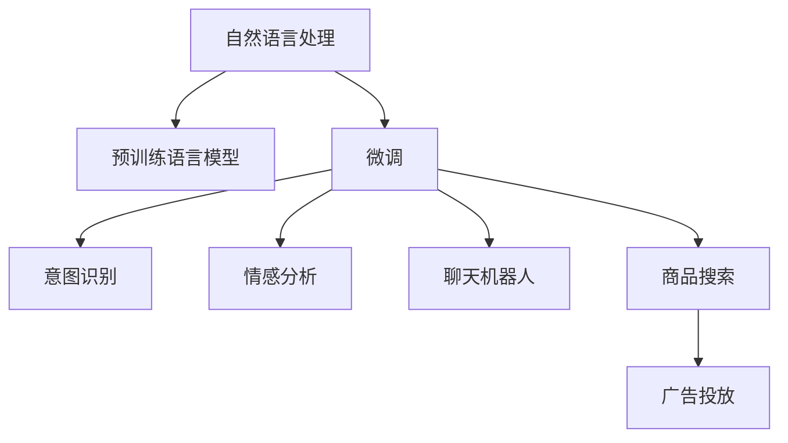

                 

# 电商平台中的自然语言处理应用实践

## 1. 背景介绍

### 1.1 问题由来

随着电商平台的迅速发展，用户的购物体验和满意度成为商家和平台的核心关注点。自然语言处理(Natural Language Processing, NLP)技术在电商平台中的应用，通过用户的评论、搜索、聊天等文本数据，能够帮助商家更好地理解用户需求、优化商品描述、提升客户服务质量，从而提升整体运营效率和用户满意度。

近年来，随着深度学习和大规模预训练语言模型的兴起，自然语言处理在电商领域的应用也取得了显著进展。基于Transformer架构的BERT、GPT-2、T5等大语言模型在电商平台中得到了广泛应用，为电商企业的运营带来了革命性的变化。

### 1.2 问题核心关键点

电商平台中的自然语言处理应用主要聚焦于以下几个核心关键点：

- **评论分析**：分析用户评论文本，提取情感倾向、评分、关键词等有价值信息，帮助商家及时优化商品和服务。
- **意图识别**：识别用户搜索和聊天中的意图，提供更精准的商品推荐和服务。
- **问答系统**：构建智能问答系统，快速解答用户咨询，提升客户体验。
- **商品搜索**：优化商品搜索算法，使搜索结果更加符合用户查询意图。
- **广告投放**：通过NLP技术优化广告投放策略，提高广告效果和转化率。

这些核心点构成了电商平台NLP应用的主要技术框架，通过对这些关键任务的深入探索，可以有效提升电商平台的智能化水平和运营效率。

### 1.3 问题研究意义

在电商领域应用自然语言处理技术，具有重要意义：

- **提升用户体验**：通过个性化推荐、智能客服等功能，提升用户购物体验和满意度。
- **优化运营效率**：通过自动评论分析、意图识别等，帮助商家快速响应市场需求，提高运营效率。
- **提高商业决策**：通过分析用户行为数据，提供更准确的商业洞察，辅助决策制定。
- **拓展应用场景**：NLP技术可以应用于搜索、广告、推荐等多个环节，为电商平台的创新提供技术支撑。
- **加速业务升级**：通过引入先进的NLP技术，电商平台可以实现业务模式和技术体系的升级，加速数字化转型。

## 2. 核心概念与联系

### 2.1 核心概念概述

为了更好地理解电商平台中自然语言处理的应用实践，本节将介绍几个密切相关的核心概念：

- **自然语言处理**：指通过计算机技术，使计算机能够理解、处理和生成人类语言的技术。主要涉及文本分类、命名实体识别、情感分析、机器翻译、问答系统等任务。
- **预训练语言模型**：如BERT、GPT等，通过在大规模无标签文本数据上自监督训练，学习到通用的语言表示，具备强大的语言理解和生成能力。
- **微调**：基于预训练语言模型的迁移学习范式，通过有监督地训练优化模型在特定任务上的性能。
- **意图识别**：识别用户输入的自然语言文本中的意图，帮助系统理解用户需求，做出相应回应。
- **情感分析**：分析文本中的情感倾向，识别用户对商品或服务的情感评价，辅助商家优化产品。
- **聊天机器人**：基于深度学习技术构建的智能客服系统，能够理解用户语言并做出智能回复。
- **商品搜索**：优化搜索算法，提升搜索结果的相关性和准确性，满足用户的查询需求。

这些核心概念之间的逻辑关系可以通过以下Mermaid流程图来展示：



这个流程图展示了大语言模型在电商平台中的核心应用场景及其相互关系。

## 3. 核心算法原理 & 具体操作步骤

### 3.1 算法原理概述

在电商平台中应用自然语言处理技术，主要涉及以下几个核心步骤：

1. **数据准备**：收集用户评论、搜索查询、聊天记录等文本数据，并进行清洗和标注。
2. **预训练模型选择**：选择合适的预训练语言模型（如BERT、GPT等），作为模型初始化参数。
3. **微调优化**：在预训练模型的基础上，利用用户标注数据，通过有监督学习优化模型在特定任务上的性能。
4. **特征提取与模型集成**：提取特征、设计模型架构、进行模型集成和优化，构建电商平台的NLP应用系统。

### 3.2 算法步骤详解

**Step 1: 数据准备**

电商平台的自然语言处理任务数据主要来源于以下几个渠道：

- **用户评论**：包含用户对商品的评价、评分、描述等。
- **搜索查询**：用户在平台上输入的关键词和短语。
- **聊天记录**：用户与客服的对话记录。
- **商品描述**：产品说明书、商品标签等文本信息。

数据收集后，需要进行预处理：去除无关字符、分词、停用词过滤、词性标注、实体识别等，以便于后续分析。

**Step 2: 预训练模型选择**

选择适合的预训练语言模型作为模型初始化参数，是NLP应用的基础。常见的预训练模型包括BERT、GPT-2、XLNet等，其中BERT以其优异的性能和广泛的适用性在电商领域得到了广泛应用。

**Step 3: 微调优化**

微调是电商平台NLP应用的核心步骤，主要包括以下几个关键点：

1. **任务适配**：根据具体应用场景，设计相应的任务适配层，如分类头、解码器等。
2. **损失函数设计**：选择合适的损失函数，如交叉熵、余弦相似度等。
3. **训练策略**：设置学习率、优化器、批次大小、迭代轮数等超参数。
4. **模型评估**：定期在验证集上评估模型性能，根据性能指标决定是否停止训练。
5. **参数更新**：根据损失函数的梯度，更新模型参数。

**Step 4: 特征提取与模型集成**

在电商平台的NLP应用中，特征提取和模型集成是提升性能的重要手段：

- **特征提取**：通过编码器、BERT等模型提取文本特征，如TF-IDF、词向量等。
- **模型集成**：通过集成多个模型的输出，提高系统准确性和鲁棒性。

### 3.3 算法优缺点

电商平台的自然语言处理应用具有以下优点：

1. **数据来源丰富**：电商平台用户数量庞大，产生了大量的文本数据，为NLP应用提供了丰富的数据来源。
2. **任务场景明确**：电商平台的NLP任务场景相对明确，如评论分析、意图识别、搜索优化等，有助于模型的定向优化。
3. **实时性要求高**：电商平台对NLP应用实时性要求高，这要求模型具备高效的推理能力。
4. **数据隐私保护**：电商平台的用户数据隐私保护要求严格，需要考虑模型的可解释性和数据隐私问题。

同时，该方法也存在一些局限性：

1. **标注成本高**：用户评论、聊天记录等数据需要大量标注，标注成本较高。
2. **过拟合风险**：电商平台的文本数据分布可能不均匀，模型容易过拟合。
3. **模型复杂度高**：大模型往往参数量巨大，需要较强的计算资源和存储能力。
4. **数据隐私风险**：电商平台的用户数据涉及隐私，模型设计和应用需要严格遵守隐私保护政策。

尽管存在这些局限性，但基于预训练语言模型的微调方法仍是目前电商平台NLP应用的主流范式。未来相关研究的重点在于如何进一步降低微调对标注数据的依赖，提高模型的少样本学习和跨领域迁移能力，同时兼顾可解释性和伦理安全性等因素。

### 3.4 算法应用领域

电商平台中的自然语言处理应用，主要集中在以下几个领域：

- **评论分析**：如情感分析、评分预测、关键词提取等，帮助商家理解用户反馈，优化商品和服务。
- **意图识别**：如搜索意图识别、聊天意图识别等，提升用户查询和服务的准确性和个性化水平。
- **问答系统**：构建智能客服系统，自动解答用户咨询，提升客户满意度。
- **商品搜索**：如查询意图理解、关键词匹配、结果排序等，提升搜索体验和精准度。
- **广告投放**：通过情感分析和用户行为分析，优化广告投放策略，提高广告效果和转化率。
- **推荐系统**：通过情感分析和用户评论，优化商品推荐算法，提升用户体验和购买转化率。

这些应用领域展示了NLP技术在电商平台中的广阔应用前景，为电商企业的运营带来了显著的效益。

## 4. 数学模型和公式 & 详细讲解 & 举例说明

### 4.1 数学模型构建

在电商平台中，自然语言处理应用主要涉及文本分类、情感分析、意图识别等任务。以情感分析为例，设预训练模型为 $M_{\theta}$，输入为 $x$，输出为 $y$，情感标签为 $\{1, -1\}$。定义损失函数 $\ell(M_{\theta}(x), y)$，表示模型输出与真实标签的差异。在训练过程中，通过最小化损失函数 $\mathcal{L}(\theta)$ 来优化模型参数 $\theta$。

### 4.2 公式推导过程

以下以情感分析任务为例，推导基于BERT模型的情感分析损失函数及其梯度计算公式。

假设BERT模型输入文本为 $x$，输出为 $h \in \mathbb{R}^d$，情感标签为 $y \in \{1, -1\}$。使用二分类交叉熵损失函数，定义为：

$$
\ell(M_{\theta}(x), y) = -[y \log \sigma(h) + (1-y) \log (1-\sigma(h))]
$$

其中 $\sigma(\cdot)$ 为sigmoid函数，用于将模型输出映射到 $[0, 1]$ 区间。

在训练过程中，利用反向传播算法计算梯度，更新模型参数 $\theta$。设学习率为 $\eta$，优化器为Adam，则参数更新公式为：

$$
\theta \leftarrow \theta - \eta \nabla_{\theta}\mathcal{L}(\theta)
$$

其中 $\nabla_{\theta}\mathcal{L}(\theta)$ 为损失函数对参数 $\theta$ 的梯度，通过自动微分技术高效计算。

### 4.3 案例分析与讲解

假设电商平台上有一篇用户评论："I really love this product, it's amazing!"。使用BERT模型对其情感进行分析，步骤如下：

1. **预处理**：将评论文本进行分词、清洗、标记，转换成BERT模型的输入格式。
2. **特征提取**：通过BERT模型提取评论文本的向量表示。
3. **情感分类**：将向量表示输入到分类器，输出情感标签 $y$。
4. **模型训练**：使用标注数据对模型进行训练，最小化损失函数 $\mathcal{L}(\theta)$。
5. **模型评估**：在验证集上评估模型性能，调整超参数。
6. **实际应用**：将训练好的模型部署到电商平台上，实时处理用户评论，提升商品推荐和广告投放的效果。

## 5. 项目实践：代码实例和详细解释说明

### 5.1 开发环境搭建

在进行电商平台的自然语言处理应用开发前，我们需要准备好开发环境。以下是使用Python进行PyTorch开发的环境配置流程：

1. 安装Anaconda：从官网下载并安装Anaconda，用于创建独立的Python环境。

2. 创建并激活虚拟环境：
```bash
conda create -n ecommerce-env python=3.8 
conda activate ecommerce-env
```

3. 安装PyTorch：根据CUDA版本，从官网获取对应的安装命令。例如：
```bash
conda install pytorch torchvision torchaudio cudatoolkit=11.1 -c pytorch -c conda-forge
```

4. 安装HuggingFace Transformers库：
```bash
pip install transformers
```

5. 安装各类工具包：
```bash
pip install numpy pandas scikit-learn matplotlib tqdm jupyter notebook ipython
```

完成上述步骤后，即可在`ecommerce-env`环境中开始项目实践。

### 5.2 源代码详细实现

以下是使用PyTorch和Transformers库进行电商评论情感分析的Python代码实现：

```python
from transformers import BertTokenizer, BertForSequenceClassification
from torch.utils.data import Dataset, DataLoader
from torch.nn import CrossEntropyLoss
import torch
import torch.optim as optim

# 定义数据集类
class EcommerceDataset(Dataset):
    def __init__(self, texts, labels):
        self.texts = texts
        self.labels = labels
        self.tokenizer = BertTokenizer.from_pretrained('bert-base-uncased')

    def __len__(self):
        return len(self.texts)

    def __getitem__(self, item):
        text = self.texts[item]
        label = self.labels[item]
        encoding = self.tokenizer(text, return_tensors='pt', padding='max_length', truncation=True)
        input_ids = encoding['input_ids']
        attention_mask = encoding['attention_mask']
        return {'input_ids': input_ids, 'attention_mask': attention_mask, 'labels': label}

# 定义模型和优化器
model = BertForSequenceClassification.from_pretrained('bert-base-uncased', num_labels=2)
optimizer = optim.AdamW(model.parameters(), lr=2e-5)
criterion = CrossEntropyLoss()

# 训练函数
def train_epoch(model, dataset, batch_size, optimizer, device):
    dataloader = DataLoader(dataset, batch_size=batch_size, shuffle=True)
    model.to(device)
    model.train()
    total_loss = 0
    for batch in dataloader:
        input_ids = batch['input_ids'].to(device)
        attention_mask = batch['attention_mask'].to(device)
        labels = batch['labels'].to(device)
        outputs = model(input_ids, attention_mask=attention_mask)
        loss = criterion(outputs.logits, labels)
        total_loss += loss.item()
        loss.backward()
        optimizer.step()
        optimizer.zero_grad()
    return total_loss / len(dataloader)

# 评估函数
def evaluate(model, dataset, batch_size, device):
    dataloader = DataLoader(dataset, batch_size=batch_size)
    model.eval()
    total_loss = 0
    total_correct = 0
    with torch.no_grad():
        for batch in dataloader:
            input_ids = batch['input_ids'].to(device)
            attention_mask = batch['attention_mask'].to(device)
            labels = batch['labels'].to(device)
            outputs = model(input_ids, attention_mask=attention_mask)
            loss = criterion(outputs.logits, labels)
            total_loss += loss.item()
            total_correct += (outputs.logits.argmax(dim=1) == labels).sum().item()
    return total_loss / len(dataloader), total_correct / len(dataset)

# 主程序
if __name__ == '__main__':
    # 准备数据集
    train_dataset = EcommerceDataset(train_texts, train_labels)
    val_dataset = EcommerceDataset(val_texts, val_labels)
    test_dataset = EcommerceDataset(test_texts, test_labels)

    # 训练模型
    epochs = 5
    batch_size = 16
    device = torch.device('cuda') if torch.cuda.is_available() else torch.device('cpu')
    for epoch in range(epochs):
        loss = train_epoch(model, train_dataset, batch_size, optimizer, device)
        print(f'Epoch {epoch+1}, train loss: {loss:.3f}')
        val_loss, val_correct = evaluate(model, val_dataset, batch_size, device)
        print(f'Epoch {epoch+1}, val loss: {val_loss:.3f}, val acc: {val_correct:.3f}')

    # 评估模型
    test_loss, test_correct = evaluate(model, test_dataset, batch_size, device)
    print(f'Test loss: {test_loss:.3f}, test acc: {test_correct:.3f}')

    # 保存模型
    torch.save(model.state_dict(), 'bert_ecommerce_model.pth')
```

### 5.3 代码解读与分析

让我们再详细解读一下关键代码的实现细节：

**EcommerceDataset类**：
- `__init__`方法：初始化数据集，加载评论文本和标签。
- `__len__`方法：返回数据集的样本数量。
- `__getitem__`方法：对单个样本进行处理，将文本输入转换为BERT模型所需的格式，并返回输入特征和标签。

**模型和优化器**：
- `BertForSequenceClassification`：用于构建二分类任务的BERT模型。
- `AdamW`：优化器，用于更新模型参数。
- `CrossEntropyLoss`：损失函数，用于计算分类任务的损失。

**训练和评估函数**：
- `train_epoch`：对数据以批为单位进行迭代，在每个批次上前向传播计算loss并反向传播更新模型参数。
- `evaluate`：与训练类似，不同点在于不更新模型参数，并在每个batch结束后将预测和标签结果存储下来，最后使用分类指标评估模型性能。

**主程序**：
- 定义训练和评估的超参数，如epoch数和batch size。
- 在训练过程中，每轮迭代在训练集上计算loss，并在验证集上评估模型性能。
- 在测试集上评估最终模型性能，保存模型权重。

通过上述代码实现，可以看出使用PyTorch和Transformers库进行电商评论情感分析的便捷性和高效性。

## 6. 实际应用场景

### 6.1 智能客服系统

智能客服系统是电商平台中重要的用户服务工具，能够通过自动化问答，提升客户体验和满意度。使用自然语言处理技术，可以实现智能客服系统的构建。

具体而言，智能客服系统通过收集用户的咨询文本，进行意图识别和情感分析，选择合适的回复模板进行回答。对于复杂查询，还可以通过上下文理解，调用外部知识库和专家系统，提供更精准的解答。

### 6.2 个性化推荐系统

个性化推荐系统是电商平台中提升用户体验和转化率的重要手段。通过自然语言处理技术，可以更深入地理解用户需求和偏好，提供更精准的商品推荐。

具体而言，个性化推荐系统通过分析用户评论和搜索记录，提取关键词、情感倾向等信息，进行情感分析和意图识别，生成更符合用户需求的推荐结果。此外，还可以通过用户行为数据，优化推荐算法，提升推荐效果。

### 6.3 广告投放优化

广告投放是电商平台中重要的盈利手段。通过自然语言处理技术，可以优化广告投放策略，提升广告效果和转化率。

具体而言，广告投放系统通过分析用户评论、搜索记录等文本数据，进行情感分析、关键词提取等处理，筛选出潜在的目标用户，优化广告内容和投放策略。同时，还可以通过用户行为数据，实时调整广告投放，提升广告效果。

### 6.4 未来应用展望

随着自然语言处理技术的不断进步，电商平台中的NLP应用也将迎来更多创新和突破。以下是几个未来展望：

1. **多模态NLP**：结合图像、语音等多模态信息，构建更全面、精准的电商平台NLP应用。
2. **用户生成内容分析**：分析用户生成内容（如商品评论、用户评价等），提取有价值的信息，优化商品和服务。
3. **社交媒体分析**：通过分析社交媒体上的用户评论和反馈，提升电商平台的运营效率和用户满意度。
4. **推荐系统升级**：通过引入自然语言处理技术，优化推荐算法，提升推荐效果和用户体验。
5. **客户行为分析**：分析用户行为数据，提供更精准的用户画像和推荐策略。

这些展望展示了自然语言处理技术在电商平台中的广阔应用前景，为电商企业的运营带来了更多的创新和提升空间。

## 7. 工具和资源推荐

### 7.1 学习资源推荐

为了帮助开发者系统掌握自然语言处理技术在电商平台中的应用，这里推荐一些优质的学习资源：

1. 《Python深度学习》：介绍深度学习的基本概念和实现，涵盖NLP应用的常见算法和框架。
2. 《Natural Language Processing with Python》：介绍自然语言处理的经典技术和算法，使用Python实现。
3. 《Attention is All You Need》：Transformer架构的原创论文，介绍了自注意力机制的基本原理和应用。
4. 《HuggingFace Transformers》：介绍Transformers库的使用和应用，包括电商平台的NLP任务实现。
5. 《Natural Language Processing in Action》：介绍自然语言处理的基本技术和应用，结合实际项目进行讲解。

通过学习这些资源，相信你一定能够快速掌握自然语言处理技术在电商平台中的应用。

### 7.2 开发工具推荐

高效的开发离不开优秀的工具支持。以下是几款用于电商平台NLP应用开发的常用工具：

1. PyTorch：基于Python的开源深度学习框架，灵活动态的计算图，适合快速迭代研究。
2. TensorFlow：由Google主导开发的开源深度学习框架，生产部署方便，适合大规模工程应用。
3. HuggingFace Transformers库：提供丰富的预训练语言模型和NLP任务实现，是进行电商NLP任务开发的利器。
4. Weights & Biases：模型训练的实验跟踪工具，可以记录和可视化模型训练过程中的各项指标。
5. TensorBoard：TensorFlow配套的可视化工具，可实时监测模型训练状态，并提供丰富的图表呈现方式。

合理利用这些工具，可以显著提升电商平台的NLP应用开发效率，加快创新迭代的步伐。

### 7.3 相关论文推荐

自然语言处理在电商平台中的应用研究源于学界的持续研究。以下是几篇奠基性的相关论文，推荐阅读：

1. Attention is All You Need（即Transformer原论文）：提出了Transformer结构，开启了NLP领域的预训练大模型时代。
2. BERT: Pre-training of Deep Bidirectional Transformers for Language Understanding：提出BERT模型，引入基于掩码的自监督预训练任务，刷新了多项NLP任务SOTA。
3. Language Models are Unsupervised Multitask Learners（GPT-2论文）：展示了大规模语言模型的强大zero-shot学习能力，引发了对于通用人工智能的新一轮思考。
4. Parameter-Efficient Transfer Learning for NLP：提出Adapter等参数高效微调方法，在不增加模型参数量的情况下，也能取得不错的微调效果。
5. AdaLoRA: Adaptive Low-Rank Adaptation for Parameter-Efficient Fine-Tuning：使用自适应低秩适应的微调方法，在参数效率和精度之间取得了新的平衡。

这些论文代表了大语言模型在电商平台中的发展和应用方向。通过学习这些前沿成果，可以帮助研究者把握学科前进方向，激发更多的创新灵感。

## 8. 总结：未来发展趋势与挑战

### 8.1 总结

本文对电商平台中自然语言处理应用进行了全面系统的介绍。首先阐述了电商平台的自然语言处理应用的现状和重要性，明确了微调在电商平台的运营优化和用户满意度提升方面的独特价值。其次，从原理到实践，详细讲解了微调的数学原理和关键步骤，给出了电商评论情感分析的完整代码实例。同时，本文还广泛探讨了自然语言处理技术在电商平台中的多种应用场景，展示了微调范式的巨大潜力。

通过本文的系统梳理，可以看到，自然语言处理技术在电商平台中的应用前景广阔，为电商企业的运营带来了显著的效益。未来，伴随预训练语言模型和微调方法的持续演进，自然语言处理技术将在更多领域得到应用，为电商平台的数字化转型和智能化升级提供重要支持。

### 8.2 未来发展趋势

展望未来，电商平台中的自然语言处理应用将呈现以下几个发展趋势：

1. **数据的多样化和融合**：结合图像、语音等多模态数据，构建更全面、精准的电商平台NLP应用。
2. **模型的多任务和多模态学习**：通过多任务和多模态学习，提升模型的泛化能力和鲁棒性。
3. **模型的自适应和自优化**：通过动态调整模型参数和结构，提高模型的实时性和适应性。
4. **模型的可解释性和透明性**：增强模型的可解释性和透明性，提升用户对系统的信任和满意度。
5. **模型的伦理和隐私保护**：在模型设计中引入伦理导向和隐私保护机制，确保用户数据的安全和隐私。

这些趋势凸显了自然语言处理技术在电商平台中的广泛应用前景，为电商平台的创新和升级提供了更多的技术支持。

### 8.3 面临的挑战

尽管自然语言处理技术在电商平台中取得了显著进展，但在迈向更加智能化、普适化应用的过程中，仍面临诸多挑战：

1. **数据质量和标注成本**：电商平台的文本数据分布不均匀，标注数据的质量和成本较高。如何降低标注成本，提升数据质量，是未来研究的重点。
2. **模型的泛化能力和鲁棒性**：模型在实际应用中面临多种数据噪声和干扰，泛化能力和鲁棒性有待提升。
3. **模型的实时性和资源消耗**：电商平台的实时性和资源消耗要求高，如何优化模型结构和计算图，提升推理速度，是未来研究的难点。
4. **模型的可解释性和透明性**：电商平台的自然语言处理应用需要高可解释性和透明性，如何赋予模型更强的解释能力，是未来研究的方向。
5. **模型的伦理和隐私保护**：电商平台的用户数据涉及隐私，如何设计伦理导向的模型，保护用户隐私，是未来研究的重点。

这些挑战需要学界和产业界的共同努力，不断优化模型设计、算法实现和系统部署，才能让自然语言处理技术更好地服务于电商平台，提升用户的购物体验和满意度。

### 8.4 研究展望

面对自然语言处理在电商平台中面临的诸多挑战，未来的研究需要在以下几个方面寻求新的突破：

1. **无监督和半监督学习**：探索无监督和半监督学习方法，摆脱对大规模标注数据的依赖，利用非结构化数据进行自然语言处理。
2. **多任务和多模态学习**：结合多任务和多模态学习，提升模型的泛化能力和鲁棒性，更好地适应电商平台的复杂场景。
3. **模型的自适应和自优化**：通过动态调整模型参数和结构，提高模型的实时性和适应性，满足电商平台的实时需求。
4. **模型的可解释性和透明性**：通过引入因果分析、博弈论等工具，增强模型的可解释性和透明性，提升用户对系统的信任和满意度。
5. **模型的伦理和隐私保护**：在模型设计中引入伦理导向和隐私保护机制，确保用户数据的安全和隐私，构建可信、安全的电商平台。

这些研究方向的探索，必将引领自然语言处理技术在电商平台中的应用迈向更高的台阶，为电商平台的智能化升级提供更强大的技术支撑。

## 9. 附录：常见问题与解答

**Q1：电商平台中的自然语言处理应用是否仅限于文本分析？**

A: 电商平台中的自然语言处理应用主要集中在文本分析上，如评论分析、意图识别、情感分析等。但也可以结合图像、语音等多模态数据，进行更全面的分析。例如，通过分析商品图片中的用户评论文本，可以更深入地理解用户需求和偏好。

**Q2：自然语言处理在电商平台中的应用是否需要大规模标注数据？**

A: 自然语言处理在电商平台中的应用通常需要大量的标注数据，如用户评论、搜索记录等。这些数据需要经过清洗、标注、处理等步骤，成本较高。但可以通过数据增强、迁移学习等技术，降低对标注数据的依赖。

**Q3：自然语言处理技术在电商平台的部署是否有技术瓶颈？**

A: 自然语言处理技术在电商平台的部署需要考虑计算资源和存储能力。由于电商平台的实时性和高并发要求，需要采用分布式计算和模型压缩等技术，优化系统性能。同时，需要保证系统的稳定性和可扩展性，以应对高流量和高并发的挑战。

**Q4：自然语言处理技术在电商平台中的应用是否存在隐私问题？**

A: 自然语言处理技术在电商平台中的应用涉及用户隐私保护。需要遵守相关法律法规，确保用户数据的安全和隐私。可以通过数据脱敏、加密等技术，保护用户隐私。

通过本文的系统梳理，可以看到，自然语言处理技术在电商平台中的应用前景广阔，为电商企业的运营带来了显著的效益。未来，伴随预训练语言模型和微调方法的持续演进，自然语言处理技术将在更多领域得到应用，为电商平台的数字化转型和智能化升级提供重要支持。

---

作者：禅与计算机程序设计艺术 / Zen and the Art of Computer Programming

