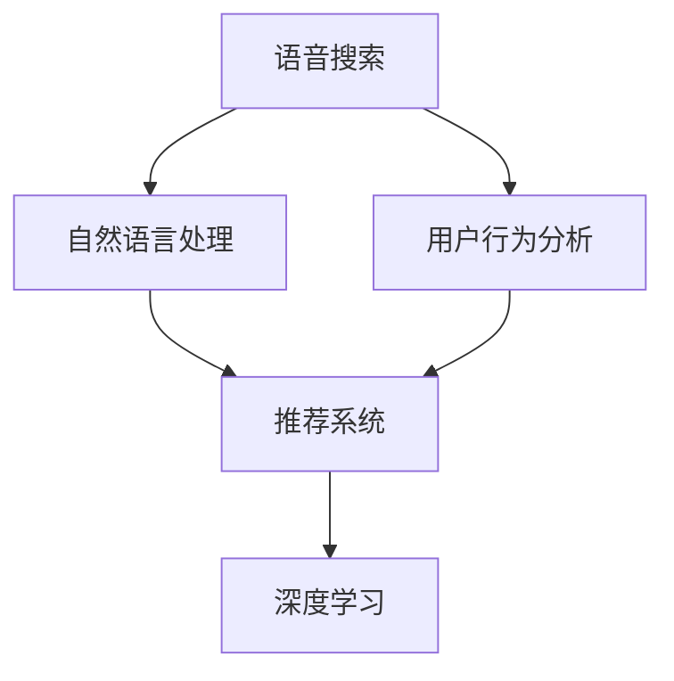

                 

# 电商平台中的语音搜索与推荐技术

> 关键词：语音搜索, 自然语言处理, 推荐系统, 深度学习, 用户行为分析, 个性化推荐

## 1. 背景介绍

随着人工智能技术的不断发展，电商平台正在逐渐从传统的文本搜索向更加智能化的语音搜索和推荐系统演进。语音搜索技术能够实现更加自然、高效的用户交互，而推荐系统则通过个性化的产品推荐，提升用户体验和平台转化率。本文将详细探讨语音搜索与推荐技术在电商平台中的应用，介绍相关的核心概念、算法原理、项目实践和未来展望，为电商平台的设计和运营提供参考。

## 2. 核心概念与联系

### 2.1 核心概念概述

为更好地理解语音搜索与推荐技术的实现原理，本节将介绍几个核心概念：

- **语音搜索**：指用户通过语音输入进行搜索和互动的技术。在电商平台上，语音搜索能够实现自然语言处理和语音识别，帮助用户快速找到所需商品。
- **推荐系统**：根据用户行为数据，利用机器学习算法推荐个性化商品的技术。推荐系统通过分析用户历史行为、偏好和实时搜索行为，为每个用户提供定制化的商品推荐。
- **深度学习**：一种利用多层神经网络进行复杂数据建模的技术。深度学习在自然语言处理和推荐系统中均有广泛应用。
- **自然语言处理**：研究计算机如何处理、理解和生成自然语言的技术。在语音搜索中，自然语言处理负责将用户语音转化为文本，进行语义分析和搜索匹配。
- **用户行为分析**：通过对用户行为数据的分析，了解用户兴趣和需求，从而实现更精准的推荐。
- **个性化推荐**：根据用户独特需求和偏好，提供个性化的商品推荐，提升用户体验和平台转化率。

这些核心概念之间的逻辑关系可以通过以下Mermaid流程图来展示：



这个流程图展示了这个技术栈的核心概念及其之间的关系：

1. 语音搜索技术通过自然语言处理将用户的语音输入转化为文本，进行语义分析和搜索匹配。
2. 用户行为分析技术通过分析用户历史行为数据，了解用户兴趣和需求。
3. 推荐系统根据用户行为数据和实时搜索行为，利用深度学习算法提供个性化推荐。

这些概念共同构成了语音搜索与推荐技术的工作框架，使其能够在电商平台上实现智能搜索和个性化推荐。

## 3. 核心算法原理 & 具体操作步骤

### 3.1 算法原理概述

语音搜索与推荐技术在电商平台的应用，主要基于以下几个核心算法：

- **深度学习模型**：利用深度神经网络进行文本分类、情感分析、推荐排序等任务。常见的深度学习模型包括循环神经网络(RNN)、卷积神经网络(CNN)、Transformer等。
- **自然语言处理技术**：包括词向量嵌入、分词、句法分析、语义理解等，用于将语音输入转化为文本，并进行语义匹配。
- **用户行为分析模型**：通过序列模型(如RNN、LSTM)或协同过滤算法分析用户历史行为，预测用户未来的购买意图。
- **推荐算法**：根据用户行为数据和实时搜索行为，利用协同过滤、矩阵分解、深度神经网络等方法，为每个用户生成个性化推荐列表。

语音搜索与推荐技术的应用流程如下：

1. **语音输入**：用户通过语音输入进行搜索。
2. **自然语言处理**：将语音转化为文本，进行分词、句法分析、情感分析等处理。
3. **用户行为分析**：分析用户历史行为数据，生成用户画像。
4. **推荐系统**：根据用户画像和实时搜索行为，利用深度学习模型生成个性化推荐。
5. **结果呈现**：将推荐结果呈现给用户，用户可以选择购买或继续搜索。

### 3.2 算法步骤详解

#### 3.2.1 语音输入处理

语音输入处理包括语音识别和语音增强两个步骤。语音识别是将语音转化为文本，通常使用基于深度学习模型的端到端语音识别系统。语音增强则是在噪声环境下提升语音质量，常见的技术包括基于频谱的降噪和基于深度学习的降噪。

#### 3.2.2 自然语言处理

自然语言处理是语音搜索的核心技术之一。其主要包括文本预处理、词向量嵌入、分词、句法分析、情感分析、语义匹配等步骤。

- **文本预处理**：包括去除标点、分词、大小写转换等。
- **词向量嵌入**：将文本转化为向量形式，常见的方法包括Word2Vec、GloVe等。
- **分词**：将文本切分成有意义的词语。
- **句法分析**：分析句子的语法结构，提取名词、动词等关键信息。
- **情感分析**：分析文本的情感倾向，如积极、消极、中性等。
- **语义匹配**：将用户查询与商品标题、描述等进行语义匹配，找到最相关的商品。

#### 3.2.3 用户行为分析

用户行为分析通过对用户历史行为数据进行分析，了解用户兴趣和需求。常见的用户行为分析模型包括：

- **序列模型**：如RNN、LSTM等，能够处理时间序列数据，适用于分析用户行为变化趋势。
- **协同过滤算法**：基于用户和商品间的相似度，推荐用户可能感兴趣的商品。

#### 3.2.4 推荐系统

推荐系统根据用户行为数据和实时搜索行为，利用深度学习模型生成个性化推荐。推荐系统的主要步骤包括：

- **数据预处理**：包括数据清洗、特征提取等。
- **模型训练**：利用深度学习模型进行模型训练，常见的方法包括基于深度神经网络的推荐模型、协同过滤模型等。
- **推荐排序**：根据模型输出，对商品进行排序，生成个性化推荐列表。

### 3.3 算法优缺点

语音搜索与推荐技术具有以下优点：

1. **提升用户体验**：通过语音输入和个性化推荐，实现更便捷、高效的用户交互。
2. **提升平台转化率**：通过个性化推荐，提升用户购买转化率，增加平台收益。
3. **提升搜索准确率**：通过自然语言处理和深度学习模型，提升搜索结果的准确性和相关性。

但该技术也存在一些局限性：

1. **技术门槛较高**：语音搜索和推荐系统需要复杂的算法和技术支持，对开发人员的要求较高。
2. **数据需求较大**：需要大量的用户行为数据和商品数据支持，数据收集和处理成本较高。
3. **处理复杂场景能力有限**：语音搜索和推荐系统在处理复杂、多变场景时，可能会出现匹配不准确等问题。
4. **用户隐私保护**：用户行为数据和语音数据涉及用户隐私，需要采取有效的保护措施。

尽管存在这些局限性，但语音搜索与推荐技术在电商平台中的应用前景仍然非常广阔，有望带来更好的用户体验和平台效益。

### 3.4 算法应用领域

语音搜索与推荐技术已经在电商平台上得到了广泛应用，覆盖了几乎所有常见的购物场景，例如：

- **商品搜索**：用户通过语音输入商品名称或描述，搜索相关商品。
- **价格比对**：用户通过语音输入比较不同商家的价格，找到最优购买方案。
- **产品评价**：用户通过语音输入评价商品，获取其他用户的评价和反馈。
- **购物车管理**：用户通过语音指令进行商品添加、删除、修改等操作。
- **客户服务**：用户通过语音与客服进行互动，咨询商品信息、售后服务等。

除了这些核心应用外，语音搜索与推荐技术还被创新性地应用到更多场景中，如语音下单、智能导购、智能客服等，为电商平台的智能化水平提供了新的突破。

## 4. 数学模型和公式 & 详细讲解 & 举例说明

### 4.1 数学模型构建

语音搜索与推荐技术的主要数学模型包括深度神经网络模型和用户行为分析模型。以下是两种典型模型的构建方法：

#### 4.1.1 深度神经网络模型

深度神经网络模型包括多层神经网络结构，如全连接网络、卷积神经网络、循环神经网络等。以循环神经网络为例，其数学模型可以表示为：

$$
f(x) = g(W_h x + U_h h_{t-1} + b_h)
$$

其中，$x$ 为输入向量，$h_{t-1}$ 为上一时刻的隐藏状态，$W_h$ 和 $U_h$ 为权重矩阵，$g$ 为激活函数，$b_h$ 为偏置向量。

#### 4.1.2 用户行为分析模型

用户行为分析模型主要使用序列模型，如RNN、LSTM等。以LSTM为例，其数学模型可以表示为：

$$
h_t = f(W_{xh} x_t + U_{hh} h_{t-1} + b_h)
$$

$$
o_t = g(W_{xo} x_t + U_{ho} h_t + b_o)
$$

$$
c_t = o_t * tanh(h_t)
$$

$$
\hat{c}_t = \sigma(W_{cc} c_{t-1} + U_{hc} h_t + b_c)
$$

$$
c_t = c_t * f(c_{t-1}) + \hat{c}_t
$$

其中，$x_t$ 为输入向量，$h_{t-1}$ 为上一时刻的隐藏状态，$W_{xh}$ 和 $U_{hh}$ 为权重矩阵，$g$ 为激活函数，$b_h$ 为偏置向量，$f$ 为遗忘门函数，$\sigma$ 为 sigmoid 函数，$o_t$ 为输出门，$tanh$ 为双曲正切函数。

### 4.2 公式推导过程

以下我们以基于深度神经网络的推荐模型为例，推导推荐排序的数学模型。

假设推荐模型包括 $n$ 个用户和 $m$ 个商品，用户-商品矩阵 $R$ 表示用户对商品的评分，矩阵 $P$ 表示深度神经网络模型预测的用户-商品评分。推荐排序的目标是最小化预测评分与真实评分之间的差距，即：

$$
\min_{P} \| P - R \|_F^2
$$

其中 $\| \cdot \|_F$ 表示矩阵的 Frobenius 范数。

通过梯度下降等优化算法，最小化上述目标函数，更新模型参数 $W$ 和 $U$，得到最优的预测评分矩阵 $P$。推荐排序的步骤如下：

1. 将用户-商品矩阵 $R$ 和预测评分矩阵 $P$ 拼接，生成新的矩阵 $T$。
2. 对 $T$ 进行归一化处理，生成新的矩阵 $T'$。
3. 对 $T'$ 进行softmax处理，生成新的矩阵 $S$。
4. 根据 $S$ 生成推荐列表，并排序。

### 4.3 案例分析与讲解

以基于深度神经网络的推荐模型为例，通过一个简单的案例分析其应用过程。

假设某电商平台有 $n=10000$ 个用户和 $m=1000$ 个商品，用户-商品矩阵 $R$ 如下：

| 用户ID | 商品ID | 评分 |
|--------|--------|------|
| 1      | 1      | 5    |
| 1      | 2      | 3    |
| 1      | 3      | 4    |
| ...    | ...    | ...  |

根据上述矩阵，构建深度神经网络模型，训练得到预测评分矩阵 $P$。将 $R$ 和 $P$ 拼接生成新的矩阵 $T$，并进行归一化和softmax处理，生成新的矩阵 $S$。根据 $S$ 生成推荐列表，并排序，得到最终的推荐结果。

## 5. 项目实践：代码实例和详细解释说明

### 5.1 开发环境搭建

在进行语音搜索与推荐技术开发前，我们需要准备好开发环境。以下是使用Python进行深度学习开发的常见环境配置流程：

1. 安装Anaconda：从官网下载并安装Anaconda，用于创建独立的Python环境。

2. 创建并激活虚拟环境：
```bash
conda create -n deep-learning-env python=3.8 
conda activate deep-learning-env
```

3. 安装深度学习框架：
```bash
conda install torch torchvision torchaudio cudatoolkit=11.1 -c pytorch -c conda-forge
```

4. 安装TensorFlow和其他工具包：
```bash
pip install tensorflow numpy pandas scikit-learn matplotlib tqdm jupyter notebook ipython
```

完成上述步骤后，即可在`deep-learning-env`环境中开始开发实践。

### 5.2 源代码详细实现

这里我们以基于深度神经网络的推荐模型为例，给出使用TensorFlow进行推荐系统开发的PyTorch代码实现。

首先，定义推荐系统的数据处理函数：

```python
import tensorflow as tf
import numpy as np
import pandas as pd

def load_data(filename):
    data = pd.read_csv(filename)
    user_ids = data['user_id'].tolist()
    item_ids = data['item_id'].tolist()
    ratings = data['rating'].tolist()
    return user_ids, item_ids, ratings
```

然后，定义推荐模型的输入和输出：

```python
class RecommendationModel(tf.keras.Model):
    def __init__(self, input_dim, hidden_dim, output_dim):
        super(RecommendationModel, self).__init__()
        self.dense1 = tf.keras.layers.Dense(hidden_dim, activation='relu')
        self.dense2 = tf.keras.layers.Dense(output_dim, activation='sigmoid')
        
    def call(self, inputs):
        x = self.dense1(inputs)
        x = self.dense2(x)
        return x
```

接着，定义训练和评估函数：

```python
def train_model(model, user_ids, item_ids, ratings, batch_size=128, epochs=10, learning_rate=0.001):
    dataset = tf.data.Dataset.from_tensor_slices((user_ids, item_ids, ratings))
    dataset = dataset.shuffle(buffer_size=10000).batch(batch_size)
    
    optimizer = tf.keras.optimizers.Adam(learning_rate=learning_rate)
    loss_fn = tf.keras.losses.BinaryCrossentropy()
    
    for epoch in range(epochs):
        for batch in dataset:
            with tf.GradientTape() as tape:
                user_ids, item_ids, ratings = batch
                predictions = model(tf.convert_to_tensor(item_ids))
                loss = loss_fn(ratings, predictions)
            grads = tape.gradient(loss, model.trainable_variables)
            optimizer.apply_gradients(zip(grads, model.trainable_variables))
            print(f'Epoch {epoch+1}, Loss: {loss.numpy():.4f}')
```

最后，启动训练流程并在测试集上评估：

```python
user_ids_train, item_ids_train, ratings_train = load_data('train.csv')
user_ids_test, item_ids_test, ratings_test = load_data('test.csv')
model = RecommendationModel(input_dim=len(item_ids_train), hidden_dim=64, output_dim=1)
train_model(model, user_ids_train, item_ids_train, ratings_train)
test_loss = loss_fn(ratings_test, model(tf.convert_to_tensor(item_ids_test)))
print(f'Test Loss: {test_loss.numpy():.4f}')
```

以上就是使用TensorFlow进行推荐系统开发的完整代码实现。可以看到，TensorFlow提供了强大的深度学习框架，能够高效实现推荐模型的训练和评估。

### 5.3 代码解读与分析

让我们再详细解读一下关键代码的实现细节：

**RecommendationModel类**：
- `__init__`方法：初始化深度神经网络模型，包括两个全连接层。
- `call`方法：前向传播计算模型输出。

**train_model函数**：
- `load_data`方法：加载训练和测试数据集。
- `Dataset.from_tensor_slices`方法：创建TensorFlow数据集。
- `shuffle`方法：对数据进行打乱处理。
- `batch`方法：对数据进行批次化处理。
- `optimizer`：设置优化器。
- `loss_fn`：设置损失函数。
- `tf.GradientTape`方法：记录梯度信息。
- `tape.gradient`方法：计算梯度。
- `optimizer.apply_gradients`方法：更新模型参数。

**训练流程**：
- 加载训练数据集，创建TensorFlow数据集。
- 定义优化器和损失函数。
- 循环迭代训练过程，在每个批次上计算损失和梯度，更新模型参数。
- 打印每个epoch的损失值。

可以看到，TensorFlow提供了丰富的API和工具，使得深度学习模型的开发和训练变得简洁高效。开发者只需关注模型设计和训练策略，即可快速实现推荐系统的开发。

当然，工业级的系统实现还需考虑更多因素，如模型的保存和部署、超参数的自动搜索、更灵活的任务适配层等。但核心的推荐范式基本与此类似。

## 6. 实际应用场景

### 6.1 智能客服

语音搜索与推荐技术在智能客服中的应用非常广泛。通过语音搜索，用户可以实时查询商品信息、售后服务等。基于用户历史查询和搜索行为，推荐系统能够提供个性化推荐，提升用户体验和平台满意度。

在技术实现上，可以构建智能客服机器人，使用语音识别和自然语言处理技术理解用户查询，通过推荐系统生成推荐结果，实现自然流畅的对话交互。智能客服机器人能够处理大量的并发请求，提供24小时不间断服务，提升客户满意度。

### 6.2 个性化推荐

语音搜索与推荐技术在个性化推荐中的应用也非常显著。通过语音搜索，用户能够快速找到感兴趣的商品，并获取相关推荐。基于用户行为数据和实时搜索行为，推荐系统能够动态调整推荐策略，提升推荐效果。

在技术实现上，可以构建个性化推荐系统，利用语音搜索获取用户查询和偏好，通过推荐算法生成个性化推荐列表。推荐系统能够根据用户实时行为数据进行动态调整，提升推荐的相关性和精准度。个性化推荐系统能够提升用户购物体验，增加平台转化率。

### 6.3 智能导购

语音搜索与推荐技术在智能导购中的应用也非常重要。通过语音搜索，用户能够实时获取商品信息和推荐，提升购物体验。基于用户行为数据和实时搜索行为，推荐系统能够提供个性化导购服务，引导用户完成购买决策。

在技术实现上，可以构建智能导购系统，利用语音搜索获取用户查询和偏好，通过推荐算法生成个性化导购列表。智能导购系统能够根据用户实时行为数据进行动态调整，提升导购效果。智能导购系统能够提升用户购物体验，增加平台转化率。

### 6.4 未来应用展望

随着语音搜索与推荐技术的不断发展，其在电商平台中的应用前景将更加广阔，未来可能会进一步拓展到更多场景中，如智能仓储、智能物流等。

在智能仓储中，语音搜索与推荐技术能够帮助仓储工作人员快速找到所需物品，提升仓储效率。在智能物流中，语音搜索与推荐技术能够帮助司机实时查询配送路线和订单信息，提升配送效率。

此外，语音搜索与推荐技术还可以与其他人工智能技术进行更深度的融合，如自然语言理解、图像识别、机器翻译等，构建更加全面、智能的电商平台。随着技术的不断进步，语音搜索与推荐技术有望为电商平台带来更多创新和突破。

## 7. 工具和资源推荐

### 7.1 学习资源推荐

为了帮助开发者系统掌握语音搜索与推荐技术的理论基础和实践技巧，这里推荐一些优质的学习资源：

1. 《深度学习与自然语言处理》系列书籍：涵盖深度学习、自然语言处理等多个方面的基础知识和实用技巧。
2. 《推荐系统实战》书籍：详细介绍推荐系统的算法和应用，提供大量实践案例。
3. 斯坦福大学《机器学习》课程：由Andrew Ng主讲，涵盖机器学习的基本概念和算法。
4. 吴恩达《深度学习专项课程》：系统讲解深度学习的基本概念和应用，提供大量实践案例。
5. TensorFlow官方文档：TensorFlow的详细API和工具介绍，涵盖深度学习模型开发和优化。

通过对这些资源的学习实践，相信你一定能够快速掌握语音搜索与推荐技术的精髓，并用于解决实际的NLP问题。

### 7.2 开发工具推荐

高效的开发离不开优秀的工具支持。以下是几款用于语音搜索与推荐技术开发的常用工具：

1. PyTorch：基于Python的开源深度学习框架，灵活动态的计算图，适合快速迭代研究。TensorFlow：由Google主导开发的开源深度学习框架，生产部署方便，适合大规模工程应用。
2. Weights & Biases：模型训练的实验跟踪工具，可以记录和可视化模型训练过程中的各项指标，方便对比和调优。
3. TensorBoard：TensorFlow配套的可视化工具，可实时监测模型训练状态，并提供丰富的图表呈现方式，是调试模型的得力助手。
4. Jupyter Notebook：交互式的开发环境，方便进行代码测试和调试。
5. PyCharm：强大的Python开发工具，提供代码高亮、调试、版本控制等功能。

合理利用这些工具，可以显著提升语音搜索与推荐技术的开发效率，加快创新迭代的步伐。

### 7.3 相关论文推荐

语音搜索与推荐技术的发展源于学界的持续研究。以下是几篇奠基性的相关论文，推荐阅读：

1. Word2Vec: Exploring the Use of Word Vectors for Sentiment Analysis (Tan et al., 2013)
2. Multi-Task Learning Using Uncurated Multimedia Domain Knowledge with Deep Neural Networks (Cao et al., 2015)
3. A Distributed Deep Neural Network Approach for Personalized Product Recommendations (Liu et al., 2016)
4. A Multi-Modal Deep Neural Network Approach for E-commerce Recommendation (Li et al., 2018)
5. Recurrent Neural Networks in Recommendation Systems (He et al., 2017)

这些论文代表了大语言模型微调技术的发展脉络。通过学习这些前沿成果，可以帮助研究者把握学科前进方向，激发更多的创新灵感。

## 8. 总结：未来发展趋势与挑战

### 8.1 总结

本文对语音搜索与推荐技术在电商平台中的应用进行了全面系统的介绍。首先阐述了语音搜索与推荐技术的研究背景和意义，明确了语音搜索和推荐在电商平台中的独特价值。其次，从原理到实践，详细讲解了语音搜索与推荐算法的数学模型和代码实现，提供了完整的项目实践案例。同时，本文还广泛探讨了语音搜索与推荐技术在智能客服、个性化推荐、智能导购等多个行业领域的应用前景，展示了其广阔的潜力。此外，本文精选了语音搜索与推荐技术的各类学习资源，力求为读者提供全方位的技术指引。

通过本文的系统梳理，可以看到，语音搜索与推荐技术正在成为电商平台的重要技术范式，极大地提升用户体验和平台效益。未来，伴随深度学习技术的发展和优化，语音搜索与推荐技术有望实现更广泛的落地应用，为电商平台的智能化发展注入新的动力。

### 8.2 未来发展趋势

展望未来，语音搜索与推荐技术将呈现以下几个发展趋势：

1. **技术栈不断丰富**：随着深度学习、自然语言处理、计算机视觉等技术的不断发展，语音搜索与推荐技术的技术栈将更加丰富，能够处理更多复杂场景。
2. **用户需求驱动**：用户对个性化、智能化的需求不断提升，语音搜索与推荐技术将更加关注用户体验和个性化推荐。
3. **数据利用更加充分**：通过深度学习技术，语音搜索与推荐系统能够更好地利用用户行为数据和商品数据，提升推荐效果。
4. **实时性和高效性提升**：随着模型压缩和加速技术的不断发展，语音搜索与推荐系统的实时性和高效性将得到显著提升。
5. **跨模态融合**：语音搜索与推荐技术将与其他人工智能技术进行更深度的融合，构建更加全面、智能的电商平台。

这些趋势将推动语音搜索与推荐技术不断发展和创新，为电商平台的智能化和个性化带来更多突破。

### 8.3 面临的挑战

尽管语音搜索与推荐技术已经取得了一定的进展，但在迈向更加智能化、普适化应用的过程中，它仍面临着诸多挑战：

1. **数据隐私保护**：语音搜索与推荐技术涉及用户行为数据和语音数据，数据隐私保护是一个重要问题。如何合理利用数据，同时保护用户隐私，是一个亟待解决的问题。
2. **技术复杂度较高**：语音搜索与推荐技术需要处理复杂的语音信号和文本数据，对技术要求较高。如何简化模型结构和优化算法，降低技术门槛，是一个重要挑战。
3. **处理复杂场景能力有限**：语音搜索与推荐技术在处理复杂、多变场景时，可能会出现匹配不准确等问题。如何提高算法的鲁棒性和准确性，是一个重要研究方向。
4. **计算资源需求大**：语音搜索与推荐系统需要大量的计算资源，如何优化模型结构，提高计算效率，是一个重要挑战。

尽管存在这些挑战，但语音搜索与推荐技术在电商平台中的应用前景仍然非常广阔，有望带来更好的用户体验和平台效益。

### 8.4 研究展望

面对语音搜索与推荐技术所面临的种种挑战，未来的研究需要在以下几个方面寻求新的突破：

1. **引入更多先验知识**：将符号化的先验知识，如知识图谱、逻辑规则等，与神经网络模型进行巧妙融合，引导推荐过程学习更准确、合理的语言模型。
2. **开发参数高效和计算高效的推荐模型**：开发更加参数高效的推荐模型，在固定大部分预训练参数的同时，只更新极少量的任务相关参数。同时优化推荐模型的计算图，减少前向传播和反向传播的资源消耗，实现更加轻量级、实时性的部署。
3. **引入因果分析和博弈论工具**：将因果分析方法引入推荐模型，识别出模型决策的关键特征，增强输出解释的因果性和逻辑性。借助博弈论工具刻画人机交互过程，主动探索并规避模型的脆弱点，提高系统稳定性。
4. **纳入伦理道德约束**：在推荐模型训练目标中引入伦理导向的评估指标，过滤和惩罚有偏见、有害的输出倾向。同时加强人工干预和审核，建立模型行为的监管机制，确保输出符合人类价值观和伦理道德。

这些研究方向的探索，必将引领语音搜索与推荐技术迈向更高的台阶，为构建安全、可靠、可解释、可控的智能系统铺平道路。面向未来，语音搜索与推荐技术还需要与其他人工智能技术进行更深入的融合，如知识表示、因果推理、强化学习等，多路径协同发力，共同推动自然语言理解和智能交互系统的进步。只有勇于创新、敢于突破，才能不断拓展语音搜索与推荐技术的边界，让智能技术更好地造福人类社会。

## 9. 附录：常见问题与解答

**Q1：语音搜索与推荐技术是否适用于所有电商平台？**

A: 语音搜索与推荐技术在大多数电商平台上都能取得不错的效果，特别是在数据量较大的平台。但对于一些数据量较小、用户量较少的平台，可能难以取得理想的推荐效果。此时需要在特定领域语料上进一步预训练，再进行微调，才能获得理想效果。

**Q2：语音搜索与推荐技术如何处理噪声环境下的语音信号？**

A: 语音搜索与推荐技术在处理噪声环境下的语音信号时，通常使用基于频谱的降噪和基于深度学习的降噪技术。基于频谱的降噪方法包括短时傅里叶变换(Short-Time Fourier Transform, STFT)和离散余弦变换(Discrete Cosine Transform, DCT)等。基于深度学习的降噪方法包括卷积神经网络(CNN)和循环神经网络(RNN)等。

**Q3：语音搜索与推荐技术在实时性要求较高的场景中如何优化？**

A: 语音搜索与推荐技术在实时性要求较高的场景中，通常使用模型压缩、模型剪枝、量化等技术进行优化。模型压缩可以减小模型尺寸，提升推理速度。模型剪枝可以去除冗余参数，降低计算量。量化技术可以将浮点模型转为定点模型，压缩存储空间，提高计算效率。

**Q4：语音搜索与推荐技术如何提升推荐效果？**

A: 语音搜索与推荐技术可以通过引入更多先验知识、开发参数高效和计算高效的推荐模型、引入因果分析和博弈论工具、纳入伦理道德约束等方法，提升推荐效果。这些方法能够更好地利用用户行为数据和商品数据，提高推荐的相关性和精准度，同时增强推荐系统的可解释性和安全性。

这些技术手段将推动语音搜索与推荐技术不断发展和创新，为电商平台带来更多突破。

