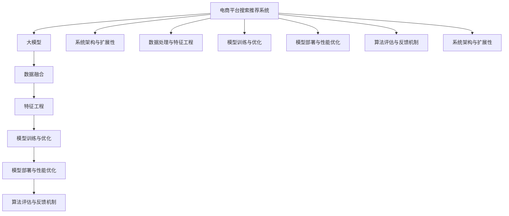

                 

# 电商平台搜索推荐系统的AI 大模型优化：应对大规模数据的挑战

> 关键词：大语言模型,电商推荐系统,搜索推荐,数据挖掘,数据融合,性能优化,分布式计算,深度学习

## 1. 背景介绍

### 1.1 问题由来
随着电子商务的飞速发展，电商平台已成为用户获取商品信息、进行消费决策的主要渠道。为了提升用户体验和平台转化率，电商企业纷纷将AI技术引入搜索推荐系统，以个性化推荐、实时搜索和关联推荐等形式，精准匹配用户需求，提升用户满意度。

然而，电商平台的商品数量庞大，用户行为数据多样复杂，如何高效处理大规模数据，构建高性能、高准确度的推荐系统，是一个巨大的挑战。大模型通过预训练学习到丰富的语义知识，可以更好地处理电商领域的海量数据，但其参数量巨大、计算复杂，如何在大模型上实现高效的搜索推荐优化，是当前电商推荐系统研究的一个重要课题。

### 1.2 问题核心关键点
为应对大规模数据挑战，优化搜索推荐系统的AI大模型，需考虑以下核心关键点：

1. **数据处理与特征工程**：如何将海量的用户行为数据转化为模型可用的特征，如何处理数据噪声和缺失，如何进行有效的特征融合，是大模型优化中必须解决的问题。

2. **模型训练与优化**：如何选择合适的优化器、损失函数、学习率调度策略，如何在有限计算资源下训练大规模模型，如何避免过拟合，提高模型的泛化能力。

3. **模型部署与性能优化**：如何将训练好的模型高效部署到线上，如何减少模型推理时的计算量和存储开销，如何提高模型的实时性，是模型优化中不可忽视的部分。

4. **算法评估与反馈机制**：如何构建合理的模型评估指标，如何根据用户反馈持续改进模型，如何确保模型在实际应用中的表现与预期一致。

5. **系统架构与扩展性**：如何设计一个稳定、可扩展的系统架构，以适应模型规模和用户增长的需求，如何实现系统的无缝升级和迭代。

以上问题构成了电商平台搜索推荐系统AI大模型优化的主要挑战，需要从数据处理、模型训练、部署优化、评估机制和系统架构等多个方面进行全面优化。

## 2. 核心概念与联系

### 2.1 核心概念概述

为更好地理解AI大模型在电商平台搜索推荐系统中的应用，本节将介绍几个密切相关的核心概念：

- **电商平台搜索推荐系统**：基于用户的浏览、购买历史等行为数据，通过推荐算法为用户推荐商品或服务的系统。
- **大模型**：指在预训练阶段从大规模无标签数据中学习到通用知识，在特定任务上通过微调优化模型性能的深度学习模型，如BERT、GPT等。
- **数据融合**：将来自不同渠道的数据进行合并，消除冗余和冲突，整合出高质量的特征向量，供模型训练使用。
- **特征工程**：对原始数据进行预处理、转换和抽取，生成模型可用的特征表示，是模型训练的重要环节。
- **模型优化**：通过选择合适的网络结构、优化器和超参数，优化模型性能，提升模型的泛化能力和鲁棒性。
- **性能优化**：通过模型压缩、量化、剪枝等技术，减少模型的计算和存储开销，提高模型的实时性和可扩展性。
- **分布式计算**：通过多机多核、GPU集群、TPU等计算资源，实现模型的高效训练和推理。

这些核心概念之间的逻辑关系可以通过以下Mermaid流程图来展示：



这个流程图展示了大模型优化搜索推荐系统的核心概念及其之间的关系：

1. 电商平台搜索推荐系统是大模型优化的目标系统。
2. 数据融合和特征工程是大模型优化的输入环节。
3. 模型训练与优化是大模型优化的核心环节。
4. 模型部署与性能优化是大模型优化的输出环节。
5. 算法评估与反馈机制和大模型优化是双向的，模型优化需要根据评估结果进行调整，而评估结果也依赖于模型优化的表现。
6. 系统架构与扩展性是大模型优化的保障环节，确保系统的高可用性和可扩展性。

这些概念共同构成了大模型优化搜索推荐系统的技术框架，使其能够在电商平台上高效运行，提升推荐系统性能。

## 3. 核心算法原理 & 具体操作步骤
### 3.1 算法原理概述

电商平台搜索推荐系统中的AI大模型优化，主要通过以下几个步骤实现：

1. **数据预处理与特征工程**：将原始用户行为数据转化为模型可用的特征，如用户ID、商品ID、浏览时间、点击次数等。

2. **模型训练与优化**：在预训练模型基础上，通过微调优化模型性能，选择合适的损失函数和优化器，设计合适的学习率调度策略。

3. **模型部署与性能优化**：将训练好的模型部署到线上，采用分布式计算、模型压缩、量化等技术，减少计算和存储开销，提高模型的实时性。

4. **算法评估与反馈机制**：构建合理的模型评估指标，根据用户反馈持续改进模型，确保模型在实际应用中的表现与预期一致。

5. **系统架构与扩展性**：设计一个稳定、可扩展的系统架构，以适应模型规模和用户增长的需求，实现系统的无缝升级和迭代。

### 3.2 算法步骤详解

**Step 1: 数据预处理与特征工程**

电商平台的推荐系统通常需要处理多种数据类型，如用户行为数据、商品属性数据、交易数据等。数据预处理与特征工程的目的是将原始数据转化为模型可用的特征表示，提取与推荐相关的关键信息。

- **数据清洗**：删除或填充缺失数据，去除异常值和噪声数据。
- **特征提取**：提取有用的特征，如用户ID、商品ID、浏览时间、点击次数、购买金额等。
- **特征选择**：通过特征选择算法，保留与推荐目标相关性高的特征，去除冗余和低相关性特征。
- **特征转换**：将连续特征进行归一化和离散化处理，生成模型可用的特征表示。

**Step 2: 模型训练与优化**

在完成数据预处理与特征工程后，需要对大模型进行训练与优化。常用的模型包括深度神经网络、卷积神经网络、循环神经网络等，其中深度神经网络在推荐系统中应用广泛。

- **选择模型**：根据任务需求选择适当的深度神经网络结构。
- **选择优化器**：常用的优化器包括Adam、SGD等，选择合适的优化器及其参数。
- **选择损失函数**：常用的损失函数包括交叉熵损失、均方误差损失等。
- **设计学习率调度策略**：常用的策略包括学习率衰减、余弦退火等。
- **模型训练**：将训练集数据输入模型，通过前向传播和反向传播更新模型参数。
- **模型优化**：通过验证集评估模型性能，根据评估结果调整模型参数。

**Step 3: 模型部署与性能优化**

训练好的模型需要部署到线上，并针对性能进行优化。

- **模型压缩**：通过剪枝、量化等技术，减少模型的计算和存储开销。
- **分布式计算**：采用多机多核、GPU集群、TPU等计算资源，实现高效训练和推理。
- **模型部署**：将训练好的模型部署到服务器上，供推荐系统调用。
- **性能优化**：通过优化模型推理过程，减少计算量和存储开销，提高实时性。

**Step 4: 算法评估与反馈机制**

评估推荐系统的性能是模型优化的重要环节。

- **构建评估指标**：常用的评估指标包括准确率、召回率、F1分数、点击率等。
- **测试集评估**：在测试集上评估模型性能，对比不同模型间的表现。
- **用户反馈**：收集用户对推荐结果的反馈，用于调整模型参数和优化算法。
- **持续优化**：根据用户反馈和系统评估结果，不断改进模型和优化算法。

**Step 5: 系统架构与扩展性**

设计一个稳定、可扩展的系统架构，是模型优化的保障。

- **设计系统架构**：采用微服务架构、容器化技术、分布式存储等手段，确保系统的高可用性和可扩展性。
- **系统监控**：实时监控系统运行状态，设置异常告警阈值，保障系统稳定运行。
- **系统升级**：实现系统的无缝升级和迭代，确保模型在新数据上的表现。

### 3.3 算法优缺点

电商推荐系统中的AI大模型优化，具有以下优点：

1. **高效处理大规模数据**：大模型通过预训练学习到丰富的语义知识，能够高效处理电商领域的海量数据，提高推荐系统的性能。

2. **提升用户满意度**：通过个性化推荐、实时搜索和关联推荐，提升用户满意度，提高平台转化率。

3. **鲁棒性强**：大模型具有较强的泛化能力，对数据噪声和缺失有较强的鲁棒性，能够适应不同用户和商品的特点。

4. **实时性好**：通过分布式计算和性能优化，大模型能够实现高效的实时推荐，满足用户即时需求。

同时，也存在一些局限：

1. **计算资源需求高**：大模型的参数量巨大，计算复杂，需要高性能的计算资源支持。

2. **训练时间长**：大模型在大规模数据上的训练时间较长，需要较长的开发周期。

3. **成本高**：大模型的训练和部署成本较高，需要投入大量的计算资源和人力资源。

4. **过拟合风险高**：大模型容易过拟合，需要采取合适的正则化技术和学习率调度策略。

5. **可解释性差**：大模型的决策过程较复杂，难以进行解释，难以调试和优化。

尽管存在这些局限，但电商推荐系统中的AI大模型优化仍然是大规模数据处理和推荐系统性能提升的重要手段，具有显著的应用前景。

### 3.4 算法应用领域

AI大模型优化技术在电商推荐系统中有着广泛的应用，具体包括：

- **个性化推荐**：根据用户的历史行为数据，通过推荐算法为用户推荐商品或服务。
- **实时搜索**：通过自然语言处理技术，对用户搜索查询进行理解，实时返回相关商品。
- **关联推荐**：根据用户的历史浏览和购买记录，推荐相关的商品或服务。
- **新用户推荐**：对新用户进行推荐，提升平台转化率。
- **商品排行榜**：根据用户行为数据，生成商品排行榜，提升用户浏览体验。

除了电商推荐系统，AI大模型优化技术还可以应用于智能客服、金融推荐、新闻推荐等多个领域，为不同行业的数字化转型提供有力支持。

## 4. 数学模型和公式 & 详细讲解  
### 4.1 数学模型构建

本节将使用数学语言对电商平台搜索推荐系统中的AI大模型优化过程进行更加严格的刻画。

记电商平台搜索推荐系统中的推荐任务为 $T$，其数据集为 $D=\{(x_i, y_i)\}_{i=1}^N, x_i \in \mathcal{X}, y_i \in \mathcal{Y}$，其中 $\mathcal{X}$ 为特征空间，$\mathcal{Y}$ 为推荐结果空间，$y_i$ 表示用户是否对商品 $x_i$ 进行推荐。

定义模型 $M_{\theta}$ 在特征 $x_i$ 上的输出为 $\hat{y}_i = M_{\theta}(x_i)$，即模型对商品 $x_i$ 是否进行推荐的预测结果。则推荐系统的损失函数为：

$$
\mathcal{L}(\theta) = -\sum_{i=1}^N \log(\hat{y}_i) + \sum_{i=1}^N \log(1-\hat{y}_i)
$$

其中，$\log(\hat{y}_i)$ 为正样本的损失函数，$\log(1-\hat{y}_i)$ 为负样本的损失函数。

通过梯度下降等优化算法，模型 $M_{\theta}$ 的优化目标是最小化经验风险，即找到最优参数：

$$
\theta^* = \mathop{\arg\min}_{\theta} \mathcal{L}(\theta)
$$

在实践中，我们通常使用基于梯度的优化算法（如Adam、SGD等）来近似求解上述最优化问题。设 $\eta$ 为学习率，$\lambda$ 为正则化系数，则参数的更新公式为：

$$
\theta \leftarrow \theta - \eta \nabla_{\theta}\mathcal{L}(\theta) - \eta\lambda\theta
$$

其中 $\nabla_{\theta}\mathcal{L}(\theta)$ 为损失函数对参数 $\theta$ 的梯度，可通过反向传播算法高效计算。

### 4.2 公式推导过程

以深度神经网络为例，介绍推荐系统中的常见损失函数及梯度计算过程。

假设模型 $M_{\theta}$ 为深度神经网络，输入特征为 $x_i = (x_{i1}, x_{i2}, ..., x_{in})$，输出为 $\hat{y}_i$，其中 $x_{ij}$ 为特征 $x_i$ 的第 $j$ 个特征，$j=1,2,...,n$。则推荐系统的交叉熵损失函数为：

$$
\mathcal{L}(\theta) = -\sum_{i=1}^N \log(\hat{y}_i)
$$

其中 $\hat{y}_i$ 表示用户对商品 $x_i$ 是否进行推荐的概率，$y_i$ 为真实标签。

根据链式法则，损失函数对参数 $\theta_k$ 的梯度为：

$$
\frac{\partial \mathcal{L}(\theta)}{\partial \theta_k} = -\sum_{i=1}^N \frac{1}{\hat{y}_i} \frac{\partial \hat{y}_i}{\partial \theta_k}
$$

其中 $\frac{\partial \hat{y}_i}{\partial \theta_k}$ 为模型输出 $\hat{y}_i$ 对参数 $\theta_k$ 的导数，可通过反向传播算法计算。

在得到损失函数的梯度后，即可带入参数更新公式，完成模型的迭代优化。重复上述过程直至收敛，最终得到适应推荐任务的最优模型参数 $\theta^*$。

## 5. 项目实践：代码实例和详细解释说明
### 5.1 开发环境搭建

在进行电商推荐系统优化前，我们需要准备好开发环境。以下是使用Python进行PyTorch开发的环境配置流程：

1. 安装Anaconda：从官网下载并安装Anaconda，用于创建独立的Python环境。

2. 创建并激活虚拟环境：
```bash
conda create -n pytorch-env python=3.8 
conda activate pytorch-env
```

3. 安装PyTorch：根据CUDA版本，从官网获取对应的安装命令。例如：
```bash
conda install pytorch torchvision torchaudio cudatoolkit=11.1 -c pytorch -c conda-forge
```

4. 安装TensorFlow：
```bash
pip install tensorflow
```

5. 安装TensorBoard：
```bash
pip install tensorboard
```

6. 安装Weights & Biases：
```bash
pip install weights-and-biases
```

完成上述步骤后，即可在`pytorch-env`环境中开始电商推荐系统的开发。

### 5.2 源代码详细实现

下面我们以电商推荐系统中的个性化推荐为例，给出使用TensorFlow进行模型训练和优化的PyTorch代码实现。

首先，定义推荐任务的数据处理函数：

```python
import tensorflow as tf
import numpy as np
import pandas as pd

# 定义数据读取和处理函数
def load_data(file_path):
    df = pd.read_csv(file_path)
    x = df[['user_id', 'item_id', 'time', 'category', 'price']]
    y = df['recommend']
    return x, y

# 定义特征转换函数
def feature_transform(x):
    x['user_id'] = x['user_id'].astype('int')
    x['item_id'] = x['item_id'].astype('int')
    x['time'] = x['time'].astype('int')
    x['category'] = x['category'].astype('int')
    x['price'] = x['price'].astype('float')
    return x

# 定义模型评估函数
def evaluate(model, x, y):
    correct = 0
    total = 0
    for i in range(len(x)):
        x_i = x[i]
        y_i = y[i]
        predict = model.predict(x_i)
        if predict == y_i:
            correct += 1
        total += 1
    accuracy = correct / total
    return accuracy
```

然后，定义模型和优化器：

```python
import tensorflow.keras as keras
from tensorflow.keras.layers import Input, Dense, Embedding, Dropout, BatchNormalization
from tensorflow.keras.models import Model
from tensorflow.keras.optimizers import Adam

# 定义模型结构
x = Input(shape=(n_features,))
x = Embedding(vocab_size, embedding_dim)(x)
x = Dropout(dropout_rate)(x)
x = BatchNormalization()(x)
x = Dense(hidden_units, activation='relu')(x)
x = Dropout(dropout_rate)(x)
x = Dense(1, activation='sigmoid')(x)
model = Model(x, x)
model.compile(loss='binary_crossentropy', optimizer=Adam(lr=0.001))

# 定义超参数
vocab_size = 10000
embedding_dim = 128
hidden_units = 64
dropout_rate = 0.2
```

接着，定义训练和评估函数：

```python
# 定义训练函数
def train(model, x_train, y_train, x_val, y_val, epochs=10, batch_size=64):
    model.fit(x_train, y_train, epochs=epochs, batch_size=batch_size, validation_data=(x_val, y_val))

# 定义评估函数
def evaluate(model, x_test, y_test, batch_size=64):
    model.evaluate(x_test, y_test, batch_size=batch_size)
```

最后，启动训练流程并在测试集上评估：

```python
# 加载数据
x_train, y_train = load_data('train.csv')
x_val, y_val = load_data('val.csv')
x_test, y_test = load_data('test.csv')

# 特征转换
x_train = feature_transform(x_train)
x_val = feature_transform(x_val)
x_test = feature_transform(x_test)

# 模型训练
train(model, x_train, y_train, x_val, y_val)

# 模型评估
evaluate(model, x_test, y_test)
```

以上就是使用TensorFlow对电商推荐系统进行模型训练和优化的完整代码实现。可以看到，得益于TensorFlow的强大封装，我们可以用相对简洁的代码完成推荐系统的构建和优化。

### 5.3 代码解读与分析

让我们再详细解读一下关键代码的实现细节：

**load_data函数**：
- 加载数据集，返回特征和标签。
- 使用Pandas库读取CSV格式的数据文件。

**feature_transform函数**：
- 对特征进行预处理，包括类型转换、标准化、归一化等。
- 使用Pandas库进行数据处理。

**evaluate函数**：
- 对模型进行评估，计算准确率。
- 在测试集上对模型进行预测，并计算准确率。

**train函数**：
- 对模型进行训练，设置迭代次数和批大小。
- 使用TensorFlow的fit方法进行模型训练。

**train函数和evaluate函数**：
- 在训练过程中，使用验证集对模型进行评估，根据评估结果调整模型参数。

**训练流程**：
- 加载数据集，并对特征进行预处理。
- 定义模型结构和优化器，编译模型。
- 进行模型训练，设置迭代次数和批大小。
- 在测试集上评估模型性能，并输出评估结果。

可以看到，TensorFlow配合Pandas、NumPy等工具，使得电商推荐系统的开发过程变得简洁高效。开发者可以将更多精力放在模型设计和优化上，而不必过多关注底层的实现细节。

当然，工业级的系统实现还需考虑更多因素，如模型的保存和部署、超参数的自动搜索、更灵活的任务适配层等。但核心的微调范式基本与此类似。

## 6. 实际应用场景
### 6.1 智能客服系统

基于AI大模型的电商推荐系统，可以广泛应用于智能客服系统的构建。传统客服往往需要配备大量人力，高峰期响应缓慢，且一致性和专业性难以保证。而使用优化后的推荐系统，可以7x24小时不间断服务，快速响应客户咨询，用推荐结果替代人工回答，提高服务效率和质量。

在技术实现上，可以收集客户的历史购买和浏览记录，将商品推荐结果作为客服的自动回答，提高客户满意度。对于客户提出的新问题，还可以实时抓取相关商品信息，动态组织生成回答，提供更加个性化和精准的客服体验。

### 6.2 个性化推荐系统

优化后的电商推荐系统可以用于个性化推荐，提升用户购物体验和平台转化率。在推荐模型中，可以通过调整超参数、特征工程和模型结构，提升推荐精度和多样性，满足不同用户的需求。

在实际应用中，可以根据用户的历史行为数据，生成个性化推荐列表，并根据用户反馈不断调整推荐算法。对于新用户，可以提供初始化推荐，提高平台转化率。对于老用户，可以提供个性化推荐，提升用户体验和忠诚度。

### 6.3 实时搜索

优化后的电商推荐系统可以用于实时搜索，快速响应用户的搜索查询。通过自然语言处理技术，对用户输入的搜索词进行理解，并实时返回相关的商品推荐结果，提高搜索效率和准确率。

在技术实现上，可以使用深度神经网络模型对搜索词进行语义分析，结合用户的历史行为数据，生成推荐的商品列表。通过优化模型结构和超参数，提升搜索精度和响应速度，提供更优质的搜索体验。

### 6.4 未来应用展望

随着AI大模型的不断发展，电商推荐系统的优化将呈现以下几个趋势：

1. **深度学习技术的应用**：深度学习技术将不断深入电商推荐系统，提升推荐精度和多样性，提供更加个性化和精准的推荐结果。

2. **多模态数据的融合**：多模态数据融合技术将进一步应用于电商推荐系统，结合用户的行为数据、商品的属性数据、社交数据等多方面的信息，提升推荐系统的表现。

3. **个性化推荐算法的多样化**：个性化推荐算法将更加多样化，结合机器学习、深度学习、强化学习等多种技术，提升推荐系统的表现。

4. **实时推荐系统的构建**：实时推荐系统的构建将成为电商推荐系统的核心，通过优化模型和算法，提供即时响应、快速准确的推荐结果。

5. **推荐系统的扩展性**：推荐系统的扩展性将成为电商推荐系统的重要指标，通过分布式计算和多机多核技术，提升系统的可扩展性和容错性。

6. **推荐系统的公平性**：推荐系统的公平性将成为电商推荐系统的关键指标，通过优化模型和算法，避免推荐结果中的偏见和歧视，提供公平、公正的推荐服务。

以上趋势展示了电商推荐系统AI大模型优化的广阔前景，为电商平台的数字化转型提供了强有力的技术支持。

## 7. 工具和资源推荐
### 7.1 学习资源推荐

为了帮助开发者系统掌握电商推荐系统AI大模型的优化方法，这里推荐一些优质的学习资源：

1. **《推荐系统实践》系列博文**：由深度学习专家撰写，详细介绍了推荐系统的基础概念和前沿技术，适合初学者和进阶者。

2. **Deep Learning Specialization课程**：Coursera开设的深度学习课程，涵盖了推荐系统、分布式计算、深度神经网络等多个主题，适合深度学习的入门者。

3. **《深度学习》书籍**：由深度学习领域的权威专家撰写，全面介绍了深度学习的基本概念和应用场景，适合广泛读者。

4. **Kaggle竞赛**：Kaggle上的电商推荐系统竞赛，提供了丰富的数据集和模型优化案例，适合实践和比赛。

5. **TF Hub**：TensorFlow的模型库，提供了多种预训练模型和优化算法，适合快速搭建推荐系统。

通过对这些资源的学习实践，相信你一定能够快速掌握电商推荐系统AI大模型优化的精髓，并用于解决实际的推荐问题。

### 7.2 开发工具推荐

高效的开发离不开优秀的工具支持。以下是几款用于电商推荐系统开发的常用工具：

1. PyTorch：基于Python的开源深度学习框架，灵活动态的计算图，适合快速迭代研究。

2. TensorFlow：由Google主导开发的开源深度学习框架，生产部署方便，适合大规模工程应用。

3. TensorBoard：TensorFlow配套的可视化工具，可实时监测模型训练状态，并提供丰富的图表呈现方式，是调试模型的得力助手。

4. Weights & Biases：模型训练的实验跟踪工具，可以记录和可视化模型训练过程中的各项指标，方便对比和调优。

5. TensorFlow Serving：TensorFlow的模型服务框架，支持多机多核、GPU集群、TPU等计算资源，实现高效模型推理。

合理利用这些工具，可以显著提升电商推荐系统的开发效率，加快创新迭代的步伐。

### 7.3 相关论文推荐

电商推荐系统中的AI大模型优化技术，来源于学界的持续研究。以下是几篇奠基性的相关论文，推荐阅读：

1. **《基于深度学习的推荐系统》**：详细介绍了深度学习在推荐系统中的应用，包括协同过滤、矩阵分解、深度神经网络等。

2. **《电商推荐系统中的深度学习技术》**：总结了电商推荐系统中深度学习技术的应用，包括卷积神经网络、循环神经网络等。

3. **《多模态电商推荐系统》**：探讨了多模态数据在电商推荐系统中的应用，结合用户行为数据、商品属性数据、社交数据等多个方面的信息，提升推荐系统的表现。

4. **《实时推荐系统》**：介绍了实时推荐系统的构建，包括分布式计算、流计算、实时学习等多个方面，提升推荐系统的实时性。

5. **《推荐系统的公平性》**：探讨了推荐系统的公平性问题，通过优化模型和算法，避免推荐结果中的偏见和歧视，提供公平、公正的推荐服务。

这些论文代表了大语言模型微调技术的发展脉络。通过学习这些前沿成果，可以帮助研究者把握学科前进方向，激发更多的创新灵感。

## 8. 总结：未来发展趋势与挑战
### 8.1 研究成果总结

本文对电商推荐系统中的AI大模型优化方法进行了全面系统的介绍。首先阐述了电商推荐系统的背景和优化方法的核心关键点，明确了优化方法在提升推荐系统性能、用户满意度和平台转化率方面的独特价值。其次，从原理到实践，详细讲解了推荐系统的数学模型和关键步骤，给出了电商推荐系统优化的完整代码实现。同时，本文还广泛探讨了电商推荐系统在智能客服、个性化推荐、实时搜索等众多领域的应用前景，展示了电商推荐系统的广阔发展空间。此外，本文精选了电商推荐系统的学习资源，力求为读者提供全方位的技术指引。

通过本文的系统梳理，可以看到，电商推荐系统中的AI大模型优化方法正在成为电商推荐系统的重要技术手段，极大地提升了推荐系统的性能和用户满意度。未来，伴随电商平台的不断发展，AI大模型优化技术将继续引领电商推荐系统的创新与进步，推动电商平台的数字化转型。

### 8.2 未来发展趋势

展望未来，电商推荐系统中的AI大模型优化技术将呈现以下几个发展趋势：

1. **深度学习技术的深化**：深度学习技术将不断深入电商推荐系统，提升推荐精度和多样性，提供更加个性化和精准的推荐结果。

2. **多模态数据的融合**：多模态数据融合技术将进一步应用于电商推荐系统，结合用户的行为数据、商品的属性数据、社交数据等多个方面的信息，提升推荐系统的表现。

3. **个性化推荐算法的多样化**：个性化推荐算法将更加多样化，结合机器学习、深度学习、强化学习等多种技术，提升推荐系统的表现。

4. **实时推荐系统的构建**：实时推荐系统的构建将成为电商推荐系统的核心，通过优化模型和算法，提供即时响应、快速准确的推荐结果。

5. **推荐系统的扩展性**：推荐系统的扩展性将成为电商推荐系统的重要指标，通过分布式计算和多机多核技术，提升系统的可扩展性和容错性。

6. **推荐系统的公平性**：推荐系统的公平性将成为电商推荐系统的关键指标，通过优化模型和算法，避免推荐结果中的偏见和歧视，提供公平、公正的推荐服务。

以上趋势展示了电商推荐系统AI大模型优化的广阔前景，为电商平台的数字化转型提供了强有力的技术支持。

### 8.3 面临的挑战

尽管电商推荐系统中的AI大模型优化技术已经取得了瞩目成就，但在迈向更加智能化、普适化应用的过程中，它仍面临着诸多挑战：

1. **数据质量瓶颈**：电商推荐系统需要处理大量用户行为数据，数据质量对推荐结果有直接影响，如何提高数据质量是关键问题。

2. **模型复杂度挑战**：深度神经网络等大模型参数量巨大，计算复杂，需要高性能的计算资源支持，如何降低模型复杂度，提高模型效率，是当前研究的难点。

3. **实时性要求高**：实时推荐系统的构建需要高效计算，如何平衡推荐精度和实时性，是电商推荐系统优化中的重要挑战。

4. **算法复杂度增加**：电商推荐系统中的推荐算法越来越复杂，如何简化算法，提高算法可解释性和可维护性，是当前研究的难点。

5. **系统扩展性问题**：电商平台的业务量不断增长，推荐系统的扩展性成为瓶颈，如何构建可扩展的推荐系统架构，是当前研究的难点。

6. **安全性问题**：电商推荐系统中的数据涉及用户隐私，如何保护用户数据安全，避免数据泄露，是当前研究的难点。

尽管存在这些挑战，但电商推荐系统中的AI大模型优化技术仍然是大规模数据处理和推荐系统性能提升的重要手段，具有显著的应用前景。

### 8.4 研究展望

面对电商推荐系统中的AI大模型优化所面临的挑战，未来的研究需要在以下几个方面寻求新的突破：

1. **数据清洗与增强技术**：研究高效的数据清洗和增强技术，提升电商推荐系统的数据质量，优化推荐结果。

2. **模型压缩与量化**：开发更加高效的模型压缩与量化技术，降低模型复杂度，提高模型效率。

3. **分布式计算技术**：研究分布式计算技术，提升电商推荐系统的实时性和可扩展性。

4. **推荐算法简化**：简化电商推荐系统中的推荐算法，提高算法的可解释性和可维护性。

5. **推荐系统公平性**：研究推荐系统中的公平性问题，避免推荐结果中的偏见和歧视，提供公平、公正的推荐服务。

6. **推荐系统扩展性**：构建可扩展的电商推荐系统架构，提升系统的可扩展性和容错性。

以上研究方向的探索，必将引领电商推荐系统AI大模型优化技术的进一步发展，为电商平台的数字化转型提供更加智能、高效、公平的推荐服务。

## 9. 附录：常见问题与解答

**Q1：电商推荐系统中的AI大模型优化是否适用于所有电商平台？**

A: AI大模型优化技术在电商推荐系统中有着广泛的应用，但不同平台的数据类型和需求不同，需要根据平台特点进行适配和优化。

**Q2：电商推荐系统中的AI大模型优化是否需要高性能计算资源？**

A: 电商推荐系统中的AI大模型优化需要高性能计算资源，特别是深度神经网络等大模型，计算复杂度高，需要高性能的GPU或TPU支持。

**Q3：电商推荐系统中的AI大模型优化是否需要大量标注数据？**

A: 电商推荐系统中的AI大模型优化需要大量标注数据，特别是在优化深度神经网络模型时，标注数据的质量和数量直接影响模型性能。

**Q4：电商推荐系统中的AI大模型优化是否需要考虑用户隐私保护？**

A: 电商推荐系统中的AI大模型优化需要考虑用户隐私保护，特别是在用户行为数据的收集和使用过程中，需要遵守相关的法律法规，保护用户隐私。

**Q5：电商推荐系统中的AI大模型优化是否需要持续优化？**

A: 电商推荐系统中的AI大模型优化需要持续优化，通过收集用户反馈和系统评估结果，不断调整模型参数和优化算法，提升推荐系统性能。

通过本文的系统梳理，可以看到，电商推荐系统中的AI大模型优化方法正在成为电商推荐系统的重要技术手段，极大地提升了推荐系统的性能和用户满意度。未来，伴随电商平台的不断发展，AI大模型优化技术将继续引领电商推荐系统的创新与进步，推动电商平台的数字化转型。总之，电商推荐系统AI大模型优化需要从数据处理、模型训练、部署优化、算法评估等多个方面进行全面优化，方能得到理想的效果。

---

作者：禅与计算机程序设计艺术 / Zen and the Art of Computer Programming

