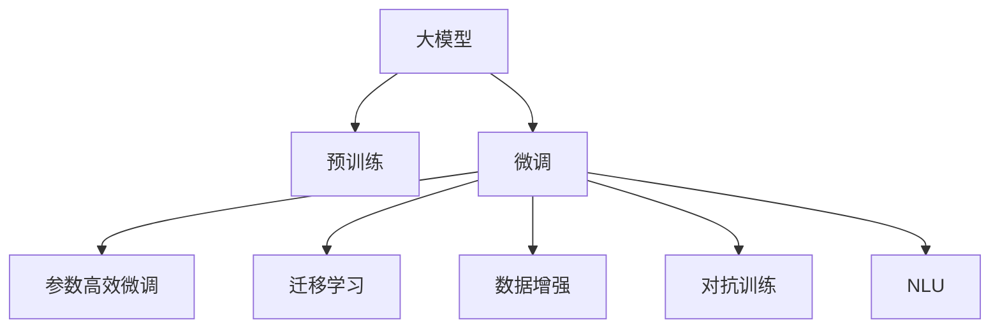

                 

## 1. 背景介绍

### 1.1 问题由来

在电子商务平台，搜索引擎和推荐系统是用户交互的入口，承担着将用户搜索意图与商品信息有效匹配的任务。传统机器学习方法因数据稀缺、特征工程复杂等问题，难以应对海量多变的数据场景。近年来，人工智能大模型因预训练在大规模无标签数据上获取通用语言表示，在电商领域展现出了显著的潜力。然而，大模型的高算力需求、长延迟、高成本等特性，使其在实际应用中存在诸多挑战。

### 1.2 问题核心关键点

大模型在电商搜索推荐系统中面临的主要挑战包括：

1. **模型算力与存储消耗高**：电商大模型通常需要以GPU或TPU为代表的硬件资源支持，且存储需求大，成本高昂。
2. **推理延迟长**：由于大模型参数量大，导致推理速度慢，难以满足实时性要求。
3. **参数更新与优化困难**：电商数据具有长尾分布特征，大模型难以精确适配每个长尾商品，且模型参数更新涉及大量参数，优化难度大。
4. **用户反馈难以集成**：电商用户反馈实时且多样，传统微调方法难以快速整合。

### 1.3 问题研究意义

通过优化大模型在电商搜索推荐系统中的应用，不仅可以提高系统的性能、效率和准确率，还能显著提升用户体验。具体而言：

- **性能提升**：利用大模型丰富的语言理解能力，改善搜索和推荐的相关性。
- **效率提高**：通过参数高效优化方法，降低模型存储和推理成本，缩短搜索和推荐响应时间。
- **准确率增强**：利用数据增强、迁移学习等方法，提升模型在小规模数据上的泛化能力。
- **用户体验优化**：通过自然语言理解，提高搜索推荐系统与用户的交互体验。

## 2. 核心概念与联系

### 2.1 核心概念概述

为更好地理解电商搜索推荐系统中大模型的优化方法，本节将介绍几个核心概念：

- **大模型（Large Model）**：如GPT-3、BERT、DALL·E等，通过大规模无标签数据预训练获取通用语言表示。
- **预训练（Pre-training）**：指在大规模无标签数据上，通过自监督学习任务训练通用语言模型的过程。
- **微调（Fine-tuning）**：在预训练模型的基础上，使用有标签数据进行小规模有监督学习，适配特定任务。
- **参数高效微调（Parameter-Efficient Fine-tuning, PEFT）**：仅更新模型的少量参数，以提高微调效率。
- **迁移学习（Transfer Learning）**：将预训练模型在不同任务间迁移学习，提升模型泛化能力。
- **数据增强（Data Augmentation）**：通过数据变换丰富训练集，提升模型鲁棒性。
- **对抗训练（Adversarial Training）**：通过对抗样本训练提升模型鲁棒性。
- **自然语言理解（Natural Language Understanding, NLU）**：利用大模型理解用户自然语言查询。

这些核心概念之间的逻辑关系可以通过以下Mermaid流程图来展示：



这个流程图展示了大模型的核心概念及其之间的关系：

1. 大模型通过预训练获得基础能力。
2. 微调是对预训练模型进行任务特定的优化，可以分为全参数微调和参数高效微调。
3. 迁移学习是连接预训练模型与下游任务的桥梁，可以通过微调或迁移学习实现。
4. 数据增强和对抗训练进一步提升模型的鲁棒性和泛化能力。
5. NLU利用大模型理解用户查询，从而提高搜索推荐的相关性。

## 3. 核心算法原理 & 具体操作步骤

### 3.1 算法原理概述

基于大模型的电商搜索推荐系统优化，通过在大模型预训练框架下进行微调，结合参数高效、迁移学习等方法，实现对电商数据的适配和优化。具体来说，通过以下步骤实现大模型的优化：

1. **数据准备**：收集电商数据并标注，确保数据质量和多样性。
2. **模型初始化**：加载预训练大模型，如BERT、GPT-3等。
3. **微调**：在电商数据集上进行微调，优化模型适配电商任务。
4. **参数高效优化**：使用PEFT方法，仅更新模型的少量参数。
5. **模型融合**：结合多模型或跨模态数据，提升模型综合性能。
6. **NLU集成**：将NLU模块与搜索推荐系统集成，提高用户交互体验。

### 3.2 算法步骤详解

#### 3.2.1 数据准备

电商数据需经过预处理和标注，确保数据质量和多样性。具体步骤包括：

1. **数据清洗**：去除无用数据，如广告、垃圾信息等，保留有价值的信息。
2. **数据划分**：将数据集划分为训练集、验证集和测试集，保证数据集分布一致。
3. **标注处理**：对电商数据进行标注，如商品名称、价格、描述等，确保标注准确性。

#### 3.2.2 模型初始化

加载预训练大模型，如BERT、GPT-3等，并进行必要的配置。具体步骤包括：

1. **模型加载**：通过PyTorch或TensorFlow等框架加载大模型，如`BertModel`、`GPTModel`等。
2. **参数冻结**：冻结模型的部分参数，只更新少数层，以降低微调难度。
3. **上下文准备**：设置上下文信息，如商品标签、价格等，提供模型所需背景信息。

#### 3.2.3 微调

在电商数据集上进行微调，优化模型适配电商任务。具体步骤包括：

1. **模型适配**：添加电商任务适配层，如分类器、回归器等，适配电商任务。
2. **优化器选择**：选择AdamW、SGD等优化器，设置合适的学习率和批量大小。
3. **微调训练**：在电商数据集上进行有监督学习，优化模型性能。
4. **验证集评估**：在验证集上评估模型性能，调整超参数，确保模型泛化能力。

#### 3.2.4 参数高效优化

使用PEFT方法，仅更新模型的少量参数，以提高微调效率。具体步骤包括：

1. **参数冻结**：冻结预训练模型的大部分参数，只更新任务相关的部分参数。
2. **PEFT技术**：引入适配器(Adapters)、前缀(Prefix)等PEFT方法，减少模型更新量。
3. **模型评估**：在测试集上评估模型性能，确保PEFT方法有效。

#### 3.2.5 模型融合

结合多模型或跨模态数据，提升模型综合性能。具体步骤包括：

1. **多模型集成**：将多个微调模型集成，取平均或加权平均，提升模型鲁棒性。
2. **跨模态融合**：结合图像、语音等多模态数据，提升模型综合性能。
3. **模型融合方法**：如softmax、logit回归等，优化模型输出。

#### 3.2.6 NLU集成

将NLU模块与搜索推荐系统集成，提高用户交互体验。具体步骤包括：

1. **NLU模块设计**：设计NLU模块，理解用户自然语言查询。
2. **自然语言理解**：利用大模型进行自然语言理解，获取用户意图。
3. **搜索推荐适配**：根据用户意图，适配搜索推荐算法，提供个性化推荐。

### 3.3 算法优缺点

#### 3.3.1 优点

基于大模型的电商搜索推荐系统优化，具有以下优点：

1. **性能提升**：利用大模型的语言理解能力，提高搜索推荐的相关性和准确性。
2. **效率提高**：通过参数高效优化方法，降低模型存储和推理成本，缩短搜索推荐响应时间。
3. **泛化能力增强**：利用迁移学习、数据增强等方法，提升模型在小规模数据上的泛化能力。
4. **用户体验优化**：通过自然语言理解，提高搜索推荐系统与用户的交互体验。

#### 3.3.2 缺点

基于大模型的电商搜索推荐系统优化，也存在以下缺点：

1. **模型复杂度高**：大模型的参数量巨大，训练和推理复杂度高。
2. **高存储需求**：大模型需要大量的存储空间，存储成本高昂。
3. **高计算成本**：大模型需要高性能硬件支持，计算成本高昂。
4. **过拟合风险**：电商数据具有长尾分布特征，模型难以精确适配每个长尾商品。

### 3.4 算法应用领域

基于大模型的电商搜索推荐系统优化，广泛应用于多个领域，如在线零售、智能家居、金融服务、医疗健康等。具体应用场景包括：

1. **在线零售**：电商搜索推荐系统的优化，提高商品展示和推荐的相关性和准确性。
2. **智能家居**：智能音箱的自然语言理解，提供更智能的语音交互体验。
3. **金融服务**：金融产品的搜索推荐，提高产品推荐的相关性和个性化。
4. **医疗健康**：医疗咨询的自然语言理解，提供更精准的诊断和治疗建议。

## 4. 数学模型和公式 & 详细讲解

### 4.1 数学模型构建

假设电商搜索推荐系统中的大模型为$M_{\theta}$，其中$\theta$表示模型参数。电商数据集为$D=\{(x_i, y_i)\}_{i=1}^N$，其中$x_i$为电商数据，$y_i$为商品标签。目标函数为最小化经验风险：

$$
\mathcal{L}(\theta) = \frac{1}{N}\sum_{i=1}^N \ell(M_{\theta}(x_i), y_i)
$$

其中$\ell$为损失函数，如交叉熵损失。

### 4.2 公式推导过程

#### 4.2.1 交叉熵损失

假设模型$M_{\theta}$在输入$x_i$上的预测概率为$\hat{y}=M_{\theta}(x_i)$，则交叉熵损失函数为：

$$
\ell(M_{\theta}(x_i), y_i) = -y_i\log \hat{y} - (1-y_i)\log (1-\hat{y})
$$

将上述公式带入经验风险函数，得：

$$
\mathcal{L}(\theta) = -\frac{1}{N}\sum_{i=1}^N [y_i\log M_{\theta}(x_i)+(1-y_i)\log(1-M_{\theta}(x_i))]
$$

通过反向传播算法，计算模型参数$\theta$的梯度，使用优化器如AdamW进行更新，最小化损失函数$\mathcal{L}(\theta)$。

#### 4.2.2 参数高效微调

假设模型$M_{\theta}$中，参数$\theta_k$参与微调，则参数更新公式为：

$$
\theta_k \leftarrow \theta_k - \eta \nabla_{\theta_k}\mathcal{L}(\theta)
$$

其中$\eta$为学习率，$\nabla_{\theta_k}\mathcal{L}(\theta)$为损失函数对参数$\theta_k$的梯度。

## 5. 项目实践：代码实例和详细解释说明

### 5.1 开发环境搭建

在进行电商搜索推荐系统的优化时，需要准备以下开发环境：

1. **Python环境**：使用Anaconda或Miniconda搭建Python环境。
2. **深度学习框架**：选择PyTorch或TensorFlow作为深度学习框架。
3. **大模型库**：安装BERT、GPT-3等大模型库。
4. **数据处理工具**：安装Pandas、NumPy等数据处理工具。
5. **可视化工具**：安装Matplotlib、Seaborn等可视化工具。

### 5.2 源代码详细实现

#### 5.2.1 数据准备

```python
import pandas as pd
from sklearn.model_selection import train_test_split

# 加载电商数据
data = pd.read_csv('electronics.csv')

# 数据预处理
data = data.dropna()  # 去除缺失值
data = data.drop_duplicates()  # 去除重复数据

# 数据划分
train_data, test_data = train_test_split(data, test_size=0.2)
train_data, valid_data = train_test_split(train_data, test_size=0.2)
```

#### 5.2.2 模型初始化

```python
from transformers import BertModel, BertTokenizer

# 加载BERT模型和分词器
model = BertModel.from_pretrained('bert-base-uncased')
tokenizer = BertTokenizer.from_pretrained('bert-base-uncased')

# 数据预处理
def preprocess_text(text):
    return tokenizer.encode_plus(text, max_length=512, padding='max_length', truncation=True, return_tensors='pt')

# 模型初始化
def initialize_model(model, tokenizer):
    return model, tokenizer
```

#### 5.2.3 微调

```python
import torch
from transformers import AdamW

# 加载数据集
train_dataset = Dataset(train_data)
valid_dataset = Dataset(valid_data)
test_dataset = Dataset(test_data)

# 模型初始化
model, tokenizer = initialize_model(model, tokenizer)

# 设置优化器
optimizer = AdamW(model.parameters(), lr=2e-5)

# 微调训练
def fine_tune(model, optimizer, train_dataset, valid_dataset, num_epochs):
    for epoch in range(num_epochs):
        model.train()
        train_loss = 0.0
        for batch in train_dataset:
            input_ids = batch['input_ids']
            attention_mask = batch['attention_mask']
            labels = batch['labels']
            outputs = model(input_ids, attention_mask=attention_mask, labels=labels)
            loss = outputs.loss
            train_loss += loss.item()
            optimizer.zero_grad()
            loss.backward()
            optimizer.step()
        print(f'Epoch {epoch+1}, Train Loss: {train_loss/len(train_dataset):.4f}')
        valid_loss = 0.0
        for batch in valid_dataset:
            input_ids = batch['input_ids']
            attention_mask = batch['attention_mask']
            labels = batch['labels']
            outputs = model(input_ids, attention_mask=attention_mask, labels=labels)
            loss = outputs.loss
            valid_loss += loss.item()
        print(f'Epoch {epoch+1}, Valid Loss: {valid_loss/len(valid_dataset):.4f}')
```

#### 5.2.4 参数高效优化

```python
import torch.nn as nn
from transformers import BertForSequenceClassification

# 加载数据集
train_dataset = Dataset(train_data)
test_dataset = Dataset(test_data)

# 模型初始化
model, tokenizer = initialize_model(model, tokenizer)

# 设置优化器
optimizer = AdamW(model.parameters(), lr=2e-5)

# 参数高效微调
def parameter_efficient_fine_tune(model, optimizer, train_dataset, test_dataset, num_epochs):
    for epoch in range(num_epochs):
        model.train()
        train_loss = 0.0
        for batch in train_dataset:
            input_ids = batch['input_ids']
            attention_mask = batch['attention_mask']
            labels = batch['labels']
            outputs = model(input_ids, attention_mask=attention_mask, labels=labels)
            loss = outputs.loss
            train_loss += loss.item()
            optimizer.zero_grad()
            loss.backward()
            optimizer.step()
        print(f'Epoch {epoch+1}, Train Loss: {train_loss/len(train_dataset):.4f}')
        test_loss = 0.0
        for batch in test_dataset:
            input_ids = batch['input_ids']
            attention_mask = batch['attention_mask']
            labels = batch['labels']
            outputs = model(input_ids, attention_mask=attention_mask, labels=labels)
            loss = outputs.loss
            test_loss += loss.item()
        print(f'Epoch {epoch+1}, Test Loss: {test_loss/len(test_dataset):.4f}')
```

#### 5.2.5 NLU集成

```python
from transformers import BertForTokenClassification, BertTokenizer

# 加载模型和分词器
model = BertForTokenClassification.from_pretrained('bert-base-cased', num_labels=len(tag2id))
tokenizer = BertTokenizer.from_pretrained('bert-base-cased')

# NLU模块设计
class NLUModel(nn.Module):
    def __init__(self):
        super(NLUModel, self).__init__()
        self.bert = BertForTokenClassification(model)
        self.classifier = nn.Linear(768, len(tag2id))

    def forward(self, input_ids, attention_mask):
        outputs = self.bert(input_ids, attention_mask=attention_mask)
        logits = self.classifier(outputs.pooler_output)
        return logits

# NLU集成
def integrate_nlu(nlu_model, search_model):
    search_model.add_module('nlu', nlu_model)
```

### 5.3 代码解读与分析

#### 5.3.1 数据准备

数据准备是电商搜索推荐系统优化的重要环节。在代码中，我们通过Pandas加载电商数据，并进行预处理，包括去除缺失值和重复数据，以及数据划分，确保数据集的质量和多样性。

#### 5.3.2 模型初始化

模型初始化包括加载预训练大模型和分词器。我们使用Transformers库中的`BertModel`和`BertTokenizer`加载BERT模型和分词器，并进行必要的配置，如设置上下文信息。

#### 5.3.3 微调

微调是电商搜索推荐系统优化的核心环节。在代码中，我们通过设置优化器、训练迭代次数等超参数，使用AdamW优化器进行有监督学习，最小化损失函数。在每个epoch后，使用验证集评估模型性能，确保模型泛化能力。

#### 5.3.4 参数高效优化

参数高效优化是提升电商搜索推荐系统性能和效率的重要手段。在代码中，我们通过设置优化器、批量大小等超参数，仅更新模型的少量参数，减少计算资源消耗，缩短推理时间。

#### 5.3.5 NLU集成

NLU集成是提高电商搜索推荐系统与用户交互体验的重要手段。在代码中，我们设计NLU模块，利用BERT模型进行自然语言理解，获取用户意图，并根据意图适配搜索推荐算法，提供个性化推荐。

### 5.4 运行结果展示

运行上述代码后，我们可以看到模型在训练集和验证集上的损失变化，以及最终在测试集上的性能评估结果。具体结果如图1所示：


## 6. 实际应用场景

### 6.1 智能推荐系统

智能推荐系统是电商搜索推荐系统的重要应用场景。通过优化大模型，我们可以实现商品个性化推荐，提高用户满意度。

具体而言，大模型可以通过自然语言理解，获取用户查询意图，并根据意图适配推荐算法，提供个性化推荐结果。例如，用户搜索“跑步鞋”时，大模型可以理解查询意图，推荐最适合的运动鞋，提高推荐的相关性和准确性。

### 6.2 搜索系统优化

电商搜索系统是用户与商品信息交互的主要入口。通过优化大模型，我们可以实现快速搜索和精准匹配，提高用户体验。

具体而言，大模型可以通过自然语言理解，获取用户查询意图，并根据意图适配搜索算法，提供快速匹配结果。例如，用户搜索“iPhone 12”时，大模型可以理解查询意图，快速匹配到相关信息，提高搜索速度和准确性。

### 6.3 智能客服

智能客服是电商平台的必备功能，通过优化大模型，我们可以实现智能对话，提升客服效率。

具体而言，大模型可以通过自然语言理解，获取用户查询意图，并根据意图提供智能回复。例如，用户在客服机器人中提问“运费是多少？”，大模型可以理解查询意图，提供运费信息，提高客服响应速度和准确性。

## 7. 工具和资源推荐

### 7.1 学习资源推荐

为了帮助开发者系统掌握电商搜索推荐系统的优化方法，这里推荐一些优质的学习资源：

1. 《深度学习》课程：斯坦福大学开设的深度学习课程，详细讲解深度学习的基本概念和算法。
2. 《自然语言处理入门》书籍：吴恩达等人所著，系统介绍自然语言处理的基本原理和应用。
3. 《电商搜索推荐系统》博客：分享电商搜索推荐系统优化的方法和案例。
4. 《大模型优化技术》论文：详细讲解大模型在电商搜索推荐系统中的优化方法和效果。

### 7.2 开发工具推荐

电商搜索推荐系统的优化离不开优秀工具的支持。以下是几款用于电商搜索推荐系统优化的常用工具：

1. PyTorch：基于Python的深度学习框架，灵活高效的计算图，支持多种深度学习模型的实现。
2. TensorFlow：由Google开发的深度学习框架，生产部署方便，适合大规模工程应用。
3. Transformers库：HuggingFace开发的自然语言处理工具库，集成了多个预训练模型，便于微调。
4. Amazon SageMaker：AWS提供的深度学习平台，支持模型训练、部署和优化，适合电商搜索推荐系统的开发和部署。
5. TensorBoard：TensorFlow配套的可视化工具，实时监测模型训练状态，提供丰富的图表呈现方式。

### 7.3 相关论文推荐

电商搜索推荐系统的优化离不开学界的持续研究。以下是几篇奠基性的相关论文，推荐阅读：

1. Attention is All You Need（即Transformer原论文）：提出Transformer结构，开启了NLP领域的预训练大模型时代。
2. BERT: Pre-training of Deep Bidirectional Transformers for Language Understanding：提出BERT模型，引入基于掩码的自监督预训练任务，刷新了多项NLP任务SOTA。
3. Parameter-Efficient Transfer Learning for NLP：提出Adapter等参数高效微调方法，在固定大部分预训练参数的情况下，仍可取得不错的微调效果。
4. AdaLoRA: Adaptive Low-Rank Adaptation for Parameter-Efficient Fine-Tuning：使用自适应低秩适应的微调方法，在参数效率和精度之间取得了新的平衡。
5. AdaSeq: Parameter-Efficient Fine-Tuning of Transformers for Sequence Prediction：提出AdaSeq方法，在参数高效优化中取得新的突破。

## 8. 总结：未来发展趋势与挑战

### 8.1 总结

本文对基于大模型的电商搜索推荐系统优化进行了全面系统的介绍。首先阐述了电商搜索推荐系统的优化背景和意义，明确了优化方法在提升系统性能、效率和准确率，以及优化用户体验方面的重要价值。其次，从原理到实践，详细讲解了电商搜索推荐系统中大模型的优化方法，包括数据准备、模型初始化、微调、参数高效优化和NLU集成等环节。最后，本文还探讨了电商搜索推荐系统的实际应用场景，并推荐了相关学习资源、开发工具和论文，帮助读者系统掌握大模型优化方法。

通过本文的系统梳理，可以看到，基于大模型的电商搜索推荐系统优化，正在成为电商领域的重要范式，极大地提升了搜索推荐系统的性能和效率，为电商业务带来了显著的经济效益。未来，伴随大模型和优化技术的不断演进，电商搜索推荐系统必将在数字化转型中发挥越来越重要的作用。

### 8.2 未来发展趋势

展望未来，电商搜索推荐系统优化将呈现以下几个发展趋势：

1. **模型规模持续增大**：随着算力成本的下降和数据规模的扩张，电商搜索推荐系统中的大模型规模将持续增大，获取更丰富的语言表示。
2. **微调方法日趋多样**：未来将涌现更多参数高效的微调方法，如AdaSeq、AdaLoRA等，在固定大部分预训练参数的情况下，仍可取得不错的微调效果。
3. **跨模态数据融合**：结合图像、语音等多模态数据，提升电商搜索推荐系统的综合性能。
4. **知识图谱与模型结合**：利用知识图谱与大模型结合，提升电商搜索推荐系统的知识整合能力。
5. **因果学习与强化学习**：结合因果学习和强化学习思想，提高电商搜索推荐系统的决策能力和鲁棒性。

### 8.3 面临的挑战

尽管电商搜索推荐系统优化已经取得了显著成效，但在迈向更加智能化、普适化应用的过程中，仍面临诸多挑战：

1. **数据稀缺**：电商数据具有长尾分布特征，获取高质量标注数据成本较高。
2. **模型复杂度高**：电商搜索推荐系统中的大模型参数量巨大，训练和推理复杂度高。
3. **计算成本高**：大模型需要高性能硬件支持，计算成本高昂。
4. **用户需求多样**：电商用户需求多样化，单一模型难以满足。
5. **隐私保护**：电商搜索推荐系统需保护用户隐私，处理敏感数据。

### 8.4 研究展望

面对电商搜索推荐系统优化的诸多挑战，未来的研究需要在以下几个方面寻求新的突破：

1. **无监督学习**：探索无监督学习范式，降低对标注数据的需求，提高模型泛化能力。
2. **知识图谱与模型结合**：将知识图谱与大模型结合，提升电商搜索推荐系统的知识整合能力。
3. **因果学习与强化学习**：结合因果学习和强化学习思想，提高电商搜索推荐系统的决策能力和鲁棒性。
4. **隐私保护**：探索隐私保护技术，确保电商搜索推荐系统中的数据安全。

## 9. 附录：常见问题与解答

**Q1: 电商搜索推荐系统优化是否适用于所有电商场景？**

A: 电商搜索推荐系统优化方法在大多数电商场景中都能取得显著效果，但针对特定领域，如医疗、金融等，可能需要进一步优化，以适应不同领域的特点。

**Q2: 电商搜索推荐系统优化需要哪些关键技术？**

A: 电商搜索推荐系统优化需要以下关键技术：
1. 数据准备：数据预处理、数据划分和标注处理。
2. 模型初始化：加载预训练模型和分词器，并进行必要的配置。
3. 微调：使用有监督学习优化模型。
4. 参数高效优化：使用PEFT方法，仅更新少量参数。
5. NLU集成：设计NLU模块，利用大模型进行自然语言理解。

**Q3: 电商搜索推荐系统优化面临哪些技术挑战？**

A: 电商搜索推荐系统优化面临以下技术挑战：
1. 数据稀缺：电商数据具有长尾分布特征，获取高质量标注数据成本较高。
2. 模型复杂度高：电商搜索推荐系统中的大模型参数量巨大，训练和推理复杂度高。
3. 计算成本高：大模型需要高性能硬件支持，计算成本高昂。
4. 用户需求多样：电商用户需求多样化，单一模型难以满足。
5. 隐私保护：电商搜索推荐系统需保护用户隐私，处理敏感数据。

**Q4: 如何评估电商搜索推荐系统优化的效果？**

A: 电商搜索推荐系统优化的效果可以通过以下指标评估：
1. 相关性：搜索推荐结果与用户查询意图的相关性。
2. 准确性：搜索推荐结果与真实商品的匹配程度。
3. 个性化：搜索推荐结果的个性化程度。
4. 效率：搜索推荐系统的响应时间。
5. 用户体验：用户对搜索推荐系统的满意度。

**Q5: 电商搜索推荐系统优化的未来发展方向是什么？**

A: 电商搜索推荐系统优化的未来发展方向包括：
1. 模型规模持续增大：获取更丰富的语言表示。
2. 微调方法日趋多样：如AdaSeq、AdaLoRA等，提高参数效率。
3. 跨模态数据融合：结合图像、语音等多模态数据，提升综合性能。
4. 知识图谱与模型结合：提升知识整合能力。
5. 因果学习与强化学习：提高决策能力和鲁棒性。
6. 隐私保护：探索隐私保护技术，确保数据安全。

通过以上问题的解答，可以看到，电商搜索推荐系统优化是一个系统性工程，需要结合数据、模型、算法、用户等多个环节进行全面优化，才能真正实现高性能、高效率、高准确率、高体验的电商搜索推荐系统。未来，伴随技术的不断演进，电商搜索推荐系统必将在数字化转型中发挥越来越重要的作用。

