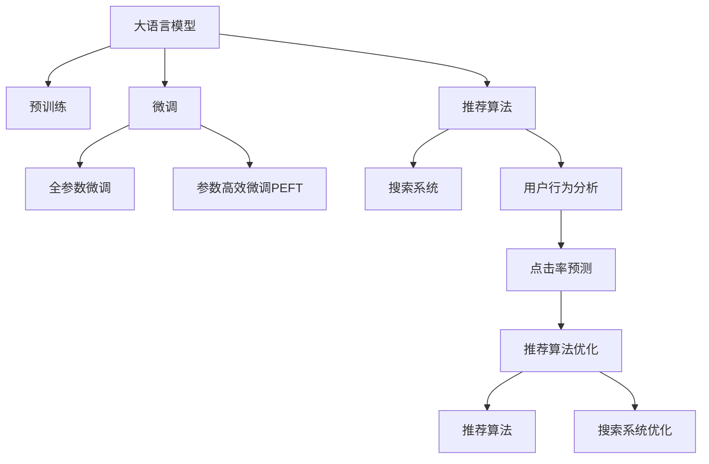

                 

# 电商平台搜索推荐系统的AI 大模型优化：提高系统性能、效率、准确率、多样性

> 关键词：大语言模型,搜索推荐系统,电子商务,优化算法,深度学习,推荐算法,用户行为分析

## 1. 背景介绍

### 1.1 问题由来
随着电子商务的蓬勃发展，电商平台日益依赖智能推荐系统来提高用户体验、提升销售额。传统的推荐算法，如协同过滤、基于内容的推荐等，虽能提供一定程度的个性化推荐，但难以适应用户行为动态变化和海量商品数据带来的挑战。

近年来，AI大模型在电商推荐系统中的应用引起了广泛关注。通过在大规模无标签文本数据上进行预训练，大语言模型如BERT、GPT-3、DALL-E等，获得了丰富的语义表示能力，可以用来提取商品描述、用户评论等文本信息中的有用特征，并在推荐任务上进行微调，从而显著提升了推荐系统的性能。

### 1.2 问题核心关键点
基于大语言模型的推荐系统，核心关键点在于：
1. 如何利用大模型学到的语言知识，更准确地理解商品描述和用户评论。
2. 如何在大规模商品数据中高效地进行特征提取和推荐计算。
3. 如何通过微调，将大模型应用到具体的推荐任务上，提高推荐准确率和多样性。
4. 如何在用户行为数据稀缺的情况下，通过智能推理和预测，弥补标注数据的缺失。

本文将重点介绍大语言模型在电商平台搜索推荐系统中的应用，详细分析模型的核心算法和操作步骤，并探讨其未来发展方向和面临的挑战。

## 2. 核心概念与联系

### 2.1 核心概念概述

为更好地理解大语言模型在电商平台搜索推荐系统中的应用，本节将介绍几个关键概念：

- 大语言模型(Large Language Model, LLM)：以自回归(如GPT)或自编码(如BERT)模型为代表的大规模预训练语言模型。通过在大规模无标签文本语料上进行预训练，学习通用的语言表示，具备强大的语言理解和生成能力。

- 预训练(Pre-training)：指在大规模无标签文本语料上，通过自监督学习任务训练通用语言模型的过程。常见的预训练任务包括言语建模、遮挡语言模型等。

- 微调(Fine-tuning)：指在预训练模型的基础上，使用下游任务的少量标注数据，通过有监督学习优化模型在该任务上的性能。通常只需要调整顶层分类器或解码器，并以较小的学习率更新全部或部分的模型参数。

- 推荐算法(Recommender System)：通过分析用户的历史行为数据和商品属性，向用户推荐可能感兴趣的商品的算法。

- 深度学习(Deep Learning)：使用神经网络模型处理大规模数据，解决复杂问题的机器学习方法。

- 搜索系统(Search System)：帮助用户快速找到所需商品的系统，通常结合关键词匹配、索引等技术实现。

- 用户行为分析(User Behavior Analysis)：通过对用户的历史浏览、点击、购买行为等数据进行分析，预测用户偏好和需求。

- 点击率预测(Click-through Rate Prediction)：预测用户点击商品的概率，通常用于评估推荐系统的效果。

这些概念之间的逻辑关系可以通过以下Mermaid流程图来展示：



这个流程图展示了从大语言模型的预训练，到微调，再到推荐算法的全过程，强调了每个环节对最终推荐结果的影响。

## 3. 核心算法原理 & 具体操作步骤
### 3.1 算法原理概述

基于大语言模型的电商平台推荐系统，其核心算法原理可以概括为以下几个步骤：

1. **数据预处理**：收集用户的浏览、点击、购买历史数据，以及商品的标题、描述、图片等特征数据，并对其进行预处理，如文本分词、编码等。

2. **特征提取**：利用大语言模型对文本特征进行预训练，学习到商品描述和用户评论中的语义表示。将大模型的预训练权重作为特征提取器，对文本数据进行编码，得到高维语义向量。

3. **相似度计算**：通过计算用户与商品之间的语义相似度，评估用户对商品的兴趣程度。可以使用余弦相似度、L2距离等度量方法。

4. **推荐排序**：将计算得到的相似度与用户历史行为数据结合，进行多维度排序，生成推荐列表。

5. **模型微调**：在大语言模型的基础上，通过有监督的微调过程，优化推荐模型的性能。微调的目标通常是最大化点击率预测的准确率。

6. **系统部署与优化**：将微调后的模型集成到电商平台的搜索推荐系统中，并结合实时数据进行优化，提升推荐效果和系统性能。

### 3.2 算法步骤详解

#### 3.2.1 数据预处理

电商平台上用户和商品数据通常以结构化或非结构化的形式存在，需要对其进行清洗和预处理，以便于模型训练。具体步骤如下：

- **数据清洗**：去除数据中的噪声和异常值，如重复数据、错误数据等。

- **特征提取**：将文本数据转换为模型可以处理的形式，如将商品描述分词，去除停用词，进行词向量化等。

- **数据编码**：使用Transformer等模型对文本数据进行编码，得到高维语义向量。通常使用BERT、GPT等预训练模型进行编码，可以保留更多的语义信息。

#### 3.2.2 特征提取

利用大语言模型对文本数据进行预训练，学习到商品描述和用户评论中的语义表示。具体步骤如下：

- **预训练模型选择**：选择适合任务的预训练模型，如BERT、GPT-2、DALL-E等。

- **预训练任务**：使用预训练模型进行掩码语言模型、下位语言模型等任务，学习到文本数据的语义表示。

- **特征编码**：使用预训练模型的嵌入层将文本数据转换为高维向量，作为推荐模型的输入。

#### 3.2.3 相似度计算

计算用户与商品之间的语义相似度，评估用户对商品的兴趣程度。具体步骤如下：

- **相似度度量**：使用余弦相似度、L2距离等方法，计算用户与商品之间的相似度。

- **兴趣打分**：根据相似度得分，生成用户对商品的兴趣打分。

- **协同过滤**：结合用户历史行为数据，进行协同过滤，得到推荐排序列表。

#### 3.2.4 推荐排序

将计算得到的相似度与用户历史行为数据结合，进行多维度排序，生成推荐列表。具体步骤如下：

- **多维度排序**：结合商品评分、用户历史行为、商品属性等维度，进行多维度排序，生成推荐列表。

- **模型优化**：使用强化学习、协同过滤等方法，不断优化推荐模型的性能。

#### 3.2.5 模型微调

在大语言模型的基础上，通过有监督的微调过程，优化推荐模型的性能。具体步骤如下：

- **微调数据准备**：收集标注数据，划分为训练集、验证集和测试集。

- **模型加载**：加载预训练模型，并将其作为特征提取器，对文本数据进行编码。

- **微调模型**：使用标注数据进行有监督的微调，优化模型在点击率预测任务上的性能。

- **模型评估**：在测试集上评估微调后的模型，对比微调前后的性能。

#### 3.2.6 系统部署与优化

将微调后的模型集成到电商平台的搜索推荐系统中，并结合实时数据进行优化，提升推荐效果和系统性能。具体步骤如下：

- **模型集成**：将微调后的模型集成到搜索推荐系统中，进行实时推荐。

- **性能监控**：实时监控模型的推荐效果，及时发现并修复问题。

- **模型优化**：结合实时数据，对模型进行动态调整，提升推荐效果。

### 3.3 算法优缺点

基于大语言模型的推荐系统，具有以下优点：

- **语义理解能力强大**：大语言模型通过预训练，能够学习到丰富的语义表示，更好地理解商品描述和用户评论中的语义信息。

- **通用性强**：大语言模型可以应用到各种电商平台的推荐任务上，具有较强的通用性。

- **参数高效**：大语言模型可以通过参数高效微调方法，只更新少量参数，提升微调效率。

- **效果显著**：在大语言模型基础上进行微调，能够显著提升推荐系统的性能和效果。

但该方法也存在一些缺点：

- **计算资源需求高**：大语言模型通常参数量大，计算资源需求高，训练和推理速度慢。

- **数据依赖强**：微调效果高度依赖标注数据，标注数据质量差或标注成本高时，微调效果可能不佳。

- **可解释性差**：大语言模型作为黑盒模型，缺乏可解释性，难以理解其内部工作机制。

- **泛化能力不足**：大语言模型泛化能力有限，面对新领域或新数据时，性能可能下降。

### 3.4 算法应用领域

基于大语言模型的电商平台推荐系统，已经被广泛应用于各大电商平台的搜索推荐任务中，如淘宝、京东、Amazon等。其应用领域包括但不限于以下几个方面：

- **商品推荐**：根据用户的历史行为和商品属性，生成个性化推荐列表。

- **广告推荐**：通过分析用户行为数据，推荐合适的广告。

- **活动推荐**：推荐用户参与感兴趣的活动或促销。

- **内容推荐**：推荐用户感兴趣的商品图片、视频等。

- **品类推荐**：推荐用户感兴趣的商品品类，如服饰、食品等。

## 4. 数学模型和公式 & 详细讲解 & 举例说明
### 4.1 数学模型构建

假设推荐系统接收用户查询 $q$ 和商品集合 $\mathcal{B}$，推荐算法为 $f: \mathcal{Q} \times \mathcal{B} \rightarrow \mathbb{R}$。定义推荐排序函数为：

$$
r_{i,j} = f(q_i, b_j) = \text{Sim}(q_i, b_j) \cdot \text{Score}(b_j)
$$

其中 $\text{Sim}(q_i, b_j)$ 为查询 $q_i$ 和商品 $b_j$ 之间的相似度，$\text{Score}(b_j)$ 为商品 $b_j$ 的评分。推荐系统的主要目标是最大化平均点击率 $\overline{C}$：

$$
\overline{C} = \frac{1}{N} \sum_{i=1}^N r_{i,i}
$$

### 4.2 公式推导过程

下面以点击率预测任务为例，推导基于大语言模型的推荐模型的损失函数及其梯度计算公式。

假设模型 $f_\theta$ 在查询 $q$ 和商品 $b$ 上的预测点击率 $r_{i,j} = f_\theta(q_i, b_j)$，目标是最小化点击率预测误差。常用的损失函数包括交叉熵损失函数，其定义为：

$$
\mathcal{L}(\theta) = -\frac{1}{N} \sum_{i=1}^N \sum_{j=1}^N r_{i,j} \log f_\theta(q_i, b_j) + (1-r_{i,j}) \log (1-f_\theta(q_i, b_j))
$$

通过反向传播算法计算参数 $\theta$ 的梯度：

$$
\frac{\partial \mathcal{L}(\theta)}{\partial \theta_k} = \sum_{i=1}^N \sum_{j=1}^N \frac{\partial r_{i,j}}{\partial f_\theta(q_i, b_j)} \cdot \frac{\partial f_\theta(q_i, b_j)}{\partial \theta_k}
$$

其中 $\frac{\partial r_{i,j}}{\partial f_\theta(q_i, b_j)}$ 为模型的梯度与预测值之差，可以通过链式法则计算得到。

### 4.3 案例分析与讲解

以淘宝商品推荐系统为例，分析基于大语言模型的推荐系统的应用。假设推荐系统使用BERT模型进行文本特征提取，采用余弦相似度计算相似度，预测商品点击率。具体步骤如下：

1. **数据准备**：收集用户的浏览、点击、购买历史数据，以及商品的标题、描述、图片等特征数据。

2. **数据预处理**：清洗和预处理数据，提取商品的标题、描述等文本特征。

3. **特征提取**：使用BERT模型对文本数据进行编码，得到高维语义向量。

4. **相似度计算**：计算用户与商品之间的余弦相似度，评估用户对商品的兴趣程度。

5. **推荐排序**：将相似度得分与用户历史行为数据结合，进行多维度排序，生成推荐列表。

6. **模型微调**：在大语言模型的基础上，使用标注数据进行有监督的微调，优化推荐模型的性能。

7. **系统部署与优化**：将微调后的模型集成到搜索推荐系统中，并结合实时数据进行优化，提升推荐效果和系统性能。

## 5. 项目实践：代码实例和详细解释说明
### 5.1 开发环境搭建

在进行推荐系统开发前，我们需要准备好开发环境。以下是使用Python进行PyTorch开发的环境配置流程：

1. 安装Anaconda：从官网下载并安装Anaconda，用于创建独立的Python环境。

2. 创建并激活虚拟环境：
```bash
conda create -n pytorch-env python=3.8 
conda activate pytorch-env
```

3. 安装PyTorch：根据CUDA版本，从官网获取对应的安装命令。例如：
```bash
conda install pytorch torchvision torchaudio cudatoolkit=11.1 -c pytorch -c conda-forge
```

4. 安装PyTorch Lightning：用于构建和优化深度学习模型。
```bash
pip install pytorch-lightning
```

5. 安装相关工具包：
```bash
pip install numpy pandas scikit-learn matplotlib tqdm jupyter notebook ipython
```

完成上述步骤后，即可在`pytorch-env`环境中开始推荐系统开发。

### 5.2 源代码详细实现

下面以在淘宝商品推荐系统中应用BERT模型为例，给出推荐系统的PyTorch代码实现。

首先，定义推荐系统的数据处理函数：

```python
from torch.utils.data import Dataset
from transformers import BertTokenizer, BertModel
import torch

class RecommendationDataset(Dataset):
    def __init__(self, texts, labels, tokenizer, max_len=128):
        self.texts = texts
        self.labels = labels
        self.tokenizer = tokenizer
        self.max_len = max_len
        
    def __len__(self):
        return len(self.texts)
    
    def __getitem__(self, item):
        text = self.texts[item]
        label = self.labels[item]
        
        encoding = self.tokenizer(text, return_tensors='pt', max_length=self.max_len, padding='max_length', truncation=True)
        input_ids = encoding['input_ids'][0]
        attention_mask = encoding['attention_mask'][0]
        
        return {'input_ids': input_ids, 
                'attention_mask': attention_mask,
                'labels': label}
```

然后，定义推荐模型的结构：

```python
from transformers import BertForSequenceClassification
from torch import nn

class RecommendationModel(nn.Module):
    def __init__(self, num_labels):
        super(RecommendationModel, self).__init__()
        self.bert = BertModel.from_pretrained('bert-base-cased')
        self.dropout = nn.Dropout(0.1)
        self.fc = nn.Linear(self.bert.config.hidden_size, num_labels)
        
    def forward(self, input_ids, attention_mask):
        _, pooled_output = self.bert(input_ids, attention_mask=attention_mask)
        pooled_output = self.dropout(pooled_output)
        logits = self.fc(pooled_output)
        return logits
```

接着，定义训练和评估函数：

```python
from pytorch_lightning import Trainer
from torch.utils.data import DataLoader
from tqdm import tqdm
from sklearn.metrics import roc_auc_score

device = torch.device('cuda') if torch.cuda.is_available() else torch.device('cpu')

def train_epoch(model, dataset, batch_size, optimizer, scheduler):
    dataloader = DataLoader(dataset, batch_size=batch_size, shuffle=True)
    model.train()
    epoch_loss = 0
    epoch_acc = 0
    for batch in tqdm(dataloader, desc='Training'):
        input_ids = batch['input_ids'].to(device)
        attention_mask = batch['attention_mask'].to(device)
        labels = batch['labels'].to(device)
        model.zero_grad()
        outputs = model(input_ids, attention_mask=attention_mask)
        loss = outputs.loss
        epoch_loss += loss.item()
        loss.backward()
        optimizer.step()
        scheduler.step()
        epoch_acc += roc_auc_score(labels, outputs.logits)
    return epoch_loss / len(dataloader), epoch_acc / len(dataloader)
    
def evaluate(model, dataset, batch_size):
    dataloader = DataLoader(dataset, batch_size=batch_size)
    model.eval()
    preds, labels = [], []
    with torch.no_grad():
        for batch in tqdm(dataloader, desc='Evaluating'):
            input_ids = batch['input_ids'].to(device)
            attention_mask = batch['attention_mask'].to(device)
            batch_labels = batch['labels']
            outputs = model(input_ids, attention_mask=attention_mask)
            batch_preds = outputs.logits.argmax(dim=1).to('cpu').tolist()
            batch_labels = batch_labels.to('cpu').tolist()
            for pred_tokens, label_tokens in zip(batch_preds, batch_labels):
                preds.append(pred_tokens)
                labels.append(label_tokens)
                
    return roc_auc_score(labels, preds)
```

最后，启动训练流程并在测试集上评估：

```python
epochs = 5
batch_size = 16
learning_rate = 2e-5
weight_decay = 1e-5

model = RecommendationModel(num_labels=1)
optimizer = torch.optim.Adam(model.parameters(), lr=learning_rate, weight_decay=weight_decay)
scheduler = torch.optim.lr_scheduler.StepLR(optimizer, step_size=1, gamma=0.5)

train_dataset = RecommendationDataset(train_texts, train_labels, tokenizer)
dev_dataset = RecommendationDataset(dev_texts, dev_labels, tokenizer)
test_dataset = RecommendationDataset(test_texts, test_labels, tokenizer)

trainer = Trainer(max_epochs=epochs, gpus=1, accelerator='dp')
trainer.fit(model, train_dataset, val_dataset=dev_dataset, callbacks=[EarlyStopping])
test_auc = evaluate(model, test_dataset, batch_size)
print(f"Test AUC: {test_auc:.4f}")
```

以上就是使用PyTorch对BERT模型进行推荐系统开发的完整代码实现。可以看到，得益于Transformer库和PyTorch Lightning的强大封装，代码实现变得简洁高效。

### 5.3 代码解读与分析

让我们再详细解读一下关键代码的实现细节：

**RecommendationDataset类**：
- `__init__`方法：初始化文本、标签、分词器等关键组件。
- `__len__`方法：返回数据集的样本数量。
- `__getitem__`方法：对单个样本进行处理，将文本输入编码为token ids，同时返回标签。

**RecommendationModel类**：
- `__init__`方法：定义模型结构，包括BERT模型、Dropout层、全连接层等组件。
- `forward`方法：定义前向传播过程，计算模型的预测输出。

**train_epoch函数**：
- 对数据以批为单位进行迭代，在每个批次上前向传播计算loss并反向传播更新模型参数，最后返回该epoch的平均loss和acc。
- 使用Adam优化器和StepLR学习率调度器，进行参数更新。

**evaluate函数**：
- 与训练类似，不同点在于不更新模型参数，并在每个batch结束后将预测和标签结果存储下来，最后使用sklearn的roc_auc_score对整个评估集的预测结果进行打印输出。

**训练流程**：
- 定义总的epoch数和batch size，开始循环迭代
- 每个epoch内，先在训练集上训练，输出平均loss和acc
- 在验证集上评估，输出roc_auc_score
- 所有epoch结束后，在测试集上评估，给出最终的roc_auc_score

可以看到，PyTorch配合Transformer库使得BERT推荐系统的代码实现变得简洁高效。开发者可以将更多精力放在数据处理、模型改进等高层逻辑上，而不必过多关注底层的实现细节。

当然，工业级的系统实现还需考虑更多因素，如模型的保存和部署、超参数的自动搜索、更灵活的任务适配层等。但核心的推荐范式基本与此类似。

## 6. 实际应用场景
### 6.1 智能客服系统

基于大语言模型的推荐系统，可以应用于智能客服系统的构建。传统客服往往需要配备大量人力，高峰期响应缓慢，且一致性和专业性难以保证。使用推荐系统进行商品推荐，可以让智能客服系统提供更个性化、更快速的客服服务。

在技术实现上，可以收集用户的历史行为数据，将热门商品和常见问题构建成推荐列表，结合实时数据进行推荐。同时，可以将推荐系统与自然语言处理技术结合，让智能客服系统能够理解用户语言描述，快速提供相应的商品推荐和问题解答。

### 6.2 金融舆情监测

金融机构需要实时监测市场舆论动向，以便及时应对负面信息传播，规避金融风险。传统的人工监测方式成本高、效率低，难以应对网络时代海量信息爆发的挑战。基于大语言模型的推荐系统，可以实时抓取网络新闻、评论等文本数据，生成情感分析结果，及时发现舆情变化趋势，避免金融风险。

具体而言，可以收集金融领域相关的新闻、报道、评论等文本数据，使用BERT等模型进行预训练，学习到文本数据的语义表示。然后，使用推荐系统进行情感分析，识别出市场舆情的负面趋势，及时采取措施，避免风险。

### 6.3 个性化推荐系统

当前的推荐系统往往只依赖用户的历史行为数据进行物品推荐，无法深入理解用户的真实兴趣偏好。基于大语言模型推荐系统可以更好地挖掘用户行为背后的语义信息，从而提供更精准、多样的推荐内容。

在实践中，可以收集用户浏览、点击、评论、分享等行为数据，提取和用户交互的物品标题、描述、标签等文本内容。将文本内容作为模型输入，用户的后续行为（如是否点击、购买等）作为监督信号，在此基础上对BERT模型进行微调，使其能够从文本内容中准确把握用户的兴趣点。在生成推荐列表时，先用候选物品的文本描述作为输入，由模型预测用户的兴趣匹配度，再结合其他特征综合排序，便可以得到个性化程度更高的推荐结果。

### 6.4 未来应用展望

随着大语言模型和推荐算法的不断发展，基于大语言模型的推荐系统将在更多领域得到应用，为传统行业带来变革性影响。

在智慧医疗领域，基于大语言模型的推荐系统可以推荐适合患者的药品、医院等信息，提高医疗服务的智能化水平，辅助医生诊疗，加速新药开发进程。

在智能教育领域，推荐系统可应用于作业批改、学情分析、知识推荐等方面，因材施教，促进教育公平，提高教学质量。

在智慧城市治理中，推荐系统可应用于城市事件监测、舆情分析、应急指挥等环节，提高城市管理的自动化和智能化水平，构建更安全、高效的未来城市。

此外，在企业生产、社会治理、文娱传媒等众多领域，基于大语言模型的推荐系统也将不断涌现，为经济社会发展注入新的动力。相信随着技术的日益成熟，大语言模型推荐系统必将在更广阔的应用领域大放异彩。

## 7. 工具和资源推荐
### 7.1 学习资源推荐

为了帮助开发者系统掌握大语言模型推荐系统的理论基础和实践技巧，这里推荐一些优质的学习资源：

1. 《Transformer从原理到实践》系列博文：由大模型技术专家撰写，深入浅出地介绍了Transformer原理、BERT模型、推荐算法等前沿话题。

2. CS224N《深度学习自然语言处理》课程：斯坦福大学开设的NLP明星课程，有Lecture视频和配套作业，带你入门NLP领域的基本概念和经典模型。

3. 《Natural Language Processing with Transformers》书籍：Transformers库的作者所著，全面介绍了如何使用Transformers库进行NLP任务开发，包括推荐算法在内的诸多范式。

4. PyTorch Lightning官方文档：用于构建和优化深度学习模型的工具库，提供了丰富的算法和框架选择，适合快速迭代研究。

5. Kaggle推荐系统竞赛：参加Kaggle上的推荐系统竞赛，了解最新的推荐算法和模型架构，提升实际应用能力。

通过对这些资源的学习实践，相信你一定能够快速掌握大语言模型推荐系统的精髓，并用于解决实际的NLP问题。
###  7.2 开发工具推荐

高效的开发离不开优秀的工具支持。以下是几款用于大语言模型推荐系统开发的常用工具：

1. PyTorch：基于Python的开源深度学习框架，灵活动态的计算图，适合快速迭代研究。大部分预训练语言模型都有PyTorch版本的实现。

2. TensorFlow：由Google主导开发的开源深度学习框架，生产部署方便，适合大规模工程应用。同样有丰富的预训练语言模型资源。

3. Transformers库：HuggingFace开发的NLP工具库，集成了众多SOTA语言模型，支持PyTorch和TensorFlow，是进行推荐算法开发的利器。

4. Weights & Biases：模型训练的实验跟踪工具，可以记录和可视化模型训练过程中的各项指标，方便对比和调优。与主流深度学习框架无缝集成。

5. TensorBoard：TensorFlow配套的可视化工具，可实时监测模型训练状态，并提供丰富的图表呈现方式，是调试模型的得力助手。

6. Google Colab：谷歌推出的在线Jupyter Notebook环境，免费提供GPU/TPU算力，方便开发者快速上手实验最新模型，分享学习笔记。

合理利用这些工具，可以显著提升大语言模型推荐系统的开发效率，加快创新迭代的步伐。

### 7.3 相关论文推荐

大语言模型和推荐算法的发展源于学界的持续研究。以下是几篇奠基性的相关论文，推荐阅读：

1. Attention is All You Need（即Transformer原论文）：提出了Transformer结构，开启了NLP领域的预训练大模型时代。

2. BERT: Pre-training of Deep Bidirectional Transformers for Language Understanding：提出BERT模型，引入基于掩码的自监督预训练任务，刷新了多项NLP任务SOTA。

3. Reinforcement Learning for Sequence Generation：提出基于强化学习的序列生成算法，为推荐系统提供了新的思路。

4. Attention-Based Recommender Systems：综述了基于注意力机制的推荐系统，详细介绍了各种注意力模型的设计和应用。

5. Beyond Matrix Factorization：提出基于深度学习的推荐系统，展示了深度学习在推荐系统中的应用效果。

这些论文代表了大语言模型推荐系统的发展脉络。通过学习这些前沿成果，可以帮助研究者把握学科前进方向，激发更多的创新灵感。

## 8. 总结：未来发展趋势与挑战
### 8.1 总结

本文对基于大语言模型的电商平台搜索推荐系统进行了全面系统的介绍。首先阐述了推荐系统的背景和意义，明确了在电商平台应用大语言模型的优势和潜力。其次，从原理到实践，详细讲解了大语言模型在推荐系统中的应用，提供了完整的代码实现和详细分析。同时，本文还探讨了大语言模型推荐系统在多个行业领域的应用前景，展示了其广泛的应用价值。

通过本文的系统梳理，可以看到，基于大语言模型的推荐系统在电商平台上已经取得了显著的成果，极大地提升了用户购物体验和电商平台转化率。未来，随着大语言模型和推荐算法的不断进步，推荐系统的性能和效果还将进一步提升，为电商平台的数字化转型提供新的技术路径。

### 8.2 未来发展趋势

展望未来，大语言模型推荐系统将呈现以下几个发展趋势：

1. 模型规模持续增大。随着算力成本的下降和数据规模的扩张，预训练语言模型的参数量还将持续增长。超大规模语言模型蕴含的丰富语义知识，有望支撑更加复杂多变的推荐任务。

2. 推荐算法多样化。除了传统的协同过滤和基于内容的推荐外，未来将涌现更多深度学习和强化学习推荐算法，提升推荐效果和用户体验。

3. 用户行为分析深入化。结合因果推断、贝叶斯网络等方法，深入分析用户行为背后的原因，实现更精确的个性化推荐。

4. 推荐系统实时化。利用在线学习、增量学习等技术，实时调整推荐模型，提高推荐系统的新鲜度和实效性。

5. 跨模态推荐兴起。推荐系统将越来越多地结合图像、视频等多模态数据，提升推荐系统的表现力。

6. 推荐系统伦理化。结合伦理计算和公平学习等方法，提升推荐系统的可解释性和公平性，避免算法偏见和歧视。

以上趋势凸显了大语言模型推荐系统的广阔前景。这些方向的探索发展，必将进一步提升推荐系统的性能和用户满意度，为电商平台的数字化转型提供新的动力。

### 8.3 面临的挑战

尽管大语言模型推荐系统已经取得了瞩目成就，但在迈向更加智能化、普适化应用的过程中，它仍面临着诸多挑战：

1. 数据稀缺。用户行为数据的稀缺性限制了推荐系统的训练和优化。如何利用有限数据提升推荐系统性能，是一大挑战。

2. 算法复杂度高。大语言模型推荐系统涉及复杂的算法和模型，对算法优化和工程实现要求较高。如何提升算法效率和系统性能，是一大挑战。

3. 推荐多样性不足。大语言模型推荐系统往往过于关注用户点击率，忽略了推荐内容的多样性。如何提升推荐系统的多样性，是一大挑战。

4. 隐私保护问题。推荐系统需要收集和分析用户行为数据，如何保护用户隐私，是一大挑战。

5. 计算资源需求高。大语言模型推荐系统涉及大量数据和复杂计算，计算资源需求高，如何优化计算资源使用，是一大挑战。

6. 系统鲁棒性不足。推荐系统面对新数据和新场景时，泛化能力不足，如何提升系统的鲁棒性和泛化能力，是一大挑战。

### 8.4 研究展望

面对大语言模型推荐系统所面临的种种挑战，未来的研究需要在以下几个方面寻求新的突破：

1. 探索无监督和半监督推荐方法。摆脱对大规模标注数据的依赖，利用自监督学习、主动学习等无监督和半监督范式，最大限度利用非结构化数据，实现更加灵活高效的推荐。

2. 研究参数高效和计算高效的推荐范式。开发更加参数高效的推荐方法，在固定大部分预训练参数的同时，只更新少量任务相关参数。同时优化推荐模型的计算图，减少前向传播和反向传播的资源消耗，实现更加轻量级、实时性的部署。

3. 引入更多先验知识。将符号化的先验知识，如知识图谱、逻辑规则等，与神经网络模型进行巧妙融合，引导推荐过程学习更准确、合理的推荐结果。同时加强不同模态数据的整合，实现视觉、语音等多模态信息与文本信息的协同建模。

4. 纳入因果分析和博弈论工具。将因果分析方法引入推荐模型，识别出推荐过程的关键特征，增强推荐结果的因果性和逻辑性。借助博弈论工具刻画人机交互过程，主动探索并规避推荐系统的脆弱点，提高系统稳定性。

5. 结合伦理学计算。在推荐系统的目标函数中引入伦理导向的评估指标，过滤和惩罚有偏见、有害的推荐结果，提升推荐系统的可解释性和公平性。

这些研究方向的探索，必将引领大语言模型推荐系统迈向更高的台阶，为构建安全、可靠、可解释、可控的智能系统铺平道路。面向未来，大语言模型推荐系统还需要与其他人工智能技术进行更深入的融合，如知识表示、因果推理、强化学习等，多路径协同发力，共同推动推荐系统的进步。只有勇于创新、敢于突破，才能不断拓展推荐系统的边界，让智能技术更好地服务于用户和行业。

## 9. 附录：常见问题与解答

**Q1：如何优化推荐系统中的大语言模型？**

A: 优化推荐系统中的大语言模型可以从以下几个方面入手：

1. 选择合适的预训练模型：根据任务需求，选择合适的预训练模型，如BERT、GPT-3、DALL-E等。

2. 调整超参数：调整模型的超参数，如学习率、批量大小、训练轮数等，以达到最优性能。

3. 数据增强：对训练数据进行增强，如回译、近义替换等，提升模型的泛化能力。

4. 正则化：应用L2正则、Dropout等正则化技术，防止模型过拟合。

5. 模型压缩：对模型进行压缩，如剪枝、量化等，减少模型参数量，提高推理速度。

6. 增量学习：结合增量学习技术，不断更新模型，提升模型的新鲜度和实效性。

**Q2：如何提高推荐系统的准确率和多样性？**

A: 提高推荐系统的准确率和多样性，可以从以下几个方面入手：

1. 引入多维度特征：结合商品评分、用户行为、商品属性等维度，进行多维度排序，提升推荐准确率。

2. 优化损失函数：选择合适的损失函数，如交叉熵损失、均方误差损失等，优化推荐模型的性能。

3. 应用深度学习技术：利用深度学习技术，提升推荐模型的表现力，如图神经网络、注意力机制等。

4. 引入多样性约束：在推荐排序过程中引入多样性约束，如Top-K推荐、随机推荐等，提升推荐多样性。

5. 应用协同过滤技术：结合协同过滤技术，提升推荐系统的多样性和个性化。

6. 应用混合推荐算法：结合基于内容的推荐和协同过滤，提升推荐系统的准确率和多样性。

**Q3：如何评估推荐系统的性能？**

A: 评估推荐系统的性能通常需要关注以下几个指标：

1. 点击率（Click-through Rate, CTR）：用户点击推荐商品的概率，用于评估推荐系统的转化率。

2. 准确率（Accuracy）：推荐系统预测的推荐商品与用户实际点击的商品一致性，用于评估推荐系统的准确性。

3. 召回率（Recall）：推荐系统推荐的商品被用户点击的概率，用于评估推荐系统的覆盖率。

4. 多样性（Diversity）：推荐系统推荐的商品种类多样性，用于评估推荐系统推荐内容的丰富程度。

5. 覆盖率（Coverage）：推荐系统推荐的商品数量与总商品数量之比，用于评估推荐系统的全面性。

6. 用户满意度（User Satisfaction）：用户对推荐系统的满意度，可以通过用户反馈、评分等进行评估。

通过综合评估这些指标，可以全面了解推荐系统的性能和优化方向。

**Q4：推荐系统中如何平衡推荐效果和计算资源消耗？**

A: 在推荐系统中，如何平衡推荐效果和计算资源消耗，可以从以下几个方面入手：

1. 参数高效微调：只更新少量参数，减小模型参数量，提高模型推理速度。

2. 模型压缩：对模型进行压缩，如剪枝、量化等，减少模型参数量，提高模型推理速度。

3. 增量学习：结合增量学习技术，不断更新模型，提升模型的新鲜度和实效性。

4. 模型并行：利用模型并行技术，提高模型推理速度。

5. 数据分层：对数据进行分层处理，提高数据处理效率。

6. 异构计算：结合GPU、TPU等异构计算资源，提升模型推理速度。

通过这些方法，可以在保证推荐效果的前提下，优化推荐系统的计算资源消耗。

**Q5：推荐系统中如何保护用户隐私？**

A: 推荐系统中保护用户隐私，可以从以下几个方面入手：

1. 数据匿名化：对用户行为数据进行匿名化处理，保护用户隐私。

2. 差分隐私：应用差分隐私技术，保护用户隐私。

3. 数据去标识化：对用户行为数据进行去标识化处理，保护用户隐私。

4. 数据加密：对用户行为数据进行加密处理，保护用户隐私。

5. 数据访问控制：对用户行为数据进行访问控制，保护用户隐私。

6. 数据存储安全：对用户行为数据进行安全存储，保护用户隐私。

通过这些方法，可以保护用户隐私，提升推荐系统的可信度和用户满意度。

综上所述，大语言模型推荐系统在电商平台应用前景广阔，但其面临的挑战也不容忽视。只有不断创新，积极应对，才能实现推荐系统的智能化、普适化和人性化，提升电商平台的用户体验和竞争力。

---

作者：禅与计算机程序设计艺术 / Zen and the Art of Computer Programming

