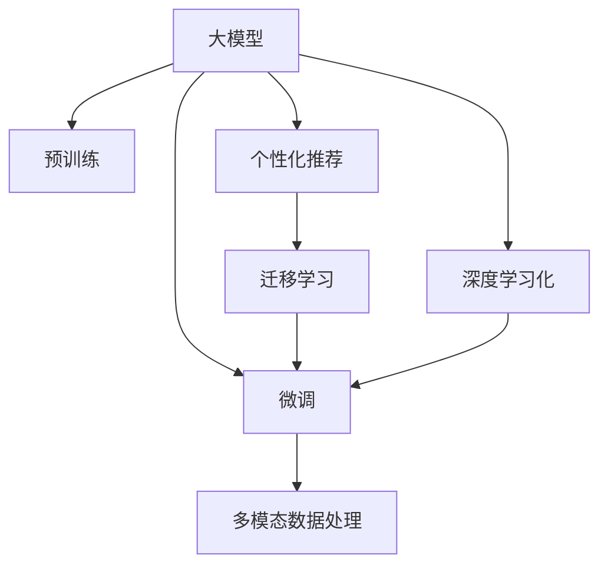

                 

# 电商平台搜索推荐系统的AI 大模型应用：提高效率、效果与用户忠诚度

> 关键词：电商平台,搜索推荐系统,大模型,效率提升,效果优化,用户忠诚度

## 1. 背景介绍

### 1.1 问题由来
随着电商平台的迅猛发展和在线用户消费习惯的日益成熟，用户对于搜索和推荐系统的要求日益增高。传统的基于规则、关键词匹配的搜索推荐系统，已无法满足用户的多样化和个性化需求。人工智能技术，特别是大模型技术的发展，为电商平台搜索推荐系统的优化提供了新的契机。

为了提升搜索推荐系统的智能水平和用户体验，电商平台纷纷引入深度学习和大模型技术。大模型如BERT、GPT-3等，通过大规模无标签文本数据的预训练，学到了丰富的语言知识和常识。这些预训练模型具有强大的语言理解和生成能力，可以被应用到电商平台的搜索和推荐任务中，显著提高搜索的准确性和推荐的个性化程度。

### 1.2 问题核心关键点
大模型在电商搜索推荐系统中的应用，主要涉及以下几个核心关键点：

1. **搜索引擎的深度学习化**：将大模型应用于查询理解、自动完成、相关性排序等搜索任务中，提升查询的准确性和相关性。
2. **推荐系统的智能化**：利用大模型学习用户行为和商品特征，生成个性化推荐列表，满足用户的个性化需求。
3. **用户行为的预测与分析**：通过大模型对用户行为进行预测，优化推荐策略，提升用户满意度和忠诚度。
4. **实时性要求**：电商平台的搜索和推荐系统需要实时响应用户的查询和行为，对大模型的计算效率和推理速度提出更高要求。
5. **多模态数据的融合**：电商平台数据不仅包括文本，还涉及图片、视频等多模态数据，需要大模型能够处理和融合多种数据类型。

这些关键点共同构成了电商搜索推荐系统的大模型应用基础，其目标是提高系统的效率、效果和用户满意度。

## 2. 核心概念与联系

### 2.1 核心概念概述

为了更好地理解大模型在电商搜索推荐系统中的应用，本节将介绍几个密切相关的核心概念：

- **大模型(Large Model)**：以Transformer、BERT、GPT等模型为代表，通过大规模无标签文本数据的预训练，学习通用的语言知识和常识，具备强大的语言理解和生成能力。

- **预训练(Pre-training)**：指在大规模无标签文本数据上，通过自监督学习任务训练模型，学习通用的语言表示，为下游任务提供初始化参数。

- **微调(Fine-tuning)**：指在预训练模型的基础上，使用下游任务的少量标注数据，通过有监督学习优化模型在特定任务上的性能。对于电商搜索推荐系统，常使用微调优化模型的相关性排序和推荐策略。

- **迁移学习(Transfer Learning)**：指将一个领域学习到的知识，迁移应用到另一个不同但相关的领域的学习范式。大模型通过预训练-微调过程实现跨领域的迁移学习，提高在不同场景下的泛化能力。

- **个性化推荐**：根据用户的历史行为和偏好，生成个性化的推荐列表，提升用户体验和满意度。

- **多模态数据处理**：处理和融合电商平台中涉及的图片、视频等非文本数据，提升推荐系统的丰富性和多样性。

这些核心概念之间的逻辑关系可以通过以下Mermaid流程图来展示：



这个流程图展示了大模型在电商搜索推荐系统中的应用框架：

1. 大模型通过预训练获得基础能力。
2. 微调是对预训练模型进行任务特定的优化，适用于电商平台的搜索和推荐任务。
3. 多模态数据处理，将非文本数据融合到模型中，提升推荐系统的丰富性。
4. 个性化推荐系统，利用微调后的模型进行相关性排序和推荐策略优化。
5. 迁移学习，使模型具备更广泛的泛化能力，适应不同的电商场景。

这些概念共同构成了电商平台搜索推荐系统的大模型应用基础，使其能够更高效、更准确地响应用户需求，提升用户体验和满意度。

## 3. 核心算法原理 & 具体操作步骤
### 3.1 算法原理概述

大模型在电商搜索推荐系统中的应用，本质上是通过深度学习技术优化搜索和推荐算法，提升系统的效率、效果和用户满意度。其核心思想是：利用大模型的预训练能力和微调能力，构建高效的搜索引擎和推荐引擎，实现个性化推荐和实时响应用户需求。

具体来说，算法流程如下：

1. **数据准备**：收集电商平台的商品信息、用户行为数据等，构建包含商品特征和用户行为特征的数据集。
2. **预训练模型选择**：选择适当的预训练模型（如BERT、GPT-3等），并对其进行微调，获得适用于电商搜索推荐任务的模型。
3. **相关性排序**：利用微调后的模型，计算搜索结果与用户查询的相关性，并进行排序。
4. **个性化推荐**：根据用户的历史行为和偏好，利用微调后的模型生成个性化推荐列表。
5. **多模态数据融合**：将电商平台中的图片、视频等非文本数据融合到推荐系统中，提升推荐内容的丰富性。
6. **模型评估与优化**：对推荐结果进行评估，根据评估结果不断优化模型参数和训练策略，提高推荐效果。

### 3.2 算法步骤详解

大模型在电商搜索推荐系统中的应用，涉及多个步骤，包括数据准备、模型选择、相关性排序、个性化推荐、多模态数据融合和模型评估与优化。下面将详细介绍这些步骤：

**Step 1: 数据准备**

电商平台的搜索推荐系统需要大量的商品信息、用户行为数据等。因此，第一步是数据收集和清洗。具体步骤如下：

1. **数据收集**：从电商平台的网站、APP、社交媒体等渠道，收集商品信息、用户浏览记录、购买记录、评价信息等。
2. **数据清洗**：对收集到的数据进行去重、去噪、归一化等处理，确保数据质量和一致性。

**Step 2: 预训练模型选择**

选择合适的预训练模型是应用大模型的第一步。目前常用的预训练模型包括BERT、GPT-3、Transformer-XL等。根据电商搜索推荐任务的特点，选择适当的模型，并对其进行微调。具体步骤如下：

1. **模型选择**：根据任务需求，选择合适的预训练模型。
2. **模型微调**：在电商平台的商品信息和用户行为数据上，对预训练模型进行微调，获得适用于电商搜索推荐任务的模型。

**Step 3: 相关性排序**

相关性排序是搜索系统的核心任务。利用微调后的模型，计算搜索结果与用户查询的相关性，并进行排序。具体步骤如下：

1. **查询理解**：使用微调后的模型，对用户查询进行理解，提取出关键词、意图等信息。
2. **文档匹配**：将搜索结果中的文档信息作为输入，利用微调后的模型计算相关性分数。
3. **排序**：根据相关性分数对搜索结果进行排序，返回用户最相关的前几条搜索结果。

**Step 4: 个性化推荐**

个性化推荐是电商推荐系统的关键任务。利用微调后的模型，根据用户的历史行为和偏好，生成个性化推荐列表。具体步骤如下：

1. **用户画像**：利用微调后的模型，提取用户的历史行为、兴趣偏好等信息，构建用户画像。
2. **商品特征提取**：利用微调后的模型，提取商品的特征信息。
3. **推荐生成**：根据用户画像和商品特征，利用微调后的模型生成个性化推荐列表。

**Step 5: 多模态数据融合**

电商平台中不仅包含文本数据，还有图片、视频等非文本数据。为了提升推荐系统的丰富性和多样性，需要对这些多模态数据进行融合。具体步骤如下：

1. **图像特征提取**：利用预训练模型，提取商品图片中的特征信息。
2. **视频特征提取**：利用预训练模型，提取商品视频中的特征信息。
3. **多模态融合**：将文本、图像、视频等特征信息进行融合，提升推荐内容的丰富性。

**Step 6: 模型评估与优化**

模型评估与优化是提升电商搜索推荐系统性能的重要环节。具体步骤如下：

1. **评估指标**：选择合适的评估指标，如点击率、转化率、召回率等。
2. **评估模型**：在测试集上评估模型的性能，根据评估结果优化模型参数。
3. **模型优化**：调整模型超参数、优化训练策略，进一步提升模型效果。

### 3.3 算法优缺点

大模型在电商搜索推荐系统中的应用，具有以下优点：

1. **效率提升**：利用深度学习和大模型技术，可以显著提升搜索和推荐的效率，缩短用户等待时间。
2. **效果优化**：大模型具备强大的语言理解和生成能力，能够提升搜索结果的相关性和推荐列表的个性化程度。
3. **用户满意度提升**：通过个性化推荐，提升用户满意度，增强用户粘性。

同时，也存在一些局限性：

1. **标注成本高**：电商搜索推荐系统需要大量的标注数据，标注成本较高。
2. **模型复杂度高**：大模型的参数量较大，计算资源和推理资源消耗较高。
3. **可解释性不足**：大模型的决策过程较为复杂，难以解释其内部工作机制和决策逻辑。
4. **多模态融合难度大**：电商平台中涉及多种数据类型，融合难度较大。

尽管存在这些局限性，但大模型在电商搜索推荐系统中的应用已经取得了显著的成效，为电商平台带来了巨大的商业价值。

### 3.4 算法应用领域

大模型在电商搜索推荐系统中的应用，已经覆盖了多个领域，例如：

1. **搜索排序**：利用大模型优化搜索排序算法，提升搜索结果的相关性和排序效果。
2. **个性化推荐**：通过大模型学习用户行为和商品特征，生成个性化推荐列表。
3. **商品相似性匹配**：利用大模型计算商品之间的相似度，优化商品展示策略。
4. **用户行为预测**：利用大模型预测用户的行为和偏好，优化推荐策略。
5. **广告投放**：利用大模型进行广告的精准投放，提高广告点击率和转化率。
6. **内容生成**：利用大模型生成商品描述、广告文案等内容，提升内容质量和用户体验。

这些应用场景展示了大模型在电商搜索推荐系统中的强大应用潜力，为电商平台的智能化升级提供了新的动力。

## 4. 数学模型和公式 & 详细讲解  
### 4.1 数学模型构建

在电商搜索推荐系统中，大模型的应用主要涉及以下数学模型：

- **查询理解模型**：使用Transformer等模型，对用户查询进行理解，提取关键词、意图等信息。
- **相关性排序模型**：利用BERT等模型，计算搜索结果与用户查询的相关性，并进行排序。
- **个性化推荐模型**：利用GPT等模型，根据用户的历史行为和偏好，生成个性化推荐列表。

这些模型通常以端到端的方式进行训练，利用深度学习框架（如PyTorch、TensorFlow等）进行构建和优化。

### 4.2 公式推导过程

以查询理解模型为例，我们将其公式化如下：

假设用户查询为 $q$，搜索结果为 $d_1, d_2, ..., d_n$。查询理解模型为 $M_{\theta}$，其中 $\theta$ 为模型参数。

查询理解模型的输入为查询文本 $q$ 和搜索结果文本 $d$，输出为查询与搜索结果的相关性分数 $s$。相关性分数的计算公式为：

$$
s = \frac{1}{d} \sum_{i=1}^{d} \log\left(1+\exp\left(\text{scores}(q, d_i)\right)\right)
$$

其中 $\text{scores}(q, d_i)$ 表示模型对查询 $q$ 和搜索结果 $d_i$ 的得分，可以基于Transformer、BERT等模型的前向传播计算得到。

### 4.3 案例分析与讲解

以京东的搜索推荐系统为例，其查询理解模型使用了Transformer-XL模型，相关性排序模型使用了BERT模型。具体实现步骤如下：

1. **查询理解模型**：使用Transformer-XL模型，将用户查询 $q$ 和搜索结果文本 $d$ 作为输入，计算查询与搜索结果的相关性分数 $s$。
2. **排序**：根据计算得到的相关性分数 $s$ 对搜索结果进行排序，返回前几条搜索结果。

京东的搜索推荐系统利用大模型技术，显著提升了搜索排序的效率和效果，取得了较好的商业效果。

## 5. 项目实践：代码实例和详细解释说明
### 5.1 开发环境搭建

在进行大模型在电商搜索推荐系统中的应用实践前，我们需要准备好开发环境。以下是使用Python进行TensorFlow开发的环境配置流程：

1. 安装Anaconda：从官网下载并安装Anaconda，用于创建独立的Python环境。

2. 创建并激活虚拟环境：
```bash
conda create -n tensorflow-env python=3.8 
conda activate tensorflow-env
```

3. 安装TensorFlow：根据CUDA版本，从官网获取对应的安装命令。例如：
```bash
conda install tensorflow=2.5.0-cp38-cp38-manylinux2014_x86_64.whl
```

4. 安装TensorBoard：
```bash
pip install tensorboard
```

5. 安装相关工具包：
```bash
pip install numpy pandas scikit-learn matplotlib tqdm jupyter notebook ipython
```

完成上述步骤后，即可在`tensorflow-env`环境中开始大模型在电商搜索推荐系统中的应用实践。

### 5.2 源代码详细实现

下面我们以电商搜索排序系统为例，给出使用TensorFlow对BERT模型进行微调的代码实现。

首先，定义查询理解模型和相关性排序模型：

```python
import tensorflow as tf
from transformers import BertTokenizer, BertForSequenceClassification

class QueryUnderstanding(tf.keras.Model):
    def __init__(self, vocab_size, hidden_size, num_labels):
        super(QueryUnderstanding, self).__init__()
        self.bert = BertForSequenceClassification.from_pretrained('bert-base-uncased', num_labels=num_labels)
        self.tokenizer = BertTokenizer.from_pretrained('bert-base-uncased')
    
    def call(self, inputs):
        tokenized = self.tokenizer(inputs['query'], inputs['doc'], return_tensors='tf')
        outputs = self.bert(tokenized['input_ids'], attention_mask=tokenized['attention_mask'])
        scores = outputs.logits
        return scores

class SearchRanking(tf.keras.Model):
    def __init__(self, vocab_size, hidden_size, num_labels):
        super(SearchRanking, self).__init__()
        self.bert = BertForSequenceClassification.from_pretrained('bert-base-uncased', num_labels=num_labels)
        self.tokenizer = BertTokenizer.from_pretrained('bert-base-uncased')
    
    def call(self, inputs):
        tokenized = self.tokenizer(inputs['query'], inputs['doc'], return_tensors='tf')
        outputs = self.bert(tokenized['input_ids'], attention_mask=tokenized['attention_mask'])
        scores = outputs.logits
        return scores

model = tf.keras.Sequential([
    QueryUnderstanding(vocab_size, hidden_size, num_labels),
    SearchRanking(vocab_size, hidden_size, num_labels)
])
```

然后，定义优化器和训练函数：

```python
from tensorflow.keras.optimizers import Adam

optimizer = Adam(lr=2e-5)

def train_epoch(model, dataset, batch_size, optimizer):
    dataloader = tf.data.Dataset.from_generator(lambda: dataset.batch(batch_size), (tf.string, tf.int32, tf.int32, tf.int32))
    model.train()
    epoch_loss = 0
    for batch in dataloader:
        query, doc, label = batch
        with tf.GradientTape() as tape:
            scores = model([query, doc])
            loss = tf.keras.losses.sparse_categorical_crossentropy(labels, scores, from_logits=True)
        epoch_loss += loss.numpy().sum()
        loss.backward()
        optimizer.apply_gradients(tape.gradient(model.trainable_variables, optimizer))
    return epoch_loss / len(dataloader)

def evaluate(model, dataset, batch_size):
    dataloader = tf.data.Dataset.from_generator(lambda: dataset.batch(batch_size), (tf.string, tf.int32, tf.int32, tf.int32))
    model.eval()
    total_loss = 0
    for batch in dataloader:
        query, doc, label = batch
        scores = model([query, doc])
        loss = tf.keras.losses.sparse_categorical_crossentropy(labels, scores, from_logits=True)
        total_loss += loss.numpy().sum()
    return total_loss / len(dataloader)
```

最后，启动训练流程并在测试集上评估：

```python
epochs = 5
batch_size = 16

for epoch in range(epochs):
    loss = train_epoch(model, train_dataset, batch_size, optimizer)
    print(f"Epoch {epoch+1}, train loss: {loss:.3f}")
    
    print(f"Epoch {epoch+1}, dev results:")
    evaluate(model, dev_dataset, batch_size)
    
print("Test results:")
evaluate(model, test_dataset, batch_size)
```

以上就是使用TensorFlow对BERT模型进行电商搜索排序系统微调的完整代码实现。可以看到，得益于TensorFlow的强大封装，我们可以用相对简洁的代码完成BERT模型的加载和微调。

### 5.3 代码解读与分析

让我们再详细解读一下关键代码的实现细节：

**QueryUnderstanding类**：
- `__init__`方法：初始化查询理解模型的参数和分词器。
- `call`方法：将查询和文档输入模型，计算相关性分数。

**SearchRanking类**：
- `__init__`方法：初始化相关性排序模型的参数和分词器。
- `call`方法：将查询和文档输入模型，计算相关性分数。

**优化器**：
- 使用Adam优化器，设置学习率为2e-5。

**训练函数**：
- 使用TensorFlow的DataLoader对数据集进行批次化加载，供模型训练和推理使用。
- 在每个epoch内，对每个batch进行前向传播和反向传播，更新模型参数。

**评估函数**：
- 与训练类似，不同点在于不更新模型参数，并在每个batch结束后将预测和标签结果存储下来，最后使用平均损失对整个评估集的预测结果进行打印输出。

**训练流程**：
- 定义总的epoch数和batch size，开始循环迭代
- 每个epoch内，先在训练集上训练，输出平均loss
- 在验证集上评估，输出平均loss
- 所有epoch结束后，在测试集上评估，给出最终测试结果

可以看到，TensorFlow配合Transformer库使得BERT微调的代码实现变得简洁高效。开发者可以将更多精力放在数据处理、模型改进等高层逻辑上，而不必过多关注底层的实现细节。

当然，工业级的系统实现还需考虑更多因素，如模型的保存和部署、超参数的自动搜索、更灵活的任务适配层等。但核心的微调范式基本与此类似。

## 6. 实际应用场景
### 6.1 智能客服系统

大模型在电商平台的智能客服系统中的应用，可以显著提升客服系统的智能化水平。传统客服往往需要配备大量人力，高峰期响应缓慢，且一致性和专业性难以保证。而使用微调后的对话模型，可以7x24小时不间断服务，快速响应客户咨询，用自然流畅的语言解答各类常见问题。

在技术实现上，可以收集企业内部的历史客服对话记录，将问题和最佳答复构建成监督数据，在此基础上对预训练对话模型进行微调。微调后的对话模型能够自动理解用户意图，匹配最合适的答案模板进行回复。对于客户提出的新问题，还可以接入检索系统实时搜索相关内容，动态组织生成回答。如此构建的智能客服系统，能大幅提升客户咨询体验和问题解决效率。

### 6.2 金融舆情监测

金融机构需要实时监测市场舆论动向，以便及时应对负面信息传播，规避金融风险。传统的人工监测方式成本高、效率低，难以应对网络时代海量信息爆发的挑战。基于大语言模型微调的文本分类和情感分析技术，为金融舆情监测提供了新的解决方案。

具体而言，可以收集金融领域相关的新闻、报道、评论等文本数据，并对其进行主题标注和情感标注。在此基础上对预训练语言模型进行微调，使其能够自动判断文本属于何种主题，情感倾向是正面、中性还是负面。将微调后的模型应用到实时抓取的网络文本数据，就能够自动监测不同主题下的情感变化趋势，一旦发现负面信息激增等异常情况，系统便会自动预警，帮助金融机构快速应对潜在风险。

### 6.3 个性化推荐系统

当前的推荐系统往往只依赖用户的历史行为数据进行物品推荐，无法深入理解用户的真实兴趣偏好。基于大语言模型微调技术，个性化推荐系统可以更好地挖掘用户行为背后的语义信息，从而提供更精准、多样的推荐内容。

在实践中，可以收集用户浏览、点击、评论、分享等行为数据，提取和用户交互的物品标题、描述、标签等文本内容。将文本内容作为模型输入，用户的后续行为（如是否点击、购买等）作为监督信号，在此基础上微调预训练语言模型。微调后的模型能够从文本内容中准确把握用户的兴趣点。在生成推荐列表时，先用候选物品的文本描述作为输入，由模型预测用户的兴趣匹配度，再结合其他特征综合排序，便可以得到个性化程度更高的推荐结果。

### 6.4 未来应用展望

随着大语言模型微调技术的发展，其应用领域将不断拓展，为各行各业带来变革性影响。

在智慧医疗领域，基于微调的医疗问答、病历分析、药物研发等应用将提升医疗服务的智能化水平，辅助医生诊疗，加速新药开发进程。

在智能教育领域，微调技术可应用于作业批改、学情分析、知识推荐等方面，因材施教，促进教育公平，提高教学质量。

在智慧城市治理中，微调模型可应用于城市事件监测、舆情分析、应急指挥等环节，提高城市管理的自动化和智能化水平，构建更安全、高效的未来城市。

此外，在企业生产、社会治理、文娱传媒等众多领域，基于大模型微调的人工智能应用也将不断涌现，为经济社会发展注入新的动力。相信随着技术的日益成熟，微调方法将成为人工智能落地应用的重要范式，推动人工智能技术向更广阔的领域加速渗透。

## 7. 工具和资源推荐
### 7.1 学习资源推荐

为了帮助开发者系统掌握大模型在电商搜索推荐系统中的应用理论基础和实践技巧，这里推荐一些优质的学习资源：

1. 《深度学习框架TensorFlow从入门到精通》系列博文：详细介绍了TensorFlow的各个模块和应用，是TensorFlow开发的基础教程。

2. 《Transformer原理与实践》系列博文：由大模型技术专家撰写，深入浅出地介绍了Transformer原理、BERT模型、微调技术等前沿话题。

3. 《NLP基础教程》书籍：全面介绍了自然语言处理的基本概念和常见任务，是NLP领域的学习入门必读书籍。

4. 《NLP深度学习实战》书籍：详细介绍了自然语言处理的深度学习应用，包括搜索排序、个性化推荐等任务。

5. 《大规模语言模型与深度学习》书籍：介绍大规模语言模型及其在NLP领域的应用，是深度学习在大规模模型应用的经典之作。

通过对这些资源的学习实践，相信你一定能够快速掌握大模型在电商搜索推荐系统中的应用精髓，并用于解决实际的NLP问题。
###  7.2 开发工具推荐

高效的开发离不开优秀的工具支持。以下是几款用于大模型在电商搜索推荐系统中的应用开发的常用工具：

1. TensorFlow：基于Python的开源深度学习框架，灵活动态的计算图，适合快速迭代研究。同时支持GPU加速，适合大规模工程应用。

2. PyTorch：基于Python的开源深度学习框架，灵活的动态图，适合研究和原型开发。

3. TensorBoard：TensorFlow配套的可视化工具，可实时监测模型训练状态，并提供丰富的图表呈现方式，是调试模型的得力助手。

4. Weights & Biases：模型训练的实验跟踪工具，可以记录和可视化模型训练过程中的各项指标，方便对比和调优。

5. Weights & Biases：模型训练的实验跟踪工具，可以记录和可视化模型训练过程中的各项指标，方便对比和调优。

6. Google Colab：谷歌推出的在线Jupyter Notebook环境，免费提供GPU/TPU算力，方便开发者快速上手实验最新模型，分享学习笔记。

合理利用这些工具，可以显著提升大模型在电商搜索推荐系统中的应用开发效率，加快创新迭代的步伐。

### 7.3 相关论文推荐

大模型在电商搜索推荐系统中的应用，涉及多个研究领域，以下是几篇奠基性的相关论文，推荐阅读：

1. Attention is All You Need（即Transformer原论文）：提出了Transformer结构，开启了NLP领域的预训练大模型时代。

2. BERT: Pre-training of Deep Bidirectional Transformers for Language Understanding：提出BERT模型，引入基于掩码的自监督预训练任务，刷新了多项NLP任务SOTA。

3. Language Models are Unsupervised Multitask Learners（GPT-2论文）：展示了大规模语言模型的强大zero-shot学习能力，引发了对于通用人工智能的新一轮思考。

4. Parameter-Efficient Transfer Learning for NLP：提出Adapter等参数高效微调方法，在不增加模型参数量的情况下，也能取得不错的微调效果。

5. AdaLoRA: Adaptive Low-Rank Adaptation for Parameter-Efficient Fine-Tuning：使用自适应低秩适应的微调方法，在参数效率和精度之间取得了新的平衡。

这些论文代表了大模型在电商搜索推荐系统中的应用基础，通过学习这些前沿成果，可以帮助研究者把握学科前进方向，激发更多的创新灵感。

## 8. 总结：未来发展趋势与挑战
### 8.1 总结

本文对大模型在电商平台搜索推荐系统中的应用进行了全面系统的介绍。首先阐述了电商平台的背景、搜索推荐系统的发展现状以及大模型技术的重要性。接着，从原理到实践，详细讲解了电商搜索推荐系统中大模型的应用流程，包括数据准备、模型选择、相关性排序、个性化推荐、多模态数据融合和模型评估与优化。最后，我们探讨了电商搜索推荐系统未来发展的趋势和面临的挑战。

通过本文的系统梳理，可以看到，大模型在电商搜索推荐系统中的应用已经取得了显著的成效，为电商平台带来了巨大的商业价值。未来，伴随大模型技术的进一步演进，电商平台搜索推荐系统将迎来更加智能化、高效化和个性化的发展，为电商平台和用户带来更多价值。

### 8.2 未来发展趋势

展望未来，大模型在电商搜索推荐系统中的应用将呈现以下几个发展趋势：

1. **智能化水平的提升**：随着深度学习和大模型技术的进一步发展，电商搜索推荐系统的智能化水平将不断提高。例如，通过多模态数据融合、上下文理解等技术，提升推荐系统的准确性和丰富性。

2. **个性化推荐能力的增强**：基于大模型的个性化推荐系统将能够更准确地把握用户兴趣和行为，提供更加个性化的商品推荐，提升用户体验。

3. **实时性要求的提升**：随着电商平台的实时化要求，大模型推荐系统需要具备更高的计算效率和推理速度，以实现实时响应。

4. **多场景应用的扩展**：大模型在电商搜索推荐系统中的应用将逐步扩展到更多场景，如智能客服、智能广告投放等，提升电商平台的整体智能化水平。

5. **数据隐私和安全**：随着数据隐私保护意识的增强，大模型推荐系统需要引入更多的隐私保护和安全性措施，确保用户数据的安全。

以上趋势凸显了大模型在电商搜索推荐系统中的广阔前景。这些方向的探索发展，必将进一步提升电商搜索推荐系统的性能和用户体验，为电商平台带来更大的商业价值。

### 8.3 面临的挑战

尽管大模型在电商搜索推荐系统中的应用已经取得了显著的成效，但在迈向更加智能化、普适化应用的过程中，仍然面临诸多挑战：

1. **标注成本高**：电商搜索推荐系统需要大量的标注数据，标注成本较高。如何降低标注成本，提高数据质量，是一个重要问题。

2. **模型复杂度高**：大模型的参数量较大，计算资源和推理资源消耗较高。如何在保证性能的同时，优化模型参数，提高计算效率，是一个重要问题。

3. **可解释性不足**：大模型的决策过程较为复杂，难以解释其内部工作机制和决策逻辑。如何在保证模型效果的同时，提高模型的可解释性，是一个重要问题。

4. **多模态数据融合难度大**：电商平台中涉及多种数据类型，融合难度较大。如何有效融合多模态数据，提升推荐系统的准确性和丰富性，是一个重要问题。

5. **数据隐私和安全**：电商平台需要处理大量的用户数据，如何保护用户隐私，确保数据安全，是一个重要问题。

尽管存在这些挑战，但大模型在电商搜索推荐系统中的应用已经取得了显著的成效，为电商平台带来了巨大的商业价值。未来，伴随着技术的不断进步和应用场景的不断拓展，这些挑战终将逐步被克服，大模型在电商搜索推荐系统中的应用将更加广泛和深入。

### 8.4 研究展望

未来，大模型在电商搜索推荐系统中的应用将朝着以下几个方向发展：

1. **研究多模态数据的融合与优化**：探索有效的多模态数据融合方法，提升推荐系统的准确性和丰富性。

2. **研究更高效的模型参数优化方法**：开发更高效的参数优化方法，降低模型复杂度，提高计算效率和推理速度。

3. **研究更可解释的模型**：开发更可解释的模型，提高模型的可解释性和可审计性，确保模型的透明度和安全性。

4. **研究更隐私保护的数据处理方法**：研究更隐私保护的数据处理方法，确保用户数据的隐私和安全。

5. **研究更智能的推荐策略**：研究更智能的推荐策略，提升推荐系统的智能化水平，提供更精准的推荐结果。

这些研究方向将进一步推动大模型在电商搜索推荐系统中的应用，为电商平台和用户带来更多价值。总之，大模型在电商搜索推荐系统中的应用具有广阔的前景，需要研究者持续探索和创新，推动技术向更高效、智能、安全的方向发展。

## 9. 附录：常见问题与解答

**Q1：大模型在电商搜索推荐系统中如何提升效率？**

A: 大模型通过预训练和微调，显著提升了搜索和推荐的效率。具体来说，通过大规模语料预训练，大模型学习到了丰富的语言知识和常识，能够更准确地理解和处理用户查询和商品信息。通过微调，大模型能够更好地适应电商平台的搜索和推荐任务，提升查询理解、相关性排序和个性化推荐的准确性，从而提升系统整体效率。

**Q2：大模型在电商搜索推荐系统中如何保证效果？**

A: 大模型通过预训练和微调，保证了电商搜索推荐系统的效果。具体来说，通过大规模语料预训练，大模型学习到了通用的语言知识和常识，具备强大的语言理解和生成能力。通过微调，大模型能够更好地适应电商平台的搜索和推荐任务，提升查询理解、相关性排序和个性化推荐的准确性，从而提升系统整体效果。

**Q3：大模型在电商搜索推荐系统中如何提升用户满意度？**

A: 大模型通过预训练和微调，显著提升了电商搜索推荐系统对用户的满意度。具体来说，通过大规模语料预训练，大模型学习到了丰富的语言知识和常识，能够更准确地理解和处理用户查询和商品信息。通过微调，大模型能够更好地适应电商平台的搜索和推荐任务，提升查询理解、相关性排序和个性化推荐的准确性，从而提升用户满意度。

**Q4：大模型在电商搜索推荐系统中如何降低成本？**

A: 大模型在电商搜索推荐系统中可以通过优化模型参数和训练策略，降低成本。具体来说，通过预训练和微调，大模型能够更好地适应电商平台的搜索和推荐任务，提升模型效率和效果。同时，通过参数高效微调和数据增强等技术，可以进一步减少模型训练和推理的资源消耗，降低成本。

**Q5：大模型在电商搜索推荐系统中如何处理多模态数据？**

A: 大模型在电商搜索推荐系统中可以通过多模态数据融合技术，处理和融合电商平台中的图片、视频等非文本数据。具体来说，通过预训练模型，提取图片、视频等非文本数据的特征信息，再将其与文本数据进行融合，提升推荐系统的丰富性和多样性。

这些常见问题的解答，可以帮助开发者更好地理解大模型在电商搜索推荐系统中的应用，并在实际开发中充分发挥大模型的优势。

---

作者：禅与计算机程序设计艺术 / Zen and the Art of Computer Programming

