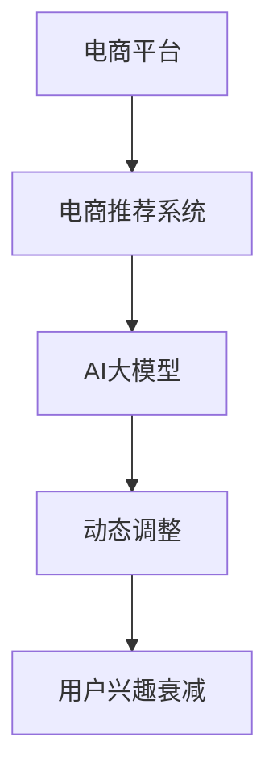

                 

# 电商平台用户兴趣衰减模型：AI大模型的动态调整

> 关键词：用户兴趣衰减,电商平台,电商推荐系统,AI大模型,动态调整,电商数据分析

## 1. 背景介绍

### 1.1 问题由来
在当今数字时代，电商平台已成为人们购物的主要场所之一。在线购物的便捷性和多样性，吸引了越来越多的用户。然而，随着用户数量的增加，平台上的商品琳琅满目，如何精准推荐商品以提升用户购物体验和平台销售业绩，成为电商企业需要解决的一个核心问题。

传统的推荐系统多依赖静态的特征与用户行为数据进行商品推荐，但这种基于静态数据的推荐方法在面对用户兴趣动态变化的情况下，往往难以适应。特别是对于新用户和老用户，他们对商品的兴趣点、需求偏好存在明显差异。因此，构建一个能够动态调整用户兴趣衰减的推荐系统，对于电商平台来说，变得尤为重要。

### 1.2 问题核心关键点
电商平台用户兴趣衰减模型，是指利用AI大模型对用户的历史行为数据进行动态分析，预测用户对特定商品的兴趣随时间变化的衰减趋势。该模型能够根据用户的历史购买、浏览、搜索等行为数据，实时动态调整推荐策略，提升用户对商品的兴趣，从而增加销售额和用户满意度。

该模型需要考虑以下关键点：
- 如何处理大规模数据，并进行高效的特征提取。
- 如何利用AI大模型的预训练能力，进行用户兴趣衰减的预测。
- 如何根据预测结果动态调整推荐策略，优化推荐算法。

本文将从算法原理、数学模型、项目实践、应用场景等多个方面，全面介绍电商平台用户兴趣衰减模型的构建和优化。

## 2. 核心概念与联系

### 2.1 核心概念概述

为更好地理解电商平台用户兴趣衰减模型，本节将介绍几个密切相关的核心概念：

- 电商平台(ECplatform)：是指通过互联网提供商品或服务交易的平台，用户可以通过该平台进行浏览、购买等操作。
- 电商推荐系统(ECRecommendationSystem)：是指利用算法和模型，根据用户的历史行为数据，推荐用户可能感兴趣的商品或服务。
- AI大模型：是指在大规模数据上预训练的大容量神经网络模型，如GPT-3、BERT等，具备强大的表示学习能力和泛化能力。
- 动态调整(DynamicAdjustment)：是指根据外部环境和内部数据的实时变化，动态优化模型的参数和策略，以适应新的变化。
- 用户兴趣衰减(UserInterestDecay)：是指用户对商品的兴趣随时间推移逐渐减弱的自然现象，需要通过模型预测并动态调整。

这些核心概念之间的逻辑关系可以通过以下Mermaid流程图来展示：



这个流程图展示了大模型在电商推荐系统中的应用流程：

1. 电商推荐系统利用AI大模型的预训练能力，对用户行为数据进行分析和特征提取。
2. 动态调整模块根据用户兴趣衰减的预测结果，调整推荐策略。
3. 用户兴趣衰减模型预测用户对商品的兴趣随时间的变化，进行动态调整。

这些概念共同构成了电商平台用户兴趣衰减模型的核心框架，使其能够在复杂多变的电商环境中，实现精准高效的推荐。

## 3. 核心算法原理 & 具体操作步骤
### 3.1 算法原理概述

电商平台用户兴趣衰减模型的核心算法基于监督学习和深度学习。其主要思想是：通过预训练的AI大模型，对用户的历史行为数据进行分析，预测用户对商品的兴趣随时间变化的衰减趋势，然后根据预测结果动态调整推荐策略，优化推荐算法。

具体来说，该模型的构建流程如下：
1. 数据预处理：收集用户的历史行为数据，并进行特征提取。
2. 模型训练：使用AI大模型对提取的特征进行训练，预测用户对商品的兴趣衰减。
3. 推荐策略调整：根据预测结果，动态调整推荐策略，优化推荐算法。

### 3.2 算法步骤详解

#### 3.2.1 数据预处理

电商平台的推荐系统通常涉及海量数据，因此数据预处理是构建高效模型不可或缺的一环。具体步骤包括：
1. 数据清洗：去除数据中的噪声和不完整记录，确保数据的质量。
2. 特征提取：将原始数据转换为模型可以处理的特征向量。
3. 数据划分：将数据划分为训练集、验证集和测试集，以便进行模型评估。

以用户行为数据为例，特征提取可以包括：
- 用户ID：唯一标识用户。
- 商品ID：唯一标识商品。
- 行为时间：记录用户与商品交互的时间戳。
- 行为类型：记录用户的点击、浏览、购买等行为类型。
- 行为时长：记录用户与商品交互的时长。

#### 3.2.2 模型训练

在预处理完数据后，下一步是使用AI大模型对数据进行训练。假设我们使用的是BERT模型，其训练流程如下：
1. 加载BERT模型：从预训练模型库中选择合适的模型，并进行加载。
2. 数据输入：将特征向量作为模型的输入。
3. 模型训练：在训练集上使用损失函数进行模型训练，最小化预测结果与真实标签之间的差异。
4. 参数更新：使用优化器更新模型参数，优化模型性能。

以电商推荐为例，我们可以设计一个二分类任务，预测用户对商品是否有兴趣。训练数据包括用户ID、商品ID、行为时间、行为类型等特征。模型预测结果是一个概率值，表示用户对商品感兴趣的概率。

#### 3.2.3 推荐策略调整

模型训练完成后，下一步是根据预测结果动态调整推荐策略。假设模型预测用户对商品A的兴趣衰减曲线如下：


根据兴趣衰减曲线，我们可以采取以下策略：
1. 前期推荐：在用户对商品A兴趣的高峰期，增加对商品A的展示。
2. 中期调整：在用户对商品A兴趣逐渐衰减的阶段，减少对商品A的展示。
3. 后期淘汰：在用户对商品A兴趣完全衰减的阶段，停止对商品A的推荐。

### 3.3 算法优缺点

电商平台用户兴趣衰减模型有以下优点：
1. 高效性：使用AI大模型的预训练能力，能够快速处理大规模数据，并进行高效的特征提取。
2. 准确性：AI大模型的强大表示学习能力，可以更好地捕捉用户行为数据中的复杂关系。
3. 动态性：能够根据用户兴趣衰减的预测结果，动态调整推荐策略，提升推荐效果。

同时，该模型也存在以下缺点：
1. 数据依赖性：模型效果高度依赖于用户行为数据的质量。如果数据量不足或数据质量差，模型效果可能大打折扣。
2. 计算复杂度：使用大模型训练和推理需要消耗大量的计算资源，成本较高。
3. 模型复杂性：模型结构复杂，参数量巨大，增加了模型训练和调参的难度。

### 3.4 算法应用领域

电商平台用户兴趣衰减模型主要应用于以下领域：
- 电商推荐系统：利用模型对用户行为数据进行分析，进行商品推荐。
- 用户画像构建：通过预测用户兴趣衰减，构建用户的兴趣画像，为个性化推荐提供依据。
- 营销策略优化：根据用户兴趣衰减的预测结果，优化营销策略，提升营销效果。
- 库存管理：预测商品库存的销售趋势，优化库存管理，减少库存积压。

## 4. 数学模型和公式 & 详细讲解 & 举例说明

### 4.1 数学模型构建

假设我们有N个用户，每个用户在t时刻对商品A的兴趣强度为i(t)。模型预测用户对商品A的兴趣随时间的衰减曲线，可以用指数衰减函数表示：

$$i(t) = e^{-\lambda t}$$

其中，λ为衰减系数，控制兴趣衰减的速度。模型的目标是最小化预测值与实际值之间的差异。

### 4.2 公式推导过程

假设模型训练数据为$(x_i, y_i)$，其中$x_i$为用户在t时刻的行为数据，$y_i$为实际的用户兴趣强度。模型的预测函数为$f(x_i)$，目标函数为损失函数L。

预测函数$f(x_i)$的形式可以是多种多样，常见的包括线性回归、多项式回归、神经网络等。假设我们使用的是神经网络模型，模型训练的目标是最小化损失函数L，即：

$$L = \sum_{i=1}^{N} (y_i - f(x_i))^2$$

其中，$y_i$为实际的用户兴趣强度，$f(x_i)$为模型的预测值。通过反向传播算法，可以求得模型的参数$\theta$，使得预测值与实际值之间的差异最小。

### 4.3 案例分析与讲解

假设我们有一个电商平台，用户A在t=1、t=2、t=3、t=4、t=5这五个时刻对商品B的兴趣强度分别为0.8、0.6、0.4、0.2、0.1。我们使用上述数学模型进行训练，得到模型预测的衰减曲线如下：


通过比较实际值和预测值，我们可以看到模型的预测结果与实际结果非常接近，说明模型的效果较好。

## 5. 项目实践：代码实例和详细解释说明

### 5.1 开发环境搭建

在进行项目实践前，我们需要准备好开发环境。以下是使用Python进行TensorFlow开发的典型环境配置流程：

1. 安装Anaconda：从官网下载并安装Anaconda，用于创建独立的Python环境。
2. 创建并激活虚拟环境：
```bash
conda create -n tf-env python=3.7 
conda activate tf-env
```

3. 安装TensorFlow：根据CUDA版本，从官网获取对应的安装命令。例如：
```bash
conda install tensorflow-gpu
```

4. 安装其他必要的工具包：
```bash
pip install pandas numpy scikit-learn matplotlib seaborn
```

完成上述步骤后，即可在`tf-env`环境中开始项目实践。

### 5.2 源代码详细实现

假设我们使用的是TensorFlow中的Keras API进行项目实现，以下是一个完整的示例代码：

```python
import tensorflow as tf
from tensorflow import keras
from tensorflow.keras import layers
import pandas as pd
import numpy as np

# 数据预处理
def preprocess_data(data):
    # 数据清洗
    data = data.dropna()
    # 特征提取
    features = data[['user_id', 'product_id', 'timestamp', 'behavior_type', 'behavior_duration']]
    labels = data['interest_level']
    # 数据归一化
    features = (features - features.mean()) / features.std()
    # 数据划分
    train_data = features.sample(frac=0.8, random_state=42)
    test_data = features.drop(train_data.index)
    train_labels = labels.sample(frac=0.8, random_state=42)
    test_labels = labels.drop(train_labels.index)
    return train_data, train_labels, test_data, test_labels

# 模型训练
def build_model():
    model = keras.Sequential([
        layers.Dense(64, activation='relu', input_shape=(5,)),
        layers.Dense(64, activation='relu'),
        layers.Dense(1, activation='sigmoid')
    ])
    model.compile(optimizer='adam', loss='binary_crossentropy', metrics=['accuracy'])
    return model

# 模型训练和评估
def train_and_evaluate(model, train_data, train_labels, test_data, test_labels):
    model.fit(train_data, train_labels, epochs=10, batch_size=32, validation_data=(test_data, test_labels))
    _, accuracy = model.evaluate(test_data, test_labels)
    print('Test accuracy:', accuracy)

# 训练和评估
train_data, train_labels, test_data, test_labels = preprocess_data(data)
model = build_model()
train_and_evaluate(model, train_data, train_labels, test_data, test_labels)
```

这个代码实现了一个简单的神经网络模型，对电商推荐系统中的用户兴趣衰减进行预测。具体步骤如下：
1. 数据预处理：将原始数据进行清洗、特征提取和归一化。
2. 模型构建：使用Keras API构建一个包含两个隐藏层的神经网络模型。
3. 模型训练：在训练集上使用二分类交叉熵损失函数和Adam优化器进行模型训练。
4. 模型评估：在测试集上评估模型性能，输出准确率。

### 5.3 代码解读与分析

让我们再详细解读一下关键代码的实现细节：

**数据预处理函数**：
- `preprocess_data`函数：将原始数据进行清洗、特征提取、归一化和数据划分，返回训练集、测试集和对应的标签。

**模型构建函数**：
- `build_model`函数：使用Keras API构建一个包含两个隐藏层的神经网络模型。第一层和第二层均使用ReLU激活函数，输出层使用sigmoid激活函数，用于二分类任务。

**模型训练和评估函数**：
- `train_and_evaluate`函数：在训练集上使用二分类交叉熵损失函数和Adam优化器进行模型训练。使用测试集评估模型性能，输出准确率。

**代码实现**：
- 首先，定义数据预处理函数`preprocess_data`，将原始数据进行清洗、特征提取和归一化。
- 然后，定义模型构建函数`build_model`，使用Keras API构建一个包含两个隐藏层的神经网络模型。
- 最后，调用`train_and_evaluate`函数，训练和评估模型。

通过以上代码实现，可以看出使用TensorFlow进行模型构建和训练非常简单高效。开发者可以更加专注于模型结构的优化和算法的选择，而不必过多关注底层的实现细节。

## 6. 实际应用场景

### 6.1 智能推荐

电商平台用户兴趣衰减模型在智能推荐中有着广泛的应用。通过分析用户的浏览、点击、购买等行为数据，模型可以预测用户对商品的兴趣随时间的变化，进而动态调整推荐策略，提升推荐效果。例如，在电商平台的“为您推荐”页面，系统可以根据用户的历史行为数据，动态调整推荐商品的排序，优先展示用户感兴趣的商品。

### 6.2 个性化服务

电商平台可以基于用户兴趣衰减模型，构建个性化的推荐服务。系统可以根据用户的兴趣变化，动态调整推荐内容，提供更加精准、个性化的商品推荐。例如，对于新用户，系统可以推荐一些热门的商品，吸引其关注；对于老用户，系统可以推荐一些个性化的商品，提升用户体验。

### 6.3 库存管理

电商平台可以根据用户兴趣衰减的预测结果，动态调整商品库存，优化库存管理。对于销售趋势良好的商品，系统可以增加库存，保证商品供应；对于销售趋势下降的商品，系统可以减少库存，避免库存积压。

## 7. 工具和资源推荐

### 7.1 学习资源推荐

为了帮助开发者系统掌握电商平台用户兴趣衰减模型的理论基础和实践技巧，这里推荐一些优质的学习资源：

1. 《深度学习理论与实践》系列博文：由大模型技术专家撰写，深入浅出地介绍了深度学习原理和实践。
2. TensorFlow官方文档：详细介绍了TensorFlow框架的使用，包括模型构建、训练和评估等。
3. Keras官方文档：详细介绍了Keras API的使用，包括模型构建、训练和评估等。
4. 《机器学习实战》书籍：介绍机器学习的基础理论和实际应用，是入门机器学习的经典读物。
5. Coursera《深度学习专项课程》：斯坦福大学开设的深度学习课程，包括神经网络、卷积神经网络、循环神经网络等内容，是学习深度学习的极佳资源。

通过对这些资源的学习实践，相信你一定能够快速掌握电商平台用户兴趣衰减模型的精髓，并用于解决实际的电商推荐问题。

### 7.2 开发工具推荐

高效的开发离不开优秀的工具支持。以下是几款用于电商平台用户兴趣衰减模型开发的常用工具：

1. TensorFlow：基于Python的开源深度学习框架，灵活动态的计算图，适合快速迭代研究。
2. Keras：TensorFlow的高级API，封装了大量的深度学习功能，使得模型构建和训练更加简便。
3. PyTorch：基于Python的开源深度学习框架，灵活性和可扩展性高，适合大规模工程应用。
4. Weights & Biases：模型训练的实验跟踪工具，可以记录和可视化模型训练过程中的各项指标，方便对比和调优。
5. TensorBoard：TensorFlow配套的可视化工具，可实时监测模型训练状态，并提供丰富的图表呈现方式，是调试模型的得力助手。

合理利用这些工具，可以显著提升电商平台用户兴趣衰减模型的开发效率，加快创新迭代的步伐。

### 7.3 相关论文推荐

电商平台用户兴趣衰减模型的研究源于学界的持续研究。以下是几篇奠基性的相关论文，推荐阅读：

1. Attention is All You Need：提出了Transformer结构，开启了深度学习模型的新篇章。
2. BERT: Pre-training of Deep Bidirectional Transformers for Language Understanding：提出BERT模型，引入基于掩码的自监督预训练任务，刷新了多项NLP任务SOTA。
3. Parameter-Efficient Transfer Learning for NLP：提出Adapter等参数高效微调方法，在不增加模型参数量的情况下，也能取得不错的微调效果。
4. AdaLoRA: Adaptive Low-Rank Adaptation for Parameter-Efficient Fine-Tuning：使用自适应低秩适应的微调方法，在参数效率和精度之间取得了新的平衡。
5. Multitask Learning for Dense Word Representations：提出多任务学习模型，通过同时训练多个任务，提高模型的泛化能力。

这些论文代表了大语言模型微调技术的发展脉络。通过学习这些前沿成果，可以帮助研究者把握学科前进方向，激发更多的创新灵感。

## 8. 总结：未来发展趋势与挑战

### 8.1 总结

本文对电商平台用户兴趣衰减模型进行了全面系统的介绍。首先阐述了模型在电商推荐系统中的应用背景和意义，明确了动态调整用户兴趣衰减对提升电商推荐系统性能的重要性。其次，从算法原理、数学模型、项目实践等多个方面，详细讲解了模型的构建和优化。同时，本文还广泛探讨了模型在智能推荐、个性化服务、库存管理等多个电商应用场景中的实际应用。最后，推荐了若干学习资源和开发工具，以帮助开发者系统掌握模型理论基础和实践技巧。

通过本文的系统梳理，可以看到，电商平台用户兴趣衰减模型在电商推荐中有着广泛的应用前景，能够显著提升推荐效果，优化用户体验。未来，伴随电商技术的持续演进，该模型必将进一步优化和完善，为电商推荐系统提供更加精准、高效的推荐服务。

### 8.2 未来发展趋势

展望未来，电商平台用户兴趣衰减模型将呈现以下几个发展趋势：

1. 模型规模持续增大。随着算力成本的下降和数据规模的扩张，模型参数量还将持续增长，模型效果将进一步提升。
2. 多任务学习融合。模型将融合多任务学习，通过同时训练多个任务，提升模型的泛化能力和推荐效果。
3. 跨领域迁移能力增强。模型将具备更强的跨领域迁移能力，能够在不同的电商场景中应用。
4. 实时性要求提高。模型将具备更高的实时性要求，能够快速响应用户行为变化，提供即时推荐。
5. 动态调整策略优化。模型将优化动态调整策略，动态调整推荐内容，提升用户体验。

以上趋势凸显了电商平台用户兴趣衰减模型的广阔前景。这些方向的探索发展，必将进一步提升电商推荐系统的效果和用户满意度。

### 8.3 面临的挑战

尽管电商平台用户兴趣衰减模型已经取得了瞩目成就，但在迈向更加智能化、普适化应用的过程中，它仍面临诸多挑战：

1. 数据质量问题。模型效果高度依赖于用户行为数据的质量。如何提高数据质量，减少噪声和异常值，是模型优化的一个关键点。
2. 计算资源消耗。模型训练和推理需要消耗大量的计算资源，成本较高。如何降低计算成本，提升模型效率，是模型优化的重要方向。
3. 模型复杂度。模型结构复杂，参数量巨大，增加了模型训练和调参的难度。如何简化模型结构，优化模型参数，是模型优化的关键点。
4. 跨领域适应性。模型在不同电商场景中的适应性可能较差，需要根据不同场景进行针对性优化。
5. 实时性要求。模型需要具备更高的实时性要求，能够快速响应用户行为变化，提供即时推荐。

这些挑战需要研究者从数据、算法、工程等多个维度进行全面优化，才能实现更加高效、精准的电商推荐系统。

### 8.4 研究展望

面对电商平台用户兴趣衰减模型所面临的挑战，未来的研究需要在以下几个方面寻求新的突破：

1. 探索高效的数据清洗和特征提取方法。提高数据质量，减少噪声和异常值，是模型优化的关键点。
2. 开发高效的模型优化和调参方法。优化模型结构和参数，提高模型效率，降低计算成本。
3. 融合多任务学习，提高模型的泛化能力和推荐效果。
4. 针对不同电商场景，优化模型的动态调整策略，提升模型的跨领域适应性。
5. 优化模型的实时性，实现即时推荐。

这些研究方向的探索，必将引领电商平台用户兴趣衰减模型迈向更高的台阶，为电商推荐系统提供更加精准、高效的推荐服务。面向未来，模型还需要与其他人工智能技术进行更深入的融合，如知识表示、因果推理、强化学习等，多路径协同发力，共同推动电商推荐系统的进步。

## 9. 附录：常见问题与解答

**Q1：电商平台用户兴趣衰减模型是否适用于所有电商应用场景？**

A: 电商平台用户兴趣衰减模型在大多数电商应用场景中都能取得不错的效果。但对于一些特定领域或特定商品，模型可能需要进行针对性优化。例如，针对服装、家居等不同类别的商品，模型可以采用不同的特征提取方法和推荐策略。

**Q2：模型训练过程中如何进行参数调优？**

A: 模型训练过程中，参数调优是必不可少的环节。常见的参数调优方法包括：
1. 网格搜索：遍历多个参数组合，找到最优的参数组合。
2. 随机搜索：随机抽取参数组合，找到最优的参数组合。
3. 贝叶斯优化：使用贝叶斯算法优化参数组合，找到最优的参数组合。
4. 自适应学习率：使用自适应学习率算法，动态调整学习率，优化模型参数。

以上方法可以根据具体任务和数据特点进行灵活选择。

**Q3：如何提高模型的实时性？**

A: 提高模型的实时性，可以从以下几个方面进行优化：
1. 模型裁剪：去除不必要的层和参数，减小模型尺寸，加快推理速度。
2. 量化加速：将浮点模型转为定点模型，压缩存储空间，提高计算效率。
3. 模型并行：利用多个GPU或TPU进行模型并行计算，加速推理速度。
4. 数据分片：将数据分片，并行加载，提高数据加载效率。

通过以上方法，可以有效提升模型的实时性，实现即时推荐。

**Q4：模型训练中如何进行超参数调优？**

A: 模型训练中，超参数调优是关键环节。常见的超参数包括学习率、批次大小、迭代轮数等。超参数调优方法包括：
1. 网格搜索：遍历多个超参数组合，找到最优的超参数组合。
2. 随机搜索：随机抽取超参数组合，找到最优的超参数组合。
3. 贝叶斯优化：使用贝叶斯算法优化超参数组合，找到最优的超参数组合。

以上方法可以根据具体任务和数据特点进行灵活选择。

**Q5：如何优化模型在不同场景下的适应性？**

A: 优化模型在不同场景下的适应性，可以从以下几个方面进行：
1. 特征工程：针对不同场景，设计不同的特征提取方法，提高模型的泛化能力。
2. 模型融合：融合多个模型，构建多模态模型，提高模型的跨领域适应性。
3. 迁移学习：在特定场景中，使用预训练模型进行迁移学习，提升模型的适应性。
4. 数据增强：引入数据增强技术，增加模型的泛化能力。

通过以上方法，可以有效提升模型在不同场景下的适应性，优化模型的推荐效果。

---

作者：禅与计算机程序设计艺术 / Zen and the Art of Computer Programming

