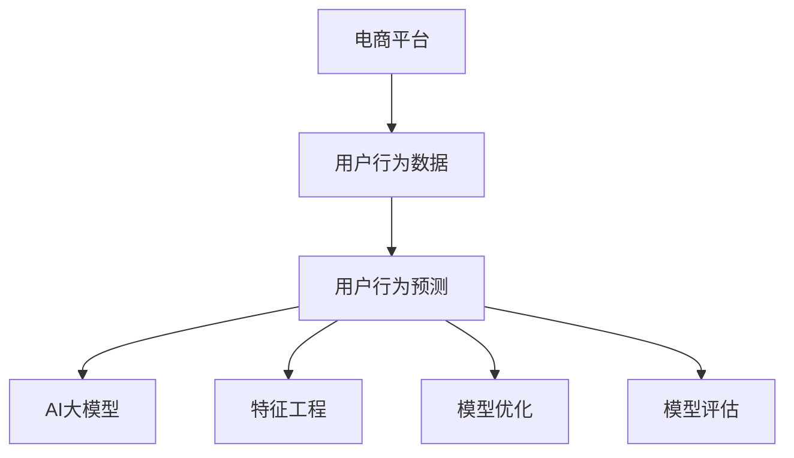

                 

# 电商平台用户行为预测：AI大模型方法

> 关键词：电商平台,用户行为,用户预测,机器学习,大模型,神经网络,特征工程,深度学习

## 1. 背景介绍

### 1.1 问题由来

电商平台已成当今社会重要的组成部分，影响着消费者的购物决策和商业模式的创新。为了提供更精准的用户推荐和营销策略，商家亟需深入理解用户的行为模式。然而，用户行为数据量大、维度高，传统数据挖掘方法难以应对。基于AI大模型的用户行为预测技术应运而生，成为电商平台智能化的有力武器。

近年来，深度学习技术在电商平台的应用日趋成熟。AI大模型，如BERT、GPT-3等，以其强大的语言理解能力和丰富知识库，成为用户行为预测的重要手段。这些模型通过在大规模文本语料上预训练，学习到了高层次的语义特征和语言规律。在应用时，通过微调或零样本学习，能够对电商平台的用户行为数据进行建模，预测用户的未来行为，优化用户体验和商家的运营策略。

### 1.2 问题核心关键点

电商平台用户行为预测的核心在于：如何利用AI大模型，通过处理海量用户行为数据，预测用户未来的购买、浏览、收藏、评价等行为，从而实现精准推荐和个性化营销。该问题的解决，依赖于：

1. 大规模文本数据和高质量标注数据。大模型需要大量的文本数据进行预训练，并依赖标注数据进行微调。
2. 强大的神经网络架构和深度学习算法。大模型通过复杂的神经网络结构学习数据规律，并在微调过程中利用深度学习算法进行优化。
3. 高效的特征工程和模型优化技术。大模型预测效果很大程度上依赖于特征工程设计和模型优化策略。
4. 先进的模型评估和对比技术。通过多样化的评估指标和对比方法，对预测模型的性能进行全面评价，选择最优方案。

## 2. 核心概念与联系

### 2.1 核心概念概述

为更好地理解基于AI大模型的电商平台用户行为预测方法，本节将介绍几个关键概念：

- 电商平台：指通过互联网销售商品或服务的平台，如亚马逊、京东、淘宝等。电商平台数据丰富多样，涵盖了交易、评价、互动等多维信息。
- 用户行为数据：用户在电商平台上的行为数据，如浏览记录、购买历史、评价内容等。
- 用户行为预测：通过机器学习算法，预测用户未来的行为，如购买概率、浏览兴趣、推荐选择等。
- AI大模型：指在大规模文本数据上进行预训练的深度学习模型，如BERT、GPT-3、Transformers等，具备强大的语言理解能力和知识表示能力。
- 特征工程：从原始数据中提取、处理和构造特征，以便于模型学习。特征工程是预测准确性的关键。
- 模型优化：通过调整模型结构、学习率、正则化等参数，提升模型的性能和泛化能力。
- 模型评估：通过准确率、召回率、F1值等指标，评估预测模型的性能，选择最优模型。

这些概念之间的逻辑关系可以通过以下Mermaid流程图来展示：



这个流程图展示了大语言模型的核心概念及其之间的关系：

1. 电商平台用户行为数据是大模型的训练基础。
2. 用户行为预测是模型应用的主要目标。
3. AI大模型是预测的核心技术，利用大规模文本预训练的能力。
4. 特征工程和模型优化是模型性能提升的关键步骤。
5. 模型评估确保预测结果的可信性和准确性。

## 3. 核心算法原理 & 具体操作步骤
### 3.1 算法原理概述

基于AI大模型的电商平台用户行为预测，实质上是一种利用深度学习模型对大规模用户行为数据进行建模的过程。该过程分为预训练和微调两个阶段：

- **预训练阶段**：在大规模无标签文本语料上，使用大模型进行自监督预训练，学习通用的语言表示。
- **微调阶段**：在电商平台的标注数据上，通过有监督的微调，使模型学习到特定的用户行为规律，并进行用户行为预测。

### 3.2 算法步骤详解

基于AI大模型的电商平台用户行为预测步骤如下：

**Step 1: 准备数据集**

1. 收集电商平台的用户行为数据，包括浏览记录、购买历史、评价内容等。这些数据可能来自不同的平台和时期，需要进行预处理和统一。

2. 准备高质量标注数据，如用户行为标签、购买意图等，用于模型微调。标注数据可以通过人工标注、半监督学习等方式获取。

**Step 2: 设计特征工程**

1. 从原始数据中提取有用的特征，如用户ID、商品ID、浏览时长、点击率、评价情感等。

2. 利用文本向量化技术，如TF-IDF、Word2Vec等，将用户行为描述转化为向量形式。

3. 对特征进行归一化、降维等处理，以提升模型训练效率。

**Step 3: 预训练模型**

1. 选择合适的预训练模型，如BERT、GPT-3等，加载模型并执行预训练任务。常用的预训练任务包括掩码语言模型和下一句预测等。

2. 在预训练过程中，不断更新模型参数，优化损失函数，直至模型收敛。

**Step 4: 微调模型**

1. 在标注数据集上进行微调，通过有监督的训练，调整模型参数。

2. 设置合适的优化算法和超参数，如AdamW、SGD等，设置学习率、批大小、迭代轮数等。

3. 应用正则化技术，如L2正则、Dropout等，防止过拟合。

4. 定期在验证集上评估模型性能，根据性能指标决定是否触发Early Stopping。

5. 重复上述步骤直至满足预设的迭代轮数或Early Stopping条件。

**Step 5: 测试与部署**

1. 在测试集上评估微调后的模型，对比微调前后的精度提升。

2. 使用微调后的模型对新用户行为数据进行推理预测，集成到电商平台的推荐系统。

3. 持续收集新的数据，定期重新微调模型，以适应数据分布的变化。

### 3.3 算法优缺点

基于AI大模型的电商平台用户行为预测方法具有以下优点：

1. 强大的建模能力：大模型通过大规模预训练，能够学习到丰富的语言表示和知识库，适合处理复杂多变的数据模式。

2. 自动特征提取：大模型能够自动学习特征表示，减少了特征工程的工作量。

3. 适应性强：大模型能够适应不同平台和时期的用户行为数据，具有较好的泛化能力。

4. 实时预测：通过微调，大模型可以实时对用户行为进行预测，提供精准推荐和个性化服务。

同时，该方法也存在一些局限性：

1. 数据需求高：高质量标注数据和预训练语料是模型训练的基础，但数据获取和处理成本较高。

2. 计算资源消耗大：大模型通常需要大量的计算资源进行训练和推理，硬件要求高。

3. 模型复杂度高：大模型结构复杂，调试和优化难度大。

4. 结果可解释性不足：大模型的决策过程复杂，难以解释其内部工作机制。

## 4. 数学模型和公式 & 详细讲解 & 举例说明

### 4.1 数学模型构建

基于AI大模型的电商平台用户行为预测，可以构建以下数学模型：

设电商平台标注数据集为 $D=\{(x_i,y_i)\}_{i=1}^N$，其中 $x_i$ 为输入特征向量，$y_i$ 为标签，$N$ 为样本数。模型预测用户行为的概率为 $P(y_i|x_i)$，通过最大化似然函数进行训练：

$$
L(D)=\sum_{i=1}^N \log P(y_i|x_i)
$$

模型的输出为预测概率 $P(y_i|x_i)$，通过softmax函数将输出映射为概率分布。

### 4.2 公式推导过程

以二分类任务为例，公式推导过程如下：

设 $x_i$ 为特征向量， $y_i$ 为二分类标签，模型预测概率为 $P(y_i=1|x_i)$。通过softmax函数将输出映射为概率分布：

$$
P(y_i=1|x_i)=\frac{e^{M(x_i)}}{e^{M(x_i)}+e^{-M(x_i)}}
$$

其中 $M(x_i)$ 为模型对 $x_i$ 的预测输出，通过线性回归或逻辑回归等方法计算。模型的损失函数为交叉熵损失：

$$
L(D)=\sum_{i=1}^N -y_i\log P(y_i=1|x_i)-(1-y_i)\log P(y_i=0|x_i)
$$

在训练过程中，利用梯度下降等优化算法，不断更新模型参数，最小化损失函数：

$$
\theta \leftarrow \theta - \eta \nabla_{\theta}L(D)
$$

其中 $\theta$ 为模型参数， $\eta$ 为学习率， $\nabla_{\theta}L(D)$ 为损失函数对模型参数的梯度。

### 4.3 案例分析与讲解

以电商平台的推荐系统为例，介绍基于AI大模型的用户行为预测应用。假设电商平台有 $M$ 个商品，每个商品有一个特征向量 $x_j$，用户行为标签为 $y_i$，表示用户是否购买了商品 $j$。模型预测用户购买商品 $j$ 的概率 $P(y_i=1|x_i)$：

$$
P(y_i=1|x_i)=\frac{e^{M(x_i)}_j}{e^{M(x_i)}_j+e^{-M(x_i)}_j}
$$

其中 $M(x_i)$ 为模型对商品 $j$ 的预测输出。模型的损失函数为交叉熵损失：

$$
L(D)=\sum_{i=1}^N -y_i\log P(y_i=1|x_i)-(1-y_i)\log P(y_i=0|x_i)
$$

在训练过程中，利用梯度下降等优化算法，不断更新模型参数，最小化损失函数：

$$
\theta \leftarrow \theta - \eta \nabla_{\theta}L(D)
$$

在训练完成后，模型可以对新商品进行预测，计算用户购买商品的概率，从而实现精准推荐。

## 5. 项目实践：代码实例和详细解释说明

### 5.1 开发环境搭建

在进行电商平台用户行为预测开发前，需要准备好开发环境。以下是使用Python进行TensorFlow开发的环境配置流程：

1. 安装Anaconda：从官网下载并安装Anaconda，用于创建独立的Python环境。

2. 创建并激活虚拟环境：
```bash
conda create -n tf-env python=3.8 
conda activate tf-env
```

3. 安装TensorFlow：从官网获取对应的安装命令。例如：
```bash
conda install tensorflow
```

4. 安装TensorFlow扩展库：
```bash
pip install tensorflow-addons
```

5. 安装各类工具包：
```bash
pip install numpy pandas scikit-learn matplotlib tqdm jupyter notebook ipython
```

完成上述步骤后，即可在`tf-env`环境中开始开发实践。

### 5.2 源代码详细实现

下面我们以电商平台的推荐系统为例，给出使用TensorFlow进行用户行为预测的PyTorch代码实现。

首先，定义模型和优化器：

```python
import tensorflow as tf
from tensorflow.keras.layers import Input, Dense, Embedding, Dropout
from tensorflow.keras.models import Model

# 定义模型输入
input_layer = Input(shape=(max_len,), dtype='int32', name='input')
# 定义词嵌入层
embedding_layer = Embedding(vocab_size, emb_dim, input_length=max_len, mask_zero=True)(input_layer)
# 定义卷积层和池化层
conv_layer = tf.keras.layers.Conv1D(filters=128, kernel_size=3, activation='relu')(embedding_layer)
pool_layer = tf.keras.layers.MaxPooling1D(pool_size=2)(conv_layer)
# 定义全连接层
fc_layer = Dense(128, activation='relu')(pool_layer)
# 定义输出层
output_layer = Dense(1, activation='sigmoid')(fc_layer)
model = Model(inputs=input_layer, outputs=output_layer)
```

然后，定义训练和评估函数：

```python
# 定义交叉熵损失函数
def loss_function(y_true, y_pred):
    return tf.keras.losses.binary_crossentropy(y_true, y_pred)

# 定义优化器
optimizer = tf.keras.optimizers.Adam(learning_rate=0.001)

# 训练函数
def train_epoch(model, dataset, batch_size, optimizer):
    dataset.shuffle(buffer_size=10000)
    for epoch in range(epochs):
        for batch in dataset:
            inputs, labels = batch
            with tf.GradientTape() as tape:
                y_pred = model(inputs)
                loss = loss_function(labels, y_pred)
            gradients = tape.gradient(loss, model.trainable_variables)
            optimizer.apply_gradients(zip(gradients, model.trainable_variables))
```

最后，启动训练流程并在测试集上评估：

```python
# 加载数据集
dataset = tf.data.Dataset.from_tensor_slices((inputs, labels))
dataset = dataset.batch(batch_size, drop_remainder=True)

# 训练模型
model.compile(loss=loss_function, optimizer=optimizer)
model.fit(dataset, epochs=epochs, validation_data=valid_dataset)

# 评估模型
test_dataset = tf.data.Dataset.from_tensor_slices((test_inputs, test_labels))
test_dataset = test_dataset.batch(batch_size, drop_remainder=True)
model.evaluate(test_dataset)
```

以上就是使用TensorFlow对电商平台用户行为预测模型进行开发的完整代码实现。可以看到，通过TensorFlow，我们能够便捷地构建和训练深度学习模型，实现精准推荐系统。

### 5.3 代码解读与分析

让我们再详细解读一下关键代码的实现细节：

**模型定义**

1. `Input`层：用于定义模型的输入，指定输入数据的维度和类型。

2. `Embedding`层：将输入数据转换为词嵌入向量，通过掩码机制处理无效输入。

3. `Conv1D`层和`MaxPooling1D`层：提取输入数据的特征，通过卷积和池化操作，降低特征维度，提取关键信息。

4. `Dense`层：将卷积池化层的输出连接到全连接层，进行高层次的特征学习和决策。

5. `Dense`层：将全连接层的输出映射到预测结果，通过sigmoid函数得到0-1之间的概率值。

**损失函数**

1. `loss_function`函数：定义二分类任务中的交叉熵损失函数，用于衡量预测结果与真实标签之间的差异。

**训练函数**

1. `train_epoch`函数：遍历数据集，前向传播计算预测结果和损失，反向传播计算梯度，并更新模型参数。

通过上述步骤，我们完成了基于AI大模型的电商平台用户行为预测模型的开发和训练。实践中，还需要针对具体任务进行优化和调整，如引入更复杂的特征工程、调整模型结构、优化超参数等。

## 6. 实际应用场景

### 6.1 智能推荐系统

基于AI大模型的电商平台推荐系统，能够根据用户的历史行为数据，预测其未来的购买、浏览、收藏等行为，为用户推荐最适合的商品。通过个性化的推荐，提升用户体验和商家的转化率。

在技术实现上，可以收集用户的历史行为数据，如浏览记录、购买历史、评价内容等，作为训练数据。在模型训练过程中，通过调整模型参数和优化算法，学习用户行为规律，预测其未来的行为选择。最后，根据预测结果生成推荐列表，推送给用户。

### 6.2 用户行为分析

电商平台通过用户行为数据，可以深入了解用户的行为模式，优化产品的市场定位和营销策略。利用AI大模型对用户行为数据进行建模，可以预测用户的未来行为，如是否购买、退货概率等。

在实践应用中，可以定期对用户行为数据进行建模和预测，生成用户行为分析报告，供商家决策参考。例如，通过预测用户的退货概率，商家可以提前采取措施，减少退货率和损失。

### 6.3 异常行为检测

电商平台还面临网络欺诈、虚假交易等风险。通过用户行为数据，可以构建异常行为检测系统，识别出可疑的异常行为，保障平台的安全性和稳定性。

在应用上，可以利用AI大模型对用户行为数据进行建模，定义异常行为的特征和阈值，自动检测异常行为并进行报警。例如，通过检测用户频繁的异常行为，识别出潜在的欺诈行为，及时采取措施。

## 7. 工具和资源推荐

### 7.1 学习资源推荐

为了帮助开发者系统掌握电商平台用户行为预测的理论基础和实践技巧，这里推荐一些优质的学习资源：

1. 《深度学习基础》系列博文：由AI领域的专家撰写，深入浅出地介绍了深度学习的基础知识和前沿进展。

2. 《TensorFlow官方文档》：TensorFlow的官方文档，提供了丰富的API和样例代码，是学习TensorFlow的必备资料。

3. 《自然语言处理与深度学习》书籍：介绍自然语言处理和深度学习的基本概念和技术，涵盖模型训练、优化、评估等多个方面。

4. Weights & Biases：模型训练的实验跟踪工具，可以记录和可视化模型训练过程中的各项指标，方便对比和调优。

5. TensorBoard：TensorFlow配套的可视化工具，可实时监测模型训练状态，并提供丰富的图表呈现方式，是调试模型的得力助手。

通过对这些资源的学习实践，相信你一定能够快速掌握电商平台用户行为预测的精髓，并用于解决实际的电商平台问题。

### 7.2 开发工具推荐

高效的开发离不开优秀的工具支持。以下是几款用于电商平台用户行为预测开发的常用工具：

1. TensorFlow：由Google主导开发的深度学习框架，生产部署方便，适合大规模工程应用。

2. PyTorch：基于Python的开源深度学习框架，灵活动态的计算图，适合快速迭代研究。

3. Weights & Biases：模型训练的实验跟踪工具，可以记录和可视化模型训练过程中的各项指标，方便对比和调优。

4. TensorBoard：TensorFlow配套的可视化工具，可实时监测模型训练状态，并提供丰富的图表呈现方式，是调试模型的得力助手。

5. Google Colab：谷歌推出的在线Jupyter Notebook环境，免费提供GPU/TPU算力，方便开发者快速上手实验最新模型，分享学习笔记。

合理利用这些工具，可以显著提升电商平台用户行为预测的开发效率，加快创新迭代的步伐。

### 7.3 相关论文推荐

电商平台用户行为预测领域的研究涉及多个子领域，以下是几篇奠基性的相关论文，推荐阅读：

1. Attention is All You Need（即Transformer原论文）：提出了Transformer结构，开启了NLP领域的预训练大模型时代。

2. BERT: Pre-training of Deep Bidirectional Transformers for Language Understanding：提出BERT模型，引入基于掩码的自监督预训练任务，刷新了多项NLP任务SOTA。

3. Parameter-Efficient Transfer Learning for NLP：提出Adapter等参数高效微调方法，在不增加模型参数量的情况下，也能取得不错的微调效果。

4. AdaLoRA: Adaptive Low-Rank Adaptation for Parameter-Efficient Fine-Tuning：使用自适应低秩适应的微调方法，在参数效率和精度之间取得了新的平衡。

这些论文代表了大语言模型用户行为预测的研究进展，通过学习这些前沿成果，可以帮助研究者把握学科前进方向，激发更多的创新灵感。

## 8. 总结：未来发展趋势与挑战

### 8.1 总结

本文对基于AI大模型的电商平台用户行为预测方法进行了全面系统的介绍。首先阐述了电商平台的背景和用户行为预测的重要性，明确了大模型在数据处理和模型预测中的独特价值。其次，从原理到实践，详细讲解了电商平台用户行为预测的数学模型和关键步骤，给出了预测任务的完整代码实例。同时，本文还广泛探讨了预测方法在智能推荐、用户行为分析、异常检测等多个领域的应用前景，展示了大模型预测的巨大潜力。

通过本文的系统梳理，可以看到，基于AI大模型的电商平台用户行为预测技术，能够处理大规模复杂数据，提供精准的推荐和分析服务，成为电商平台智能化的重要手段。未来，伴随预训练语言模型的不断演进和微调技术的持续发展，该技术必将在电商平台中发挥更大的作用，提升用户体验和商家运营效率。

### 8.2 未来发展趋势

展望未来，AI大模型在电商平台用户行为预测领域将呈现以下几个发展趋势：

1. 预训练模型规模不断增大。随着算力成本的下降和数据规模的扩张，预训练模型的参数量还将持续增长，使其具备更强大的语言理解能力和知识表示能力。

2. 微调方法的不断优化。新的微调方法，如自适应低秩适应、参数高效微调等，将提升微调的效率和精度，减小过拟合风险。

3. 多模态融合技术的发展。随着电商平台数据的多样化，多模态融合技术将发挥重要作用，将文本、图像、声音等多种数据类型结合起来，提升模型的泛化能力和鲁棒性。

4. 实时化预测的实现。通过优化模型结构和使用高效的推理算法，大模型可以实现实时化的预测，支持动态推荐和智能决策。

5. 更先进的模型评估方法。随着模型复杂度的提升，新的评估方法将出现，如多样本学习、自适应评估等，确保模型预测结果的可靠性。

6. 模型解释性和可解释性的增强。通过引入可解释性技术，如模型可视化、特征重要性分析等，大模型将更透明，便于用户和商家理解和使用。

以上趋势凸显了AI大模型在电商平台用户行为预测中的广阔前景。这些方向的探索发展，将进一步提升模型的性能和应用范围，为电商平台的智能化发展提供新的动力。

### 8.3 面临的挑战

尽管AI大模型在电商平台用户行为预测上已经取得了显著成果，但在实现智能化、普适化应用的过程中，仍面临诸多挑战：

1. 标注数据需求高。高质量标注数据的获取和处理成本较高，数据多样性和质量的一致性也存在挑战。

2. 模型鲁棒性不足。电商平台的推荐系统需要面对复杂多变的数据，模型的泛化性能仍需提升。

3. 实时预测的硬件要求高。大规模预训练和实时预测对计算资源的需求大，硬件设备需要适配。

4. 模型复杂度增加。模型结构的复杂化带来调试和优化的难度，模型的可解释性也需加强。

5. 安全性和隐私保护。电商平台的用户数据具有高敏感性，模型的安全性保护和隐私保护亟需加强。

6. 法律法规和伦理规范。电商平台的用户行为预测需符合法律法规和伦理规范，避免数据滥用和偏见。

正视这些挑战，积极应对并寻求突破，将是大模型在电商平台用户行为预测中不断进步的关键。相信随着学界和产业界的共同努力，这些挑战终将一一被克服，大模型将进一步赋能电商平台的智能化发展。

### 8.4 研究展望

面对电商平台用户行为预测所面临的种种挑战，未来的研究需要在以下几个方面寻求新的突破：

1. 探索无监督和半监督学习技术。摆脱对大规模标注数据的依赖，利用自监督学习、主动学习等方法，提升模型的泛化能力和适应性。

2. 研究更加高效的特征提取技术。通过引入更先进的特征工程方法，提升模型的预测准确性和泛化能力。

3. 开发更加高效的推理算法。通过优化模型结构和推理算法，提升模型的推理速度和效率。

4. 引入知识图谱等外部知识。将外部知识与模型融合，提升模型的综合能力和推理能力。

5. 加强模型的可解释性和隐私保护。通过引入可解释性技术和隐私保护技术，提升模型的透明性和安全性。

这些研究方向的探索，将引领电商平台用户行为预测技术迈向更高的台阶，为电商平台的智能化和安全性提供新的保障。面向未来，AI大模型在电商平台用户行为预测领域必将发挥更大的作用，推动电商平台的智能化升级。

## 9. 附录：常见问题与解答

**Q1：电商平台用户行为预测的目标是什么？**

A: 电商平台用户行为预测的目标是通过深度学习模型，根据用户的历史行为数据，预测其未来的购买、浏览、收藏等行为，实现精准推荐和个性化服务，提升用户体验和商家运营效率。

**Q2：大模型在电商平台推荐系统中的应用效果如何？**

A: 大模型在电商平台推荐系统中的应用效果显著。通过预训练和微调，大模型能够学习到用户行为规律，预测其未来的行为选择，生成个性化的推荐列表。实际应用中，推荐系统的点击率、转化率、留存率等指标均有显著提升。

**Q3：电商平台用户行为预测中的常见挑战有哪些？**

A: 电商平台用户行为预测中的常见挑战包括：
1. 标注数据需求高：高质量标注数据的获取和处理成本较高，数据多样性和质量的一致性也存在挑战。
2. 模型鲁棒性不足：电商平台的推荐系统需要面对复杂多变的数据，模型的泛化性能仍需提升。
3. 实时预测的硬件要求高：大规模预训练和实时预测对计算资源的需求大，硬件设备需要适配。
4. 模型复杂度增加：模型结构的复杂化带来调试和优化的难度，模型的可解释性也需加强。
5. 安全性和隐私保护：电商平台的用户数据具有高敏感性，模型的安全性保护和隐私保护亟需加强。
6. 法律法规和伦理规范：电商平台的用户行为预测需符合法律法规和伦理规范，避免数据滥用和偏见。

**Q4：电商平台用户行为预测的未来方向有哪些？**

A: 电商平台用户行为预测的未来方向包括：
1. 探索无监督和半监督学习技术：利用自监督学习、主动学习等方法，提升模型的泛化能力和适应性。
2. 研究更加高效的特征提取技术：引入更先进的特征工程方法，提升模型的预测准确性和泛化能力。
3. 开发更加高效的推理算法：优化模型结构和推理算法，提升模型的推理速度和效率。
4. 引入知识图谱等外部知识：将外部知识与模型融合，提升模型的综合能力和推理能力。
5. 加强模型的可解释性和隐私保护：引入可解释性技术和隐私保护技术，提升模型的透明性和安全性。

通过这些方向的研究，电商平台用户行为预测技术将进一步提升，为电商平台的智能化和安全性提供新的保障。

---

作者：禅与计算机程序设计艺术 / Zen and the Art of Computer Programming

