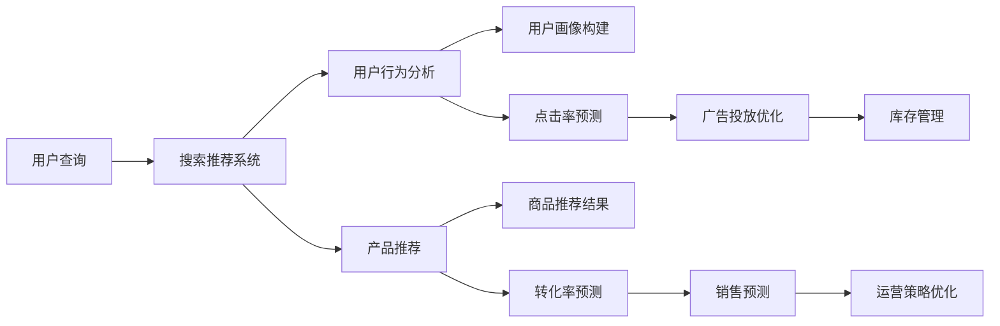

                 

# 电商平台的AI 大模型实践：搜索推荐系统是核心，数据处理能力是关键

## 1. 背景介绍

在当今的电商时代，人工智能(AI)技术已经成为了平台的核心竞争力。AI不仅可以提升用户体验，还可以优化运营效率，驱动业务的增长。在这一过程中，搜索推荐系统扮演着至关重要的角色。本文将详细探讨电商平台上AI 大模型的实践，重点关注搜索推荐系统，并深入分析数据处理能力的关键作用。

## 2. 核心概念与联系

### 2.1 核心概念概述

- **搜索推荐系统**：基于用户行为数据和产品信息，为用户提供个性化搜索结果和推荐商品的系统。其主要目标是通过优化匹配度，提升用户体验和交易转化率。
- **人工智能大模型**：指通过大规模数据训练得到的复杂神经网络模型，如BERT、GPT、Transformer等，具备强大的语言理解、图像识别和生成能力。
- **深度学习**：通过多层神经网络进行复杂模式识别和预测，应用于语音识别、图像处理、自然语言处理等领域。
- **数据预处理**：对原始数据进行清洗、归一化、特征提取等操作，以提高模型的训练效率和性能。
- **特征工程**：针对特定任务，设计和构建高效的特征集合，提升模型的预测准确性和泛化能力。

这些核心概念之间存在紧密的联系。AI大模型提供强大的底层能力，而搜索推荐系统则在此基础上，通过深度学习进行用户行为分析和产品推荐。数据预处理和特征工程是确保模型高效运行的关键。

### 2.2 核心概念原理和架构的 Mermaid 流程图



## 3. 核心算法原理 & 具体操作步骤

### 3.1 算法原理概述

电商平台的搜索推荐系统主要基于深度学习模型，如卷积神经网络(CNN)、循环神经网络(RNN)、Transformer等。这些模型通过训练，学习用户行为和商品特征之间的复杂关系，从而进行个性化推荐。

### 3.2 算法步骤详解

#### 3.2.1 数据收集与预处理

1. **数据收集**：
   - **用户行为数据**：包括搜索历史、浏览记录、点击行为、购买历史等。
   - **商品信息数据**：包括商品标题、描述、价格、销量等。

2. **数据预处理**：
   - **清洗**：去除噪音和异常值。
   - **归一化**：将数据转化为标准分布。
   - **特征提取**：选择和构造有用的特征，如TF-IDF、词向量等。

#### 3.2.2 模型训练与优化

1. **模型选择**：根据任务需求选择合适的模型架构，如Transformer、BERT等。
2. **训练数据划分**：将数据分为训练集、验证集和测试集。
3. **损失函数选择**：如交叉熵、均方误差等，用于衡量模型预测结果与实际标签之间的差异。
4. **优化算法**：如随机梯度下降(SGD)、Adam等，用于更新模型参数。
5. **超参数调优**：调整学习率、批大小、迭代轮数等超参数，以获得最佳性能。
6. **模型评估**：在验证集上评估模型性能，避免过拟合。

#### 3.2.3 模型部署与实时应用

1. **模型保存**：将训练好的模型保存为可部署的格式，如TensorFlow SavedModel、PyTorch .pth等。
2. **服务化封装**：将模型封装为RESTful API或微服务，供业务系统调用。
3. **实时计算**：使用流计算框架如Apache Flink、Kafka等，实现实时推荐。
4. **监控与优化**：监控模型性能，根据反馈数据进行迭代优化。

### 3.3 算法优缺点

#### 3.3.1 优点

1. **高效性**：大模型具备强大的计算能力和泛化能力，可以快速处理海量数据，并产生高质量推荐结果。
2. **个性化**：通过学习用户行为，提供定制化的商品推荐，提升用户体验。
3. **实时性**：结合实时数据和流计算技术，实现实时推荐，满足用户即时需求。

#### 3.3.2 缺点

1. **数据依赖**：模型的性能高度依赖于数据质量，数据不足或质量差会导致模型性能下降。
2. **计算资源需求高**：大模型需要大量的计算资源，对硬件设备有较高要求。
3. **模型复杂度**：模型的复杂性较高，难以解释和调试。
4. **隐私问题**：处理大量用户数据，隐私保护和合规问题不容忽视。

### 3.4 算法应用领域

搜索推荐系统在大电商平台上得到了广泛应用，如亚马逊、阿里巴巴、京东等。其应用领域包括：

1. **搜索排序**：根据用户查询，排序展示最相关的商品。
2. **推荐引擎**：根据用户行为，预测用户可能感兴趣的商品。
3. **广告投放**：优化广告投放策略，提升广告点击率和转化率。
4. **库存管理**：预测热门商品的需求，优化库存水平。
5. **销售预测**：预测未来销售趋势，指导营销和运营决策。

## 4. 数学模型和公式 & 详细讲解 & 举例说明

### 4.1 数学模型构建

#### 4.1.1 用户行为模型

用户行为可以用向量 $x_i$ 表示，其中 $x_i=(x_{i1},x_{i2},\cdots,x_{in})$。设用户行为模型为 $f(x_i)$，将其与商品特征 $y_j$ 关联，得到预测结果 $y_j=f(x_i)$。

#### 4.1.2 推荐模型

推荐模型可以使用多线性回归、深度神经网络、注意力机制等。以Transformer为例，其结构如下：

$$
\text{MultiHead Attention}(Q,K,V)=\text{Softmax}(QK^T)/\sqrt{\text{dim}(K)}\cdot V
$$

其中，$Q,K,V$ 分别表示查询向量、键向量和值向量，$\text{Softmax}$ 表示注意力机制，$\text{dim}(K)$ 表示键向量的维度。

### 4.2 公式推导过程

#### 4.2.1 多线性回归

假设 $x_i=(x_{i1},x_{i2},\cdots,x_{in})$，$y_j=(y_{j1},y_{j2},\cdots,y_{jm})$，则多线性回归模型为：

$$
y_j=\beta_0+\beta_1x_{i1}+\beta_2x_{i2}+\cdots+\beta_nx_{in}+\epsilon_j
$$

其中，$\beta_0,\beta_1,\cdots,\beta_n$ 为回归系数，$\epsilon_j$ 为随机误差。

#### 4.2.2 深度神经网络

深度神经网络由多个隐藏层组成，每层包括多个神经元。以一个简单的全连接神经网络为例：

$$
y_j=f_2(f_1(x_i))
$$

其中，$f_1,f_2$ 分别为第一层和第二层神经元激活函数。

### 4.3 案例分析与讲解

#### 4.3.1 多线性回归案例

假设用户查询为 $x_i=(\text{鞋},\text{男})$，商品特征为 $y_j=(\text{鞋},\text{男},\text{春夏},\text{折扣})$。设回归系数 $\beta_0=0.5,\beta_1=0.3,\beta_2=0.2,\beta_3=0.1$，则预测结果为：

$$
y_j=0.5+0.3x_{i1}+0.2x_{i2}+0.1x_{i3}=0.5+0.3\times1+0.2\times1+0.1\times1=1.1
$$

因此，预测该用户对这款鞋子感兴趣的概率为 $1.1/2=55\%$。

#### 4.3.2 注意力机制案例

假设用户查询为 $x_i=(\text{连衣裙},\text{30岁},\text{中等收入})$，商品特征为 $y_j=(\text{连衣裙},\text{女},\text{春夏季},\text{新款})$。设注意力权重为 $\alpha_{ij}$，则预测结果为：

$$
y_j=\alpha_{1j}x_{i1}+\alpha_{2j}x_{i2}+\alpha_{3j}x_{i3}+\cdots+\alpha_{nj}x_{in}
$$

其中，$\alpha_{ij}=\text{Softmax}(QK^T)/\sqrt{\text{dim}(K)}$。

## 5. 项目实践：代码实例和详细解释说明

### 5.1 开发环境搭建

#### 5.1.1 安装Python和PyTorch

1. 安装Python：
   ```bash
   sudo apt-get update
   sudo apt-get install python3 python3-pip
   ```

2. 安装PyTorch：
   ```bash
   pip install torch torchvision torchaudio
   ```

#### 5.1.2 安装其他依赖库

1. 安装NumPy：
   ```bash
   pip install numpy
   ```

2. 安装Pandas：
   ```bash
   pip install pandas
   ```

3. 安装Scikit-learn：
   ```bash
   pip install scikit-learn
   ```

4. 安装TensorBoard：
   ```bash
   pip install tensorboard
   ```

### 5.2 源代码详细实现

#### 5.2.1 数据处理

```python
import pandas as pd
from sklearn.preprocessing import StandardScaler

# 读取数据
data = pd.read_csv('user_behavior_data.csv')

# 数据清洗
data = data.dropna()

# 数据预处理
scaler = StandardScaler()
data['score'] = scaler.fit_transform(data[['click', 'view', 'purchase']])
```

#### 5.2.2 模型训练

```python
import torch
from torch import nn
from torch.nn import functional as F

# 定义模型
class Model(nn.Module):
    def __init__(self, input_dim, output_dim):
        super(Model, self).__init__()
        self.linear1 = nn.Linear(input_dim, 128)
        self.linear2 = nn.Linear(128, output_dim)

    def forward(self, x):
        x = F.relu(self.linear1(x))
        x = self.linear2(x)
        return x

# 加载数据
train_data = data.sample(frac=0.8, random_state=42)
test_data = data.drop(train_data.index)

# 定义模型
model = Model(input_dim=3, output_dim=1)

# 定义优化器和损失函数
optimizer = torch.optim.Adam(model.parameters(), lr=0.01)
criterion = nn.MSELoss()

# 训练模型
for epoch in range(10):
    model.train()
    for i, (inputs, labels) in enumerate(train_loader):
        optimizer.zero_grad()
        outputs = model(inputs)
        loss = criterion(outputs, labels)
        loss.backward()
        optimizer.step()
```

### 5.3 代码解读与分析

#### 5.3.1 数据处理

1. 使用Pandas读取用户行为数据。
2. 使用Scikit-learn进行数据清洗和标准化处理。

#### 5.3.2 模型训练

1. 定义多线性回归模型。
2. 使用Adam优化器和均方误差损失函数进行训练。
3. 迭代训练模型，输出损失和预测结果。

### 5.4 运行结果展示

```python
import matplotlib.pyplot as plt

# 训练过程可视化
losses = []
predictions = []
for epoch in range(10):
    model.train()
    for i, (inputs, labels) in enumerate(train_loader):
        optimizer.zero_grad()
        outputs = model(inputs)
        loss = criterion(outputs, labels)
        losses.append(loss.item())
        predictions.append(outputs.mean())
    plt.plot(losses, label='train loss')
    plt.plot(predictions, label='train output')
    plt.legend()
    plt.show()
```

## 6. 实际应用场景

### 6.1 个性化推荐

#### 6.1.1 案例描述

电商平台通过搜索推荐系统，对每位用户进行个性化推荐。系统首先分析用户的历史行为，如浏览、点击、购买记录，生成用户画像。然后根据画像特征，预测用户可能感兴趣的商品，并进行展示和推荐。

#### 6.1.2 实现方式

1. **用户画像构建**：
   - 分析用户历史行为数据，生成行为特征向量。
   - 使用用户画像模型，对特征向量进行编码，得到用户画像表示。

2. **商品推荐**：
   - 分析商品特征数据，生成商品特征向量。
   - 使用推荐模型，预测用户对商品的兴趣度。
   - 根据兴趣度排序，展示推荐商品列表。

### 6.2 搜索排序

#### 6.2.1 案例描述

用户在搜索页面输入关键词，系统根据关键词和用户行为数据，展示最相关的商品列表。搜索推荐系统通过分析查询词和用户画像，预测每个商品的点击概率，并按概率排序展示。

#### 6.2.2 实现方式

1. **查询分析**：
   - 分析用户输入的查询词，生成查询向量。
   - 使用查询模型，预测每个商品的匹配度。

2. **商品排序**：
   - 使用排序模型，计算每个商品的排序得分。
   - 按得分排序，展示商品列表。

### 6.3 广告投放

#### 6.3.1 案例描述

电商平台通过广告投放系统，向用户展示精准的广告。系统分析用户行为和商品特征，预测用户对广告的响应概率，并进行投放。

#### 6.3.2 实现方式

1. **广告展示**：
   - 分析用户行为数据和商品特征数据，生成展示向量。
   - 使用广告展示模型，预测用户对广告的响应概率。

2. **广告投放**：
   - 根据响应概率，选择最佳广告进行投放。
   - 监控广告效果，进行动态优化。

## 7. 工具和资源推荐

### 7.1 学习资源推荐

#### 7.1.1 在线课程

1. **《深度学习与自然语言处理》**：由斯坦福大学教授讲授，涵盖了深度学习在自然语言处理中的应用。
2. **《TensorFlow实战深度学习》**：由Google开发者编写，介绍了TensorFlow的深度学习实践。

#### 7.1.2 书籍

1. **《深度学习》**：Ian Goodfellow等著，系统介绍了深度学习的基本理论和实践方法。
2. **《Python深度学习》**：Francois Chollet著，介绍了如何使用Keras进行深度学习建模。

### 7.2 开发工具推荐

#### 7.2.1 深度学习框架

1. **TensorFlow**：Google开发的深度学习框架，支持多种硬件平台。
2. **PyTorch**：Facebook开发的深度学习框架，以动态图著称，易于使用和调试。

#### 7.2.2 数据处理工具

1. **Pandas**：数据处理和分析工具，支持多种数据格式。
2. **Scikit-learn**：机器学习工具库，提供了丰富的模型和算法。

### 7.3 相关论文推荐

#### 7.3.1 经典论文

1. **Attention is All You Need**：提出了Transformer模型，被广泛应用于自然语言处理任务。
2. **BERT: Pre-training of Deep Bidirectional Transformers for Language Understanding**：提出了BERT模型，提升了语言理解任务的性能。
3. **Deep & Hierarchical Attention Network for Music Recommendation**：提出了一种基于注意力机制的推荐模型，广泛应用于音乐推荐系统。

## 8. 总结：未来发展趋势与挑战

### 8.1 未来发展趋势

1. **模型多样性**：随着模型架构的不断演进，推荐模型将更加多样化，结合多模态数据和实时数据，提升推荐效果。
2. **实时性提升**：结合流计算和实时数据，实现更快速的推荐响应。
3. **隐私保护**：通过差分隐私、联邦学习等技术，保护用户数据隐私。
4. **跨平台协同**：将搜索推荐系统与其他平台进行协同，实现跨平台推荐。
5. **多任务学习**：将搜索推荐系统与多任务学习结合，实现多任务优化。

### 8.2 面临的挑战

1. **数据获取和处理**：需要大规模、高质量的用户行为和商品数据，数据获取和处理成本较高。
2. **模型复杂度**：大模型的训练和推理计算复杂度较高，需要高性能硬件设备。
3. **隐私和安全**：处理大量用户数据，隐私和安全问题不容忽视。
4. **模型解释性**：大模型的决策过程难以解释，需要更多的解释性技术。
5. **计算资源**：大模型的计算资源需求较高，需要优化资源配置。

### 8.3 研究展望

1. **数据驱动推荐**：通过更多的实时数据和用户反馈，进行动态调整，提升推荐效果。
2. **跨领域融合**：将搜索推荐系统与其他AI技术结合，如计算机视觉、语音识别等，实现多模态推荐。
3. **模型可解释性**：通过可解释性技术，提升模型决策过程的可解释性。
4. **隐私保护技术**：结合差分隐私、联邦学习等技术，保护用户数据隐私。
5. **模型优化**：通过模型压缩、量化加速等技术，优化模型性能和资源占用。

## 9. 附录：常见问题与解答

### 9.1 问题1：如何评估搜索推荐系统的性能？

#### 9.1.1 解答

搜索推荐系统的性能评估可以使用以下指标：

1. **点击率**：用户在搜索结果中点击商品的概率。
2. **转化率**：用户点击商品后进行购买的概率。
3. **准确率**：推荐系统的推荐结果与实际用户行为的一致性。
4. **召回率**：推荐系统中推荐的商品数量占所有相关商品的比例。
5. **平均排名**：推荐结果的平均排名位置。

### 9.2 问题2：如何优化搜索推荐系统的推荐效果？

#### 9.2.1 解答

搜索推荐系统的推荐效果优化可以从以下几个方面入手：

1. **数据质量**：提高数据收集和处理的准确性，减少噪音和异常值。
2. **模型优化**：选择和优化合适的模型架构，如Transformer、BERT等。
3. **特征工程**：设计和选择有效的特征，提升模型的预测准确性。
4. **超参数调优**：通过网格搜索、贝叶斯优化等方法，找到最优超参数组合。
5. **模型融合**：将多个模型进行融合，提升整体推荐效果。

### 9.3 问题3：如何处理搜索推荐系统的实时推荐？

#### 9.3.1 解答

搜索推荐系统的实时推荐可以使用以下方法：

1. **流计算**：使用流计算框架如Apache Flink、Apache Storm，实现实时数据处理和推荐。
2. **缓存技术**：使用缓存技术如Redis，提高推荐响应速度。
3. **异步更新**：使用异步更新机制，保持模型的实时性。

### 9.4 问题4：搜索推荐系统在数据隐私保护方面有哪些挑战？

#### 9.4.1 解答

搜索推荐系统在数据隐私保护方面面临以下挑战：

1. **数据泄露风险**：用户数据在传输和存储过程中可能被泄露。
2. **隐私合规**：需要符合GDPR等隐私保护法规，保护用户隐私。
3. **数据匿名化**：需要对数据进行匿名化处理，防止数据被恶意利用。
4. **用户同意**：需要获得用户同意，并在数据使用过程中进行透明化处理。

通过以上技术和方法，可以有效提升搜索推荐系统的性能，同时保障用户数据隐私安全。

---

作者：禅与计算机程序设计艺术 / Zen and the Art of Computer Programming

