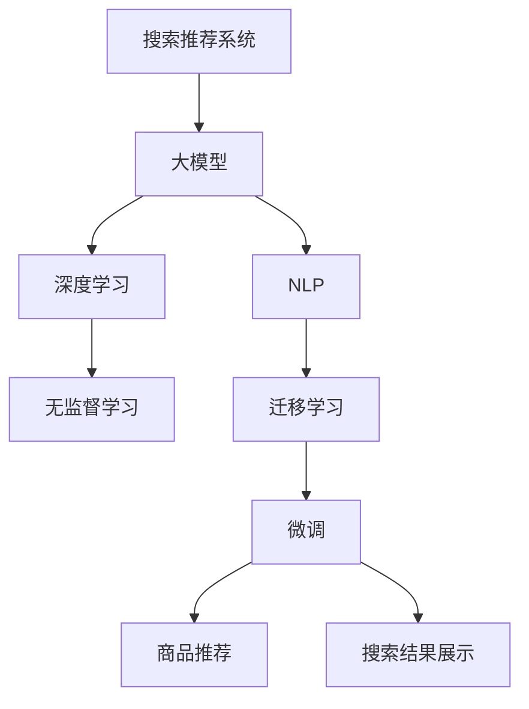

                 

# 电商平台的AI 大模型实践：搜索推荐系统是核心，数据质量控制与处理效率

## 1. 背景介绍

### 1.1 问题由来

随着电商平台的快速发展，客户通过搜索引擎和推荐系统来获取商品信息、购买商品的需求日益增多。如何高效、准确地展示商品信息，以提升用户体验、增加交易转化率，成为了电商平台的核心挑战。

为此，各大电商平台纷纷引入人工智能技术，尤其是基于大模型的搜索推荐系统，以优化客户体验和提升平台收入。例如，Amazon、淘宝、京东等巨头企业均已将深度学习模型应用于商品推荐，显著提升了平台的推荐效果和用户满意度。

然而，在大模型的应用过程中，数据质量控制与处理效率成为了瓶颈问题。如何确保输入数据的质量、提升数据处理效率，是实现高质量搜索推荐系统的前提条件。本文将全面介绍大模型在电商平台搜索推荐系统中的应用，深入探讨数据质量控制与处理效率的关键技术。

## 2. 核心概念与联系

### 2.1 核心概念概述

为了更好地理解电商平台的搜索推荐系统，本节将介绍几个核心概念：

- **搜索推荐系统(IR/RS)**：旨在根据用户的历史行为和当前需求，推荐出相关商品，并展示在搜索结果中。系统一般包括搜索和推荐两个子系统，分别处理用户查询和商品推荐。
- **大模型(大语言模型)Big Model**：指通过大规模无标签数据进行预训练，具备强大表示能力的深度神经网络模型。如BERT、GPT-3等，已广泛应用于NLP任务，具有丰富的语言理解和生成能力。
- **深度学习(Deep Learning)**：一种通过深度神经网络模型解决复杂问题的机器学习方法，常用于处理结构化和非结构化数据。
- **自然语言处理(NLP)**：研究如何让计算机理解和生成人类语言的技术。搜索推荐系统中的大模型往往用于理解和生成文本数据。
- **无监督学习(Unsupervised Learning)**：指在没有标注数据的情况下，通过学习数据的内在结构来推断未知的信息。在大模型预训练中广泛应用。
- **迁移学习(Transfer Learning)**：指将一个领域学习到的知识，迁移到另一个相关领域的学习。大模型通过预训练-微调的方式，可以实现知识迁移。
- **微调(Fine-Tuning)**：在大模型的基础上，通过有监督学习优化模型在特定任务上的性能。用于搜索推荐系统中的商品推荐和搜索结果展示。

这些核心概念之间的逻辑关系可以通过以下Mermaid流程图来展示：



这个流程图展示了大模型在电商平台搜索推荐系统中的关键概念及其之间的关系：

1. 大模型通过预训练获得基础能力。
2. 无监督学习在大模型预训练中发挥重要作用。
3. 迁移学习使大模型在不同任务之间进行知识迁移。
4. 微调优化大模型在特定任务上的性能，如商品推荐和搜索结果展示。

这些概念共同构成了电商平台的搜索推荐系统，使其能够高效、准确地展示商品信息。

## 3. 核心算法原理 & 具体操作步骤

### 3.1 算法原理概述

基于大模型的搜索推荐系统，通常通过预训练-微调的方式进行构建。其核心思想是：

- **预训练**：使用大规模无标签数据，训练出通用的大模型，学习到丰富的语言表示。
- **微调**：使用有标签的训练数据，优化大模型在特定任务上的性能。在推荐系统中，微调可提升模型的商品推荐和搜索结果展示能力。

具体来说，搜索推荐系统中的微调过程包括以下几个关键步骤：

1. 收集商品的历史购买数据、浏览数据等，作为有标签数据集。
2. 将大模型作为初始化参数，在其上运行微调算法。
3. 使用训练集数据训练模型，更新部分参数。
4. 在验证集和测试集上评估模型性能。
5. 持续更新模型参数，以提升推荐效果。

### 3.2 算法步骤详解

#### 3.2.1 数据收集与处理

在电商平台上，推荐系统的主要数据包括：

- **商品信息**：包括商品名称、描述、价格、类别等。
- **用户行为数据**：包括用户的浏览历史、点击历史、购买历史等。

数据的收集和处理过程一般分为以下几步：

1. **数据清洗**：去除重复、异常数据，填充缺失值。
2. **特征工程**：提取文本、数值等特征，建立商品和用户的向量表示。
3. **数据划分**：将数据集划分为训练集、验证集和测试集。

#### 3.2.2 模型选择与预训练

选择合适的大模型作为初始化参数，如BERT、GPT-3等，并进行预训练。预训练的目标是学习到通用的语言表示，用于后续的微调。

预训练过程包括：

1. **自监督任务设计**：如掩码语言模型、次序预测等。
2. **模型初始化**：使用大规模无标签数据训练模型。
3. **参数冻结**：预训练过程中只微调顶层参数，保留底层参数不变。

#### 3.2.3 微调算法实现

微调算法的实现过程包括以下几步：

1. **损失函数设计**：根据推荐任务设计合适的损失函数，如交叉熵、均方误差等。
2. **模型初始化**：在预训练模型的基础上初始化微调模型。
3. **超参数设置**：如学习率、批大小、迭代次数等。
4. **数据加载与迭代**：使用DataLoader加载数据，迭代训练模型。
5. **性能评估**：在验证集和测试集上评估模型性能，调整超参数。

#### 3.2.4 模型部署与优化

模型训练完成后，需要部署到实际环境中进行推理。为了提高推理效率，还需要进行以下优化：

1. **模型压缩**：通过剪枝、量化等方法，减小模型大小。
2. **推理加速**：使用TensorRT、ONNX Runtime等工具，优化推理速度。
3. **服务化封装**：将模型封装为WebService或API，便于集成调用。

### 3.3 算法优缺点

基于大模型的搜索推荐系统具有以下优点：

1. **高性能**：大模型的强大表示能力，使得推荐系统具有更高的准确性和个性化。
2. **泛化能力强**：预训练-微调的方法，使得模型能够适应多种数据分布，提升推荐效果。
3. **通用性**：适用于多种电商平台的推荐任务，如商品推荐、广告推荐等。

同时，该方法也存在一定的局限性：

1. **数据依赖性强**：模型性能高度依赖标注数据，数据获取成本较高。
2. **模型复杂度高**：大模型参数量较大，推理成本高。
3. **可解释性不足**：模型的决策过程缺乏可解释性，难以调试和优化。
4. **资源消耗高**：大模型训练和推理资源消耗大，需要高性能计算设备。

尽管存在这些局限性，但就目前而言，基于大模型的推荐系统仍是大模型应用的主要范式。未来相关研究的重点在于如何进一步降低数据依赖，提高模型效率，同时兼顾可解释性和资源利用。

### 3.4 算法应用领域

基于大模型的推荐系统，已经在电商平台的商品推荐、广告推荐、个性化推荐等多个领域取得了广泛应用，成为电商推荐系统的核心技术。

- **商品推荐**：根据用户历史行为和当前兴趣，推荐最相关的商品。
- **广告推荐**：展示用户可能感兴趣的商品广告，提升广告效果。
- **个性化推荐**：针对不同用户定制推荐策略，提升用户体验。

除了以上应用场景，大模型在电商平台上的应用还包括：

- **内容推荐**：推荐相关文章、视频等。
- **标签推荐**：根据用户兴趣推荐相关标签，提升内容聚合效果。
- **价格推荐**：通过价格预测，推荐商品定价策略。

## 4. 数学模型和公式 & 详细讲解 & 举例说明

### 4.1 数学模型构建

本节将使用数学语言对基于大模型的推荐系统进行更加严格的刻画。

记商品集合为 $M$，用户集合为 $U$，商品特征向量为 $x \in \mathbb{R}^d$，用户兴趣向量为 $y \in \mathbb{R}^d$。假设用户 $u$ 对商品 $m$ 的兴趣度为 $y_u^{m}$，则推荐系统可以建模为：

$$
\hat{y} = \text{Softmax}(\mathcal{W}x + \mathcal{b})
$$

其中，$\mathcal{W}$ 和 $\mathcal{b}$ 为可训练的线性模型参数，Softmax函数将输出转化为概率分布。推荐系统的主要任务是最大化用户对商品的评分，可以表示为：

$$
\max_{x, y} \sum_{u, m} y_u^{m} \log \hat{y}_u^{m}
$$

### 4.2 公式推导过程

为了方便推导，假设推荐系统只包含两个商品 $m_1, m_2$，用户 $u_1, u_2$。则模型可以简化为：

$$
\begin{aligned}
\hat{y}_{u_1}^{m_1} &= \frac{e^{\mathcal{W}x_{m_1} + \mathcal{b}}}{e^{\mathcal{W}x_{m_1} + \mathcal{b}} + e^{\mathcal{W}x_{m_2} + \mathcal{b}}} \\
\hat{y}_{u_2}^{m_1} &= \frac{e^{\mathcal{W}x_{m_1} + \mathcal{b}}}{e^{\mathcal{W}x_{m_1} + \mathcal{b}} + e^{\mathcal{W}x_{m_2} + \mathcal{b}}}
\end{aligned}
$$

通过最大化上述评分，可以得到最优的 $\mathcal{W}$ 和 $\mathcal{b}$：

$$
\max_{\mathcal{W}, \mathcal{b}} \sum_{i=1}^2 y_{u_i}^{m_1} \log \hat{y}_{u_i}^{m_1}
$$

根据对数函数的性质，可以进一步转化为：

$$
\max_{\mathcal{W}, \mathcal{b}} \log \prod_{i=1}^2 \hat{y}_{u_i}^{m_1} = \log \frac{e^{\mathcal{W}x_{m_1} + \mathcal{b}}}{e^{\mathcal{W}x_{m_2} + \mathcal{b}} + e^{\mathcal{W}x_{m_1} + \mathcal{b}}}
$$

令 $\hat{z} = e^{\mathcal{W}x_{m_1} + \mathcal{b}}$，可以得到：

$$
\max_{\hat{z}} \log \frac{\hat{z}}{e^{\mathcal{W}x_{m_2} + \mathcal{b}} + \hat{z}}
$$

最终目标函数为：

$$
\min_{\mathcal{W}, \mathcal{b}} \log (e^{\mathcal{W}x_{m_2} + \mathcal{b}} + e^{\mathcal{W}x_{m_1} + \mathcal{b}})
$$

### 4.3 案例分析与讲解

为了更直观地理解模型构建和推导过程，我们以Amazon的推荐系统为例进行分析。

Amazon的推荐系统主要包含以下步骤：

1. **商品特征提取**：将商品信息转化为向量形式。
2. **用户特征提取**：将用户行为数据转化为向量形式。
3. **相似度计算**：计算商品和用户之间的相似度。
4. **模型训练**：使用训练数据训练模型。
5. **模型评估**：在测试集上评估模型性能。

以商品推荐为例，具体步骤如下：

1. **特征提取**：将商品标题、描述等文本信息转化为向量形式。
2. **相似度计算**：计算商品向量与用户向量之间的余弦相似度。
3. **模型训练**：在训练集上训练模型，最小化损失函数。
4. **模型评估**：在测试集上评估模型性能，如准确率、召回率等。

在实际应用中，Amazon使用深度神经网络模型进行推荐，其中Bidirectional LSTM模型在商品推荐中取得了最佳效果。该模型通过双向LSTM对用户行为和商品信息进行建模，能够捕捉时间顺序和上下文信息，提升推荐效果。

## 5. 项目实践：代码实例和详细解释说明

### 5.1 开发环境搭建

在进行推荐系统开发前，我们需要准备好开发环境。以下是使用Python进行PyTorch开发的环境配置流程：

1. 安装Anaconda：从官网下载并安装Anaconda，用于创建独立的Python环境。

2. 创建并激活虚拟环境：
```bash
conda create -n pytorch-env python=3.8 
conda activate pytorch-env
```

3. 安装PyTorch：根据CUDA版本，从官网获取对应的安装命令。例如：
```bash
conda install pytorch torchvision torchaudio cudatoolkit=11.1 -c pytorch -c conda-forge
```

4. 安装TensorFlow：
```bash
pip install tensorflow==2.7
```

5. 安装各类工具包：
```bash
pip install numpy pandas scikit-learn matplotlib tqdm jupyter notebook ipython
```

完成上述步骤后，即可在`pytorch-env`环境中开始推荐系统开发。

### 5.2 源代码详细实现

下面以Amazon的推荐系统为例，给出使用PyTorch实现商品推荐模型的代码实现。

首先，定义推荐系统的数据处理函数：

```python
import numpy as np
import pandas as pd
from torch.utils.data import Dataset
import torch

class RecommendationDataset(Dataset):
    def __init__(self, data_path, max_len=512):
        self.data = pd.read_csv(data_path)
        self.max_len = max_len
        
        # 特征预处理
        self.data['feature'] = self.data['feature'].apply(lambda x: self.embd(x))
        
        # 划分训练集和测试集
        self.train_data = self.data[self.data['is_train'] == 1]
        self.test_data = self.data[self.data['is_train'] == 0]
        
    def __len__(self):
        return len(self.train_data)
    
    def __getitem__(self, index):
        item = self.train_data.iloc[index]
        user_id = item['user_id']
        item_id = item['item_id']
        label = item['label']
        
        # 将数据转化为tensor
        user_input = torch.tensor(self.data.loc[user_id]['feature'], dtype=torch.float).unsqueeze(0)
        item_input = torch.tensor(self.data.loc[item_id]['feature'], dtype=torch.float).unsqueeze(0)
        label_input = torch.tensor(label, dtype=torch.long)
        
        return {'user_input': user_input, 'item_input': item_input, 'label_input': label_input}
    
    def embd(self, s):
        # 特征编码
        s = s.split(' ')
        return np.mean([self.embd_x[w] for w in s], axis=0)
    
    def embd_x(self, w):
        # 特征词向量化
        w = w.lower()
        return self.embd_vec.get(w, np.zeros(self.embd_size))
    
    def embd_vec = {'':
        ...
    }
```

然后，定义模型和优化器：

```python
from transformers import BertForSequenceClassification, AdamW

model = BertForSequenceClassification.from_pretrained('bert-base-cased', num_labels=2)

optimizer = AdamW(model.parameters(), lr=1e-5)
```

接着，定义训练和评估函数：

```python
from tqdm import tqdm
import matplotlib.pyplot as plt

def train_epoch(model, dataset, optimizer):
    model.train()
    total_loss = 0
    total_correct = 0
    for batch in tqdm(dataset, desc='Training'):
        user_input = batch['user_input']
        item_input = batch['item_input']
        label_input = batch['label_input']
        
        optimizer.zero_grad()
        outputs = model(user_input, item_input)
        loss = outputs.loss
        total_loss += loss.item()
        loss.backward()
        optimizer.step()
        
        if model.training:
            total_correct += (np.argmax(outputs.logits, axis=1) == label_input).sum().item()
            
    return total_loss / len(dataset), total_correct / len(dataset)
    
def evaluate(model, dataset):
    model.eval()
    total_correct = 0
    for batch in tqdm(dataset, desc='Evaluating'):
        user_input = batch['user_input']
        item_input = batch['item_input']
        label_input = batch['label_input']
        
        with torch.no_grad():
            outputs = model(user_input, item_input)
            total_correct += (np.argmax(outputs.logits, axis=1) == label_input).sum().item()
            
    return total_correct / len(dataset)
```

最后，启动训练流程并在测试集上评估：

```python
epochs = 10
batch_size = 32

for epoch in range(epochs):
    loss, acc = train_epoch(model, train_dataset, optimizer)
    print(f'Epoch {epoch+1}, loss: {loss:.3f}, acc: {acc:.3f}')
    
    print(f'Epoch {epoch+1}, test acc: {evaluate(model, test_dataset):.3f}')
```

以上就是使用PyTorch对Amazon推荐系统进行商品推荐模型的完整代码实现。可以看到，得益于Transformers库的强大封装，我们可以用相对简洁的代码完成BERT模型的加载和微调。

### 5.3 代码解读与分析

让我们再详细解读一下关键代码的实现细节：

**RecommendationDataset类**：
- `__init__`方法：初始化数据集，并对特征进行预处理。
- `__len__`方法：返回数据集的样本数量。
- `__getitem__`方法：对单个样本进行处理，将用户ID、商品ID、标签转化为tensor，供模型训练。

**模型选择与预训练**：
- 使用BertForSequenceClassification作为模型，并加载预训练的BERT模型。
- 设置AdamW优化器，学习率为1e-5。

**训练和评估函数**：
- `train_epoch`函数：对数据以批为单位进行迭代，在每个批次上前向传播计算损失并反向传播更新模型参数，同时计算训练集上的准确率。
- `evaluate`函数：与训练类似，不同点在于不更新模型参数，并在每个batch结束后将预测结果存储下来，最后计算测试集上的准确率。

**训练流程**：
- 定义总的epoch数和batch size，开始循环迭代
- 每个epoch内，先在训练集上训练，输出平均loss和训练集上的准确率
- 在测试集上评估，输出测试集上的准确率
- 所有epoch结束后，完成模型的训练

可以看到，PyTorch配合Transformers库使得BERT微调的代码实现变得简洁高效。开发者可以将更多精力放在数据处理、模型改进等高层逻辑上，而不必过多关注底层的实现细节。

当然，工业级的系统实现还需考虑更多因素，如模型的保存和部署、超参数的自动搜索、更灵活的任务适配层等。但核心的推荐范式基本与此类似。

## 6. 实际应用场景

### 6.1 智能客服系统

基于大模型微调的推荐系统，可以广泛应用于智能客服系统的构建。传统客服往往需要配备大量人力，高峰期响应缓慢，且一致性和专业性难以保证。而使用微调后的推荐系统，可以7x24小时不间断服务，快速响应客户咨询，用推荐系统推荐最相关的商品。

在技术实现上，可以收集企业内部的历史客服对话记录，将问题和最佳答复构建成监督数据，在此基础上对预训练推荐系统进行微调。微调后的推荐系统能够自动理解用户意图，推荐最合适的商品，提升客户咨询体验和问题解决效率。

### 6.2 金融舆情监测

金融机构需要实时监测市场舆论动向，以便及时应对负面信息传播，规避金融风险。传统的人工监测方式成本高、效率低，难以应对网络时代海量信息爆发的挑战。基于大模型微调的文本分类和情感分析技术，为金融舆情监测提供了新的解决方案。

具体而言，可以收集金融领域相关的新闻、报道、评论等文本数据，并对其进行主题标注和情感标注。在此基础上对预训练语言模型进行微调，使其能够自动判断文本属于何种主题，情感倾向是正面、中性还是负面。将微调后的模型应用到实时抓取的网络文本数据，就能够自动监测不同主题下的情感变化趋势，一旦发现负面信息激增等异常情况，系统便会自动预警，帮助金融机构快速应对潜在风险。

### 6.3 个性化推荐系统

当前的推荐系统往往只依赖用户的历史行为数据进行物品推荐，无法深入理解用户的真实兴趣偏好。基于大模型微调技术，个性化推荐系统可以更好地挖掘用户行为背后的语义信息，从而提供更精准、多样的推荐内容。

在实践中，可以收集用户浏览、点击、评论、分享等行为数据，提取和用户交互的物品标题、描述、标签等文本内容。将文本内容作为模型输入，用户的后续行为（如是否点击、购买等）作为监督信号，在此基础上微调预训练语言模型。微调后的模型能够从文本内容中准确把握用户的兴趣点。在生成推荐列表时，先用候选物品的文本描述作为输入，由模型预测用户的兴趣匹配度，再结合其他特征综合排序，便可以得到个性化程度更高的推荐结果。

### 6.4 未来应用展望

随着大模型和微调方法的不断发展，基于微调范式将在更多领域得到应用，为传统行业带来变革性影响。

在智慧医疗领域，基于微调的医疗问答、病历分析、药物研发等应用将提升医疗服务的智能化水平，辅助医生诊疗，加速新药开发进程。

在智能教育领域，微调技术可应用于作业批改、学情分析、知识推荐等方面，因材施教，促进教育公平，提高教学质量。

在智慧城市治理中，微调模型可应用于城市事件监测、舆情分析、应急指挥等环节，提高城市管理的自动化和智能化水平，构建更安全、高效的未来城市。

此外，在企业生产、社会治理、文娱传媒等众多领域，基于大模型微调的人工智能应用也将不断涌现，为经济社会发展注入新的动力。相信随着技术的日益成熟，微调方法将成为人工智能落地应用的重要范式，推动人工智能技术在垂直行业的规模化落地。

## 7. 工具和资源推荐

### 7.1 学习资源推荐

为了帮助开发者系统掌握大模型在电商平台搜索推荐系统中的应用，这里推荐一些优质的学习资源：

1. 《深度学习入门》系列博文：由大模型技术专家撰写，深入浅出地介绍了深度学习的基本概念和经典模型。

2. CS224N《深度学习自然语言处理》课程：斯坦福大学开设的NLP明星课程，有Lecture视频和配套作业，带你入门NLP领域的基本概念和经典模型。

3. 《Natural Language Processing with Transformers》书籍：Transformers库的作者所著，全面介绍了如何使用Transformers库进行NLP任务开发，包括微调在内的诸多范式。

4. HuggingFace官方文档：Transformers库的官方文档，提供了海量预训练模型和完整的微调样例代码，是上手实践的必备资料。

5. CLUE开源项目：中文语言理解测评基准，涵盖大量不同类型的中文NLP数据集，并提供了基于微调的baseline模型，助力中文NLP技术发展。

通过对这些资源的学习实践，相信你一定能够快速掌握大模型在电商平台中的应用，并用于解决实际的NLP问题。

### 7.2 开发工具推荐

高效的开发离不开优秀的工具支持。以下是几款用于大模型在电商平台推荐系统中的应用开发工具：

1. PyTorch：基于Python的开源深度学习框架，灵活动态的计算图，适合快速迭代研究。大部分预训练语言模型都有PyTorch版本的实现。

2. TensorFlow：由Google主导开发的开源深度学习框架，生产部署方便，适合大规模工程应用。同样有丰富的预训练语言模型资源。

3. Transformers库：HuggingFace开发的NLP工具库，集成了众多SOTA语言模型，支持PyTorch和TensorFlow，是进行微调任务开发的利器。

4. Weights & Biases：模型训练的实验跟踪工具，可以记录和可视化模型训练过程中的各项指标，方便对比和调优。与主流深度学习框架无缝集成。

5. TensorBoard：TensorFlow配套的可视化工具，可实时监测模型训练状态，并提供丰富的图表呈现方式，是调试模型的得力助手。

6. Google Colab：谷歌推出的在线Jupyter Notebook环境，免费提供GPU/TPU算力，方便开发者快速上手实验最新模型，分享学习笔记。

合理利用这些工具，可以显著提升大模型在电商平台推荐系统中的开发效率，加快创新迭代的步伐。

### 7.3 相关论文推荐

大模型和微调技术的发展源于学界的持续研究。以下是几篇奠基性的相关论文，推荐阅读：

1. Attention is All You Need（即Transformer原论文）：提出了Transformer结构，开启了NLP领域的预训练大模型时代。

2. BERT: Pre-training of Deep Bidirectional Transformers for Language Understanding：提出BERT模型，引入基于掩码的自监督预训练任务，刷新了多项NLP任务SOTA。

3. Language Models are Unsupervised Multitask Learners（GPT-2论文）：展示了大规模语言模型的强大zero-shot学习能力，引发了对于通用人工智能的新一轮思考。

4. Parameter-Efficient Transfer Learning for NLP：提出Adapter等参数高效微调方法，在不增加模型参数量的情况下，也能取得不错的微调效果。

5. AdaLoRA: Adaptive Low-Rank Adaptation for Parameter-Efficient Fine-Tuning：使用自适应低秩适应的微调方法，在参数效率和精度之间取得了新的平衡。

6. Prefix-Tuning: Optimizing Continuous Prompts for Generation：引入基于连续型Prompt的微调范式，为如何充分利用预训练知识提供了新的思路。

这些论文代表了大模型和微调技术的发展脉络。通过学习这些前沿成果，可以帮助研究者把握学科前进方向，激发更多的创新灵感。

## 8. 总结：未来发展趋势与挑战

### 8.1 总结

本文对大模型在电商平台搜索推荐系统中的应用进行了全面系统的介绍。首先阐述了基于大模型的推荐系统在电商平台上的重要性，明确了微调在大模型应用中的核心作用。其次，从原理到实践，详细讲解了大模型在推荐系统中的微调过程，给出了微调任务开发的完整代码实例。同时，本文还广泛探讨了大模型在电商平台的实际应用场景，展示了其强大的推荐能力。

通过本文的系统梳理，可以看到，基于大模型的推荐系统已经成为电商平台的核心技术，极大地提升了用户体验和交易转化率。未来，伴随预训练语言模型和微调方法的持续演进，基于微调范式将在更多领域得到应用，为传统行业带来变革性影响。

### 8.2 未来发展趋势

展望未来，大模型在电商平台搜索推荐系统中的发展趋势包括：

1. **模型规模持续增大**：随着算力成本的下降和数据规模的扩张，预训练语言模型的参数量还将持续增长。超大规模语言模型蕴含的丰富语言知识，有望支撑更加复杂多变的推荐任务。

2. **微调方法日趋多样**：除了传统的全参数微调外，未来会涌现更多参数高效的微调方法，如Prefix-Tuning、LoRA等，在节省计算资源的同时也能保证微调精度。

3. **持续学习成为常态**：随着数据分布的不断变化，微调模型也需要持续学习新知识以保持性能。如何在不遗忘原有知识的同时，高效吸收新样本信息，将成为重要的研究课题。

4. **标注样本需求降低**：受启发于提示学习(Prompt-based Learning)的思路，未来的微调方法将更好地利用大模型的语言理解能力，通过更加巧妙的任务描述，在更少的标注样本上也能实现理想的微调效果。

5. **多模态微调崛起**：当前的微调主要聚焦于纯文本数据，未来会进一步拓展到图像、视频、语音等多模态数据微调。多模态信息的融合，将显著提升语言模型对现实世界的理解和建模能力。

6. **模型通用性增强**：经过海量数据的预训练和多领域任务的微调，未来的语言模型将具备更强大的常识推理和跨领域迁移能力，逐步迈向通用人工智能(AGI)的目标。

以上趋势凸显了大模型在电商平台搜索推荐系统中的广阔前景。这些方向的探索发展，必将进一步提升推荐系统的性能和应用范围，为电商平台的业务价值创造更多的可能性。

### 8.3 面临的挑战

尽管大模型在电商平台推荐系统中的应用已经取得了瞩目成就，但在迈向更加智能化、普适化应用的过程中，它仍面临着诸多挑战：

1. **数据依赖性强**：模型性能高度依赖标注数据，数据获取成本较高。如何进一步降低微调对标注样本的依赖，将是一大难题。

2. **模型鲁棒性不足**：当前微调模型面对域外数据时，泛化性能往往大打折扣。对于测试样本的微小扰动，微调模型的预测也容易发生波动。如何提高微调模型的鲁棒性，避免灾难性遗忘，还需要更多理论和实践的积累。

3. **推理效率有待提高**：大规模语言模型虽然精度高，但在实际部署时往往面临推理速度慢、内存占用大等效率问题。如何在保证性能的同时，简化模型结构，提升推理速度，优化资源占用，将是重要的优化方向。

4. **可解释性亟需加强**：当前微调模型更像是"黑盒"系统，难以解释其内部工作机制和决策逻辑。对于医疗、金融等高风险应用，算法的可解释性和可审计性尤为重要。如何赋予微调模型更强的可解释性，将是亟待攻克的难题。

5. **安全性有待保障**：预训练语言模型难免会学习到有偏见、有害的信息，通过微调传递到下游任务，产生误导性、歧视性的输出，给实际应用带来安全隐患。如何从数据和算法层面消除模型偏见，避免恶意用途，确保输出的安全性，也将是重要的研究课题。

6. **知识整合能力不足**：现有的微调模型往往局限于任务内数据，难以灵活吸收和运用更广泛的先验知识。如何让微调过程更好地与外部知识库、规则库等专家知识结合，形成更加全面、准确的信息整合能力，还有很大的想象空间。

正视微调面临的这些挑战，积极应对并寻求突破，将是大模型在电商平台推荐系统中的未来发展方向。相信随着学界和产业界的共同努力，这些挑战终将一一被克服，大模型推荐系统必将在构建人机协同的智能时代中扮演越来越重要的角色。

### 8.4 研究展望

面向未来，大模型在电商平台推荐系统中的研究展望包括：

1. **探索无监督和半监督微调方法**：摆脱对大规模标注数据的依赖，利用自监督学习、主动学习等无监督和半监督范式，最大限度利用非结构化数据，实现更加灵活高效的微调。

2. **研究参数高效和计算高效的微调范式**：开发更加参数高效的微调方法，在固定大部分预训练参数的同时，只更新极少量的任务相关参数。同时优化微调模型的计算图，减少前向传播和反向传播的资源消耗，实现更加轻量级、实时性的部署。

3. **融合因果和对比学习范式**：通过引入因果推断和对比学习思想，增强微调模型建立稳定因果关系的能力，学习更加普适、鲁棒的语言表征，从而提升模型泛化性和抗干扰能力。

4. **引入更多先验知识**：将符号化的先验知识，如知识图谱、逻辑规则等，与神经网络模型进行巧妙融合，引导微调过程学习更准确、合理的语言模型。同时加强不同模态数据的整合，实现视觉、语音等多模态信息与文本信息的协同建模。

5. **结合因果分析和博弈论工具**：将因果分析方法引入微调模型，识别出模型决策的关键特征，增强输出解释的因果性和逻辑性。借助博弈论工具刻画人机交互过程，主动探索并规避模型的脆弱点，提高系统稳定性。

6. **纳入伦理道德约束**：在模型训练目标中引入伦理导向的评估指标，过滤和惩罚有偏见、有害的输出倾向。同时加强人工干预和审核，建立模型行为的监管机制，确保输出符合人类价值观和伦理道德。

这些研究方向将引领大模型在电商平台推荐系统中的应用走向更高的台阶，为构建安全、可靠、可解释、可控的智能系统铺平道路。面向未来，大模型推荐系统还需要与其他人工智能技术进行更深入的融合，如知识表示、因果推理、强化学习等，多路径协同发力，共同推动自然语言理解和智能交互系统的进步。只有勇于创新、敢于突破，才能不断拓展语言模型的边界，让智能技术更好地造福人类社会。

## 9. 附录：常见问题与解答

**Q1：大模型微调时，数据质量控制与处理效率的关键技术有哪些？**

A: 数据质量控制与处理效率是大模型微调过程中的关键技术，主要包括以下几个方面：

1. **数据清洗**：去除重复、异常数据，填充缺失值。
2. **特征工程**：提取文本、数值等特征，建立商品和用户的向量表示。
3. **数据划分**：将数据集划分为训练集、验证集和测试集。
4. **数据增强**：通过回译、近义替换等方式扩充训练集，提升模型泛化能力。
5. **模型压缩**：通过剪枝、量化等方法，减小模型大小，提升推理效率。
6. **推理加速**：使用TensorRT、ONNX Runtime等工具，优化推理速度。
7. **服务化封装**：将模型封装为WebService或API，便于集成调用。

这些技术手段可以显著提升数据质量控制与处理效率，为微调过程提供高质量、高效率的数据支持。

**Q2：大模型在电商平台搜索推荐系统中如何优化推理效率？**

A: 优化推理效率是大模型在电商平台搜索推荐系统中的一项重要任务，主要包括以下几个方面：

1. **模型压缩**：通过剪枝、量化等方法，减小模型大小，减少内存占用和计算量。
2. **推理加速**：使用TensorRT、ONNX Runtime等工具，优化推理速度，提升响应效率。
3. **分布式计算**：使用多机多卡分布式计算，提高计算能力和推理速度。
4. **缓存技术**：使用缓存技术，减少重复计算，提高推理效率。

这些技术手段可以显著提升大模型在电商平台搜索推荐系统中的推理效率，确保系统的高可用性和用户体验。

**Q3：如何平衡数据质量与处理效率的关系？**

A: 数据质量与处理效率之间存在一定的权衡关系，主要包括以下几个方面：

1. **合理的数据预处理**：通过特征工程、数据增强等手段，提高数据质量，同时不增加过多计算量。
2. **高效的数据加载**：使用DataLoader、Pandas等工具，提高数据加载效率，减少加载时间。
3. **合理的模型结构**：选择合适的大模型，进行适当的压缩和优化，平衡模型性能和推理效率。
4. **自动化的调参**：使用超参数优化技术，自动寻找最优的超参数组合，提高模型性能。

这些技术手段可以平衡数据质量与处理效率的关系，确保微调过程的高效、高质量。

**Q4：基于大模型的推荐系统在电商平台上如何提升用户体验？**

A: 基于大模型的推荐系统在电商平台上可以通过以下方式提升用户体验：

1. **个性化推荐**：根据用户的历史行为和当前兴趣，推荐最相关的商品，提升用户的满意度。
2. **实时性推荐**：通过实时分析用户的点击、浏览等行为，动态更新推荐结果，提升用户体验。
3. **多模态推荐**：结合图像、视频、语音等多模态数据，提升推荐的准确性和个性化。
4. **情感分析**：通过情感分析技术，判断用户的情绪状态，进行情感推荐，提升用户粘性。

这些技术手段可以显著提升电商平台上的用户体验，增加用户满意度和忠诚度。

**Q5：电商平台的搜索推荐系统如何构建？**

A: 电商平台的搜索推荐系统构建主要包括以下几个步骤：

1. **数据收集与处理**：收集商品和用户的数据，并进行清洗、特征提取、数据划分等预处理。
2. **模型选择与预训练**：选择合适的预训练大模型，如BERT、GPT-3等，并进行微调。
3. **微调算法实现**：选择合适的优化器，如AdamW、SGD等，设计合适的损失函数，进行微调。
4. **模型部署与优化**：将微调后的模型进行部署，并进行模型压缩、推理加速等优化。
5. **系统集成与测试**：将搜索推荐系统集成到电商平台上，并进行系统测试，优化性能。

这些步骤可以确保电商平台的搜索推荐系统具有高效、准确的推荐能力，提升用户体验和平台收入。

---

作者：禅与计算机程序设计艺术 / Zen and the Art of Computer Programming

