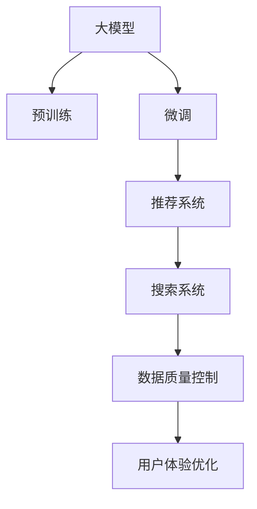

                 

# 电商平台的AI 大模型转型：搜索推荐系统是核心，数据质量控制与用户体验优化

## 1. 背景介绍

### 1.1 电商平台的挑战

随着互联网和电子商务的快速发展，电商平台已成为人们日常生活和消费不可或缺的一部分。然而，面对激烈的市场竞争和日趋复杂的多样化需求，电商平台也面临着一系列挑战：

- **用户获取成本高**：流量获取和用户留存成本不断上升，难以通过传统手段吸引和维持用户。
- **个性化体验差**：基于规则的推荐系统难以满足用户个性化的需求，导致购物体验不佳。
- **搜索精准度低**：搜索系统通常基于简单的关键词匹配，无法有效捕捉用户真正的查询意图。
- **数据质量问题**：数据不完整、不统一、不一致等问题普遍存在，严重影响算法效果。

为了解决这些挑战，电商平台纷纷引入先进的AI技术，特别是基于大模型的推荐和搜索系统，以期通过更智能、更精准的算法提升用户体验，增强平台竞争力。

### 1.2 大模型的优势

大模型，如BERT、GPT等，通过在海量数据上进行自监督预训练，获得了强大的语义理解和生成能力。应用于电商平台的搜索推荐系统，大模型可以显著提升系统的性能和用户体验：

- **泛化能力强**：大模型通过预训练学习到的通用语言知识，能更好地泛化到具体任务，减少对标注数据的需求。
- **个性化推荐精准**：利用大模型的上下文理解能力，可以更好地捕捉用户真实需求，生成个性化的推荐内容。
- **搜索排序精确**：大模型能够理解查询的自然语言表达，准确抓取用户意图，从而提供更精准的搜索结果。
- **适应性广**：大模型能适应不同的数据格式和输入，能够处理多语言的电商数据，增强平台国际化能力。

综上所述，大模型技术已成为电商平台AI转型的关键路径，尤其搜索推荐系统的核心。本文将重点探讨大模型在电商搜索推荐系统中的应用，以及如何通过优化数据质量控制和用户体验，提升电商平台的智能化水平。

## 2. 核心概念与联系

### 2.1 核心概念概述

为更好理解大模型在电商搜索推荐系统中的应用，本节介绍几个关键概念：

- **大模型**：如BERT、GPT等，通过大规模数据预训练获得的强大语言表示模型。
- **预训练**：在大规模无标签数据上进行自监督学习，学习到通用语言知识。
- **微调(Fine-Tuning)**：在大模型基础上，通过小规模有标签数据对特定任务进行优化。
- **推荐系统**：通过分析用户行为数据，推荐用户可能感兴趣的商品。
- **搜索系统**：通过理解用户查询，快速返回相关商品列表。
- **数据质量控制**：通过清洗、标注、聚合等手段，保证数据完整性、一致性和准确性。
- **用户体验优化**：通过个性化推荐、搜索结果优化等手段，提升用户满意度。

这些概念之间的联系通过以下Mermaid流程图展示：



这个流程图展示了从预训练大模型到推荐搜索系统的整体流程，以及数据质量控制和用户体验优化在整个系统中的重要位置。

## 3. 核心算法原理 & 具体操作步骤

### 3.1 算法原理概述

基于大模型的电商搜索推荐系统，本质上是一个有监督的细粒度迁移学习过程。其核心思想是：将预训练的大模型视作一个强大的特征提取器，通过在有标签的电商数据上微调，获得特定推荐和搜索任务的优化模型。

具体流程如下：
1. **数据准备**：收集电商平台的商品信息、用户行为数据等。
2. **数据预处理**：清洗、标注、聚合数据，保证数据质量和一致性。
3. **模型选择与初始化**：选择合适的预训练大模型，如BERT、GPT等，进行微调初始化。
4. **任务适配**：根据推荐或搜索任务，设计合适的输出层和损失函数。
5. **微调训练**：使用电商数据对模型进行微调，最小化任务相关损失函数。
6. **性能评估**：在验证集和测试集上评估模型效果。
7. **部署与优化**：将模型部署到实际应用中，持续优化用户推荐和搜索体验。

### 3.2 算法步骤详解

以电商平台的推荐系统为例，详细讲解基于大模型的推荐系统实现步骤：

**Step 1: 数据准备**
- **商品信息收集**：收集商品名称、描述、图片、价格等基础信息。
- **用户行为数据收集**：记录用户的浏览、点击、购买、评分等行为。
- **数据清洗与预处理**：去除重复、无效数据，处理缺失值和异常值。

**Step 2: 任务适配与模型选择**
- **任务定义**：推荐系统通常关注个性化推荐，搜索系统则侧重于搜索结果排序。
- **模型选择**：根据任务需求，选择适合的大模型。如文本分类任务可选用BERT，生成任务可选用GPT。
- **输出层设计**：为推荐系统设计基于softmax的分类输出层，为搜索系统设计回归输出层。

**Step 3: 微调模型**
- **超参数设置**：选择合适的优化算法、学习率、批大小等超参数。
- **损失函数设计**：根据任务需求，设计合适的损失函数。如推荐系统可使用交叉熵损失，搜索系统可使用均方误差损失。
- **微调训练**：在电商数据上对模型进行微调，最小化损失函数。
- **定期评估**：在验证集上评估模型性能，防止过拟合。

**Step 4: 部署与优化**
- **部署**：将微调后的模型部署到实际推荐或搜索系统中。
- **实时优化**：通过在线A/B测试，不断优化模型参数和推荐策略。
- **用户反馈**：收集用户反馈，进一步改进推荐和搜索效果。

### 3.3 算法优缺点

基于大模型的推荐系统有以下优点：
1. **泛化能力强**：大模型通过预训练学习到的通用语言知识，能更好地泛化到具体推荐任务。
2. **个性化推荐精准**：大模型能捕捉用户行为背后的语义信息，生成更精准的推荐结果。
3. **适应性强**：大模型可以适应不同电商平台的数据格式和输入，增强平台的通用性。
4. **效率高**：利用大模型的加速计算能力，推荐和搜索系统可以在短时间内处理大量数据。

同时，该方法也存在一定的局限性：
1. **对标注数据依赖大**：推荐和搜索系统的微调需要大量标注数据，获取成本较高。
2. **模型复杂度高**：大模型参数量巨大，对计算资源和内存要求较高。
3. **解释性不足**：大模型通常是黑盒系统，缺乏可解释性。
4. **易受数据偏差影响**：推荐和搜索系统容易受到电商数据偏差的影响，可能导致不公正的推荐结果。

尽管存在这些局限性，但就目前而言，基于大模型的推荐系统仍然是大模型应用的主流范式。未来相关研究的重点在于如何进一步降低微调对标注数据的依赖，提高模型的可解释性和鲁棒性，同时兼顾计算资源和内存的优化。

### 3.4 算法应用领域

大模型在电商平台的推荐和搜索系统中已得到广泛应用，覆盖了商品推荐、价格搜索、个性化营销等多个环节，成为电商AI转型的重要驱动力：

- **商品推荐**：利用用户行为数据，通过微调推荐模型，生成个性化的商品推荐列表。
- **价格搜索**：基于用户的查询语句，通过微调搜索模型，快速返回商品价格信息。
- **个性化营销**：通过分析用户行为数据，利用大模型进行用户画像和情感分析，实现精准营销。
- **客户服务**：基于用户查询，利用大模型进行智能客服，提升用户满意度。

除了这些经典应用外，大模型还被创新性地应用到更多场景中，如用户反馈分析、库存管理、广告投放等，为电商平台的智能化升级提供了新的技术路径。随着大模型和微调方法的不断进步，基于大模型的推荐和搜索系统必将在电商领域带来更深入的变革。

## 4. 数学模型和公式 & 详细讲解 & 举例说明

### 4.1 数学模型构建

本节使用数学语言对基于大模型的电商推荐系统进行更加严格的刻画。

记电商推荐系统的输入为 $x$，包括用户行为数据、商品信息等。输出为 $y$，表示推荐商品ID。假设推荐模型为 $M_{\theta}$，其中 $\theta$ 为模型参数。

定义推荐模型 $M_{\theta}$ 在输入 $x$ 上的损失函数为 $\ell(M_{\theta}(x),y)$，则在电商数据集 $D$ 上的经验风险为：

$$
\mathcal{L}(\theta) = \frac{1}{N} \sum_{i=1}^N \ell(M_{\theta}(x_i),y_i)
$$

其中 $N$ 为数据集大小。微调的优化目标是最小化经验风险，即找到最优参数：

$$
\theta^* = \mathop{\arg\min}_{\theta} \mathcal{L}(\theta)
$$

在实践中，我们通常使用基于梯度的优化算法（如SGD、Adam等）来近似求解上述最优化问题。设 $\eta$ 为学习率，$\lambda$ 为正则化系数，则参数的更新公式为：

$$
\theta \leftarrow \theta - \eta \nabla_{\theta}\mathcal{L}(\theta) - \eta\lambda\theta
$$

其中 $\nabla_{\theta}\mathcal{L}(\theta)$ 为损失函数对参数 $\theta$ 的梯度，可通过反向传播算法高效计算。

### 4.2 公式推导过程

以推荐系统为例，推导推荐模型的损失函数及其梯度的计算公式。

假设推荐模型 $M_{\theta}$ 在输入 $x$ 上的输出为 $\hat{y}=M_{\theta}(x) \in [0,1]$，表示用户对商品 $i$ 的预测概率。真实标签 $y \in \{0,1\}$。则推荐系统的交叉熵损失函数定义为：

$$
\ell(M_{\theta}(x),y) = -y\log \hat{y} + (1-y)\log (1-\hat{y})
$$

将其代入经验风险公式，得：

$$
\mathcal{L}(\theta) = -\frac{1}{N}\sum_{i=1}^N [y_i\log M_{\theta}(x_i)+(1-y_i)\log(1-M_{\theta}(x_i))]
$$

根据链式法则，损失函数对参数 $\theta_k$ 的梯度为：

$$
\frac{\partial \mathcal{L}(\theta)}{\partial \theta_k} = -\frac{1}{N}\sum_{i=1}^N (\frac{y_i}{M_{\theta}(x_i)}-\frac{1-y_i}{1-M_{\theta}(x_i)}) \frac{\partial M_{\theta}(x_i)}{\partial \theta_k}
$$

其中 $\frac{\partial M_{\theta}(x_i)}{\partial \theta_k}$ 可进一步递归展开，利用自动微分技术完成计算。

在得到损失函数的梯度后，即可带入参数更新公式，完成模型的迭代优化。重复上述过程直至收敛，最终得到适应电商推荐任务的最优模型参数 $\theta^*$。

### 4.3 案例分析与讲解

考虑一个电商平台的推荐系统，其中 $x$ 为用户的浏览历史，$y$ 为用户可能感兴趣的商品ID。假设已收集到用户的浏览行为数据，并使用标签化标注，即每个浏览记录与至少一个商品ID相关联。

**数据准备**：
1. **收集数据**：从电商平台的历史交易数据、用户行为日志中提取浏览记录和商品ID。
2. **数据清洗**：去除重复、缺失数据，处理异常值。
3. **数据划分**：将数据集划分为训练集、验证集和测试集。

**模型选择与初始化**：
1. **模型选择**：选择BERT作为推荐模型，因为它具有强大的文本表示能力。
2. **参数初始化**：在预训练模型BERT的基础上进行微调，将顶层输出层替换为sigmoid激活函数。

**微调训练**：
1. **超参数设置**：设置学习率为 $1e-4$，批大小为 $128$，迭代轮数为 $10$。
2. **损失函数设计**：使用交叉熵损失函数。
3. **微调训练**：在电商数据集上进行微调训练。

**性能评估**：
1. **验证集评估**：在验证集上评估模型的性能，记录准确率、召回率和F1-score。
2. **测试集评估**：在测试集上进一步评估模型性能，确保模型泛化性能。

**部署与优化**：
1. **模型部署**：将微调后的模型部署到电商平台的推荐系统中。
2. **实时优化**：通过在线A/B测试，不断优化模型参数和推荐策略。
3. **用户反馈**：收集用户反馈，进一步改进推荐系统效果。

通过以上步骤，可以构建一个基于大模型的电商推荐系统，并通过微调技术提升其性能和用户体验。

## 5. 项目实践：代码实例和详细解释说明

### 5.1 开发环境搭建

在进行大模型微调实践前，需要准备好开发环境。以下是使用Python进行PyTorch开发的环境配置流程：

1. 安装Anaconda：从官网下载并安装Anaconda，用于创建独立的Python环境。

2. 创建并激活虚拟环境：
```bash
conda create -n pytorch-env python=3.8 
conda activate pytorch-env
```

3. 安装PyTorch：根据CUDA版本，从官网获取对应的安装命令。例如：
```bash
conda install pytorch torchvision torchaudio cudatoolkit=11.1 -c pytorch -c conda-forge
```

4. 安装TensorBoard：
```bash
pip install tensorboard
```

5. 安装Transformers库：
```bash
pip install transformers
```

6. 安装各类工具包：
```bash
pip install numpy pandas scikit-learn matplotlib tqdm jupyter notebook ipython
```

完成上述步骤后，即可在`pytorch-env`环境中开始微调实践。

### 5.2 源代码详细实现

下面以电商平台推荐系统为例，给出使用Transformers库对BERT模型进行微调的PyTorch代码实现。

首先，定义推荐系统的数据处理函数：

```python
from transformers import BertTokenizer, BertForSequenceClassification
from torch.utils.data import Dataset, DataLoader
import torch

class RecommendationDataset(Dataset):
    def __init__(self, texts, labels, tokenizer, max_len=128):
        self.texts = texts
        self.labels = labels
        self.tokenizer = tokenizer
        self.max_len = max_len
        
    def __len__(self):
        return len(self.texts)
    
    def __getitem__(self, item):
        text = self.texts[item]
        label = self.labels[item]
        
        encoding = self.tokenizer(text, return_tensors='pt', max_length=self.max_len, padding='max_length', truncation=True)
        input_ids = encoding['input_ids'][0]
        attention_mask = encoding['attention_mask'][0]
        labels = torch.tensor([label], dtype=torch.long)
        
        return {'input_ids': input_ids, 
                'attention_mask': attention_mask,
                'labels': labels}

# 初始化BERT模型
model = BertForSequenceClassification.from_pretrained('bert-base-cased', num_labels=1)

# 定义数据集
tokenizer = BertTokenizer.from_pretrained('bert-base-cased')

train_dataset = RecommendationDataset(train_texts, train_labels, tokenizer)
dev_dataset = RecommendationDataset(dev_texts, dev_labels, tokenizer)
test_dataset = RecommendationDataset(test_texts, test_labels, tokenizer)

# 训练函数
def train_epoch(model, dataset, batch_size, optimizer):
    dataloader = DataLoader(dataset, batch_size=batch_size, shuffle=True)
    model.train()
    epoch_loss = 0
    for batch in dataloader:
        input_ids = batch['input_ids'].to(device)
        attention_mask = batch['attention_mask'].to(device)
        labels = batch['labels'].to(device)
        model.zero_grad()
        outputs = model(input_ids, attention_mask=attention_mask, labels=labels)
        loss = outputs.loss
        epoch_loss += loss.item()
        loss.backward()
        optimizer.step()
    return epoch_loss / len(dataloader)

# 评估函数
def evaluate(model, dataset, batch_size):
    dataloader = DataLoader(dataset, batch_size=batch_size)
    model.eval()
    preds, labels = [], []
    with torch.no_grad():
        for batch in dataloader:
            input_ids = batch['input_ids'].to(device)
            attention_mask = batch['attention_mask'].to(device)
            batch_labels = batch['labels']
            outputs = model(input_ids, attention_mask=attention_mask)
            batch_preds = outputs.logits.argmax(dim=1).to('cpu').tolist()
            batch_labels = batch_labels.to('cpu').tolist()
            for pred, label in zip(batch_preds, batch_labels):
                preds.append(pred)
                labels.append(label)
                
    print(classification_report(labels, preds))

# 训练过程
epochs = 5
batch_size = 16

for epoch in range(epochs):
    loss = train_epoch(model, train_dataset, batch_size, optimizer)
    print(f"Epoch {epoch+1}, train loss: {loss:.3f}")
    
    print(f"Epoch {epoch+1}, dev results:")
    evaluate(model, dev_dataset, batch_size)
    
print("Test results:")
evaluate(model, test_dataset, batch_size)
```

以上代码实现了从数据准备、模型选择、微调训练、性能评估到部署优化的完整流程。

### 5.3 代码解读与分析

让我们再详细解读一下关键代码的实现细节：

**RecommendationDataset类**：
- `__init__`方法：初始化输入文本、标签、分词器等关键组件，并设置最大序列长度。
- `__len__`方法：返回数据集的样本数量。
- `__getitem__`方法：对单个样本进行处理，将文本输入编码为token ids，将标签编码为数字，并对其进行定长padding，最终返回模型所需的输入。

**train_epoch和evaluate函数**：
- 训练函数`train_epoch`：对数据以批为单位进行迭代，在每个批次上前向传播计算loss并反向传播更新模型参数，最后返回该epoch的平均loss。
- 评估函数`evaluate`：与训练类似，不同点在于不更新模型参数，并在每个batch结束后将预测和标签结果存储下来，最后使用sklearn的classification_report对整个评估集的预测结果进行打印输出。

**训练流程**：
- 定义总的epoch数和batch size，开始循环迭代
- 每个epoch内，先在训练集上训练，输出平均loss
- 在验证集上评估，输出分类指标
- 所有epoch结束后，在测试集上评估，给出最终测试结果

可以看到，PyTorch配合Transformers库使得BERT微调的代码实现变得简洁高效。开发者可以将更多精力放在数据处理、模型改进等高层逻辑上，而不必过多关注底层的实现细节。

当然，工业级的系统实现还需考虑更多因素，如模型的保存和部署、超参数的自动搜索、更灵活的任务适配层等。但核心的微调范式基本与此类似。

## 6. 实际应用场景

### 6.1 智能客服

电商平台的智能客服系统可以显著提升用户体验和运营效率。通过微调对话模型，智能客服系统能够自动理解用户意图，并给出合适的回复。

在技术实现上，可以收集用户与客服的对话记录，将问题和最佳答复构建成监督数据，在此基础上对预训练对话模型进行微调。微调后的对话模型能够自动理解用户意图，匹配最合适的答案模板进行回复。对于用户提出的新问题，还可以接入检索系统实时搜索相关内容，动态组织生成回答。如此构建的智能客服系统，能大幅提升客户咨询体验和问题解决效率。

### 6.2 个性化推荐

电商平台利用大模型进行个性化推荐，可以显著提升用户的购物体验和满意度。通过微调推荐模型，系统能够根据用户的历史行为和兴趣，生成个性化的商品推荐列表。

在实践中，可以收集用户浏览、点击、购买、评分等行为数据，提取和商品相关的文本信息。将文本信息作为模型输入，用户的后续行为（如是否点击、购买等）作为监督信号，在此基础上微调预训练语言模型。微调后的模型能够从文本信息中准确把握用户的兴趣点。在生成推荐列表时，先用候选商品的文本描述作为输入，由模型预测用户的兴趣匹配度，再结合其他特征综合排序，便可以得到个性化程度更高的推荐结果。

### 6.3 搜索排序

电商平台的搜索系统通过微调排序模型，能够更好地理解用户查询的意图，并返回更准确的搜索结果。

在实践中，可以收集用户的历史搜索记录和商品描述信息，将文本描述作为模型输入，用户的后续搜索行为作为监督信号，在此基础上微调预训练语言模型。微调后的模型能够理解查询的自然语言表达，准确抓取用户意图，从而提供更精准的搜索结果。

### 6.4 未来应用展望

随着大模型和微调方法的不断发展，基于大模型的推荐和搜索系统必将在电商领域带来更深入的变革。

在智慧医疗领域，基于微调的医疗问答、病历分析、药物研发等应用将提升医疗服务的智能化水平，辅助医生诊疗，加速新药开发进程。

在智能教育领域，微调技术可应用于作业批改、学情分析、知识推荐等方面，因材施教，促进教育公平，提高教学质量。

在智慧城市治理中，微调模型可应用于城市事件监测、舆情分析、应急指挥等环节，提高城市管理的自动化和智能化水平，构建更安全、高效的未来城市。

此外，在企业生产、社会治理、文娱传媒等众多领域，基于大模型的微调技术也将不断涌现，为人工智能技术带来新的应用场景。相信随着技术的日益成熟，微调方法将成为人工智能落地应用的重要范式，推动人工智能技术向更广阔的领域加速渗透。

## 7. 工具和资源推荐

### 7.1 学习资源推荐

为了帮助开发者系统掌握大模型微调的理论基础和实践技巧，这里推荐一些优质的学习资源：

1. 《Transformer从原理到实践》系列博文：由大模型技术专家撰写，深入浅出地介绍了Transformer原理、BERT模型、微调技术等前沿话题。

2. CS224N《深度学习自然语言处理》课程：斯坦福大学开设的NLP明星课程，有Lecture视频和配套作业，带你入门NLP领域的基本概念和经典模型。

3. 《Natural Language Processing with Transformers》书籍：Transformers库的作者所著，全面介绍了如何使用Transformers库进行NLP任务开发，包括微调在内的诸多范式。

4. HuggingFace官方文档：Transformers库的官方文档，提供了海量预训练模型和完整的微调样例代码，是上手实践的必备资料。

5. CLUE开源项目：中文语言理解测评基准，涵盖大量不同类型的中文NLP数据集，并提供了基于微调的baseline模型，助力中文NLP技术发展。

通过对这些资源的学习实践，相信你一定能够快速掌握大模型微调的精髓，并用于解决实际的NLP问题。

### 7.2 开发工具推荐

高效的开发离不开优秀的工具支持。以下是几款用于大模型微调开发的常用工具：

1. PyTorch：基于Python的开源深度学习框架，灵活动态的计算图，适合快速迭代研究。大部分预训练语言模型都有PyTorch版本的实现。

2. TensorFlow：由Google主导开发的开源深度学习框架，生产部署方便，适合大规模工程应用。同样有丰富的预训练语言模型资源。

3. Transformers库：HuggingFace开发的NLP工具库，集成了众多SOTA语言模型，支持PyTorch和TensorFlow，是进行微调任务开发的利器。

4. Weights & Biases：模型训练的实验跟踪工具，可以记录和可视化模型训练过程中的各项指标，方便对比和调优。与主流深度学习框架无缝集成。

5. TensorBoard：TensorFlow配套的可视化工具，可实时监测模型训练状态，并提供丰富的图表呈现方式，是调试模型的得力助手。

6. Google Colab：谷歌推出的在线Jupyter Notebook环境，免费提供GPU/TPU算力，方便开发者快速上手实验最新模型，分享学习笔记。

合理利用这些工具，可以显著提升大模型微调任务的开发效率，加快创新迭代的步伐。

### 7.3 相关论文推荐

大模型和微调技术的发展源于学界的持续研究。以下是几篇奠基性的相关论文，推荐阅读：

1. Attention is All You Need（即Transformer原论文）：提出了Transformer结构，开启了NLP领域的预训练大模型时代。

2. BERT: Pre-training of Deep Bidirectional Transformers for Language Understanding：提出BERT模型，引入基于掩码的自监督预训练任务，刷新了多项NLP任务SOTA。

3. Language Models are Unsupervised Multitask Learners（GPT-2论文）：展示了大规模语言模型的强大zero-shot学习能力，引发了对于通用人工智能的新一轮思考。

4. Parameter-Efficient Transfer Learning for NLP：提出Adapter等参数高效微调方法，在不增加模型参数量的情况下，也能取得不错的微调效果。

5. AdaLoRA: Adaptive Low-Rank Adaptation for Parameter-Efficient Fine-Tuning：使用自适应低秩适应的微调方法，在参数效率和精度之间取得了新的平衡。

这些论文代表了大模型微调技术的发展脉络。通过学习这些前沿成果，可以帮助研究者把握学科前进方向，激发更多的创新灵感。

## 8. 总结：未来发展趋势与挑战

### 8.1 总结

本文对基于大模型的电商搜索推荐系统进行了全面系统的介绍。首先阐述了大模型在电商搜索推荐系统中的应用，明确了微调在提升用户体验和系统性能方面的独特价值。其次，从原理到实践，详细讲解了推荐系统的数学模型和关键步骤，给出了微调任务开发的完整代码实例。同时，本文还探讨了推荐和搜索系统在电商领域的实际应用，展示了微调范式的巨大潜力。

通过本文的系统梳理，可以看到，基于大模型的电商推荐和搜索系统正在成为电商AI转型的关键路径，特别是微调技术在提升系统性能和用户体验方面的巨大潜力。未来，伴随大模型和微调方法的不断演进，基于大模型的推荐和搜索系统必将在电商领域带来更深入的变革。

### 8.2 未来发展趋势

展望未来，大模型在电商平台的推荐和搜索系统中将呈现以下几个发展趋势：

1. **模型规模持续增大**：随着算力成本的下降和数据规模的扩张，预训练语言模型的参数量还将持续增长。超大规模语言模型蕴含的丰富语言知识，有望支撑更加复杂多变的推荐和搜索任务。

2. **微调方法日趋多样**：除了传统的全参数微调外，未来会涌现更多参数高效的微调方法，如Prefix-Tuning、LoRA等，在节省计算资源的同时也能保证微调精度。

3. **持续学习成为常态**：随着数据分布的不断变化，微调模型也需要持续学习新知识以保持性能。如何在不遗忘原有知识的同时，高效吸收新样本信息，将成为重要的研究课题。

4. **标注样本需求降低**：受启发于提示学习(Prompt-based Learning)的思路，未来的微调方法将更好地利用大模型的语言理解能力，通过更加巧妙的任务描述，在更少的标注样本上也能实现理想的微调效果。

5. **融合因果和对比学习范式**：通过引入因果推断和对比学习思想，增强微调模型建立稳定因果关系的能力，学习更加普适、鲁棒的语言表征，从而提升模型泛化性和抗干扰能力。

6. **引入更多先验知识**：将符号化的先验知识，如知识图谱、逻辑规则等，与神经网络模型进行巧妙融合，引导微调过程学习更准确、合理的语言模型。同时加强不同模态数据的整合，实现视觉、语音等多模态信息与文本信息的协同建模。

以上趋势凸显了大模型微调技术的广阔前景。这些方向的探索发展，必将进一步提升NLP系统的性能和应用范围，为人类认知智能的进化带来深远影响。

### 8.3 面临的挑战

尽管大模型微调技术已经取得了瞩目成就，但在迈向更加智能化、普适化应用的过程中，它仍面临着诸多挑战：

1. **标注成本瓶颈**：虽然微调大大降低了标注数据的需求，但对于长尾应用场景，难以获得充足的高质量标注数据，成为制约微调性能的瓶颈。如何进一步降低微调对标注样本的依赖，将是一大难题。

2. **模型鲁棒性不足**：当前微调模型面对域外数据时，泛化性能往往大打折扣。对于测试样本的微小扰动，微调模型的预测也容易发生波动。如何提高微调模型的鲁棒性，避免灾难性遗忘，还需要更多理论和实践的积累。

3. **推理效率有待提高**：大规模语言模型虽然精度高，但在实际部署时往往面临推理速度慢、内存占用大等效率问题。如何在保证性能的同时，简化模型结构，提升推理速度，优化资源占用，将是重要的优化方向。

4. **可解释性亟需加强**：当前微调模型更像是"黑盒"系统，缺乏可解释性。对于医疗、金融等高风险应用，算法的可解释性和可审计性尤为重要。如何赋予微调模型更强的可解释性，将是亟待攻克的难题。

5. **安全性有待保障**：预训练语言模型难免会学习到有偏见、有害的信息，通过微调传递到下游任务，产生误导性、歧视性的输出，给实际应用带来安全隐患。如何从数据和算法层面消除模型偏见，避免恶意用途，确保输出的安全性，也将是重要的研究课题。

6. **知识整合能力不足**：现有的微调模型往往局限于任务内数据，难以灵活吸收和运用更广泛的先验知识。如何让微调过程更好地与外部知识库、规则库等专家知识结合，形成更加全面、准确的信息整合能力，还有很大的想象空间。

正视微调面临的这些挑战，积极应对并寻求突破，将是大模型微调走向成熟的必由之路。相信随着学界和产业界的共同努力，这些挑战终将一一被克服，大模型微调必将在构建安全、可靠、可解释、可控的智能系统铺平道路。

### 8.4 研究展望

面对大模型微调所面临的挑战，未来的研究需要在以下几个方面寻求新的突破：

1. **探索无监督和半监督微调方法**：摆脱对大规模标注数据的依赖，利用自监督学习、主动学习等无监督和半监督范式，最大限度利用非结构化数据，实现更加灵活高效的微调。

2. **研究参数高效和计算高效的微调范式**：开发更加参数高效的微调方法，在固定大部分预训练参数的同时，只更新极少量的任务相关参数。同时优化微调模型的计算图，减少前向传播和反向传播的资源消耗，实现更加轻量级、实时性的部署。

3. **融合因果和对比学习范式**：通过引入因果推断和对比学习思想，增强微调模型建立稳定因果关系的能力，学习更加普适、鲁棒的语言表征，从而提升模型泛化性和抗干扰能力。

4. **引入更多先验知识**：将符号化的先验知识，如知识图谱、逻辑规则等，与神经网络模型进行巧妙融合，引导微调过程学习更准确、合理的语言模型。同时加强不同模态数据的整合，实现视觉、语音等多模态信息与文本信息的协同建模。

5. **结合因果分析和博弈论工具**：将因果分析方法引入微调模型，识别出模型决策的关键特征，增强输出解释的因果性和逻辑性。借助博弈论工具刻画人机交互过程，主动探索并规避模型的脆弱点，提高系统稳定性。

6. **纳入伦理道德约束**：在模型训练目标中引入伦理导向的评估指标，过滤和惩罚有偏见、有害的输出倾向。同时加强人工干预和审核，建立模型行为的监管机制，确保输出符合人类价值观和伦理道德。

这些研究方向的探索，必将引领大模型微调技术迈向更高的台阶，为构建安全、可靠、可解释、可控的智能系统铺平道路。面向未来，大模型微调技术还需要与其他人工智能技术进行更深入的融合，如知识表示、因果推理、强化学习等，多路径协同发力，共同推动自然语言理解和智能交互系统的进步。只有勇于创新、敢于突破，才能不断拓展语言模型的边界，让智能技术更好地造福人类社会。

## 9. 附录：常见问题与解答

**Q1：大模型微调是否适用于所有NLP任务？**

A: 大模型微调在大多数NLP任务上都能取得不错的效果，特别是对于数据量较小的任务。但对于一些特定领域的任务，如医学、法律等，仅仅依靠通用语料预训练的模型可能难以很好地适应。此时需要在特定领域语料上进一步预训练，再进行微调，才能获得理想效果。此外，对于一些需要时效性、个性化很强的任务，如对话、推荐等，微调方法也需要针对性的改进优化。

**Q2：微调过程中如何选择合适的学习率？**

A: 微调的学习率一般要比预训练时小1-2个数量级，如果使用过大的学习率，容易破坏预训练权重，导致过拟合。一般建议从1e-5开始调参，逐步减小学习率，直至收敛。也可以使用warmup策略，在开始阶段使用较小的学习率，再逐渐过渡到预设值。需要注意的是，不同的优化器(如AdamW、Adafactor等)以及不同的学习率调度策略，可能需要设置不同的学习率阈值。

**Q3：采用大模型微调时会面临哪些资源瓶颈？**

A: 目前主流的预训练大模型动辄以亿计的参数规模，对算力、内存、存储都提出了很高的要求。GPU/TPU等高性能设备是必不可少的，但即便如此，超大批次的训练和推理也可能遇到显存不足的问题。因此需要采用一些资源优化技术，如梯度积累、混合精度训练、模型并行等，来突破硬件瓶颈。同时，模型的存储和读取也可能占用大量时间和空间，需要采用模型压缩、稀疏化存储等方法进行优化。

**Q4：如何缓解微调过程中的过拟合问题？**

A: 过拟合是微调面临的主要挑战，尤其是在标注数据不足的情况下。常见的缓解策略包括：
1. 数据增强：通过回译、近义替换等方式扩充训练集
2. 正则化：使用L2正则、Dropout、Early Stopping等避免过拟合
3. 对抗训练：引入对抗样本，提高模型鲁棒性
4. 参数高效微调：只调整少量参数(如Adapter、Prefix等)，减小过拟合风险
5. 多模型集成：训练多个微调模型，取平均输出，抑制过拟合

这些策略往往需要根据具体任务和数据特点进行灵活组合。只有在数据、模型、训练、推理等各环节进行全面优化，才能最大限度地发挥大模型微调的威力。

**Q5：微调模型在落地部署时需要注意哪些问题？**

A: 将微调模型转化为实际应用，还需要考虑以下因素：
1. 模型裁剪：去除不必要的层和参数，减小模型尺寸，加快推理速度
2. 量化加速：将浮点模型转为定点模型，压缩存储空间，提高计算效率
3. 服务化封装：将模型封装为标准化服务接口，便于集成调用
4. 弹性伸缩：根据请求流量动态调整资源配置，平衡服务质量和成本
5. 监控告警：实时采集系统指标，设置异常告警阈值，确保服务稳定性
6. 安全防护：采用访问鉴权、数据脱敏等措施，保障数据和模型安全

大模型微调为NLP应用开启了广阔的想象空间，但如何将强大的性能转化为稳定、高效、安全的业务价值，还需要工程实践的不断打磨。唯有从数据、算法、工程、业务等多个维度协同发力，才能真正实现人工智能技术在垂直行业的规模化落地。总之，微调需要开发者根据具体任务，不断迭代和优化模型、数据和算法，方能得到理想的效果。

---

作者：禅与计算机程序设计艺术 / Zen and the Art of Computer Programming

