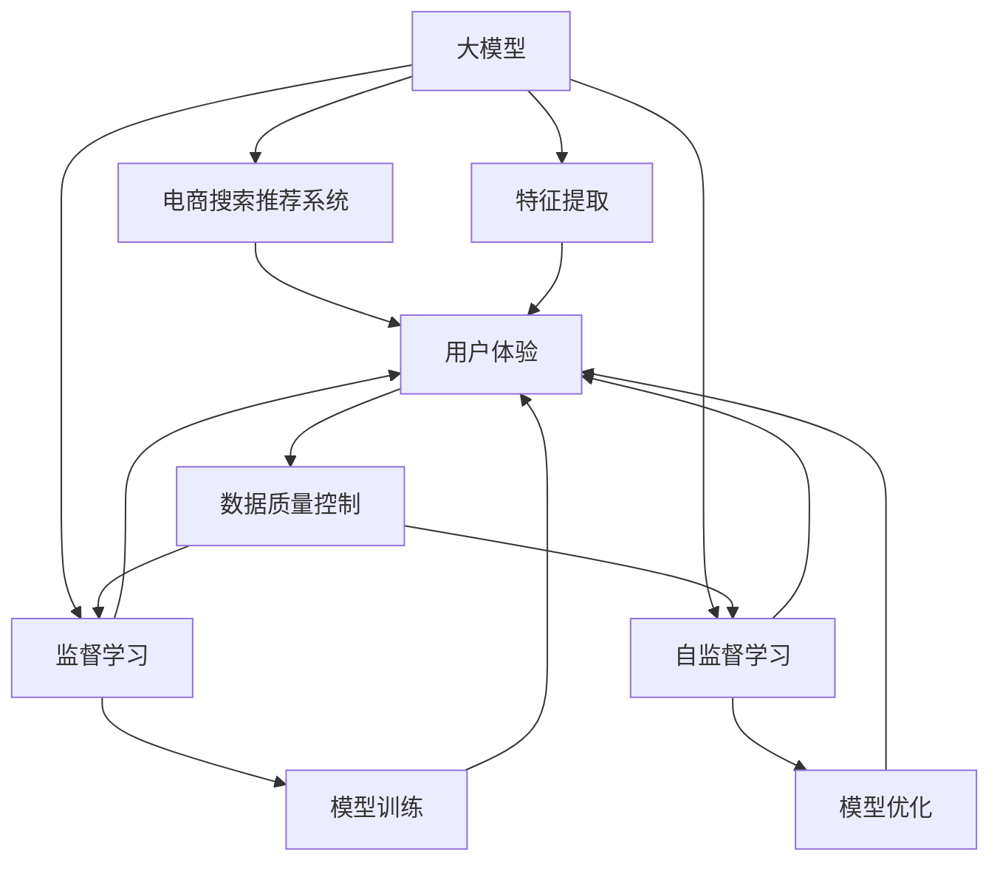

                 

# 电商平台的AI 大模型转型：搜索推荐系统是核心，数据质量控制与用户体验优化

> 关键词：人工智能,大模型,电商,搜索推荐,用户体验,数据质量

## 1. 背景介绍

### 1.1 问题由来
在现代电商平台的竞争中，用户体验已成为决定成败的关键因素之一。用户希望通过简洁、高效、个性化的方式快速找到所需商品。为了满足这一需求，各大电商平台纷纷将人工智能(AI)技术引入业务系统，采用大模型技术进行搜索推荐系统的优化。

### 1.2 问题核心关键点
搜索推荐系统是大模型技术在电商领域的主要应用场景。其核心目标是提升用户搜索和推荐过程中的体验，从而提高平台的用户留存率和转化率。通过应用大模型，可以显著提升系统的召回率和相关性，减少误判和冗余信息，提高整体用户体验。

### 1.3 问题研究意义
研究大模型在电商搜索推荐系统中的应用，对于提升电商平台的用户体验、增加平台粘性、提升销售转化具有重要意义：

1. 增强用户粘性：通过个性化的推荐，让用户反复访问平台，提升用户满意度和忠诚度。
2. 提升转化率：个性化搜索和推荐可以提高用户点击率、购买率，直接增加平台收益。
3. 数据驱动决策：通过分析用户行为数据，优化库存和商品定价，提升运营效率。
4. 加速产品迭代：借助AI技术，快速分析用户需求，快速调整产品策略，加速创新速度。

## 2. 核心概念与联系

### 2.1 核心概念概述

为更好地理解大模型在电商搜索推荐系统中的应用，本节将介绍几个密切相关的核心概念：

- 大模型(Large Model)：指采用大规模数据训练得到的深度学习模型，如GPT、BERT等。其通过自监督和监督学习，具备强大的特征提取和生成能力。
- 电商搜索推荐系统(E-commerce Search Recommendation System)：电商平台的搜索和推荐系统，旨在通过个性化服务，提升用户搜索和推荐的准确性和体验。
- 用户体验(User Experience, UX)：用户在使用产品或服务时的整体感受，包括界面的直观性、操作的便捷性、内容的丰富性和相关性等。
- 数据质量控制(Data Quality Control)：通过数据清洗、标注、处理等手段，确保数据符合使用标准和要求，提升数据分析和模型的训练效果。

这些核心概念之间的逻辑关系可以通过以下Mermaid流程图来展示：



这个流程图展示了大模型、电商搜索推荐系统、用户体验、数据质量控制等核心概念之间的联系：

1. 大模型通过自监督和监督学习获得通用和任务特定的表示能力，用于电商搜索推荐系统的特征提取和生成。
2. 电商搜索推荐系统通过大模型生成的特征进行个性化搜索和推荐，提升用户体验。
3. 用户体验的优化需依赖数据质量控制，保证数据的多样性和代表性，从而提升推荐和搜索的准确性。
4. 数据质量控制需使用监督学习和自监督学习技术，对数据进行清洗和处理，确保数据的可靠性和完整性。

这些概念共同构成了电商搜索推荐系统的核心框架，使得大模型能够在大规模数据下高效地提取特征，优化推荐和搜索过程，最终提升用户体验。

## 3. 核心算法原理 & 具体操作步骤
### 3.1 算法原理概述

基于大模型的电商搜索推荐系统，其核心思想是利用大模型的强大特征提取能力，在用户搜索和推荐的过程中进行个性化的处理和优化。大模型通过自监督和监督学习，能够学习到通用的语言特征，同时通过微调获得任务特定的知识。具体而言：

1. 自监督学习：在大规模无标签数据上训练大模型，学习语言的通用表示。
2. 监督学习：在电商搜索推荐任务的标注数据上微调大模型，学习用户行为和商品属性的特征表示。
3. 特征提取：将用户输入的查询和商品信息映射为大模型可以理解的向量表示，作为输入到推荐模型的特征。
4. 推荐模型：使用大模型的输出特征，结合任务相关的算法（如排序算法、协同过滤算法等），进行商品推荐。
5. 搜索模型：使用大模型的输出特征，结合文本匹配算法，进行个性化搜索结果的排序和展示。

### 3.2 算法步骤详解

基于大模型的电商搜索推荐系统的一般步骤包括：

**Step 1: 数据准备**
- 收集电商平台的交易数据、用户行为数据、商品属性数据等，构成标注数据集 $D=\{(x_i, y_i)\}_{i=1}^N$。
- 对数据进行清洗、去重、归一化等预处理操作，提升数据质量。

**Step 2: 大模型预训练**
- 在大规模无标签电商数据上，通过自监督学习任务训练通用大模型 $M_{\theta}$。例如，可以使用预训练语言模型BERT、GPT等。
- 定义自监督学习任务，如掩码语言模型、Next Sentence Prediction等，以利用无标签数据。

**Step 3: 大模型微调**
- 使用电商搜索推荐任务的标注数据集 $D$，对预训练模型 $M_{\theta}$ 进行微调，更新模型参数 $\hat{\theta}$。通常使用监督学习损失函数（如交叉熵损失、均方误差损失等）。
- 在微调过程中，可以使用参数高效微调(PEFT)技术，只更新少量的模型参数，以提高微调效率。

**Step 4: 特征提取和模型训练**
- 将用户查询和商品信息作为输入，使用微调后的大模型提取特征向量 $f_q$ 和 $f_i$。
- 在提取的特征上，结合推荐算法和排序算法，训练推荐模型 $M_{\hat{\theta}}$。

**Step 5: 实时推荐和搜索**
- 在用户进行搜索时，将输入查询通过大模型提取特征，结合推荐模型输出推荐结果。
- 在用户选择商品时，将商品信息通过大模型提取特征，结合搜索模型输出搜索结果。

### 3.3 算法优缺点

基于大模型的电商搜索推荐系统具有以下优点：
1. 自动化特征提取：大模型可以自动提取特征，减少人工标注的投入和时间。
2. 高效个性化：通过微调获得任务特定的知识，可以灵活处理各种个性化需求。
3. 数据利用充分：大模型的自监督学习能力可以充分利用无标签数据，提高模型泛化能力。
4. 应用场景广泛：适用于多种电商应用场景，如推荐系统、搜索系统、广告投放等。
5. 模型效果优良：大模型在特征提取和生成方面的优势，使其推荐效果显著优于传统方法。

同时，该方法也存在一些局限性：
1. 数据需求量大：大模型通常需要大量的训练数据，对计算资源和时间消耗较大。
2. 模型复杂度高：大模型参数量较大，对计算资源和存储需求较高。
3. 离线优化困难：大模型的微调过程涉及大量参数更新，难以进行在线优化。
4. 模型鲁棒性不足：大模型可能存在过拟合风险，导致推荐结果不稳定。
5. 应用成本高：大模型通常需要定制化训练和部署，成本较高。

尽管存在这些局限性，基于大模型的电商搜索推荐系统仍然具有显著的优势，为电商平台的业务优化提供了强大的技术支持。

### 3.4 算法应用领域

基于大模型的电商搜索推荐系统，已在多个电商场景中得到了广泛的应用，具体包括：

- 商品推荐：根据用户浏览历史、购买记录、搜索行为等数据，智能推荐相关商品。
- 个性化搜索：针对用户的查询意图，进行精准匹配，提升搜索的准确性和相关性。
- 广告投放：通过分析用户行为数据，进行精准广告投放，提高广告点击率和转化率。
- 智能客服：使用大模型构建智能客服系统，通过对话理解，快速响应用户需求，提供个性化服务。
- 库存管理：通过分析用户行为数据，预测商品需求，优化库存管理，减少缺货或库存积压。
- 价格优化：分析用户对价格的敏感度，调整商品定价，提升销售收益。

这些应用场景展示了大模型在电商领域的广泛应用潜力，为平台带来了显著的业务价值。

## 4. 数学模型和公式 & 详细讲解 & 举例说明
### 4.1 数学模型构建

本节将使用数学语言对基于大模型的电商搜索推荐系统的数学模型进行详细描述。

假设电商搜索推荐系统中的查询和商品信息为 $q$ 和 $i$，使用大模型提取的特征向量为 $f_q$ 和 $f_i$。推荐模型为 $M_{\hat{\theta}}$，其输出为推荐评分 $r_{qi}$。

在训练阶段，目标是最小化预测评分与真实评分之间的差距，即：

$$
\mathcal{L}(\hat{\theta}) = \frac{1}{N} \sum_{i=1}^N \ell(r_{qi}, y_i)
$$

其中 $\ell$ 为损失函数，$y_i$ 为真实评分。常用的损失函数包括均方误差损失（MSE）和交叉熵损失（CE）。

在测试阶段，对于新查询 $q$，推荐模型输出评分 $r_{qi}$，通过排序算法选择评分最高的商品进行推荐。

### 4.2 公式推导过程

以均方误差损失为例，推导推荐模型的训练过程。

假设推荐模型的输出为 $r_{qi}$，真实评分 $y_i$，则均方误差损失函数为：

$$
\mathcal{L}(\hat{\theta}) = \frac{1}{N} \sum_{i=1}^N (r_{qi} - y_i)^2
$$

通过梯度下降等优化算法，微调后的推荐模型参数 $\hat{\theta}$ 需满足：

$$
\hat{\theta} = \mathop{\arg\min}_{\theta} \mathcal{L}(\theta)
$$

使用链式法则计算损失函数对参数 $\theta_k$ 的梯度，得：

$$
\frac{\partial \mathcal{L}(\theta)}{\partial \theta_k} = -\frac{2}{N} \sum_{i=1}^N (r_{qi} - y_i) \frac{\partial r_{qi}}{\partial \theta_k}
$$

其中 $\frac{\partial r_{qi}}{\partial \theta_k}$ 可进一步递归展开，利用自动微分技术完成计算。

在得到损失函数的梯度后，即可带入参数更新公式，完成模型的迭代优化。重复上述过程直至收敛，最终得到适应电商搜索推荐任务的最优模型参数 $\hat{\theta}$。

### 4.3 案例分析与讲解

以电商平台商品推荐为例，推导推荐模型的训练过程。

假设电商平台推荐系统使用大模型BERT，通过电商数据进行预训练和微调。使用用户查询和商品ID作为输入，通过BERT模型提取特征 $f_q$ 和 $f_i$。使用用户评分作为监督信号，训练推荐模型 $M_{\hat{\theta}}$。

具体步骤如下：

1. 预训练BERT模型：在大规模电商数据上，使用掩码语言模型和Next Sentence Prediction等自监督任务训练BERT模型，得到预训练参数 $\theta$。
2. 微调BERT模型：在电商推荐任务的标注数据集上，使用交叉熵损失函数微调BERT模型，得到微调参数 $\hat{\theta}$。
3. 特征提取：将用户查询 $q$ 和商品ID $i$ 输入微调后的BERT模型，提取特征向量 $f_q$ 和 $f_i$。
4. 训练推荐模型：使用微调后的BERT模型提取的特征 $f_q$ 和 $f_i$，结合用户评分数据，训练推荐模型 $M_{\hat{\theta}}$。
5. 实时推荐：在用户进行查询时，将查询 $q$ 输入BERT模型提取特征 $f_q$，通过推荐模型输出推荐评分 $r_{qi}$，选择评分最高的商品进行推荐。

## 5. 项目实践：代码实例和详细解释说明
### 5.1 开发环境搭建

在进行电商搜索推荐系统的开发前，需要准备好开发环境。以下是使用Python进行PyTorch开发的环境配置流程：

1. 安装Anaconda：从官网下载并安装Anaconda，用于创建独立的Python环境。

2. 创建并激活虚拟环境：
```bash
conda create -n pytorch-env python=3.8 
conda activate pytorch-env
```

3. 安装PyTorch：根据CUDA版本，从官网获取对应的安装命令。例如：
```bash
conda install pytorch torchvision torchaudio cudatoolkit=11.1 -c pytorch -c conda-forge
```

4. 安装Transformers库：
```bash
pip install transformers
```

5. 安装各类工具包：
```bash
pip install numpy pandas scikit-learn matplotlib tqdm jupyter notebook ipython
```

完成上述步骤后，即可在`pytorch-env`环境中开始电商搜索推荐系统的开发。

### 5.2 源代码详细实现

我们以基于BERT模型的电商商品推荐系统为例，给出完整的代码实现。

首先，定义推荐系统的数据处理函数：

```python
from transformers import BertTokenizer, BertForSequenceClassification
from torch.utils.data import Dataset
import torch

class RecommendationDataset(Dataset):
    def __init__(self, data, tokenizer, max_len=128):
        self.data = data
        self.tokenizer = tokenizer
        self.max_len = max_len
        
    def __len__(self):
        return len(self.data)
    
    def __getitem__(self, item):
        query, item_id = self.data[item]
        
        encoding = self.tokenizer(query, return_tensors='pt', max_length=self.max_len, padding='max_length', truncation=True)
        query_ids = encoding['input_ids'][0]
        query_mask = encoding['attention_mask'][0]
        
        item_encodings = self.tokenizer(item_id, return_tensors='pt', max_length=self.max_len, padding='max_length', truncation=True)
        item_ids = item_encodings['input_ids'][0]
        item_mask = item_encodings['attention_mask'][0]
        
        return {'query_ids': query_ids,
                'query_mask': query_mask,
                'item_ids': item_ids,
                'item_mask': item_mask}
```

然后，定义推荐系统的模型和优化器：

```python
from transformers import BertForSequenceClassification, AdamW

model = BertForSequenceClassification.from_pretrained('bert-base-cased', num_labels=1)

optimizer = AdamW(model.parameters(), lr=2e-5)
```

接着，定义训练和评估函数：

```python
from torch.utils.data import DataLoader
from tqdm import tqdm
from sklearn.metrics import roc_auc_score

device = torch.device('cuda') if torch.cuda.is_available() else torch.device('cpu')
model.to(device)

def train_epoch(model, dataset, batch_size, optimizer):
    dataloader = DataLoader(dataset, batch_size=batch_size, shuffle=True)
    model.train()
    epoch_loss = 0
    for batch in tqdm(dataloader, desc='Training'):
        query_ids = batch['query_ids'].to(device)
        query_mask = batch['query_mask'].to(device)
        item_ids = batch['item_ids'].to(device)
        item_mask = batch['item_mask'].to(device)
        labels = batch['labels'].to(device)
        model.zero_grad()
        outputs = model(query_ids, query_mask=query_mask, item_ids=item_ids, item_mask=item_mask)
        loss = outputs.loss
        epoch_loss += loss.item()
        loss.backward()
        optimizer.step()
    return epoch_loss / len(dataloader)

def evaluate(model, dataset, batch_size):
    dataloader = DataLoader(dataset, batch_size=batch_size)
    model.eval()
    preds, labels = [], []
    with torch.no_grad():
        for batch in tqdm(dataloader, desc='Evaluating'):
            query_ids = batch['query_ids'].to(device)
            query_mask = batch['query_mask'].to(device)
            item_ids = batch['item_ids'].to(device)
            item_mask = batch['item_mask'].to(device)
            batch_labels = batch['labels']
            outputs = model(query_ids, query_mask=query_mask, item_ids=item_ids, item_mask=item_mask)
            batch_preds = outputs.logits.sigmoid().to('cpu').tolist()
            batch_labels = batch_labels.to('cpu').tolist()
            for pred, label in zip(batch_preds, batch_labels):
                preds.append(pred)
                labels.append(label)
                
    auc_score = roc_auc_score(labels, preds)
    print(f'auc_score: {auc_score:.3f}')
    return auc_score
```

最后，启动训练流程并在测试集上评估：

```python
epochs = 5
batch_size = 16

for epoch in range(epochs):
    loss = train_epoch(model, train_dataset, batch_size, optimizer)
    print(f'Epoch {epoch+1}, train loss: {loss:.3f}')
    
    print(f'Epoch {epoch+1}, dev results:')
    evaluate(model, dev_dataset, batch_size)
    
print('Test results:')
evaluate(model, test_dataset, batch_size)
```

以上就是使用PyTorch对BERT进行电商商品推荐系统开发的完整代码实现。可以看到，借助Transformer库，开发者可以轻松地利用预训练模型进行微调，实现快速高效的商品推荐。

### 5.3 代码解读与分析

让我们再详细解读一下关键代码的实现细节：

**RecommendationDataset类**：
- `__init__`方法：初始化查询、商品ID、分词器等关键组件。
- `__len__`方法：返回数据集的样本数量。
- `__getitem__`方法：对单个样本进行处理，将查询和商品ID输入分词器生成token ids和attention mask，用于模型输入。

**模型和优化器**：
- 使用BERT模型作为推荐模型，设置AdamW优化器，设定学习率为2e-5。

**训练和评估函数**：
- 使用PyTorch的DataLoader对数据集进行批次化加载，供模型训练和推理使用。
- 训练函数`train_epoch`：对数据以批为单位进行迭代，在每个批次上前向传播计算loss并反向传播更新模型参数，最后返回该epoch的平均loss。
- 评估函数`evaluate`：与训练类似，不同点在于不更新模型参数，并在每个batch结束后将预测和标签结果存储下来，最后使用roc_auc_score对整个评估集的预测结果进行打印输出。

**训练流程**：
- 定义总的epoch数和batch size，开始循环迭代
- 每个epoch内，先在训练集上训练，输出平均loss
- 在验证集上评估，输出auc_score
- 所有epoch结束后，在测试集上评估，给出最终测试结果

可以看到，PyTorch配合Transformer库使得BERT微调的代码实现变得简洁高效。开发者可以将更多精力放在数据处理、模型改进等高层逻辑上，而不必过多关注底层的实现细节。

当然，工业级的系统实现还需考虑更多因素，如模型的保存和部署、超参数的自动搜索、更灵活的任务适配层等。但核心的微调范式基本与此类似。

## 6. 实际应用场景
### 6.1 智能客服系统

基于大模型的智能客服系统，可以在电商平台上提供24小时不间断的智能服务，大幅提升用户体验。

在技术实现上，可以收集企业内部的客服对话记录，将问题和最佳答复构建成监督数据，在此基础上对预训练客服模型进行微调。微调后的客服模型能够自动理解用户意图，匹配最合适的回答。对于客户提出的新问题，还可以接入检索系统实时搜索相关内容，动态组织生成回答。如此构建的智能客服系统，能显著减少人工客服的投入，提高服务效率和质量。

### 6.2 个性化推荐系统

大模型在电商推荐系统中可以显著提升推荐效果，使推荐结果更加个性化和多样化。

在微调过程中，可以使用用户行为数据（如浏览、点击、购买记录等）作为监督信号，训练推荐模型。通过微调后的推荐模型，可以生成更加符合用户偏好和需求的推荐结果，提升点击率和转化率。此外，还可以引入更多的用户特征（如年龄、性别、地理位置等），增强推荐模型的鲁棒性和泛化能力。

### 6.3 动态定价系统

基于大模型的电商定价系统，可以通过分析用户行为和市场趋势，动态调整商品价格，优化销售收益。

在微调过程中，可以使用用户的历史购买记录和实时访问数据作为监督信号，训练定价模型。通过微调后的定价模型，可以预测不同用户对价格的敏感度，动态调整商品价格，提升用户的购买意愿和平台的销售收益。

### 6.4 未来应用展望

随着大模型和微调方法的不断发展，基于大模型的电商搜索推荐系统将在更多领域得到应用，为电商平台的业务优化提供强大的技术支持。

在智慧物流领域，基于大模型的电商推荐系统可以优化物流配送路径，减少配送成本和时间，提升物流效率。

在智能家居领域，基于大模型的电商推荐系统可以推荐个性化的智能家居商品，提升用户的居住体验。

在健康医疗领域，基于大模型的电商推荐系统可以推荐个性化的健康产品，提升用户健康水平。

此外，在智慧旅游、智能制造、智能农业等众多领域，基于大模型的电商推荐系统也将不断涌现，为行业带来变革性影响。相信随着技术的日益成熟，大模型将在更广阔的应用领域大放异彩，深刻影响人类的生产生活方式。

## 7. 工具和资源推荐
### 7.1 学习资源推荐

为了帮助开发者系统掌握大模型在电商搜索推荐系统中的应用，这里推荐一些优质的学习资源：

1. 《深度学习与推荐系统》课程：斯坦福大学开设的深度学习推荐系统课程，系统介绍推荐系统的发展历程和算法原理，适合深入学习。

2. 《推荐系统实战》书籍：由一线大厂工程师所著，详细讲解推荐系统的应用开发和优化技巧，涵盖多个电商案例。

3. 《深度学习框架PyTorch》书籍：全面介绍PyTorch的使用方法和应用案例，适合学习大模型和电商推荐系统的开发。

4. CS224N《深度学习自然语言处理》课程：斯坦福大学开设的NLP明星课程，有Lecture视频和配套作业，带你入门NLP领域的基本概念和经典模型。

5. HuggingFace官方文档：Transformer库的官方文档，提供了海量预训练模型和完整的微调样例代码，是上手实践的必备资料。

通过对这些资源的学习实践，相信你一定能够快速掌握大模型在电商搜索推荐系统中的应用，并用于解决实际的电商问题。
### 7.2 开发工具推荐

高效的开发离不开优秀的工具支持。以下是几款用于电商搜索推荐系统开发的常用工具：

1. PyTorch：基于Python的开源深度学习框架，灵活动态的计算图，适合快速迭代研究。大部分预训练语言模型都有PyTorch版本的实现。

2. TensorFlow：由Google主导开发的开源深度学习框架，生产部署方便，适合大规模工程应用。同样有丰富的预训练语言模型资源。

3. Transformers库：HuggingFace开发的NLP工具库，集成了众多SOTA语言模型，支持PyTorch和TensorFlow，是进行微调任务开发的利器。

4. Weights & Biases：模型训练的实验跟踪工具，可以记录和可视化模型训练过程中的各项指标，方便对比和调优。与主流深度学习框架无缝集成。

5. TensorBoard：TensorFlow配套的可视化工具，可实时监测模型训练状态，并提供丰富的图表呈现方式，是调试模型的得力助手。

6. Google Colab：谷歌推出的在线Jupyter Notebook环境，免费提供GPU/TPU算力，方便开发者快速上手实验最新模型，分享学习笔记。

合理利用这些工具，可以显著提升电商搜索推荐系统的开发效率，加快创新迭代的步伐。

### 7.3 相关论文推荐

大模型在电商搜索推荐系统中的应用源于学界的持续研究。以下是几篇奠基性的相关论文，推荐阅读：

1. Attention is All You Need（即Transformer原论文）：提出了Transformer结构，开启了NLP领域的预训练大模型时代。

2. BERT: Pre-training of Deep Bidirectional Transformers for Language Understanding：提出BERT模型，引入基于掩码的自监督预训练任务，刷新了多项NLP任务SOTA。

3. Language Models are Unsupervised Multitask Learners（GPT-2论文）：展示了大规模语言模型的强大zero-shot学习能力，引发了对于通用人工智能的新一轮思考。

4. Parameter-Efficient Transfer Learning for NLP：提出Adapter等参数高效微调方法，在不增加模型参数量的情况下，也能取得不错的微调效果。

5. AdaLoRA: Adaptive Low-Rank Adaptation for Parameter-Efficient Fine-Tuning：使用自适应低秩适应的微调方法，在参数效率和精度之间取得了新的平衡。

这些论文代表了大模型在电商搜索推荐系统中的应用和发展脉络。通过学习这些前沿成果，可以帮助研究者把握学科前进方向，激发更多的创新灵感。

## 8. 总结：未来发展趋势与挑战
### 8.1 总结

本文对基于大模型的电商搜索推荐系统进行了全面系统的介绍。首先阐述了大模型和电商搜索推荐系统的研究背景和意义，明确了微调在提升用户体验、增加平台粘性、提升销售转化等方面的重要作用。其次，从原理到实践，详细讲解了大模型在电商搜索推荐系统中的应用过程，给出了完整的代码实例。同时，本文还广泛探讨了大模型在智能客服、个性化推荐、动态定价等多个电商应用场景中的落地应用，展示了大模型的巨大应用潜力。

通过本文的系统梳理，可以看到，基于大模型的电商搜索推荐系统正在成为电商平台的智能化转型核心，极大地提升了电商平台的业务效率和用户满意度。未来，伴随大模型和微调方法的不断进步，基于大模型的电商搜索推荐系统将在更多电商场景中得到应用，为电商平台的业务优化提供强大的技术支持。

### 8.2 未来发展趋势

展望未来，基于大模型的电商搜索推荐系统将呈现以下几个发展趋势：

1. 数据驱动决策：通过分析用户行为数据，动态调整推荐策略和商品定价，提升销售收益。
2. 跨平台协同推荐：通过多平台数据的融合，提升推荐系统的覆盖率和准确性。
3. 实时推荐系统：通过实时数据分析，动态更新推荐结果，满足用户即时需求。
4. 跨模态融合：结合文本、图像、视频等多模态信息，提升推荐系统的多样性和相关性。
5. 个性化推荐：通过深度学习模型，实现更加精准的用户画像和个性化推荐。
6. 安全隐私保护：通过差分隐私等技术，保护用户隐私和数据安全。

以上趋势凸显了大模型在电商搜索推荐系统中的广泛应用前景。这些方向的探索发展，必将进一步提升推荐系统的精准性和用户满意度，为电商平台的业务优化提供强大的技术支持。

### 8.3 面临的挑战

尽管基于大模型的电商搜索推荐系统已经取得了显著的效果，但在迈向更加智能化、普适化应用的过程中，它仍面临诸多挑战：

1. 数据隐私保护：如何保护用户隐私，防止数据泄露和滥用，是电商搜索推荐系统面临的重要问题。
2. 模型泛化能力不足：大模型可能在不同数据分布下表现不稳定，如何提升模型泛化能力，减少过拟合风险，是重要的研究方向。
3. 计算资源需求大：大模型通常需要较大的计算资源和存储资源，如何降低模型复杂度，提升计算效率，是实际应用中需要解决的问题。
4. 模型透明性不足：大模型的决策过程缺乏可解释性，难以对其推理逻辑进行分析和调试。
5. 商业化应用困难：如何将大模型技术高效、低成本地应用到电商平台的实际业务中，是电商企业需要考虑的重要问题。
6. 用户体验优化难度大：如何平衡个性化推荐和用户隐私保护，避免过度推荐和信息泄露，是提升用户体验的重要挑战。

尽管存在这些挑战，基于大模型的电商搜索推荐系统仍然具有显著的优势，为电商平台的业务优化提供了强大的技术支持。相信随着技术的不断进步，这些挑战终将一一被克服，大模型将在更广泛的电商场景中发挥更大的作用。

### 8.4 研究展望

面对电商搜索推荐系统所面临的挑战，未来的研究需要在以下几个方面寻求新的突破：

1. 研究可解释性和透明性。引入因果分析方法和差分隐私技术，提升模型的可解释性和透明性，增强用户信任。
2. 探索高效计算方法。通过模型压缩、模型并行、混合精度训练等方法，降低大模型的计算资源需求，提升模型的实时性。
3. 研究跨平台协同推荐。通过多平台数据的融合，提升推荐系统的覆盖率和准确性，增强用户的粘性。
4. 研究多模态融合技术。结合文本、图像、视频等多模态信息，提升推荐系统的多样性和相关性，满足用户的综合需求。
5. 研究安全隐私保护。引入差分隐私等技术，保护用户隐私和数据安全，增强用户的信任度。
6. 研究多任务协同优化。通过多任务学习，提升电商搜索推荐系统的泛化能力和鲁棒性。

这些研究方向将推动大模型技术在电商搜索推荐系统中的不断进步，为电商平台提供更强大、更智能的推荐服务，提升用户体验和业务价值。

## 9. 附录：常见问题与解答

**Q1：电商搜索推荐系统为何要使用大模型？**

A: 电商搜索推荐系统需要具备强大的特征提取和生成能力，以便根据用户行为数据进行个性化推荐。大模型通过自监督和监督学习，可以学习到通用的语言特征和任务特定的知识，从而在电商搜索推荐系统中获得优越的表现。

**Q2：电商搜索推荐系统中的数据质量控制有哪些方法？**

A: 电商搜索推荐系统中的数据质量控制主要包括以下方法：
1. 数据清洗：去除重复、缺失、异常数据，确保数据完整性。
2. 数据标注：对关键数据进行标注，如用户评分、商品属性等，提升数据质量。
3. 数据增强：通过数据扩充、样本平衡等手段，提高数据的多样性和代表性。
4. 数据预处理：对数据进行归一化、标准化等预处理，提高模型训练效果。
5. 数据采集：通过爬虫、API等方式，获取更多的电商数据，提升推荐系统的覆盖率。

**Q3：电商搜索推荐系统中的推荐算法有哪些？**

A: 电商搜索推荐系统中的推荐算法主要包括以下几种：
1. 协同过滤算法：基于用户行为数据和商品评分数据，进行相似度匹配，推荐相似的商品。
2. 内容推荐算法：基于商品的属性、标签等信息，进行推荐。
3. 深度学习推荐算法：使用大模型进行特征提取和生成，结合推荐算法进行个性化推荐。
4. 混合推荐算法：结合多种推荐算法，提升推荐效果。

**Q4：电商搜索推荐系统中如何处理推荐模型的过拟合问题？**

A: 电商搜索推荐系统中的推荐模型容易发生过拟合问题，可以采取以下措施进行处理：
1. 正则化技术：引入L2正则、Dropout等技术，防止模型过度拟合。
2. 数据增强：通过数据扩充、样本平衡等手段，提高数据的多样性和代表性。
3. 模型压缩：通过剪枝、量化等方法，降低模型复杂度，提升模型泛化能力。
4. 对抗训练：引入对抗样本，提高模型的鲁棒性和泛化能力。
5. 多任务学习：结合多任务学习，提升模型的泛化能力和鲁棒性。

这些措施可以帮助电商搜索推荐系统中的推荐模型避免过拟合，提升推荐效果和用户体验。

**Q5：电商搜索推荐系统中的用户体验如何优化？**

A: 电商搜索推荐系统中的用户体验优化主要包括以下几个方面：
1. 界面设计：提升界面的直观性和操作便捷性，方便用户进行查询和浏览。
2. 个性化推荐：根据用户行为数据，进行精准推荐，提升用户满意度和忠诚度。
3. 推荐算法优化：结合多种推荐算法，提升推荐效果。
4. 实时推荐：通过实时数据分析，动态更新推荐结果，满足用户即时需求。
5. 数据隐私保护：保护用户隐私，防止数据泄露和滥用，增强用户信任。

通过以上措施，可以显著提升电商搜索推荐系统中的用户体验，增强用户粘性和满意度。

---

作者：禅与计算机程序设计艺术 / Zen and the Art of Computer Programming

