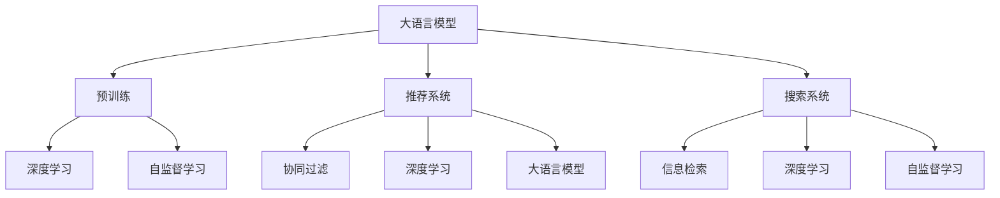

                 

# 电商平台的AI 大模型进化：搜索推荐系统性能全面升级

## 1. 背景介绍

在数字经济的浪潮中，电商平台的竞争日趋激烈，搜索推荐系统作为电商平台的核心功能之一，直接影响到用户体验和商家收益。传统推荐算法基于规则、协同过滤、深度学习等技术，其推荐效果与用户的个性化需求相匹配程度有限。而近年来，基于预训练语言模型（如BERT、GPT等）的推荐系统逐渐受到关注，以其在大规模数据上的出色性能，展现出显著的潜力。本文将介绍如何使用大语言模型来优化搜索推荐系统，全面升级电商平台的AI能力。

## 2. 核心概念与联系

### 2.1 核心概念概述

为更好地理解大语言模型在搜索推荐系统中的应用，本节将介绍几个密切相关的核心概念：

- **大语言模型 (Large Language Model, LLM)**：如BERT、GPT等，通过大规模无标签文本数据进行预训练，具备强大的语言理解和生成能力。
- **预训练 (Pre-training)**：指在大规模无标签文本数据上，通过自监督学习任务训练通用语言模型的过程。常见的预训练任务包括语言建模、掩码语言模型等。
- **推荐系统 (Recommendation System)**：旨在为用户推荐满足其需求的产品或信息，提升用户体验和平台收益。
- **搜索系统 (Search System)**：支持用户快速找到所需商品，提升浏览和购买效率。
- **深度学习 (Deep Learning)**：一种基于人工神经网络的机器学习技术，通过多层次的特征学习提升模型表现。
- **自监督学习 (Supervised Learning)**：利用无标签数据进行模型训练，通过自建任务提升模型泛化能力。

这些核心概念之间的逻辑关系可以通过以下Mermaid流程图来展示：



这个流程图展示了大语言模型在推荐和搜索系统中的应用路径：

1. 大语言模型通过预训练获得基础能力。
2. 推荐系统、搜索系统利用大语言模型的通用语言能力，结合深度学习等技术，进行个性化推荐和信息检索。
3. 推荐系统、搜索系统中的深度学习模型进一步提升推荐效果。
4. 自监督学习技术辅助模型训练，提高模型泛化能力。

## 3. 核心算法原理 & 具体操作步骤

### 3.1 算法原理概述

大语言模型在推荐和搜索系统中的应用，本质上是通过预训练模型进行特征提取，然后利用下游任务的监督学习，优化模型性能。其核心思想是：将大语言模型作为特征提取器，对用户输入和商品描述进行编码，通过训练目标，使模型能够预测用户可能感兴趣的商品。

形式化地，假设大语言模型为 $M_{\theta}$，其中 $\theta$ 为预训练得到的模型参数。给定电商平台上的用户行为数据 $D=\{(x_i,y_i)\}_{i=1}^N$，$x_i$ 为用户行为数据（如搜索历史、浏览记录），$y_i$ 为用户可能感兴趣的商品。推荐系统的优化目标是最小化用户行为数据与模型预测之间的差异：

$$
\hat{\theta}=\mathop{\arg\min}_{\theta} \mathcal{L}(M_{\theta},D)
$$

其中 $\mathcal{L}$ 为针对推荐系统设计的损失函数，用于衡量模型预测与真实标签之间的差异。常见的损失函数包括交叉熵损失、均方误差损失等。

### 3.2 算法步骤详解

大语言模型在搜索推荐系统中的应用，一般包括以下几个关键步骤：

**Step 1: 准备预训练模型和数据集**
- 选择合适的预训练语言模型 $M_{\theta}$ 作为初始化参数，如 BERT、GPT等。
- 准备电商平台的用户行为数据集 $D$，划分为训练集、验证集和测试集。

**Step 2: 添加任务适配层**
- 根据推荐和搜索任务的特点，在预训练模型的顶层设计合适的输出层和损失函数。
- 对于推荐任务，通常添加线性分类器或softmax层输出概率分布，使用交叉熵损失函数。
- 对于搜索任务，通常使用搜索引擎返回结果的分数作为输出，使用排序损失函数。

**Step 3: 设置微调超参数**
- 选择合适的优化算法及其参数，如 AdamW、SGD 等，设置学习率、批大小、迭代轮数等。
- 设置正则化技术及强度，包括权重衰减、Dropout、Early Stopping等。
- 确定冻结预训练参数的策略，如仅微调顶层，或全部参数都参与微调。

**Step 4: 执行梯度训练**
- 将用户行为数据集 $D$ 分批次输入模型，前向传播计算损失函数。
- 反向传播计算参数梯度，根据设定的优化算法和学习率更新模型参数。
- 周期性在验证集上评估模型性能，根据性能指标决定是否触发 Early Stopping。
- 重复上述步骤直到满足预设的迭代轮数或 Early Stopping 条件。

**Step 5: 测试和部署**
- 在测试集上评估微调后模型 $M_{\hat{\theta}}$ 的性能，对比微调前后的精度提升。
- 使用微调后的模型对新用户行为进行预测，集成到实际的搜索推荐系统中。

以上是使用大语言模型优化搜索推荐系统的通用流程。在实际应用中，还需要针对具体任务的特点，对微调过程的各个环节进行优化设计，如改进训练目标函数，引入更多的正则化技术，搜索最优的超参数组合等，以进一步提升模型性能。

### 3.3 算法优缺点

使用大语言模型优化推荐系统的方法具有以下优点：
1. 简单高效。只需准备少量标注数据，即可对预训练模型进行快速适配，获得较大的性能提升。
2. 通用适用。适用于各种电商平台的推荐和搜索任务，设计简单的任务适配层即可实现微调。
3. 性能显著。在大规模数据上进行微调，可以获得更准确的用户兴趣预测，提升推荐和搜索效果。
4. 模型可解释性。大语言模型可以通过理解语言结构，提供更详细的推荐理由，提高推荐系统的可解释性。

同时，该方法也存在一定的局限性：
1. 对标注数据依赖。微调的效果很大程度上取决于标注数据的质量和数量，获取高质量标注数据的成本较高。
2. 模型泛化能力有限。当目标任务与预训练数据的分布差异较大时，微调的性能提升有限。
3. 迁移能力不足。当目标任务与预训练数据的领域差异较大时，微调的性能提升有限。
4. 计算资源需求高。大语言模型参数量巨大，需要较强的计算资源进行微调。

尽管存在这些局限性，但就目前而言，使用大语言模型优化推荐系统的方法仍是大规模电商平台推荐和搜索的核心范式。未来相关研究的重点在于如何进一步降低微调对标注数据的依赖，提高模型的少样本学习和跨领域迁移能力，同时兼顾可解释性和计算效率等因素。

### 3.4 算法应用领域

大语言模型在电商平台的推荐和搜索系统中的应用，已经得到了广泛的应用，涵盖了以下多个方面：

1. **个性化推荐**：根据用户浏览和购买历史，推荐可能感兴趣的商品。大语言模型通过理解商品描述和用户兴趣，生成个性化的推荐结果。
2. **搜索结果排序**：通过搜索词和商品描述的自然语言处理，对搜索结果进行排序。大语言模型能够理解搜索意图，匹配最相关的商品。
3. **智能客服**：在用户查询商品时，通过自然语言理解技术，回答常见问题，引导用户进行购买决策。大语言模型能够快速响应，提供详细的商品信息。
4. **个性化搜索**：根据用户输入的关键词，生成更精准的搜索结果。大语言模型能够理解用户搜索意图，提供更相关的商品信息。
5. **广告投放**：通过分析用户兴趣，优化广告投放策略。大语言模型能够理解广告内容，生成更吸引用户的广告创意。

除了这些常见的应用场景外，大语言模型还被创新性地应用到更多电商平台的业务环节中，如客户关系管理、库存优化、供应链管理等，为电商平台的智能化升级提供了新的技术路径。

## 4. 数学模型和公式 & 详细讲解  
### 4.1 数学模型构建

本节将使用数学语言对使用大语言模型优化电商搜索推荐系统的过程进行更加严格的刻画。

记大语言模型为 $M_{\theta}$，其中 $\theta$ 为预训练得到的模型参数。假设电商平台上的推荐任务为 $T$，推荐结果为 $y$，给定用户行为数据集 $D=\{(x_i,y_i)\}_{i=1}^N$，$x_i$ 为用户行为数据（如搜索历史、浏览记录），$y_i$ 为用户可能感兴趣的商品。推荐系统的优化目标是最小化用户行为数据与模型预测之间的差异：

$$
\hat{\theta}=\mathop{\arg\min}_{\theta} \mathcal{L}(M_{\theta},D)
$$

其中 $\mathcal{L}$ 为针对推荐系统设计的损失函数，用于衡量模型预测与真实标签之间的差异。常见的损失函数包括交叉熵损失、均方误差损失等。

### 4.2 公式推导过程

以交叉熵损失为例，推荐任务的目标是最大化模型对用户感兴趣商品的预测概率。设用户行为数据 $x_i$ 输入大语言模型后，输出 $p_i$ 表示商品 $y_i$ 被用户感兴趣的概率，则交叉熵损失函数为：

$$
\mathcal{L}(p_i,y_i)=-[y_i\log p_i+(1-y_i)\log(1-p_i)]
$$

将其代入总体损失函数，得：

$$
\mathcal{L}(\theta)=\frac{1}{N}\sum_{i=1}^N \mathcal{L}(p_i,y_i)
$$

其中 $N$ 为用户行为数据的样本数。

在大语言模型中，通常使用Transformer等架构作为特征提取器，其输出层为一个全连接层。因此，计算 $p_i$ 的过程如下：

$$
p_i=softmax(W^{[1]}[h_i]+b^{[1]})
$$

其中 $h_i$ 为输入数据 $x_i$ 通过Transformer编码器的输出，$W^{[1]}$ 和 $b^{[1]}$ 为全连接层的权重和偏置。

根据上述推导，即可使用梯度下降等优化算法，最小化推荐系统的损失函数，优化大语言模型参数 $\theta$。

## 5. 项目实践：代码实例和详细解释说明
### 5.1 开发环境搭建

在进行搜索推荐系统开发前，我们需要准备好开发环境。以下是使用Python进行PyTorch开发的环境配置流程：

1. 安装Anaconda：从官网下载并安装Anaconda，用于创建独立的Python环境。

2. 创建并激活虚拟环境：
```bash
conda create -n pytorch-env python=3.8 
conda activate pytorch-env
```

3. 安装PyTorch：根据CUDA版本，从官网获取对应的安装命令。例如：
```bash
conda install pytorch torchvision torchaudio cudatoolkit=11.1 -c pytorch -c conda-forge
```

4. 安装TensorFlow：
```bash
conda install tensorflow -c conda-forge
```

5. 安装各类工具包：
```bash
pip install numpy pandas scikit-learn matplotlib tqdm jupyter notebook ipython
```

完成上述步骤后，即可在`pytorch-env`环境中开始搜索推荐系统的开发。

### 5.2 源代码详细实现

这里我们以使用BERT模型进行电商推荐系统的微调为例，给出使用PyTorch和Transformers库的代码实现。

首先，定义推荐任务的数据处理函数：

```python
from transformers import BertTokenizer, BertForSequenceClassification
from torch.utils.data import Dataset
import torch

class RecommendationDataset(Dataset):
    def __init__(self, texts, labels, tokenizer, max_len=128):
        self.texts = texts
        self.labels = labels
        self.tokenizer = tokenizer
        self.max_len = max_len
        
    def __len__(self):
        return len(self.texts)
    
    def __getitem__(self, item):
        text = self.texts[item]
        label = self.labels[item]
        
        encoding = self.tokenizer(text, return_tensors='pt', max_length=self.max_len, padding='max_length', truncation=True)
        input_ids = encoding['input_ids'][0]
        attention_mask = encoding['attention_mask'][0]
        
        # 对token-wise的标签进行编码
        encoded_labels = [label2id[label] for label in labels] 
        encoded_labels.extend([label2id['O']] * (self.max_len - len(encoded_labels)))
        labels = torch.tensor(encoded_labels, dtype=torch.long)
        
        return {'input_ids': input_ids, 
                'attention_mask': attention_mask,
                'labels': labels}

# 标签与id的映射
label2id = {'O': 0, 'positive': 1}
id2label = {v: k for k, v in label2id.items()}

# 创建dataset
tokenizer = BertTokenizer.from_pretrained('bert-base-uncased')

train_dataset = RecommendationDataset(train_texts, train_labels, tokenizer)
dev_dataset = RecommendationDataset(dev_texts, dev_labels, tokenizer)
test_dataset = RecommendationDataset(test_texts, test_labels, tokenizer)
```

然后，定义模型和优化器：

```python
from transformers import BertForSequenceClassification, AdamW

model = BertForSequenceClassification.from_pretrained('bert-base-uncased', num_labels=len(label2id))

optimizer = AdamW(model.parameters(), lr=2e-5)
```

接着，定义训练和评估函数：

```python
from torch.utils.data import DataLoader
from tqdm import tqdm
from sklearn.metrics import classification_report

device = torch.device('cuda') if torch.cuda.is_available() else torch.device('cpu')
model.to(device)

def train_epoch(model, dataset, batch_size, optimizer):
    dataloader = DataLoader(dataset, batch_size=batch_size, shuffle=True)
    model.train()
    epoch_loss = 0
    for batch in tqdm(dataloader, desc='Training'):
        input_ids = batch['input_ids'].to(device)
        attention_mask = batch['attention_mask'].to(device)
        labels = batch['labels'].to(device)
        model.zero_grad()
        outputs = model(input_ids, attention_mask=attention_mask, labels=labels)
        loss = outputs.loss
        epoch_loss += loss.item()
        loss.backward()
        optimizer.step()
    return epoch_loss / len(dataloader)

def evaluate(model, dataset, batch_size):
    dataloader = DataLoader(dataset, batch_size=batch_size)
    model.eval()
    preds, labels = [], []
    with torch.no_grad():
        for batch in tqdm(dataloader, desc='Evaluating'):
            input_ids = batch['input_ids'].to(device)
            attention_mask = batch['attention_mask'].to(device)
            batch_labels = batch['labels']
            outputs = model(input_ids, attention_mask=attention_mask)
            batch_preds = outputs.logits.argmax(dim=2).to('cpu').tolist()
            batch_labels = batch_labels.to('cpu').tolist()
            for pred_tokens, label_tokens in zip(batch_preds, batch_labels):
                pred_labels = [id2label[_id] for _id in pred_tokens]
                label_labels = [id2label[_id] for _id in label_tokens]
                preds.append(pred_labels[:len(label_labels)])
                labels.append(label_labels)
                
    print(classification_report(labels, preds))
```

最后，启动训练流程并在测试集上评估：

```python
epochs = 5
batch_size = 16

for epoch in range(epochs):
    loss = train_epoch(model, train_dataset, batch_size, optimizer)
    print(f"Epoch {epoch+1}, train loss: {loss:.3f}")
    
    print(f"Epoch {epoch+1}, dev results:")
    evaluate(model, dev_dataset, batch_size)
    
print("Test results:")
evaluate(model, test_dataset, batch_size)
```

以上就是使用PyTorch和Transformers库对BERT模型进行电商推荐系统微调的完整代码实现。可以看到，得益于Transformers库的强大封装，我们可以用相对简洁的代码完成BERT模型的加载和微调。

### 5.3 代码解读与分析

让我们再详细解读一下关键代码的实现细节：

**RecommendationDataset类**：
- `__init__`方法：初始化文本、标签、分词器等关键组件。
- `__len__`方法：返回数据集的样本数量。
- `__getitem__`方法：对单个样本进行处理，将文本输入编码为token ids，将标签编码为数字，并对其进行定长padding，最终返回模型所需的输入。

**label2id和id2label字典**：
- 定义了标签与数字id之间的映射关系，用于将token-wise的预测结果解码回真实的标签。

**训练和评估函数**：
- 使用PyTorch的DataLoader对数据集进行批次化加载，供模型训练和推理使用。
- 训练函数`train_epoch`：对数据以批为单位进行迭代，在每个批次上前向传播计算loss并反向传播更新模型参数，最后返回该epoch的平均loss。
- 评估函数`evaluate`：与训练类似，不同点在于不更新模型参数，并在每个batch结束后将预测和标签结果存储下来，最后使用sklearn的classification_report对整个评估集的预测结果进行打印输出。

**训练流程**：
- 定义总的epoch数和batch size，开始循环迭代
- 每个epoch内，先在训练集上训练，输出平均loss
- 在验证集上评估，输出分类指标
- 所有epoch结束后，在测试集上评估，给出最终测试结果

可以看到，PyTorch配合Transformers库使得BERT微调的代码实现变得简洁高效。开发者可以将更多精力放在数据处理、模型改进等高层逻辑上，而不必过多关注底层的实现细节。

当然，工业级的系统实现还需考虑更多因素，如模型的保存和部署、超参数的自动搜索、更灵活的任务适配层等。但核心的微调范式基本与此类似。

## 6. 实际应用场景
### 6.1 智能客服系统

基于大语言模型微调的对话技术，可以广泛应用于智能客服系统的构建。传统客服往往需要配备大量人力，高峰期响应缓慢，且一致性和专业性难以保证。而使用微调后的对话模型，可以7x24小时不间断服务，快速响应客户咨询，用自然流畅的语言解答各类常见问题。

在技术实现上，可以收集企业内部的历史客服对话记录，将问题和最佳答复构建成监督数据，在此基础上对预训练对话模型进行微调。微调后的对话模型能够自动理解用户意图，匹配最合适的答案模板进行回复。对于客户提出的新问题，还可以接入检索系统实时搜索相关内容，动态组织生成回答。如此构建的智能客服系统，能大幅提升客户咨询体验和问题解决效率。

### 6.2 金融舆情监测

金融机构需要实时监测市场舆论动向，以便及时应对负面信息传播，规避金融风险。传统的人工监测方式成本高、效率低，难以应对网络时代海量信息爆发的挑战。基于大语言模型微调的文本分类和情感分析技术，为金融舆情监测提供了新的解决方案。

具体而言，可以收集金融领域相关的新闻、报道、评论等文本数据，并对其进行主题标注和情感标注。在此基础上对预训练语言模型进行微调，使其能够自动判断文本属于何种主题，情感倾向是正面、中性还是负面。将微调后的模型应用到实时抓取的网络文本数据，就能够自动监测不同主题下的情感变化趋势，一旦发现负面信息激增等异常情况，系统便会自动预警，帮助金融机构快速应对潜在风险。

### 6.3 个性化推荐系统

当前的推荐系统往往只依赖用户的历史行为数据进行物品推荐，无法深入理解用户的真实兴趣偏好。基于大语言模型微调技术，个性化推荐系统可以更好地挖掘用户行为背后的语义信息，从而提供更精准、多样的推荐内容。

在实践中，可以收集用户浏览、点击、评论、分享等行为数据，提取和用户交互的物品标题、描述、标签等文本内容。将文本内容作为模型输入，用户的后续行为（如是否点击、购买等）作为监督信号，在此基础上微调预训练语言模型。微调后的模型能够从文本内容中准确把握用户的兴趣点。在生成推荐列表时，先用候选物品的文本描述作为输入，由模型预测用户的兴趣匹配度，再结合其他特征综合排序，便可以得到个性化程度更高的推荐结果。

### 6.4 未来应用展望

随着大语言模型微调技术的发展，未来在电商平台的推荐和搜索系统中的应用将更加广泛，为电商平台带来更多创新和价值：

1. **多模态推荐**：结合图像、视频等多模态数据，提升推荐系统的多样化。多模态信息的融合，将显著提升语言模型对现实世界的理解和建模能力。
2. **实时推荐**：利用微调后的模型进行实时推荐，能够快速响应用户需求，提升购物体验。
3. **跨平台协同**：利用微调后的模型在不同平台间进行数据共享和协同推荐，提升推荐效果。
4. **个性化定制**：利用微调后的模型进行个性化定制推荐，满足用户独特的兴趣和需求。
5. **智能场景应用**：将微调后的模型应用于智能家居、智能穿戴等场景，提供更智能、个性化的购物体验。

以上趋势凸显了大语言模型微调技术在电商平台的广阔前景。这些方向的探索发展，必将进一步提升推荐和搜索系统的性能和应用范围，为电商平台带来更多的用户价值。

## 7. 工具和资源推荐
### 7.1 学习资源推荐

为了帮助开发者系统掌握大语言模型在电商搜索推荐系统中的应用，这里推荐一些优质的学习资源：

1. 《深度学习与推荐系统》书籍：全面介绍了推荐系统的基本概念和前沿技术，深入浅出地讲解了推荐算法、深度学习在推荐中的应用等。
2. CS229《机器学习》课程：斯坦福大学开设的机器学习明星课程，讲解了推荐系统、信息检索等NLP相关内容。
3. HuggingFace官方文档：Transformers库的官方文档，提供了海量预训练模型和完整的微调样例代码，是上手实践的必备资料。
4. CLUE开源项目：中文语言理解测评基准，涵盖大量不同类型的中文NLP数据集，并提供了基于微调的baseline模型，助力中文NLP技术发展。
5. PyTorch官方文档：PyTorch框架的官方文档，提供了详细的API说明和样例代码，帮助开发者快速上手。

通过对这些资源的学习实践，相信你一定能够快速掌握大语言模型在电商搜索推荐系统中的应用，并用于解决实际的NLP问题。
### 7.2 开发工具推荐

高效的开发离不开优秀的工具支持。以下是几款用于大语言模型微调开发的常用工具：

1. PyTorch：基于Python的开源深度学习框架，灵活动态的计算图，适合快速迭代研究。大部分预训练语言模型都有PyTorch版本的实现。
2. TensorFlow：由Google主导开发的开源深度学习框架，生产部署方便，适合大规模工程应用。同样有丰富的预训练语言模型资源。
3. Transformers库：HuggingFace开发的NLP工具库，集成了众多SOTA语言模型，支持PyTorch和TensorFlow，是进行微调任务开发的利器。
4. Weights & Biases：模型训练的实验跟踪工具，可以记录和可视化模型训练过程中的各项指标，方便对比和调优。与主流深度学习框架无缝集成。
5. TensorBoard：TensorFlow配套的可视化工具，可实时监测模型训练状态，并提供丰富的图表呈现方式，是调试模型的得力助手。
6. Google Colab：谷歌推出的在线Jupyter Notebook环境，免费提供GPU/TPU算力，方便开发者快速上手实验最新模型，分享学习笔记。

合理利用这些工具，可以显著提升大语言模型微调的开发效率，加快创新迭代的步伐。

### 7.3 相关论文推荐

大语言模型和微调技术的发展源于学界的持续研究。以下是几篇奠基性的相关论文，推荐阅读：

1. Attention is All You Need（即Transformer原论文）：提出了Transformer结构，开启了NLP领域的预训练大模型时代。
2. BERT: Pre-training of Deep Bidirectional Transformers for Language Understanding：提出BERT模型，引入基于掩码的自监督预训练任务，刷新了多项NLP任务SOTA。
3. Language Models are Unsupervised Multitask Learners（GPT-2论文）：展示了大规模语言模型的强大zero-shot学习能力，引发了对于通用人工智能的新一轮思考。
4. Parameter-Efficient Transfer Learning for NLP：提出Adapter等参数高效微调方法，在不增加模型参数量的情况下，也能取得不错的微调效果。
5. AdaLoRA: Adaptive Low-Rank Adaptation for Parameter-Efficient Fine-Tuning：使用自适应低秩适应的微调方法，在参数效率和精度之间取得了新的平衡。
6. Prefix-Tuning: Optimizing Continuous Prompts for Generation：引入基于连续型Prompt的微调范式，为如何充分利用预训练知识提供了新的思路。

这些论文代表了大语言模型微调技术的发展脉络。通过学习这些前沿成果，可以帮助研究者把握学科前进方向，激发更多的创新灵感。

## 8. 总结：未来发展趋势与挑战

### 8.1 总结

本文对使用大语言模型优化电商平台搜索推荐系统的过程进行了全面系统的介绍。首先阐述了大语言模型在推荐和搜索系统中的应用背景，明确了微调在拓展预训练模型应用、提升推荐和搜索效果方面的独特价值。其次，从原理到实践，详细讲解了微调数学模型的构建和推导过程，给出了电商推荐系统的完整代码实现。同时，本文还广泛探讨了微调技术在智能客服、金融舆情、个性化推荐等多个领域的应用前景，展示了微调范式的巨大潜力。此外，本文精选了微调技术的各类学习资源，力求为读者提供全方位的技术指引。

通过本文的系统梳理，可以看到，使用大语言模型优化电商平台搜索推荐系统的方法，已经在电商平台的推荐和搜索系统上取得了显著的成果，大大提升了用户体验和平台收益。未来，伴随预训练语言模型和微调方法的持续演进，基于大语言模型的推荐和搜索系统将迎来更多创新和应用场景，为电商平台带来更多的用户价值。

### 8.2 未来发展趋势

展望未来，大语言模型微调技术在电商平台的推荐和搜索系统中的应用，将呈现以下几个发展趋势：

1. **更高效的推荐**：通过微调提升推荐系统的准确性和多样性，使得推荐结果更符合用户的个性化需求。未来，推荐系统将更加智能，能够实时动态更新推荐结果，提升用户体验。
2. **更全面的搜索**：通过微调提升搜索系统的准确性和召回率，使得用户能够更快速、更准确地找到所需商品。未来，搜索系统将更加智能，能够理解用户的查询意图，提供更个性化的搜索结果。
3. **更广泛的业务应用**：推荐和搜索系统将与电商平台的更多业务环节结合，如智能客服、智能投放、智能广告等，提升整个电商平台的智能化水平。
4. **更强的跨平台协同**：不同平台间的推荐和搜索系统将实现数据共享和协同推荐，提升推荐效果，增加用户粘性。
5. **更灵活的模型构建**：微调技术将与更多前沿技术结合，如强化学习、因果推理等，进一步提升推荐和搜索系统的智能化水平。
6. **更强大的跨领域迁移**：微调技术将更加注重跨领域的迁移能力，能够轻松应对新任务和新领域的数据，提升模型的泛化能力。

以上趋势凸显了大语言模型微调技术在电商平台推荐和搜索系统中的广阔前景。这些方向的探索发展，必将进一步提升推荐和搜索系统的性能和应用范围，为电商平台带来更多的用户价值。

### 8.3 面临的挑战

尽管大语言模型微调技术在电商平台的推荐和搜索系统中的应用已经取得了显著的成果，但在迈向更加智能化、普适化应用的过程中，它仍面临着诸多挑战：

1. **标注数据成本高**：电商平台需要大量的标注数据进行微调，获取高质量标注数据的成本较高。如何降低标注数据成本，提高标注数据质量，是未来需要解决的重要问题。
2. **推荐泛化能力有限**：当目标任务与预训练数据的领域差异较大时，微调的性能提升有限。如何提高微调的泛化能力，使其能够适应更多的应用场景，是未来需要解决的重要问题。
3. **计算资源需求高**：大语言模型参数量巨大，需要较强的计算资源进行微调。如何降低计算资源需求，提升模型的推理速度，是未来需要解决的重要问题。
4. **模型可解释性不足**：微调模型缺乏可解释性，难以解释其内部工作机制和决策逻辑。如何提升模型的可解释性，增强用户信任，是未来需要解决的重要问题。
5. **安全性和隐私保护**：电商平台涉及大量的用户数据，如何保护用户隐私，防止模型被恶意利用，是未来需要解决的重要问题。
6. **模型偏差和公平性**：预训练语言模型可能带有数据偏置，微调后的模型也可能出现偏差，如何消除模型偏差，提升模型公平性，是未来需要解决的重要问题。

这些挑战凸显了大语言模型微调技术在电商平台的推荐和搜索系统中的应用，需要更多的研究和技术创新。相信随着学界和产业界的共同努力，这些挑战终将一一被克服，大语言模型微调必将在电商平台的智能化升级中扮演越来越重要的角色。

### 8.4 研究展望

面对大语言模型微调技术在电商平台的推荐和搜索系统中的应用，未来的研究需要在以下几个方面寻求新的突破：

1. **少样本学习和跨领域迁移**：利用微调技术，开发少样本学习方法和跨领域迁移技术，使得模型能够在更少标注数据下获得良好性能，适应更多应用场景。
2. **多模态推荐**：结合图像、视频等多模态数据，提升推荐系统的多样化。多模态信息的融合，将显著提升语言模型对现实世界的理解和建模能力。
3. **强化学习与微调结合**：利用强化学习技术，优化微调过程中的目标函数，提升模型的泛化能力和实时性。
4. **因果推理与微调结合**：利用因果推理技术，增强微调模型建立稳定因果关系的能力，学习更加普适、鲁棒的语言表征。
5. **可解释性与透明度**：引入可解释性技术，提升微调模型的透明度，增强用户信任。
6. **隐私保护与安全性**：开发隐私保护技术，确保用户数据的安全性和隐私保护。

这些研究方向的探索，必将引领大语言模型微调技术在电商平台的推荐和搜索系统中的进一步突破，推动电商平台智能化升级。面向未来，大语言模型微调技术还需要与其他人工智能技术进行更深入的融合，如知识表示、因果推理、强化学习等，多路径协同发力，共同推动推荐和搜索系统的进步。只有勇于创新、敢于突破，才能不断拓展语言模型的边界，让智能技术更好地造福人类社会。

## 9. 附录：常见问题与解答

**Q1：大语言模型微调是否适用于所有电商推荐和搜索任务？**

A: 大语言模型微调在大多数电商推荐和搜索任务上都能取得不错的效果，特别是对于数据量较小的任务。但对于一些特定领域的任务，如医学、法律等，仅仅依靠通用语料预训练的模型可能难以很好地适应。此时需要在特定领域语料上进一步预训练，再进行微调，才能获得理想效果。此外，对于一些需要时效性、个性化很强的任务，如对话、推荐等，微调方法也需要针对性的改进优化。

**Q2：微调过程中如何选择合适的学习率？**

A: 微调的学习率一般要比预训练时小1-2个数量级，如果使用过大的学习率，容易破坏预训练权重，导致过拟合。一般建议从1e-5开始调参，逐步减小学习率，直至收敛。也可以使用warmup策略，在开始阶段使用较小的学习率，再逐渐过渡到预设值。需要注意的是，不同的优化器(如AdamW、Adafactor等)以及不同的学习率调度策略，可能需要设置不同的学习率阈值。

**Q3：采用大语言模型微调时会面临哪些资源瓶颈？**

A: 目前主流的预训练大模型动辄以亿计的参数规模，对算力、内存、存储都提出了很高的要求。GPU/TPU等高性能设备是必不可少的，但即便如此，超大批次的训练和推理也可能遇到显存不足的问题。因此需要采用一些资源优化技术，如梯度积累、混合精度训练、模型并行等，来突破硬件瓶颈。同时，模型的存储和读取也可能占用大量时间和空间，需要采用模型压缩、稀疏化存储等方法进行优化。

**Q4：如何缓解微调过程中的过拟合问题？**

A: 过拟合是微调面临的主要挑战，尤其是在标注数据不足的情况下。常见的缓解策略包括：
1. 数据增强：通过回译、近义替换等方式扩充训练集
2. 正则化：使用L2正则、Dropout、Early Stopping等避免过拟合
3. 对抗训练：引入对抗样本，提高模型鲁棒性
4. 参数高效微调：只调整少量参数(如Adapter、Prefix等)，减小过拟合风险
5. 多模型集成：训练多个微调模型，取平均输出，抑制过拟合

这些策略往往需要根据具体任务和数据特点进行灵活组合。只有在数据、模型、训练、推理等各环节进行全面优化，才能最大限度地发挥大语言模型微调的威力。

**Q5：微调模型在落地部署时需要注意哪些问题？**

A: 将微调模型转化为实际应用，还需要考虑以下因素：
1. 模型裁剪：去除不必要的层和参数，减小模型尺寸，加快推理速度
2. 量化加速：将浮点模型转为定点模型，压缩存储空间，提高计算效率
3. 服务化封装：将模型封装为标准化服务接口，便于集成调用
4. 弹性伸缩：根据请求流量动态调整资源配置，平衡服务质量和成本
5. 监控告警：实时采集系统指标，设置异常告警阈值，确保服务稳定性
6. 安全防护：采用访问鉴权、数据脱敏等措施，保障数据和模型安全

大语言模型微调为电商平台推荐和搜索系统提供了巨大的可能性，但如何将强大的性能转化为稳定、高效、安全的业务价值，还需要工程实践的不断打磨。唯有从数据、算法、工程、业务等多个维度协同发力，才能真正实现人工智能技术在电商平台的规模化落地。总之，微调需要开发者根据具体任务，不断迭代和优化模型、数据和算法，方能得到理想的效果。

---

作者：禅与计算机程序设计艺术 / Zen and the Art of Computer Programming

