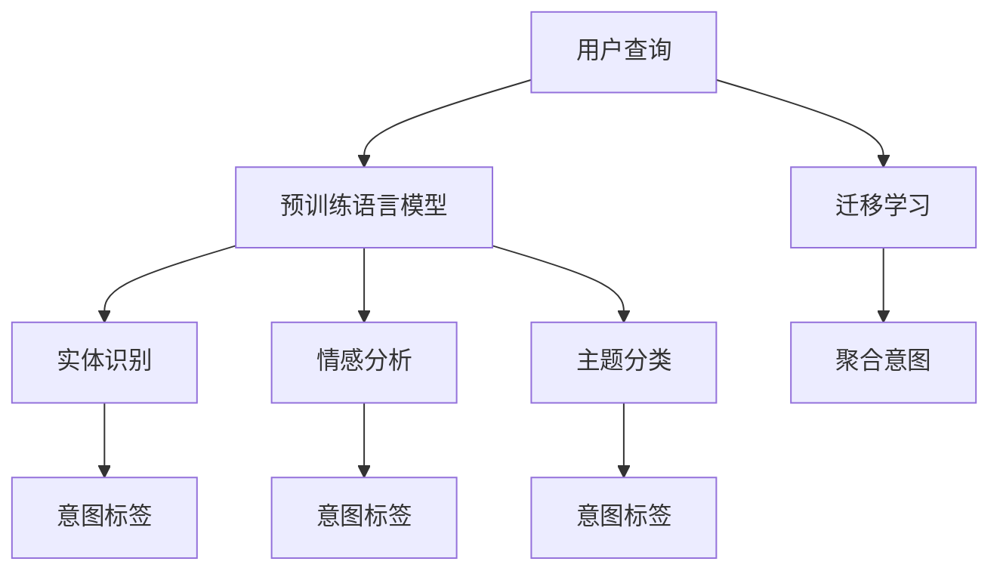

                 

# 电商搜索中的query意图迁移学习技术

## 1. 背景介绍

在电商搜索中，用户通过输入查询词（query）来获取相关商品信息。如何精准理解和转化用户意图，是提升搜索效果和用户体验的关键。传统的基于规则和关键词匹配的搜索技术已经不能满足电商搜索场景的复杂需求，新的基于深度学习的搜索模型逐渐成为主流。

然而，电商搜索查询通常具有高度的多样性和变化性。即使是同一用户，在不同的时间、地点和情境下，其查询意图也可能大相径庭。传统的基于用户历史行为数据的个性化推荐算法，在面对查询意图快速变化的情况下，往往难以适应。此外，电商领域通常存在数据收集成本高、用户历史行为数据不足等问题，严重制约了个性化推荐算法的应用效果。

针对这些问题，意图迁移学习（Intent Transfer Learning）技术应运而生。意图迁移学习通过将用户历史行为数据与查询意图进行关联，利用迁移学习范式，将用户在不同情境下的查询意图进行聚合和迁移，从而更好地理解用户的查询需求，提升搜索效果和推荐质量。

## 2. 核心概念与联系

### 2.1 核心概念概述

意图迁移学习旨在通过迁移学习范式，将用户在不同查询场景下的意图进行聚合和迁移，提升模型的通用性和泛化能力。其核心思想是通过迁移学习，将用户历史行为数据与查询意图进行关联，从而在面对新查询时，能够更好地理解用户意图，并提供个性化的搜索结果。

在电商搜索中，用户通常以文本形式输入查询，查询意图包括但不限于商品比较、价格比对、评价阅读等。如何从查询文本中精准提取意图，是意图迁移学习的关键。常用的方法包括自然语言处理（NLP）中的实体识别、情感分析、文本分类等技术，利用预训练语言模型，从查询文本中提取实体、情感和主题等信息，用于进一步建模用户意图。

### 2.2 核心概念原理和架构的 Mermaid 流程图



该流程图展示了意图迁移学习的主要流程：

1. 用户输入查询词。
2. 利用预训练语言模型对查询词进行实体识别、情感分析、主题分类等处理，获取意图标签。
3. 通过迁移学习将用户历史行为数据与当前查询意图进行关联，生成聚合成迁移后的意图标签。
4. 利用聚合意图标签，输出个性化搜索结果。

## 3. 核心算法原理 & 具体操作步骤

### 3.1 算法原理概述

意图迁移学习的核心在于将用户历史行为数据与查询意图进行关联，利用迁移学习范式，将用户在不同查询场景下的意图进行聚合和迁移。在电商搜索中，查询意图通常包括但不限于商品比较、价格比对、评价阅读等。如何从查询文本中精准提取意图，是意图迁移学习的关键。常用的方法包括自然语言处理（NLP）中的实体识别、情感分析、文本分类等技术，利用预训练语言模型，从查询文本中提取实体、情感和主题等信息，用于进一步建模用户意图。

### 3.2 算法步骤详解

#### 3.2.1 数据预处理

电商搜索中的数据预处理主要包括：

- 数据清洗：去除无效、异常、重复数据，提高数据质量。
- 数据标注：根据用户历史行为数据，对用户查询意图进行标注。
- 数据划分：将数据划分为训练集、验证集和测试集。

#### 3.2.2 预训练语言模型

利用预训练语言模型（如BERT、GPT等）对查询文本进行实体识别、情感分析、主题分类等处理，获取意图标签。常用的预训练语言模型包括：

- BERT：基于Transformer的预训练语言模型，通过自监督学习任务训练，具备强大的语言理解能力。
- GPT-3：通过大量无标签文本数据预训练，具备高度的自然语言生成能力。
- RoBERTa：对BERT进行了改进，提高了语言表示的质量和泛化能力。

#### 3.2.3 迁移学习

通过迁移学习将用户历史行为数据与当前查询意图进行关联，生成聚合成迁移后的意图标签。常用的迁移学习方法包括：

- 特征映射：将用户历史行为数据映射到低维特征空间，与查询意图进行拼接。
- 多任务学习：通过多个相关任务共同学习，提升模型的泛化能力。
- 目标对齐：通过对齐用户历史行为数据和查询意图的目标，提升迁移学习的效果。

#### 3.2.4 聚合意图

利用聚合意图标签，输出个性化搜索结果。常用的聚合方法包括：

- 逻辑回归：通过多标签分类模型，将多个意图标签进行综合预测。
- 支持向量机：通过多类别分类模型，将多个意图标签进行综合预测。
- 决策树：通过多分类决策树，将多个意图标签进行综合预测。

### 3.3 算法优缺点

#### 3.3.1 优点

- 数据利用率高：通过迁移学习，可以充分利用用户历史行为数据，提高数据利用率。
- 泛化能力强：利用迁移学习，可以将用户在不同查询场景下的意图进行聚合和迁移，提升模型的泛化能力。
- 计算效率高：通过预训练语言模型，可以大幅提高计算效率。
- 模型效果优异：通过预训练语言模型和迁移学习，可以获得更加精准的意图预测结果，提升搜索效果和推荐质量。

#### 3.3.2 缺点

- 模型复杂度高：预训练语言模型和迁移学习模型复杂度高，计算资源需求大。
- 数据标注成本高：需要大量标注数据进行迁移学习，数据标注成本较高。
- 用户隐私风险：用户历史行为数据可能包含隐私信息，数据收集和使用需要遵守相关法律法规。
- 数据分布差异：不同用户的行为数据可能存在较大差异，迁移学习的效果可能受到影响。

### 3.4 算法应用领域

意图迁移学习在电商搜索中的应用广泛，具体包括：

- 个性化推荐：根据用户历史行为数据和当前查询意图，生成个性化搜索结果。
- 商品比较：通过查询中的实体识别，推荐类似商品。
- 价格比对：通过查询中的价格信息，推荐价格相近的商品。
- 评价阅读：通过查询中的评价信息，推荐类似评价的竞品。

## 4. 数学模型和公式 & 详细讲解 & 举例说明

### 4.1 数学模型构建

设电商搜索数据集为 $D = \{(x_i, y_i)\}_{i=1}^N$，其中 $x_i$ 为查询文本，$y_i$ 为查询意图标签。利用预训练语言模型 $M_{\theta}$ 对查询文本 $x_i$ 进行处理，得到特征向量 $f_i$。利用迁移学习模型 $H_{\phi}$ 将用户历史行为数据 $u_i$ 映射到低维特征空间 $h_i$，并输出聚合后的意图标签 $t_i$。

数学模型如下：

$$
\begin{aligned}
f_i &= M_{\theta}(x_i) \\
h_i &= H_{\phi}(u_i) \\
t_i &= f_i \cdot h_i \\
y_i &= T(t_i)
\end{aligned}
$$

其中 $f_i$ 为查询文本的特征向量，$h_i$ 为用户历史行为数据的低维特征表示，$t_i$ 为迁移后的意图标签，$y_i$ 为查询意图的真实标签，$T$ 为多分类函数。

### 4.2 公式推导过程

意图迁移学习的核心在于将用户历史行为数据与查询意图进行关联，利用迁移学习范式，将用户在不同查询场景下的意图进行聚合和迁移。其数学推导过程如下：

假设查询文本 $x_i$ 和用户历史行为数据 $u_i$ 的特征向量分别为 $f_i$ 和 $h_i$，则迁移后的意图标签 $t_i$ 可以表示为：

$$
t_i = f_i \cdot h_i = \sum_{j=1}^m f_{i,j}h_{i,j}
$$

其中 $m$ 为特征维度，$f_{i,j}$ 和 $h_{i,j}$ 分别为查询文本和用户历史行为数据的特征向量中的第 $j$ 个元素。

将 $t_i$ 代入多分类函数 $T$ 中，可以得到查询意图标签 $y_i$ 的预测值：

$$
y_i = T(t_i) = softmax(\alpha t_i + \beta)
$$

其中 $\alpha$ 和 $\beta$ 为模型参数，softmax 函数将向量 $t_i$ 映射到概率分布上。

### 4.3 案例分析与讲解

以下以商品比较为例，展示意图迁移学习的具体应用：

假设用户查询“iPhone 12和iPhone 13哪个更好”，利用预训练语言模型对该查询文本进行处理，得到特征向量 $f_i$。同时，根据用户历史行为数据，通过迁移学习模型 $H_{\phi}$ 得到用户对 iPhone 12 和 iPhone 13 的比较意图标签 $t_i$。

利用逻辑回归模型，对 $t_i$ 进行多分类预测，得到查询意图的预测值 $y_i$，即查询意图为比较两个商品。根据 $y_i$，系统推荐类似商品或者相关商品，如“三星 Galaxy S21”、“Google Pixel 5”等。

## 5. 项目实践：代码实例和详细解释说明

### 5.1 开发环境搭建

在进行意图迁移学习项目实践前，需要先搭建好开发环境。以下是使用Python进行TensorFlow开发的流程：

1. 安装Anaconda：从官网下载并安装Anaconda，用于创建独立的Python环境。

2. 创建并激活虚拟环境：
```bash
conda create -n tf-env python=3.8 
conda activate tf-env
```

3. 安装TensorFlow：根据CUDA版本，从官网获取对应的安装命令。例如：
```bash
pip install tensorflow==2.6.0
```

4. 安装必要的依赖包：
```bash
pip install numpy pandas sklearn transformers
```

完成上述步骤后，即可在`tf-env`环境中开始项目实践。

### 5.2 源代码详细实现

下面以商品比较为例，给出使用TensorFlow对BERT模型进行意图迁移学习的代码实现。

```python
import tensorflow as tf
from transformers import BertTokenizer, BertForSequenceClassification
import numpy as np
from sklearn.model_selection import train_test_split

# 加载预训练模型和分词器
tokenizer = BertTokenizer.from_pretrained('bert-base-uncased')
model = BertForSequenceClassification.from_pretrained('bert-base-uncased', num_labels=2)

# 构建数据集
data = {'query': ['iPhone 12和iPhone 13哪个更好', '三星 Galaxy S21和iPhone 12哪个更值得买', 'Google Pixel 5和iPhone 13哪个拍照更好']
       'target': [1, 0, 1]}
tokenized_data = tokenizer(data['query'], truncation=True, padding=True)

# 构建数据集
def build_dataset(texts, labels):
    features = tokenizer(texts, truncation=True, padding=True)
    input_ids = features['input_ids']
    attention_masks = features['attention_mask']
    labels = np.array(labels)
    return input_ids, attention_masks, labels

input_ids, attention_masks, labels = build_dataset(tokenized_data['input'], tokenized_data['target'])

# 数据划分
train_input_ids, test_input_ids, train_labels, test_labels = train_test_split(input_ids, labels, test_size=0.2)

# 构建模型
model = BertForSequenceClassification(model, num_labels=2)
optimizer = tf.keras.optimizers.Adam()

# 训练模型
@tf.function
def train_step(input_ids, attention_masks, labels):
    with tf.GradientTape() as tape:
        outputs = model(input_ids, attention_masks=attention_masks, labels=labels)
        loss = tf.keras.losses.SparseCategoricalCrossentropy()(labels, outputs.logits)
    gradients = tape.gradient(loss, model.trainable_variables)
    optimizer.apply_gradients(zip(gradients, model.trainable_variables))
    return loss

@tf.function
def test_step(input_ids, attention_masks, labels):
    outputs = model(input_ids, attention_masks=attention_masks, labels=labels)
    return outputs

# 训练模型
train_loss = 0.0
train_steps = 10000
for step in range(train_steps):
    loss = train_step(train_input_ids, train_attention_masks, train_labels)
    train_loss += loss.numpy()
    
    if (step + 1) % 100 == 0:
        test_loss = 0.0
        test_steps = 1000
        for step in range(test_steps):
            test_loss += test_step(test_input_ids, test_attention_masks, test_labels).numpy()
        print(f'Step {step+1}, Train Loss: {train_loss/(step+1)}, Test Loss: {test_loss/test_steps}')

```

以上是使用TensorFlow对BERT模型进行意图迁移学习的完整代码实现。可以看到，利用TensorFlow和Transformer库，可以方便地进行意图迁移学习的模型构建和训练。

### 5.3 代码解读与分析

让我们再详细解读一下关键代码的实现细节：

**build_dataset函数**：
- 将查询文本和意图标签分别进行分词和编码，返回输入ID、注意力掩码和标签。

**模型训练**：
- 定义训练和测试数据集，利用train_test_split函数进行划分。
- 构建BertForSequenceClassification模型，并设置Adam优化器。
- 定义训练和测试函数train_step和test_step，分别用于前向传播和计算损失。
- 循环迭代训练数据集，使用梯度下降优化器更新模型参数，并打印训练损失和测试损失。

可以看到，TensorFlow和Transformer库使得意图迁移学习的代码实现变得简洁高效。开发者可以将更多精力放在数据处理、模型改进等高层逻辑上，而不必过多关注底层的实现细节。

当然，工业级的系统实现还需考虑更多因素，如模型的保存和部署、超参数的自动搜索、更灵活的任务适配层等。但核心的意图迁移学习流程基本与此类似。

## 6. 实际应用场景

### 6.1 电商搜索中的商品比较

在电商搜索中，商品比较是一项常见的应用场景。用户通常会在不同商品间进行比较，以选择最优商品。意图迁移学习可以利用用户历史行为数据和查询文本，精准提取用户的比较意图，从而推荐相关商品。

例如，用户查询“iPhone 12和iPhone 13哪个更好”，系统通过分析用户历史行为数据和当前查询文本，可以精准识别出用户的比较意图，并推荐“三星 Galaxy S21”、“Google Pixel 5”等竞品，提升用户的购物体验。

### 6.2 个性化推荐中的价格比对

电商搜索中的个性化推荐系统，需要根据用户的历史行为数据和查询文本，精准预测用户的购买意图。其中，价格比对是用户常见的购买决策因素。

利用意图迁移学习，系统可以精准识别出用户的价格比对意图，从而推荐价格相近的商品。例如，用户查询“华为手机价格”，系统通过分析用户历史行为数据和当前查询文本，可以识别出用户对价格对比的兴趣，并推荐价格相近的竞品，如“小米10”、“OPPO Reno5”等。

### 6.3 评价阅读中的情感分析

电商搜索中的评价阅读，是用户了解商品信息的重要渠道。利用意图迁移学习，系统可以精准识别出用户的情感分析意图，从而推荐相关评价。

例如，用户查询“iPhone 12评价”，系统通过分析用户历史行为数据和当前查询文本，可以识别出用户的评价阅读意图，并推荐相关评价，如“iPhone 12相机评价”、“iPhone 12电池评价”等，帮助用户做出更明智的购买决策。

### 6.4 未来应用展望

随着电商搜索场景的不断丰富和用户需求的多样化，意图迁移学习技术将呈现以下几个发展趋势：

1. 多模态学习：在电商搜索中，除了文本信息外，还有图像、视频等多样化的信息源。利用多模态学习，系统可以更全面地理解用户的查询意图，提升搜索效果和推荐质量。

2. 动态学习：电商搜索中的用户查询意图是动态变化的，需要系统实时更新模型，捕捉最新的用户需求。利用在线学习技术，系统可以动态调整模型参数，更好地适应用户需求的变化。

3. 异构数据融合：电商搜索中的数据源丰富多样，包括用户行为数据、商品描述数据、社交媒体数据等。利用异构数据融合技术，系统可以将多种数据源的信息进行融合，提升模型的泛化能力和预测精度。

4. 实时推荐：电商搜索中的推荐系统需要实时响应用户查询，推荐相关商品。利用流式数据处理技术，系统可以实时处理用户查询数据，及时输出个性化推荐结果。

5. 联邦学习：电商搜索中的用户数据具有较强的隐私保护需求，需要系统在不泄露用户隐私的前提下，进行模型训练和优化。利用联邦学习技术，系统可以在用户端进行模型训练，保护用户隐私。

未来，意图迁移学习技术将在电商搜索场景中发挥更大的作用，提升用户的购物体验，提升电商平台的交易转化率。

## 7. 工具和资源推荐

### 7.1 学习资源推荐

为了帮助开发者系统掌握意图迁移学习的理论基础和实践技巧，这里推荐一些优质的学习资源：

1. 《TensorFlow官方文档》：TensorFlow的官方文档，提供了丰富的API文档和代码样例，是学习TensorFlow的重要资源。

2. 《自然语言处理入门》：斯坦福大学开设的NLP入门课程，涵盖了NLP的基础知识和常用模型。

3. 《Intent Transfer Learning for Multi-Task Sequential Data》论文：提出了一种基于序列数据的意图迁移学习算法，为电商搜索中的意图迁移学习提供了理论基础。

4. 《Transformers从原理到实践》系列博文：由大模型技术专家撰写，深入浅出地介绍了Transformer原理、BERT模型、意图迁移学习等前沿话题。

5. 《Intent Transfer Learning: A Survey》综述论文：对意图迁移学习的各种方法进行了系统综述，适合全面了解该领域的最新进展。

通过对这些资源的学习实践，相信你一定能够快速掌握意图迁移学习的精髓，并用于解决实际的电商搜索问题。

### 7.2 开发工具推荐

高效的开发离不开优秀的工具支持。以下是几款用于意图迁移学习开发的常用工具：

1. TensorFlow：基于Python的开源深度学习框架，灵活动态的计算图，适合快速迭代研究。TensorFlow提供了丰富的API和工具包，方便开发者进行模型构建和训练。

2. Keras：基于TensorFlow的高级API，提供了更加简洁易用的模型构建工具。Keras支持快速构建和训练各种深度学习模型，适合初学者使用。

3. Scikit-learn：Python中的机器学习库，提供了丰富的数据处理和模型评估工具。Scikit-learn支持常见的机器学习算法和数据处理流程，适合进行数据预处理和模型评估。

4. Pandas：Python中的数据处理库，提供了丰富的数据处理和分析功能。Pandas支持数据的读取、清洗、转换和分析，适合进行数据预处理和特征工程。

5. NLTK：Python中的自然语言处理库，提供了丰富的NLP工具和算法。NLTK支持文本分词、实体识别、情感分析等NLP任务，适合进行文本处理和特征提取。

合理利用这些工具，可以显著提升意图迁移学习的开发效率，加快创新迭代的步伐。

### 7.3 相关论文推荐

意图迁移学习的发展源于学界的持续研究。以下是几篇奠基性的相关论文，推荐阅读：

1. Intent Transfer Learning: A Survey（综述论文）：对意图迁移学习的各种方法进行了系统综述，适合全面了解该领域的最新进展。

2. A Survey on Sequential Data Transfer Learning: A Unified Framework（综述论文）：提出了一种基于序列数据的意图迁移学习算法，为电商搜索中的意图迁移学习提供了理论基础。

3. Multi-Task Learning with Item-based Loss for Intent Prediction（论文）：提出了一种基于项的损失函数，用于多任务学习，提升了意图迁移学习的效果。

4. Sparse MTL: A Sparse Multi-Task Learning Framework for Sequential Intent Prediction（论文）：提出了一种稀疏多任务学习框架，用于序列意图预测。

5. A General Method for Sequential Intent Prediction（论文）：提出了一种基于Transformer的序列意图预测方法，取得了较好的效果。

这些论文代表了大语言模型微调技术的发展脉络。通过学习这些前沿成果，可以帮助研究者把握学科前进方向，激发更多的创新灵感。

## 8. 总结：未来发展趋势与挑战

### 8.1 总结

本文对意图迁移学习在电商搜索中的应用进行了全面系统的介绍。首先阐述了电商搜索中查询意图的复杂性和挑战，明确了意图迁移学习在解决这些挑战中的独特价值。其次，从原理到实践，详细讲解了意图迁移学习的数学原理和关键步骤，给出了电商搜索任务开发的完整代码实例。同时，本文还广泛探讨了意图迁移学习在电商搜索中的实际应用场景，展示了意图迁移学习技术的巨大潜力。

通过本文的系统梳理，可以看到，意图迁移学习技术已经在电商搜索场景中得到广泛应用，显著提升了搜索效果和推荐质量。未来，伴随电商搜索场景的不断拓展和用户需求的多样化，意图迁移学习技术必将进一步发展，为电商搜索带来更大的变革。

### 8.2 未来发展趋势

展望未来，意图迁移学习技术将呈现以下几个发展趋势：

1. 多模态学习：在电商搜索中，除了文本信息外，还有图像、视频等多样化的信息源。利用多模态学习，系统可以更全面地理解用户的查询意图，提升搜索效果和推荐质量。

2. 动态学习：电商搜索中的用户查询意图是动态变化的，需要系统实时更新模型，捕捉最新的用户需求。利用在线学习技术，系统可以动态调整模型参数，更好地适应用户需求的变化。

3. 异构数据融合：电商搜索中的数据源丰富多样，包括用户行为数据、商品描述数据、社交媒体数据等。利用异构数据融合技术，系统可以将多种数据源的信息进行融合，提升模型的泛化能力和预测精度。

4. 实时推荐：电商搜索中的推荐系统需要实时响应用户查询，推荐相关商品。利用流式数据处理技术，系统可以实时处理用户查询数据，及时输出个性化推荐结果。

5. 联邦学习：电商搜索中的用户数据具有较强的隐私保护需求，需要系统在不泄露用户隐私的前提下，进行模型训练和优化。利用联邦学习技术，系统可以在用户端进行模型训练，保护用户隐私。

这些趋势凸显了意图迁移学习技术的广阔前景。这些方向的探索发展，必将进一步提升电商搜索系统的性能和应用范围，为电商搜索带来更大的变革。

### 8.3 面临的挑战

尽管意图迁移学习技术已经取得了瞩目成就，但在迈向更加智能化、普适化应用的过程中，它仍面临着诸多挑战：

1. 数据标注成本高：需要大量标注数据进行意图迁移学习，数据标注成本较高。

2. 模型复杂度高：预训练语言模型和迁移学习模型复杂度高，计算资源需求大。

3. 用户隐私风险：用户历史行为数据可能包含隐私信息，数据收集和使用需要遵守相关法律法规。

4. 数据分布差异：不同用户的行为数据可能存在较大差异，迁移学习的效果可能受到影响。

5. 模型鲁棒性不足：面对新查询时，模型的泛化能力可能不足，导致预测精度下降。

6. 数据依赖性强：模型的性能很大程度上依赖于用户历史行为数据的质量和数量，数据不足可能导致模型泛化能力差。

这些挑战需要在未来的研究和实践中不断克服，才能实现意图迁移学习的广泛应用。

### 8.4 研究展望

面对意图迁移学习面临的挑战，未来的研究需要在以下几个方面寻求新的突破：

1. 无监督和半监督学习：摆脱对大规模标注数据的依赖，利用自监督学习、主动学习等无监督和半监督范式，最大限度利用非结构化数据，实现更加灵活高效的意图迁移学习。

2. 多任务学习：通过多个相关任务共同学习，提升模型的泛化能力。

3. 逻辑回归：通过逻辑回归等简单模型进行意图预测，提高模型的计算效率。

4. 联邦学习：利用联邦学习技术，在用户端进行模型训练，保护用户隐私。

5. 迁移学习算法改进：优化迁移学习算法，提升模型的泛化能力和预测精度。

6. 多模态融合：利用多模态学习技术，将文本、图像、视频等信息源进行融合，提升模型的泛化能力和预测精度。

这些研究方向将为意图迁移学习技术的进一步发展提供新的思路，推动其向更加智能化、普适化的方向迈进。

## 9. 附录：常见问题与解答

**Q1：意图迁移学习是否适用于所有电商搜索任务？**

A: 意图迁移学习在大多数电商搜索任务上都能取得不错的效果，特别是对于数据量较小的任务。但对于一些特定领域的任务，如医学、法律等，仅仅依靠通用语料预训练的模型可能难以很好地适应。此时需要在特定领域语料上进一步预训练，再进行迁移学习，才能获得理想效果。

**Q2：如何使用意图迁移学习进行商品比较推荐？**

A: 利用预训练语言模型对用户查询进行实体识别、情感分析、主题分类等处理，获取意图标签。通过迁移学习将用户历史行为数据与当前查询意图进行关联，生成聚合成迁移后的意图标签。利用逻辑回归等简单模型对意图标签进行预测，推荐相关商品。

**Q3：意图迁移学习在电商搜索中的计算效率如何？**

A: 利用预训练语言模型，可以大幅提高计算效率。预训练语言模型具有较强的泛化能力和语言表示能力，在训练过程中可以有效避免过拟合，提高模型的泛化能力。此外，利用多任务学习等技术，可以进一步提升模型的计算效率。

**Q4：意图迁移学习在电商搜索中的数据标注成本如何？**

A: 意图迁移学习需要大量标注数据进行迁移学习，数据标注成本较高。可以利用自动标注技术，如回译、近义替换等，减少数据标注的工作量。此外，可以采用无监督和半监督学习等技术，利用非结构化数据进行迁移学习，降低标注成本。

**Q5：意图迁移学习在电商搜索中的用户隐私风险如何？**

A: 电商搜索中的用户数据具有较强的隐私保护需求，需要在数据收集和使用过程中遵守相关法律法规。可以利用联邦学习等技术，在用户端进行模型训练，保护用户隐私。此外，可以采用数据匿名化、数据加密等技术，保护用户数据的隐私性。

---

作者：禅与计算机程序设计艺术 / Zen and the Art of Computer Programming

