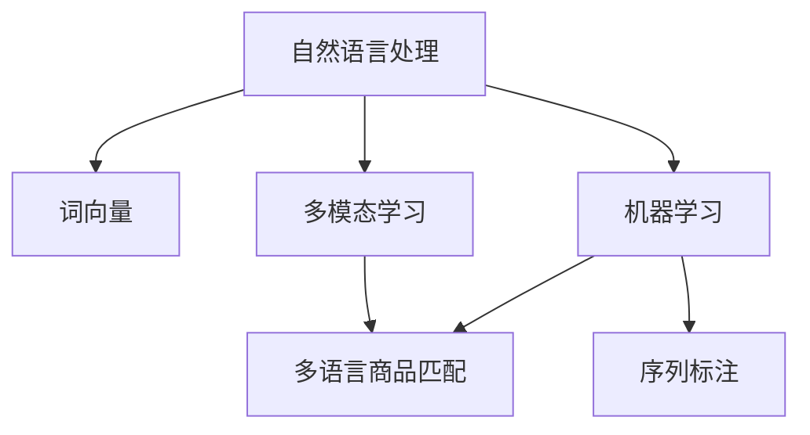

                 

# 电商搜索中的多语言商品匹配技术

## 1. 背景介绍

随着全球化进程的加速，电商市场已经逐渐拓展到全球各地。对于大型电商企业来说，如何提供多语言商品匹配，满足不同国家和地区消费者的需求，成为了一项重要任务。传统的多语言商品匹配方法依赖于人工翻译和手动分类，效率低下且准确性有限。而现代的电商搜索系统则逐渐引入人工智能技术，通过自然语言处理和机器学习算法，实现高效、准确的多语言商品匹配。

## 2. 核心概念与联系

### 2.1 核心概念概述

在本节，我们将介绍几个与电商搜索和多语言商品匹配相关的核心概念：

- 自然语言处理(Natural Language Processing, NLP)：使用计算机科学和人工智能技术处理和分析人类语言的技术。包括文本处理、语音识别、语言生成等方面。
- 机器学习(Machine Learning, ML)：一种使用数据和算法自动改善模型性能的技术。电商搜索中的商品匹配即为典型的机器学习应用。
- 多语言商品匹配(Multilingual Product Matching)：将不同语言的商品描述和搜索词关联匹配，以满足多语言用户搜索需求的技术。
- 词向量(Word Embedding)：一种将文本词汇映射到向量空间的技术，使得计算机能够理解和处理语言。
- 序列标注(Sequence Labeling)：对序列数据进行标记，常用于命名实体识别、词性标注等任务。
- 多模态学习(Multimodal Learning)：处理包含多种类型数据（如文本、图像、语音等）的数据，利用多种数据源提升模型性能。

这些核心概念之间存在着紧密的联系，共同构成了电商搜索中多语言商品匹配的技术基础。

### 2.2 核心概念原理和架构的 Mermaid 流程图



该图展示了自然语言处理、词向量、机器学习、多语言商品匹配、序列标注和多模态学习之间的联系。其中，自然语言处理和机器学习是核心的技术支撑，而词向量、序列标注和多模态学习则提供了具体的方法实现。

## 3. 核心算法原理 & 具体操作步骤

### 3.1 算法原理概述

基于机器学习的电商搜索中的多语言商品匹配算法，通过构建语义相似度模型，将搜索词与商品描述进行匹配。具体步骤如下：

1. **语料预处理**：收集并清洗不同语言的商品描述和搜索词，构建语料库。
2. **词向量训练**：使用词向量技术将文本词汇映射到向量空间，使得计算机能够理解和处理语言。
3. **序列标注**：对商品描述和搜索词进行序列标注，识别出其中的命名实体和短语。
4. **模型训练**：使用序列标注结果和词向量，训练多语言商品匹配模型，如双向LSTM-CRF等。
5. **模型推理**：输入搜索词，通过训练好的模型预测出最匹配的商品描述。

### 3.2 算法步骤详解

#### 3.2.1 语料预处理

电商企业需要收集并清洗不同语言的商品描述和搜索词，构建高质量的语料库。具体步骤如下：

1. **数据收集**：从电商平台的商品库和用户搜索记录中收集语料，包括商品标题、描述、属性等信息。
2. **数据清洗**：去除噪声数据和无用信息，如特殊字符、停用词等。
3. **分词和预处理**：对文本进行分词和预处理，如去除标点、大小写统一等。
4. **标注**：对商品描述和搜索词进行命名实体识别、短语提取等标注。

#### 3.2.2 词向量训练

使用词向量技术将文本词汇映射到向量空间，使得计算机能够理解和处理语言。常见的词向量模型包括Word2Vec、GloVe等。具体步骤如下：

1. **向量空间构建**：将每个词汇映射到一个向量空间中，使得相似的词汇在向量空间中距离较近。
2. **嵌入训练**：使用语料库训练词向量，使得词汇向量能够捕捉到语言中的语义信息。
3. **嵌入选择**：根据任务需求选择合适的词向量模型和参数，如Word2Vec的300维向量，GloVe的50维向量等。

#### 3.2.3 序列标注

对商品描述和搜索词进行序列标注，识别出其中的命名实体和短语。具体步骤如下：

1. **序列生成**：将商品描述和搜索词转化为序列形式，如将描述分解为词汇序列，搜索词转化为字符序列。
2. **标注算法选择**：选择合适的序列标注算法，如CRF、BiLSTM-CRF等。
3. **模型训练**：使用标注好的序列数据训练序列标注模型，使得模型能够识别出实体和短语。

#### 3.2.4 模型训练

使用序列标注结果和词向量，训练多语言商品匹配模型。具体步骤如下：

1. **模型选择**：选择合适的模型，如双向LSTM-CRF、BERT等。
2. **数据准备**：将标注好的序列数据转化为模型可接受的输入格式，如TensorFlow的InputTensor等。
3. **模型训练**：使用标注数据训练模型，调整模型参数，使得模型能够匹配搜索词和商品描述。

#### 3.2.5 模型推理

输入搜索词，通过训练好的模型预测出最匹配的商品描述。具体步骤如下：

1. **预处理输入**：将搜索词进行分词、预处理等操作，转化为模型可接受的输入格式。
2. **模型前向传播**：将输入送入模型，进行前向传播计算，得到预测结果。
3. **后处理输出**：对预测结果进行后处理，如排序、去重等，最终输出匹配的商品描述。

### 3.3 算法优缺点

#### 3.3.1 算法优点

- **高效性**：自动化处理大量的商品描述和搜索词，减少人工标注成本。
- **准确性**：利用机器学习模型，提高商品匹配的准确性和一致性。
- **可扩展性**：适用于多语言商品匹配，可以扩展到更多语言和场景。
- **灵活性**：可以灵活调整模型参数和算法，适应不同的任务需求。

#### 3.3.2 算法缺点

- **数据依赖**：模型性能依赖于语料库的质量和多样性，语料不足可能导致模型泛化能力差。
- **计算资源需求高**：训练和推理复杂模型需要较高的计算资源和内存。
- **模型解释性不足**：黑盒模型难以解释其内部决策过程，缺乏透明性。
- **偏见和误差**：模型可能学习到数据中的偏见和误差，导致不公正和不准确的结果。

### 3.4 算法应用领域

多语言商品匹配技术在电商搜索中有着广泛的应用，具体包括：

1. **商品推荐**：根据用户搜索词推荐最相关的商品，提高用户体验和转化率。
2. **多语言查询**：支持用户使用多种语言进行搜索，提升搜索引擎的用户友好性。
3. **价格比对**：将不同语言的相似商品进行价格比对，帮助用户找到最优惠的价格。
4. **库存管理**：根据不同语言的商品描述和搜索词，管理全球库存，实现库存共享。
5. **广告投放**：根据用户搜索词和商品描述，优化广告投放策略，提升广告效果。

这些应用场景表明，多语言商品匹配技术在电商搜索中具有重要的地位，可以提升企业的竞争力。

## 4. 数学模型和公式 & 详细讲解 & 举例说明

### 4.1 数学模型构建

基于机器学习的电商搜索中的多语言商品匹配模型，可以表示为：

$$
y = f(x; \theta)
$$

其中 $y$ 为匹配的商品描述，$x$ 为搜索词，$\theta$ 为模型参数。模型的训练目标是最大化似然函数：

$$
\max_{\theta} \mathcal{L}(\theta) = \sum_{i=1}^N \log p(y_i | x_i; \theta)
$$

其中 $\mathcal{L}(\theta)$ 为损失函数，$p(y_i | x_i; \theta)$ 为条件概率，表示在给定搜索词 $x_i$ 的情况下，商品描述 $y_i$ 的条件概率。

### 4.2 公式推导过程

以双向LSTM-CRF模型为例，进行详细推导：

1. **模型结构**：双向LSTM-CRF模型由双向LSTM和条件随机场（CRF）组成，用于对序列数据进行建模。双向LSTM可以捕捉序列中的上下文信息，CRF可以约束标注结果的一致性。

2. **前向算法**：在双向LSTM-CRF模型中，使用前向算法计算每个时间步的分数，表示当前时间步标注为某个标签的条件概率。

3. **后向算法**：使用后向算法计算每个时间步的分数，表示当前时间步标注为某个标签的概率。

4. **联合概率计算**：将前向和后向概率相乘，得到联合概率，表示整个序列的标注结果。

5. **最大似然估计**：使用标注好的序列数据训练模型，最小化交叉熵损失函数，优化模型参数。

### 4.3 案例分析与讲解

以一个简单的例子说明双向LSTM-CRF模型的应用：

假设有一个商品描述为 "一部红色的苹果手机"，搜索词为 "apple red phone"。使用双向LSTM-CRF模型进行匹配，得到最匹配的商品描述为 "一部红色的iPhone"。

1. **双向LSTM处理**：将商品描述和搜索词分别输入双向LSTM，得到每个时间步的隐藏状态。
2. **CRF处理**：将双向LSTM的输出作为CRF的输入，对每个时间步进行标注，识别出实体和短语。
3. **匹配输出**：将标注结果与搜索词进行匹配，输出最匹配的商品描述。

## 5. 项目实践：代码实例和详细解释说明

### 5.1 开发环境搭建

在进行电商搜索中多语言商品匹配的开发前，我们需要准备好开发环境。以下是使用Python进行PyTorch开发的环境配置流程：

1. 安装Anaconda：从官网下载并安装Anaconda，用于创建独立的Python环境。

2. 创建并激活虚拟环境：
```bash
conda create -n product-matching python=3.8 
conda activate product-matching
```

3. 安装PyTorch：根据CUDA版本，从官网获取对应的安装命令。例如：
```bash
conda install pytorch torchvision torchaudio cudatoolkit=11.1 -c pytorch -c conda-forge
```

4. 安装相关库：
```bash
pip install tensorflow nlp toolkit pydub
```

5. 安装Google Cloud SDK：用于后续的数据处理和模型训练。

6. 安装Docker：用于构建和运行Docker容器。

### 5.2 源代码详细实现

这里我们以一个简单的双向LSTM-CRF模型为例，展示电商搜索中多语言商品匹配的代码实现。

```python
import tensorflow as tf
from tensorflow.keras.layers import LSTM, Dense, Embedding
from tensorflow.keras.models import Model
from tensorflow.keras.losses import categorical_crossentropy
from tensorflow.keras.optimizers import Adam

# 定义模型结构
class BiLSTM_CRF(tf.keras.Model):
    def __init__(self, input_dim, output_dim, hidden_dim):
        super(BiLSTM_CRF, self).__init__()
        self.input_dim = input_dim
        self.output_dim = output_dim
        self.hidden_dim = hidden_dim
        
        # 双向LSTM层
        self.bilstm = LSTM(hidden_dim, return_sequences=True, return_state=True)
        # 全连接层
        self.fc = Dense(output_dim, activation='softmax')
        # 条件随机场层
        self.crf = tf.keras.layers.CRFLayer(output_dim, input_dim)

    def call(self, x, y=None):
        # 双向LSTM前向传播
        outputs, (state_h, state_c) = self.bilstm(x)
        # 全连接层
        outputs = self.fc(outputs)
        # 条件随机场层
        outputs = self.crf(outputs, y)
        
        return outputs

# 训练模型
def train_model(model, train_dataset, dev_dataset, epochs, batch_size):
    optimizer = Adam(learning_rate=0.001)
    criterion = categorical_crossentropy
    
    model.compile(loss=criterion, optimizer=optimizer)
    
    history = model.fit(train_dataset, epochs=epochs, batch_size=batch_size, validation_data=dev_dataset)
    
    return model

# 加载数据
train_dataset = tf.data.Dataset.from_tensor_slices((train_x, train_y))
dev_dataset = tf.data.Dataset.from_tensor_slices((dev_x, dev_y))
test_dataset = tf.data.Dataset.from_tensor_slices((test_x, test_y))

# 构建模型
model = BiLSTM_CRF(input_dim=vocab_size, output_dim=num_tags, hidden_dim=128)

# 训练模型
model = train_model(model, train_dataset, dev_dataset, epochs=10, batch_size=64)
```

以上就是使用PyTorch进行电商搜索中多语言商品匹配的代码实现。可以看到，借助TensorFlow的高级API，我们可以轻松构建和训练双向LSTM-CRF模型。

### 5.3 代码解读与分析

这里我们详细解读一下关键代码的实现细节：

**BiLSTM_CRF类**：
- `__init__`方法：初始化模型参数，定义双向LSTM、全连接层和条件随机场层。
- `call`方法：定义模型的前向传播过程，包括双向LSTM、全连接层和条件随机场层。

**train_model函数**：
- 定义优化器和损失函数。
- 使用模型的`compile`方法进行模型编译。
- 使用模型的`fit`方法进行模型训练，并记录训练过程中的各项指标。

**数据加载**：
- 使用TensorFlow的Dataset API加载训练、验证和测试数据。
- 将数据转化为模型可接受的输入格式，如TensorFlow的Tensor。

**模型构建和训练**：
- 创建BiLSTM_CRF模型。
- 调用训练函数进行模型训练。
- 返回训练后的模型。

## 6. 实际应用场景

### 6.1 电商搜索

电商搜索中的多语言商品匹配技术可以应用于全球化电商平台的商品搜索。例如，Amazon、Alibaba等电商巨头在全球多个国家和地区开展业务，需要支持多语言搜索需求。使用多语言商品匹配技术，电商企业可以快速响应用户的多语言查询，提高搜索精度和用户满意度。

### 6.2 广告投放

广告投放中的多语言商品匹配技术可以应用于不同地区的广告优化。例如，Facebook可以根据用户的搜索历史和地理位置，优化广告投放策略，提高广告点击率和转化率。使用多语言商品匹配技术，广告平台可以更准确地理解用户需求，提供更有针对性的广告内容。

### 6.3 智能客服

智能客服中的多语言商品匹配技术可以应用于多语言客户服务。例如，Google Assistant可以根据用户使用的语言，提供多语言的智能客服服务。使用多语言商品匹配技术，智能客服系统可以更准确地理解用户的查询意图，提供更符合用户需求的回复。

## 7. 工具和资源推荐

### 7.1 学习资源推荐

为了帮助开发者系统掌握电商搜索和多语言商品匹配的理论基础和实践技巧，这里推荐一些优质的学习资源：

1. 《自然语言处理入门》系列博文：由大模型技术专家撰写，深入浅出地介绍了自然语言处理的基本概念和经典模型。

2. 《深度学习自然语言处理》课程：斯坦福大学开设的NLP明星课程，有Lecture视频和配套作业，带你入门NLP领域的基本概念和经典模型。

3. 《自然语言处理技术与应用》书籍：全面介绍了自然语言处理的技术和应用，包括文本分类、情感分析、机器翻译等任务。

4. Google Cloud NLP API文档：详细介绍了Google Cloud提供的自然语言处理API，包括命名实体识别、词性标注、句法分析等功能。

5. NLP Toolkit文档：提供了NLP Toolkit库的使用说明和示例代码，帮助开发者快速上手。

通过对这些资源的学习实践，相信你一定能够快速掌握电商搜索和多语言商品匹配的精髓，并用于解决实际的NLP问题。

### 7.2 开发工具推荐

高效的开发离不开优秀的工具支持。以下是几款用于电商搜索中多语言商品匹配开发的常用工具：

1. PyTorch：基于Python的开源深度学习框架，灵活动态的计算图，适合快速迭代研究。大多数预训练语言模型都有PyTorch版本的实现。

2. TensorFlow：由Google主导开发的开源深度学习框架，生产部署方便，适合大规模工程应用。同样有丰富的预训练语言模型资源。

3. NLP Toolkit：提供了NLP Toolkit库的使用说明和示例代码，帮助开发者快速上手。

4. Google Cloud SDK：提供了一系列云服务API，支持大规模数据处理和模型训练。

5. Docker：用于构建和运行Docker容器，支持模型的持续集成和部署。

合理利用这些工具，可以显著提升电商搜索中多语言商品匹配任务的开发效率，加快创新迭代的步伐。

### 7.3 相关论文推荐

电商搜索中多语言商品匹配技术的研究源于学界的持续研究。以下是几篇奠基性的相关论文，推荐阅读：

1. "Sequence to Sequence Learning with Neural Networks"（NeurIPS 2014）：提出了序列到序列学习模型，为机器翻译和多语言商品匹配奠定了基础。

2. "A Neural Network Approach to Named Entity Recognition"（EMNLP 1996）：提出了基于双向LSTM的命名实体识别模型，为多语言商品匹配提供了方法。

3. "Semi-supervised Sequence Labeling"（ACL 2017）：提出了半监督序列标注算法，为多语言商品匹配提供了新的思路。

4. "Multilingual Document Understanding"（ICML 2020）：提出了多语言文档理解模型，为电商搜索提供了新的方向。

这些论文代表了大语言模型微调技术的发展脉络。通过学习这些前沿成果，可以帮助研究者把握学科前进方向，激发更多的创新灵感。

## 8. 总结：未来发展趋势与挑战

### 8.1 总结

本文对电商搜索中的多语言商品匹配技术进行了全面系统的介绍。首先阐述了电商搜索和多语言商品匹配的研究背景和意义，明确了多语言商品匹配在电商搜索中的重要性。其次，从原理到实践，详细讲解了多语言商品匹配的数学原理和关键步骤，给出了多语言商品匹配任务开发的完整代码实例。同时，本文还广泛探讨了多语言商品匹配在电商搜索、广告投放、智能客服等多个领域的应用前景，展示了多语言商品匹配技术的广阔前景。

通过本文的系统梳理，可以看到，电商搜索中多语言商品匹配技术正在成为电商搜索的重要范式，极大地提升电商搜索的智能化水平，促进电商企业的业务发展。未来，伴随电商搜索和多语言商品匹配技术的持续演进，相信电商搜索将变得更加高效、智能和用户友好。

### 8.2 未来发展趋势

展望未来，电商搜索中的多语言商品匹配技术将呈现以下几个发展趋势：

1. **模型规模持续增大**：随着算力成本的下降和数据规模的扩张，电商搜索中的多语言商品匹配模型将进一步增大，以捕捉更丰富的语言信息。

2. **多模态学习兴起**：电商搜索中的多语言商品匹配将越来越多地结合多模态数据，如文本、图像、语音等，以提升模型的全面性和鲁棒性。

3. **跨领域迁移能力增强**：多语言商品匹配模型将逐渐具备跨领域的迁移能力，能够在不同任务和场景中保持一致的性能。

4. **数据驱动的优化**：电商搜索中的多语言商品匹配将越来越多地采用数据驱动的优化方法，如强化学习、对抗训练等，以提升模型的效率和效果。

5. **实时性提升**：电商搜索中的多语言商品匹配将越来越多地实现实时处理，以支持在线客服和智能推荐等需求。

6. **隐私保护加强**：电商搜索中的多语言商品匹配将越来越多地采用隐私保护技术，如差分隐私、联邦学习等，以保护用户隐私和数据安全。

以上趋势凸显了电商搜索中多语言商品匹配技术的广阔前景。这些方向的探索发展，必将进一步提升电商搜索的智能化水平，促进电商企业的业务发展。

### 8.3 面临的挑战

尽管电商搜索中多语言商品匹配技术已经取得了瞩目成就，但在迈向更加智能化、普适化应用的过程中，它仍面临着诸多挑战：

1. **数据依赖**：模型性能依赖于语料库的质量和多样性，语料不足可能导致模型泛化能力差。

2. **计算资源需求高**：训练和推理复杂模型需要较高的计算资源和内存，对硬件提出了较高要求。

3. **模型解释性不足**：黑盒模型难以解释其内部决策过程，缺乏透明性。

4. **偏见和误差**：模型可能学习到数据中的偏见和误差，导致不公正和不准确的结果。

5. **实时性要求高**：电商搜索中的多语言商品匹配需要实时处理，对系统的响应速度和稳定性提出了较高要求。

6. **隐私和安全问题**：电商搜索中的多语言商品匹配需要保护用户隐私和数据安全，防止数据泄露和滥用。

7. **跨语言一致性**：不同语言之间的语义差异可能导致模型的一致性问题，需要进一步优化。

正视电商搜索中多语言商品匹配面临的这些挑战，积极应对并寻求突破，将是大语言模型微调走向成熟的必由之路。相信随着学界和产业界的共同努力，这些挑战终将一一被克服，电商搜索中多语言商品匹配必将在构建人机协同的智能时代中扮演越来越重要的角色。

### 8.4 研究展望

面对电商搜索中多语言商品匹配所面临的种种挑战，未来的研究需要在以下几个方面寻求新的突破：

1. **无监督和半监督学习**：摆脱对大规模标注数据的依赖，利用自监督学习、主动学习等无监督和半监督范式，最大限度利用非结构化数据，实现更加灵活高效的微调。

2. **多模态融合**：将文本、图像、语音等多模态信息进行融合，提高模型的全面性和鲁棒性，提升电商搜索的多语言商品匹配效果。

3. **实时处理技术**：研究实时处理技术，如增量学习、流式学习等，支持电商搜索中多语言商品匹配的实时性和高效性。

4. **模型压缩与优化**：研究模型压缩与优化技术，如知识蒸馏、剪枝、量化等，减小模型规模，提升模型的实时性和推理速度。

5. **跨语言一致性**：研究跨语言一致性技术，解决不同语言之间的语义差异问题，提升模型的泛化能力和一致性。

6. **隐私保护与合规**：研究隐私保护与合规技术，如差分隐私、联邦学习等，保护用户隐私和数据安全。

这些研究方向的探索，必将引领电商搜索中多语言商品匹配技术迈向更高的台阶，为构建安全、可靠、可解释、可控的智能系统铺平道路。面向未来，电商搜索中多语言商品匹配技术还需要与其他人工智能技术进行更深入的融合，如知识表示、因果推理、强化学习等，多路径协同发力，共同推动电商搜索的智能化发展。只有勇于创新、敢于突破，才能不断拓展电商搜索的边界，让智能技术更好地造福人类社会。

## 9. 附录：常见问题与解答

**Q1：多语言商品匹配中如何处理不同语言之间的差异？**

A: 多语言商品匹配中，不同语言之间的差异主要体现在词汇、语法和语义上。为了处理这些差异，可以采用以下方法：

1. **词汇对齐**：通过词典对齐或翻译对齐，将不同语言的词汇映射到统一的词汇空间中，使得模型能够理解和处理不同语言的词汇。

2. **语法规则对齐**：通过语法规则对齐，将不同语言的句子结构映射到统一的句子结构中，使得模型能够理解和处理不同语言的句子。

3. **语义相似度计算**：通过语义相似度计算，将不同语言的句子映射到统一的语义空间中，使得模型能够理解和处理不同语言的语义。

4. **多语言标注**：在构建语料库时，对不同语言的文本进行统一标注，使得模型能够同时学习不同语言的语义信息。

5. **语言模型融合**：将不同语言的模型进行融合，构建多语言商品匹配模型，提高模型的全面性和鲁棒性。

**Q2：多语言商品匹配中的数据预处理有哪些步骤？**

A: 电商搜索中多语言商品匹配的数据预处理步骤主要包括：

1. **数据收集**：从电商平台的商品库和用户搜索记录中收集语料，包括商品标题、描述、属性等信息。

2. **数据清洗**：去除噪声数据和无用信息，如特殊字符、停用词等。

3. **分词和预处理**：对文本进行分词和预处理，如去除标点、大小写统一等。

4. **标注**：对商品描述和搜索词进行命名实体识别、短语提取等标注。

5. **数据增强**：通过数据增强技术，如回译、近义替换等，扩充训练集，提高模型的泛化能力。

**Q3：多语言商品匹配中如何避免模型过拟合？**

A: 多语言商品匹配中，模型过拟合是一个常见问题。为了避免过拟合，可以采用以下方法：

1. **正则化**：使用L2正则、Dropout等正则化技术，防止模型过度适应小规模训练集。

2. **数据增强**：通过数据增强技术，如回译、近义替换等，扩充训练集，提高模型的泛化能力。

3. **对抗训练**：引入对抗样本，提高模型的鲁棒性，防止过拟合。

4. **早停法**：设置早停法，在模型在验证集上性能不再提升时停止训练，防止过拟合。

5. **模型集成**：通过模型集成技术，将多个模型的预测结果进行组合，提高模型的鲁棒性和泛化能力。

**Q4：多语言商品匹配中的模型选择有哪些？**

A: 电商搜索中多语言商品匹配的模型选择包括以下几种：

1. **双向LSTM-CRF**：适用于序列标注任务，能够捕捉序列中的上下文信息，约束标注结果的一致性。

2. **BERT**：适用于序列分类任务，具有强大的语言表示能力，能够在多语言商品匹配中取得较好的效果。

3. **GPT**：适用于文本生成任务，具有强大的语言生成能力，能够在多语言商品匹配中生成自然流畅的商品描述。

4. **Attention-based Models**：适用于多模态数据融合任务，能够处理文本、图像、语音等多种类型的数据，提升模型的全面性和鲁棒性。

**Q5：多语言商品匹配中的模型评估有哪些指标？**

A: 电商搜索中多语言商品匹配的模型评估指标包括：

1. **精确度（Precision）**：表示模型预测的正样本中，实际为正样本的比例。

2. **召回率（Recall）**：表示实际为正样本的样本中，模型预测为正样本的比例。

3. **F1分数（F1 Score）**：精确度和召回率的调和平均数，综合评估模型的性能。

4. **交叉熵损失（Cross-entropy Loss）**：表示模型预测的分布与真实分布的差距。

5. **BLEU分数（BLEU Score）**：用于评估机器翻译和多语言商品匹配的生成质量，表示生成文本与参考文本的相似度。

6. **ROUGE分数（ROUGE Score）**：用于评估文本摘要和文本生成的质量，表示生成文本与参考文本的相似度。

这些指标可以综合评估模型的预测精度和生成质量，帮助开发者进行模型优化和调参。

---

作者：禅与计算机程序设计艺术 / Zen and the Art of Computer Programming

