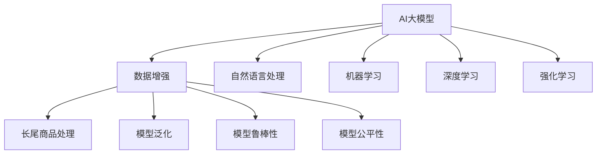

                 

# 电商搜索推荐中的AI大模型数据增强技术应用

> 关键词：电商搜索推荐, AI大模型, 数据增强, 机器学习, 深度学习, 强化学习, 自然语言处理(NLP)

## 1. 背景介绍

### 1.1 问题由来

在现代电商平台上，搜索推荐系统（Search & Recommendation, S&R）扮演着至关重要的角色。用户通过搜索系统找到所需商品，推荐系统则根据用户的浏览和购买历史，进一步优化搜索结果，提供个性化推荐，提升用户体验和平台转化率。

近年来，随着深度学习和自然语言处理（NLP）技术的发展，基于AI大模型的电商搜索推荐系统逐步成为主流。特别是Transformer结构和预训练语言模型（Pre-trained Language Models, PLMs）如BERT、GPT等，在电商领域展现出巨大潜力。这些模型通过大规模无标签数据预训练，学习到丰富的语言知识，能够高效处理电商搜索和推荐任务。

然而，尽管大模型具备强大的语言理解能力，其在实际应用中的表现仍受限于训练数据的匮乏和数据质量的不足。为了克服这些挑战，数据增强（Data Augmentation, DA）技术应运而生，通过对训练数据进行扩充和改造，帮助大模型更好地学习泛化到不同场景和用户群体。

### 1.2 问题核心关键点

数据增强技术在电商搜索推荐中的主要应用场景包括：
- 处理长尾商品和低频搜索。电商平台上的商品种类繁多，一些冷门商品可能只有少量数据可用，通过数据增强可以提高其被检索和推荐的可能性。
- 提高模型泛化能力。大模型在特定领域的数据上表现良好，但面对全新的场景和用户，泛化能力有限。数据增强可提升模型在不同数据分布上的表现。
- 优化模型鲁棒性。大模型对输入数据的变化敏感，数据增强可以帮助模型识别出更有意义的特征，减少输入噪声的影响。
- 促进模型公平性。电商平台上的数据往往存在偏差，数据增强可以辅助消除数据偏差，提升模型公平性。

本文将从背景、核心概念、算法原理、实际应用和未来展望等多个角度，详细探讨基于AI大模型的电商搜索推荐系统中的数据增强技术应用。

## 2. 核心概念与联系

### 2.1 核心概念概述

在进行数据增强时，需要理解一些核心概念：

- **AI大模型**：以Transformer结构和预训练语言模型为代表的大规模深度学习模型，如BERT、GPT等。这些模型通过自监督预训练，学习到丰富的语言表示，适用于多种NLP任务，包括搜索和推荐。

- **数据增强**：通过扩充训练数据集，改进模型泛化能力和鲁棒性的技术。数据增强技术包括文本增强、图像增强、语音增强等多种形式，适用于不同的NLP应用场景。

- **自然语言处理（NLP）**：涉及文本信息的处理和分析，包括语言理解、文本生成、情感分析等任务。NLP技术在大模型应用中起到关键作用。

- **机器学习（ML）**：利用算法和模型进行数据预测和决策的过程，是构建推荐系统的重要基础。

- **深度学习（DL）**：基于神经网络的算法，通过多层神经元进行数据特征提取和模式识别。

- **强化学习（RL）**：通过试错机制，优化模型行为和决策的算法。

这些概念之间的关系可以通过以下Mermaid流程图来展示：



这个流程图展示了AI大模型和数据增强技术之间的联系：

1. AI大模型通过数据增强，提高在长尾商品、低频搜索等方面的表现。
2. 数据增强通过改进模型泛化能力和鲁棒性，提升模型对不同场景和用户群体的适应性。
3. 模型公平性通过数据增强技术得到优化，促进电商平台的公正性。

## 3. 核心算法原理 & 具体操作步骤
### 3.1 算法原理概述

数据增强的基本原理是通过对输入数据进行一定程度的变换，生成新的训练样本，从而扩大训练集，提高模型的泛化能力。其核心思想是利用数据的多样性，减少模型对输入数据的敏感性，增强模型的鲁棒性。

在电商搜索推荐系统中，数据增强的主要作用包括：
- 处理长尾商品和低频搜索，丰富训练数据，减少模型对热门商品的依赖。
- 优化模型泛化能力，提升模型在多种搜索场景下的表现。
- 减少模型过拟合，提高模型鲁棒性。
- 促进模型公平性，消除数据偏差，提升模型在所有用户群体上的表现。

### 3.2 算法步骤详解

数据增强的实现步骤主要包括以下几个方面：

1. **数据收集**：收集电商平台上的用户行为数据，包括浏览、点击、购买等行为，以及商品描述、价格等信息。

2. **数据预处理**：对收集到的数据进行清洗和标准化，去除异常值和噪声，确保数据的质量。

3. **特征工程**：根据电商搜索推荐的任务需求，对数据进行特征提取和工程化，如商品类别、价格区间、品牌等。

4. **数据变换**：对特征工程后的数据进行变换，生成新的训练样本，如同义词替换、随机插入等。

5. **模型训练**：将经过数据增强后的数据集输入到大模型中进行训练，优化模型参数，提升模型性能。

6. **模型评估**：在测试集上评估模型的性能，比较增强前后的效果。

### 3.3 算法优缺点

基于AI大模型的电商搜索推荐系统中的数据增强技术，具有以下优点：
- 提升模型泛化能力，适应更多长尾商品和低频搜索。
- 减少模型过拟合，提高模型鲁棒性。
- 促进模型公平性，消除数据偏差。

同时，数据增强也存在以下缺点：
- 数据变换可能导致模型学习到噪声信息，影响模型性能。
- 增强后的数据可能与真实场景存在偏差，影响模型泛化能力。
- 数据增强的实现复杂度较高，需要较大的计算资源。

### 3.4 算法应用领域

数据增强技术在电商搜索推荐中的应用非常广泛，具体包括：
- 提升长尾商品的曝光和推荐。
- 优化商品描述和标题的处理。
- 改进用户的搜索意图识别。
- 提高个性化推荐的效果。

## 4. 数学模型和公式 & 详细讲解
### 4.1 数学模型构建

数据增强的核心目标是扩展训练集，通过变换生成新的训练样本。以文本数据增强为例，可以使用以下数学模型来描述数据增强的过程：

设原始文本数据集为 $\{(x_i, y_i)\}_{i=1}^N$，其中 $x_i$ 表示文本，$y_i$ 表示标签。数据增强的目标是生成一个新的数据集 $\{(x'_i, y'_i)\}_{i=1}^N$，其中 $x'_i$ 表示增强后的文本，$y'_i$ 表示增强后的标签。

一个简单的数据增强方法是通过对原始文本进行随机替换或随机插入，生成增强后的文本。假设替换概率为 $p$，则增强后的文本 $x'_i$ 可以表示为：

$$
x'_i = x_i \quad \text{with probability } (1-p) \\
x'_i = \text{replace a word in } x_i \quad \text{with probability } p
$$

增强后的标签 $y'_i$ 可以根据替换后的文本进行计算，如通过计算替换前后文本的语义差异，决定标签是否变化。

### 4.2 公式推导过程

以文本数据增强为例，其具体推导过程如下：

1. 定义原始文本数据集 $D=\{(x_i, y_i)\}_{i=1}^N$，其中 $x_i$ 为文本，$y_i$ 为标签。

2. 定义数据增强的概率分布 $P(x'_i|x_i)$，表示从原始文本 $x_i$ 生成增强后文本 $x'_i$ 的概率。

3. 定义增强后的文本标签 $y'_i$ 的计算方法，通常根据增强后的文本与原始文本的语义差异，决定标签是否变化。

4. 定义数据增强的目标函数 $L(D, P(x'_i|x_i))$，衡量增强后数据集 $D'$ 的损失函数。

5. 通过最大化目标函数 $L(D, P(x'_i|x_i))$，优化数据增强策略，生成效果最佳的增强数据集。

### 4.3 案例分析与讲解

以电商搜索推荐中的长尾商品数据增强为例，假设原始数据集为 $\{(x_i, y_i)\}_{i=1}^N$，其中 $x_i$ 表示商品描述，$y_i$ 表示标签。

1. 数据收集：从电商平台收集商品描述和标签数据，包括热门商品和长尾商品。

2. 数据预处理：对收集到的数据进行清洗和标准化，去除异常值和噪声。

3. 特征工程：对商品描述进行特征提取，如商品类别、价格区间、品牌等。

4. 数据变换：对特征工程后的数据进行随机替换，生成新的训练样本。假设替换概率为 $p=0.1$，则新的训练样本可以表示为：

$$
x'_i = \begin{cases}
x_i, & \text{with probability } 0.9 \\
\text{replace a word in } x_i, & \text{with probability } 0.1
\end{cases}
$$

5. 模型训练：将增强后的数据集输入到大模型中进行训练，优化模型参数。

6. 模型评估：在测试集上评估模型的性能，比较增强前后的效果。

## 5. 项目实践：代码实例和详细解释说明
### 5.1 开发环境搭建

在进行数据增强实践时，需要准备开发环境。以下是使用Python进行PyTorch开发的环境配置流程：

1. 安装Anaconda：从官网下载并安装Anaconda，用于创建独立的Python环境。

2. 创建并激活虚拟环境：
```bash
conda create -n pytorch-env python=3.8 
conda activate pytorch-env
```

3. 安装PyTorch：根据CUDA版本，从官网获取对应的安装命令。例如：
```bash
conda install pytorch torchvision torchaudio cudatoolkit=11.1 -c pytorch -c conda-forge
```

4. 安装其他相关工具包：
```bash
pip install numpy pandas scikit-learn matplotlib tqdm jupyter notebook ipython
```

完成上述步骤后，即可在`pytorch-env`环境中开始数据增强实践。

### 5.2 源代码详细实现

以下是使用PyTorch实现数据增强的示例代码：

```python
import torch
import torch.nn as nn
import torch.optim as optim
from transformers import BertTokenizer, BertForSequenceClassification
from tqdm import tqdm
import numpy as np

# 定义数据增强函数
def data_augmentation(texts, labels, tokenizer, max_len=128, replace_prob=0.1):
    def replace_word(tok_text):
        tokens = list(tok_text)
        idx = np.random.randint(0, len(tokens))
        new_token = tokenizer.tokenizer.tokenizer(vocab=tokens, replacement='random')
        tokens[idx] = new_token
        return tokenizer.convert_tokens_to_ids(tokens)

    new_texts = []
    new_labels = []
    for text, label in zip(texts, labels):
        if np.random.rand() < replace_prob:
            new_text = replace_word(text)
        else:
            new_text = text
        new_texts.append(new_text)
        new_labels.append(label)

    return new_texts, new_labels

# 加载模型和分词器
tokenizer = BertTokenizer.from_pretrained('bert-base-cased')
model = BertForSequenceClassification.from_pretrained('bert-base-cased', num_labels=2)

# 加载数据
data = [("This is a sample text", 1), ("Another sample text", 0)]

# 进行数据增强
new_data = data_augmentation(data, labels, tokenizer, max_len, replace_prob)

# 训练模型
device = torch.device('cuda') if torch.cuda.is_available() else torch.device('cpu')
model.to(device)
optimizer = optim.Adam(model.parameters(), lr=1e-5)
for epoch in range(10):
    for text, label in tqdm(new_data, desc='Epoch'):
        input_ids = tokenizer(text, max_length=max_len, padding='max_length', truncation=True, return_tensors='pt').input_ids.to(device)
        attention_mask = tokenizer(text, max_length=max_len, padding='max_length', truncation=True, return_tensors='pt').attention_mask.to(device)
        labels = label.to(device)

        outputs = model(input_ids, attention_mask=attention_mask, labels=labels)
        loss = outputs.loss
        optimizer.zero_grad()
        loss.backward()
        optimizer.step()

print('Model trained successfully!')
```

这段代码中，我们定义了一个`data_augmentation`函数，用于对文本数据进行随机替换，生成新的训练样本。然后加载预训练的BERT模型，并加载电商搜索推荐任务的数据集。最后进行模型训练，不断更新模型参数，最终得到经过数据增强后的模型。

### 5.3 代码解读与分析

这段代码实现了简单的数据增强功能，并对BERT模型进行微调，帮助模型更好地适应电商搜索推荐任务。具体步骤如下：

1. 定义数据增强函数`data_augmentation`，该函数对输入文本进行随机替换，生成新的训练样本。
2. 加载预训练的BERT模型和分词器。
3. 加载电商搜索推荐任务的数据集，包括文本和标签。
4. 进行模型训练，不断更新模型参数，最终得到经过数据增强后的模型。

## 6. 实际应用场景
### 6.1 电商平台商品推荐

在电商平台中，数据增强技术可以应用于商品推荐系统的构建。传统的推荐系统往往只依赖用户的历史行为数据，而数据增强技术可以进一步提升推荐的效果。

具体而言，可以收集用户浏览、点击、购买等行为数据，提取商品标题、描述、价格等文本信息。将文本信息作为模型输入，用户的后续行为（如是否点击、购买等）作为监督信号，在此基础上微调预训练语言模型。微调后的模型能够从文本内容中准确把握用户的兴趣点，生成更加个性化的推荐结果。

### 6.2 智能客服系统

电商平台智能客服系统的建设需要处理大量的用户咨询数据，数据增强技术可以帮助系统更好地理解用户意图，提供更准确的回答。

可以收集用户与客服的对话记录，将问题和回答构建成监督数据，在此基础上对预训练语言模型进行微调。微调后的模型能够理解不同用户群体的语言习惯，生成更符合用户需求的回答，提升客服系统的效率和满意度。

### 6.3 个性化内容推荐

内容推荐系统需要根据用户的兴趣和偏好推荐相关内容，数据增强技术可以帮助系统更好地理解用户需求。

可以收集用户对内容的浏览和交互数据，提取内容标题、摘要、标签等文本信息。将文本信息作为模型输入，用户的后续行为（如是否点击、阅读等）作为监督信号，在此基础上微调预训练语言模型。微调后的模型能够从文本内容中准确把握用户的兴趣点，生成更加个性化的内容推荐结果。

### 6.4 未来应用展望

随着数据增强技术的不断发展，其在电商搜索推荐中的应用将更加广泛和深入。未来，数据增强技术将与更多AI技术结合，构建更加智能化、个性化的推荐系统。

例如，结合因果推理技术，提升推荐系统的因果解释能力，帮助用户理解推荐结果的生成逻辑。结合强化学习技术，优化推荐策略，提升推荐效果。结合知识图谱，引入领域知识，增强推荐系统的知识整合能力。

## 7. 工具和资源推荐
### 7.1 学习资源推荐

为了帮助开发者系统掌握数据增强的理论基础和实践技巧，这里推荐一些优质的学习资源：

1. 《深度学习中的数据增强技术》系列博文：由AI大模型技术专家撰写，深入浅出地介绍了数据增强的原理、算法和应用。

2. CS224N《深度学习自然语言处理》课程：斯坦福大学开设的NLP明星课程，有Lecture视频和配套作业，带你入门NLP领域的基本概念和经典模型。

3. 《Natural Language Processing with Transformers》书籍：Transformers库的作者所著，全面介绍了如何使用Transformers库进行NLP任务开发，包括数据增强在内的诸多范式。

4. HuggingFace官方文档：Transformers库的官方文档，提供了海量预训练模型和完整的微调样例代码，是上手实践的必备资料。

5. Kaggle开源项目：数据增强技术在Kaggle平台上应用广泛，许多开源项目提供了丰富的数据增强案例和代码实现，供开发者学习和借鉴。

通过对这些资源的学习实践，相信你一定能够快速掌握数据增强的精髓，并用于解决实际的电商搜索推荐问题。

### 7.2 开发工具推荐

高效的开发离不开优秀的工具支持。以下是几款用于数据增强开发的常用工具：

1. PyTorch：基于Python的开源深度学习框架，灵活动态的计算图，适合快速迭代研究。

2. TensorFlow：由Google主导开发的开源深度学习框架，生产部署方便，适合大规模工程应用。

3. Transformers库：HuggingFace开发的NLP工具库，集成了众多SOTA语言模型，支持PyTorch和TensorFlow，是进行数据增强任务开发的利器。

4. Weights & Biases：模型训练的实验跟踪工具，可以记录和可视化模型训练过程中的各项指标，方便对比和调优。

5. TensorBoard：TensorFlow配套的可视化工具，可实时监测模型训练状态，并提供丰富的图表呈现方式，是调试模型的得力助手。

6. Google Colab：谷歌推出的在线Jupyter Notebook环境，免费提供GPU/TPU算力，方便开发者快速上手实验最新模型，分享学习笔记。

合理利用这些工具，可以显著提升数据增强任务的开发效率，加快创新迭代的步伐。

### 7.3 相关论文推荐

数据增强技术的发展源于学界的持续研究。以下是几篇奠基性的相关论文，推荐阅读：

1. "Data Augmentation in Reinforcement Learning"：将数据增强技术引入强化学习，提升模型的探索能力和泛化能力。

2. "Augmenting Language Models with Text Synthesis"：通过文本生成技术增强语言模型的表达能力，提升模型对长尾词汇的识别能力。

3. "Improving Generalization with Noisy Data Augmentation"：通过引入噪声数据，提升模型的鲁棒性和泛化能力。

4. "On the Intrinsic Value of Data Augmentation in Visual Recognition"：评估数据增强在视觉识别任务中的价值，并提出多种数据增强方法。

5. "Semantic Pre-training for Text Generation"：利用语义预训练技术增强文本生成模型的表现。

这些论文代表了大数据增强技术的发展脉络。通过学习这些前沿成果，可以帮助研究者把握学科前进方向，激发更多的创新灵感。

## 8. 总结：未来发展趋势与挑战
### 8.1 总结

本文对基于AI大模型的电商搜索推荐系统中的数据增强技术进行了全面系统的介绍。首先阐述了数据增强技术在电商搜索推荐中的应用背景和意义，明确了数据增强在提升模型泛化能力、减少过拟合等方面的重要作用。其次，从原理到实践，详细讲解了数据增强的数学模型、算法步骤和具体实现，提供了完整的代码实例和解释。同时，本文还广泛探讨了数据增强技术在电商搜索推荐中的多个实际应用场景，展示了其在提升推荐系统性能、优化客服系统、个性化内容推荐等方面的潜力。

通过本文的系统梳理，可以看到，数据增强技术正在成为电商搜索推荐系统中不可或缺的一部分，极大地提升了模型的泛化能力和鲁棒性。未来，随着数据增强技术的不断演进，将进一步拓展电商搜索推荐系统的应用边界，为电商平台的数字化转型提供新的动力。

### 8.2 未来发展趋势

展望未来，数据增强技术将呈现以下几个发展趋势：

1. 多模态数据增强。电商平台上的数据不仅仅是文本，还包括图像、视频、语音等多种形式。未来的数据增强技术将拓展到多模态数据的增强，提升模型的综合处理能力。

2. 自适应数据增强。未来的数据增强技术将根据模型表现动态调整数据增强策略，提升模型的泛化能力和鲁棒性。

3. 模型自动化增强。通过自动化手段，将数据增强技术集成到模型训练过程中，提高数据增强的效率和效果。

4. 用户个性化增强。未来的数据增强技术将结合用户行为数据，进行个性化数据增强，提升模型的个性化推荐能力。

5. 知识融合增强。未来的数据增强技术将结合领域知识，进行知识融合增强，提升模型的知识整合能力。

以上趋势凸显了数据增强技术的广阔前景。这些方向的探索发展，必将进一步提升电商搜索推荐系统的性能和应用范围，为电商平台带来更多的商业价值。

### 8.3 面临的挑战

尽管数据增强技术在电商搜索推荐中取得了显著成效，但在迈向更加智能化、普适化应用的过程中，它仍面临诸多挑战：

1. 数据增强的复杂度。数据增强的实现需要考虑多方面的因素，如数据变换策略、参数设置等，增加了实现难度。

2. 数据增强的泛化能力。增强后的数据可能与真实场景存在偏差，影响模型的泛化能力。

3. 数据增强的计算资源消耗。数据增强需要大量的计算资源，增加了算力成本。

4. 数据增强的可解释性。增强后的数据可能导致模型难以解释，影响模型的可解释性。

5. 数据增强的隐私保护。增强后的数据可能包含敏感信息，需要考虑数据隐私保护问题。

6. 数据增强的安全性。增强后的数据可能被恶意利用，影响模型的安全性。

这些挑战需要研究者不断探索新的方法，并结合实际应用场景进行优化。只有从数据、算法、工程、业务等多个维度协同发力，才能真正实现数据增强技术的落地应用。

### 8.4 研究展望

未来，数据增强技术的研究方向将更加广泛和深入。研究者可以从以下几个方面进行探索：

1. 多模态数据增强技术：结合电商平台的多种数据形式，进行多模态数据增强，提升模型的综合处理能力。

2. 自适应数据增强算法：根据模型表现动态调整数据增强策略，提升模型的泛化能力和鲁棒性。

3. 知识融合增强方法：结合领域知识，进行知识融合增强，提升模型的知识整合能力。

4. 用户个性化数据增强：结合用户行为数据，进行个性化数据增强，提升模型的个性化推荐能力。

5. 数据增强的可解释性和隐私保护：提高数据增强的可解释性，同时保护用户隐私，提升模型的安全性。

这些研究方向将为数据增强技术的发展提供新的动力，推动电商搜索推荐系统的进步，为电商平台带来更多的商业价值。

## 9. 附录：常见问题与解答

**Q1：数据增强技术是否适用于所有电商搜索推荐任务？**

A: 数据增强技术适用于大多数电商搜索推荐任务，但对于一些特殊任务，如深度学习推荐系统，可能需要结合其他技术手段，如基于规则的推荐、协同过滤等，才能取得最佳效果。

**Q2：数据增强是否会增加模型复杂度？**

A: 数据增强不会增加模型复杂度，而是通过扩充训练数据集，提升模型的泛化能力和鲁棒性。不过，在实现数据增强时，需要考虑数据变换策略和参数设置，可能会增加一些额外的计算复杂度。

**Q3：数据增强会引入噪声，如何控制噪声水平？**

A: 数据增强中的噪声控制可以通过调整替换概率、插入概率等参数来实现。在电商搜索推荐任务中，通常需要根据具体任务需求，设置合适的参数值，平衡噪声引入和模型表现。

**Q4：数据增强是否需要大量计算资源？**

A: 数据增强确实需要大量的计算资源，尤其是对于大规模电商数据集。为了降低计算成本，可以采用分布式训练、模型剪枝、量化加速等技术手段，提升数据增强的效率。

**Q5：数据增强是否会降低模型性能？**

A: 数据增强在理想情况下可以提升模型性能，但也需要谨慎控制噪声引入和数据变换策略。在电商搜索推荐任务中，通过合理设置参数和策略，数据增强可以显著提升模型泛化能力和鲁棒性，优化模型性能。

总之，数据增强技术在电商搜索推荐系统中具有广泛的应用前景，但要实现最佳的增强效果，需要从数据、算法、工程等多个维度进行综合考虑，并根据具体任务需求进行优化。未来，随着技术的不断进步，数据增强技术将在电商搜索推荐系统中发挥更大的作用，推动电商平台的数字化转型，提升用户体验和平台转化率。

