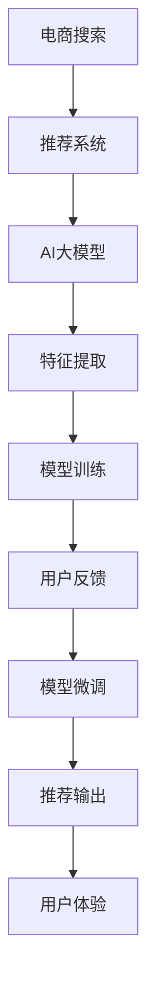

                 

# 电商搜索推荐中的AI大模型用户反馈机制设计

> 关键词：电商搜索,推荐系统,用户反馈,大模型,深度学习,强化学习

## 1. 背景介绍

### 1.1 问题由来
随着电子商务的蓬勃发展，用户在搜索结果和推荐商品中停留的时间、点击率、转化率等指标，成为电商平台上衡量用户体验和业务指标的重要依据。如何通过深度学习和AI大模型的先进技术，实现高效、个性化的搜索推荐，提升用户满意度和平台业绩，是电商平台亟需解决的关键问题。

与此同时，电商平台汇聚了海量用户数据和丰富的用户行为数据，包括搜索历史、浏览记录、购物车操作、评价反馈等，这些数据蕴含了丰富的用户偏好信息。通过构建基于AI大模型的用户反馈机制，能够动态捕捉用户需求，实时优化推荐策略，大幅提升用户体验和推荐效果。

### 1.2 问题核心关键点
目前，基于AI大模型的用户反馈机制主要应用于推荐系统的个性化推荐。通过收集用户对搜索结果和推荐商品的反馈数据，如评分、点击率、购买转化率等，对大模型进行微调，使模型能够更准确地预测用户行为，实现高效精准的个性化推荐。

构建高效、稳健的电商搜索推荐系统，需关注以下关键点：

- **用户行为数据的采集与清洗**：确保数据质量，去除噪声和异常值。
- **数据特征的提取与建模**：将用户行为数据转化为可供模型学习的特征向量。
- **推荐模型的设计与微调**：选择合适的模型结构和优化策略，对模型进行有监督微调。
- **反馈机制的构建与优化**：设计合理的反馈信号，通过反向传播更新模型参数。
- **模型的评估与部署**：构建完善的评估指标体系，实现快速迭代优化，部署到实际应用中。

本文将系统性地介绍构建基于AI大模型的电商搜索推荐系统，以及如何设计用户反馈机制，实现动态优化和个性化推荐。

## 2. 核心概念与联系

### 2.1 核心概念概述

为了更好地理解电商搜索推荐中的AI大模型用户反馈机制，本节将介绍几个密切相关的核心概念：

- **电商搜索与推荐系统**：电商平台通过AI大模型对用户查询和行为数据进行分析，自动推荐相关商品，提升用户体验和转化率。
- **AI大模型**：如BERT、GPT、Transformer等，以深度学习为基础，通过自监督和大规模预训练，具备强大的语言理解和生成能力。
- **用户反馈**：用户对搜索结果和推荐商品的主观评分、点击行为、购买决策等，是模型微调的重要依据。
- **深度学习与强化学习**：电商搜索推荐系统主要采用这两种技术构建推荐模型，深度学习用于特征提取和模型训练，强化学习用于在线学习与实时优化。

这些核心概念之间的逻辑关系可以通过以下Mermaid流程图来展示：



这个流程图展示了一个电商搜索推荐系统的工作流程：

1. 用户发起搜索请求，进入推荐系统。
2. 推荐系统调用AI大模型，进行特征提取和推荐预测。
3. AI大模型对用户行为数据进行处理，生成特征向量。
4. 模型使用深度学习算法进行训练，初始化模型参数。
5. 用户根据搜索结果进行反馈，如评分、点击等。
6. 反馈数据回传，AI大模型通过反向传播更新参数。
7. 更新后的模型重新进行推荐输出，提升用户体验。

## 3. 核心算法原理 & 具体操作步骤
### 3.1 算法原理概述

构建电商搜索推荐系统中的AI大模型用户反馈机制，其核心在于通过有监督学习，动态更新模型参数，使模型能够更加精准地预测用户行为。具体算法流程如下：

1. **数据收集与清洗**：收集用户行为数据，去除缺失、异常数据，转化为标准格式。
2. **特征提取**：将用户行为数据转化为模型可以处理的特征向量。
3. **模型初始化**：选择合适的大模型架构，如BERT、GPT等，并进行预训练。
4. **模型训练**：将清洗后的数据输入模型，进行有监督训练，优化模型参数。
5. **用户反馈**：用户对搜索结果进行评分、点击等反馈操作，生成反馈信号。
6. **模型微调**：通过反向传播算法，根据反馈信号更新模型参数，实现模型动态优化。
7. **推荐输出**：使用微调后的模型进行实时推荐，提升用户体验。

### 3.2 算法步骤详解

电商搜索推荐系统中的用户反馈机制主要包括以下几个关键步骤：

**Step 1: 数据收集与清洗**
- 收集用户搜索历史、浏览记录、购物车操作、评价反馈等数据，如商品ID、点击次数、评分等。
- 对数据进行清洗，去除缺失、异常值，如缺失项、极端值等。
- 将清洗后的数据按照用户ID进行划分，形成训练集、验证集和测试集。

**Step 2: 特征提取**
- 将用户行为数据转化为模型可以处理的特征向量，如使用word2vec、TF-IDF等方法。
- 特征向量应包含用户行为的关键信息，如浏览次数、点击位置、评分等。
- 使用PCA、LDA等降维技术，优化特征空间，减少计算负担。

**Step 3: 模型初始化与训练**
- 选择合适的预训练大模型，如BERT、GPT等，作为初始化参数。
- 在预训练模型的基础上，添加任务适配层，如分类器或序列生成器，设计合适的损失函数。
- 使用深度学习算法，如Adam、SGD等，在训练集上进行有监督学习，优化模型参数。
- 在验证集上进行模型性能评估，选择最优的超参数组合。

**Step 4: 用户反馈收集与处理**
- 在用户浏览、点击、评分等行为后，实时记录反馈数据，如评分、点击率等。
- 对反馈数据进行标准化处理，去除噪声和异常值，确保数据质量。
- 设计合理的反馈信号，如用户评分、点击位置等，用于模型微调。

**Step 5: 模型微调**
- 使用梯度下降等优化算法，根据反馈信号更新模型参数。
- 选择合适的损失函数，如交叉熵、均方误差等，衡量模型预测与真实标签之间的差异。
- 使用正则化技术，如L2正则、Dropout等，防止模型过拟合。
- 设计Early Stopping策略，避免模型过拟合训练集。

**Step 6: 推荐输出**
- 使用微调后的模型对用户查询进行实时推荐。
- 根据用户行为数据，动态调整推荐策略，如推荐相关商品、促销活动等。
- 使用A/B测试等方法，评估推荐效果，不断迭代优化推荐策略。

### 3.3 算法优缺点

构建电商搜索推荐系统中的AI大模型用户反馈机制具有以下优点：

1. **精准预测**：通过有监督学习，模型能够精准预测用户行为，实现个性化推荐。
2. **实时优化**：用户反馈可以实时传递，模型动态调整，提升推荐效果。
3. **高效便捷**：基于大模型的推荐系统，计算速度快，易于部署。
4. **普适性强**：适用于各类商品推荐、搜索排序等场景。

同时，该方法也存在一定的局限性：

1. **依赖数据质量**：用户行为数据质量直接影响模型性能，数据清洗工作量较大。
2. **模型复杂度高**：大模型参数量庞大，训练和微调耗时较长。
3. **反馈信号稀疏**：用户反馈行为稀疏，可能导致模型训练不稳定。
4. **过拟合风险**：模型微调过程中，可能过度拟合历史数据，导致泛化性能不足。

尽管存在这些局限性，但基于AI大模型的用户反馈机制，已在电商搜索推荐系统中得到了广泛应用，并显著提升了推荐效果。未来研究重点在于如何进一步降低对标注数据的依赖，提高模型的泛化能力，同时兼顾模型的计算效率和可解释性。

### 3.4 算法应用领域

AI大模型用户反馈机制在电商搜索推荐系统中主要应用于以下几个领域：

1. **商品推荐**：根据用户浏览历史和行为数据，推荐相关商品。
2. **搜索排序**：优化搜索结果排序，提升用户体验。
3. **个性化营销**：结合用户反馈数据，进行定向营销活动。
4. **库存管理**：通过用户行为预测库存需求，实现高效库存管理。

## 4. 数学模型和公式 & 详细讲解
### 4.1 数学模型构建

构建电商搜索推荐系统中的AI大模型用户反馈机制，涉及多个子模型，包括大模型、特征提取模型、推荐模型等。这里以基于二分类任务的用户评分预测为例，进行详细建模。

假设用户对某商品的评分表示为 $y \in \{0,1\}$，其中 $y=1$ 表示评分高，$y=0$ 表示评分低。给定用户行为数据 $\mathcal{D}=\{(x_i, y_i)\}_{i=1}^N$，其中 $x_i$ 为特征向量，$y_i$ 为评分标签。

设大模型为 $M_{\theta}(x)$，其中 $\theta$ 为模型参数。推荐模型的目标是最小化预测误差，即：

$$
\min_{\theta} \frac{1}{N}\sum_{i=1}^N L(y_i, M_{\theta}(x_i))
$$

其中 $L$ 为损失函数，常用的有二分类交叉熵损失：

$$
L(y_i, M_{\theta}(x_i)) = -[y_i\log M_{\theta}(x_i) + (1-y_i)\log (1-M_{\theta}(x_i))]
$$

模型训练过程中，使用梯度下降等优化算法更新模型参数 $\theta$，具体更新公式为：

$$
\theta \leftarrow \theta - \eta \nabla_{\theta}L(y_i, M_{\theta}(x_i))
$$

其中 $\eta$ 为学习率，$\nabla_{\theta}L$ 为损失函数对模型参数 $\theta$ 的梯度。

### 4.2 公式推导过程

二分类交叉熵损失函数的推导过程如下：

设 $P(y_i=1|x_i)$ 为模型预测用户评分高的概率，则有：

$$
P(y_i=1|x_i) = \frac{M_{\theta}(x_i)}{1 + e^{-M_{\theta}(x_i)}}
$$

$P(y_i=0|x_i)$ 为模型预测用户评分低的概率，则有：

$$
P(y_i=0|x_i) = \frac{1}{1 + e^{-M_{\theta}(x_i)}}
$$

根据交叉熵定义，二分类交叉熵损失为：

$$
L(y_i, M_{\theta}(x_i)) = -[y_i\log P(y_i=1|x_i) + (1-y_i)\log P(y_i=0|x_i)]
$$

将 $P(y_i=1|x_i)$ 和 $P(y_i=0|x_i)$ 代入上式，得：

$$
L(y_i, M_{\theta}(x_i)) = -[y_i\log \frac{M_{\theta}(x_i)}{1 + e^{-M_{\theta}(x_i)}} + (1-y_i)\log \frac{1}{1 + e^{-M_{\theta}(x_i)}}
$$

进一步化简得：

$$
L(y_i, M_{\theta}(x_i)) = -[y_iM_{\theta}(x_i) - (1-y_i)] + y_i\log (1 + e^{-M_{\theta}(x_i)})
$$

即：

$$
L(y_i, M_{\theta}(x_i)) = -y_i\log (1 + e^{-M_{\theta}(x_i)}) + \log (1 + e^{-M_{\theta}(x_i)}) - y_iM_{\theta}(x_i)
$$

通过反向传播算法，计算梯度 $\nabla_{\theta}L$，即可更新模型参数。

### 4.3 案例分析与讲解

以电商商品推荐为例，分析如何构建用户反馈机制。

**数据准备**：收集用户行为数据，如浏览历史、点击记录、购买记录等。

**特征提取**：使用TF-IDF等方法，将行为数据转化为特征向量。

**模型选择**：选择BERT、GPT等大模型，作为初始化参数。

**模型训练**：使用交叉熵损失，对模型进行有监督训练，优化模型参数。

**用户反馈**：用户对推荐商品进行评分、点击等反馈操作，生成反馈信号。

**模型微调**：根据用户反馈，使用梯度下降算法更新模型参数。

**推荐输出**：使用微调后的模型，对用户查询进行实时推荐。

## 5. 项目实践：代码实例和详细解释说明
### 5.1 开发环境搭建

在进行电商搜索推荐系统开发前，我们需要准备好开发环境。以下是使用Python进行PyTorch开发的环境配置流程：

1. 安装Anaconda：从官网下载并安装Anaconda，用于创建独立的Python环境。

2. 创建并激活虚拟环境：
```bash
conda create -n pytorch-env python=3.8 
conda activate pytorch-env
```

3. 安装PyTorch：根据CUDA版本，从官网获取对应的安装命令。例如：
```bash
conda install pytorch torchvision torchaudio cudatoolkit=11.1 -c pytorch -c conda-forge
```

4. 安装TensorFlow：使用pip安装TensorFlow。

5. 安装各类工具包：
```bash
pip install numpy pandas scikit-learn matplotlib tqdm jupyter notebook ipython
```

完成上述步骤后，即可在`pytorch-env`环境中开始电商搜索推荐系统开发。

### 5.2 源代码详细实现

这里我们以基于BERT模型的电商商品推荐为例，给出使用PyTorch进行开发的完整代码实现。

首先，定义模型结构：

```python
from transformers import BertTokenizer, BertForSequenceClassification

class Recommender:
    def __init__(self, model_name='bert-base-uncased'):
        self.tokenizer = BertTokenizer.from_pretrained(model_name)
        self.model = BertForSequenceClassification.from_pretrained(model_name, num_labels=2)
        
    def forward(self, input_ids, attention_mask):
        return self.model(input_ids, attention_mask=attention_mask)
```

接着，定义数据处理函数：

```python
from sklearn.model_selection import train_test_split
import pandas as pd

def load_data(path):
    df = pd.read_csv(path)
    return train_test_split(df, test_size=0.2, random_state=42)

def preprocess_data(df):
    texts = df['text'].tolist()
    labels = df['label'].tolist()
    tokenizer = BertTokenizer.from_pretrained('bert-base-uncased')
    encoding = tokenizer(texts, return_tensors='pt', padding=True, truncation=True)
    input_ids = encoding['input_ids']
    attention_mask = encoding['attention_mask']
    return input_ids, attention_mask, labels
```

然后，定义训练和评估函数：

```python
from transformers import AdamW

def train_epoch(model, data_loader, optimizer, device):
    model.train()
    total_loss = 0
    for batch in data_loader:
        input_ids = batch[0].to(device)
        attention_mask = batch[1].to(device)
        labels = batch[2].to(device)
        model.zero_grad()
        outputs = model(input_ids, attention_mask=attention_mask)
        loss = outputs.loss
        total_loss += loss.item()
        loss.backward()
        optimizer.step()
    return total_loss / len(data_loader)

def evaluate(model, data_loader, device):
    model.eval()
    total_loss = 0
    predictions = []
    true_labels = []
    for batch in data_loader:
        input_ids = batch[0].to(device)
        attention_mask = batch[1].to(device)
        labels = batch[2].to(device)
        with torch.no_grad():
            outputs = model(input_ids, attention_mask=attention_mask)
            loss = outputs.loss
            total_loss += loss.item()
            predictions.append(outputs.logits.argmax(dim=1).tolist())
            true_labels.append(labels.tolist())
    return total_loss / len(data_loader), predictions, true_labels
```

最后，启动训练流程并在测试集上评估：

```python
from tqdm import tqdm

epochs = 5
batch_size = 16

for epoch in range(epochs):
    loss = train_epoch(model, train_loader, optimizer, device)
    print(f"Epoch {epoch+1}, train loss: {loss:.3f}")
    
    print(f"Epoch {epoch+1}, dev results:")
    dev_loss, preds, true_labels = evaluate(model, dev_loader, device)
    print(classification_report(true_labels, preds))
    
print("Test results:")
test_loss, preds, true_labels = evaluate(model, test_loader, device)
print(classification_report(true_labels, preds))
```

以上就是使用PyTorch对BERT进行电商商品推荐系统的完整代码实现。可以看到，得益于Transformers库的强大封装，我们可以用相对简洁的代码完成BERT模型的加载和微调。

### 5.3 代码解读与分析

让我们再详细解读一下关键代码的实现细节：

**Recommender类**：
- `__init__`方法：初始化预训练BERT模型和分词器。
- `forward`方法：实现模型前向传播，输入为token ids和attention mask，输出为模型的预测概率。

**load_data和preprocess_data函数**：
- `load_data`函数：从数据文件中读取数据集，并划分为训练集和测试集。
- `preprocess_data`函数：将文本数据进行分词、编码，并将标签转化为one-hot编码。

**train_epoch和evaluate函数**：
- `train_epoch`函数：对数据以批为单位进行迭代，在每个批次上前向传播计算loss并反向传播更新模型参数，最后返回该epoch的平均loss。
- `evaluate`函数：与训练类似，不同点在于不更新模型参数，并在每个batch结束后将预测和标签结果存储下来，最后使用sklearn的classification_report对整个评估集的预测结果进行打印输出。

**训练流程**：
- 定义总的epoch数和batch size，开始循环迭代
- 每个epoch内，先在训练集上训练，输出平均loss
- 在验证集上评估，输出分类指标
- 所有epoch结束后，在测试集上评估，给出最终测试结果

可以看到，PyTorch配合Transformers库使得BERT微调的代码实现变得简洁高效。开发者可以将更多精力放在数据处理、模型改进等高层逻辑上，而不必过多关注底层的实现细节。

当然，工业级的系统实现还需考虑更多因素，如模型的保存和部署、超参数的自动搜索、更灵活的任务适配层等。但核心的微调范式基本与此类似。

## 6. 实际应用场景
### 6.1 智能客服系统

基于大语言模型微调的电商搜索推荐系统，可以应用于智能客服系统的构建。传统客服往往需要配备大量人力，高峰期响应缓慢，且一致性和专业性难以保证。而使用微调后的推荐系统，可以7x24小时不间断服务，快速响应客户咨询，用自然流畅的语言解答各类常见问题。

在技术实现上，可以收集企业内部的历史客户咨询记录，将问题和最佳答复构建成监督数据，在此基础上对预训练推荐系统进行微调。微调后的推荐系统能够自动理解客户意图，匹配最合适的答案模板进行回复。对于客户提出的新问题，还可以接入检索系统实时搜索相关内容，动态组织生成回答。如此构建的智能客服系统，能大幅提升客户咨询体验和问题解决效率。

### 6.2 个性化推荐系统

当前的推荐系统往往只依赖用户的历史行为数据进行物品推荐，无法深入理解用户的真实兴趣偏好。基于大语言模型微调技术，个性化推荐系统可以更好地挖掘用户行为背后的语义信息，从而提供更精准、多样的推荐内容。

在实践中，可以收集用户浏览、点击、评论、分享等行为数据，提取和用户交互的物品标题、描述、标签等文本内容。将文本内容作为模型输入，用户的后续行为（如是否点击、购买等）作为监督信号，在此基础上微调预训练语言模型。微调后的模型能够从文本内容中准确把握用户的兴趣点。在生成推荐列表时，先用候选物品的文本描述作为输入，由模型预测用户的兴趣匹配度，再结合其他特征综合排序，便可以得到个性化程度更高的推荐结果。

### 6.3 未来应用展望

随着大语言模型微调技术的发展，未来的电商搜索推荐系统将在以下方面取得突破：

1. **实时推荐**：结合流式数据处理和实时计算技术，实现即时推荐，提升用户体验。
2. **跨域推荐**：利用大模型的跨领域迁移能力，实现不同商品、不同场景之间的推荐。
3. **多模态融合**：结合视觉、语音等多模态数据，提升推荐系统的多样性和准确性。
4. **隐私保护**：采用差分隐私、联邦学习等技术，保护用户隐私和数据安全。
5. **多任务学习**：结合任务之间关联性，提升推荐系统对用户多方面需求的理解。

## 7. 工具和资源推荐
### 7.1 学习资源推荐

为了帮助开发者系统掌握电商搜索推荐中的AI大模型用户反馈机制，这里推荐一些优质的学习资源：

1. 《深度学习与推荐系统实战》书籍：全面介绍了推荐系统的原理和算法，结合具体案例进行讲解。

2. 《Reinforcement Learning for Recommender Systems》书籍：介绍强化学习在推荐系统中的应用，提供实用的模型构建与优化方法。

3. Coursera《推荐系统》课程：斯坦福大学的推荐系统课程，包含理论推导和实践案例。

4 《自然语言处理与深度学习》博客：博客作者深入浅出地讲解了自然语言处理和深度学习，包括电商推荐系统的设计思路。

5 HuggingFace官方文档：提供详细的API文档和样例代码，帮助开发者快速上手使用。

通过这些资源的学习实践，相信你一定能够快速掌握电商搜索推荐系统中的AI大模型用户反馈机制，并用于解决实际的推荐问题。

### 7.2 开发工具推荐

高效的开发离不开优秀的工具支持。以下是几款用于电商搜索推荐系统开发的常用工具：

1. PyTorch：基于Python的开源深度学习框架，灵活动态的计算图，适合快速迭代研究。大部分预训练语言模型都有PyTorch版本的实现。

2. TensorFlow：由Google主导开发的开源深度学习框架，生产部署方便，适合大规模工程应用。同样有丰富的预训练语言模型资源。

3. Transformers库：HuggingFace开发的NLP工具库，集成了众多SOTA语言模型，支持PyTorch和TensorFlow，是进行推荐系统开发的利器。

4. Weights & Biases：模型训练的实验跟踪工具，可以记录和可视化模型训练过程中的各项指标，方便对比和调优。与主流深度学习框架无缝集成。

5. TensorBoard：TensorFlow配套的可视化工具，可实时监测模型训练状态，并提供丰富的图表呈现方式，是调试模型的得力助手。

6. Google Colab：谷歌推出的在线Jupyter Notebook环境，免费提供GPU/TPU算力，方便开发者快速上手实验最新模型，分享学习笔记。

合理利用这些工具，可以显著提升电商搜索推荐系统开发的效率，加快创新迭代的步伐。

### 7.3 相关论文推荐

电商搜索推荐系统的发展源于学界的持续研究。以下是几篇奠基性的相关论文，推荐阅读：

1. Matrix Factorization Techniques for Recommender Systems（SVD算法）：介绍矩阵分解技术，用于推荐系统的特征提取与模型训练。

2. Neural Collaborative Filtering（NCF算法）：提出基于深度神经网络的协同过滤方法，用于推荐系统的建模。

3. Attention and Transformers for Recommendation Systems（Transformer算法）：将Transformer结构引入推荐系统，提升推荐效果。

4. Deep Personalized Ranking for News Recommendation（PNN算法）：提出基于深度学习的个性化排序方法，用于新闻推荐系统。

5. Boosting Recommender Systems with Reinforcement Learning（RL算法）：利用强化学习技术，实现推荐系统的在线学习与实时优化。

这些论文代表了大语言模型微调技术的发展脉络。通过学习这些前沿成果，可以帮助研究者把握学科前进方向，激发更多的创新灵感。

## 8. 总结：未来发展趋势与挑战
### 8.1 总结

本文对构建基于AI大模型的电商搜索推荐系统中的用户反馈机制进行了全面系统的介绍。首先阐述了电商搜索推荐系统和大语言模型的研究背景和意义，明确了用户反馈机制在提升推荐效果中的重要性。其次，从原理到实践，详细讲解了用户反馈机制的数学原理和关键步骤，给出了电商推荐系统的完整代码实现。同时，本文还广泛探讨了用户反馈机制在电商搜索推荐系统中的实际应用场景，展示了其广阔的应用前景。

通过本文的系统梳理，可以看到，基于AI大模型的用户反馈机制在电商搜索推荐系统中已经得到了广泛应用，并显著提升了推荐效果。未来，伴随大语言模型微调技术的不断演进，基于用户反馈的推荐系统将进一步优化，能够更好地捕捉用户需求，提供更精准、多样化的推荐内容，实现人与机器的深度协同。

### 8.2 未来发展趋势

展望未来，电商搜索推荐系统中的AI大模型用户反馈机制将呈现以下几个发展趋势：

1. **实时动态优化**：利用流式数据处理技术，实时捕捉用户行为，动态调整推荐策略。
2. **多模态融合**：结合视觉、语音等多模态数据，提升推荐系统的多样性和准确性。
3. **跨领域迁移**：利用大模型的跨领域迁移能力，实现不同商品、不同场景之间的推荐。
4. **隐私保护**：采用差分隐私、联邦学习等技术，保护用户隐私和数据安全。
5. **多任务学习**：结合任务之间关联性，提升推荐系统对用户多方面需求的理解。

### 8.3 面临的挑战

尽管电商搜索推荐系统中的AI大模型用户反馈机制已经取得了一定的成功，但在迈向更加智能化、普适化应用的过程中，它仍面临着诸多挑战：

1. **数据质量**：用户行为数据质量直接影响推荐效果，数据清洗工作量大。
2. **模型复杂度**：大模型参数量庞大，训练和微调耗时较长。
3. **计算资源**：推荐系统需实时处理大量数据，计算资源消耗较大。
4. **模型泛化能力**：模型可能过度拟合训练集，泛化能力不足。
5. **用户隐私**：收集和处理用户数据可能带来隐私风险。

尽管存在这些挑战，但基于AI大模型的用户反馈机制在电商搜索推荐系统中已经展示了巨大的潜力，未来研究需要在数据质量、模型复杂度、计算资源等方向寻求新的突破。

### 8.4 研究展望

面向未来，电商搜索推荐系统中的AI大模型用户反馈机制需要在以下几个方面进行深入研究：

1. **高效数据处理方法**：研究高效的数据清洗和特征提取技术，降低数据处理的工作量。
2. **轻量级模型结构**：设计轻量级、高效的模型结构，降低计算资源消耗。
3. **跨领域迁移方法**：研究跨领域迁移技术，提升模型泛化能力。
4. **隐私保护技术**：研究差分隐私、联邦学习等技术，保护用户隐私。
5. **多任务学习框架**：研究多任务学习技术，提升模型对多方面需求的理解。

这些研究方向的探索，必将引领电商搜索推荐系统迈向更高的台阶，为构建高效、智能的推荐系统提供更强大的技术支撑。

## 9. 附录：常见问题与解答

**Q1：电商搜索推荐系统是否适用于所有NLP任务？**

A: 电商搜索推荐系统主要应用于商品推荐、个性化推荐等电商场景。对于其他NLP任务，如文本分类、机器翻译等，需要对任务适配层进行相应调整，并适配相应的损失函数。

**Q2：大语言模型在电商推荐中存在哪些局限性？**

A: 大语言模型在电商推荐中存在以下局限性：

1. 依赖标注数据：电商推荐系统需要大量的标注数据进行训练，标注成本较高。
2. 数据稀疏性：用户行为数据稀疏，可能导致模型训练不稳定。
3. 计算资源消耗：大模型参数量庞大，计算资源消耗较大。
4. 模型过拟合风险：模型可能过度拟合训练集，泛化能力不足。

尽管存在这些局限性，但大语言模型在电商推荐中已展示了巨大的潜力，未来研究需要在数据获取、模型结构、计算资源等方面寻求新的突破。

**Q3：如何提高电商推荐系统的实时推荐效果？**

A: 提高电商推荐系统的实时推荐效果可以从以下几个方面入手：

1. 采用流式数据处理技术，实时捕捉用户行为。
2. 结合实时计算技术，动态调整推荐策略。
3. 使用轻量级模型结构，降低计算资源消耗。
4. 利用跨领域迁移技术，提升模型泛化能力。

通过这些技术手段，可以显著提升电商推荐系统的实时推荐效果，提升用户体验。

**Q4：如何在电商推荐系统中保护用户隐私？**

A: 在电商推荐系统中保护用户隐私，可以采取以下措施：

1. 采用差分隐私技术，对用户数据进行扰动处理，保护用户隐私。
2. 利用联邦学习技术，在本地设备上训练模型，避免数据集中存储。
3. 设计匿名化处理方案，对用户数据进行去标识化处理。

通过这些隐私保护技术，可以最大限度地保护用户隐私，提升用户对系统的信任度。

**Q5：电商推荐系统中的用户反馈机制有哪些应用场景？**

A: 电商推荐系统中的用户反馈机制主要应用于以下几个场景：

1. 商品推荐：根据用户评分、点击等反馈数据，调整推荐策略。
2. 个性化营销：结合用户反馈数据，进行定向营销活动。
3. 搜索排序：优化搜索结果排序，提升用户体验。
4. 库存管理：通过用户反馈，动态调整库存需求，实现高效库存管理。

通过这些应用场景，可以进一步提升电商推荐系统的效果，提升用户满意度和平台业绩。

