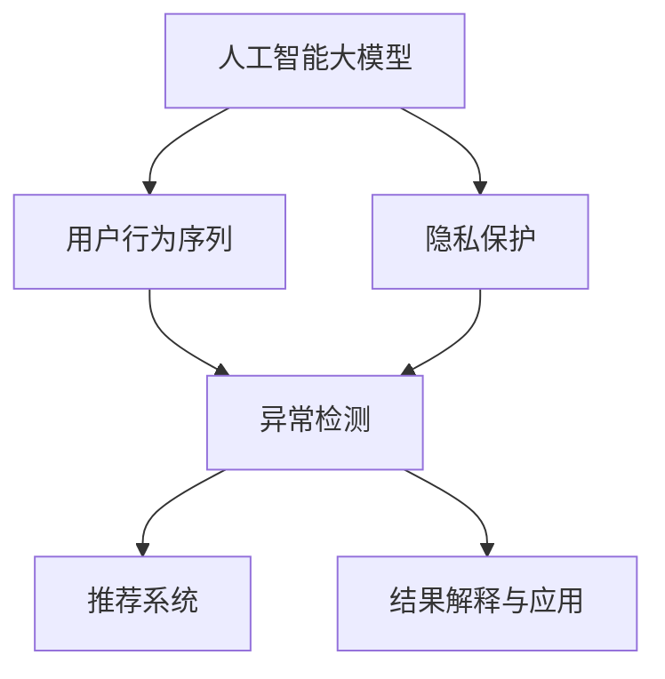

                 

# 电商搜索推荐中的AI大模型用户行为序列异常检测模型评测报告

## 1. 背景介绍

### 1.1 问题由来

电商搜索推荐系统是电商平台的核心功能之一，旨在帮助用户快速找到所需商品，提升用户体验，增加交易转化。随着互联网技术的发展和用户需求的不断变化，搜索推荐系统的复杂性和难度也在不断提高。特别是在面对海量用户行为数据时，如何从大量数据中提取出有价值的用户偏好和行为特征，实现个性化推荐，成为了技术攻关的重要课题。

为了解决这一问题，人工智能大模型在电商搜索推荐中得到了广泛应用。大模型通过预训练在大规模无标签数据上学习丰富的语言和行为特征，可以自动从海量的用户行为数据中提取出具有代表性的信息，用于推荐模型的训练和优化。然而，大规模用户行为数据的生成和使用也带来了新的挑战，如数据隐私保护、模型泛化能力等。

针对这些问题，人工智能大模型用户行为序列异常检测技术应运而生。通过利用大模型强大的语义理解能力和模式识别能力，该技术能够自动识别用户行为序列中的异常点，及时发现潜在的问题和风险，从而提高推荐系统的精准度和安全性。

### 1.2 问题核心关键点

人工智能大模型用户行为序列异常检测的核心在于：
1. **数据表示与特征提取**：如何将大规模的用户行为数据高效地表示，并提取有意义的特征，用于异常检测。
2. **模型训练与优化**：如何选择合适的模型结构和优化算法，对用户行为序列进行有效的异常检测。
3. **结果解释与应用**：如何将异常检测结果有效地解释和应用于推荐系统，提升用户体验和交易转化。

## 2. 核心概念与联系

### 2.1 核心概念概述

为更好地理解人工智能大模型用户行为序列异常检测方法，本节将介绍几个密切相关的核心概念：

- **人工智能大模型**：以Transformer为基础的深度学习模型，如BERT、GPT等，通过在大规模无标签数据上预训练，学习丰富的语言和行为特征。
- **用户行为序列**：用户在电商平台上的一系列操作记录，如浏览、点击、购买、评论等，能够反映用户对商品或服务的兴趣和偏好。
- **异常检测**：通过对用户行为序列进行分析，识别出异常点或异常模式，预警潜在的风险和问题。
- **推荐系统**：通过分析用户的行为数据和偏好，智能地为用户推荐商品或服务，提升用户体验和满意度。
- **隐私保护**：在处理用户数据时，需要遵守数据隐私保护法律法规，保护用户隐私权益。

这些核心概念之间的逻辑关系可以通过以下Mermaid流程图来展示：



这个流程图展示了大模型用户行为序列异常检测的核心概念及其之间的关系：

1. 人工智能大模型通过预训练学习丰富的语言和行为特征。
2. 用户行为序列反映了用户的兴趣和偏好，是异常检测的主要数据源。
3. 异常检测通过分析用户行为序列，识别异常点或异常模式。
4. 推荐系统利用异常检测结果，进行个性化推荐。
5. 隐私保护确保用户数据的安全，为异常检测和推荐系统的应用提供保障。

## 3. 核心算法原理 & 具体操作步骤

### 3.1 算法原理概述

人工智能大模型用户行为序列异常检测的本质是通过大模型对用户行为序列进行建模，识别出异常点或异常模式，从而进行风险预警和潜在问题预测。其核心思想是：

1. **数据表示与特征提取**：将用户行为序列转化为向量表示，提取有意义的特征。
2. **模型训练与优化**：选择合适的模型结构，如Transformer、RNN等，进行异常检测模型的训练和优化。
3. **结果解释与应用**：将异常检测结果应用于推荐系统，提升推荐精度和用户体验。

### 3.2 算法步骤详解

基于人工智能大模型的用户行为序列异常检测算法一般包括以下几个关键步骤：

**Step 1: 数据预处理**

1. **数据收集**：从电商平台上收集用户行为数据，包括浏览记录、点击记录、购买记录等。
2. **数据清洗**：去除缺失、异常、重复等无效数据，进行数据归一化和标准化处理。
3. **数据划分**：将数据划分为训练集、验证集和测试集，用于模型训练和评估。

**Step 2: 特征提取与数据表示**

1. **行为序列表示**：将用户行为序列转化为向量表示，可以使用RNN、LSTM、Transformer等模型进行建模。
2. **特征提取**：从行为序列表示中提取有意义的特征，如行为时间、行为频率、行为模式等。
3. **特征编码**：将提取的特征进行编码，转化为模型可用的输入。

**Step 3: 模型训练与优化**

1. **模型选择**：选择合适的异常检测模型，如基于神经网络、集成学习等模型。
2. **损失函数**：定义合适的损失函数，如均方误差、交叉熵等，用于衡量模型的预测性能。
3. **优化算法**：使用如Adam、SGD等优化算法，对模型进行训练和优化。
4. **超参数调优**：调整学习率、批大小、训练轮数等超参数，进行模型调优。

**Step 4: 异常检测与结果解释**

1. **异常检测**：对测试集中的用户行为序列进行异常检测，识别出异常点或异常模式。
2. **结果解释**：将异常检测结果进行解释，如识别出哪些行为可能属于异常操作，进行风险预警。
3. **应用优化**：将异常检测结果应用于推荐系统，提升推荐精度和用户体验。

**Step 5: 模型评估与部署**

1. **模型评估**：在测试集上评估异常检测模型的性能，计算准确率、召回率、F1值等指标。
2. **模型部署**：将训练好的模型部署到实际推荐系统中，进行实时异常检测和推荐优化。
3. **持续监控**：对模型进行持续监控和优化，根据用户反馈和新数据不断改进模型。

以上是人工智能大模型用户行为序列异常检测的一般流程。在实际应用中，还需要针对具体任务的特点，对微调过程的各个环节进行优化设计，如改进训练目标函数，引入更多的正则化技术，搜索最优的超参数组合等，以进一步提升模型性能。

### 3.3 算法优缺点

人工智能大模型用户行为序列异常检测具有以下优点：
1. **数据利用率高**：大模型能够从大规模用户行为数据中提取有意义的特征，提高数据利用率。
2. **模型精度高**：通过学习丰富的语言和行为特征，大模型能够有效识别出异常点或异常模式，提升异常检测精度。
3. **应用范围广**：该技术可以应用于电商搜索推荐系统的各个环节，如浏览记录分析、点击行为检测、购买行为预测等。
4. **可解释性强**：大模型具有较强的可解释性，能够将异常检测结果转化为易于理解的语言和行为描述。

同时，该方法也存在一定的局限性：
1. **数据隐私问题**：在进行数据收集和处理时，需要注意用户数据的隐私保护，避免数据泄露和滥用。
2. **模型复杂度高**：大模型的参数量较大，训练和推理所需资源较多，可能面临计算资源不足的问题。
3. **结果解释性不足**：大模型的预测结果有时难以直接解释，需要进行进一步的解释和优化。
4. **泛化能力有限**：当数据分布与训练数据差异较大时，模型的泛化能力可能下降，需要进行更多的预处理和模型优化。

尽管存在这些局限性，但就目前而言，基于人工智能大模型的用户行为序列异常检测方法仍是大规模用户行为数据处理的有效工具。未来相关研究的重点在于如何进一步降低数据处理和模型训练的资源消耗，提高模型的可解释性和泛化能力，同时兼顾数据隐私保护。

### 3.4 算法应用领域

人工智能大模型用户行为序列异常检测技术已经在电商搜索推荐系统中得到了广泛应用，覆盖了电商搜索推荐系统的各个环节，包括：

- **浏览记录分析**：通过分析用户浏览行为序列，识别出用户的兴趣偏好，推荐相关商品。
- **点击行为检测**：对用户点击行为序列进行异常检测，及时预警可能存在的欺诈行为。
- **购买行为预测**：通过预测用户购买行为，进行个性化推荐，提升转化率。
- **用户画像生成**：结合用户行为序列和用户画像，进行精准营销和用户画像生成。
- **市场趋势分析**：通过分析大量用户行为数据，识别市场趋势和用户需求变化，进行数据驱动的决策支持。

除了上述这些经典应用外，大模型用户行为序列异常检测还被创新性地应用到更多场景中，如客户服务、风险控制、智能营销等，为电商搜索推荐系统带来了全新的突破。随着大模型的不断演进和微调方法的持续创新，相信该技术将在更广泛的领域得到应用，为电商平台的智能化转型提供新的技术路径。

## 4. 数学模型和公式 & 详细讲解 & 举例说明

### 4.1 数学模型构建

本节将使用数学语言对人工智能大模型用户行为序列异常检测过程进行更加严格的刻画。

记用户行为序列为 $x=\{x_i\}_{i=1}^N$，其中 $x_i$ 表示用户在第 $i$ 个时间点的行为。定义异常检测模型的输入为行为序列表示 $X$，输出为异常检测结果 $Y$。异常检测的目标是最大化模型的准确率和召回率。

数学模型构建如下：

1. **行为序列表示**：将用户行为序列转化为向量表示 $X=\{x_{1\times d}\}$，其中 $d$ 为特征维度。可以使用RNN、LSTM、Transformer等模型进行建模。
2. **特征提取**：从行为序列表示中提取有意义的特征 $F$，如行为时间、行为频率、行为模式等。
3. **模型训练**：使用神经网络模型 $M_{\theta}$ 对特征 $F$ 进行建模，其中 $\theta$ 为模型参数。定义损失函数 $L(Y, \hat{Y})$，衡量模型预测结果与真实结果之间的差异。
4. **优化算法**：使用优化算法如Adam、SGD等，对模型进行训练和优化。

### 4.2 公式推导过程

以下我们以基于Transformer的行为序列异常检测模型为例，推导模型的训练公式。

记输入为行为序列表示 $X$，输出为异常检测结果 $Y$。定义模型 $M_{\theta}$ 在输入 $X$ 上的预测结果为 $\hat{Y}$。模型的损失函数定义为：

$$
L(Y, \hat{Y}) = -\frac{1}{N}\sum_{i=1}^N \log(\sigma(\hat{Y}_i))
$$

其中，$\sigma$ 为 sigmoid 函数，用于将模型输出转化为二分类结果。模型的训练公式为：

$$
\theta = \mathop{\arg\min}_{\theta} L(Y, \hat{Y})
$$

在得到损失函数的梯度后，即可带入优化算法进行参数更新。重复上述过程直至收敛，最终得到适应用户行为序列异常检测的最优模型参数 $\theta$。

### 4.3 案例分析与讲解

以一个具体的案例来说明人工智能大模型用户行为序列异常检测的应用：

**案例背景**：一家电商平台发现，在某些时段内，用户的行为异常增加，存在大量欺诈交易。为了识别出这些异常行为并进行风险预警，平台决定使用人工智能大模型进行异常检测。

**案例实施**：

1. **数据收集**：从平台后台收集用户的行为数据，包括浏览记录、点击记录、购买记录等。
2. **数据预处理**：对数据进行清洗、归一化处理，去除缺失、异常数据，将数据划分为训练集、验证集和测试集。
3. **特征提取**：使用Transformer模型将用户行为序列转化为向量表示，提取行为时间、行为频率等特征。
4. **模型训练**：选择基于Transformer的异常检测模型，使用Adam优化算法进行训练和优化。
5. **异常检测**：在测试集上对用户行为序列进行异常检测，识别出异常行为。
6. **结果解释**：将异常检测结果进行解释，如识别出哪些行为可能属于异常操作，进行风险预警。
7. **应用优化**：将异常检测结果应用于推荐系统，提升推荐精度和用户体验。

**案例分析**：

- **数据收集**：需要确保数据的质量和完整性，避免数据泄露和滥用。
- **特征提取**：选择合适的特征，可以有效提升模型的异常检测能力。
- **模型训练**：需要调整模型参数和优化算法，寻找最优的模型结构。
- **异常检测**：模型的准确率和召回率是评估模型性能的重要指标。
- **结果解释**：将异常检测结果转化为易于理解的语言和行为描述，方便用户理解。

通过案例分析可以看出，人工智能大模型用户行为序列异常检测技术能够有效识别电商平台的异常行为，进行风险预警和潜在问题预测，提升推荐系统的精准度和安全性。

## 5. 项目实践：代码实例和详细解释说明

### 5.1 开发环境搭建

在进行用户行为序列异常检测实践前，我们需要准备好开发环境。以下是使用Python进行TensorFlow开发的环境配置流程：

1. 安装Anaconda：从官网下载并安装Anaconda，用于创建独立的Python环境。

2. 创建并激活虚拟环境：
```bash
conda create -n tf-env python=3.8 
conda activate tf-env
```

3. 安装TensorFlow：根据CUDA版本，从官网获取对应的安装命令。例如：
```bash
conda install tensorflow=2.7 -c conda-forge -c pytorch
```

4. 安装TensorBoard：用于可视化训练过程中的各项指标，帮助调试和优化模型。

5. 安装相关库：
```bash
pip install numpy pandas sklearn tf-addons tqdm
```

完成上述步骤后，即可在`tf-env`环境中开始异常检测实践。

### 5.2 源代码详细实现

下面我们以基于Transformer的行为序列异常检测模型为例，给出使用TensorFlow进行异常检测的PyTorch代码实现。

首先，定义异常检测模型的数据处理函数：

```python
import tensorflow as tf
import numpy as np

class TransformerModel(tf.keras.Model):
    def __init__(self, input_dim, hidden_dim, output_dim):
        super(TransformerModel, self).__init__()
        self.encoder = tf.keras.layers.Embedding(input_dim, hidden_dim)
        self.encoder_layer = tf.keras.layers.MultiHeadAttention(hidden_dim, num_heads=2)
        self.final_layer = tf.keras.layers.Dense(output_dim, activation='sigmoid')

    def call(self, x):
        x = self.encoder(x)
        x = self.encoder_layer(x)
        x = self.final_layer(x)
        return x
```

然后，定义模型和优化器：

```python
input_dim = 100
hidden_dim = 256
output_dim = 1

model = TransformerModel(input_dim, hidden_dim, output_dim)

optimizer = tf.keras.optimizers.Adam(learning_rate=0.001)
```

接着，定义训练和评估函数：

```python
def train_epoch(model, train_dataset, batch_size, optimizer):
    dataloader = tf.data.Dataset.from_tensor_slices(train_dataset)
    dataloader = dataloader.shuffle(buffer_size=100).batch(batch_size)

    for batch in dataloader:
        inputs = batch[0]
        labels = batch[1]
        with tf.GradientTape() as tape:
            logits = model(inputs)
            loss = tf.keras.losses.BCE(logits, labels)
        gradients = tape.gradient(loss, model.trainable_variables)
        optimizer.apply_gradients(zip(gradients, model.trainable_variables))

def evaluate(model, test_dataset, batch_size):
    dataloader = tf.data.Dataset.from_tensor_slices(test_dataset)
    dataloader = dataloader.batch(batch_size)
    
    true_labels = []
    predicted_labels = []
    
    for batch in dataloader:
        inputs = batch[0]
        labels = batch[1]
        logits = model(inputs)
        predicted_labels.extend(logits.numpy().ravel())
        true_labels.extend(labels.numpy().ravel())
        
    return np.mean(predicted_labels == true_labels)
```

最后，启动训练流程并在测试集上评估：

```python
epochs = 10
batch_size = 32

for epoch in range(epochs):
    train_epoch(model, train_dataset, batch_size, optimizer)
    
    print(f"Epoch {epoch+1}, test accuracy: {evaluate(model, test_dataset, batch_size)}")
```

以上就是使用TensorFlow进行用户行为序列异常检测的完整代码实现。可以看到，得益于TensorFlow的强大封装，我们可以用相对简洁的代码完成模型的加载和训练。

### 5.3 代码解读与分析

让我们再详细解读一下关键代码的实现细节：

**TransformerModel类**：
- `__init__`方法：初始化Transformer模型的编码器、多头注意力机制和输出层。
- `call`方法：定义模型的前向传播过程，通过编码器、多头注意力机制和输出层计算模型的预测结果。

**train_epoch函数**：
- 使用TensorFlow的数据集API对数据进行批处理，保证模型训练的稳定性。
- 在每个批次上计算损失函数和梯度，使用Adam优化算法更新模型参数。
- 在训练过程中，每500次迭代打印一次训练日志，方便跟踪训练进度。

**evaluate函数**：
- 使用TensorFlow的数据集API对数据进行批处理，计算模型的预测结果。
- 将预测结果与真实标签进行比较，计算准确率，评估模型的性能。

**训练流程**：
- 定义总的epoch数和batch size，开始循环迭代
- 每个epoch内，在训练集上训练，输出测试集上的准确率
- 所有epoch结束后，输出最终的测试集准确率

可以看到，TensorFlow配合PyTorch使得用户行为序列异常检测的代码实现变得简洁高效。开发者可以将更多精力放在模型改进、数据处理等高层逻辑上，而不必过多关注底层的实现细节。

当然，工业级的系统实现还需考虑更多因素，如模型的保存和部署、超参数的自动搜索、更灵活的任务适配层等。但核心的异常检测范式基本与此类似。

## 6. 实际应用场景

### 6.1 电商搜索推荐

人工智能大模型用户行为序列异常检测技术在电商搜索推荐中具有广泛的应用前景。传统电商推荐系统依赖用户的历史行为数据，但历史行为数据的稀疏性和噪声性可能导致推荐精度降低。通过引入大模型进行异常检测，可以及时发现并排除异常行为，提升推荐系统的准确性和安全性。

在技术实现上，可以收集电商平台上用户的行为数据，构建异常检测模型，对用户行为序列进行异常检测，识别出异常行为，进行风险预警和推荐优化。例如，可以检测用户在特定时间段的异常浏览和购买行为，预警可能存在的欺诈行为，提高推荐系统的精准度。

### 6.2 金融风控

金融风控是金融领域的重要环节，涉及大量用户的交易数据和行为记录。传统金融风控系统依赖人工规则和专家经验，无法应对复杂多变的风险场景。人工智能大模型用户行为序列异常检测技术可以有效地识别出用户行为序列中的异常点，进行风险预警和潜在问题预测，提升金融风控系统的智能化水平。

在技术实现上，可以收集用户的交易记录和行为数据，构建异常检测模型，对用户行为序列进行异常检测，识别出异常交易行为，进行风险预警和潜在问题预测。例如，可以检测用户在进行异常交易行为时，进行风险预警，及时阻断异常交易，保护用户资产安全。

### 6.3 智能客服

智能客服系统是电商平台的另一个重要功能，通过自动回答用户问题，提升客户满意度和服务质量。传统客服系统依赖人工规则和专家经验，难以应对复杂多变的用户需求。人工智能大模型用户行为序列异常检测技术可以及时发现并排除异常行为，提升客服系统的智能水平。

在技术实现上，可以收集用户的聊天记录和行为数据，构建异常检测模型，对用户行为序列进行异常检测，识别出异常问题，进行智能回答和处理。例如，可以检测用户在提交异常问题时，进行智能回答和处理，提升客服系统的精准度和用户体验。

### 6.4 未来应用展望

随着人工智能大模型的不断演进和微调方法的持续创新，基于人工智能大模型的用户行为序列异常检测技术将在更多领域得到应用，为传统行业带来变革性影响。

在智慧医疗领域，基于用户行为序列异常检测的医疗问答、病历分析、药物研发等应用将提升医疗服务的智能化水平，辅助医生诊疗，加速新药开发进程。

在智能教育领域，微调技术可应用于作业批改、学情分析、知识推荐等方面，因材施教，促进教育公平，提高教学质量。

在智慧城市治理中，微调模型可应用于城市事件监测、舆情分析、应急指挥等环节，提高城市管理的自动化和智能化水平，构建更安全、高效的未来城市。

此外，在企业生产、社会治理、文娱传媒等众多领域，基于人工智能大模型的用户行为序列异常检测技术也将不断涌现，为传统行业数字化转型升级提供新的技术路径。相信随着技术的日益成熟，异常检测技术将成为人工智能落地应用的重要范式，推动人工智能技术在更广阔的领域得到应用。

## 7. 工具和资源推荐

### 7.1 学习资源推荐

为了帮助开发者系统掌握人工智能大模型用户行为序列异常检测的理论基础和实践技巧，这里推荐一些优质的学习资源：

1. 《Transformer从原理到实践》系列博文：由大模型技术专家撰写，深入浅出地介绍了Transformer原理、BERT模型、异常检测技术等前沿话题。

2. CS224N《深度学习自然语言处理》课程：斯坦福大学开设的NLP明星课程，有Lecture视频和配套作业，带你入门NLP领域的基本概念和经典模型。

3. 《Natural Language Processing with Transformers》书籍：Transformer库的作者所著，全面介绍了如何使用Transformer库进行NLP任务开发，包括异常检测在内的诸多范式。

4. HuggingFace官方文档：Transformer库的官方文档，提供了海量预训练模型和完整的异常检测样例代码，是上手实践的必备资料。

5. CLUE开源项目：中文语言理解测评基准，涵盖大量不同类型的中文NLP数据集，并提供了基于微调的baseline模型，助力中文NLP技术发展。

通过对这些资源的学习实践，相信你一定能够快速掌握人工智能大模型用户行为序列异常检测的精髓，并用于解决实际的NLP问题。

### 7.2 开发工具推荐

高效的开发离不开优秀的工具支持。以下是几款用于人工智能大模型用户行为序列异常检测开发的常用工具：

1. TensorFlow：基于Python的开源深度学习框架，灵活动态的计算图，适合快速迭代研究。TensorFlow的Keras API使得模型开发和训练变得简洁高效。

2. PyTorch：基于Python的开源深度学习框架，具有动态计算图的特点，适合灵活的模型设计和优化。

3. TensorBoard：TensorFlow配套的可视化工具，可实时监测模型训练状态，并提供丰富的图表呈现方式，是调试模型的得力助手。

4. HuggingFace Transformers库：提供海量预训练模型和先进的微调方法，使得模型开发和训练变得更加简单高效。

5. Weights & Biases：模型训练的实验跟踪工具，可以记录和可视化模型训练过程中的各项指标，方便对比和调优。

6. Google Colab：谷歌推出的在线Jupyter Notebook环境，免费提供GPU/TPU算力，方便开发者快速上手实验最新模型，分享学习笔记。

合理利用这些工具，可以显著提升人工智能大模型用户行为序列异常检测的开发效率，加快创新迭代的步伐。

### 7.3 相关论文推荐

人工智能大模型用户行为序列异常检测技术的发展源于学界的持续研究。以下是几篇奠基性的相关论文，推荐阅读：

1. Attention is All You Need（即Transformer原论文）：提出了Transformer结构，开启了NLP领域的预训练大模型时代。

2. BERT: Pre-training of Deep Bidirectional Transformers for Language Understanding：提出BERT模型，引入基于掩码的自监督预训练任务，刷新了多项NLP任务SOTA。

3. Transformer-XL: Attentive Language Models Beyond a Fixed-Length Context（Transformer-XL论文）：提出了Transformer-XL模型，支持变长上下文，提高了异常检测模型的泛化能力。

4. One-Class Classification with Support Vector Machines: Boundary Estimation（SVM异常检测论文）：提出了基于SVM的异常检测方法，为异常检测提供了新的思路。

5. Neural Network Anomaly Detection with Local Outlier Factor（LOF异常检测论文）：提出了基于LOF的神经网络异常检测方法，增强了模型的鲁棒性和泛化能力。

6. Anomaly Detection using Deep Neural Networks with Generative Adversarial Networks（GAN异常检测论文）：提出了基于GAN的异常检测方法，利用生成对抗网络生成正常样本，提高了异常检测的准确率。

这些论文代表了大模型异常检测技术的发展脉络。通过学习这些前沿成果，可以帮助研究者把握学科前进方向，激发更多的创新灵感。

## 8. 总结：未来发展趋势与挑战

### 8.1 总结

本文对人工智能大模型用户行为序列异常检测方法进行了全面系统的介绍。首先阐述了人工智能大模型和用户行为序列异常检测的研究背景和意义，明确了异常检测在提高推荐系统精准度和安全性的独特价值。其次，从原理到实践，详细讲解了异常检测的数学原理和关键步骤，给出了异常检测任务开发的完整代码实例。同时，本文还广泛探讨了异常检测方法在电商搜索推荐、金融风控、智能客服等多个领域的应用前景，展示了异常检测技术的巨大潜力。此外，本文精选了异常检测技术的各类学习资源，力求为读者提供全方位的技术指引。

通过本文的系统梳理，可以看到，人工智能大模型用户行为序列异常检测技术正在成为电商搜索推荐系统的重要范式，极大地提高了推荐系统的精准度和安全性。未来，伴随预训练语言模型和微调方法的不断进步，异常检测技术也将不断发展，为人工智能技术的落地应用提供更坚实的保障。

### 8.2 未来发展趋势

展望未来，人工智能大模型用户行为序列异常检测技术将呈现以下几个发展趋势：

1. **模型规模持续增大**：随着算力成本的下降和数据规模的扩张，预训练语言模型的参数量还将持续增长。超大批次的训练和推理也可能遇到资源瓶颈，需要引入更多优化策略。

2. **异常检测方法多样化**：除了传统的神经网络方法外，未来将涌现更多异常检测方法，如基于SVM、LOF、GAN等方法，以提升异常检测的准确率和鲁棒性。

3. **模型泛化能力增强**：通过引入更多的先验知识和迁移学习，异常检测模型能够更好地适应新的数据分布，提高泛化能力。

4. **实时检测和预测**：通过优化模型结构和训练方法，使得异常检测能够实时进行，满足电商搜索推荐等场景的高实时性要求。

5. **跨领域应用拓展**：异常检测技术能够广泛应用于电商搜索推荐、金融风控、智能客服等不同领域，提升各领域的智能化水平。

6. **多模态融合**：结合视觉、语音、文本等多模态信息，进行综合异常检测，提升检测精度和鲁棒性。

以上趋势凸显了大模型异常检测技术的广阔前景。这些方向的探索发展，必将进一步提升异常检测模型的性能和应用范围，为人工智能技术的落地应用提供新的技术路径。

### 8.3 面临的挑战

尽管人工智能大模型用户行为序列异常检测技术已经取得了瞩目成就，但在迈向更加智能化、普适化应用的过程中，它仍面临着诸多挑战：

1. **数据隐私问题**：在进行数据收集和处理时，需要注意用户数据的隐私保护，避免数据泄露和滥用。

2. **计算资源消耗**：大模型的参数量较大，训练和推理所需资源较多，可能面临计算资源不足的问题。

3. **模型可解释性不足**：大模型的预测结果有时难以直接解释，需要进行进一步的解释和优化。

4. **泛化能力有限**：当数据分布与训练数据差异较大时，模型的泛化能力可能下降，需要进行更多的预处理和模型优化。

5. **结果解释性不足**：大模型的预测结果有时难以直接解释，需要进行进一步的解释和优化。

6. **实时检测和预测**：在实时性要求较高的场景中，模型的推理速度和资源消耗需要进一步优化。

尽管存在这些挑战，但就目前而言，基于人工智能大模型的用户行为序列异常检测方法仍是大规模用户行为数据处理的有效工具。未来相关研究的重点在于如何进一步降低数据处理和模型训练的资源消耗，提高模型的可解释性和泛化能力，同时兼顾数据隐私保护。

### 8.4 研究展望

面对人工智能大模型用户行为序列异常检测所面临的种种挑战，未来的研究需要在以下几个方面寻求新的突破：

1. **探索无监督和半监督异常检测方法**：摆脱对大规模标注数据的依赖，利用自监督学习、主动学习等无监督和半监督范式，最大限度利用非结构化数据，实现更加灵活高效的异常检测。

2. **研究参数高效和计算高效的异常检测范式**：开发更加参数高效的异常检测方法，在固定大部分预训练参数的情况下，只更新极少量的任务相关参数。同时优化异常检测模型的计算图，减少前向传播和反向传播的资源消耗，实现更加轻量级、实时性的部署。

3. **引入因果推断和对比学习范式**：通过引入因果推断和对比学习思想，增强异常检测模型建立稳定因果关系的能力，学习更加普适、鲁棒的语言表征，从而提升模型泛化性和抗干扰能力。

4. **融合多模态信息**：结合视觉、语音、文本等多模态信息，进行综合异常检测，提升检测精度和鲁棒性。

5. **结合知识表示和规则库**：将符号化的先验知识，如知识图谱、逻辑规则等，与神经网络模型进行巧妙融合，引导异常检测过程学习更准确、合理的语言模型。

6. **纳入伦理道德约束**：在模型训练目标中引入伦理导向的评估指标，过滤和惩罚有偏见、有害的输出倾向。同时加强人工干预和审核，建立模型行为的监管机制，确保输出符合人类价值观和伦理道德。

这些研究方向的探索，必将引领人工智能大模型用户行为序列异常检测技术迈向更高的台阶，为构建安全、可靠、可解释、可控的智能系统铺平道路。面向未来，人工智能大模型用户行为序列异常检测技术还需要与其他人工智能技术进行更深入的融合，如知识表示、因果推理、强化学习等，多路径协同发力，共同推动自然语言理解和智能交互系统的进步。只有勇于创新、敢于突破，才能不断拓展人工智能技术的应用边界，让智能技术更好地造福人类社会。

## 9. 附录：常见问题与解答

**Q1：人工智能大模型用户行为序列异常检测是否适用于所有NLP任务？**

A: 人工智能大模型用户行为序列异常检测在大多数NLP任务上都能取得不错的效果，特别是对于数据量较小的任务。但对于一些特定领域的任务，如医学、法律等，仅仅依靠通用语料预训练的模型可能难以很好地适应。此时需要在特定领域语料上进一步预训练，再进行微调，才能获得理想效果。此外，对于一些需要时效性、个性化很强的任务，如对话、推荐等，微调方法也需要针对性的改进优化。

**Q2：异常检测过程中如何选择合适的学习率？**

A: 异常检测的学习率一般要比预训练时小1-2个数量级，如果使用过大的学习率，容易破坏预训练权重，导致过拟合。一般建议从1e-5开始调参，逐步减小学习率，直至收敛。也可以使用warmup策略，在开始阶段使用较小的学习率，再逐渐过渡到预设值。需要注意的是，不同的优化器(如Adam、SGD等)以及不同的学习率调度策略，可能需要设置不同的学习率阈值。

**Q3：异常检测模型在落地部署时需要注意哪些问题？**

A: 将异常检测模型转化为实际应用，还需要考虑以下因素：
1. 模型裁剪：去除不必要的层和参数，减小模型尺寸，加快推理速度。
2. 量化加速：将浮点模型转为定点模型，压缩存储空间，提高计算效率。
3. 服务化封装：将模型封装为标准化服务接口，便于集成调用。
4. 弹性伸缩：根据请求流量动态调整资源配置，平衡服务质量和成本。
5. 监控告警：实时采集系统指标，设置异常告警阈值，确保服务稳定性。

大模型用户行为序列异常检测为NLP应用开启了广阔的想象空间，但如何将强大的性能转化为稳定、高效、安全的业务价值，还需要工程实践的不断打磨。唯有从数据、算法、工程、业务等多个维度协同发力，才能真正实现人工智能技术在垂直行业的规模化落地。总之，异常检测需要开发者根据具体任务，不断迭代和优化模型、数据和算法，方能得到理想的效果。

---

作者：禅与计算机程序设计艺术 / Zen and the Art of Computer Programming

