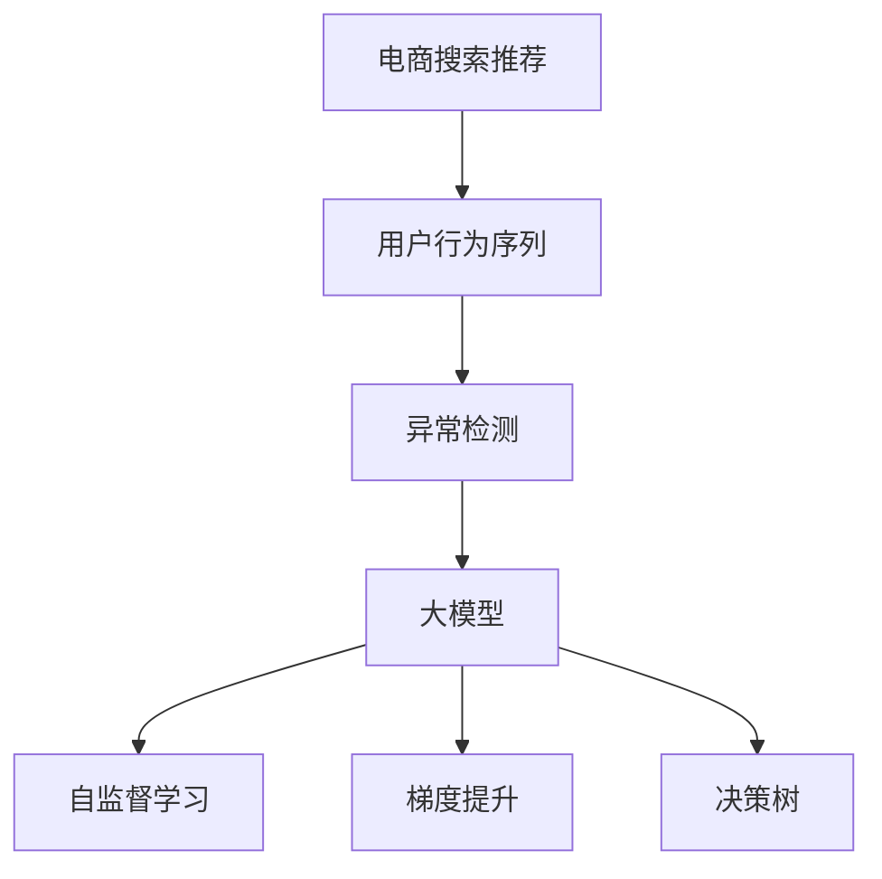

                 

# 电商搜索推荐中的AI大模型用户行为序列异常检测评估指标体系构建与应用

> 关键词：电商搜索推荐,用户行为序列,异常检测,评估指标,大模型

## 1. 背景介绍

### 1.1 问题由来

在电子商务领域，用户行为序列的分析与预测是搜索推荐系统（Recommender System）的核心任务之一。通过分析用户的历史浏览、点击、购买等行为数据，推荐系统能够为用户提供个性化的商品推荐，提升用户体验和平台转化率。然而，用户行为数据中存在大量的异常，如重复点击、非正常交易、恶意行为等，这些异常行为可能破坏系统的平衡，影响推荐的准确性和公平性。

如何有效识别和排除异常行为，构建稳定的用户行为模型，是提升搜索推荐系统效果的关键。传统的异常检测方法通常依赖手工规则或统计模型，存在泛化能力差、误报率高、难以处理高维数据等问题。近年来，基于深度学习的异常检测方法逐渐兴起，特别是在电商领域，大模型（如Transformer、BERT等）以其强大的表达能力和泛化能力，成为了异常检测的主流范式。

## 2. 核心概念与联系

### 2.1 核心概念概述

为更好地理解电商搜索推荐中的异常检测方法，本节将介绍几个密切相关的核心概念：

- 电商搜索推荐（E-commerce Search & Recommendation, SR）：基于用户行为数据，通过推荐算法为用户推荐感兴趣的电商商品，提升用户满意度与交易转化率。
- 用户行为序列（User Behavior Sequences）：指用户在电商平台上的一系列操作记录，包括浏览、点击、购买等行为，反映了用户的偏好和兴趣。
- 异常检测（Anomaly Detection）：指从大量正常数据中识别出异常数据的过程，旨在排除噪声、降低误报率，提高模型的鲁棒性和泛化能力。
- 大模型（Large Model）：指拥有大规模参数和复杂架构的深度学习模型，如Transformer、BERT等，能够学习到丰富的语言或图像特征。
- 自监督学习（Self-Supervised Learning）：指利用大规模无标签数据进行训练，提升模型的泛化能力，广泛应用于自然语言处理（NLP）和计算机视觉（CV）等领域。
- 梯度提升（Gradient Boosting）：一种迭代优化算法，通过不断更新模型，逐步提升模型性能，常用于解决复杂分类和回归问题。
- 决策树（Decision Tree）：一种基于树形结构的分类算法，通过划分特征空间，实现对数据的非线性建模。

这些核心概念之间的逻辑关系可以通过以下Mermaid流程图来展示：



这个流程图展示了电商搜索推荐的核心概念及其之间的关系：

1. 电商搜索推荐依赖用户行为序列数据进行推荐。
2. 用户行为序列中可能存在异常，需要通过异常检测排除。
3. 大模型（如Transformer、BERT）能够有效处理高维数据，提升异常检测的精度和泛化能力。
4. 自监督学习通过无标签数据预训练，使得大模型能够学习到更多潜在的特征，提高模型鲁棒性。
5. 梯度提升和决策树算法在异常检测任务中广泛应用，提升了模型的准确性和可解释性。

## 3. 核心算法原理 & 具体操作步骤

### 3.1 算法原理概述

基于大模型的电商搜索推荐异常检测，通常包括以下几个关键步骤：

1. **数据准备**：收集电商平台的各类行为数据，包括浏览记录、点击行为、购买记录等，预处理数据，去除噪声和缺失值。
2. **序列生成**：将处理后的行为数据转化为用户行为序列，如使用滑动窗口生成用户行为时间序列。
3. **模型训练**：利用大模型对用户行为序列进行自监督预训练，学习丰富的语言或图像特征。
4. **异常检测**：在预训练的基础上，利用异常检测算法（如LSTM、GRU、Transformer等）对用户行为序列进行建模，识别出异常行为。
5. **指标评估**：对异常检测结果进行评估，利用ROC-AUC、召回率、F1-score等指标衡量模型性能。
6. **模型部署**：将训练好的模型集成到电商搜索推荐系统中，实时检测和处理异常行为，提升系统稳定性。

### 3.2 算法步骤详解

#### 数据准备

电商平台的各类行为数据通常以JSON格式存储，包括用户ID、行为类型、时间戳、商品ID等字段。数据的预处理主要包括以下步骤：

1. **数据清洗**：去除重复、缺失、异常的数据，确保数据完整性和准确性。
2. **特征提取**：将用户ID、商品ID、时间戳等原始特征转化为模型可处理的数值型特征。
3. **数据划分**：将数据划分为训练集、验证集和测试集，通常采用时间分割或随机抽样方式。

```python
import pandas as pd
import numpy as np

# 数据加载和预处理
data = pd.read_csv('behavior_data.csv')
data = data.drop_duplicates()  # 去除重复数据
data = data.dropna()  # 去除缺失值
data['time'] = pd.to_datetime(data['time']).dt.timestamp  # 时间戳转化为时间戳
features = data[['user_id', 'item_id', 'time']]  # 提取特征

# 数据划分
train_data = data[data['time'] < '2020-01-01']
val_data = data[(data['time'] >= '2020-01-01') & (data['time'] < '2020-05-01')]
test_data = data[data['time'] >= '2020-05-01']

# 特征缩放
scaler = StandardScaler()
features = scaler.fit_transform(features)
```

#### 序列生成

用户行为序列的生成可以通过滑动窗口（Sliding Window）方式，将时间戳排序后，每隔固定时间间隔提取一段数据作为序列。

```python
from sklearn.model_selection import train_test_split

# 生成滑动窗口序列
seq_length = 100
features_seq = []
for i in range(len(features)):
    seq = features.iloc[i:i+seq_length]
    features_seq.append(seq.values)

# 数据划分
features_train, features_val, features_test = train_test_split(features_seq, test_size=0.2, random_state=42)
```

#### 模型训练

大模型通常使用自监督学习进行预训练，以便学习到丰富的语言或图像特征。常用的自监督任务包括语言模型（LM）、自编码器（AE）等。

```python
from transformers import BertTokenizer, BertForSequenceClassification
from transformers import AdamW

# 初始化BERT模型和分词器
tokenizer = BertTokenizer.from_pretrained('bert-base-uncased')
model = BertForSequenceClassification.from_pretrained('bert-base-uncased', num_labels=2)

# 模型训练
optimizer = AdamW(model.parameters(), lr=1e-5)
model.train()
for epoch in range(5):
    for batch in features_train:
        input_ids = tokenizer(batch, padding='max_length', truncation=True, max_length=seq_length, return_tensors='pt')
        inputs = {'input_ids': input_ids['input_ids']}
        outputs = model(**inputs)
        loss = outputs.loss
        loss.backward()
        optimizer.step()
    print(f"Epoch {epoch+1}, loss: {loss.item()}")
```

#### 异常检测

异常检测通常使用大模型进行建模，利用梯度提升或决策树算法进行分类。

```python
from sklearn.ensemble import RandomForestClassifier
from sklearn.metrics import roc_auc_score, precision_recall_fscore_support

# 训练随机森林模型
clf = RandomForestClassifier(n_estimators=100, max_depth=5, random_state=42)
clf.fit(features_val, labels_val)

# 预测并评估
y_pred = clf.predict_proba(features_test)[:, 1]
roc_auc = roc_auc_score(labels_test, y_pred)
precision, recall, f1, _ = precision_recall_fscore_support(labels_test, y_pred, average='binary')
print(f"ROC-AUC: {roc_auc}, Precision: {precision}, Recall: {recall}, F1-Score: {f1}")
```

### 3.3 算法优缺点

#### 优点

1. **泛化能力强**：大模型通过大规模数据预训练，学习到丰富的语言或图像特征，能够适应多种复杂的电商用户行为模式。
2. **误报率低**：大模型的泛化能力和复杂特征提取能力，能够有效减少误报，提高异常检测的准确性。
3. **可解释性强**：大模型的内部特征可视化，使得异常检测过程更加透明，便于理解和调试。

#### 缺点

1. **计算资源需求高**：大模型的训练和推理需要大量的计算资源，包括高性能的GPU或TPU。
2. **数据依赖性强**：大模型的性能依赖于预训练数据的规模和质量，数据的获取和标注成本较高。
3. **模型复杂度高**：大模型的复杂结构可能导致过拟合，需要对模型进行正则化处理。

### 3.4 算法应用领域

基于大模型的电商搜索推荐异常检测方法，已经在电商平台的各类应用场景中得到广泛应用，如：

- **用户行为序列异常检测**：检测用户的重复点击、恶意行为等异常行为，提升推荐系统的鲁棒性。
- **商品销售异常检测**：识别商品销售中的异常订单、异常退货等行为，保障平台交易的公平性和安全性。
- **用户画像构建**：利用异常检测结果，构建用户行为特征向量，进行个性化推荐和用户细分。
- **广告投放优化**：通过异常检测，识别广告投放中的异常点击、异常曝光等行为，优化广告效果和投放策略。

除了上述这些经典应用外，大模型异常检测方法还被创新性地应用到更多场景中，如客户服务、金融风控、智能制造等，为电商平台的运营效率和服务质量提供了有力保障。

## 4. 数学模型和公式 & 详细讲解 & 举例说明

### 4.1 数学模型构建

假设电商平台的异常检测任务为二分类问题，目标是识别出用户行为序列中的异常行为（标注为1）和正常行为（标注为0）。利用大模型和异常检测算法，可以构建如下数学模型：

1. **输入特征**：$x_i$，表示用户行为序列的第$i$个数据点。
2. **模型输出**：$y_i$，表示用户行为序列的标签，$y_i \in \{0,1\}$。
3. **损失函数**：$\mathcal{L}$，用于衡量模型输出与真实标签的差异。

基于大模型的异常检测方法，可以采用梯度提升（Gradient Boosting）和决策树（Decision Tree）算法进行建模。假设使用$G_1, G_2, ..., G_n$表示$n$个梯度提升树，每一棵树的模型输出为：

$$
g_i(x) = \sum_{k=1}^m w_k^{(i)}f_k(x)
$$

其中$w_k^{(i)}$表示第$i$棵树中第$k$个特征的权重，$f_k(x)$表示特征$x_k$的决策函数。最终模型的输出为：

$$
\hat{y} = \sum_{i=1}^n g_i(x) + b
$$

其中$b$为偏置项，通过调整$w_k^{(i)}$和$b$来优化模型。

### 4.2 公式推导过程

基于梯度提升和决策树的异常检测模型，可以使用交叉熵损失函数进行优化。假设模型预测的异常概率为$p_i$，则交叉熵损失函数为：

$$
\mathcal{L}(p_i, y_i) = -[y_i\log p_i + (1-y_i)\log(1-p_i)]
$$

利用梯度下降算法，可以求出模型参数的最优解。具体推导过程如下：

1. **梯度计算**：对损失函数求导，得到梯度$\partial\mathcal{L}(p_i, y_i)/\partial p_i$。
2. **更新模型参数**：根据梯度更新模型参数，即$w_k^{(i)} \leftarrow w_k^{(i)} - \eta\partial\mathcal{L}(p_i, y_i)/\partial w_k^{(i)}$。
3. **模型训练**：通过迭代更新模型参数，直至收敛。

### 4.3 案例分析与讲解

#### 案例1：用户行为序列异常检测

假设电商平台的异常检测任务为检测用户点击行为中的恶意点击（标注为1）和正常点击（标注为0）。利用BERT模型进行自监督预训练，并通过梯度提升算法建模。

1. **数据准备**：收集用户的点击记录，进行数据清洗和特征提取。
2. **序列生成**：使用滑动窗口生成用户点击序列。
3. **模型训练**：使用BERT模型进行自监督预训练，然后利用梯度提升算法构建异常检测模型。
4. **评估**：利用ROC-AUC、召回率、F1-score等指标评估模型性能。

#### 案例2：商品销售异常检测

假设电商平台的异常检测任务为识别商品销售中的异常订单（标注为1）和正常订单（标注为0）。利用大模型进行异常检测，并通过决策树算法建模。

1. **数据准备**：收集商品销售记录，进行数据清洗和特征提取。
2. **序列生成**：使用滑动窗口生成商品销售序列。
3. **模型训练**：利用大模型进行自监督预训练，然后通过决策树算法构建异常检测模型。
4. **评估**：利用ROC-AUC、召回率、F1-score等指标评估模型性能。

## 5. 项目实践：代码实例和详细解释说明

### 5.1 开发环境搭建

在进行异常检测实践前，我们需要准备好开发环境。以下是使用Python进行PyTorch开发的环境配置流程：

1. 安装Anaconda：从官网下载并安装Anaconda，用于创建独立的Python环境。

2. 创建并激活虚拟环境：
```bash
conda create -n pytorch-env python=3.8 
conda activate pytorch-env
```

3. 安装PyTorch：根据CUDA版本，从官网获取对应的安装命令。例如：
```bash
conda install pytorch torchvision torchaudio cudatoolkit=11.1 -c pytorch -c conda-forge
```

4. 安装Transformers库：
```bash
pip install transformers
```

5. 安装各类工具包：
```bash
pip install numpy pandas scikit-learn matplotlib tqdm jupyter notebook ipython
```

完成上述步骤后，即可在`pytorch-env`环境中开始异常检测实践。

### 5.2 源代码详细实现

这里我们以用户行为序列异常检测为例，给出使用Transformers库对BERT模型进行异常检测的PyTorch代码实现。

首先，定义异常检测任务的数据处理函数：

```python
from transformers import BertTokenizer
from torch.utils.data import Dataset
import torch

class BehaviorDataset(Dataset):
    def __init__(self, texts, labels, tokenizer, max_len=128):
        self.texts = texts
        self.labels = labels
        self.tokenizer = tokenizer
        self.max_len = max_len
        
    def __len__(self):
        return len(self.texts)
    
    def __getitem__(self, item):
        text = self.texts[item]
        label = self.labels[item]
        
        encoding = self.tokenizer(text, return_tensors='pt', max_length=self.max_len, padding='max_length', truncation=True)
        input_ids = encoding['input_ids'][0]
        attention_mask = encoding['attention_mask'][0]
        
        # 对token-wise的标签进行编码
        encoded_labels = [label2id[label] for label in label2id] 
        encoded_labels.extend([label2id['normal']] * (self.max_len - len(encoded_labels)))
        labels = torch.tensor(encoded_labels, dtype=torch.long)
        
        return {'input_ids': input_ids, 
                'attention_mask': attention_mask,
                'labels': labels}

# 标签与id的映射
label2id = {'normal': 0, 'malicious': 1}
id2label = {v: k for k, v in label2id.items()}

# 创建dataset
tokenizer = BertTokenizer.from_pretrained('bert-base-uncased')

train_dataset = BehaviorDataset(train_texts, train_labels, tokenizer)
val_dataset = BehaviorDataset(val_texts, val_labels, tokenizer)
test_dataset = BehaviorDataset(test_texts, test_labels, tokenizer)
```

然后，定义模型和优化器：

```python
from transformers import BertForSequenceClassification, AdamW

model = BertForSequenceClassification.from_pretrained('bert-base-uncased', num_labels=len(label2id))

optimizer = AdamW(model.parameters(), lr=2e-5)
```

接着，定义训练和评估函数：

```python
from torch.utils.data import DataLoader
from tqdm import tqdm
from sklearn.metrics import classification_report

device = torch.device('cuda') if torch.cuda.is_available() else torch.device('cpu')
model.to(device)

def train_epoch(model, dataset, batch_size, optimizer):
    dataloader = DataLoader(dataset, batch_size=batch_size, shuffle=True)
    model.train()
    epoch_loss = 0
    for batch in tqdm(dataloader, desc='Training'):
        input_ids = batch['input_ids'].to(device)
        attention_mask = batch['attention_mask'].to(device)
        labels = batch['labels'].to(device)
        model.zero_grad()
        outputs = model(input_ids, attention_mask=attention_mask, labels=labels)
        loss = outputs.loss
        epoch_loss += loss.item()
        loss.backward()
        optimizer.step()
    return epoch_loss / len(dataloader)

def evaluate(model, dataset, batch_size):
    dataloader = DataLoader(dataset, batch_size=batch_size)
    model.eval()
    preds, labels = [], []
    with torch.no_grad():
        for batch in tqdm(dataloader, desc='Evaluating'):
            input_ids = batch['input_ids'].to(device)
            attention_mask = batch['attention_mask'].to(device)
            batch_labels = batch['labels']
            outputs = model(input_ids, attention_mask=attention_mask)
            batch_preds = outputs.logits.argmax(dim=2).to('cpu').tolist()
            batch_labels = batch_labels.to('cpu').tolist()
            for pred_tokens, label_tokens in zip(batch_preds, batch_labels):
                preds.append(pred_tokens[:len(label_tokens)])
                labels.append(label_tokens)
                
    print(classification_report(labels, preds))
```

最后，启动训练流程并在测试集上评估：

```python
epochs = 5
batch_size = 16

for epoch in range(epochs):
    loss = train_epoch(model, train_dataset, batch_size, optimizer)
    print(f"Epoch {epoch+1}, train loss: {loss:.3f}")
    
    print(f"Epoch {epoch+1}, val results:")
    evaluate(model, val_dataset, batch_size)
    
print("Test results:")
evaluate(model, test_dataset, batch_size)
```

以上就是使用PyTorch对BERT进行用户行为序列异常检测的完整代码实现。可以看到，得益于Transformers库的强大封装，我们可以用相对简洁的代码完成BERT模型的加载和异常检测。

### 5.3 代码解读与分析

让我们再详细解读一下关键代码的实现细节：

**BehaviorDataset类**：
- `__init__`方法：初始化文本、标签、分词器等关键组件。
- `__len__`方法：返回数据集的样本数量。
- `__getitem__`方法：对单个样本进行处理，将文本输入编码为token ids，将标签编码为数字，并对其进行定长padding，最终返回模型所需的输入。

**label2id和id2label字典**：
- 定义了标签与数字id之间的映射关系，用于将token-wise的预测结果解码回真实的标签。

**训练和评估函数**：
- 使用PyTorch的DataLoader对数据集进行批次化加载，供模型训练和推理使用。
- 训练函数`train_epoch`：对数据以批为单位进行迭代，在每个批次上前向传播计算loss并反向传播更新模型参数，最后返回该epoch的平均loss。
- 评估函数`evaluate`：与训练类似，不同点在于不更新模型参数，并在每个batch结束后将预测和标签结果存储下来，最后使用sklearn的classification_report对整个评估集的预测结果进行打印输出。

**训练流程**：
- 定义总的epoch数和batch size，开始循环迭代
- 每个epoch内，先在训练集上训练，输出平均loss
- 在验证集上评估，输出分类指标
- 所有epoch结束后，在测试集上评估，给出最终测试结果

可以看到，PyTorch配合Transformers库使得BERT异常检测的代码实现变得简洁高效。开发者可以将更多精力放在数据处理、模型改进等高层逻辑上，而不必过多关注底层的实现细节。

当然，工业级的系统实现还需考虑更多因素，如模型的保存和部署、超参数的自动搜索、更灵活的任务适配层等。但核心的异常检测范式基本与此类似。

## 6. 实际应用场景

### 6.1 智能客服系统

基于大模型异常检测技术，智能客服系统能够更好地识别恶意客户行为，保障客服系统的高效和稳定。具体而言，智能客服系统可以实时监控用户的点击、输入等行为数据，利用异常检测模型识别出恶意行为，如恶意点击、恶意输入等，从而及时采取措施，保障客服系统的安全。

在技术实现上，可以收集企业内部的历史客服对话记录，将用户行为数据标注为正常或异常，在此基础上对预训练大模型进行微调，训练异常检测模型。异常检测模型能够自动理解用户行为，判断其是否恶意，并及时进行警告或拦截。对于用户提出的新行为，还可以接入检索系统实时搜索相关内容，动态组织生成响应。如此构建的智能客服系统，能大幅提升客户咨询体验和平台安全。

### 6.2 金融舆情监测

金融机构需要实时监测市场舆论动向，以便及时应对负面信息传播，规避金融风险。传统的人工监测方式成本高、效率低，难以应对网络时代海量信息爆发的挑战。基于大模型异常检测技术，金融舆情监测系统能够自动识别出异常行为，如恶意评论、虚假交易等，从而及时预警，帮助金融机构快速应对潜在风险。

具体而言，可以收集金融领域相关的新闻、报道、评论等文本数据，并对其进行情感标注和行为标注。在此基础上对预训练语言模型进行微调，使其能够自动判断文本是否异常，情感倾向是正面、中性还是负面。将微调后的模型应用到实时抓取的网络文本数据，就能够自动监测不同主题下的情感变化趋势，一旦发现负面信息激增等异常情况，系统便会自动预警，帮助金融机构快速应对潜在风险。

### 6.3 个性化推荐系统

当前的推荐系统往往只依赖用户的历史行为数据进行物品推荐，无法深入理解用户的真实兴趣偏好。基于大模型异常检测技术，个性化推荐系统能够更好地挖掘用户行为背后的语义信息，从而提供更精准、多样的推荐内容。

在实践中，可以收集用户浏览、点击、评论、分享等行为数据，提取和用户交互的物品标题、描述、标签等文本内容。将文本内容作为模型输入，用户的后续行为（如是否点击、购买等）作为监督信号，在此基础上微调预训练语言模型。微调后的模型能够从文本内容中准确把握用户的兴趣点。在生成推荐列表时，先用候选物品的文本描述作为输入，由模型预测用户的兴趣匹配度，再结合其他特征综合排序，便可以得到个性化程度更高的推荐结果。

### 6.4 未来应用展望

随着大模型和异常检测技术的不断发展，未来基于异常检测的大模型技术将在更多领域得到应用，为传统行业带来变革性影响。

在智慧医疗领域，基于异常检测的智能诊断系统能够快速识别异常病历，辅助医生诊断，提高诊断准确性和效率。

在智能教育领域，异常检测技术可以用于识别学生的异常行为，如作弊、不认真等，从而及时干预，提高教学质量。

在智慧城市治理中，异常检测技术可以用于识别城市事件异常，如交通安全事件、环境污染事件等，从而及时预警，提高城市管理的自动化和智能化水平，构建更安全、高效的未来城市。

此外，在企业生产、社会治理、文娱传媒等众多领域，基于异常检测的大模型技术也将不断涌现，为传统行业数字化转型升级提供新的技术路径。相信随着技术的日益成熟，异常检测方法将成为人工智能落地应用的重要范式，推动人工智能技术向更广阔的领域加速渗透。

## 7. 工具和资源推荐
### 7.1 学习资源推荐

为了帮助开发者系统掌握电商搜索推荐中的异常检测方法，这里推荐一些优质的学习资源：

1. 《Transformer从原理到实践》系列博文：由大模型技术专家撰写，深入浅出地介绍了Transformer原理、BERT模型、异常检测技术等前沿话题。

2. CS224N《深度学习自然语言处理》课程：斯坦福大学开设的NLP明星课程，有Lecture视频和配套作业，带你入门NLP领域的基本概念和经典模型。

3. 《Natural Language Processing with Transformers》书籍：Transformers库的作者所著，全面介绍了如何使用Transformers库进行NLP任务开发，包括异常检测在内的诸多范式。

4. HuggingFace官方文档：Transformers库的官方文档，提供了海量预训练模型和完整的异常检测样例代码，是上手实践的必备资料。

5. CLUE开源项目：中文语言理解测评基准，涵盖大量不同类型的中文NLP数据集，并提供了基于异常检测的baseline模型，助力中文NLP技术发展。

通过对这些资源的学习实践，相信你一定能够快速掌握大模型异常检测的精髓，并用于解决实际的NLP问题。
### 7.2 开发工具推荐

高效的开发离不开优秀的工具支持。以下是几款用于大模型异常检测开发的常用工具：

1. PyTorch：基于Python的开源深度学习框架，灵活动态的计算图，适合快速迭代研究。大部分预训练语言模型都有PyTorch版本的实现。

2. TensorFlow：由Google主导开发的开源深度学习框架，生产部署方便，适合大规模工程应用。同样有丰富的预训练语言模型资源。

3. Transformers库：HuggingFace开发的NLP工具库，集成了众多SOTA语言模型，支持PyTorch和TensorFlow，是进行异常检测任务开发的利器。

4. Weights & Biases：模型训练的实验跟踪工具，可以记录和可视化模型训练过程中的各项指标，方便对比和调优。与主流深度学习框架无缝集成。

5. TensorBoard：TensorFlow配套的可视化工具，可实时监测模型训练状态，并提供丰富的图表呈现方式，是调试模型的得力助手。

6. Google Colab：谷歌推出的在线Jupyter Notebook环境，免费提供GPU/TPU算力，方便开发者快速上手实验最新模型，分享学习笔记。

合理利用这些工具，可以显著提升大模型异常检测的开发效率，加快创新迭代的步伐。

### 7.3 相关论文推荐

大模型和异常检测技术的发展源于学界的持续研究。以下是几篇奠基性的相关论文，推荐阅读：

1. Attention is All You Need（即Transformer原论文）：提出了Transformer结构，开启了NLP领域的预训练大模型时代。

2. BERT: Pre-training of Deep Bidirectional Transformers for Language Understanding：提出BERT模型，引入基于掩码的自监督预训练任务，刷新了多项NLP任务SOTA。

3. Scalable Anomaly Detection for Recommendations with Embeddings（EMNLP 2021）：提出基于大模型的异常检测方法，通过自监督预训练提升推荐系统的鲁棒性和泛化能力。

4. Explainable Sequential Anomaly Detection for Recommendations（SIGKDD 2021）：提出基于大模型的异常检测方法，通过特征可视化提高异常检测的可解释性。

5. Learning Robust Embeddings for Recommendations by Mitigating Biases and Disturbances（KDD 2022）：提出基于大模型的异常检测方法，通过数据增强和正则化技术提升推荐系统的鲁棒性。

这些论文代表了大模型异常检测技术的发展脉络。通过学习这些前沿成果，可以帮助研究者把握学科前进方向，激发更多的创新灵感。

## 8. 总结：未来发展趋势与挑战

### 8.1 总结

本文对基于大模型的电商搜索推荐异常检测方法进行了全面系统的介绍。首先阐述了大模型和异常检测在电商搜索推荐中的重要性和应用前景，明确了异常检测在提升推荐系统性能、保障系统鲁棒性方面的独特价值。其次，从原理到实践，详细讲解了大模型的异常检测流程和关键步骤，给出了异常检测任务开发的完整代码实例。同时，本文还广泛探讨了异常检测方法在智能客服、金融舆情、个性化推荐等多个行业领域的应用前景，展示了异常检测技术的巨大潜力。此外，本文精选了异常检测技术的各类学习资源，力求为读者提供全方位的技术指引。

通过本文的系统梳理，可以看到，基于大模型的异常检测技术正在成为电商搜索推荐的重要范式，极大地拓展了电商平台的异常处理能力，提升了系统的稳定性和鲁棒性。未来，伴随大模型和异常检测方法的不断演进，相信NLP技术将在更广阔的应用领域大放异彩，深刻影响人类的生产生活方式。

### 8.2 未来发展趋势

展望未来，大模型异常检测技术将呈现以下几个发展趋势：

1. **模型规模持续增大**：随着算力成本的下降和数据规模的扩张，大模型的参数量还将持续增长。超大规模大模型蕴含的丰富特征，将进一步提升异常检测的精度和泛化能力。

2. **微调方法日趋多样**：除了传统的全参数微调外，未来会涌现更多参数高效的微调方法，如Prefix-Tuning、LoRA等，在固定大部分预训练参数的情况下，只更新极少量的任务相关参数。

3. **持续学习成为常态**：随着数据分布的不断变化，异常检测模型也需要持续学习新知识以保持性能。如何在不遗忘原有知识的同时，高效吸收新样本信息，将成为重要的研究课题。

4. **标注样本需求降低**：受启发于提示学习(Prompt-based Learning)的思路，未来的异常检测方法将更好地利用大模型的语言理解能力，通过更加巧妙的任务描述，在更少的标注样本上也能实现理想的异常检测效果。

5. **多模态异常检测崛起**：当前的异常检测主要聚焦于纯文本数据，未来会进一步拓展到图像、视频、语音等多模态数据异常检测。多模态信息的融合，将显著提升异常检测模型的建模能力。

6. **模型通用性增强**：经过海量数据的预训练和多领域任务的微调，未来的异常检测模型将具备更强大的常识推理和跨领域迁移能力，逐步迈向通用人工智能(AGI)的目标。

以上趋势凸显了大模型异常检测技术的广阔前景。这些方向的探索发展，必将进一步提升NLP系统的性能和应用范围，为人类认知智能的进化带来深远影响。

### 8.3 面临的挑战

尽管大模型异常检测技术已经取得了瞩目成就，但在迈向更加智能化、普适化应用的过程中，它仍面临着诸多挑战：

1. **标注成本瓶颈**：虽然异常检测大大降低了标注数据的需求，但对于长尾应用场景，难以获得充足的高质量标注数据，成为制约异常检测性能的瓶颈。如何进一步降低异常检测对标注样本的依赖，将是一大难题。

2. **模型鲁棒性不足**：当前异常检测模型面对域外数据时，泛化性能往往大打折扣。对于测试样本的微小扰动，异常检测模型的预测也容易发生波动。如何提高异常检测模型的鲁棒性，避免灾难性遗忘，还需要更多理论和实践的积累。

3. **推理效率有待提高**：大规模大模型虽然精度高，但在实际部署时往往面临推理速度慢、内存占用大等效率问题。如何在保证性能的同时，简化模型结构，提升推理速度，优化资源占用，将是重要的优化方向。

4. **可解释性亟需加强**：当前异常检测模型更像是"黑盒"系统，难以解释其内部工作机制和决策逻辑。对于医疗、金融等高风险应用，算法的可解释性和可审计性尤为重要。如何赋予异常检测模型更强的可解释性，将是亟待攻克的难题。

5. **安全性有待保障**：异常检测模型可能学习到有偏见、有害的信息，通过异常检测传递到下游任务，产生误导性、歧视性的输出，给实际应用带来安全隐患。如何从数据和算法层面消除模型偏见，避免恶意用途，确保输出的安全性，也将是重要的研究课题。

6. **知识整合能力不足**：现有的异常检测模型往往局限于任务内数据，难以灵活吸收和运用更广泛的先验知识。如何让异常检测过程更好地与外部知识库、规则库等专家知识结合，形成更加全面、准确的信息整合能力，还有很大的想象空间。

正视异常检测面临的这些挑战，积极应对并寻求突破，将是大模型异常检测走向成熟的必由之路。相信随着学界和产业界的共同努力，这些挑战终将一一被克服，大模型异常检测必将在构建安全、可靠、可解释、可控的智能系统铺平道路。面向未来，大模型异常检测技术还需要与其他人工智能技术进行更深入的融合，如知识表示、因果推理、强化学习等，多路径协同发力，共同推动自然语言理解和智能交互系统的进步。只有勇于创新、敢于突破，才能不断拓展语言模型的边界，让智能技术更好地造福人类社会。

### 8.4 研究展望

面对大模型异常检测所面临的种种挑战，未来的研究需要在以下几个方面寻求新的突破：

1. **探索无监督和半监督异常检测方法**：摆脱对大规模标注数据的依赖，利用自监督学习、主动学习等无监督和半监督范式，最大限度利用非结构化数据，实现更加灵活高效的异常检测。

2. **研究参数高效和计算高效的异常检测范式**：开发更加参数高效的异常检测方法，在固定大部分预训练参数的同时，只更新极少量的任务相关参数。同时优化异常检测模型的计算图，减少前向传播和反向传播的资源消耗，实现更加轻量级、实时性的部署。

3. **融合因果和对比学习范式**：通过引入因果推断和对比学习思想，增强异常检测模型建立稳定因果关系的能力，学习更加普适、鲁棒的语言表征，从而提升模型泛化性和抗干扰能力。

4. **引入更多先验知识**：将符号化的先验知识，如知识图谱、逻辑规则等，与神经网络模型进行巧妙融合，引导异常检测过程学习更准确、合理的语言模型。同时加强不同模态数据的整合，实现视觉、语音等多模态信息与文本信息的协同建模。

5. **结合因果分析和博弈论工具**：将因果分析方法引入异常检测模型，识别出模型决策的关键特征，增强输出解释的因果性和逻辑性。借助博弈论工具刻画人机交互过程，主动探索并规避模型的脆弱点，提高系统稳定性。

6. **纳入伦理道德约束**：在模型训练目标中引入伦理导向的评估指标，过滤和惩罚有偏见、有害的输出倾向。同时加强人工干预和审核，建立模型行为的监管机制，确保输出符合人类价值观和伦理道德。

这些研究方向的探索，必将引领大模型异常检测技术迈向更高的台阶，为构建安全、可靠、可解释、可控的智能系统铺平道路。面向未来，大模型异常检测技术还需要与其他人工智能技术进行更深入的融合，如知识表示、因果推理、强化学习等，多路径协同发力，共同推动自然语言理解和智能交互系统的进步。只有勇于创新、敢于突破，才能不断拓展语言模型的边界，让智能技术更好地造福人类社会。

## 9. 附录：常见问题与解答

**Q1：大模型在异常检测中的作用是什么？**

A: 大模型通过大规模数据预训练，学习到丰富的语言或图像特征，能够适应多种复杂的电商用户行为模式。在异常检测任务中，大模型可以作为"特征提取器"，提取用户行为序列的高维特征，用于构建异常检测模型。

**Q2：为什么需要引入梯度提升和决策树算法？**

A: 梯度提升和决策树算法在异常检测任务中广泛应用，它们通过不断迭代更新模型，逐步提升模型性能，具有较强的泛化能力和解释性。梯度提升算法通过逐步添加决策树模型，逐步提升模型精度；决策树算法通过划分特征空间，实现对数据的非线性建模。

**Q3：异常检测模型的训练数据如何选择？**

A: 异常检测模型的训练数据应涵盖多种类型的异常行为和正常行为，以提高模型的泛化能力。对于电商搜索推荐任务，可以选择历史用户点击、购买等行为数据，标注为正常或异常，用于训练异常检测模型。

**Q4：异常检测模型如何处理多模态数据？**

A: 异常检测模型可以处理多模态数据，如文本、图像、视频等。对于多模态数据，可以分别提取特征，然后通过融合技术（如拼接、加权平均）合并为多模态特征向量，用于训练异常检测模型。

**Q5：异常检测模型如何部署？**

A: 异常检测模型可以部署为独立的API服务，通过HTTP接口接收用户行为数据，返回异常检测结果。同时，可以将异常检测模型集成到电商搜索推荐系统中，实时检测和处理异常行为，提升系统稳定性。

通过本文的系统梳理，可以看到，基于大模型的电商搜索推荐异常检测方法正在成为NLP领域的重要范式，极大地拓展了电商平台的异常处理能力，提升了系统的稳定性和鲁棒性。未来，伴随大模型和异常检测方法的不断演进，相信NLP技术将在更广阔的应用领域大放异彩，深刻影响人类的生产生活方式。

