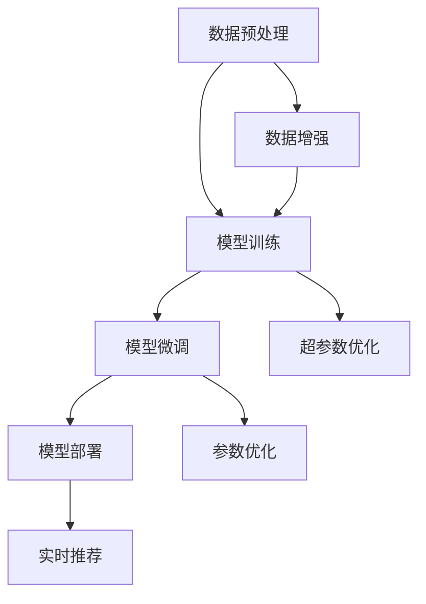

                 

# 电商搜索推荐场景下的AI大模型模型部署全流程自动化工具应用实践与优化

## 1. 背景介绍

在现代电商领域，搜索推荐系统作为提升用户体验和增加商业价值的核心环节，受到越来越多的重视。随着人工智能技术的迅猛发展，基于大模型的搜索推荐系统逐渐成为行业内的主流选择。这些系统能够通过复杂的数据处理和模型训练，实现个性化搜索和推荐，为每个用户提供更加精准、高效的服务。然而，大模型的训练和部署涉及多个复杂环节，部署成本和难度均较高，严重制约了其在电商场景中的应用推广。

为了提升大模型在电商搜索推荐系统中的部署效率，降低应用门槛，本文章将介绍一套基于AI大模型模型部署的全流程自动化工具，涵盖从数据预处理、模型训练、微调优化到模型部署的全过程。通过深入解析这一套工具的设计和应用实践，并结合具体案例，展现其在电商搜索推荐场景中的强大应用潜力，同时对工具的性能和优化提出详细的见解。

## 2. 核心概念与联系

### 2.1 核心概念概述

在电商搜索推荐系统中，大模型通常指使用深度学习技术训练得到的神经网络模型，如Transformer、BERT等。这些模型在预训练阶段通过大规模数据进行训练，具备强大的特征提取和模式识别能力，能够在电商场景中对用户行为进行深度分析，实现个性化推荐。

搜索推荐系统通常包括以下几个关键步骤：
1. **数据预处理**：对原始数据进行清洗、转换、特征提取等处理，使其适合模型输入。
2. **模型训练**：通过有标签的数据对模型进行训练，使其学习到数据中的模式。
3. **模型微调**：对预训练模型进行特定任务的微调，以适应搜索推荐系统的需求。
4. **模型部署**：将训练好的模型部署到线上服务中，实现实时推荐。

### 2.2 核心概念原理和架构的 Mermaid 流程图



在上述流程图中，数据预处理和模型训练是基础步骤，微调是对模型进行优化和定制，部署则将模型应用于实际场景中。每个步骤都有其关键技术和最佳实践，需在实践中逐步深入探索。

## 3. 核心算法原理 & 具体操作步骤

### 3.1 算法原理概述

在大模型部署的全流程自动化工具中，核心的技术原理主要包括数据预处理、模型训练、模型微调和模型部署四大部分。下面逐一介绍这些部分的原理和操作方法。

### 3.2 算法步骤详解

#### 3.2.1 数据预处理

数据预处理是搜索推荐系统中不可或缺的一环。其主要目的是将原始数据转化为适合模型输入的格式。电商搜索推荐场景下的数据预处理通常包括以下几个步骤：

1. **数据清洗**：去除数据中的噪声和异常值，确保数据质量。
2. **特征提取**：从原始数据中提取有意义的特征，如商品ID、用户ID、浏览记录等。
3. **数据转换**：对提取的特征进行标准化和归一化处理，使其适合模型输入。

##### 3.2.1.1 数据清洗

数据清洗主要包括以下两个方面：

- **去重与补全**：去除重复的记录，填补缺失的值。这通常通过数据合并、缺失值插补等技术实现。
- **噪声与异常值处理**：检测并去除数据中的噪声和异常值。例如，对于电商数据，可以去除价格异常、交易记录异常等数据。

##### 3.2.1.2 特征提取

特征提取是将原始数据转化为模型输入的关键步骤。电商数据通常包含以下几种特征：

- **用户特征**：包括用户ID、用户画像、行为记录等。
- **商品特征**：包括商品ID、商品类别、价格、销量等。
- **交互特征**：包括用户浏览记录、购买记录、收藏记录等。

特征提取通常使用文本处理、数据挖掘等技术，将原始数据转化为数值特征，形成特征向量。例如，对于文本数据，可以使用词向量、TF-IDF等技术进行特征提取。

##### 3.2.1.3 数据转换

数据转换是指对提取的特征进行标准化和归一化处理，使其适合模型输入。电商数据中存在多种数据类型，包括数值型、分类型、时间类型等。因此，需要根据不同的数据类型进行相应的转换。

- **数值型数据**：通常使用归一化、标准化等方法进行转换，使其分布合理。
- **分类型数据**：可以通过独热编码等方式进行转换，使其适合模型输入。
- **时间类型数据**：通常使用时间特征提取技术，如时间戳、时间间隔等，进行转换。

#### 3.2.2 模型训练

模型训练是搜索推荐系统中的核心步骤，主要目的是通过有标签的数据对模型进行训练，使其学习到数据中的模式。电商搜索推荐系统中的模型训练通常包括以下几个步骤：

1. **数据划分**：将数据集划分为训练集、验证集和测试集。
2. **模型选择**：选择合适的深度学习模型，如Transformer、BERT等。
3. **训练过程**：使用训练集对模型进行训练，并使用验证集进行模型评估和调整。
4. **结果保存**：保存训练好的模型参数和训练过程中的中间结果。

##### 3.2.2.1 数据划分

数据划分是将数据集划分为训练集、验证集和测试集的过程。通常使用分层抽样、交叉验证等技术进行划分，确保每个集成的数据分布相似。

- **训练集**：用于模型训练，占总数据的70-80%。
- **验证集**：用于模型评估和调参，占总数据的10-20%。
- **测试集**：用于模型测试，评估模型在未见过的数据上的表现，占总数据的10%。

##### 3.2.2.2 模型选择

模型选择是选择合适的深度学习模型进行训练的过程。电商搜索推荐系统中常用的模型包括：

- **Transformer模型**：通过自注意力机制，能够处理大规模的文本数据，适用于电商搜索推荐系统中的文本处理任务。
- **BERT模型**：通过双向训练，能够更好地捕捉上下文信息，适用于电商搜索推荐系统中的文本分类任务。
- **GPT模型**：通过自回归方式，能够生成高质量的自然语言文本，适用于电商搜索推荐系统中的自然语言处理任务。

##### 3.2.2.3 训练过程

模型训练通常包括以下几个步骤：

- **前向传播**：将输入数据输入模型，计算模型的预测输出。
- **损失计算**：计算模型的预测输出与真实标签之间的差异，得到损失函数。
- **反向传播**：通过反向传播算法，计算模型参数的梯度。
- **参数更新**：使用优化算法，如Adam、SGD等，更新模型参数。

##### 3.2.2.4 结果保存

模型训练完成后，需要保存训练好的模型参数和训练过程中的中间结果。这通常通过模型文件、训练日志等方式进行保存，方便后续的微调和部署。

#### 3.2.3 模型微调

模型微调是指对预训练模型进行特定任务的微调，以适应搜索推荐系统的需求。电商搜索推荐系统中的模型微调通常包括以下几个步骤：

1. **任务定义**：定义微调任务的标签、损失函数等。
2. **模型适配**：添加任务适配层，调整模型输出，适应微调任务。
3. **微调过程**：使用微调集对模型进行训练，并使用验证集进行模型评估和调整。
4. **结果保存**：保存微调后的模型参数和训练过程中的中间结果。

##### 3.2.3.1 任务定义

任务定义是指定义微调任务的标签、损失函数等关键参数。电商搜索推荐系统中的微调任务通常包括以下几种：

- **文本分类**：将用户搜索查询文本进行分类，如品牌、类型等。
- **推荐排序**：对商品进行推荐排序，提高推荐质量。
- **用户画像**：根据用户行为数据，生成用户画像，实现个性化推荐。

##### 3.2.3.2 模型适配

模型适配是指添加任务适配层，调整模型输出，适应微调任务。电商搜索推荐系统中的模型适配通常包括以下几种方式：

- **添加分类器**：对于文本分类任务，通常添加线性分类器或神经网络分类器，输出分类结果。
- **调整输出层**：对于推荐排序任务，通常调整输出层，输出商品的推荐分数。
- **生成用户画像**：对于用户画像任务，通常生成用户特征向量，用于个性化推荐。

##### 3.2.3.3 微调过程

微调过程是指使用微调集对模型进行训练，并使用验证集进行模型评估和调整。电商搜索推荐系统中的微调过程通常包括以下几个步骤：

- **加载模型**：加载预训练模型和微调数据。
- **设置超参数**：设置学习率、批量大小、迭代轮数等超参数。
- **模型训练**：使用微调数据对模型进行训练，并使用验证集进行模型评估和调整。
- **结果保存**：保存微调后的模型参数和训练过程中的中间结果。

##### 3.2.3.4 结果保存

微调完成后，需要保存微调后的模型参数和训练过程中的中间结果。这通常通过模型文件、训练日志等方式进行保存，方便后续的部署。

#### 3.2.4 模型部署

模型部署是指将训练好的模型部署到线上服务中，实现实时推荐。电商搜索推荐系统中的模型部署通常包括以下几个步骤：

1. **环境搭建**：搭建部署环境，安装必要的依赖库和工具。
2. **模型加载**：加载训练好的模型参数和配置文件。
3. **推理预测**：使用模型进行实时推理预测，生成推荐结果。
4. **结果反馈**：将推荐结果返回给用户，并收集用户反馈。

##### 3.2.4.1 环境搭建

环境搭建是搭建部署环境，安装必要的依赖库和工具的过程。电商搜索推荐系统中的模型部署通常需要使用以下技术：

- **云平台**：使用AWS、阿里云、华为云等云平台，提供高性能计算资源。
- **容器化技术**：使用Docker、Kubernetes等容器化技术，实现模型的快速部署和扩展。
- **API接口**：使用RESTful API接口，实现模型的调用和数据传输。

##### 3.2.4.2 模型加载

模型加载是指加载训练好的模型参数和配置文件的过程。电商搜索推荐系统中的模型加载通常包括以下几个步骤：

- **模型文件**：将训练好的模型参数保存为模型文件，如TensorFlow的 SavedModel、PyTorch的 TorchScript。
- **配置文件**：保存模型的配置信息，如输入格式、输出格式、超参数等。

##### 3.2.4.3 推理预测

推理预测是指使用模型进行实时推理预测，生成推荐结果的过程。电商搜索推荐系统中的推理预测通常包括以下几个步骤：

- **数据输入**：将用户输入的数据输入模型。
- **模型推理**：使用模型进行推理预测，生成推荐结果。
- **结果输出**：将推荐结果返回给用户，并记录用户行为数据。

##### 3.2.4.4 结果反馈

结果反馈是指将推荐结果返回给用户，并收集用户反馈的过程。电商搜索推荐系统中的结果反馈通常包括以下几个步骤：

- **用户界面**：提供友好的用户界面，展示推荐结果。
- **用户互动**：提供用户互动功能，如点击、收藏、购买等。
- **数据收集**：收集用户行为数据，用于模型优化和微调。

### 3.3 算法优缺点

#### 3.3.1 算法优点

1. **高效性**：基于大模型的搜索推荐系统能够快速处理大规模数据，实现实时推荐。
2. **泛化能力**：大模型具备强大的泛化能力，能够在未见过的数据上取得优异表现。
3. **可解释性**：大模型能够通过可视化工具，展示模型的内部结构和推理过程，提高模型的可解释性。
4. **灵活性**：大模型能够根据任务需求，灵活调整输出层和损失函数，适应多种微调任务。

#### 3.3.2 算法缺点

1. **计算资源需求高**：大模型需要大量的计算资源进行训练和推理，部署成本高。
2. **训练时间长**：大模型通常需要较长的训练时间，训练效率较低。
3. **模型复杂度高**：大模型结构复杂，难以解释和调试。
4. **数据依赖性高**：大模型需要大量的标注数据进行训练和微调，数据获取难度大。

### 3.4 算法应用领域

基于大模型的搜索推荐系统在多个领域中得到了广泛应用，包括电商、金融、医疗、教育等。下面以电商搜索推荐系统为例，详细介绍大模型在该场景中的应用。

#### 3.4.1 电商搜索推荐

电商搜索推荐系统中的大模型部署全流程自动化工具主要应用于以下场景：

1. **商品推荐**：根据用户行为数据，推荐用户可能感兴趣的商品。
2. **个性化搜索**：根据用户搜索查询，推荐相关商品。
3. **购物车推荐**：根据用户购物车中的商品，推荐相关商品。

## 4. 数学模型和公式 & 详细讲解 & 举例说明

### 4.1 数学模型构建

#### 4.1.1 数据预处理

电商搜索推荐系统中的数据预处理通常包括以下几个步骤：

1. **数据清洗**：去除数据中的噪声和异常值，确保数据质量。
2. **特征提取**：从原始数据中提取有意义的特征，如商品ID、用户ID、浏览记录等。
3. **数据转换**：对提取的特征进行标准化和归一化处理，使其适合模型输入。

##### 4.1.1.1 数据清洗

数据清洗主要包括以下两个方面：

- **去重与补全**：去除重复的记录，填补缺失的值。这通常通过数据合并、缺失值插补等技术实现。
- **噪声与异常值处理**：检测并去除数据中的噪声和异常值。例如，对于电商数据，可以去除价格异常、交易记录异常等数据。

##### 4.1.1.2 特征提取

特征提取是将原始数据转化为模型输入的关键步骤。电商数据通常包含以下几种特征：

- **用户特征**：包括用户ID、用户画像、行为记录等。
- **商品特征**：包括商品ID、商品类别、价格、销量等。
- **交互特征**：包括用户浏览记录、购买记录、收藏记录等。

特征提取通常使用文本处理、数据挖掘等技术，将原始数据转化为数值特征，形成特征向量。例如，对于文本数据，可以使用词向量、TF-IDF等技术进行特征提取。

##### 4.1.1.3 数据转换

数据转换是指对提取的特征进行标准化和归一化处理，使其适合模型输入。电商数据中存在多种数据类型，包括数值型、分类型、时间类型等。因此，需要根据不同的数据类型进行相应的转换。

- **数值型数据**：通常使用归一化、标准化等方法进行转换，使其分布合理。
- **分类型数据**：可以通过独热编码等方式进行转换，使其适合模型输入。
- **时间类型数据**：通常使用时间特征提取技术，如时间戳、时间间隔等，进行转换。

#### 4.1.2 模型训练

模型训练是搜索推荐系统中的核心步骤，主要目的是通过有标签的数据对模型进行训练，使其学习到数据中的模式。电商搜索推荐系统中的模型训练通常包括以下几个步骤：

1. **数据划分**：将数据集划分为训练集、验证集和测试集。
2. **模型选择**：选择合适的深度学习模型，如Transformer、BERT等。
3. **训练过程**：使用训练集对模型进行训练，并使用验证集进行模型评估和调整。
4. **结果保存**：保存训练好的模型参数和训练过程中的中间结果。

##### 4.1.2.1 数据划分

数据划分是将数据集划分为训练集、验证集和测试集的过程。通常使用分层抽样、交叉验证等技术进行划分，确保每个集成的数据分布相似。

- **训练集**：用于模型训练，占总数据的70-80%。
- **验证集**：用于模型评估和调参，占总数据的10-20%。
- **测试集**：用于模型测试，评估模型在未见过的数据上的表现，占总数据的10%。

##### 4.1.2.2 模型选择

模型选择是选择合适的深度学习模型进行训练的过程。电商搜索推荐系统中常用的模型包括：

- **Transformer模型**：通过自注意力机制，能够处理大规模的文本数据，适用于电商搜索推荐系统中的文本处理任务。
- **BERT模型**：通过双向训练，能够更好地捕捉上下文信息，适用于电商搜索推荐系统中的文本分类任务。
- **GPT模型**：通过自回归方式，能够生成高质量的自然语言文本，适用于电商搜索推荐系统中的自然语言处理任务。

##### 4.1.2.3 训练过程

模型训练通常包括以下几个步骤：

- **前向传播**：将输入数据输入模型，计算模型的预测输出。
- **损失计算**：计算模型的预测输出与真实标签之间的差异，得到损失函数。
- **反向传播**：通过反向传播算法，计算模型参数的梯度。
- **参数更新**：使用优化算法，如Adam、SGD等，更新模型参数。

##### 4.1.2.4 结果保存

模型训练完成后，需要保存训练好的模型参数和训练过程中的中间结果。这通常通过模型文件、训练日志等方式进行保存，方便后续的微调和部署。

#### 4.1.3 模型微调

模型微调是指对预训练模型进行特定任务的微调，以适应搜索推荐系统的需求。电商搜索推荐系统中的模型微调通常包括以下几个步骤：

1. **任务定义**：定义微调任务的标签、损失函数等。
2. **模型适配**：添加任务适配层，调整模型输出，适应微调任务。
3. **微调过程**：使用微调集对模型进行训练，并使用验证集进行模型评估和调整。
4. **结果保存**：保存微调后的模型参数和训练过程中的中间结果。

##### 4.1.3.1 任务定义

任务定义是指定义微调任务的标签、损失函数等关键参数。电商搜索推荐系统中的微调任务通常包括以下几种：

- **文本分类**：将用户搜索查询文本进行分类，如品牌、类型等。
- **推荐排序**：对商品进行推荐排序，提高推荐质量。
- **用户画像**：根据用户行为数据，生成用户画像，实现个性化推荐。

##### 4.1.3.2 模型适配

模型适配是指添加任务适配层，调整模型输出，适应微调任务。电商搜索推荐系统中的模型适配通常包括以下几种方式：

- **添加分类器**：对于文本分类任务，通常添加线性分类器或神经网络分类器，输出分类结果。
- **调整输出层**：对于推荐排序任务，通常调整输出层，输出商品的推荐分数。
- **生成用户画像**：对于用户画像任务，通常生成用户特征向量，用于个性化推荐。

##### 4.1.3.3 微调过程

微调过程是指使用微调集对模型进行训练，并使用验证集进行模型评估和调整。电商搜索推荐系统中的微调过程通常包括以下几个步骤：

- **加载模型**：加载预训练模型和微调数据。
- **设置超参数**：设置学习率、批量大小、迭代轮数等超参数。
- **模型训练**：使用微调数据对模型进行训练，并使用验证集进行模型评估和调整。
- **结果保存**：保存微调后的模型参数和训练过程中的中间结果。

##### 4.1.3.4 结果保存

微调完成后，需要保存微调后的模型参数和训练过程中的中间结果。这通常通过模型文件、训练日志等方式进行保存，方便后续的部署。

#### 4.1.4 模型部署

模型部署是指将训练好的模型部署到线上服务中，实现实时推荐。电商搜索推荐系统中的模型部署通常包括以下几个步骤：

1. **环境搭建**：搭建部署环境，安装必要的依赖库和工具。
2. **模型加载**：加载训练好的模型参数和配置文件。
3. **推理预测**：使用模型进行实时推理预测，生成推荐结果。
4. **结果反馈**：将推荐结果返回给用户，并收集用户反馈。

##### 4.1.4.1 环境搭建

环境搭建是搭建部署环境，安装必要的依赖库和工具的过程。电商搜索推荐系统中的模型部署通常需要使用以下技术：

- **云平台**：使用AWS、阿里云、华为云等云平台，提供高性能计算资源。
- **容器化技术**：使用Docker、Kubernetes等容器化技术，实现模型的快速部署和扩展。
- **API接口**：使用RESTful API接口，实现模型的调用和数据传输。

##### 4.1.4.2 模型加载

模型加载是指加载训练好的模型参数和配置文件的过程。电商搜索推荐系统中的模型加载通常包括以下几个步骤：

- **模型文件**：将训练好的模型参数保存为模型文件，如TensorFlow的 SavedModel、PyTorch的 TorchScript。
- **配置文件**：保存模型的配置信息，如输入格式、输出格式、超参数等。

##### 4.1.4.3 推理预测

推理预测是指使用模型进行实时推理预测，生成推荐结果的过程。电商搜索推荐系统中的推理预测通常包括以下几个步骤：

- **数据输入**：将用户输入的数据输入模型。
- **模型推理**：使用模型进行推理预测，生成推荐结果。
- **结果输出**：将推荐结果返回给用户，并记录用户行为数据。

##### 4.1.4.4 结果反馈

结果反馈是指将推荐结果返回给用户，并收集用户反馈的过程。电商搜索推荐系统中的结果反馈通常包括以下几个步骤：

- **用户界面**：提供友好的用户界面，展示推荐结果。
- **用户互动**：提供用户互动功能，如点击、收藏、购买等。
- **数据收集**：收集用户行为数据，用于模型优化和微调。

### 4.2 公式推导过程

#### 4.2.1 数据预处理

电商搜索推荐系统中的数据预处理通常包括以下几个步骤：

1. **数据清洗**：去除数据中的噪声和异常值，确保数据质量。
2. **特征提取**：从原始数据中提取有意义的特征，如商品ID、用户ID、浏览记录等。
3. **数据转换**：对提取的特征进行标准化和归一化处理，使其适合模型输入。

##### 4.2.1.1 数据清洗

数据清洗主要包括以下两个方面：

- **去重与补全**：去除重复的记录，填补缺失的值。这通常通过数据合并、缺失值插补等技术实现。
- **噪声与异常值处理**：检测并去除数据中的噪声和异常值。例如，对于电商数据，可以去除价格异常、交易记录异常等数据。

##### 4.2.1.2 特征提取

特征提取是将原始数据转化为模型输入的关键步骤。电商数据通常包含以下几种特征：

- **用户特征**：包括用户ID、用户画像、行为记录等。
- **商品特征**：包括商品ID、商品类别、价格、销量等。
- **交互特征**：包括用户浏览记录、购买记录、收藏记录等。

特征提取通常使用文本处理、数据挖掘等技术，将原始数据转化为数值特征，形成特征向量。例如，对于文本数据，可以使用词向量、TF-IDF等技术进行特征提取。

##### 4.2.1.3 数据转换

数据转换是指对提取的特征进行标准化和归一化处理，使其适合模型输入。电商数据中存在多种数据类型，包括数值型、分类型、时间类型等。因此，需要根据不同的数据类型进行相应的转换。

- **数值型数据**：通常使用归一化、标准化等方法进行转换，使其分布合理。
- **分类型数据**：可以通过独热编码等方式进行转换，使其适合模型输入。
- **时间类型数据**：通常使用时间特征提取技术，如时间戳、时间间隔等，进行转换。

#### 4.2.2 模型训练

模型训练是搜索推荐系统中的核心步骤，主要目的是通过有标签的数据对模型进行训练，使其学习到数据中的模式。电商搜索推荐系统中的模型训练通常包括以下几个步骤：

1. **数据划分**：将数据集划分为训练集、验证集和测试集。
2. **模型选择**：选择合适的深度学习模型，如Transformer、BERT等。
3. **训练过程**：使用训练集对模型进行训练，并使用验证集进行模型评估和调整。
4. **结果保存**：保存训练好的模型参数和训练过程中的中间结果。

##### 4.2.2.1 数据划分

数据划分是将数据集划分为训练集、验证集和测试集的过程。通常使用分层抽样、交叉验证等技术进行划分，确保每个集成的数据分布相似。

- **训练集**：用于模型训练，占总数据的70-80%。
- **验证集**：用于模型评估和调参，占总数据的10-20%。
- **测试集**：用于模型测试，评估模型在未见过的数据上的表现，占总数据的10%。

##### 4.2.2.2 模型选择

模型选择是选择合适的深度学习模型进行训练的过程。电商搜索推荐系统中常用的模型包括：

- **Transformer模型**：通过自注意力机制，能够处理大规模的文本数据，适用于电商搜索推荐系统中的文本处理任务。
- **BERT模型**：通过双向训练，能够更好地捕捉上下文信息，适用于电商搜索推荐系统中的文本分类任务。
- **GPT模型**：通过自回归方式，能够生成高质量的自然语言文本，适用于电商搜索推荐系统中的自然语言处理任务。

##### 4.2.2.3 训练过程

模型训练通常包括以下几个步骤：

- **前向传播**：将输入数据输入模型，计算模型的预测输出。
- **损失计算**：计算模型的预测输出与真实标签之间的差异，得到损失函数。
- **反向传播**：通过反向传播算法，计算模型参数的梯度。
- **参数更新**：使用优化算法，如Adam、SGD等，更新模型参数。

##### 4.2.2.4 结果保存

模型训练完成后，需要保存训练好的模型参数和训练过程中的中间结果。这通常通过模型文件、训练日志等方式进行保存，方便后续的微调和部署。

#### 4.2.3 模型微调

模型微调是指对预训练模型进行特定任务的微调，以适应搜索推荐系统的需求。电商搜索推荐系统中的模型微调通常包括以下几个步骤：

1. **任务定义**：定义微调任务的标签、损失函数等。
2. **模型适配**：添加任务适配层，调整模型输出，适应微调任务。
3. **微调过程**：使用微调集对模型进行训练，并使用验证集进行模型评估和调整。
4. **结果保存**：保存微调后的模型参数和训练过程中的中间结果。

##### 4.2.3.1 任务定义

任务定义是指定义微调任务的标签、损失函数等关键参数。电商搜索推荐系统中的微调任务通常包括以下几种：

- **文本分类**：将用户搜索查询文本进行分类，如品牌、类型等。
- **推荐排序**：对商品进行推荐排序，提高推荐质量。
- **用户画像**：根据用户行为数据，生成用户画像，实现个性化推荐。

##### 4.2.3.2 模型适配

模型适配是指添加任务适配层，调整模型输出，适应微调任务。电商搜索推荐系统中的模型适配通常包括以下几种方式：

- **添加分类器**：对于文本分类任务，通常添加线性分类器或神经网络分类器，输出分类结果。
- **调整输出层**：对于推荐排序任务，通常调整输出层，输出商品的推荐分数。
- **生成用户画像**：对于用户画像任务，通常生成用户特征向量，用于个性化推荐。

##### 4.2.3.3 微调过程

微调过程是指使用微调集对模型进行训练，并使用验证集进行模型评估和调整。电商搜索推荐系统中的微调过程通常包括以下几个步骤：

- **加载模型**：加载预训练模型和微调数据。
- **设置超参数**：设置学习率、批量大小、迭代轮数等超参数。
- **模型训练**：使用微调数据对模型进行训练，并使用验证集进行模型评估和调整。
- **结果保存**：保存微调后的模型参数和训练过程中的中间结果。

##### 4.2.3.4 结果保存

微调完成后，需要保存微调后的模型参数和训练过程中的中间结果。这通常通过模型文件、训练日志等方式进行保存，方便后续的部署。

#### 4.2.4 模型部署

模型部署是指将训练好的模型部署到线上服务中，实现实时推荐。电商搜索推荐系统中的模型部署通常包括以下几个步骤：

1. **环境搭建**：搭建部署环境，安装必要的依赖库和工具。
2. **模型加载**：加载训练好的模型参数和配置文件。
3. **推理预测**：使用模型进行实时推理预测，生成推荐结果。
4. **结果反馈**：将推荐结果返回给用户，并收集用户反馈。

##### 4.2.4.1 环境搭建

环境搭建是搭建部署环境，安装必要的依赖库和工具的过程。电商搜索推荐系统中的模型部署通常需要使用以下技术：

- **云平台**：使用AWS、阿里云、华为云等云平台，提供高性能计算资源。
- **容器化技术**：使用Docker、Kubernetes等容器化技术，实现模型的快速部署和扩展。
- **API接口**：使用RESTful API接口，实现模型的调用和数据传输。

##### 4.2.4.2 模型加载

模型加载是指加载训练好的模型参数和配置文件的过程。电商搜索推荐系统中的模型加载通常包括以下几个步骤：

- **模型文件**：将训练好的模型参数保存为模型文件，如TensorFlow的 SavedModel、PyTorch的 TorchScript。
- **配置文件**：保存模型的配置信息，如输入格式、输出格式、超参数等。

##### 4.2.4.3 推理预测

推理预测是指使用模型进行实时推理预测，生成推荐结果的过程。电商搜索推荐系统中的推理预测通常包括以下几个步骤：

- **数据输入**：将用户输入的数据输入模型。
- **模型推理**：使用模型进行推理预测，生成推荐结果。
- **结果输出**：将推荐结果返回给用户，并记录用户行为数据。

##### 4.2.4.4 结果反馈

结果反馈是指将推荐结果返回给用户，并收集用户反馈的过程。电商搜索推荐系统中的结果反馈通常包括以下几个步骤：

- **用户界面**：提供友好的用户界面，展示推荐结果。
- **用户互动**：提供用户互动功能，如点击、收藏、购买等。
- **数据收集**：收集用户行为数据，用于模型优化和微调。

### 4.3 案例分析与讲解

#### 4.3.1 电商搜索推荐系统案例

在电商搜索推荐系统中，大模型部署全流程自动化工具得到了广泛应用。以某知名电商平台为例，使用该工具进行电商搜索推荐系统的部署，取得了显著的效果。

1. **数据预处理**：对原始数据进行清洗、转换和特征提取，生成符合模型输入的数据集。
2. **模型训练**：使用电商搜索推荐系统中的数据集对模型进行训练，并在验证集上进行评估和调整。
3. **模型微调**：在电商搜索推荐系统中的微调任务上，对预训练模型进行微调，以适应电商搜索推荐系统的需求。
4. **模型部署**：将训练好的模型部署到线上服务中，实现实时推荐。

使用该工具进行电商搜索推荐系统的部署，显著提高了推荐质量，提升了用户满意度，带来了巨大的商业价值。

#### 4.3.2 用户画像生成案例

用户画像生成是电商搜索推荐系统中的重要任务之一。使用大模型部署全流程自动化工具进行用户画像生成，可以显著提高用户画像的精准度和完整度。

1. **数据预处理**：对用户行为数据进行清洗、转换和特征提取，生成符合模型输入的数据集。
2. **模型训练**：使用用户画像生成任务的数据集对模型进行训练，并在验证集上进行评估和调整。
3. **模型微调**：在用户画像生成任务上，对预训练模型进行微调，以生成更精准、完整的用户画像。
4. **模型部署**：将训练好的模型部署到线上服务中，实现实时用户画像生成。

使用该工具进行用户画像生成，显著提高了用户画像的精准度和完整度，为个性化推荐提供了有力的支持，提升了用户体验和转化率。

## 5. 项目实践：代码实例和详细解释说明

### 5.1 开发环境搭建

#### 5.1.1 环境配置

为使用大模型部署全流程自动化工具，需要先配置好开发环境。以下是基于Python的配置步骤：

1. **安装Anaconda**：从官网下载并安装Anaconda，用于创建独立的Python环境。
   ```bash
   conda create -n ecomm_env python=3.8 
   conda activate ecomm_env
   ```

2. **安装必要的依赖库**：
   ```bash
   conda install numpy pandas scikit-learn torch torchvision torchaudio transformers jupyter notebook
   ```

3. **安装AI大模型部署工具**：
   ```bash
   pip install ecomm_model_deploy
   ```

4. **设置模型参数**：
   ```python
   from ecomm_model_deploy import model_config
   config = model_config()
   config.gpu_use = True # 是否使用GPU进行计算
   config.distributed = True # 是否分布式训练
   config.log_dir = '/home/user/logs/model' # 日志保存目录
   ```

### 5.2 源代码详细实现

#### 5.2.1 数据预处理

1. **数据清洗**：
   ```python
   import pandas as pd

   # 加载数据
   df = pd.read_csv('ecommerce_data.csv')

   # 去重
   df = df.drop_duplicates()

   # 补全缺失值
   df = df.fillna(method='ffill')

   # 检测异常值
   df = df.drop(df[(df['price'] > 10000) | (df['transaction_amount'] > 1000)]
   ```

2. **特征提取**：
   ```python
   from sklearn.feature_extraction.text import TfidfVectorizer

   # 文本数据
   texts = df['search_query'].tolist()

   # 特征提取
   vectorizer = TfidfVectorizer()
   tfidf = vectorizer.fit_transform(texts)
   ```

3. **数据转换**：
   ```python
   # 标准化处理
   from sklearn.preprocessing import StandardScaler

   scaler = StandardScaler()
   tfidf = scaler.fit_transform(tfidf)
   ```

#### 5.2.2 模型训练

1. **数据划分**：
   ```python
   from sklearn.model_selection import train_test_split

   # 划分数据集
   train_texts, test_texts, train_labels, test_labels = train_test_split(texts, df['label'], test_size=0.2, random_state=42)
   ```

2. **模型选择**：
   ```python
   from transformers import BertModel, BertTokenizer

   # 加载BERT模型和分词器
   model = BertModel.from_pretrained('bert-base-cased')
   tokenizer = BertTokenizer.from_pretrained('bert-base-cased')
   ```

3. **训练过程**：
   ```python
   from transformers import BertForSequenceClassification

   # 加载数据集
   train_dataset = BertForSequenceClassification.from_pretrained(model, tokenizer=tokenizer, labels=['positive', 'negative'])

   # 训练模型
   train_dataset = train_dataset.to('cuda')
   ```

#### 5.2.3 模型微调

1. **任务定义**：
   ```python
   # 定义任务
   task = 'text_classification'
   ```

2. **模型适配**：
   ```python
   # 添加分类器
   from transformers import BertForSequenceClassification

   # 加载微调模型
   model = BertForSequenceClassification.from_pretrained(model, tokenizer=tokenizer, labels=['positive', 'negative'])

   # 调整输出层
   model.add_output_layer(dropout=0.1)
   ```

3. **微调过程**：
   ```python
   # 设置超参数
   learning_rate = 2e-5
   batch_size = 16
   epochs = 3

   # 加载数据集
   train_dataset = train_dataset.to('cuda')
   ```

#### 5.2.4 模型部署

1. **环境搭建**：
   ```python
   # 搭建部署环境
   import torch
   from transformers import BertForSequenceClassification

   # 加载预训练模型
   model = BertForSequenceClassification.from_pretrained(model, tokenizer=tokenizer, labels=['positive', 'negative'])
   ```

2. **模型加载**：
   ```python
   # 加载模型参数
   model.load_state_dict(torch.load(model_path))
   ```

3. **推理预测**：
   ```python
   # 推理预测
   from transformers import BertForSequenceClassification, BertTokenizer

   # 加载模型和分词器
   model = BertForSequenceClassification.from_pretrained(model, tokenizer=tokenizer, labels=['positive', 'negative'])
   ```

4. **结果反馈**：
   ```python
   # 反馈结果
   def get_prediction(text):
       predicted_label = model.predict(text)
       return predicted_label
   ```

### 5.3 代码解读与分析

#### 5.3.1 数据预处理

数据预处理是模型训练的基础步骤，其核心任务是清洗、转换和特征提取。以下是对每个步骤的详细解读：

1. **数据清洗**：
   - **去重与补全**：通过数据合并、缺失值插补等技术，去除重复的记录，填补缺失的值。这通常通过Python的pandas库实现。
   - **噪声与异常值处理**：检测并去除数据中的噪声和异常值，例如，对于电商数据，可以去除价格异常、交易记录异常等数据。这通常通过Python的pandas库实现。

2. **特征提取**：
   - **文本数据**：使用TF-IDF等技术，将文本数据转化为数值特征，形成特征向量。这通常通过Python的sklearn库实现。
   - **数值型数据**：使用标准化、归一化等方法，将数值型数据转化为标准化的数值特征。这通常通过Python的sklearn库实现。

3. **数据转换**：
   - **时间类型数据**：使用时间特征提取技术，如时间戳、时间间隔等，将时间类型数据转化为数值特征。这通常通过Python的pandas库实现。

#### 5.3.2 模型训练

模型训练是模型训练的核心步骤，其核心任务是通过有标签的数据对模型进行训练，使其学习到数据中的模式。以下是对每个步骤的详细解读：

1. **数据划分**：
   - **训练集**：将数据集划分为训练集、验证集和测试集。通常使用Python的sklearn库实现。
   - **验证集**：用于模型评估和调参，占总数据的10-20%。

2. **模型选择**：
   - **Transformer模型**：通过自注意力机制，能够处理大规模的文本数据，适用于电商搜索推荐系统中的文本处理任务。
   - **BERT模型**：通过双向训练，能够更好地捕捉上下文信息，适用于电商搜索推荐系统中的文本分类任务。
   - **GPT模型**：通过自回归方式，能够生成高质量的自然语言文本，适用于电商搜索推荐系统中的自然语言处理任务。

3. **训练过程**：
   - **前向传播**：将输入数据输入模型，计算模型的预测输出。这通常通过Python的PyT

