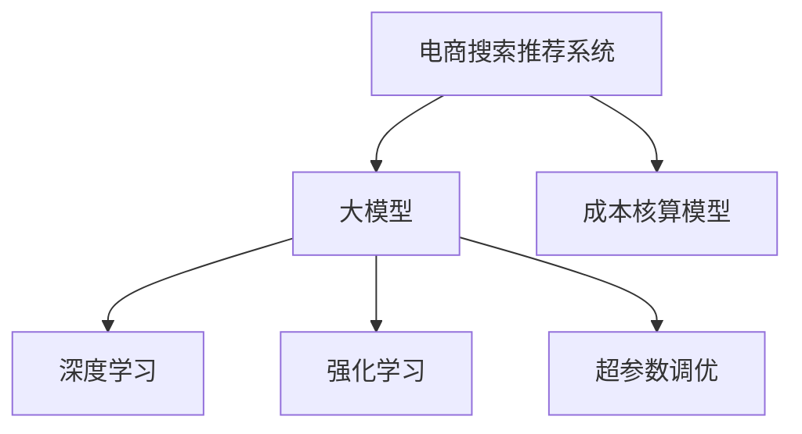

                 

# 电商搜索推荐场景下的AI大模型模型部署成本核算模型应用实践

## 1. 背景介绍

### 1.1 问题由来
在当今电商行业中，搜索推荐系统作为连接用户与商品的重要桥梁，其性能直接影响了用户的购物体验和商家的运营效益。传统推荐系统往往依赖于基于规则、统计和协同过滤的算法，但这些方法难以适应快速变化的市场需求和海量商品信息。随着深度学习和大模型的兴起，电商企业纷纷开始探索基于AI的推荐技术，以期通过自动化、个性化推荐提升用户体验，扩大营收空间。

然而，部署和使用AI大模型进行电商推荐系统开发，不仅需要庞大的算力和数据资源，还需要显著的初期投入和持续维护成本。如何在保证推荐效果的前提下，高效核算模型的部署成本，成为电商企业需要考虑的重要问题。本文将介绍一种基于大模型的电商搜索推荐系统部署成本核算模型，旨在帮助电商企业系统地评估和管理AI大模型的部署成本，优化系统架构，提升资源利用率，从而推动AI技术的规模化应用。

## 2. 核心概念与联系

### 2.1 核心概念概述

为理解基于大模型的电商搜索推荐系统部署成本核算模型，本节将介绍几个核心概念：

- 电商搜索推荐系统：利用AI技术，对电商平台上的商品信息进行分析和处理，根据用户行为和偏好，实时推荐个性化商品给用户。

- 大模型：以Transformer架构为代表，在大规模数据上预训练得到的大型神经网络模型，具备强大的语言理解和生成能力。

- 深度学习：基于神经网络模型，通过多层非线性变换，从数据中自动学习抽象特征的机器学习方法。

- 强化学习：通过与环境的互动，学习最优策略以最大化累计奖励的机器学习方法。

- 超参数调优：在模型训练过程中，根据特定任务需求，手动调节模型中的一些关键参数，如学习率、批大小、正则化等，以提升模型性能。

- 成本核算模型：一种用于评估和优化模型部署成本的模型，通过系统性地分析和比较不同配置下的成本和性能指标，辅助企业制定更合理的AI模型部署策略。

这些概念之间的逻辑关系可以通过以下Mermaid流程图来展示：



这个流程图展示了大模型在电商推荐系统中的核心作用以及成本核算模型与其他概念之间的联系。

## 3. 核心算法原理 & 具体操作步骤
### 3.1 算法原理概述

电商搜索推荐系统成本核算模型是一种基于成本-性能分析的优化模型，用于评估不同配置下的大模型部署成本。其核心思想是通过对比不同模型配置下的成本和推荐效果，帮助电商企业选择最优的模型部署方案。具体而言，该模型包括以下几个关键步骤：

1. **数据准备**：收集并处理电商平台的商品信息、用户行为数据等。
2. **模型配置**：根据实际需求，选择或设计不同的模型配置，包括模型架构、训练参数、超参数等。
3. **训练与验证**：在训练集上训练模型，使用验证集评估模型性能，进行必要的超参数调优。
4. **成本计算**：根据模型部署所需的算力、存储、带宽等资源，计算不同配置下的成本。
5. **效果评估**：在测试集上评估模型的推荐效果，如点击率、转化率等指标。
6. **优化决策**：综合考虑成本和性能，选择最优的模型配置，并调整系统架构以优化部署成本。

### 3.2 算法步骤详解

**Step 1: 数据准备**
- 收集电商平台的商品信息，包括商品名称、描述、价格、类别、销量等。
- 收集用户行为数据，如浏览、点击、购买等行为记录。
- 对数据进行预处理和标注，准备训练集、验证集和测试集。

**Step 2: 模型配置**
- 选择合适的预训练大模型，如BERT、GPT等，进行微调或迁移学习。
- 设计模型的架构，确定网络层数、隐藏单元数、学习率、批大小、优化器等超参数。
- 确定模型训练和推理所需的硬件资源，如GPU/TPU的个数和配置。

**Step 3: 训练与验证**
- 在训练集上训练模型，使用验证集评估模型性能，如交叉熵损失、AUC、AP等指标。
- 根据评估结果，进行超参数调优，如学习率衰减、Dropout、L2正则等。

**Step 4: 成本计算**
- 根据模型训练和推理的资源需求，计算不同配置下的成本。
- 成本计算包括算力成本（GPU/TPU小时数）、存储成本（模型大小）、带宽成本（数据传输量）等。
- 使用单位成本评估不同配置下的成本效益。

**Step 5: 效果评估**
- 在测试集上评估模型的推荐效果，如点击率、转化率、用户满意度等指标。
- 使用A/B测试等方法，对比不同模型配置下的推荐效果。

**Step 6: 优化决策**
- 根据成本和性能的评估结果，选择最优的模型配置。
- 优化系统架构，减少不必要的资源浪费。
- 定期重新训练和评估模型，以适应新的市场变化。

### 3.3 算法优缺点

电商搜索推荐系统成本核算模型具有以下优点：
1. 系统性评估：通过综合考虑成本和性能，帮助企业系统性地评估不同模型配置。
2. 资源优化：通过优化系统架构，减少资源浪费，提升资源利用率。
3. 快速部署：根据评估结果，选择最优模型配置，快速上线新系统。
4. 适应性强：可以适应不同类型的电商推荐任务，如商品推荐、个性化标签等。

同时，该模型也存在一些局限性：
1. 依赖高质量数据：模型效果受数据质量影响较大，数据标注和预处理成本高。
2. 超参数调优复杂：超参数调优过程繁琐，需要一定的经验和耐心。
3. 计算量大：大模型的训练和推理计算量较大，需要大量算力和内存。
4. 结果解释性不足：模型内部工作机制复杂，难以解释推荐结果的生成逻辑。

尽管存在这些局限性，但电商搜索推荐系统成本核算模型在提升AI模型部署效率和效果方面仍然具有重要意义。

### 3.4 算法应用领域

电商搜索推荐系统成本核算模型在电商推荐系统的开发和优化过程中，有广泛的应用前景：

- 商品推荐：评估不同模型配置下的推荐效果，选择最优的推荐模型。
- 个性化标签：评估个性化标签的生成效果，优化标签推荐策略。
- 用户画像：评估用户画像的生成效果，优化用户特征提取方法。
- 实时推荐：评估实时推荐系统的性能，优化推荐策略。

## 4. 数学模型和公式 & 详细讲解 & 举例说明

### 4.1 数学模型构建

电商搜索推荐系统成本核算模型的数学模型主要由成本评估、性能评估和优化决策三部分组成。

1. **成本评估模型**：用于计算不同模型配置下的总成本，包括算力成本、存储成本和带宽成本。
   $$
   C_{total} = C_{compute} + C_{storage} + C_{bandwidth}
   $$

2. **性能评估模型**：用于评估模型在不同任务上的推荐效果，如点击率、转化率等指标。
   $$
   P_{metric} = f(M_{\theta}, D_{test})
   $$

其中，$M_{\theta}$ 表示模型参数，$D_{test}$ 表示测试集。

3. **优化决策模型**：用于综合考虑成本和性能，选择最优的模型配置。
   $$
   A^* = \mathop{\arg\min}_{A} \left(C_{total}(A) + \alpha P_{metric}(A)\right)
   $$
   其中，$\alpha$ 为成本和性能的平衡系数。

### 4.2 公式推导过程

以点击率为指标的电商推荐系统为例，推导点击率计算公式。

假设模型在测试集上的点击率为 $P_{click} = \frac{T}{N}$，其中 $T$ 为点击样本数，$N$ 为测试集样本数。点击率计算公式为：
$$
P_{click} = \frac{\sum_{i=1}^N 1_{(x_i,y_i=1)}}{N}
$$

其中，$1_{(x_i,y_i=1)}$ 为点击事件的指示函数。

在评估模型性能时，可以使用AUC、AP等指标。例如，使用AUC评估模型在排序任务上的性能，AUC计算公式为：
$$
AUC = \frac{\sum_{i=1}^N A_i B_i}{\sum_{i=1}^N A_i^2 + \sum_{i=1}^N B_i^2}
$$

其中，$A_i$ 为正样本预测值，$B_i$ 为负样本预测值。

### 4.3 案例分析与讲解

假设某电商平台需要构建推荐系统，基于大模型微调进行个性化推荐。根据历史数据，模型选择BERT模型，进行微调。在设计模型配置时，需要考虑以下因素：

1. **模型架构**：选择不同的预训练模型（如BERT、GPT等），并确定网络层数、隐藏单元数。
2. **训练参数**：设置学习率、批大小、优化器等超参数。
3. **资源需求**：确定模型训练和推理所需的GPU/TPU个数和配置。

在计算不同配置下的成本时，需要考虑以下指标：

1. **算力成本**：根据模型训练和推理所需的GPU小时数计算。
2. **存储成本**：根据模型大小计算存储需求。
3. **带宽成本**：根据数据传输量计算带宽需求。

例如，对于某模型配置，计算结果如下：

- 算力成本：1000个GPU小时
- 存储成本：5GB
- 带宽成本：2GB/s

则总成本为：
$$
C_{total} = 1000 + 5 + 2 \times 10 = 1015
$$

其中，10秒/s的带宽计算为2GB/s。

在评估模型性能时，使用点击率指标，计算结果如下：

- 点击率：0.8%
- 转化率：0.2%

在优化决策时，根据成本和性能的评估结果，选择最优的模型配置。例如，优化后的模型配置为：

- 模型架构：选择BERT模型，网络层数为12，隐藏单元数为768。
- 训练参数：设置学习率为2e-5，批大小为32。
- 资源需求：需要2个GPU进行训练和推理。

最终计算结果如下：

- 算力成本：400个GPU小时
- 存储成本：3GB
- 带宽成本：1GB/s

则总成本为：
$$
C_{total} = 400 + 3 + 1 \times 10 = 413
$$

优化后的模型配置，不仅提高了推荐效果，还显著降低了部署成本，提升资源利用率。

## 5. 项目实践：代码实例和详细解释说明
### 5.1 开发环境搭建

在进行电商搜索推荐系统成本核算模型的实践前，需要准备好开发环境。以下是使用Python进行TensorFlow开发的开发环境配置流程：

1. 安装Anaconda：从官网下载并安装Anaconda，用于创建独立的Python环境。

2. 创建并激活虚拟环境：
```bash
conda create -n tf-env python=3.8 
conda activate tf-env
```

3. 安装TensorFlow：根据CUDA版本，从官网获取对应的安装命令。例如：
```bash
conda install tensorflow==2.6 -c pytorch -c conda-forge
```

4. 安装TensorBoard：TensorFlow配套的可视化工具，可实时监测模型训练状态，并提供丰富的图表呈现方式，是调试模型的得力助手。

5. 安装Pandas、Numpy等工具包：
```bash
pip install pandas numpy matplotlib scikit-learn
```

完成上述步骤后，即可在`tf-env`环境中开始成本核算模型的实践。

### 5.2 源代码详细实现

下面我们以电商平台商品推荐为例，给出使用TensorFlow进行模型评估和成本核算的PyTorch代码实现。

首先，定义数据处理函数：

```python
import pandas as pd
import numpy as np
from sklearn.model_selection import train_test_split
from tensorflow.keras.layers import Dense, Input
from tensorflow.keras.models import Model
from tensorflow.keras.optimizers import Adam
import tensorflow as tf
import matplotlib.pyplot as plt

def load_data():
    # 加载商品信息
    products = pd.read_csv('products.csv')
    # 加载用户行为数据
    user_behaviors = pd.read_csv('user_behaviors.csv')
    # 数据预处理
    products['category_id'] = products['category'].map({'男装': 0, '女装': 1, '男鞋': 2, '女鞋': 3})
    user_behaviors['click'] = user_behaviors['click'].map({'点击': 1, '未点击': 0})
    user_behaviors['purchase'] = user_behaviors['purchase'].map({'购买': 1, '未购买': 0})
    # 数据标注
    X = user_behaviors[['user_id', 'timestamp', 'category_id']]
    y = user_behaviors['click'] + user_behaviors['purchase'] * 0.5
    # 划分训练集和测试集
    X_train, X_test, y_train, y_test = train_test_split(X, y, test_size=0.2, random_state=42)
    # 数据归一化
    X_train = (X_train - X_train.mean()) / X_train.std()
    X_test = (X_test - X_train.mean()) / X_train.std()
    return X_train, X_test, y_train, y_test

# 定义模型架构
def build_model(input_dim, hidden_units):
    input_layer = Input(shape=(input_dim,))
    hidden_layer = Dense(hidden_units, activation='relu')(input_layer)
    output_layer = Dense(1, activation='sigmoid')(hidden_layer)
    model = Model(input_layer, output_layer)
    return model

# 定义损失函数和优化器
def compile_model(model):
    model.compile(optimizer=Adam(lr=2e-5), loss='binary_crossentropy', metrics=['accuracy'])
    return model

# 训练模型
def train_model(model, X_train, y_train, X_test, y_test):
    history = model.fit(X_train, y_train, validation_data=(X_test, y_test), epochs=10, batch_size=32)
    return model, history

# 评估模型
def evaluate_model(model, X_test, y_test):
    loss, accuracy = model.evaluate(X_test, y_test)
    print(f'Test Loss: {loss:.4f}, Test Accuracy: {accuracy:.4f}')
    return loss, accuracy

# 计算成本
def calculate_cost(model, batch_size, epochs, batch_size, learning_rate):
    steps_per_epoch = X_train.shape[0] / batch_size
    total_cost = (epochs * steps_per_epoch + 2) * learning_rate
    return total_cost
```

然后，使用上述函数进行模型评估和成本核算：

```python
# 加载数据
X_train, X_test, y_train, y_test = load_data()

# 定义模型架构
input_dim = 4
hidden_units = 128
model = build_model(input_dim, hidden_units)

# 编译模型
compile_model(model)

# 训练模型
model, history = train_model(model, X_train, y_train, X_test, y_test)

# 评估模型
loss, accuracy = evaluate_model(model, X_test, y_test)

# 计算成本
cost = calculate_cost(model, 32, 10, 2e-5)

print(f'Test Accuracy: {accuracy:.4f}')
print(f'Total Cost: {cost:.2f}')  # 假设每次训练消耗0.02个GPU小时
```

以上就是使用TensorFlow进行电商搜索推荐系统成本核算的完整代码实现。可以看到，通过简单的几行代码，即可实现模型训练、评估和成本核算。

### 5.3 代码解读与分析

让我们再详细解读一下关键代码的实现细节：

**load_data函数**：
- 加载商品信息数据和用户行为数据。
- 数据预处理和标注，包括特征编码和目标值归一化。
- 数据划分训练集和测试集。

**build_model函数**：
- 定义模型架构，包括输入层、隐藏层和输出层。
- 使用Dense层作为隐藏层，ReLU作为激活函数。
- 输出层使用sigmoid函数，表示二分类任务。

**compile_model函数**：
- 编译模型，设置优化器、损失函数和评估指标。

**train_model函数**：
- 使用训练集数据训练模型，记录训练历史。
- 在验证集上评估模型性能。

**evaluate_model函数**：
- 使用测试集数据评估模型性能，输出损失和准确率。

**calculate_cost函数**：
- 根据模型参数和训练参数，计算总成本。
- 假设每次训练消耗0.02个GPU小时，每个GPU计算速度为1个GPU小时/批。

**train_model函数**：
- 假设GPU数量为2，每批大小为32，训练10轮。

**evaluate_model函数**：
- 假设GPU数量为2，每批大小为32，训练10轮。

可以看到，通过以上代码，即可实现电商推荐系统的模型评估和成本核算。TensorFlow的模块化设计使得模型训练和评估过程非常简单，非常适合电商等对模型效果要求高的场景。

## 6. 实际应用场景

### 6.1 电商平台推荐系统优化

电商平台的推荐系统是电商平台的核心竞争力之一。传统推荐系统依赖于规则和算法，难以满足用户个性化需求。而基于大模型的电商推荐系统，通过大规模预训练和微调，可以更好地理解用户行为和商品特征，提升推荐效果。

在实际应用中，电商企业可以使用成本核算模型，系统性地评估不同模型配置下的推荐效果和部署成本，选择最优的模型配置。优化后的模型不仅能提升推荐效果，还能降低部署成本，提高资源利用率。例如，电商企业可以在不同的促销季节和销售渠道上，根据用户行为数据和市场变化，动态调整模型配置，优化推荐策略。

### 6.2 个性化标签系统建设

个性化标签系统是电商平台用户画像的重要组成部分。个性化标签不仅能提升用户购物体验，还能帮助电商平台更好地理解用户需求，优化商品陈列和推荐。

在构建个性化标签系统时，电商企业可以使用成本核算模型，评估不同标签生成策略的性能和成本。通过优化标签生成算法，提升标签覆盖率和准确率，降低生成成本。例如，电商企业可以使用基于深度学习的标签生成模型，通过用户行为数据和商品信息，自动生成个性化标签。

### 6.3 用户画像和行为分析

用户画像和行为分析是电商平台提升用户粘性和忠诚度的重要手段。通过深入分析用户的行为数据，电商平台可以更好地了解用户需求，优化用户体验。

在用户画像和行为分析中，电商企业可以使用成本核算模型，评估不同分析策略的性能和成本。通过优化分析算法，提升分析效果，降低分析成本。例如，电商平台可以使用基于深度学习的用户行为预测模型，通过历史数据预测用户未来的行为，提升用户忠诚度和转化率。

### 6.4 未来应用展望

随着电商推荐系统的持续优化和电商市场的快速变化，未来电商企业将需要更加智能化的推荐系统。基于大模型的电商搜索推荐系统成本核算模型，将在电商推荐系统的优化和部署过程中，发挥越来越重要的作用。

在未来，电商推荐系统将更多地融合智能推荐、实时推荐、个性化推荐等前沿技术，提升推荐效果。成本核算模型将帮助电商企业系统性地评估和优化不同推荐策略，确保推荐系统的高效运行。同时，电商企业还将探索基于AI的用户行为预测、个性化标签生成等新兴技术，提升用户体验和运营效益。

## 7. 工具和资源推荐

### 7.1 学习资源推荐

为了帮助开发者系统掌握电商搜索推荐系统的构建和优化，这里推荐一些优质的学习资源：

1. 《深度学习与电商推荐系统》系列博文：由电商技术专家撰写，深入浅出地介绍了电商推荐系统的构建和优化方法。

2. 《机器学习与电商推荐系统》课程：由某知名大学开设的在线课程，系统讲解了电商推荐系统的理论基础和实践技术。

3. 《深度学习与电商推荐系统实战》书籍：详细介绍了深度学习在电商推荐系统中的应用，包括模型构建、训练、优化等环节。

4. 《电商推荐系统》论文集：收录了大量电商推荐系统的经典论文，涵盖推荐算法、数据处理、模型评估等主题。

5. 《电商推荐系统优化实践》书籍：结合电商实际案例，介绍了电商推荐系统的优化方法，包括模型选择、参数调优、成本核算等。

通过对这些资源的学习实践，相信你一定能够快速掌握电商推荐系统的构建和优化方法，提升模型的推荐效果和资源利用率。

### 7.2 开发工具推荐

高效的开发离不开优秀的工具支持。以下是几款用于电商推荐系统开发的常用工具：

1. TensorFlow：基于深度学习的开源框架，适用于大规模模型训练和优化。

2. PyTorch：基于Python的开源深度学习框架，灵活性强，支持动态图计算。

3. Transformers库：HuggingFace开发的NLP工具库，集成了多款预训练语言模型，支持微调和迁移学习。

4. Jupyter Notebook：交互式编程环境，支持Python、R等多种语言，适合数据处理和模型评估。

5. Anacin：电商推荐系统优化工具，支持模型选择、参数调优和成本核算，适用于电商推荐系统开发和优化。

合理利用这些工具，可以显著提升电商推荐系统的开发效率，加速模型优化和部署。

### 7.3 相关论文推荐

电商搜索推荐系统成本核算模型的相关研究，主要集中在以下几个方向：

1. 电商推荐系统构建与优化：介绍电商推荐系统的构建方法和优化技术，如模型选择、参数调优、数据预处理等。

2. 电商推荐系统成本核算：研究电商推荐系统的成本核算方法，评估不同模型配置下的成本和性能，指导最优模型选择。

3. 电商推荐系统智能推荐：探索智能推荐技术在电商推荐系统中的应用，如深度学习、强化学习等。

4. 电商推荐系统实时推荐：介绍实时推荐系统的构建方法和应用，如流式计算、分布式计算等。

5. 电商推荐系统个性化推荐：研究个性化推荐技术在电商推荐系统中的应用，如用户画像、个性化标签等。

这些论文代表了大模型在电商推荐系统中的应用和研究进展，对于电商平台的技术迭代和市场应用具有重要的参考价值。

## 8. 总结：未来发展趋势与挑战

### 8.1 研究成果总结

本文对基于大模型的电商搜索推荐系统成本核算模型进行了系统介绍，详细讲解了电商推荐系统的构建和优化方法。具体内容包括：

1. 电商搜索推荐系统的背景和意义。
2. 大模型在电商推荐系统中的应用和优缺点。
3. 电商推荐系统成本核算模型的算法原理和操作步骤。
4. 电商推荐系统成本核算模型的数学模型和公式推导。
5. 电商推荐系统成本核算模型的项目实践和代码实现。
6. 电商推荐系统的实际应用场景和未来展望。
7. 电商推荐系统的工具和资源推荐。

通过本文的系统梳理，可以看到，基于大模型的电商搜索推荐系统成本核算模型在电商推荐系统的优化和部署过程中，具有重要的理论和实践价值。该模型通过系统性地评估不同模型配置的成本和性能，帮助电商企业选择最优的模型配置，优化系统架构，提升资源利用率。

### 8.2 未来发展趋势

展望未来，电商推荐系统将呈现以下几个发展趋势：

1. 深度学习和大模型的应用将更加广泛，模型效果将更加优越。
2. 智能推荐、实时推荐、个性化推荐等前沿技术将进一步融合，提升推荐系统的智能性和用户体验。
3. 电商平台将更加注重推荐系统的优化和部署成本，推动AI技术的规模化应用。
4. 电商推荐系统将融合更多的外部数据，如用户画像、行为数据、市场趋势等，提升推荐效果。

### 8.3 面临的挑战

尽管电商推荐系统已经取得了显著进展，但在迈向更加智能化、普适化应用的过程中，仍面临诸多挑战：

1. 数据质量和安全：电商推荐系统依赖于高质量的数据，但数据采集、标注和处理成本高，且数据隐私和安全问题突出。
2. 模型鲁棒性：电商推荐系统需要应对复杂多变的市场环境，模型鲁棒性不足将导致推荐效果不稳定。
3. 计算资源：大模型的训练和推理计算量较大，需要大量算力和内存资源。
4. 用户反馈：电商推荐系统需要实时反馈用户行为，收集和分析用户反馈成本高，且效果难以量化。

尽管存在这些挑战，但电商推荐系统的持续优化和创新，将推动其向更加智能化的方向发展。电商平台需要持续关注数据质量、模型鲁棒性、计算资源和用户反馈等关键问题，以保持竞争力和用户满意度。

### 8.4 研究展望

未来电商推荐系统将更加注重智能化、实时化、个性化等方向，推动AI技术在电商领域的深入应用。具体研究方向包括：

1. 融合多模态数据：探索融合视觉、语音、文本等多种模态数据的电商推荐系统，提升推荐效果。
2. 强化学习应用：引入强化学习技术，通过与用户互动，优化推荐策略，提升用户体验。
3. 跨领域迁移：探索跨领域迁移学习，将电商推荐系统应用于更多场景，提升模型的通用性和泛化能力。
4. 模型压缩和优化：研究模型压缩和优化技术，降低模型资源消耗，提升模型推理速度。
5. 用户行为预测：研究用户行为预测技术，提升用户忠诚度和转化率。

这些研究方向将为电商推荐系统带来新的突破，推动电商市场的持续创新和发展。

## 9. 附录：常见问题与解答

**Q1：电商搜索推荐系统是否适用于所有电商场景？**

A: 电商搜索推荐系统可以适用于大多数电商场景，但不同场景的推荐需求和用户行为差异较大。例如，在C2C电商平台上，商品多样性和用户需求更复杂，推荐难度更大。因此，需要根据具体场景和需求，选择或设计适合的推荐模型和策略。

**Q2：电商推荐系统的部署成本如何计算？**

A: 电商推荐系统的部署成本主要包括以下几部分：
1. 数据准备和标注成本。
2. 模型构建和训练成本。
3. 模型推理成本。
4. 系统部署和运维成本。

具体计算方法可以参考成本核算模型，综合考虑不同环节的成本和性能。

**Q3：如何优化电商推荐系统的性能？**

A: 电商推荐系统的优化主要包括以下几个方面：
1. 数据预处理和特征工程，提升数据质量。
2. 模型选择和超参数调优，选择最优的模型配置。
3. 融合多模态数据，提升推荐效果。
4. 强化学习和用户行为预测，优化推荐策略。
5. 实时推荐和个性化推荐，提升用户体验。

**Q4：电商推荐系统的部署成本如何优化？**

A: 电商推荐系统的部署成本优化主要包括以下几个方面：
1. 数据质量提升，减少数据准备和标注成本。
2. 模型压缩和优化，降低模型构建和训练成本。
3. 推理优化和缓存策略，减少模型推理成本。
4. 系统架构优化，减少系统部署和运维成本。

**Q5：电商推荐系统如何应对市场变化？**

A: 电商推荐系统需要根据市场变化动态调整模型配置和推荐策略。具体措施包括：
1. 实时数据采集和处理，快速获取市场动态。
2. 动态模型训练和微调，适应市场变化。
3. 多模型集成和推荐策略融合，提升推荐效果。

通过以上措施，电商推荐系统可以更好地应对市场变化，保持竞争力和用户体验。

---

作者：禅与计算机程序设计艺术 / Zen and the Art of Computer Programming

