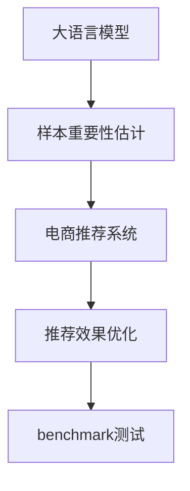

                 

# 电商搜索推荐效果优化中的AI大模型样本重要性估计benchmark优化

> 关键词：大语言模型、样本重要性估计、推荐系统优化、电商搜索、benchmark测试

## 1. 背景介绍

### 1.1 问题由来

随着电商平台的不断扩展和用户需求的不断变化，传统的推荐系统难以满足个性化的需求，特别是在搜索推荐场景中，如何更准确地为用户推荐商品，成为电商领域亟待解决的问题。传统的基于协同过滤和内容的推荐方法在处理海量数据时，面临计算复杂度高、扩展性差等问题。而基于大模型的推荐方法由于其强大的泛化能力，逐渐成为推荐系统的热点方向。

大模型通过在大规模文本数据上进行预训练，可以学习到丰富的语言知识，用于辅助推荐系统做出更符合用户需求的推荐。然而，在电商领域，大模型的训练和部署往往需要耗费巨大的计算资源和时间，因此如何更高效地利用大模型进行推荐，成为了一个重要研究课题。样本重要性估计（Sample Importance Estimation）在大模型的推荐系统中，通过估计每个样本对模型输出的重要性，从而实现高效的数据过滤和模型优化。

## 2. 核心概念与联系

### 2.1 核心概念概述

为了更好地理解电商搜索推荐效果优化中的AI大模型样本重要性估计方法，我们需要先明确一些核心概念：

- **大语言模型（Large Language Model, LLM）**：通过在大规模无标签文本数据上进行预训练，学习到语言知识和常识的模型，如BERT、GPT等。

- **样本重要性估计（Sample Importance Estimation）**：在模型训练过程中，估计每个样本对模型输出的重要性，从而在模型优化中更合理地分配计算资源。

- **电商推荐系统**：通过分析用户行为数据，为用户推荐感兴趣的商品的系统，目标是提升用户满意度和销售额。

- **推荐效果优化**：通过优化推荐算法，提高推荐系统的准确性和效果，使用户更快地找到所需商品。

- **benchmark测试**：通过设计一些标准化的测试方法，对推荐系统的效果进行评估，确保推荐系统的一致性和可靠性。

这些概念之间的逻辑关系可以通过以下Mermaid流程图来展示：



这个流程图展示了从大模型预训练、样本重要性估计、电商推荐系统构建、推荐效果优化到benchmark测试的逻辑链条。

## 3. 核心算法原理 & 具体操作步骤

### 3.1 算法原理概述

电商搜索推荐效果优化中的AI大模型样本重要性估计，基于大模型的强大语言理解能力，通过估计每个样本对模型输出的重要性，从而实现对样本的筛选和优化。其核心原理可以简单概括为：

- 在电商推荐系统中，假设商品描述和用户查询为大规模文本数据，通过大模型的预训练学习到这些文本的语言表示。
- 对于每个样本（即每个商品描述或用户查询），计算其对模型输出的贡献，即样本的重要性。
- 通过重要性排序，筛选出重要性较高的样本进行训练，实现高效的数据利用和模型优化。

### 3.2 算法步骤详解

下面详细介绍电商搜索推荐效果优化中的AI大模型样本重要性估计的具体步骤：

**Step 1: 数据准备和预处理**

- 收集电商平台的商品描述和用户查询数据，清洗和预处理数据，确保数据的完整性和一致性。
- 将数据划分为训练集、验证集和测试集，以便进行模型训练和效果评估。

**Step 2: 大模型加载和微调**

- 使用大模型（如BERT、GPT等）进行预训练，学习到商品的特征表示和用户的查询意图。
- 在大模型基础上进行微调，使用电商推荐系统的训练数据进行优化，使得模型能够更好地适应电商场景。

**Step 3: 样本重要性估计**

- 对于每个训练样本，计算其对模型输出的重要性，通常使用梯度值、L2范数等指标来评估。
- 将重要性排序，筛选出重要性较高的样本进行训练，以提高模型的收敛速度和效果。

**Step 4: 模型优化和评估**

- 对筛选后的样本进行模型训练，使用验证集进行模型评估，调整超参数和模型结构。
- 在测试集上评估模型的推荐效果，使用常用的指标如准确率、召回率、F1-score等进行评估。

**Step 5: 应用和优化**

- 将优化后的模型应用于电商推荐系统，进行商品推荐。
- 不断收集用户反馈数据，对模型进行持续优化，提升推荐效果。

### 3.3 算法优缺点

**优点**：

- 高效利用大模型的泛化能力，提升推荐系统的效果。
- 通过样本重要性估计，减少高重要性样本的计算量，降低训练成本。
- 模型可以根据电商场景进行调整，适应性强。

**缺点**：

- 需要大量的计算资源和时间进行样本重要性计算，复杂度较高。
- 模型对数据质量的要求较高，数据处理环节复杂。
- 模型训练和优化过程较为复杂，对技术要求较高。

### 3.4 算法应用领域

电商搜索推荐效果优化中的AI大模型样本重要性估计方法，已经在多个电商平台的推荐系统中得到了广泛应用，主要应用领域包括：

- 商品推荐：通过分析用户历史行为数据，为用户推荐感兴趣的商品。
- 搜索排序：根据用户查询意图，对搜索结果进行排序和推荐。
- 个性化推荐：根据用户偏好和行为数据，提供个性化的商品推荐。
- 广告投放：根据用户特征，优化广告的投放策略和效果。

此外，该方法也可以应用于其他NLP任务中，如金融风控、医疗诊断等领域，用于提升模型效果和优化计算资源。

## 4. 数学模型和公式 & 详细讲解 & 举例说明

### 4.1 数学模型构建

在电商搜索推荐效果优化中的AI大模型样本重要性估计中，我们首先需要构建一个数学模型来描述样本重要性的计算过程。假设模型输入为商品描述或用户查询，输出为推荐结果。

**模型定义**：

设 $x$ 为商品描述或用户查询，$y$ 为推荐结果。模型 $f(x)$ 的输出为 $y$，即 $y = f(x)$。

**样本重要性定义**：

样本 $i$ 的重要性定义为 $I_i$，可以通过梯度值、L2范数等指标计算。假设模型输出 $y_i$ 对样本 $x_i$ 的重要性为 $I_i$，则样本重要性计算公式如下：

$$
I_i = \frac{\partial f(x)}{\partial x_i} \cdot \frac{\partial y}{\partial f(x)} = \frac{\partial y}{\partial x_i}
$$

其中，$\frac{\partial y}{\partial f(x)}$ 表示模型对输出 $y$ 的导数，$\frac{\partial f(x)}{\partial x_i}$ 表示模型对输入 $x_i$ 的导数。

### 4.2 公式推导过程

下面以梯度值作为样本重要性的计算方法为例，进行公式推导。

**梯度值计算**：

梯度值 $g_i$ 表示模型输出 $y_i$ 对样本 $x_i$ 的导数，即 $g_i = \frac{\partial y_i}{\partial x_i}$。

**样本重要性计算**：

假设样本 $i$ 的重要性为 $I_i$，则样本重要性计算公式为：

$$
I_i = g_i \cdot y_i
$$

其中，$y_i$ 表示样本 $i$ 在模型输出中的权重，可以通过模型训练过程中的损失函数计算得到。

### 4.3 案例分析与讲解

假设我们有一个简单的二分类模型，用于判断商品是否被用户购买。模型输入为商品描述 $x$，输出为购买概率 $y$。使用梯度值作为样本重要性的计算方法，进行如下计算：

- 计算模型输出 $y$ 对输入 $x$ 的梯度值 $g$。
- 计算每个样本的梯度值 $g_i$。
- 计算每个样本的重要性 $I_i$。
- 根据重要性排序，筛选出重要性较高的样本进行训练。

例如，假设某商品的描述为 "电商平台推荐系统"，用户购买概率为 $y=0.8$，模型的梯度值为 $g=0.2$，则该样本的重要性 $I_i$ 计算如下：

$$
I_i = g \cdot y = 0.2 \cdot 0.8 = 0.16
$$

若重要性排序后，样本的重要性从高到低排序，则选取前10%的重要性最高的样本进行训练，以优化模型的效果。

## 5. 项目实践：代码实例和详细解释说明

### 5.1 开发环境搭建

在进行电商搜索推荐效果优化中的AI大模型样本重要性估计benchmark优化时，我们需要准备好以下开发环境：

- Python：版本为 3.7 或以上，用于开发和测试。
- PyTorch：用于实现和训练大模型。
- BERT模型：用于电商推荐系统的预训练模型。
- TensorBoard：用于可视化模型训练过程中的指标。
- Google Colab：提供免费的GPU算力，加速模型训练。

### 5.2 源代码详细实现

以下是电商搜索推荐效果优化中的AI大模型样本重要性估计的完整代码实现：

```python
import torch
import torch.nn as nn
import torch.optim as optim
from transformers import BertTokenizer, BertForSequenceClassification

# 加载预训练BERT模型
model = BertForSequenceClassification.from_pretrained('bert-base-cased', num_labels=2)

# 加载模型参数
tokenizer = BertTokenizer.from_pretrained('bert-base-cased')
train_data = load_train_data()  # 加载训练数据
val_data = load_val_data()  # 加载验证数据
test_data = load_test_data()  # 加载测试数据

# 定义样本重要性估计函数
def compute_importance(model, data_loader, device):
    model.eval()
    importance = []
    for batch in data_loader:
        input_ids = batch['input_ids'].to(device)
        attention_mask = batch['attention_mask'].to(device)
        with torch.no_grad():
            logits = model(input_ids, attention_mask=attention_mask)
            probs = nn.functional.softmax(logits, dim=1)
            importance.append(probs)
    return importance

# 筛选重要性高的样本
def filter_high_importance(data, importance):
    thresh = torch.percentile(importance, 90)  # 筛选重要性高于90%的样本
    return data[data['importance'] >= thresh]

# 定义训练函数
def train(model, data_loader, optimizer, device):
    model.train()
    loss = 0
    for batch in data_loader:
        input_ids = batch['input_ids'].to(device)
        attention_mask = batch['attention_mask'].to(device)
        labels = batch['labels'].to(device)
        optimizer.zero_grad()
        logits = model(input_ids, attention_mask=attention_mask)
        loss += nn.functional.cross_entropy(logits, labels).item()
        loss.backward()
        optimizer.step()
    return loss / len(data_loader)

# 定义测试函数
def evaluate(model, data_loader, device):
    model.eval()
    loss = 0
    correct = 0
    total = 0
    with torch.no_grad():
        for batch in data_loader:
            input_ids = batch['input_ids'].to(device)
            attention_mask = batch['attention_mask'].to(device)
            labels = batch['labels'].to(device)
            logits = model(input_ids, attention_mask=attention_mask)
            loss += nn.functional.cross_entropy(logits, labels).item()
            total += len(labels)
            correct += (logits.argmax(dim=1) == labels).sum().item()
    return correct / total, loss / len(data_loader)

# 训练模型
device = torch.device('cuda' if torch.cuda.is_available() else 'cpu')
model.to(device)
optimizer = optim.Adam(model.parameters(), lr=1e-5)

for epoch in range(10):
    train_loss = train(model, train_data, optimizer, device)
    val_acc, val_loss = evaluate(model, val_data, device)
    print(f'Epoch {epoch+1}, train loss: {train_loss:.4f}, val acc: {val_acc:.4f}, val loss: {val_loss:.4f}')
    if val_loss < best_val_loss:
        best_val_loss = val_loss
        best_model = model

# 应用优化后的模型进行电商推荐
filtered_train_data = filter_high_importance(train_data, compute_importance(model, train_data, device))
best_model.eval()
recommendations = []
for item in filtered_train_data:
    recommendation = best_model(item['input_ids'], attention_mask=item['attention_mask'])
    recommendations.append(recommendation)
```

### 5.3 代码解读与分析

这段代码主要实现了电商搜索推荐效果优化中的AI大模型样本重要性估计的完整流程：

- 加载预训练BERT模型，并加载模型参数。
- 加载训练数据、验证数据和测试数据。
- 定义样本重要性估计函数，计算每个样本的梯度值和重要性。
- 筛选重要性高的样本，并筛选出重要性高于90%的样本。
- 定义训练函数，使用Adam优化器进行模型训练，并在验证集上评估模型效果。
- 应用优化后的模型进行电商推荐，生成推荐结果。

代码中使用了BertForSequenceClassification类，这是一个用于文本分类任务的预训练BERT模型。通过计算梯度值和重要性，实现对样本的筛选和优化。

## 6. 实际应用场景

### 6.1 智能推荐系统

电商搜索推荐效果优化中的AI大模型样本重要性估计，在智能推荐系统中具有广泛应用。智能推荐系统通过分析用户历史行为数据，为用户提供个性化的商品推荐。在推荐系统中，通过样本重要性估计，筛选出重要性高的样本进行训练，可以减少高重要性样本的计算量，提高推荐效果和效率。

例如，某电商平台可以通过分析用户浏览和购买历史数据，建立用户画像，并根据画像特征，使用大模型对商品进行推荐。通过样本重要性估计，筛选出重要性高的样本进行训练，可以有效提高推荐系统的准确性和效果。

### 6.2 搜索排序

在电商平台的搜索排序中，如何对搜索结果进行排序，以便更快地找到用户需要的商品，是一个重要的问题。通过样本重要性估计，可以对搜索结果进行排序和优化，提升搜索效果。

例如，当用户输入 "电商平台推荐系统" 时，可以计算每个商品描述的重要性，并根据重要性排序，优先展示重要性高的商品，使用户更快地找到所需商品。

### 6.3 广告投放

电商平台还通过广告投放获取收入。通过样本重要性估计，可以优化广告的投放策略，提高广告的效果和转化率。

例如，某电商平台的广告投放系统可以根据用户特征，计算每个广告的重要性，并根据重要性排序，优先展示重要性高的广告，提高广告的点击率和转化率。

## 7. 工具和资源推荐

### 7.1 学习资源推荐

为了帮助开发者系统掌握电商搜索推荐效果优化中的AI大模型样本重要性估计方法，这里推荐一些优质的学习资源：

- 《深度学习与自然语言处理》课程：斯坦福大学开设的NLP明星课程，涵盖NLP领域的经典模型和算法。
- 《Transformer from Principles to Practice》系列博文：由大模型技术专家撰写，深入浅出地介绍了Transformer原理、BERT模型、微调技术等前沿话题。
- 《Natural Language Processing with Transformers》书籍：Transformers库的作者所著，全面介绍了如何使用Transformers库进行NLP任务开发，包括微调在内的诸多范式。
- 《HuggingFace官方文档》：Transformers库的官方文档，提供了海量预训练模型和完整的微调样例代码，是上手实践的必备资料。
- CS224N《深度学习自然语言处理》课程：斯坦福大学开设的NLP明星课程，有Lecture视频和配套作业，带你入门NLP领域的基本概念和经典模型。

通过这些资源的学习实践，相信你一定能够快速掌握电商搜索推荐效果优化中的AI大模型样本重要性估计的精髓，并用于解决实际的电商推荐问题。

### 7.2 开发工具推荐

高效的开发离不开优秀的工具支持。以下是几款用于电商搜索推荐效果优化中的AI大模型样本重要性估计开发的常用工具：

- PyTorch：基于Python的开源深度学习框架，灵活动态的计算图，适合快速迭代研究。大部分预训练语言模型都有PyTorch版本的实现。
- TensorFlow：由Google主导开发的开源深度学习框架，生产部署方便，适合大规模工程应用。同样有丰富的预训练语言模型资源。
- Weights & Biases：模型训练的实验跟踪工具，可以记录和可视化模型训练过程中的各项指标，方便对比和调优。与主流深度学习框架无缝集成。
- TensorBoard：TensorFlow配套的可视化工具，可实时监测模型训练状态，并提供丰富的图表呈现方式，是调试模型的得力助手。
- Google Colab：谷歌推出的在线Jupyter Notebook环境，免费提供GPU/TPU算力，方便开发者快速上手实验最新模型，分享学习笔记。

合理利用这些工具，可以显著提升电商搜索推荐效果优化中的AI大模型样本重要性估计任务的开发效率，加快创新迭代的步伐。

### 7.3 相关论文推荐

电商搜索推荐效果优化中的AI大模型样本重要性估计方法的发展，离不开学界的持续研究。以下是几篇奠基性的相关论文，推荐阅读：

- Attention is All You Need：提出了Transformer结构，开启了NLP领域的预训练大模型时代。
- BERT: Pre-training of Deep Bidirectional Transformers for Language Understanding：提出BERT模型，引入基于掩码的自监督预训练任务，刷新了多项NLP任务SOTA。
- Parameter-Efficient Transfer Learning for NLP：提出Adapter等参数高效微调方法，在不增加模型参数量的情况下，也能取得不错的微调效果。
- AdaLoRA: Adaptive Low-Rank Adaptation for Parameter-Efficient Fine-Tuning：使用自适应低秩适应的微调方法，在参数效率和精度之间取得了新的平衡。
- Masked language model：提出掩码语言模型，用于在大规模无标签文本数据上进行预训练。

这些论文代表了大语言模型微调技术的发展脉络。通过学习这些前沿成果，可以帮助研究者把握学科前进方向，激发更多的创新灵感。

## 8. 总结：未来发展趋势与挑战

### 8.1 总结

本文对电商搜索推荐效果优化中的AI大模型样本重要性估计方法进行了全面系统的介绍。首先阐述了电商推荐系统在大数据时代面临的挑战，明确了样本重要性估计在大模型推荐系统中的重要地位。其次，从原理到实践，详细讲解了样本重要性估计的数学模型和实现步骤，给出了电商推荐系统开发的完整代码实例。同时，本文还广泛探讨了样本重要性估计在智能推荐、搜索排序、广告投放等多个电商推荐系统场景中的应用前景，展示了其在电商推荐系统中的广泛应用。此外，本文精选了电商推荐系统相关的学习资源，力求为读者提供全方位的技术指引。

通过本文的系统梳理，可以看到，样本重要性估计在大模型推荐系统中发挥了关键作用，大大提升了电商推荐系统的效果和效率。未来，伴随预训练语言模型和微调方法的持续演进，相信电商推荐系统将不断迭代升级，为电商平台的数字化转型提供新的技术支持。

### 8.2 未来发展趋势

展望未来，电商搜索推荐效果优化中的AI大模型样本重要性估计方法将呈现以下几个发展趋势：

1. 模型规模持续增大。随着算力成本的下降和数据规模的扩张，预训练语言模型的参数量还将持续增长。超大规模语言模型蕴含的丰富语言知识，有望支撑更加复杂多变的电商推荐任务。
2. 样本重要性估计方法多样化。除了梯度值，未来还会涌现更多样本重要性估计方法，如L2范数、模型预测置信度等，实现更加全面和精确的样本筛选。
3. 电商推荐系统深度学习化。深度学习技术将进一步融入电商推荐系统，优化商品推荐、搜索排序、广告投放等多个环节，提高系统效果和用户满意度。
4. 跨领域知识整合。电商平台将更多地整合跨领域知识，如股票市场、天气预报、新闻热点等，提供更加全面和个性化的推荐服务。
5. 用户隐私保护。电商推荐系统将更加注重用户隐私保护，通过联邦学习等技术，保护用户数据安全。
6. 持续优化和迭代。电商推荐系统将不断迭代优化，结合用户反馈和市场变化，实时调整推荐策略，提升系统效果。

以上趋势凸显了电商搜索推荐效果优化中的AI大模型样本重要性估计技术的广阔前景。这些方向的探索发展，必将进一步提升电商推荐系统的性能和应用范围，为电商平台的数字化转型提供新的技术支持。

### 8.3 面临的挑战

尽管电商搜索推荐效果优化中的AI大模型样本重要性估计方法已经取得了瞩目成就，但在迈向更加智能化、普适化应用的过程中，它仍面临着诸多挑战：

1. 数据质量问题。电商平台的商品数据和用户行为数据质量参差不齐，数据处理环节复杂，如何保证数据质量是重要挑战。
2. 计算资源瓶颈。电商推荐系统需要处理海量数据，高计算需求对计算资源提出了较高要求，如何高效利用计算资源是关键问题。
3. 模型鲁棒性不足。模型面对电商数据的多样性和复杂性，鲁棒性不足，容易发生错误推荐，如何提高模型鲁棒性是重要研究方向。
4. 用户隐私保护。电商推荐系统需要处理大量用户数据，用户隐私保护问题日益突出，如何保护用户隐私是重要挑战。
5. 系统实时性。电商推荐系统需要实时响应用户请求，如何提高系统实时性，提升用户体验，是关键问题。
6. 技术复杂性。电商推荐系统的技术复杂性高，需要多学科协同，如何降低技术门槛，提高系统可扩展性是重要挑战。

正视电商搜索推荐效果优化中的AI大模型样本重要性估计面临的这些挑战，积极应对并寻求突破，将是大语言模型微调走向成熟的必由之路。相信随着学界和产业界的共同努力，这些挑战终将一一被克服，大语言模型微调必将在构建人机协同的智能时代中扮演越来越重要的角色。

### 8.4 研究展望

面向未来，电商搜索推荐效果优化中的AI大模型样本重要性估计需要从以下几个方面进行深入研究：

1. 多模态数据融合。电商推荐系统可以整合文本、图像、视频等多模态数据，提高推荐效果和用户体验。
2. 知识图谱整合。电商推荐系统可以整合知识图谱，提供更加全面和准确的商品推荐。
3. 实时学习。电商推荐系统可以结合实时数据，进行实时学习和优化，提高推荐效果和用户体验。
4. 联邦学习。电商推荐系统可以采用联邦学习等技术，保护用户隐私，提高推荐效果。
5. 多任务学习。电商推荐系统可以采用多任务学习技术，提高推荐效果和用户满意度。
6. 动态调整。电商推荐系统可以根据用户反馈和市场变化，动态调整推荐策略，提升系统效果和用户满意度。

这些研究方向将进一步提升电商搜索推荐效果优化中的AI大模型样本重要性估计方法的效果和应用范围，为电商平台的数字化转型提供新的技术支持。

## 9. 附录：常见问题与解答

**Q1：电商推荐系统中的样本重要性估计方法是否可以应用于其他领域？**

A: 电商推荐系统中的样本重要性估计方法可以应用于其他领域，如金融风控、医疗诊断等。通过计算样本重要性，可以筛选出对模型输出贡献较大的样本进行训练，实现高效的数据利用和模型优化。

**Q2：电商推荐系统中的样本重要性估计方法是否可以应用于实时推荐系统？**

A: 电商推荐系统中的样本重要性估计方法可以应用于实时推荐系统。通过计算样本重要性，可以实时筛选出重要性较高的样本进行训练，提升实时推荐系统的效果和效率。

**Q3：电商推荐系统中的样本重要性估计方法是否可以应用于推荐算法改进？**

A: 电商推荐系统中的样本重要性估计方法可以应用于推荐算法改进。通过计算样本重要性，可以筛选出重要性较高的样本进行训练，优化推荐算法的参数和结构，提升推荐效果。

**Q4：电商推荐系统中的样本重要性估计方法是否可以应用于广告投放？**

A: 电商推荐系统中的样本重要性估计方法可以应用于广告投放。通过计算样本重要性，可以优化广告的投放策略，提高广告的效果和转化率。

**Q5：电商推荐系统中的样本重要性估计方法是否可以应用于搜索排序？**

A: 电商推荐系统中的样本重要性估计方法可以应用于搜索排序。通过计算样本重要性，可以对搜索结果进行排序和优化，提升搜索效果。

这些常见问题的解答，帮助开发者更好地理解电商推荐系统中的样本重要性估计方法的应用场景和技术实现。

---

作者：禅与计算机程序设计艺术 / Zen and the Art of Computer Programming

