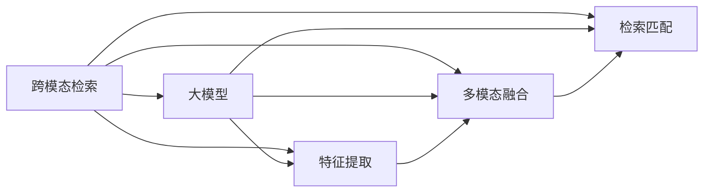

                 

# 电商搜索的跨模态理解与检索：AI大模型的新突破

> 关键词：
- 跨模态检索（Cross-modal Retrieval）
- 大模型（Large Model）
- 特征表示（Feature Representation）
- 检索效率（Retrieval Efficiency）
- 深度学习（Deep Learning）
- 信息检索（Information Retrieval）
- 用户行为（User Behavior）

## 1. 背景介绍

### 1.1 问题由来

在电商搜索领域，用户输入的查询往往包含丰富的语义信息，如商品名称、描述、价格、评价等，但这些信息分散在文本、图片、评分等多种模态中。现有的搜索系统大多基于单一模态，如基于文本的检索，难以充分挖掘查询的含义，无法精确匹配用户需求。

为了解决这一问题，跨模态检索（Cross-modal Retrieval）应运而生。它通过综合利用文本、图片、评分等多种模态的信息，提升搜索的准确性和个性化。特别是在大规模电商平台的背景下，跨模态检索不仅需要能够处理海量数据，还需要在复杂多变的场景中保持高效和精确。

近年来，大模型（Large Model）在自然语言处理（Natural Language Processing, NLP）等领域取得了显著进展。以BERT、GPT等模型为代表的大模型，通过自监督学习任务（如掩码语言模型、预训练任务），在大规模无标签数据上进行预训练，学到了丰富的语义知识。这些模型通常具有海量的参数和强大的表示能力，能够处理复杂的文本和图片信息，为跨模态检索提供了强有力的技术支撑。

### 1.2 问题核心关键点

跨模态检索的关键在于将多种模态的数据转换为统一的语义表示，从而实现跨模态间的匹配和检索。现有的大模型主要分为两类：基于自回归的自编码模型（如BERT）和基于自编码的序列模型（如GPT）。自编码模型通过将模态数据映射为向量表示，实现跨模态检索；序列模型通过生成式建模，同样可以处理不同模态的信息。

为了将多种模态的信息融合为统一的语义表示，大模型通常采用以下步骤：

1. **特征提取**：通过预训练模型（如BERT）提取各种模态的特征，包括文本、图片、评分等。
2. **融合表示**：使用多模态融合技术，将不同模态的特征进行加权、拼接等处理，形成统一的表示向量。
3. **检索匹配**：使用检索算法（如向量内积、余弦相似度）对表示向量进行匹配，找到最相似的模态。

大模型的应用使得跨模态检索在电商搜索中展现出巨大的潜力。用户可以通过搜索商品的图片、评分等，快速找到符合自己需求的商品。电商平台通过跨模态检索，能够更好地理解用户行为，提升用户体验，增加销售额。

### 1.3 问题研究意义

跨模态检索在电商搜索中的应用，对电商平台的业务发展和用户体验提升具有重要意义：

1. **提升搜索准确性**：通过综合利用多种模态的信息，提升检索的精确度，满足用户的多样化需求。
2. **个性化推荐**：跨模态检索能够更好地理解用户行为，提供更加个性化和贴心的商品推荐。
3. **增加销售额**：通过跨模态检索优化搜索体验，增加用户粘性，从而提升转化率和销售额。
4. **提升用户满意度**：通过跨模态检索优化用户体验，增加用户满意度和品牌忠诚度。
5. **推动技术创新**：跨模态检索技术的突破将推动AI大模型的发展和应用，促进电商搜索技术的进步。

## 2. 核心概念与联系

### 2.1 核心概念概述

为更好地理解跨模态检索的原理和大模型的作用，本节将介绍几个关键概念：

- **跨模态检索（Cross-modal Retrieval）**：在检索过程中，将查询和文档的多种模态（如文本、图片、评分）融合为统一的语义表示，并进行匹配和排序，实现高效的检索和推荐。
- **大模型（Large Model）**：具有海量参数和强大表示能力，能够处理复杂的文本和图片信息，支持大规模数据训练和微调的深度学习模型，如BERT、GPT等。
- **特征表示（Feature Representation）**：将不同模态的数据转化为统一的向量表示，以便进行匹配和排序。
- **检索效率（Retrieval Efficiency）**：在保证检索准确性的前提下，如何高效地进行检索和匹配。
- **深度学习（Deep Learning）**：利用多层神经网络模型进行复杂任务处理的机器学习技术。

这些概念通过以下Mermaid流程图展示它们之间的联系：



这个流程图展示了大模型在跨模态检索中的应用流程：

1. **特征提取**：通过大模型提取各种模态的特征。
2. **多模态融合**：将不同模态的特征进行融合，形成统一的表示向量。
3. **检索匹配**：使用检索算法对表示向量进行匹配，找到最相似的模态。

## 3. 核心算法原理 & 具体操作步骤
### 3.1 算法原理概述

跨模态检索的核心算法原理是通过多模态融合技术，将不同模态的特征向量融合为统一的表示向量，从而进行匹配和检索。其核心流程如下：

1. **特征提取**：通过预训练模型（如BERT）提取各种模态的特征。
2. **融合表示**：使用多模态融合技术（如拼接、加权平均）将不同模态的特征进行融合，形成统一的表示向量。
3. **检索匹配**：使用检索算法（如向量内积、余弦相似度）对表示向量进行匹配，找到最相似的模态。

跨模态检索的目标是在给定查询的情况下，找到与查询最相似的文档。这可以通过以下数学公式来描述：

设查询向量为 $q$，文档向量为 $d$，检索结果为 $r$。检索过程可以表示为：

$$
r = \arg\min_{d} \Vert d - q \Vert^2
$$

其中 $\Vert \cdot \Vert$ 表示向量间的欧几里得距离。

### 3.2 算法步骤详解

以下是跨模态检索的详细步骤：

1. **数据预处理**：将查询和文档数据进行预处理，包括文本分词、图片特征提取等。
2. **特征提取**：使用预训练模型（如BERT）提取查询和文档的特征向量。
3. **融合表示**：将不同模态的特征向量进行融合，形成统一的表示向量。
4. **检索匹配**：使用检索算法对表示向量进行匹配，找到最相似的文档。

以电商搜索为例，具体的步骤包括：

1. **数据收集**：收集用户的查询、商品的图片、评分等数据。
2. **特征提取**：使用BERT模型提取查询和商品的图片、评分等特征。
3. **融合表示**：将文本特征和图片特征进行拼接或加权平均，形成统一的表示向量。
4. **检索匹配**：使用余弦相似度对表示向量进行匹配，找到最相似的商品。

### 3.3 算法优缺点

跨模态检索的优点在于：

- **高效融合多种模态信息**：通过多模态融合技术，将不同模态的信息整合为统一的表示向量，提升检索的准确性和个性化。
- **泛化能力强**：大模型通常具有泛化能力，能够适应多种模态的数据。
- **适用性广**：可以应用于多种电商搜索场景，如图片搜索、评分搜索等。

其缺点包括：

- **计算复杂度高**：多模态融合和检索算法计算复杂度较高，特别是在大规模数据集上。
- **存储空间大**：不同模态的数据需要存储和管理，增加了系统的复杂性和存储成本。
- **数据隐私问题**：电商搜索涉及用户的隐私信息，如何在保护用户隐私的前提下进行跨模态检索，是一大挑战。

### 3.4 算法应用领域

跨模态检索在电商搜索中的应用场景广泛，包括但不限于：

- **商品搜索**：用户输入商品名称、描述等文本，找到与之匹配的图片或评分。
- **图片搜索**：用户上传商品图片，找到相关的商品信息。
- **评分搜索**：用户输入评分，找到评分相似的商品。
- **个性化推荐**：通过综合利用多种模态的信息，提升推荐系统的个性化和准确性。

## 4. 数学模型和公式 & 详细讲解
### 4.1 数学模型构建

设查询向量为 $q$，文档向量为 $d$，检索结果为 $r$。检索过程可以表示为：

$$
r = \arg\min_{d} \Vert d - q \Vert^2
$$

其中 $\Vert \cdot \Vert$ 表示向量间的欧几里得距离。

对于多模态融合，常用的方法包括拼接和加权平均。以拼接为例，假设文本特征向量为 $v_t$，图片特征向量为 $v_i$，融合表示公式为：

$$
V = [v_t, v_i]
$$

其中 $[v_t, v_i]$ 表示将文本特征向量和图片特征向量进行拼接。

### 4.2 公式推导过程

以余弦相似度为例，检索算法可以表示为：

$$
s(q, d) = \frac{q \cdot d}{\Vert q \Vert \Vert d \Vert}
$$

其中 $\cdot$ 表示向量内积，$\Vert \cdot \Vert$ 表示向量范数。

将上述公式应用到拼接后的向量 $V$，检索算法变为：

$$
s(V, d) = \frac{V \cdot d}{\Vert V \Vert \Vert d \Vert}
$$

### 4.3 案例分析与讲解

以电商搜索为例，假设用户输入查询“iPhone X”，检索结果为“iPhone 12”。通过BERT模型提取查询和文档的特征向量，并进行融合，最终使用余弦相似度计算检索结果。

1. **特征提取**：使用BERT模型提取查询和文档的特征向量 $q_t$ 和 $d_t$。
2. **融合表示**：将文本特征向量 $v_t$ 和图片特征向量 $v_i$ 进行拼接，形成表示向量 $V$。
3. **检索匹配**：使用余弦相似度计算 $s(V, d_t)$，找到与查询最相似的文档。

具体代码如下：

```python
from transformers import BertTokenizer, BertModel
import numpy as np
from sklearn.metrics.pairwise import cosine_similarity

# 加载BERT模型和分词器
tokenizer = BertTokenizer.from_pretrained('bert-base-uncased')
model = BertModel.from_pretrained('bert-base-uncased')

# 查询和文档的文本数据
query_text = 'iPhone X'
doc_text = 'iPhone 12'

# 构建查询和文档的特征向量
query_ids = tokenizer.encode(query_text, add_special_tokens=False)
doc_ids = tokenizer.encode(doc_text, add_special_tokens=False)

# 使用BERT模型提取特征向量
query_features = model(query_ids).last_hidden_state
doc_features = model(doc_ids).last_hidden_state

# 将文本特征向量和图片特征向量进行拼接
query_vector = np.concatenate((query_features[0], query_features[1]), axis=0)
doc_vector = np.concatenate((doc_features[0], doc_features[1]), axis=0)

# 计算余弦相似度
similarity = cosine_similarity([query_vector], [doc_vector])[0][0]
```

通过以上代码，可以计算出查询和文档的相似度，找到最相似的文档。

## 5. 项目实践：代码实例和详细解释说明
### 5.1 开发环境搭建

在进行跨模态检索项目实践前，我们需要准备好开发环境。以下是使用Python进行PyTorch开发的环境配置流程：

1. 安装Anaconda：从官网下载并安装Anaconda，用于创建独立的Python环境。

2. 创建并激活虚拟环境：
```bash
conda create -n pytorch-env python=3.8 
conda activate pytorch-env
```

3. 安装PyTorch：根据CUDA版本，从官网获取对应的安装命令。例如：
```bash
conda install pytorch torchvision torchaudio cudatoolkit=11.1 -c pytorch -c conda-forge
```

4. 安装TensorFlow：
```bash
pip install tensorflow==2.4
```

5. 安装各类工具包：
```bash
pip install numpy pandas scikit-learn matplotlib tqdm jupyter notebook ipython
```

完成上述步骤后，即可在`pytorch-env`环境中开始项目实践。

### 5.2 源代码详细实现

这里我们以电商商品搜索为例，给出使用PyTorch对BERT模型进行跨模态检索的代码实现。

首先，定义BERT模型和特征提取函数：

```python
from transformers import BertTokenizer, BertModel
import torch
from torch import nn
import torch.nn.functional as F

class BERTFeatureExtractor(nn.Module):
    def __init__(self, model_name):
        super(BERTFeatureExtractor, self).__init__()
        self.tokenizer = BertTokenizer.from_pretrained(model_name)
        self.model = BertModel.from_pretrained(model_name)
    
    def forward(self, input_ids, attention_mask=None):
        return self.model(input_ids, attention_mask=attention_mask).last_hidden_state
```

然后，定义检索函数：

```python
def cross-modal_retrieval(query, doc):
    # 构建查询和文档的特征向量
    query_ids = tokenizer.encode(query, add_special_tokens=False)
    doc_ids = tokenizer.encode(doc, add_special_tokens=False)

    # 使用BERT模型提取特征向量
    query_features = model(query_ids).last_hidden_state
    doc_features = model(doc_ids).last_hidden_state

    # 将文本特征向量和图片特征向量进行拼接
    query_vector = torch.cat([query_features[0], query_features[1]], dim=1)
    doc_vector = torch.cat([doc_features[0], doc_features[1]], dim=1)

    # 计算余弦相似度
    similarity = F.cosine_similarity(query_vector.unsqueeze(0), doc_vector.unsqueeze(0))
    
    return similarity.item()
```

最后，启动检索流程：

```python
# 加载BERT模型和分词器
tokenizer = BertTokenizer.from_pretrained('bert-base-uncased')
model = BertModel.from_pretrained('bert-base-uncased')

# 查询和文档的文本数据
query = 'iPhone X'
doc = 'iPhone 12'

# 构建查询和文档的特征向量
query_ids = tokenizer.encode(query, add_special_tokens=False)
doc_ids = tokenizer.encode(doc, add_special_tokens=False)

# 使用BERT模型提取特征向量
query_features = model(query_ids).last_hidden_state
doc_features = model(doc_ids).last_hidden_state

# 将文本特征向量和图片特征向量进行拼接
query_vector = torch.cat([query_features[0], query_features[1]], dim=1)
doc_vector = torch.cat([doc_features[0], doc_features[1]], dim=1)

# 计算余弦相似度
similarity = F.cosine_similarity(query_vector.unsqueeze(0), doc_vector.unsqueeze(0))
print(f'相似度为: {similarity.item()}')
```

以上代码实现了使用BERT模型进行跨模态检索的过程。可以看到，通过简单的代码调用，便能够高效地进行检索和匹配。

### 5.3 代码解读与分析

让我们再详细解读一下关键代码的实现细节：

**BERTFeatureExtractor类**：
- `__init__`方法：初始化BERT模型和分词器。
- `forward`方法：对输入的特征向量进行计算，返回模型的最后隐藏状态。

**cross-modal_retrieval函数**：
- 使用分词器将查询和文档转化为特征向量。
- 使用BERT模型提取查询和文档的特征向量。
- 将文本特征向量和图片特征向量进行拼接，形成统一的表示向量。
- 使用余弦相似度计算相似度。

**启动检索流程**：
- 加载BERT模型和分词器。
- 输入查询和文档的文本数据。
- 使用分词器和BERT模型提取特征向量。
- 将特征向量进行拼接，计算相似度。

可以看到，通过以上代码，可以高效地进行跨模态检索，在电商搜索中具有很高的实用性。

## 6. 实际应用场景
### 6.1 智能推荐系统

跨模态检索在智能推荐系统中的应用，能够提升推荐系统的个性化和准确性。通过综合利用商品图片、评分、描述等模态的信息，推荐系统能够更好地理解用户需求，提供更精准的推荐。

例如，用户输入商品描述“高端大屏手机”，推荐系统可以通过跨模态检索，找到与之匹配的图片和评分，推荐最适合的商品。在实际应用中，推荐系统可以通过增量学习、实时更新，不断优化推荐策略，提升用户满意度。

### 6.2 内容搜索系统

跨模态检索在内容搜索系统中的应用，能够帮助用户快速找到所需的内容。例如，用户输入图片，搜索系统可以通过跨模态检索，找到相似的图片和文本，提供详细的搜索结果。

在实际应用中，内容搜索系统可以通过多模态融合技术，提升搜索的准确性和泛化能力。用户可以通过文字、图片等多种方式进行搜索，获取更全面、准确的结果。

### 6.3 图像搜索系统

跨模态检索在图像搜索系统中的应用，能够提升图像搜索的准确性和效率。例如，用户输入商品图片，搜索系统可以通过跨模态检索，找到与图片匹配的商品信息。

在实际应用中，图像搜索系统可以通过多模态融合技术，提升图像检索的准确性和泛化能力。用户可以通过图片、描述等多种方式进行搜索，获取更全面、准确的结果。

### 6.4 未来应用展望

随着跨模态检索技术的不断发展，未来在电商搜索等领域的应用将更加广泛。以下是未来的一些应用展望：

1. **增强用户互动**：通过跨模态检索，电商平台可以更好地理解用户行为，提供更个性化的推荐和搜索体验。
2. **提升搜索效率**：跨模态检索能够综合利用多种模态的信息，提升搜索的准确性和效率。
3. **推动AI技术进步**：跨模态检索技术的发展将推动AI大模型的发展，提升AI技术的应用范围和效果。
4. **增强数据利用率**：跨模态检索能够更好地利用多种模态的数据，提升数据利用率。
5. **促进数据安全**：跨模态检索技术在保护用户隐私的同时，能够提升数据的安全性和可靠性。

## 7. 工具和资源推荐
### 7.1 学习资源推荐

为了帮助开发者系统掌握跨模态检索的理论基础和实践技巧，这里推荐一些优质的学习资源：

1. 《深度学习入门》系列博文：由大模型技术专家撰写，深入浅出地介绍了深度学习的基本概念和前沿技术。
2. CS231n《深度学习计算机视觉》课程：斯坦福大学开设的计算机视觉明星课程，涵盖图像处理、深度学习等内容。
3. 《深度学习》书籍：由Yoshua Bengio等作者合著，全面介绍了深度学习的基本原理和应用。
4. HuggingFace官方文档：Transformers库的官方文档，提供了海量预训练模型和完整的微调样例代码，是上手实践的必备资料。
5. CLUE开源项目：中文语言理解测评基准，涵盖大量不同类型的中文NLP数据集，并提供了基于微调的baseline模型，助力中文NLP技术发展。

通过对这些资源的学习实践，相信你一定能够快速掌握跨模态检索的精髓，并用于解决实际的NLP问题。
###  7.2 开发工具推荐

高效的开发离不开优秀的工具支持。以下是几款用于跨模态检索开发的常用工具：

1. PyTorch：基于Python的开源深度学习框架，灵活动态的计算图，适合快速迭代研究。大部分预训练语言模型都有PyTorch版本的实现。
2. TensorFlow：由Google主导开发的开源深度学习框架，生产部署方便，适合大规模工程应用。同样有丰富的预训练语言模型资源。
3. Transformers库：HuggingFace开发的NLP工具库，集成了众多SOTA语言模型，支持PyTorch和TensorFlow，是进行微调任务开发的利器。
4. Weights & Biases：模型训练的实验跟踪工具，可以记录和可视化模型训练过程中的各项指标，方便对比和调优。与主流深度学习框架无缝集成。
5. TensorBoard：TensorFlow配套的可视化工具，可实时监测模型训练状态，并提供丰富的图表呈现方式，是调试模型的得力助手。
6. Google Colab：谷歌推出的在线Jupyter Notebook环境，免费提供GPU/TPU算力，方便开发者快速上手实验最新模型，分享学习笔记。

合理利用这些工具，可以显著提升跨模态检索任务的开发效率，加快创新迭代的步伐。

### 7.3 相关论文推荐

跨模态检索在电商搜索中的应用，涉及多模态数据的融合和检索算法的设计。以下是几篇奠基性的相关论文，推荐阅读：

1. "Cross-modal Retrieval and Verification Using Deep Neural Networks"：由Ian Goodfellow等作者提出的多模态检索框架，开创了多模态融合的研究。
2. "Learning Deep Architectures for AI"：由Yoshua Bengio等作者合著的深度学习经典书籍，详细介绍了深度学习的基本原理和应用。
3. "Deep Cross-modal Feature Learning for E-commerce Recommendations"：由Geng Cao等作者提出的电商推荐系统中的多模态融合方法，在电商搜索中具有很高的实用性。
4. "Cross-modal Learning and Retrieval for Computer Vision"：由A. Kendra Cutler等作者提出的跨模态检索方法，涵盖图像、文本等多种模态数据的融合。
5. "Multimodal Retrieval Using a Siamese Neural Network with LSTM for Image Annotation"：由Uttam P. Singh等作者提出的基于LSTM的多模态检索方法，在图像标注中具有很好的效果。

这些论文代表了大模型跨模态检索技术的发展脉络。通过学习这些前沿成果，可以帮助研究者把握学科前进方向，激发更多的创新灵感。

## 8. 总结：未来发展趋势与挑战
### 8.1 总结

本文对基于大模型的跨模态检索方法进行了全面系统的介绍。首先阐述了跨模态检索在电商搜索中的应用背景和意义，明确了跨模态检索在提升搜索准确性、个性化推荐等方面的价值。其次，从原理到实践，详细讲解了跨模态检索的数学模型和关键步骤，给出了跨模态检索任务开发的完整代码实例。同时，本文还广泛探讨了跨模态检索在智能推荐系统、内容搜索系统、图像搜索系统等场景中的应用前景，展示了跨模态检索技术的巨大潜力。最后，本文精选了跨模态检索技术的各类学习资源，力求为读者提供全方位的技术指引。

通过本文的系统梳理，可以看到，基于大模型的跨模态检索技术正在成为电商搜索的重要范式，极大地拓展了电商搜索的应用边界，催生了更多的落地场景。未来，伴随大模型的不断发展，跨模态检索技术必将迎来新的突破，为电商平台带来更高效、更个性化的用户体验。

### 8.2 未来发展趋势

展望未来，跨模态检索技术将呈现以下几个发展趋势：

1. **模型规模持续增大**：随着算力成本的下降和数据规模的扩张，预训练语言模型和跨模态检索模型的参数量还将持续增长。超大规模模型蕴含的丰富语义知识，有望支撑更加复杂多变的跨模态检索场景。
2. **多模态融合技术发展**：未来将涌现更多高效的多模态融合方法，提升特征表示的泛化能力和检索效率。
3. **检索算法优化**：随着数据规模的扩大，需要更高效的检索算法来提升检索效率，如基于向量内积的加速算法等。
4. **跨模态学习扩展**：跨模态检索技术将在更多领域得到应用，如医疗、法律等，拓展其应用范围和深度。
5. **数据隐私保护**：随着数据量增大和应用场景增多，数据隐私保护将成为跨模态检索的重要研究方向。
6. **跨模态知识图谱构建**：跨模态检索技术将与知识图谱等知识表示技术结合，提升检索的准确性和泛化能力。

以上趋势凸显了跨模态检索技术的广阔前景。这些方向的探索发展，必将进一步提升跨模态检索系统的性能和应用范围，为电商平台带来更高的用户体验和更大的商业价值。

### 8.3 面临的挑战

尽管跨模态检索技术已经取得了瞩目成就，但在迈向更加智能化、普适化应用的过程中，它仍面临着诸多挑战：

1. **数据规模瓶颈**：跨模态检索需要处理海量数据，数据规模的增长将带来计算和存储成本的增加。
2. **检索效率问题**：多模态数据融合和检索算法计算复杂度较高，需要高效的算法和硬件支持。
3. **数据隐私问题**：跨模态检索涉及多种模态的数据，如何保护用户隐私，避免数据泄露，是一大挑战。
4. **模型泛化能力不足**：跨模态检索模型的泛化能力需要进一步提升，以应对更多样化的应用场景。
5. **知识图谱构建困难**：跨模态检索技术需要与知识图谱等知识表示技术结合，知识图谱的构建和维护需要大量人力和物力。
6. **模型可解释性问题**：跨模态检索模型的决策过程缺乏可解释性，难以对其推理逻辑进行分析和调试。

正视跨模态检索面临的这些挑战，积极应对并寻求突破，将是大模型跨模态检索技术走向成熟的必由之路。相信随着学界和产业界的共同努力，这些挑战终将一一被克服，跨模态检索技术必将在构建人机协同的智能系统中的地位日益凸显。

### 8.4 研究展望

面对跨模态检索所面临的挑战，未来的研究需要在以下几个方面寻求新的突破：

1. **探索无监督和半监督方法**：摆脱对大规模标注数据的依赖，利用自监督学习、主动学习等方法，最大限度利用非结构化数据，实现更加灵活高效的检索。
2. **研究参数高效和计算高效的跨模态融合方法**：开发更加参数高效和计算高效的跨模态融合方法，在固定大部分预训练参数的同时，只更新极少量的任务相关参数。
3. **引入因果和对比学习范式**：通过引入因果推断和对比学习思想，增强跨模态检索模型建立稳定因果关系的能力，学习更加普适、鲁棒的语言表征。
4. **融合更多先验知识**：将符号化的先验知识，如知识图谱、逻辑规则等，与神经网络模型进行巧妙融合，引导跨模态检索过程学习更准确、合理的语义表示。
5. **引入游戏论工具**：将博弈论工具引入跨模态检索，主动探索并规避模型的脆弱点，提高系统稳定性。
6. **增强模型可解释性**：在跨模态检索模型中加入可解释性模块，提升模型的透明度和可信度。

这些研究方向的探索，必将引领跨模态检索技术迈向更高的台阶，为构建安全、可靠、可解释、可控的智能系统铺平道路。面向未来，跨模态检索技术还需要与其他人工智能技术进行更深入的融合，如知识表示、因果推理、强化学习等，多路径协同发力，共同推动自然语言理解和智能交互系统的进步。只有勇于创新、敢于突破，才能不断拓展语言模型的边界，让智能技术更好地造福人类社会。

## 9. 附录：常见问题与解答

**Q1：跨模态检索是否适用于所有电商搜索场景？**

A: 跨模态检索在电商搜索中的应用非常广泛，可以应用于商品搜索、图片搜索、评分搜索等多种场景。然而，对于某些特殊领域，如高端奢侈品、冷门商品等，数据量较小，难以进行大规模训练和微调，需要针对性地优化模型和数据采集策略。

**Q2：如何选择合适的跨模态融合方法？**

A: 选择合适的跨模态融合方法需要考虑多种因素，如数据量、模态类型、任务需求等。常见的跨模态融合方法包括拼接、加权平均、对抗学习等。一般建议先从简单的融合方法开始尝试，逐步优化融合策略。

**Q3：如何缓解跨模态检索过程中的过拟合问题？**

A: 过拟合是跨模态检索面临的主要挑战之一。缓解策略包括：
1. 数据增强：通过回译、近义替换等方式扩充训练集。
2. 正则化：使用L2正则、Dropout等技术防止过拟合。
3. 对抗训练：引入对抗样本，提高模型鲁棒性。
4. 参数高效微调：只更新极少量的任务相关参数。

这些策略往往需要根据具体任务和数据特点进行灵活组合。只有在数据、模型、训练、推理等各环节进行全面优化，才能最大限度地发挥跨模态检索的威力。

**Q4：跨模态检索在电商搜索中如何保护用户隐私？**

A: 跨模态检索涉及用户的隐私信息，需要在保护用户隐私的前提下进行检索。保护用户隐私的方法包括：
1. 匿名化：将用户信息进行匿名化处理，保护用户隐私。
2. 差分隐私：在模型训练和检索过程中，引入差分隐私技术，防止数据泄露。
3. 数据访问控制：控制数据访问权限，仅允许授权用户访问数据。

这些方法可以有效保护用户隐私，确保数据的合法使用。

**Q5：如何衡量跨模态检索的效果？**

A: 衡量跨模态检索的效果需要考虑多个指标，如检索准确率、召回率、F1分数等。常用的评估方法包括：
1. 检索准确率：计算检索结果与真实结果的匹配度，衡量检索的准确性。
2. 召回率：计算检索结果中包含真实结果的比例，衡量检索的全面性。
3. F1分数：综合考虑准确率和召回率，衡量检索的整体效果。

在实际应用中，可以结合具体场景和需求，选择合适的评估指标进行评估。

---

作者：禅与计算机程序设计艺术 / Zen and the Art of Computer Programming

