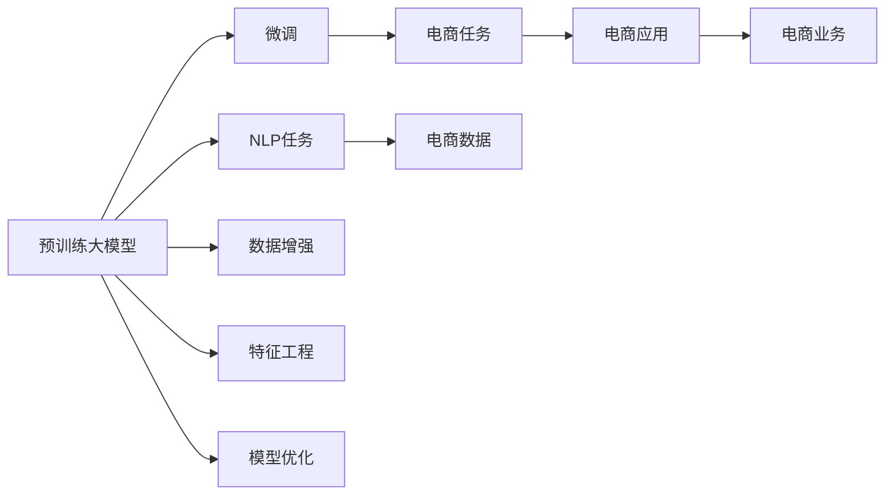

                 

# 电商数据挖掘：AI大模型的新方法

> 关键词：电商数据挖掘, AI大模型, 自然语言处理, 数据增强, 特征工程, 模型优化

## 1. 背景介绍

### 1.1 问题由来

随着电子商务的迅猛发展，企业拥有海量用户行为数据、产品描述数据、交易记录等，这为数据挖掘、客户分析、个性化推荐等提供了丰富的数据基础。然而，大规模数据带来的挑战也愈发明显。如何高效、准确地从海量数据中提取有用的信息，是当前电商领域亟待解决的关键问题。

传统的电商数据挖掘方法往往依赖于手工设计的特征工程，不仅费时费力，而且难以捕捉数据中潜在的复杂关系。随着深度学习技术的快速发展，特别是预训练大模型（如BERT、GPT-3等）在自然语言处理（NLP）任务上的优异表现，使得利用大模型进行电商数据挖掘成为一种高效且可扩展的解决方案。

### 1.2 问题核心关键点

大模型在电商数据挖掘中的应用，核心在于其强大的语义理解和表示能力。通过在大规模无标签文本数据上进行预训练，大模型能够学习到通用的语言表征，并将其应用于电商领域的具体任务中。这种方法相比传统特征工程方法，具有以下优点：

1. **自动特征提取**：大模型可以自动从文本中学习到高维语义特征，无需手工设计特征，提高效率。
2. **泛化能力强**：预训练模型在大规模数据上训练，具备良好的泛化能力，可以应用于多种电商任务。
3. **数据适应性高**：通过微调方法，大模型能够适应特定领域的数据分布，提高应用效果。
4. **可扩展性好**：大模型可以在不同的电商场景下，通过简单的微调实现新的应用，无需从头开始开发。

尽管大模型在电商数据挖掘中具有巨大潜力，但其实际应用仍面临一些挑战：

1. **数据规模要求高**：电商领域数据量大，对计算资源要求较高。
2. **模型复杂度高**：大模型参数量庞大，对硬件要求高。
3. **泛化能力不足**：大模型在不同电商场景中的泛化能力仍需进一步提升。
4. **解释性不足**：大模型的决策过程缺乏可解释性，难以满足电商业务中对决策透明度的要求。

本文旨在通过详细介绍大模型在电商数据挖掘中的应用，探讨其核心原理、操作步骤、算法优缺点以及未来发展趋势，为电商企业提供可行的技术参考。

## 2. 核心概念与联系

### 2.1 核心概念概述

为更好地理解大模型在电商数据挖掘中的应用，本节将介绍几个关键概念及其联系：

- **预训练大模型**：如BERT、GPT-3等，通过在大规模无标签文本数据上进行预训练，学习通用的语言表征。
- **微调**：在预训练大模型的基础上，通过特定任务的数据进行微调，优化模型在该任务上的性能。
- **自然语言处理（NLP）**：涉及文本数据的处理和分析，包括文本分类、情感分析、信息抽取等任务。
- **数据增强**：通过对原始数据进行多种形式的变换，扩充训练集，提高模型的泛化能力。
- **特征工程**：手动设计特征以提高模型的性能，是传统机器学习方法的核心。
- **模型优化**：通过调整模型结构、参数和训练策略，提高模型的预测能力和泛化性能。

这些概念之间的逻辑关系可以通过以下Mermaid流程图来展示：



这个流程图展示了大模型在电商数据挖掘中的应用框架：

1. 大模型通过预训练获得语言表示。
2. 将预训练模型应用于电商领域的NLP任务，进行微调。
3. 微调后的模型应用于电商任务，提升电商应用的性能。
4. 电商应用通过特征工程和模型优化进一步提升用户体验。
5. 数据增强和模型优化提升模型泛化能力和性能。

这些概念共同构成了大模型在电商数据挖掘中的学习和应用框架，使其能够高效地处理电商领域的大规模数据。

## 3. 核心算法原理 & 具体操作步骤
### 3.1 算法原理概述

基于大模型的电商数据挖掘，主要通过两个步骤实现：预训练和微调。预训练是在大规模无标签数据上进行的，目的是学习通用的语言表示；微调是在特定任务上进行的，目的是优化模型在该任务上的性能。

在电商领域，常见的预训练任务包括文本分类、信息抽取、情感分析等，这些任务都是基于文本数据的，可以利用大模型在自然语言处理上的优势。预训练任务的目的在于学习通用的语言表示，使得大模型能够更好地适应电商领域的各种任务。

微调是在预训练模型的基础上进行的，其目的是针对特定的电商任务（如推荐系统、商品评论分析等），通过有监督的学习优化模型性能。微调过程中的损失函数通常为交叉熵损失、余弦相似度损失等，通过反向传播算法更新模型参数。

### 3.2 算法步骤详解

基于大模型的电商数据挖掘主要包括以下关键步骤：

**Step 1: 准备预训练模型和数据集**
- 选择合适的预训练语言模型（如BERT、GPT-3等）。
- 准备电商领域的相关数据集，如商品描述、用户评论、交易记录等。
- 将电商数据集划分为训练集、验证集和测试集。

**Step 2: 微调模型**
- 根据电商任务的特点，添加任务适配层，如分类层、回归层等。
- 设置微调的超参数，如学习率、批大小、迭代轮数等。
- 使用电商数据集对预训练模型进行微调，通过反向传播算法更新模型参数。

**Step 3: 评估和优化**
- 在验证集上评估微调后的模型性能，如准确率、F1-score等。
- 根据验证集的评估结果，调整超参数和模型结构，进一步优化模型性能。
- 在测试集上评估最终模型的性能，对比微调前后的效果。

**Step 4: 应用和部署**
- 将微调后的模型应用于实际的电商应用场景，如商品推荐、用户画像分析等。
- 持续收集新的电商数据，定期重新微调模型，以适应数据分布的变化。

以上是基于大模型的电商数据挖掘的一般流程。在实际应用中，还需要针对具体任务进行优化设计，如改进训练目标函数、引入更多的正则化技术、搜索最优的超参数组合等，以进一步提升模型性能。

### 3.3 算法优缺点

基于大模型的电商数据挖掘方法具有以下优点：

1. **高效性**：大模型能够自动提取高维语义特征，无需手工设计特征，提高效率。
2. **泛化能力强**：预训练模型在大规模数据上训练，具备良好的泛化能力，可以应用于多种电商任务。
3. **可扩展性好**：通过微调方法，大模型能够适应特定领域的数据分布，提高应用效果。
4. **创新性**：大模型在电商领域的应用，催生了新的研究方向，如电商情感分析、电商推荐系统等。

同时，该方法也存在一些局限性：

1. **数据需求高**：电商领域数据量大，对计算资源要求较高。
2. **模型复杂度高**：大模型参数量庞大，对硬件要求高。
3. **泛化能力不足**：大模型在不同电商场景中的泛化能力仍需进一步提升。
4. **解释性不足**：大模型的决策过程缺乏可解释性，难以满足电商业务中对决策透明度的要求。

尽管存在这些局限性，但就目前而言，基于大模型的电商数据挖掘方法仍是大规模数据处理和分析的强有力工具。未来相关研究的重点在于如何进一步降低对计算资源的依赖，提高模型的少样本学习和跨领域迁移能力，同时兼顾可解释性和伦理安全性等因素。

### 3.4 算法应用领域

基于大模型的电商数据挖掘方法在电商领域已经得到了广泛的应用，涵盖了从产品推荐到用户行为分析的各个方面。以下是几个典型的应用场景：

- **商品推荐**：利用大模型对用户行为数据进行情感分析，推荐符合用户喜好的商品。
- **用户画像分析**：通过分析用户评论、购买记录等文本数据，构建用户画像，进行个性化推荐。
- **销售预测**：利用大模型对产品描述数据进行情感分析，预测产品销售情况。
- **欺诈检测**：利用大模型对交易记录进行情感分析，识别异常交易行为，防止欺诈。
- **客户服务**：利用大模型对客户反馈进行情感分析，提供更优质的客户服务。

除了上述这些经典应用外，大模型在电商领域还应用于更多场景中，如社交媒体情感分析、营销活动效果评估等，为电商企业提供了更高效的数据挖掘工具。

## 4. 数学模型和公式 & 详细讲解  
### 4.1 数学模型构建

本节将使用数学语言对基于大模型的电商数据挖掘过程进行更加严格的刻画。

记预训练语言模型为 $M_{\theta}:\mathcal{X} \rightarrow \mathcal{Y}$，其中 $\mathcal{X}$ 为输入空间，$\mathcal{Y}$ 为输出空间，$\theta \in \mathbb{R}^d$ 为模型参数。假设电商领域的相关任务为 $T$，训练集为 $D=\{(x_i,y_i)\}_{i=1}^N, x_i \in \mathcal{X}, y_i \in \mathcal{Y}$。

定义模型 $M_{\theta}$ 在输入 $x$ 上的损失函数为 $\ell(M_{\theta}(x),y)$，则在数据集 $D$ 上的经验风险为：

$$
\mathcal{L}(\theta) = \frac{1}{N} \sum_{i=1}^N \ell(M_{\theta}(x_i),y_i)
$$

微调的优化目标是最小化经验风险，即找到最优参数：

$$
\theta^* = \mathop{\arg\min}_{\theta} \mathcal{L}(\theta)
$$

在实践中，我们通常使用基于梯度的优化算法（如SGD、Adam等）来近似求解上述最优化问题。设 $\eta$ 为学习率，$\lambda$ 为正则化系数，则参数的更新公式为：

$$
\theta \leftarrow \theta - \eta \nabla_{\theta}\mathcal{L}(\theta) - \eta\lambda\theta
$$

其中 $\nabla_{\theta}\mathcal{L}(\theta)$ 为损失函数对参数 $\theta$ 的梯度，可通过反向传播算法高效计算。

### 4.2 公式推导过程

以下我们以电商推荐系统为例，推导模型在电商推荐场景下的损失函数及其梯度的计算公式。

假设电商推荐系统需要推荐商品给用户，用户对商品进行评分（1-5分），记评分 $y \in [1,5]$，输入为商品描述 $x$。模型 $M_{\theta}$ 的输出为 $\hat{y}=M_{\theta}(x) \in [1,5]$，表示用户对商品的预测评分。则推荐系统的交叉熵损失函数定义为：

$$
\ell(M_{\theta}(x),y) = -y\log \hat{y} - (1-y)\log (1-\hat{y})
$$

将其代入经验风险公式，得：

$$
\mathcal{L}(\theta) = -\frac{1}{N}\sum_{i=1}^N [y_i\log M_{\theta}(x_i)+(1-y_i)\log(1-M_{\theta}(x_i))]
$$

根据链式法则，损失函数对参数 $\theta_k$ 的梯度为：

$$
\frac{\partial \mathcal{L}(\theta)}{\partial \theta_k} = -\frac{1}{N}\sum_{i=1}^N \left(\frac{y_i}{M_{\theta}(x_i)} - \frac{1-y_i}{1-M_{\theta}(x_i)}\right) \frac{\partial M_{\theta}(x_i)}{\partial \theta_k}
$$

其中 $\frac{\partial M_{\theta}(x_i)}{\partial \theta_k}$ 可进一步递归展开，利用自动微分技术完成计算。

在得到损失函数的梯度后，即可带入参数更新公式，完成模型的迭代优化。重复上述过程直至收敛，最终得到适应电商推荐任务的最优模型参数 $\theta^*$。

## 5. 项目实践：代码实例和详细解释说明
### 5.1 开发环境搭建

在进行电商数据挖掘实践前，我们需要准备好开发环境。以下是使用Python进行PyTorch开发的环境配置流程：

1. 安装Anaconda：从官网下载并安装Anaconda，用于创建独立的Python环境。

2. 创建并激活虚拟环境：
```bash
conda create -n pytorch-env python=3.8 
conda activate pytorch-env
```

3. 安装PyTorch：根据CUDA版本，从官网获取对应的安装命令。例如：
```bash
conda install pytorch torchvision torchaudio cudatoolkit=11.1 -c pytorch -c conda-forge
```

4. 安装Transformers库：
```bash
pip install transformers
```

5. 安装各类工具包：
```bash
pip install numpy pandas scikit-learn matplotlib tqdm jupyter notebook ipython
```

完成上述步骤后，即可在`pytorch-env`环境中开始电商数据挖掘实践。

### 5.2 源代码详细实现

这里我们以电商推荐系统为例，给出使用Transformers库对BERT模型进行电商推荐系统微调的PyTorch代码实现。

首先，定义电商推荐系统的数据处理函数：

```python
from transformers import BertTokenizer
from torch.utils.data import Dataset
import torch

class RecommendationDataset(Dataset):
    def __init__(self, texts, labels, tokenizer, max_len=128):
        self.texts = texts
        self.labels = labels
        self.tokenizer = tokenizer
        self.max_len = max_len
        
    def __len__(self):
        return len(self.texts)
    
    def __getitem__(self, item):
        text = self.texts[item]
        label = self.labels[item]
        
        encoding = self.tokenizer(text, return_tensors='pt', max_length=self.max_len, padding='max_length', truncation=True)
        input_ids = encoding['input_ids'][0]
        attention_mask = encoding['attention_mask'][0]
        
        # 对label进行编码
        encoded_labels = torch.tensor(label, dtype=torch.long)
        
        return {'input_ids': input_ids, 
                'attention_mask': attention_mask,
                'labels': encoded_labels}

# 标签与id的映射
label2id = {1: 0, 2: 1, 3: 2, 4: 3, 5: 4}

# 创建dataset
tokenizer = BertTokenizer.from_pretrained('bert-base-cased')

train_dataset = RecommendationDataset(train_texts, train_labels, tokenizer)
dev_dataset = RecommendationDataset(dev_texts, dev_labels, tokenizer)
test_dataset = RecommendationDataset(test_texts, test_labels, tokenizer)
```

然后，定义模型和优化器：

```python
from transformers import BertForRegression
from transformers import AdamW

model = BertForRegression.from_pretrained('bert-base-cased', num_labels=5)

optimizer = AdamW(model.parameters(), lr=2e-5)
```

接着，定义训练和评估函数：

```python
from torch.utils.data import DataLoader
from tqdm import tqdm
from sklearn.metrics import mean_squared_error

device = torch.device('cuda') if torch.cuda.is_available() else torch.device('cpu')
model.to(device)

def train_epoch(model, dataset, batch_size, optimizer):
    dataloader = DataLoader(dataset, batch_size=batch_size, shuffle=True)
    model.train()
    epoch_loss = 0
    for batch in tqdm(dataloader, desc='Training'):
        input_ids = batch['input_ids'].to(device)
        attention_mask = batch['attention_mask'].to(device)
        labels = batch['labels'].to(device)
        model.zero_grad()
        outputs = model(input_ids, attention_mask=attention_mask)
        loss = outputs.loss
        epoch_loss += loss.item()
        loss.backward()
        optimizer.step()
    return epoch_loss / len(dataloader)

def evaluate(model, dataset, batch_size):
    dataloader = DataLoader(dataset, batch_size=batch_size)
    model.eval()
    preds, labels = [], []
    with torch.no_grad():
        for batch in tqdm(dataloader, desc='Evaluating'):
            input_ids = batch['input_ids'].to(device)
            attention_mask = batch['attention_mask'].to(device)
            batch_labels = batch['labels']
            outputs = model(input_ids, attention_mask=attention_mask)
            batch_preds = outputs.logits.argmax(dim=2).to('cpu').tolist()
            batch_labels = batch_labels.to('cpu').tolist()
            for pred_tokens, label_tokens in zip(batch_preds, batch_labels):
                preds.append(pred_tokens)
                labels.append(label_tokens)
                
    return mean_squared_error(labels, preds)

```

最后，启动训练流程并在测试集上评估：

```python
epochs = 5
batch_size = 16

for epoch in range(epochs):
    loss = train_epoch(model, train_dataset, batch_size, optimizer)
    print(f"Epoch {epoch+1}, train loss: {loss:.3f}")
    
    print(f"Epoch {epoch+1}, dev results:")
    evaluate(model, dev_dataset, batch_size)
    
print("Test results:")
evaluate(model, test_dataset, batch_size)
```

以上就是使用PyTorch对BERT进行电商推荐系统微调的完整代码实现。可以看到，得益于Transformers库的强大封装，我们可以用相对简洁的代码完成BERT模型的加载和微调。

### 5.3 代码解读与分析

让我们再详细解读一下关键代码的实现细节：

**RecommendationDataset类**：
- `__init__`方法：初始化文本、标签、分词器等关键组件。
- `__len__`方法：返回数据集的样本数量。
- `__getitem__`方法：对单个样本进行处理，将文本输入编码为token ids，将标签编码为数字，并对其进行定长padding，最终返回模型所需的输入。

**label2id字典**：
- 定义了评分与数字id之间的映射关系，用于将预测结果解码为实际评分。

**训练和评估函数**：
- 使用PyTorch的DataLoader对数据集进行批次化加载，供模型训练和推理使用。
- 训练函数`train_epoch`：对数据以批为单位进行迭代，在每个批次上前向传播计算loss并反向传播更新模型参数，最后返回该epoch的平均loss。
- 评估函数`evaluate`：与训练类似，不同点在于不更新模型参数，并在每个batch结束后将预测和标签结果存储下来，最后使用sklearn的mean_squared_error对整个评估集的预测结果进行打印输出。

**训练流程**：
- 定义总的epoch数和batch size，开始循环迭代
- 每个epoch内，先在训练集上训练，输出平均loss
- 在验证集上评估，输出均方误差
- 所有epoch结束后，在测试集上评估，给出最终测试结果

可以看到，PyTorch配合Transformers库使得BERT微调的代码实现变得简洁高效。开发者可以将更多精力放在数据处理、模型改进等高层逻辑上，而不必过多关注底层的实现细节。

当然，工业级的系统实现还需考虑更多因素，如模型的保存和部署、超参数的自动搜索、更灵活的任务适配层等。但核心的微调范式基本与此类似。

## 6. 实际应用场景
### 6.1 智能推荐系统

基于大模型的推荐系统能够通过分析用户行为数据，自动提取高维语义特征，从而实现精准推荐。相较于传统机器学习方法，大模型能够自动处理更多的文本信息，且无需手工设计特征，大大降低了人工工作量。

在具体实现上，大模型通常采用Transformer结构进行建模，通过预训练和微调的方式，学习通用的语言表示和特定任务的表示。具体步骤如下：

1. 收集用户的历史行为数据，如浏览记录、点击记录、购买记录等。
2. 将用户行为数据输入大模型，进行情感分析和主题抽取。
3. 根据抽取到的语义特征，使用多任务学习框架对用户画像和商品描述进行联合建模。
4. 利用联合模型预测用户对商品的评分，并根据评分进行排序推荐。

通过基于大模型的推荐系统，电商企业能够实现更加个性化、精准的推荐，提高用户满意度和留存率，同时减少推荐系统的运营成本。

### 6.2 用户行为分析

用户行为分析是大模型在电商领域的重要应用之一。通过分析用户评论、评分、浏览记录等文本数据，大模型能够自动提取用户对商品、品牌、服务的情感倾向和评价，帮助电商企业了解用户需求和偏好，优化商品和服务。

具体而言，可以收集用户对商品、品牌的评论数据，通过情感分析判断用户对商品、品牌的情感倾向，通过情感分类技术对评论进行主题分类，识别用户关注的商品属性，进一步预测用户的购买意愿。

大模型在用户行为分析中的主要优势在于其强大的语义理解和分析能力，能够自动处理大量非结构化数据，且不受数据量和分布的限制。

### 6.3 销售预测

销售预测是大模型在电商领域的重要应用之一。通过分析商品描述数据，大模型能够自动提取商品的特征，如颜色、材质、功能等，并结合用户评论、评分等文本信息，进行销售预测。

具体实现步骤如下：
1. 收集商品描述数据，并提取商品的关键特征。
2. 将商品特征数据输入大模型，进行情感分析和主题抽取。
3. 根据抽取到的语义特征，构建销售预测模型，如回归模型、分类模型等。
4. 利用销售预测模型预测商品的销售情况，帮助电商企业优化库存和采购策略。

通过基于大模型的销售预测系统，电商企业能够及时掌握商品的销售趋势，优化库存管理，减少库存积压和缺货风险，提高运营效率。

### 6.4 未来应用展望

随着大模型和微调方法的不断发展，基于大模型的方法将在电商领域的应用范围进一步扩大，为电商企业带来更大的商业价值。

在智慧物流领域，基于大模型的仓储管理和配送优化技术，能够显著提升物流效率和客户满意度。

在金融风险控制领域，基于大模型的信贷评估和风险管理技术，能够提高贷款审批的准确性和效率，降低金融风险。

在社交电商领域，基于大模型的社交网络分析和用户画像技术，能够实现精准广告投放和个性化推荐，提升用户参与度和转化率。

此外，在智慧城市治理、智能客服、智能营销等领域，基于大模型的方法也将不断涌现，为电商企业提供更加智能化、高效化的解决方案。相信随着技术的日益成熟，基于大模型的方法必将在电商领域大放异彩，带来更广阔的商业应用前景。

## 7. 工具和资源推荐
### 7.1 学习资源推荐

为了帮助开发者系统掌握大模型在电商数据挖掘中的应用，这里推荐一些优质的学习资源：

1. 《Transformer from Pre-training to Practical Application》系列博文：由大模型技术专家撰写，深入浅出地介绍了Transformer在大规模电商数据处理中的应用。

2. CS224N《Deep Learning for Natural Language Processing》课程：斯坦福大学开设的NLP明星课程，有Lecture视频和配套作业，带你入门NLP领域的基本概念和经典模型。

3. 《Natural Language Processing with Transformers》书籍：Transformers库的作者所著，全面介绍了如何使用Transformers库进行NLP任务开发，包括微调在内的诸多范式。

4. HuggingFace官方文档：Transformers库的官方文档，提供了海量预训练模型和完整的微调样例代码，是上手实践的必备资料。

5. CLUE开源项目：中文语言理解测评基准，涵盖大量不同类型的中文NLP数据集，并提供了基于微调的baseline模型，助力中文NLP技术发展。

通过对这些资源的学习实践，相信你一定能够快速掌握大模型在电商数据挖掘中的应用，并用于解决实际的电商问题。
###  7.2 开发工具推荐

高效的开发离不开优秀的工具支持。以下是几款用于大模型在电商数据挖掘开发的常用工具：

1. PyTorch：基于Python的开源深度学习框架，灵活动态的计算图，适合快速迭代研究。大部分预训练语言模型都有PyTorch版本的实现。

2. TensorFlow：由Google主导开发的开源深度学习框架，生产部署方便，适合大规模工程应用。同样有丰富的预训练语言模型资源。

3. Transformers库：HuggingFace开发的NLP工具库，集成了众多SOTA语言模型，支持PyTorch和TensorFlow，是进行电商数据挖掘开发的利器。

4. Weights & Biases：模型训练的实验跟踪工具，可以记录和可视化模型训练过程中的各项指标，方便对比和调优。与主流深度学习框架无缝集成。

5. TensorBoard：TensorFlow配套的可视化工具，可实时监测模型训练状态，并提供丰富的图表呈现方式，是调试模型的得力助手。

6. Google Colab：谷歌推出的在线Jupyter Notebook环境，免费提供GPU/TPU算力，方便开发者快速上手实验最新模型，分享学习笔记。

合理利用这些工具，可以显著提升电商数据挖掘任务的开发效率，加快创新迭代的步伐。

### 7.3 相关论文推荐

大模型在电商数据挖掘中的应用源于学界的持续研究。以下是几篇奠基性的相关论文，推荐阅读：

1. Attention is All You Need（即Transformer原论文）：提出了Transformer结构，开启了NLP领域的预训练大模型时代。

2. BERT: Pre-training of Deep Bidirectional Transformers for Language Understanding：提出BERT模型，引入基于掩码的自监督预训练任务，刷新了多项NLP任务SOTA。

3. Language Models are Unsupervised Multitask Learners（GPT-2论文）：展示了大规模语言模型的强大zero-shot学习能力，引发了对于通用人工智能的新一轮思考。

4. Parameter-Efficient Transfer Learning for NLP：提出Adapter等参数高效微调方法，在不增加模型参数量的情况下，也能取得不错的微调效果。

5. Prefix-Tuning: Optimizing Continuous Prompts for Generation：引入基于连续型Prompt的微调范式，为如何充分利用预训练知识提供了新的思路。

6. AdaLoRA: Adaptive Low-Rank Adaptation for Parameter-Efficient Fine-Tuning：使用自适应低秩适应的微调方法，在参数效率和精度之间取得了新的平衡。

这些论文代表了大模型在电商数据挖掘中的应用发展脉络。通过学习这些前沿成果，可以帮助研究者把握学科前进方向，激发更多的创新灵感。

## 8. 总结：未来发展趋势与挑战

### 8.1 总结

本文对基于大模型的电商数据挖掘方法进行了全面系统的介绍。首先阐述了大模型在电商数据挖掘中的应用背景和意义，明确了微调在大规模数据处理中的独特价值。其次，从原理到实践，详细讲解了微调的数学原理和关键步骤，给出了电商推荐系统微调的完整代码实现。同时，本文还探讨了大模型在电商领域的应用场景，展示了其强大的业务价值。

通过本文的系统梳理，可以看到，基于大模型的电商数据挖掘方法在大规模数据处理、个性化推荐、用户行为分析等领域，具备高效、精准的优势，能够显著提升电商企业的运营效率和用户体验。未来，伴随大模型和微调方法的持续演进，基于大模型的电商数据挖掘技术必将在电商领域大放异彩，带来更加智能、高效、个性化的电商体验。

### 8.2 未来发展趋势

展望未来，基于大模型的电商数据挖掘技术将呈现以下几个发展趋势：

1. **高效性进一步提升**：通过进一步优化模型结构和算法，如引入自适应学习率、多任务学习等技术，大模型在电商数据挖掘中的处理速度和准确率将进一步提升。

2. **可解释性增强**：未来的电商数据挖掘技术将更加注重模型的可解释性，通过引入可解释性模型和技术，如LIME、SHAP等，提高模型决策的透明性和可信度。

3. **跨领域迁移能力提升**：大模型在电商领域的泛化能力将进一步增强，能够更好地适应不同领域的数据分布，提升其在其他领域的应用效果。

4. **多模态数据融合**：未来的大模型将更加注重多模态数据的融合，结合文本、图像、语音等多种信息源，提供更加全面、准确的电商分析结果。

5. **个性化推荐系统优化**：个性化推荐系统将更加注重用户的个性化需求和偏好，通过动态调整推荐策略，提高用户的满意度和粘性。

6. **实时性增强**：通过引入实时数据处理和流计算技术，大模型能够在实时数据流的驱动下，进行高效的电商数据挖掘和分析，满足电商业务对实时性的要求。

以上趋势凸显了大模型在电商数据挖掘中的广阔前景。这些方向的探索发展，必将进一步提升电商系统的性能和用户体验，推动电商行业迈向智能化、自动化新阶段。

### 8.3 面临的挑战

尽管大模型在电商数据挖掘中具有巨大潜力，但在迈向更加智能化、普适化应用的过程中，它仍面临一些挑战：

1. **数据质量要求高**：电商领域数据量大且复杂，数据质量的保证对电商数据挖掘的精度和效率至关重要。

2. **计算资源需求大**：大模型参数量庞大，对硬件要求高，需要高效的计算资源支持。

3. **模型鲁棒性不足**：电商数据分布多样，不同领域的数据对大模型的鲁棒性提出了更高要求。

4. **数据隐私保护**：电商数据涉及用户隐私，如何在数据利用和隐私保护之间找到平衡，是大模型应用的难点。

5. **伦理与安全问题**：大模型在电商领域的应用需要考虑伦理与安全问题，避免模型偏见和恶意输出。

6. **业务适应性**：大模型在电商领域的应用需要与电商业务需求紧密结合，避免模型与实际业务脱节。

尽管存在这些挑战，但大模型在电商领域的应用前景广阔，相信随着技术的不断进步，这些挑战终将逐步克服，大模型必将在电商领域大放异彩。

### 8.4 研究展望

面对大模型在电商数据挖掘所面临的挑战，未来的研究需要在以下几个方面寻求新的突破：

1. **优化算法与模型结构**：开发更加高效、鲁棒的算法和模型结构，提高大模型在电商领域的泛化能力和实时性。

2. **增强模型可解释性**：引入可解释性模型和技术，提高电商数据挖掘模型的透明性和可信度，满足电商业务对模型解释性的要求。

3. **强化多模态数据融合**：开发多模态数据融合技术，结合文本、图像、语音等多种信息源，提供更加全面、准确的电商分析结果。

4. **提升数据质量与隐私保护**：通过数据清洗、噪声处理等技术，提高电商数据的质量。同时，在数据利用与隐私保护之间找到平衡，保护用户隐私。

5. **构建智能电商系统**：将大模型与电商业务需求紧密结合，构建智能化的电商系统，提升电商运营效率和用户体验。

6. **加强伦理与安全研究**：研究大模型在电商领域的伦理与安全问题，避免模型偏见和恶意输出，构建可信赖的电商系统。

通过这些研究方向的探索，必将引领大模型在电商数据挖掘技术迈向更高的台阶，为电商企业提供更加智能、高效、安全的解决方案。

## 9. 附录：常见问题与解答

**Q1：电商数据挖掘是否需要大规模预训练模型？**

A: 电商数据挖掘通常需要处理大规模无标签数据，因此使用大规模预训练模型能够显著提升模型的泛化能力和处理效率。尽管如此，小规模模型也可以通过微调进行电商数据挖掘，但在效果上可能不如大规模模型。

**Q2：微调过程中如何选择合适的学习率？**

A: 微调的学习率一般要比预训练时小1-2个数量级，如果使用过大的学习率，容易破坏预训练权重，导致过拟合。一般建议从1e-5开始调参，逐步减小学习率，直至收敛。也可以使用warmup策略，在开始阶段使用较小的学习率，再逐渐过渡到预设值。需要注意的是，不同的优化器(如AdamW、Adafactor等)以及不同的学习率调度策略，可能需要设置不同的学习率阈值。

**Q3：如何缓解微调过程中的过拟合问题？**

A: 过拟合是微调面临的主要挑战，尤其是在标注数据不足的情况下。常见的缓解策略包括：
1. 数据增强：通过回译、近义替换等方式扩充训练集
2. 正则化：使用L2正则、Dropout、Early Stopping等避免过拟合
3. 对抗训练：引入对抗样本，提高模型鲁棒性
4. 参数高效微调：只调整少量参数(如Adapter、Prefix等)，减小过拟合风险
5. 多模型集成：训练多个微调模型，取平均输出，抑制过拟合

这些策略往往需要根据具体任务和数据特点进行灵活组合。只有在数据、模型、训练、推理等各环节进行全面优化，才能最大限度地发挥大模型微调的威力。

**Q4：电商推荐系统如何利用大模型进行商品推荐？**

A: 电商推荐系统利用大模型进行商品推荐，主要通过以下几个步骤：
1. 收集用户的历史行为数据，如浏览记录、点击记录、购买记录等。
2. 将用户行为数据输入大模型，进行情感分析和主题抽取。
3. 根据抽取到的语义特征，使用多任务学习框架对用户画像和商品描述进行联合建模。
4. 利用联合模型预测用户对商品的评分，并根据评分进行排序推荐。

通过基于大模型的推荐系统，电商企业能够实现更加个性化、精准的推荐，提高用户满意度和留存率，同时减少推荐系统的运营成本。

**Q5：电商数据挖掘中的数据质量如何保证？**

A: 电商数据挖掘中的数据质量保证通常通过以下措施实现：
1. 数据清洗：去除噪音数据和异常数据，提高数据质量。
2. 数据标注：对标注数据进行审核和验证，确保标注质量。
3. 数据增强：通过多种形式的变换，扩充训练集，提高模型的泛化能力。
4. 模型验证：在验证集上评估模型的泛化性能，优化模型参数。

通过这些措施，可以有效提高电商数据挖掘模型的精度和鲁棒性，提升模型在电商场景中的应用效果。

---

作者：禅与计算机程序设计艺术 / Zen and the Art of Computer Programming

