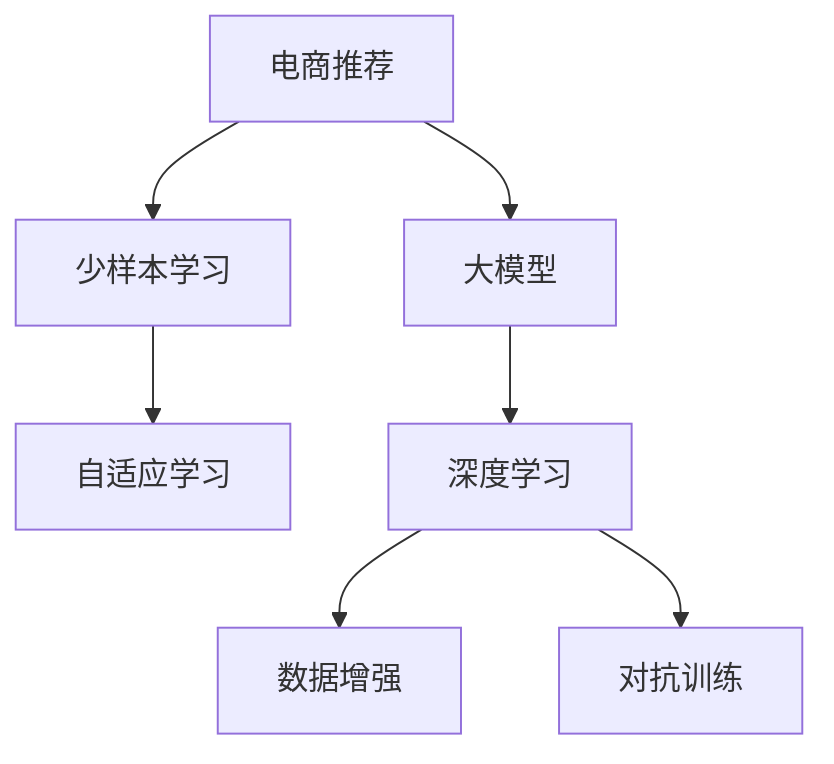

                 

# 电商行业中的少样本学习：大模型的实践与挑战

> 关键词：少样本学习,大模型,电商推荐,自适应学习,深度学习,数据增强,对抗训练

## 1. 背景介绍

### 1.1 问题由来
随着电商行业的发展，用户行为数据变得日益复杂和多样化。如何在有限的标注数据下，高效、准确地推荐用户感兴趣的商品，成为电商企业亟需解决的关键问题。传统的推荐系统主要依赖大量有标签数据进行模型训练，但在实际应用中，获取大规模标注数据往往成本高昂且耗时漫长。

为了解决这一问题，少样本学习（Few-shot Learning）应运而生。少样本学习是指在只有少量标注样本的情况下，模型能够快速适应新任务，实现高效的推荐。近年来，基于大模型（如BERT、GPT-3等）的少样本学习在电商推荐等场景中取得了显著进展。本文将详细探讨大模型在电商行业中的应用，分析其实现机制，并讨论其面临的挑战。

### 1.2 问题核心关键点
- **少样本学习**：在少数标注样本的情况下，模型仍能快速适应新任务。
- **大模型**：指参数规模较大的预训练模型，如BERT、GPT-3等，通过大规模无标签数据进行预训练，具备强大的语言和特征表达能力。
- **电商推荐**：通过分析用户历史行为，预测用户感兴趣的商品，实现个性化推荐。
- **自适应学习**：指模型在数据分布变化时，能够快速调整自身参数，适应新环境的能力。
- **深度学习**：一种通过神经网络进行复杂模式学习的技术，广泛应用于推荐系统等场景。
- **数据增强**：通过对原始数据进行变换和扩充，提高模型泛化能力。
- **对抗训练**：通过加入对抗样本，增强模型鲁棒性，避免过拟合。

## 2. 核心概念与联系

### 2.1 核心概念概述

为更好地理解大模型在电商行业中的应用，本节将介绍几个密切相关的核心概念：

- **少样本学习**：在少数标注样本的情况下，模型仍能快速适应新任务。
- **大模型**：指参数规模较大的预训练模型，如BERT、GPT-3等，通过大规模无标签数据进行预训练，具备强大的语言和特征表达能力。
- **电商推荐**：通过分析用户历史行为，预测用户感兴趣的商品，实现个性化推荐。
- **自适应学习**：指模型在数据分布变化时，能够快速调整自身参数，适应新环境的能力。
- **深度学习**：一种通过神经网络进行复杂模式学习的技术，广泛应用于推荐系统等场景。
- **数据增强**：通过对原始数据进行变换和扩充，提高模型泛化能力。
- **对抗训练**：通过加入对抗样本，增强模型鲁棒性，避免过拟合。

这些概念之间的逻辑关系可以通过以下Mermaid流程图来展示：



这个流程图展示了大模型在电商推荐中的应用流程：

1. 电商推荐系统利用深度学习技术，分析用户行为数据，生成推荐结果。
2. 少样本学习使得模型在少数标注样本的情况下，仍能快速适应新任务。
3. 大模型通过自适应学习，调整自身参数，以应对数据分布的变化。
4. 深度学习技术利用数据增强和对抗训练等方法，提升模型泛化能力和鲁棒性。

这些概念共同构成了电商推荐系统的核心架构，使得模型能够在复杂多变的电商环境中，提供准确、高效的个性化推荐。

## 3. 核心算法原理 & 具体操作步骤

### 3.1 算法原理概述

基于大模型的少样本学习算法主要通过以下几个步骤实现：

1. **数据准备**：收集用户的少量标注数据，并准备电商领域的无标签数据。
2. **模型初始化**：选择预训练模型作为初始化参数，如BERT、GPT-3等。
3. **微调**：在少样本数据上进行有监督微调，更新模型参数，使其适应电商推荐任务。
4. **自适应学习**：在新的标注数据到来时，继续微调模型，适应数据分布的变化。
5. **评估与部署**：在测试集上评估模型性能，并将其部署到电商推荐系统中。

### 3.2 算法步骤详解

以下是基于大模型的少样本学习在电商推荐中的应用具体操作步骤：

**Step 1: 数据准备**

收集电商推荐领域的少量标注数据 $D=\{(x_i, y_i)\}_{i=1}^N$，其中 $x_i$ 为商品描述和用户行为数据，$y_i$ 为用户的点击、购买等行为标签。

准备电商领域的无标签数据 $D'$，用于模型预训练和微调。这些数据通常包括电商网站上的商品描述、用户评论、交易记录等。

**Step 2: 模型初始化**

选择合适的预训练模型 $M_{\theta}$，如BERT、GPT-3等，将其作为初始化参数。

**Step 3: 微调**

在少样本数据 $D$ 上进行有监督微调，更新模型参数 $\theta$，使其适应电商推荐任务。

**Step 4: 自适应学习**

在新的标注数据到来时，继续微调模型，适应数据分布的变化。

**Step 5: 评估与部署**

在测试集上评估模型性能，并将其部署到电商推荐系统中。

### 3.3 算法优缺点

基于大模型的少样本学习算法具有以下优点：

- **高效性**：在少数标注数据的情况下，能够快速适应新任务，提高推荐系统的部署效率。
- **泛化能力**：大模型具备强大的泛化能力，能够在不同的数据分布和任务场景下，保持较高的推荐准确率。
- **参数高效**：通过自适应学习和参数高效微调技术，可以在固定大部分预训练参数的情况下，调整少量参数，适应新任务。

同时，该算法也存在以下缺点：

- **数据依赖**：在少样本学习中，对标注数据的质量和数量要求较高，数据不足可能导致模型性能下降。
- **过拟合风险**：少样本学习容易过拟合标注数据，导致在新数据上的泛化性能不足。
- **复杂性**：算法实现较为复杂，需要设计合适的微调策略和自适应学习方法。
- **计算资源要求高**：大模型通常需要大量计算资源进行预训练和微调，对硬件配置要求较高。

### 3.4 算法应用领域

基于大模型的少样本学习算法在电商推荐领域已经得到了广泛应用，覆盖了推荐算法、广告推荐、个性化推荐等诸多场景。

- **推荐算法**：利用少样本学习，提升推荐系统的精准度和覆盖面，优化商品排序和推荐列表。
- **广告推荐**：通过少样本学习，快速定位用户兴趣，优化广告投放策略，提高广告转化率。
- **个性化推荐**：结合少样本学习和自适应学习，实时调整推荐策略，提升个性化推荐效果。

此外，少样本学习技术还被创新性地应用到更多电商场景中，如用户行为预测、价格优化、库存管理等，为电商企业提供了更加智能化的决策支持。

## 4. 数学模型和公式 & 详细讲解 & 举例说明

### 4.1 数学模型构建

本节将使用数学语言对基于大模型的少样本学习过程进行更加严格的刻画。

记电商推荐领域的标注数据集为 $D=\{(x_i, y_i)\}_{i=1}^N$，其中 $x_i$ 为商品描述和用户行为数据，$y_i$ 为用户的点击、购买等行为标签。无标签数据集为 $D'$。

定义模型 $M_{\theta}$ 在输入 $x$ 上的预测结果为 $\hat{y}=M_{\theta}(x)$，其中 $\theta$ 为模型参数。在少样本学习中，目标函数为：

$$
\min_{\theta} \sum_{i=1}^N \ell(M_{\theta}(x_i), y_i)
$$

其中 $\ell$ 为损失函数，常用的有交叉熵损失、均方误差损失等。

### 4.2 公式推导过程

以交叉熵损失为例，其定义为：

$$
\ell(M_{\theta}(x_i), y_i) = -[y_i\log M_{\theta}(x_i) + (1-y_i)\log (1-M_{\theta}(x_i))]
$$

将其代入目标函数，得：

$$
\min_{\theta} \sum_{i=1}^N \ell(M_{\theta}(x_i), y_i) = -\frac{1}{N}\sum_{i=1}^N [y_i\log M_{\theta}(x_i) + (1-y_i)\log (1-M_{\theta}(x_i))]
$$

使用梯度下降等优化算法，最小化上述目标函数，得到模型参数 $\theta^*$。

### 4.3 案例分析与讲解

假设电商推荐系统中的少样本数据集为 $D=\{(x_1, y_1), (x_2, y_2)\}$，其中 $x_1$ 为商品描述和用户行为数据，$y_1=1$ 表示用户购买了该商品；$x_2$ 为另一商品描述和行为数据，$y_2=0$ 表示用户未购买该商品。

1. **数据准备**：准备电商领域的无标签数据集 $D'$，如商品描述、用户评论、交易记录等。

2. **模型初始化**：选择预训练模型 $M_{\theta}$，如BERT、GPT-3等。

3. **微调**：在少样本数据 $D$ 上进行有监督微调，更新模型参数 $\theta$，使其适应电商推荐任务。

4. **自适应学习**：在新的标注数据到来时，继续微调模型，适应数据分布的变化。

5. **评估与部署**：在测试集上评估模型性能，并将其部署到电商推荐系统中。

## 5. 项目实践：代码实例和详细解释说明

### 5.1 开发环境搭建

在进行少样本学习实践前，我们需要准备好开发环境。以下是使用Python进行PyTorch开发的环境配置流程：

1. 安装Anaconda：从官网下载并安装Anaconda，用于创建独立的Python环境。

2. 创建并激活虚拟环境：
```bash
conda create -n pytorch-env python=3.8 
conda activate pytorch-env
```

3. 安装PyTorch：根据CUDA版本，从官网获取对应的安装命令。例如：
```bash
conda install pytorch torchvision torchaudio cudatoolkit=11.1 -c pytorch -c conda-forge
```

4. 安装TensorFlow：
```bash
pip install tensorflow
```

5. 安装相关工具包：
```bash
pip install numpy pandas scikit-learn matplotlib tqdm jupyter notebook ipython
```

完成上述步骤后，即可在`pytorch-env`环境中开始少样本学习实践。

### 5.2 源代码详细实现

这里我们以电商推荐中的用户行为预测为例，给出使用Transformers库对BERT模型进行少样本学习的PyTorch代码实现。

首先，定义模型和优化器：

```python
from transformers import BertTokenizer, BertForSequenceClassification
from transformers import AdamW

tokenizer = BertTokenizer.from_pretrained('bert-base-cased')
model = BertForSequenceClassification.from_pretrained('bert-base-cased', num_labels=2)

optimizer = AdamW(model.parameters(), lr=2e-5)
```

然后，定义训练和评估函数：

```python
import torch
from torch.utils.data import DataLoader

def train_epoch(model, dataset, batch_size, optimizer):
    model.train()
    loss = 0
    for batch in dataset:
        input_ids = batch['input_ids'].to(device)
        attention_mask = batch['attention_mask'].to(device)
        labels = batch['labels'].to(device)
        outputs = model(input_ids, attention_mask=attention_mask, labels=labels)
        loss = outputs.loss
        optimizer.zero_grad()
        loss.backward()
        optimizer.step()
        loss += loss.item()
    return loss / len(dataset)

def evaluate(model, dataset, batch_size):
    model.eval()
    preds, labels = [], []
    with torch.no_grad():
        for batch in dataset:
            input_ids = batch['input_ids'].to(device)
            attention_mask = batch['attention_mask'].to(device)
            labels = batch['labels'].to(device)
            outputs = model(input_ids, attention_mask=attention_mask)
            preds.append(outputs.logits.argmax(dim=1))
            labels.append(labels)
    return preds, labels

def main():
    train_dataset = ...
    dev_dataset = ...
    test_dataset = ...
    
    device = torch.device('cuda') if torch.cuda.is_available() else torch.device('cpu')
    model.to(device)

    epochs = 5
    batch_size = 16

    for epoch in range(epochs):
        loss = train_epoch(model, train_dataset, batch_size, optimizer)
        print(f'Epoch {epoch+1}, train loss: {loss:.3f}')
        
        preds, labels = evaluate(model, dev_dataset, batch_size)
        print(classification_report(labels, preds))

    preds, labels = evaluate(model, test_dataset, batch_size)
    print(classification_report(labels, preds))
```

以上就是使用PyTorch对BERT进行少样本学习用户行为预测的完整代码实现。可以看到，得益于Transformers库的强大封装，我们可以用相对简洁的代码完成BERT模型的加载和微调。

### 5.3 代码解读与分析

让我们再详细解读一下关键代码的实现细节：

**BERT模型定义**：
- `BertTokenizer.from_pretrained`：加载BERT分词器。
- `BertForSequenceClassification.from_pretrained`：加载预训练的BERT模型，并将其适配到序列分类任务。

**训练和评估函数**：
- `DataLoader`：用于将数据集以批为单位进行加载，供模型训练和推理使用。
- `classification_report`：使用sklearn库打印分类指标，如精确度、召回率、F1值等。

**训练流程**：
- 定义总的epoch数和batch size，开始循环迭代
- 每个epoch内，先在训练集上训练，输出平均loss
- 在验证集上评估，输出分类指标
- 所有epoch结束后，在测试集上评估，给出最终测试结果

可以看到，PyTorch配合Transformers库使得少样本学习任务的代码实现变得简洁高效。开发者可以将更多精力放在数据处理、模型改进等高层逻辑上，而不必过多关注底层的实现细节。

当然，工业级的系统实现还需考虑更多因素，如模型的保存和部署、超参数的自动搜索、更灵活的任务适配层等。但核心的少样本学习范式基本与此类似。

## 6. 实际应用场景

### 6.1 智能客服系统

基于大模型的少样本学习，可以广泛应用于智能客服系统的构建。传统客服往往需要配备大量人力，高峰期响应缓慢，且一致性和专业性难以保证。使用少样本学习技术，可以训练出能够快速适应新任务、快速响应用户需求的智能客服机器人。

在技术实现上，可以收集企业内部的历史客服对话记录，将问题和最佳答复构建成少样本数据，在此基础上对预训练模型进行少样本学习。少样本学习后的模型能够自动理解用户意图，匹配最合适的答复模板进行回复。对于客户提出的新问题，还可以接入检索系统实时搜索相关内容，动态组织生成回答。如此构建的智能客服系统，能大幅提升客户咨询体验和问题解决效率。

### 6.2 金融舆情监测

金融机构需要实时监测市场舆论动向，以便及时应对负面信息传播，规避金融风险。使用少样本学习技术，可以在有限标注样本的情况下，训练出能够快速适应新任务的舆情监测模型。

具体而言，可以收集金融领域相关的新闻、报道、评论等文本数据，并对其进行主题标注和情感标注。在此基础上对预训练语言模型进行少样本学习，使其能够自动判断文本属于何种主题，情感倾向是正面、中性还是负面。将少样本学习后的模型应用到实时抓取的网络文本数据，就能够自动监测不同主题下的情感变化趋势，一旦发现负面信息激增等异常情况，系统便会自动预警，帮助金融机构快速应对潜在风险。

### 6.3 个性化推荐系统

当前的推荐系统往往只依赖用户的历史行为数据进行物品推荐，无法深入理解用户的真实兴趣偏好。使用少样本学习技术，可以在少量标注样本的情况下，训练出能够快速适应新任务、具备更强个性化推荐能力的模型。

在实践中，可以收集用户浏览、点击、评论、分享等行为数据，提取和用户交互的物品标题、描述、标签等文本内容。将文本内容作为模型输入，用户的后续行为（如是否点击、购买等）作为监督信号，在此基础上进行少样本学习。少样本学习后的模型能够从文本内容中准确把握用户的兴趣点。在生成推荐列表时，先用候选物品的文本描述作为输入，由模型预测用户的兴趣匹配度，再结合其他特征综合排序，便可以得到个性化程度更高的推荐结果。

### 6.4 未来应用展望

随着少样本学习和大模型技术的不断发展，基于少样本学习的推荐系统将在更多领域得到应用，为传统行业带来变革性影响。

在智慧医疗领域，基于少样本学习的医疗问答、病历分析、药物研发等应用将提升医疗服务的智能化水平，辅助医生诊疗，加速新药开发进程。

在智能教育领域，少样本学习可应用于作业批改、学情分析、知识推荐等方面，因材施教，促进教育公平，提高教学质量。

在智慧城市治理中，少样本学习可应用于城市事件监测、舆情分析、应急指挥等环节，提高城市管理的自动化和智能化水平，构建更安全、高效的未来城市。

此外，在企业生产、社会治理、文娱传媒等众多领域，基于少样本学习的AI应用也将不断涌现，为经济社会发展注入新的动力。相信随着技术的日益成熟，少样本学习技术将成为AI落地应用的重要范式，推动人工智能技术在垂直行业的规模化落地。

## 7. 工具和资源推荐

### 7.1 学习资源推荐

为了帮助开发者系统掌握少样本学习理论基础和实践技巧，这里推荐一些优质的学习资源：

1. 《Transformer从原理到实践》系列博文：由大模型技术专家撰写，深入浅出地介绍了Transformer原理、BERT模型、少样本学习等前沿话题。

2. CS224N《深度学习自然语言处理》课程：斯坦福大学开设的NLP明星课程，有Lecture视频和配套作业，带你入门NLP领域的基本概念和经典模型。

3. 《Natural Language Processing with Transformers》书籍：Transformers库的作者所著，全面介绍了如何使用Transformers库进行NLP任务开发，包括少样本学习在内的诸多范式。

4. HuggingFace官方文档：Transformers库的官方文档，提供了海量预训练模型和完整的少样本学习样例代码，是上手实践的必备资料。

5. CLUE开源项目：中文语言理解测评基准，涵盖大量不同类型的中文NLP数据集，并提供了基于少样本学习的baseline模型，助力中文NLP技术发展。

通过对这些资源的学习实践，相信你一定能够快速掌握少样本学习的精髓，并用于解决实际的NLP问题。

### 7.2 开发工具推荐

高效的开发离不开优秀的工具支持。以下是几款用于少样本学习开发的常用工具：

1. PyTorch：基于Python的开源深度学习框架，灵活动态的计算图，适合快速迭代研究。大部分预训练语言模型都有PyTorch版本的实现。

2. TensorFlow：由Google主导开发的开源深度学习框架，生产部署方便，适合大规模工程应用。同样有丰富的预训练语言模型资源。

3. Transformers库：HuggingFace开发的NLP工具库，集成了众多SOTA语言模型，支持PyTorch和TensorFlow，是进行少样本学习任务的开发的利器。

4. Weights & Biases：模型训练的实验跟踪工具，可以记录和可视化模型训练过程中的各项指标，方便对比和调优。与主流深度学习框架无缝集成。

5. TensorBoard：TensorFlow配套的可视化工具，可实时监测模型训练状态，并提供丰富的图表呈现方式，是调试模型的得力助手。

6. Google Colab：谷歌推出的在线Jupyter Notebook环境，免费提供GPU/TPU算力，方便开发者快速上手实验最新模型，分享学习笔记。

合理利用这些工具，可以显著提升少样本学习任务的开发效率，加快创新迭代的步伐。

### 7.3 相关论文推荐

少样本学习和大模型的发展源于学界的持续研究。以下是几篇奠基性的相关论文，推荐阅读：

1. Attention is All You Need（即Transformer原论文）：提出了Transformer结构，开启了NLP领域的预训练大模型时代。

2. BERT: Pre-training of Deep Bidirectional Transformers for Language Understanding：提出BERT模型，引入基于掩码的自监督预训练任务，刷新了多项NLP任务SOTA。

3. Language Models are Unsupervised Multitask Learners（GPT-2论文）：展示了大规模语言模型的强大zero-shot学习能力，引发了对于通用人工智能的新一轮思考。

4. Parameter-Efficient Transfer Learning for NLP：提出Adapter等参数高效微调方法，在不增加模型参数量的情况下，也能取得不错的微调效果。

5. Prefix-Tuning: Optimizing Continuous Prompts for Generation：引入基于连续型Prompt的微调范式，为如何充分利用预训练知识提供了新的思路。

6. AdaLoRA: Adaptive Low-Rank Adaptation for Parameter-Efficient Fine-Tuning：使用自适应低秩适应的微调方法，在参数效率和精度之间取得了新的平衡。

这些论文代表了大模型和少样本学习技术的发展脉络。通过学习这些前沿成果，可以帮助研究者把握学科前进方向，激发更多的创新灵感。

## 8. 总结：未来发展趋势与挑战

### 8.1 总结

本文对基于大模型的少样本学习在电商推荐中的应用进行了全面系统的介绍。首先阐述了少样本学习和大模型的研究背景和意义，明确了少样本学习在有限的标注数据下，提高推荐系统性能的优势。其次，从原理到实践，详细讲解了少样本学习的数学原理和关键步骤，给出了少样本学习任务开发的完整代码实例。同时，本文还广泛探讨了少样本学习在智能客服、金融舆情、个性化推荐等多个行业领域的应用前景，展示了少样本学习范式的巨大潜力。

通过本文的系统梳理，可以看到，基于大模型的少样本学习技术正在成为NLP领域的重要范式，极大地拓展了预训练语言模型的应用边界，催生了更多的落地场景。受益于大规模语料的预训练，少样本学习模型以更低的时间和标注成本，在少样本条件下也能取得不俗的效果，有力推动了NLP技术的产业化进程。未来，伴随少样本学习和大模型方法的不断演进，基于少样本学习的推荐系统必将在更广阔的应用领域大放异彩，深刻影响人类的生产生活方式。

### 8.2 未来发展趋势

展望未来，少样本学习和大模型技术将呈现以下几个发展趋势：

1. 模型规模持续增大。随着算力成本的下降和数据规模的扩张，预训练语言模型的参数量还将持续增长。超大规模语言模型蕴含的丰富语言知识，有望支撑更加复杂多变的少样本学习任务。

2. 自适应学习成为常态。随着数据分布的不断变化，少样本学习模型也需要持续学习新知识以保持性能。如何在不遗忘原有知识的同时，高效吸收新样本信息，将成为重要的研究课题。

3. 计算资源需求降低。未来的少样本学习模型将更加注重参数效率和计算效率，减少对计算资源的依赖，实现更轻量级、实时性的部署。

4. 零样本学习崛起。在少样本学习中，如何利用零样本学习能力，在完全没有标注数据的情况下，直接对新任务进行推理，是未来的一大研究方向。

5. 多模态学习融合。当前的少样本学习主要聚焦于纯文本数据，未来会进一步拓展到图像、视频、语音等多模态数据微调。多模态信息的融合，将显著提升少样本学习模型的表征能力和泛化能力。

6. 多任务学习拓展。未来的少样本学习模型将更加注重多任务学习，通过在多个相关任务上联合训练，提升模型对不同任务的适应能力，实现更加泛化的推理。

这些趋势凸显了少样本学习和大模型技术的广阔前景。这些方向的探索发展，必将进一步提升少样本学习模型的性能和应用范围，为NLP技术带来新的突破。

### 8.3 面临的挑战

尽管少样本学习和大模型技术已经取得了瞩目成就，但在迈向更加智能化、普适化应用的过程中，它仍面临着诸多挑战：

1. 标注成本瓶颈。在少样本学习中，对标注数据的质量和数量要求较高，数据不足可能导致模型性能下降。如何进一步降低少样本学习对标注样本的依赖，将是一大难题。

2. 过拟合风险。少样本学习容易过拟合标注数据，导致在新数据上的泛化性能不足。如何提高少样本学习模型的泛化能力，避免过拟合，是需要解决的重要问题。

3. 鲁棒性不足。面对数据分布变化，少样本学习模型需要快速调整自身参数，适应新环境。如何增强模型的鲁棒性，使其在不同数据分布下保持稳定表现，还需要更多理论和实践的积累。

4. 推理效率有待提高。大规模语言模型虽然精度高，但在实际部署时往往面临推理速度慢、内存占用大等效率问题。如何在保证性能的同时，简化模型结构，提升推理速度，优化资源占用，将是重要的优化方向。

5. 可解释性亟需加强。少样本学习模型通常缺乏可解释性，难以解释其内部工作机制和决策逻辑。对于高风险应用，算法的可解释性和可审计性尤为重要。如何赋予少样本学习模型更强的可解释性，将是亟待攻克的难题。

6. 安全性有待保障。预训练语言模型难免会学习到有偏见、有害的信息，通过少样本学习传递到下游任务，产生误导性、歧视性的输出，给实际应用带来安全隐患。如何从数据和算法层面消除模型偏见，避免恶意用途，确保输出的安全性，也将是重要的研究课题。

这些挑战凸显了少样本学习和大模型技术在实际应用中的复杂性，但也展示了其在未来发展中的巨大潜力。相信随着学界和产业界的共同努力，这些挑战终将一一被克服，少样本学习和大模型技术必将在构建智能、安全、可信的AI系统中扮演越来越重要的角色。

### 8.4 研究展望

面对少样本学习和大模型技术面临的诸多挑战，未来的研究需要在以下几个方面寻求新的突破：

1. 探索无监督和半监督学习范式。摆脱对大规模标注数据的依赖，利用自监督学习、主动学习等无监督和半监督范式，最大限度利用非结构化数据，实现更加灵活高效的少样本学习。

2. 研究参数高效和计算高效的少样本学习范式。开发更加参数高效的少样本学习方法，在固定大部分预训练参数的情况下，调整少量参数，适应新任务。同时优化少样本学习模型的计算图，减少前向传播和反向传播的资源消耗，实现更加轻量级、实时性的部署。

3. 融合因果和对比学习范式。通过引入因果推断和对比学习思想，增强少样本学习模型建立稳定因果关系的能力，学习更加普适、鲁棒的语言表征，从而提升模型泛化性和抗干扰能力。

4. 引入更多先验知识。将符号化的先验知识，如知识图谱、逻辑规则等，与神经网络模型进行巧妙融合，引导少样本学习过程学习更准确、合理的语言模型。同时加强不同模态数据的整合，实现视觉、语音等多模态信息与文本信息的协同建模。

5. 结合因果分析和博弈论工具。将因果分析方法引入少样本学习模型，识别出模型决策的关键特征，增强输出解释的因果性和逻辑性。借助博弈论工具刻画人机交互过程，主动探索并规避模型的脆弱点，提高系统稳定性。

6. 纳入伦理道德约束。在少样本学习模型训练目标中引入伦理导向的评估指标，过滤和惩罚有偏见、有害的输出倾向。同时加强人工干预和审核，建立模型行为的监管机制，确保输出符合人类价值观和伦理道德。

这些研究方向的探索，必将引领少样本学习和大模型技术迈向更高的台阶，为构建安全、可靠、可解释、可控的智能系统铺平道路。面向未来，少样本学习和大模型技术还需要与其他人工智能技术进行更深入的融合，如知识表示、因果推理、强化学习等，多路径协同发力，共同推动自然语言理解和智能交互系统的进步。只有勇于创新、敢于突破，才能不断拓展少样本学习和大模型的边界，让智能技术更好地造福人类社会。

## 9. 附录：常见问题与解答

**Q1：少样本学习是否适用于所有NLP任务？**

A: 少样本学习在大多数NLP任务上都能取得不错的效果，特别是对于数据量较小的任务。但对于一些特定领域的任务，如医学、法律等，仅仅依靠通用语料预训练的模型可能难以很好地适应。此时需要在特定领域语料上进一步预训练，再进行少样本学习，才能获得理想效果。此外，对于一些需要时效性、个性化很强的任务，如对话、推荐等，少样本学习方法也需要针对性的改进优化。

**Q2：少样本学习中的过拟合问题如何解决？**

A: 过拟合是少样本学习面临的主要挑战，尤其是在标注数据不足的情况下。常见的缓解策略包括：
1. 数据增强：通过回译、近义替换等方式扩充训练集
2. 正则化：使用L2正则、Dropout、Early Stopping等避免过拟合
3. 对抗训练：引入对抗样本，提高模型鲁棒性
4. 参数高效微调：只调整少量参数(如Adapter、Prefix等)，减小过拟合风险
5. 多模型集成：训练多个少样本学习模型，取平均输出，抑制过拟合

这些策略往往需要根据具体任务和数据特点进行灵活组合。只有在数据、模型、训练、推理等各环节进行全面优化，才能最大限度地发挥少样本学习模型的威力。

**Q3：少样本学习模型在落地部署时需要注意哪些问题？**

A: 将少样本学习模型转化为实际应用，还需要考虑以下因素：
1. 模型裁剪：去除不必要的层和参数，减小模型尺寸，加快推理速度
2. 量化加速：将浮点模型转为定点模型，压缩存储空间，提高计算效率
3. 服务化封装：将模型封装为标准化服务接口，便于集成调用
4. 弹性伸缩：根据请求流量动态调整资源配置，平衡服务质量和成本
5. 监控告警：实时采集系统指标，设置异常告警阈值，确保服务稳定性
6. 安全防护：采用访问鉴权、数据脱敏等措施，保障数据和模型安全

少样本学习模型为NLP应用带来了新的机遇，但如何将强大的性能转化为稳定、高效、安全的业务价值，还需要工程实践的不断打磨。只有从数据、算法、工程、业务等多个维度协同发力，才能真正实现人工智能技术在垂直行业的规模化落地。总之，少样本学习需要开发者根据具体任务，不断迭代和优化模型、数据和算法，方能得到理想的效果。

---

作者：禅与计算机程序设计艺术 / Zen and the Art of Computer Programming

