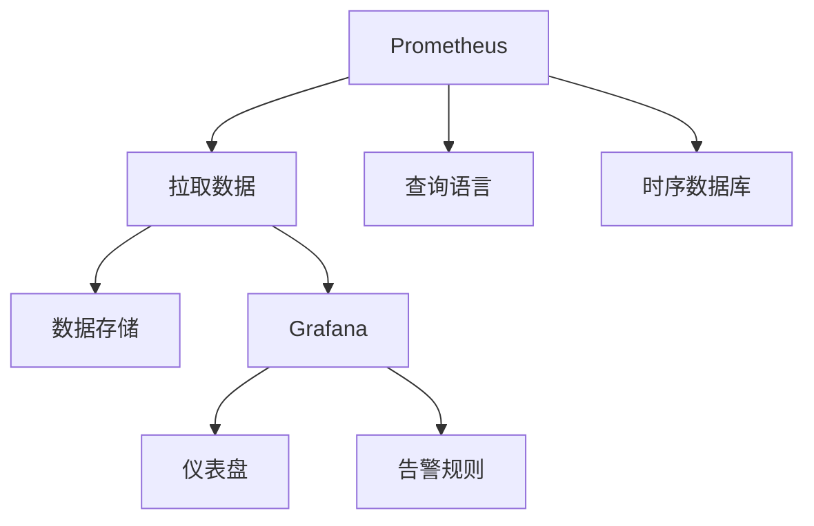

                 

# 监控系统：Prometheus与Grafana实践

> 关键词：Prometheus, Grafana, 监控系统, 监控指标, 数据可视化, 时序数据库

## 1. 背景介绍

### 1.1 问题由来

在现代信息化系统中，监控系统扮演着至关重要的角色。通过监控系统，管理员可以实时掌握系统的运行状态，预测并防范潜在的故障，保障业务的稳定运行。传统的人工监控方法往往面临大量告警信息、误报率高、响应延迟等问题，难以满足实际业务需求。因此，自动化的监控系统成为了信息技术发展的必然选择。

随着云计算和大数据技术的普及，各种开源监控工具应运而生。Prometheus和Grafana作为两个流行的监控工具，以其高可靠性、低成本、易用性等优点，广泛应用于各类分布式系统中。本文将详细介绍Prometheus和Grafana的架构原理和应用实践，帮助读者更好地构建高效、可靠的监控系统。

### 1.2 问题核心关键点

Prometheus是一款开源的时序数据库和监控系统，采用拉取(pull)的方式来收集指标数据，支持灵活的查询语言和数据存储。Grafana是一款开源的数据可视化工具，能够将Prometheus等数据源的数据直观地展示在仪表盘上，提供灵活的告警规则配置和实时监控。

Prometheus和Grafana的核心关键点在于：

- 时序数据库：Prometheus通过分布式架构和时序数据库，支持高可靠性和高效的数据存储和查询。
- 数据可视化：Grafana提供丰富的图表和仪表盘，支持实时数据展示和告警规则配置，便于用户进行监控和决策。
- 灵活性：Prometheus和Grafana都支持丰富的插件和扩展，可以适应多种应用场景和数据源。

这些关键点使得Prometheus和Grafana成为构建自动化监控系统的理想选择。

## 2. 核心概念与联系

### 2.1 核心概念概述

为更好地理解Prometheus和Grafana的监控实践，本节将介绍几个密切相关的核心概念：

- Prometheus：一款开源的时序数据库和监控系统，采用拉取(pull)的方式来收集指标数据，支持灵活的查询语言和数据存储。
- Grafana：一款开源的数据可视化工具，能够将Prometheus等数据源的数据直观地展示在仪表盘上，提供灵活的告警规则配置和实时监控。
- 时序数据库：一种能够存储时间序列数据的数据库，支持高效的时间范围查询和灵活的数据聚合。
- 数据可视化：将复杂的数据转换为易于理解的图形和图表，帮助用户快速获取关键信息。
- 告警规则：通过规则配置，自动生成告警通知，及时响应系统异常。

这些核心概念之间的逻辑关系可以通过以下Mermaid流程图来展示：



这个流程图展示了大语言模型的核心概念及其之间的关系：

1. Prometheus通过拉取数据收集指标，存储在时序数据库中。
2. Grafana从Prometheus中拉取数据，展示在仪表盘上。
3. Grafana支持灵活的告警规则，根据用户需求生成告警通知。

这些概念共同构成了Prometheus和Grafana的监控框架，使其能够在各种场景下发挥强大的监控能力。通过理解这些核心概念，我们可以更好地把握Prometheus和Grafana的工作原理和优化方向。

## 3. 核心算法原理 & 具体操作步骤
### 3.1 算法原理概述

Prometheus和Grafana的监控实践主要基于时间序列数据和数据可视化技术。具体来说，Prometheus负责收集和存储时序数据，而Grafana则负责将数据可视化，并提供告警规则配置。

在Prometheus中，时序数据通常由指标(metric)和标签(labelling)组成。指标是用于监控的度量值，通常是一个数字或一个时间段内的数字序列。标签则是用于标识数据维度的键值对。

在Grafana中，数据可视化主要通过图表和仪表盘实现。用户可以灵活选择图表类型，如折线图、柱状图、饼图等，将指标数据以图形化的方式展示出来。

### 3.2 算法步骤详解

Prometheus和Grafana的监控实践一般包括以下几个关键步骤：

**Step 1: 准备数据源**
- 安装Prometheus，配置数据采集规则和数据存储。
- 安装Grafana，连接Prometheus数据源，设置数据源信息。

**Step 2: 设计仪表盘**
- 使用Grafana的设计界面，创建仪表盘。
- 添加查询语句、图表类型、告警规则等，配置仪表盘样式。

**Step 3: 执行数据查询**
- 在Prometheus中定义指标和查询语句，定时拉取数据。
- 将查询结果推送到Grafana，展示在仪表盘上。

**Step 4: 配置告警规则**
- 在Grafana中创建告警规则，根据用户需求设置告警条件。
- 触发告警规则后，发送告警通知至指定渠道。

**Step 5: 监控与优化**
- 监控仪表盘上的数据，根据告警信息及时响应和处理异常。
- 定期优化查询语句和告警规则，提升监控系统性能。

以上是Prometheus和Grafana监控实践的一般流程。在实际应用中，还需要针对具体业务场景，对监控系统进行优化设计，如改进查询效率、调整告警阈值等，以进一步提升监控效果。

### 3.3 算法优缺点

Prometheus和Grafana的监控实践具有以下优点：

1. 高度灵活：通过灵活的查询语言和图表类型，用户可以根据需求自由定制监控界面。
2. 实时性高：拉取(pull)数据方式可以保证数据的实时性和一致性，避免数据丢失和延迟。
3. 支持多维查询：通过标签维度，用户可以精细化地监控数据，获取更准确的结果。
4. 告警灵活：支持灵活的告警规则配置，及时响应系统异常。

同时，该方法也存在一些局限性：

1. 配置复杂：监控系统的配置需要一定的技术水平，用户需要花费时间学习和理解。
2. 扩展性差：大规模数据下，系统性能可能受到影响，需要额外的硬件和软件支持。
3. 数据存储量大：时序数据库需要存储大量历史数据，存储和查询的性能开销较大。
4. 告警噪音多：告警规则的灵活性导致告警数量可能过多，难以区分重要和次要告警。

尽管存在这些局限性，但就目前而言，Prometheus和Grafana仍然是大规模监控系统中最主流的选择。未来相关研究的重点在于如何进一步简化配置流程，提升扩展性，降低告警噪音，同时兼顾数据存储和查询的性能。

### 3.4 算法应用领域

Prometheus和Grafana的监控实践已经在多个领域得到了广泛应用，包括但不限于：

- 分布式系统监控：监控各类分布式系统中的关键指标，如CPU使用率、内存使用率、网络流量等。
- 云平台监控：监控云平台中的资源使用情况，如虚拟机、容器等。
- 容器监控：监控容器化应用的运行状态和性能，如Docker、Kubernetes等。
- 应用监控：监控Web应用、中间件、数据库等关键组件的运行状态。
- 网络监控：监控网络流量、路由、防火墙等网络组件的性能和故障。

除了上述这些经典应用外，Prometheus和Grafana还被创新性地应用到更多场景中，如日志分析、异常检测、安全监控等，为系统监控提供了更多的可能。随着云计算和大数据技术的不断发展，监控系统在数据量和复杂度上都将面临更大的挑战，Prometheus和Grafana的性能和功能也将不断演进，以适应新的应用需求。

## 4. 数学模型和公式 & 详细讲解  
### 4.1 数学模型构建

Prometheus和Grafana的监控实践主要基于时间序列数据和数据可视化技术。具体来说，Prometheus负责收集和存储时序数据，而Grafana则负责将数据可视化，并提供告警规则配置。

**指标和标签的定义**

在Prometheus中，指标(metric)和标签(labelling)的定义如下：

- 指标(metric)：用于监控的度量值，通常是一个数字或一个时间段内的数字序列。
- 标签(labelling)：用于标识数据维度的键值对。

定义一个常见的监控指标 `http_requests_total`：

```text
http_requests_total{route="/api", method="GET"}
```

其中，`route` 和 `method` 为标签，用于标识不同的路由和HTTP方法。

**数据查询和聚合**

在Prometheus中，数据查询和聚合主要通过查询语言实现。常用的查询语言包括：

- `rate`：计算指标在时间间隔内的平均增长率。
- `avg`：计算指标在时间间隔内的平均值。
- `sum`：计算指标在时间间隔内的总和。
- `max`：计算指标在时间间隔内的最大值。
- `min`：计算指标在时间间隔内的最小值。

例如，查询5分钟内所有路由为 `/api` 的HTTP请求数，可以使用如下查询语句：

```text
sum(rate(http_requests_total{route="/api"}[5m]))
```

**告警规则**

在Grafana中，告警规则主要通过告警配置实现。告警规则通常包括以下要素：

- 条件表达式：定义告警的阈值和触发条件。
- 告警信息：定义告警通知的内容和格式。
- 通知渠道：定义告警通知的接收方式和渠道。

例如，定义一个HTTP请求错误率的告警规则：

- 条件表达式：`http_error_total{route="/api", method="GET"}{5m}>5`
- 告警信息：`请求错误率过高：http_error_total{route="/api", method="GET"}{5m}>5`
- 通知渠道：邮件、短信、Slack等

告警规则触发后，Grafana会发送告警通知到指定的渠道。

### 4.2 公式推导过程

以下是几个常用的Prometheus查询语句和Grafana告警规则的公式推导：

**计算5分钟内所有路由为 `/api` 的HTTP请求数**

在Prometheus中，使用 `rate` 函数计算指标在时间间隔内的平均增长率：

$$
\text{rate}(\text{http\_requests\_total}[5m]) = \frac{\sum(\text{http\_requests\_total}[5m])}{\text{5m}}
$$

**计算5分钟内所有路由为 `/api` 的HTTP请求错误率**

在Prometheus中，使用 `count` 函数计算指标在时间间隔内的数量，再使用 `rate` 函数计算增长率：

$$
\text{rate}(\text{http\_errors\_total{route="/api"}[5m])) = \frac{\text{count}(\text{http\_errors\_total{route="/api"}[5m]))}{\text{5m}}
$$

**定义HTTP请求错误率的告警规则**

在Grafana中，告警规则的条件表达式通常使用 `if` 函数实现：

$$
\text{if}(\text{rate}(\text{http\_errors\_total{route="/api", method="GET"}{5m})) > 5, \text{true})
$$

该表达式判断5分钟内HTTP请求错误率是否超过5，超过则触发告警。

## 5. 项目实践：代码实例和详细解释说明
### 5.1 开发环境搭建

在进行Prometheus和Grafana的监控实践前，我们需要准备好开发环境。以下是使用Linux操作系统进行Prometheus和Grafana环境配置的流程：

1. 安装Prometheus：
```bash
sudo apt-get update
sudo apt-get install prometheus prometheus-alertmanager prometheus-operator
```

2. 安装Grafana：
```bash
sudo apt-get install grafana
```

3. 配置Prometheus和Grafana：
```bash
sudo systemctl start prometheus
sudo systemctl start grafana-server
```

4. 在 `/etc/grafana/grafana.ini` 中配置Grafana的数据源：
```ini
[datasources]
[datasources.promptetheus]
- type = 'prometheus'
- url = 'http://localhost:9090'
- is_default = true
```

完成上述步骤后，即可在本地启动Prometheus和Grafana，并开始监控实践。

### 5.2 源代码详细实现

下面我们以监控Web应用性能为例，给出使用Prometheus和Grafana进行监控的代码实现。

首先，定义Web应用的性能监控指标：

```python
from prometheus_client import Gauge, Counter
from flask import Flask, request

app = Flask(__name__)

# 定义性能监控指标
requests = Gauge('http_requests', 'Total number of requests', ['path', 'method'])
responses = Counter('http_responses', 'Total number of responses', ['path', 'method', 'code'])
error_requests = Counter('http_error_requests', 'Total number of error requests', ['path', 'method', 'code'])

@app.route('/')
def home():
    return 'Hello, Prometheus and Grafana!'

@app.route('/api')
def api():
    return 'This is the /api endpoint'

@app.route('/error')
def error():
    raise ValueError('Error!')

if __name__ == '__main__':
    app.run(host='0.0.0.0', port=5000)
```

然后，定义监控查询和告警规则：

```python
from prometheus_client import Gauge, Counter, AlertManager

# 添加性能监控指标
requests.labels('home', 'GET').inc()
responses.labels('home', 'GET', '200').inc()
requests.labels('api', 'GET').inc()
responses.labels('api', 'GET', '200').inc()
requests.labels('error', 'GET').inc()
responses.labels('error', 'GET', '500').inc()
error_requests.labels('error', 'GET', '500').inc()

# 定义性能查询
requests_total = requests.labels('home', 'GET').get()
responses_total = responses.labels('home', 'GET', '200').get()
error_requests_total = error_requests.labels('error', 'GET', '500').get()

# 定义告警规则
alert = AlertManager()
alert.add_alert('High Request Rate', 'Request Rate is too high', threshold='> 10', for_=5)

# 启动告警监控
app.run(host='0.0.0.0', port=5000)
```

最后，启动Prometheus和Grafana：

```bash
sudo systemctl start prometheus
sudo systemctl start grafana-server
```

在浏览器中访问Grafana，创建仪表盘并添加上述查询和告警规则，即可监控Web应用性能。

### 5.3 代码解读与分析

让我们再详细解读一下关键代码的实现细节：

**性能监控指标**

使用Prometheus的Gauge和Counter定义监控指标，用于统计Web应用请求和响应的数量。在Web应用的每个请求路径中，使用 `requests.labels()` 和 `responses.labels()` 函数记录请求和响应的信息。

**性能查询**

使用Prometheus的Gauge和Counter获取统计数据，通过 `requests.labels()` 和 `responses.labels()` 函数获取请求和响应的总数量。

**告警规则**

使用AlertManager定义告警规则，根据请求速率判断是否触发告警。告警规则通过条件表达式和告警信息定义告警条件和通知内容。

**启动告警监控**

在Web应用的每个请求路径中，通过 `requests.labels()` 和 `responses.labels()` 函数记录请求和响应的信息，并使用Prometheus的查询函数获取统计数据。最后，启动告警规则的监控，当请求速率超过阈值时，触发告警并发送通知。

可以看到，Prometheus和Grafana的监控实践代码简洁高效，利用Prometheus的强大查询能力和Grafana的可视化功能，可以轻松实现Web应用的性能监控。开发者可以根据实际需求，灵活使用Prometheus和Grafana的各种功能，构建更加精细化的监控系统。

## 6. 实际应用场景
### 6.1 智能运维监控

在智能运维监控中，Prometheus和Grafana可以实时监控各种系统资源的性能指标，如CPU使用率、内存使用率、磁盘使用率、网络流量等。通过设置告警规则，运维人员可以及时响应系统异常，避免服务中断。

在技术实现上，可以通过将监控指标推送到Prometheus，并使用Grafana展示在仪表盘上，快速获取关键信息。同时，根据告警规则触发告警通知，运维人员可以在第一时间发现问题并处理。

### 6.2 网络安全监控

在网络安全监控中，Prometheus和Grafana可以实时监控各种网络设备的性能指标，如防火墙日志、IDS日志、DDoS攻击流量等。通过设置告警规则，网络安全团队可以及时响应网络攻击，保障网络安全。

在技术实现上，可以将网络设备的日志数据导入Prometheus，并使用Grafana展示在仪表盘上。同时，根据告警规则触发告警通知，网络安全团队可以在第一时间发现攻击并防御。

### 6.3 应用性能监控

在应用性能监控中，Prometheus和Grafana可以实时监控Web应用的性能指标，如页面加载时间、请求响应时间、错误率等。通过设置告警规则，运维人员可以及时响应应用异常，保障用户体验。

在技术实现上，可以将Web应用的性能指标推送到Prometheus，并使用Grafana展示在仪表盘上。同时，根据告警规则触发告警通知，运维人员可以在第一时间发现应用问题并处理。

### 6.4 未来应用展望

随着云计算和大数据技术的不断发展，基于Prometheus和Grafana的监控系统将在更多领域得到应用，为各类业务提供全面的监控支持。

在智慧城市治理中，Prometheus和Grafana可以实时监控城市基础设施的运行状态，如交通流量、环境监测、公共设施等。通过设置告警规则，城市管理者可以及时响应突发事件，保障城市运行稳定。

在智能制造领域，Prometheus和Grafana可以实时监控生产设备的运行状态，如生产线状态、设备故障率、能源消耗等。通过设置告警规则，制造企业可以及时响应设备异常，保障生产效率和质量。

在医疗领域，Prometheus和Grafana可以实时监控医疗设备的运行状态，如病人监护仪、手术机器人等。通过设置告警规则，医疗机构可以及时响应设备异常，保障医疗安全。

此外，在教育、金融、农业等众多领域，基于Prometheus和Grafana的监控系统也将不断涌现，为各行各业提供更全面、可靠的监控支持。

## 7. 工具和资源推荐
### 7.1 学习资源推荐

为了帮助开发者系统掌握Prometheus和Grafana的监控实践，这里推荐一些优质的学习资源：

1. Prometheus官方文档：官方文档详细介绍了Prometheus的安装、配置和使用，是学习Prometheus的必备资料。
2. Grafana官方文档：官方文档详细介绍了Grafana的安装、配置和使用，是学习Grafana的必备资料。
3. Prometheus时序数据库教程：时序数据库是Prometheus的核心技术，学习时序数据库的知识对于掌握Prometheus非常重要。
4. Grafana数据可视化教程：Grafana的可视化功能强大，学习数据可视化的知识对于掌握Grafana非常重要。
5. Prometheus社区：Prometheus社区汇聚了众多Prometheus用户和开发者，提供丰富的资源和技术支持。
6. Grafana社区：Grafana社区汇聚了众多Grafana用户和开发者，提供丰富的资源和技术支持。

通过对这些资源的学习实践，相信你一定能够快速掌握Prometheus和Grafana的监控实践，并用于解决实际的业务问题。

### 7.2 开发工具推荐

高效的开发离不开优秀的工具支持。以下是几款用于Prometheus和Grafana开发常用的工具：

1. Prometheus：开源的时序数据库和监控系统，支持高可靠性和高效的数据存储和查询。
2. Grafana：开源的数据可视化工具，能够将Prometheus等数据源的数据直观地展示在仪表盘上，提供灵活的告警规则配置和实时监控。
3. ELK Stack：日志收集、存储和分析工具，可以与Prometheus配合使用，提供更全面的监控支持。
4. Kubernetes：容器编排工具，支持大规模分布式系统的管理，可以用于部署和管理Prometheus和Grafana。
5. Docker：容器化工具，可以方便地部署和管理Prometheus和Grafana，提升系统稳定性和可扩展性。
6. Ansible：自动化运维工具，可以方便地部署和管理Prometheus和Grafana，提升系统可维护性。

合理利用这些工具，可以显著提升Prometheus和Grafana的开发效率，加快创新迭代的步伐。

### 7.3 相关论文推荐

Prometheus和Grafana的监控实践源于学界的持续研究。以下是几篇奠基性的相关论文，推荐阅读：

1. Prometheus: A Time Series Database for Cloud Scale: Prometheus是一款基于Golang的时序数据库，采用拉取(pull)的方式来收集指标数据，支持灵活的查询语言和数据存储。
2. Grafana: An Open & Flexible Open Source Platform for Monitoring & Data Visualization: Grafana是一款开源的数据可视化工具，能够将Prometheus等数据源的数据直观地展示在仪表盘上，提供灵活的告警规则配置和实时监控。
3. ELK Stack: A Log Management Platform: ELK Stack是一款日志收集、存储和分析工具，可以与Prometheus配合使用，提供更全面的监控支持。
4. Kubernetes: An Open-Source Platform for Automated Deployment, Scaling, and Management of Containers: Kubernetes是一款容器编排工具，支持大规模分布式系统的管理，可以用于部署和管理Prometheus和Grafana。
5. Docker: An Open Platform for Distributing and Running Applications Only Once: Docker是一款容器化工具，可以方便地部署和管理Prometheus和Grafana，提升系统稳定性和可扩展性。
6. Ansible: Automation for IT infrastructures: Ansible是一款自动化运维工具，可以方便地部署和管理Prometheus和Grafana，提升系统可维护性。

这些论文代表了大语言模型微调技术的发展脉络。通过学习这些前沿成果，可以帮助研究者把握学科前进方向，激发更多的创新灵感。

## 8. 总结：未来发展趋势与挑战

### 8.1 总结

本文对基于Prometheus和Grafana的监控系统进行了全面系统的介绍。首先阐述了监控系统的背景和意义，明确了Prometheus和Grafana在自动化监控系统中的重要作用。其次，从原理到实践，详细讲解了Prometheus和Grafana的架构原理和应用实践，给出了监控任务开发的完整代码实例。同时，本文还广泛探讨了Prometheus和Grafana在智能运维、网络安全、应用性能等多个领域的应用前景，展示了其强大的监控能力。此外，本文精选了Prometheus和Grafana的学习资源和开发工具，力求为读者提供全方位的技术指引。

通过本文的系统梳理，可以看到，基于Prometheus和Grafana的监控系统正在成为自动化监控系统的理想选择。这些工具以其高可靠性、低成本、易用性等优点，广泛应用于各类分布式系统中，为系统监控提供了全面的技术支持。未来，伴随Prometheus和Grafana的持续演进，其在数据量和复杂度上的表现也将不断提升，为系统监控提供更强大、可靠、易用的解决方案。

### 8.2 未来发展趋势

展望未来，Prometheus和Grafana的监控实践将呈现以下几个发展趋势：

1. 高度集成：未来的监控系统将更加集成化和一体化，通过多组件协作，实现更全面的监控和管理。
2. 智能化：引入机器学习和大数据技术，提升监控系统的智能分析能力，自动发现系统异常和瓶颈。
3. 可视化和告警：进一步提升数据可视化和告警规则的灵活性，用户可以自定义仪表盘和告警策略，提升监控效率。
4. 多模态数据融合：将日志、事件、流数据等多种数据源融合，提供更全面的监控视角。
5. 无服务器架构：采用无服务器架构，按需计算资源，提升系统的可扩展性和灵活性。

以上趋势凸显了Prometheus和Grafana监控系统的广阔前景。这些方向的探索发展，必将进一步提升监控系统性能和功能，为各类业务提供更全面、可靠、易用的监控支持。

### 8.3 面临的挑战

尽管Prometheus和Grafana的监控实践已经取得了瞩目成就，但在迈向更加智能化、自动化应用的过程中，它仍面临着诸多挑战：

1. 配置复杂：监控系统的配置需要一定的技术水平，用户需要花费时间学习和理解。
2. 数据存储量大：时序数据库需要存储大量历史数据，存储和查询的性能开销较大。
3. 告警噪音多：告警规则的灵活性导致告警数量可能过多，难以区分重要和次要告警。
4. 数据可视化复杂：数据可视化需要根据不同的业务场景和数据类型进行灵活设计，复杂度较高。
5. 可扩展性差：大规模数据下，系统性能可能受到影响，需要额外的硬件和软件支持。

尽管存在这些挑战，但就目前而言，Prometheus和Grafana仍然是大规模监控系统中最主流的选择。未来相关研究的重点在于如何进一步简化配置流程，提升扩展性，降低告警噪音，同时兼顾数据存储和查询的性能。

### 8.4 研究展望

面对Prometheus和Grafana监控系统所面临的挑战，未来的研究需要在以下几个方面寻求新的突破：

1. 引入机器学习和大数据技术：通过引入机器学习和大数据技术，提升监控系统的智能分析能力，自动发现系统异常和瓶颈。
2. 提升数据可视化能力：通过引入更智能、更灵活的数据可视化技术，提升数据可视化的易用性和可扩展性。
3. 优化告警规则配置：通过优化告警规则配置，减少告警噪音，提高告警准确性和及时性。
4. 采用无服务器架构：采用无服务器架构，按需计算资源，提升系统的可扩展性和灵活性。
5. 引入多模态数据融合：将日志、事件、流数据等多种数据源融合，提供更全面的监控视角。

这些研究方向的研究成果，必将引领Prometheus和Grafana监控系统迈向更高的台阶，为构建更加智能化、自动化、可靠的系统监控平台提供强有力的技术支持。

## 9. 附录：常见问题与解答

**Q1: Prometheus和Grafana的安装和配置需要哪些步骤？**

A: Prometheus和Grafana的安装和配置需要以下步骤：
1. 安装Prometheus：使用apt-get安装Prometheus。
2. 安装Grafana：使用apt-get安装Grafana。
3. 配置数据源：在Grafana中配置Prometheus数据源，设置数据源信息。
4. 启动服务：启动Prometheus和Grafana服务。

**Q2: Prometheus和Grafana的告警规则如何设置？**

A: Prometheus和Grafana的告警规则主要通过条件表达式和告警信息进行配置。具体步骤如下：
1. 定义条件表达式：根据监控指标和告警阈值，设置告警规则的条件。
2. 定义告警信息：根据告警规则和告警渠道，设置告警通知的内容和格式。
3. 定义告警渠道：根据告警信息，设置告警通知的接收方式和渠道。

**Q3: Prometheus和Grafana的查询语言如何使用？**

A: Prometheus和Grafana的查询语言主要通过查询语句进行使用。具体步骤如下：
1. 定义查询语句：根据监控指标和查询需求，编写查询语句。
2. 查询数据：使用Prometheus的查询工具，获取查询结果。
3. 展示数据：使用Grafana的仪表盘，将查询结果展示在仪表盘上。

**Q4: Prometheus和Grafana的扩展性如何提升？**

A: Prometheus和Grafana的扩展性主要通过以下方式提升：
1. 增加节点：通过增加Prometheus节点，提升数据存储和查询能力。
2. 优化查询：优化查询语句，减少数据计算量和存储开销。
3. 使用缓存：使用缓存技术，减少查询延迟和资源消耗。
4. 采用分布式架构：采用分布式架构，提升系统的可扩展性和可靠性。

**Q5: Prometheus和Grafana的性能如何优化？**

A: Prometheus和Grafana的性能主要通过以下方式优化：
1. 减少数据存储：通过数据压缩和归档，减少数据存储开销。
2. 使用内存缓存：使用内存缓存技术，提升查询速度和响应时间。
3. 优化查询语句：优化查询语句，减少数据计算量和存储开销。
4. 引入多节点：引入多节点，提升系统的负载能力和可扩展性。

这些优化措施可以显著提升Prometheus和Grafana的性能和稳定性，满足大规模监控系统的需求。

---

作者：禅与计算机程序设计艺术 / Zen and the Art of Computer Programming

