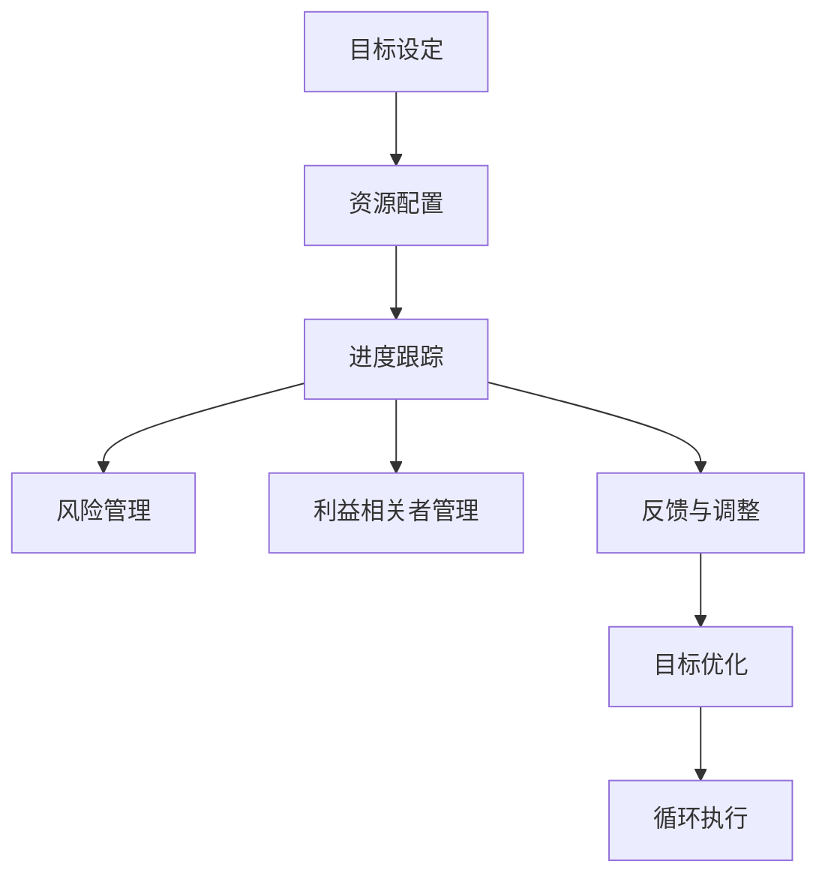

                 

# 目标管理的艺术：取舍之道

在快速发展的IT行业，目标管理不仅是组织和个人的行为准则，也是确保项目成功的关键。本文旨在探讨目标管理的艺术，特别是如何在取舍之间找到平衡，以实现最大的成果和满意度。我们将从背景介绍、核心概念与联系、核心算法原理及具体操作步骤、数学模型和公式、项目实践、实际应用场景、工具和资源推荐、总结未来发展趋势与挑战以及附录常见问题与解答等方面，深入讨论目标管理的本质与实践。

## 1. 背景介绍

### 1.1 问题由来
在项目管理中，如何设定和实现目标是一个永恒的话题。无论是个人还是团队，目标管理都是确保任务完成和资源合理利用的重要手段。传统的目标设定往往依赖于固定的时间线和预算，但在实际执行过程中，外部环境的变化、资源限制等因素可能导致目标无法达成。因此，如何灵活应对这些变化，做出有效的取舍，成为目标管理的关键。

### 1.2 问题核心关键点
目标管理的核心在于设定清晰、可衡量的目标，并确保资源和努力朝着这些目标前进。有效的目标管理需要考虑多个维度，包括时间、成本、质量、范围等。在实践中，如何平衡这些维度，做出合理的取舍，是目标管理成功的关键。

### 1.3 问题研究意义
良好的目标管理能够提升项目成功率，提高团队效率，优化资源利用，确保项目按时按质完成。因此，研究如何通过有效的取舍，达到最优的目标管理，对于提高组织和个人的绩效，具有重要的理论和实践意义。

## 2. 核心概念与联系

### 2.1 核心概念概述
在目标管理中，核心概念包括：

- **目标设定**：明确的目标是目标管理的基础。目标应具有SMART（Specific, Measurable, Achievable, Relevant, Time-bound）特性。
- **资源配置**：合理配置资源，确保目标实现的可行性。
- **进度跟踪**：定期跟踪项目进度，及时发现偏差并调整。
- **风险管理**：识别和管理可能影响目标实现的风险因素。
- **利益相关者管理**：确保目标的设定和实施能够满足各利益相关者的需求和期望。

### 2.2 核心概念原理和架构的 Mermaid 流程图


这个流程图展示了目标管理的核心步骤和各环节之间的联系。目标设定是起点，资源配置确保目标的可行性，进度跟踪、风险管理和利益相关者管理则是确保目标实现的保障。通过反馈与调整，不断优化目标，最终形成持续改进的循环。

## 3. 核心算法原理 & 具体操作步骤

### 3.1 算法原理概述
目标管理的核心算法原理基于系统理论，旨在通过调整系统内部各元素的关系，实现整体目标的优化。系统理论认为，通过调整系统内部元素的关系，可以在保持系统稳定性的同时，实现最优的输出。

### 3.2 算法步骤详解
目标管理的算法步骤包括以下几个关键步骤：

**Step 1: 目标设定**
- 明确目标的具体、可衡量、可实现、相关和时间限定的特性。
- 使用SMART原则进行目标设定，确保目标的可行性和可操作性。

**Step 2: 资源配置**
- 评估现有资源（时间、人力、资金、技术等）的可用性和限制。
- 根据目标的要求，合理分配和优先级排序各资源的投入。

**Step 3: 进度跟踪**
- 制定详细的项目计划和里程碑，定期评估进度。
- 使用甘特图、看板等工具，可视化进度跟踪。

**Step 4: 风险管理**
- 识别可能影响目标实现的风险因素。
- 制定风险应对计划，减少风险对项目的影响。

**Step 5: 利益相关者管理**
- 确定各利益相关者的需求和期望，确保目标的实施符合各方利益。
- 通过有效的沟通和协作，确保各方对目标管理的理解和支持。

**Step 6: 反馈与调整**
- 定期收集反馈，评估目标管理的实施效果。
- 根据反馈信息，调整目标或策略，确保目标的实现。

### 3.3 算法优缺点
目标管理算法的优点在于：
- 系统性和全面性：覆盖了目标管理的各个环节，确保目标的全面实现。
- 可操作性：通过具体的步骤和工具，使得目标管理可执行和可优化。

缺点在于：
- 复杂性：需要综合考虑多个维度，可能增加管理的复杂度。
- 依赖环境：目标的实现受到外部环境的影响较大，需要灵活应对变化。

### 3.4 算法应用领域
目标管理广泛应用于各个行业，包括软件开发、项目管理、市场营销、人力资源等。尤其在IT项目中，目标管理能够有效提升项目交付的准确性、及时性和成本效益。

## 4. 数学模型和公式 & 详细讲解 & 举例说明

### 4.1 数学模型构建
目标管理的数学模型可以基于线性规划、多目标优化等方法构建。例如，可以使用线性规划模型来优化资源分配，确保目标的实现。

### 4.2 公式推导过程
以线性规划为例，目标管理的数学模型可以表示为：

$$
\max \sum_{i=1}^n c_i x_i \\
s.t. \sum_{j=1}^m a_{ij}x_i = b_i, \quad i=1,\ldots,n \\
x_i \geq 0, \quad i=1,\ldots,n
$$

其中，$x_i$ 表示第$i$个资源的投入量，$c_i$ 表示第$i$个资源的价值系数，$a_{ij}$ 表示第$i$个资源对第$j$个目标的贡献，$b_i$ 表示第$j$个目标的限制条件。

### 4.3 案例分析与讲解
考虑一个软件开发项目，目标是按时交付，并满足客户的需求。可使用的资源包括时间、人力、资金等。通过构建线性规划模型，可以优化资源的分配，确保项目按时完成，同时满足客户需求。

## 5. 项目实践：代码实例和详细解释说明

### 5.1 开发环境搭建
在实践目标管理时，需要选择合适的开发工具。以下是推荐的开发环境：

- Python：作为目标管理算法的常用编程语言，具有丰富的库和工具支持。
- Excel或Google Sheets：用于可视化进度跟踪和资源分配。
- Jira或Trello：用于项目管理和任务跟踪。

### 5.2 源代码详细实现
以下是一个使用Python进行目标管理的基本框架：

```python
import pandas as pd

# 目标设定
target = '按时交付'

# 资源配置
resources = ['时间', '人力', '资金']
values = [10, 20, 30]

# 进度跟踪
progress = pd.DataFrame(columns=['资源', '投入', '完成度'])
progress.loc[0] = ['时间', 10, 0.2]

# 风险管理
risks = ['需求变更', '技术障碍']
mitigations = ['需求变更管理计划', '技术风险评估报告']

# 利益相关者管理
stakeholders = ['客户', '开发团队']
stakeholder_needs = ['按时交付', '高质量']
stakeholder_support = True

# 反馈与调整
feedback = {'进度跟踪': progress, '风险管理': risks, '利益相关者管理': stakeholders}

# 输出优化后的资源分配
print(f'优化后的资源分配：{values}')
```

### 5.3 代码解读与分析
这段代码实现了目标管理的基本流程，包括目标设定、资源配置、进度跟踪、风险管理和利益相关者管理。通过反馈与调整，可以不断优化目标和策略。

### 5.4 运行结果展示
运行上述代码，可以得到优化后的资源分配结果，从而实现目标管理的可视化和优化。

## 6. 实际应用场景

### 6.1 软件开发
在软件开发中，目标管理能够确保项目按时交付，同时满足客户的需求。通过合理的资源配置和进度跟踪，可以优化项目的开发流程，提高项目的成功率。

### 6.2 项目管理
在项目管理中，目标管理可以帮助团队明确目标，合理分配资源，确保项目的顺利进行。通过风险管理和利益相关者管理，可以提升项目的成功率和客户满意度。

### 6.3 市场营销
在市场营销中，目标管理能够确保广告投放、市场推广等活动的有效性，提升品牌知名度和市场份额。通过定期评估和调整策略，可以优化市场营销活动，提高投资回报率。

### 6.4 未来应用展望
随着人工智能和大数据技术的发展，目标管理将与这些技术深度融合。例如，使用机器学习算法预测项目进度，优化资源配置；通过大数据分析，识别和应对潜在风险。未来，目标管理将更加智能化、自动化，提升管理效率和决策质量。

## 7. 工具和资源推荐

### 7.1 学习资源推荐
以下是推荐的若干学习资源，帮助深入理解目标管理的原理和实践：

- 《项目管理知识体系指南》(PMBOK)：项目管理领域的经典书籍，涵盖目标管理的各个方面。
- 《目标管理的艺术》(The Art of Setting Goals)：讲解目标设定的技巧和工具，实用性强。
- 在线课程：如Coursera的“目标管理与绩效提升”课程，提供系统的学习路径和实战案例。

### 7.2 开发工具推荐
以下是推荐的若干开发工具，提升目标管理的效率和效果：

- Jira：功能全面的项目管理工具，支持目标管理、任务跟踪、进度跟踪等。
- Trello：简单易用的看板工具，适用于目标管理和日常任务管理。
- Excel：强大的数据分析和可视化工具，适用于进度跟踪和资源配置。

### 7.3 相关论文推荐
以下是推荐的相关论文，深入探讨目标管理的理论和实践：

- Kahneman, D., & Tversky, A. (1979). Prospect theory: An analysis of decisions under risk. Econometrica: Journal of the Econometric Society.
- Hackman, J. R., & Oldham, G. R. (1980). Work redesign that works. Organizational Science, 1(4), 375-410.
- Chinese Academy of Sciences. (2019). A practical guide to goal setting and management.

## 8. 总结：未来发展趋势与挑战

### 8.1 研究成果总结
目标管理是项目管理中不可或缺的一环。通过合理设定和实现目标，能够提升项目的成功率，提高团队效率。目标管理的艺术在于平衡时间和资源，确保目标的实现。

### 8.2 未来发展趋势
未来，目标管理将与人工智能、大数据等技术深度融合，提升管理的智能化和自动化水平。例如，使用机器学习算法预测项目进度，优化资源配置；通过大数据分析，识别和应对潜在风险。

### 8.3 面临的挑战
目标管理仍面临诸多挑战，如复杂性高、依赖环境、利益相关者协调等。如何在保持系统稳定性的同时，实现最优的输出，仍然需要进一步研究。

### 8.4 研究展望
未来的研究应关注以下几个方向：
- 目标管理的自动化和智能化：利用人工智能技术，提升目标管理的效率和效果。
- 多目标优化：研究多目标优化算法，解决复杂项目中的资源分配问题。
- 利益相关者管理：深入研究利益相关者的需求和期望，提升目标管理的适应性和灵活性。

## 9. 附录：常见问题与解答

**Q1: 如何设定清晰的目标？**

A: 目标设定应具有SMART特性，即Specific, Measurable, Achievable, Relevant, Time-bound。例如，设定目标为“在2023年12月31日前完成软件开发项目”。

**Q2: 如何应对资源有限的情况？**

A: 优先级排序是关键。识别关键路径上的资源需求，优先配置关键资源。例如，在软件开发中，应优先配置核心开发人员的时间。

**Q3: 如何进行有效的风险管理？**

A: 风险管理应包括风险识别、评估、规划和监控。定期进行风险评估，制定应对计划，并实时监控风险状态。

**Q4: 如何平衡目标和利益相关者的需求？**

A: 应进行充分的沟通和协作，确保目标的实施符合各方的利益。例如，在软件开发中，应与客户保持良好的沟通，确保项目方向符合客户需求。

**Q5: 如何评估目标管理的成效？**

A: 目标管理的成效应通过定期评估和反馈进行评估。例如，通过进度跟踪和风险管理，定期评估项目的进度和风险状态，及时调整策略。

作者：禅与计算机程序设计艺术 / Zen and the Art of Computer Programming

