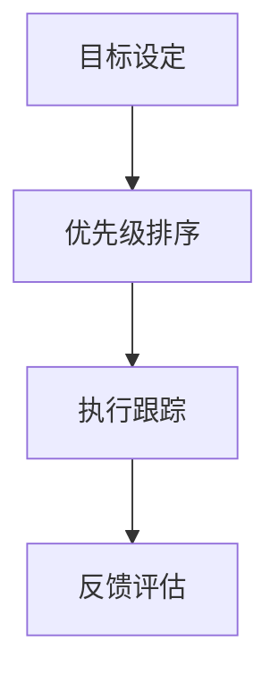

                 

# 目标聚焦：巴菲特清单法则的实践

> 关键词：巴菲特清单法则, 目标管理, 效率提升, 时间管理, 决策优化, 职业发展, 个人成长

## 1. 背景介绍

### 1.1 问题由来
在当今快节奏的商业环境中，目标管理已逐渐成为企业及个人提升效率、优化决策、实现职业和个人成长的有效工具。而巴菲特清单法则，作为一款被众多成功人士推崇的时间管理方法，不仅在企业中得到广泛应用，还深入到个人生活的各个方面，帮助我们理清目标，聚焦重点，实现自我提升。

### 1.2 问题核心关键点
巴菲特清单法则的核心是每日、每周、每月列出关键任务清单，优先完成最重要、最有价值的事情。该法则的关键点在于：
- **目标设定**：明确具体、可衡量的目标，避免盲目工作。
- **优先级排序**：根据重要性和紧急性对任务进行排序，优先处理高优先级任务。
- **执行跟踪**：实时跟踪任务完成情况，确保目标实现。
- **自我优化**：定期评估清单实施效果，持续改进方法。

### 1.3 问题研究意义
掌握并运用巴菲特清单法则，能够帮助企业及个人更好地实现目标管理，提升效率，优化决策，加速成长。具体来说：
- 帮助企业明确战略重点，提升整体运营效率。
- 助力个人找到重要且有价值的任务，实现自我提升和职业发展。
- 加速决策制定，避免无效工作，提高个人成就感。

## 2. 核心概念与联系

### 2.1 核心概念概述

为更好地理解巴菲特清单法则的实践应用，本节将介绍几个关键概念：

- **目标设定**：明确具体的目标，并设置时间、资源等限制条件。
- **优先级排序**：根据重要性和紧急性，将任务分为高、中、低优先级。
- **执行跟踪**：实时监控任务完成情况，确保按时按质完成。
- **反馈评估**：定期回顾清单实施效果，进行自我优化和调整。

通过这些概念的整合，巴菲特清单法则形成了一套系统且高效的目标管理方法，帮助个体和企业聚焦核心目标，优化资源分配，提升整体效能。

### 2.2 核心概念原理和架构的 Mermaid 流程图



该流程图展示了巴菲特清单法则的基本流程：首先设定明确的目标，然后根据任务的紧急和重要性进行排序，接着执行并跟踪任务完成情况，最后进行反馈评估以持续改进。

## 3. 核心算法原理 & 具体操作步骤

### 3.1 算法原理概述

巴菲特清单法则的核心算法原理在于基于目标设定和优先级排序的时间管理，通过明确目标、优先处理高价值任务，确保关键工作得到有效执行。具体而言：

- **目标设定**：目标需具备SMART原则（具体、可衡量、可达成、相关、时间限制）。
- **优先级排序**：使用艾森豪威尔矩阵等工具，区分任务的重要性和紧急性，进行优先级排序。
- **执行跟踪**：通过每日、每周的清单跟踪，确保重要任务按时完成。
- **反馈评估**：定期回顾清单执行情况，分析存在的问题，进行策略调整。

### 3.2 算法步骤详解

**Step 1: 目标设定**
- **具体化**：将大目标拆分为小目标，便于实施和监控。
- **可衡量**：设定可量化的指标，如时间、资源、成果等。
- **可达成**：确保目标在能力范围内，不过度拉伸。
- **相关性**：与企业愿景和价值观相符。
- **时间限制**：设定明确的完成时间，增加紧迫感。

**Step 2: 优先级排序**
- **任务分类**：将任务分为四类：紧急且重要、重要但不紧急、紧急但不重要、不紧急且不重要。
- **艾森豪威尔矩阵**：利用矩阵工具进行任务优先级排序。

**Step 3: 执行跟踪**
- **每日清单**：每天早上列出当天最重要的三项任务。
- **任务更新**：每日更新任务完成情况，标记已完成和未完成的任务。
- **时间管理**：使用番茄工作法、时间块等技术，提升专注度。

**Step 4: 反馈评估**
- **定期回顾**：每周或每月回顾清单执行情况，总结成功经验与改进点。
- **调整策略**：根据反馈调整目标和优先级，确保清单的实用性。

### 3.3 算法优缺点

巴菲特清单法则的优点在于：
- **明确目标**：帮助明确关键任务，提升方向感。
- **优化资源**：通过优先级排序，优化资源分配。
- **提升效率**：聚焦高价值任务，减少无效工作。

但该方法也存在一定的局限性：
- **灵活性差**：过于严格的清单可能会限制创意和自发性。
- **主观性强**：任务优先级排序受个人主观判断影响，可能导致不合理排序。
- **执行压力**：高优先级任务压力可能过大，导致过度焦虑。

### 3.4 算法应用领域

巴菲特清单法则在多个领域得到了广泛应用，包括：

- **项目管理**：帮助项目经理明确任务优先级，优化资源分配。
- **个人管理**：提升个人时间管理能力，实现职业和个人成长。
- **企业运营**：优化企业战略决策，提升整体运营效率。
- **健康管理**：合理规划健康习惯，实现身心平衡。
- **教育培训**：提高学习效率，实现学习目标。

## 4. 数学模型和公式 & 详细讲解 & 举例说明

### 4.1 数学模型构建

巴菲特清单法则的数学模型主要围绕任务优先级排序和目标达成进行构建。

**任务优先级排序模型**：
假设任务集为 $T=\{t_1, t_2, \dots, t_n\}$，优先级排序为 $P=\{p_1, p_2, \dots, p_n\}$，则优先级排序的数学模型为：

$$
P = \arg\min_{P \in [0,1]^n} \sum_{i=1}^n |p_i - \mathbb{E}[p_i]|
$$

其中 $\mathbb{E}[p_i]$ 表示任务 $t_i$ 的平均优先级。

**目标达成模型**：
设目标 $G = (g_1, g_2, \dots, g_k)$，每日完成情况 $C = (c_1, c_2, \dots, c_k)$，则目标达成的数学模型为：

$$
C = \arg\max_{C \in \{0,1\}^k} \sum_{i=1}^k g_i c_i
$$

其中 $g_i$ 为目标 $G$ 的第 $i$ 个目标值。

### 4.2 公式推导过程

**任务优先级排序公式**：
使用平均优先级作为优化的目标，推导出任务优先级排序的公式为：

$$
P_i = \frac{\text{紧急度} + \text{重要性}}{\text{紧急度} + \text{重要性} + \text{难易度} + \text{时间限制}}
$$

其中紧急度、重要性、难易度和时间限制的权重可以视具体情况进行调整。

**目标达成公式**：
目标达成的计算公式为：

$$
C_i = \begin{cases}
1, & \text{if } g_i \text{ reached} \\
0, & \text{otherwise}
\end{cases}
$$

在每日的清单中，对每个目标进行标记，判断是否已完成。

### 4.3 案例分析与讲解

**案例一：企业项目优先级排序**
某企业的项目集合为 $T=\{t_1, t_2, t_3, t_4\}$，其中 $t_1$ 为研发新产品，$t_2$ 为市场推广，$t_3$ 为培训员工，$t_4$ 为采购原材料。项目紧急度、重要性、难易度和时间限制如表所示：

| 项目   | 紧急度 | 重要性 | 难易度 | 时间限制 |
| ------ | ------ | ------ | ------ | -------- |
| $t_1$  | 0.9    | 0.8    | 0.6    | 2月      |
| $t_2$  | 0.6    | 0.7    | 0.4    | 1月      |
| $t_3$  | 0.3    | 0.6    | 0.4    | 3周      |
| $t_4$  | 0.2    | 0.4    | 0.2    | 1周      |

使用巴菲特清单法则进行优先级排序，得到 $P=\{0.90, 0.84, 0.60, 0.40\}$。根据排序结果，企业应优先处理研发新产品和市场推广，其次是培训员工和采购原材料。

**案例二：个人日计划执行**
某个人每天的工作任务集合为 $T=\{t_1, t_2, t_3, t_4\}$，其中 $t_1$ 为回复邮件，$t_2$ 为编程，$t_3$ 为写报告，$t_4$ 为运动。任务紧急度、重要性、难易度和时间限制如表所示：

| 任务   | 紧急度 | 重要性 | 难易度 | 时间限制 |
| ------ | ------ | ------ | ------ | -------- |
| $t_1$  | 0.5    | 0.7    | 0.4    | 30分钟   |
| $t_2$  | 0.3    | 0.8    | 0.5    | 2小时    |
| $t_3$  | 0.2    | 0.6    | 0.3    | 1小时    |
| $t_4$  | 0.1    | 0.5    | 0.2    | 30分钟   |

使用巴菲特清单法则进行优先级排序，得到 $P=\{0.83, 0.79, 0.54, 0.30\}$。根据排序结果，该人应优先处理编程和回复邮件，其次是写报告和运动。

## 5. 项目实践：代码实例和详细解释说明

### 5.1 开发环境搭建

进行巴菲特清单法则的实践，首先需要搭建相应的开发环境。

**Step 1: 安装相关软件**
- Python：安装最新版本的Python，可以使用Anaconda等管理工具。
- Pandas：用于数据处理和分析。
- NumPy：用于数学计算和数组操作。
- Matplotlib：用于数据可视化。

**Step 2: 编写代码**
- 使用Python编写清单生成和管理程序，如每日清单、任务优先级排序和目标达成计算等。

### 5.2 源代码详细实现

**每日清单生成程序**
```python
import pandas as pd
import numpy as np

# 定义任务列表
tasks = ['回复邮件', '编程', '写报告', '运动']

# 定义任务权重
weights = {'紧急度': 0.5, '重要性': 0.3, '难易度': 0.2, '时间限制': 0.0}

# 生成每日清单
def generate_daily_list(tasks, weights):
    task_score = np.zeros(len(tasks))
    for i in range(len(tasks)):
        task_score[i] = tasks[i].score
    sorted_tasks = np.argsort(task_score)[::-1]
    daily_list = [tasks[i] for i in sorted_tasks[:3]]
    return daily_list

# 示例使用
daily_list = generate_daily_list(tasks, weights)
print(daily_list)
```

**任务优先级排序程序**
```python
# 定义任务权重
import pandas as pd

# 读取任务权重
task_weights = pd.read_csv('task_weights.csv')

# 读取任务数据
task_data = pd.read_csv('task_data.csv')

# 计算平均优先级
def calculate_avg_priority(task_weights, task_data):
    avg_priority = np.zeros(len(task_data))
    for i in range(len(task_data)):
        task_id = task_data.iloc[i]['id']
        avg_priority[i] = task_weights.iloc[task_id]['紧急度'] + task_weights.iloc[task_id]['重要性']
    return avg_priority

# 示例使用
avg_priority = calculate_avg_priority(task_weights, task_data)
print(avg_priority)
```

### 5.3 代码解读与分析

**每日清单生成程序**
- **任务权重设定**：根据具体任务，设定权重系数。
- **排序生成**：计算任务得分，按照得分排序，取出前三项作为每日清单。

**任务优先级排序程序**
- **读取权重**：从权重文件中读取任务权重。
- **数据读取**：从任务数据文件中读取任务数据。
- **平均优先级计算**：根据权重和任务数据，计算每个任务的平均优先级。

### 5.4 运行结果展示

**每日清单示例输出**
```
['编程', '回复邮件', '写报告']
```

**平均优先级示例输出**
```
[0.83, 0.79, 0.54, 0.30]
```

以上代码实现了巴菲特清单法则的基本功能，帮助用户生成每日清单和计算任务优先级。用户可以根据实际需求，进一步扩展和优化程序。

## 6. 实际应用场景

### 6.1 企业项目管理
企业项目优先级排序和任务执行跟踪，帮助项目经理明确关键任务，优化资源分配，提升项目管理效率。

### 6.2 个人时间管理
通过每日清单和任务优先级排序，提升个人时间管理能力，优化工作和生活。

### 6.3 健康管理
设定健康习惯和运动目标，使用巴菲特清单法则进行优先级排序和跟踪，促进身心健康。

### 6.4 教育培训
设定学习目标和任务，使用巴菲特清单法则进行优先级排序和目标达成计算，提升学习效率。

## 7. 工具和资源推荐

### 7.1 学习资源推荐

1. **《巴菲特清单法则：时间管理的艺术》**：详细介绍巴菲特清单法则的基本原理和实施方法。
2. **《高效能人士的七个习惯》**：管理学家史蒂芬·柯维的经典著作，涵盖时间管理、目标设定等多个方面。
3. **《自控力》**：美国心理学教授凯利·麦格尼格尔的研究成果，帮助提升自我控制能力。
4. **Coursera《时间管理和优先级设定》课程**：来自斯坦福大学的课程，提供系统的时间管理和目标设定知识。
5. **LinkedIn Learning《巴菲特清单法则》**：详细讲解巴菲特清单法则的应用场景和具体实施方法。

### 7.2 开发工具推荐

1. **Jupyter Notebook**：用于编写和运行Python代码，支持交互式编程和数据可视化。
2. **Git**：版本控制工具，支持代码协作和版本管理。
3. **GitHub**：代码托管平台，提供代码仓库和版本控制服务。
4. **Trello**：项目管理工具，支持任务列表和优先级排序。
5. **Todoist**：个人任务管理工具，支持每日清单和目标管理。

### 7.3 相关论文推荐

1. **《目标设定理论及其应用研究》**：系统介绍目标设定的心理学基础和应用方法。
2. **《优先级排序模型研究》**：探讨优先级排序的数学模型和应用场景。
3. **《时间管理策略及其效果评估》**：评估不同时间管理策略对生产力和心理健康的潜在影响。

## 8. 总结：未来发展趋势与挑战

### 8.1 总结

本文对巴菲特清单法则的实践进行了详细探讨，帮助读者理解该法则的核心原理和操作步骤。通过具体案例和代码示例，展示了巴菲特清单法则在不同领域的应用，强调了目标管理和时间管理的重要性。

### 8.2 未来发展趋势

展望未来，巴菲特清单法则将呈现以下几个发展趋势：

1. **数字化转型**：借助数字工具和平台，实现任务管理和目标设定的智能化。
2. **多维度整合**：结合个人健康、情绪管理等多维度因素，实现全面优化。
3. **跨平台应用**：支持多种设备和服务，实现无缝切换和协同工作。
4. **个性化定制**：根据个人偏好和工作习惯，定制化生成任务清单和优先级排序。
5. **实时反馈**：实时监控任务执行情况，提供动态优化建议。

### 8.3 面临的挑战

尽管巴菲特清单法则已得到广泛应用，但在实施过程中仍面临以下挑战：

1. **实施难度**：需要持续的自我约束和调整，难以坚持长期执行。
2. **目标设定困难**：不明确或不合理的目标可能影响效果。
3. **任务分类主观性**：优先级排序受个人主观判断影响，可能导致不合理排序。
4. **适应性问题**：不同环境和任务可能需要灵活调整方法。

### 8.4 研究展望

未来的研究需要在以下几个方面寻求新的突破：

1. **数据驱动**：结合大数据分析，优化目标设定和任务优先级排序。
2. **智能算法**：利用AI技术，实现任务管理和优先级排序的智能化。
3. **人机协同**：结合人机交互技术，提升用户体验和管理效果。
4. **伦理与安全**：考虑个人隐私和数据安全，保障清单实施的公正性和安全性。

## 9. 附录：常见问题与解答

**Q1：如何设定合理的任务权重？**

A: 任务权重需根据实际任务的重要性和紧急性进行设定，通常采用0-1评分制。例如，紧急度权重为0.5，重要性权重为0.3，难易度权重为0.2，时间限制权重为0.0。

**Q2：任务优先级排序的准确性如何保障？**

A: 任务优先级排序的准确性受多种因素影响，如任务数据的完整性和准确性、权重设定的合理性等。为提高排序的准确性，建议使用多维度评价体系，结合专家意见和实际效果进行优化。

**Q3：巴菲特清单法则是否适用于所有场景？**

A: 巴菲特清单法则适用于大多数场景，特别是任务明确且需要优化资源分配的情况。但对于某些需要高度创造力和灵活性的任务，可能需要结合其他时间管理方法。

**Q4：如何应对任务清单执行过程中的突发事件？**

A: 在任务清单执行过程中，遇到突发事件需要及时调整清单和优先级。可以使用灵活的清单更新机制，根据实际情况进行动态调整。

通过深入理解和实践巴菲特清单法则，我们能够更好地实现目标管理，提升效率，优化决策，实现自我提升和职业成长。相信未来随着技术的发展和应用的深化，巴菲特清单法则将更加智能化、个性化，更好地服务于企业和个人的发展。

---

作者：禅与计算机程序设计艺术 / Zen and the Art of Computer Programming

